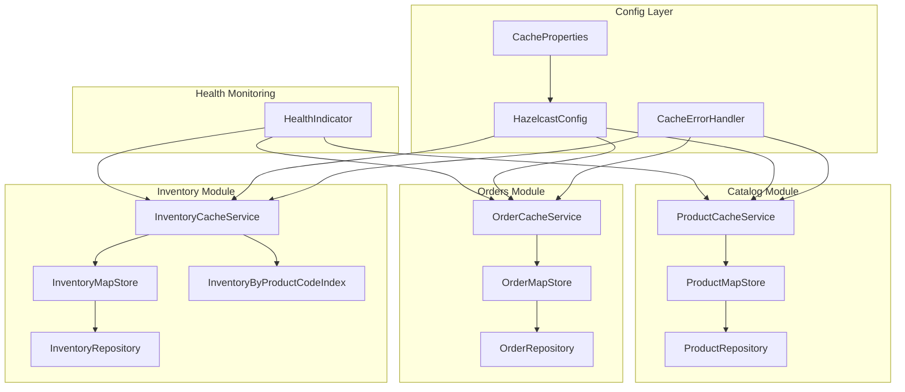

# Design Document

## Overview

This design outlines a comprehensive cache optimization strategy for the Spring Boot modular monolith e-commerce application. The optimization focuses on improving Hazelcast-based distributed caching infrastructure through lazy initialization, health check optimization, index cache implementation, batch query support, module boundary strengthening, and enhanced test validation. The design builds upon existing cache patterns while introducing performance optimizations and architectural improvements that maintain module isolation and follow Spring Modulith principles.

## Steering Document Alignment

### Technical Standards (tech.md)

The design adheres to documented technical patterns:
- **Spring Modulith Architecture**: Maintains clear module boundaries with event-driven communication
- **Data Isolation**: Each module manages its own cache and database schema (catalog, orders, inventory)
- **Configuration Externalization**: Leverages Spring Boot's configuration properties pattern
- **Testing Strategy**: Follows existing test patterns with JUnit 5, Spring Boot Test, and TestContainers
- **Java 21 Standards**: Utilizes modern Java features while maintaining compatibility

### Project Structure (structure.md)

Implementation follows established project organization:
- **Module Organization**: Cache components remain within their respective modules (catalog/cache/, orders/cache/, inventory/cache/)
- **Configuration Layer**: Global cache configurations in config/ package
- **Public APIs**: Cross-module access through defined API components only
- **Test Structure**: Maintains module-specific test patterns with @ApplicationModuleTest

## Code Reuse Analysis

### Existing Components to Leverage

- **AbstractCacheService**: Base cache service providing common functionality, error handling, and circuit breaker pattern
- **CacheErrorHandler**: Centralized error handling with configurable thresholds and recovery mechanisms
- **CacheProperties**: Externalized configuration properties for cache behavior tuning
- **HazelcastConfig**: Main Hazelcast configuration with SpringManagedContext integration
- **MapStore Implementations**: Existing patterns in InventoryMapStore and ProductMapStore for write-through caching
- **Health Infrastructure**: Spring Boot Actuator integration with HealthIndicator interface
- **Repository Pattern**: JPA repository interfaces with findAllById support for batch operations

### Integration Points

- **Spring Boot Configuration**: Integration with @ConfigurationProperties and @ConditionalOnProperty
- **Spring Modulith Events**: Existing event-driven architecture for cross-module communication
- **Database Schema Management**: PostgreSQL with schema-per-module approach using Liquibase
- **Monitoring Integration**: Spring Actuator, Micrometer metrics, and OpenTelemetry tracing
- **Testing Framework**: TestContainers for integration tests, MockBean for unit tests

## Architecture

The cache optimization follows a layered architecture with clear separation of concerns:

1. **Configuration Layer**: Centralized cache configuration with externalized properties
2. **Service Layer**: Module-specific cache services extending AbstractCacheService
3. **MapStore Layer**: Write-through cache integration with database repositories
4. **Index Cache Layer**: Specialized caches for efficient lookups by alternate keys
5. **Health Monitoring Layer**: Non-intrusive health checks using local statistics
6. **Module Boundary Layer**: Enforced boundaries through @ApplicationModule and @NamedInterface

### Modular Design Principles

- **Single File Responsibility**: Each MapStore handles one entity type with specific key patterns
- **Component Isolation**: Cache services are isolated within their respective modules
- **Service Layer Separation**: Clear separation between cache operations, business logic, and data access
- **Utility Modularity**: Shared cache utilities in common module, domain-specific logic in module caches



## Components and Interfaces

### HazelcastConfig (Enhanced)
- **Purpose:** Central Hazelcast configuration with lazy MapStore initialization
- **Interfaces:**
  - `Config hazelcastConfiguration()` - Enhanced with lazy initialization mode
  - `String inventoryTimeToLiveSeconds()` - Externalized TTL property
- **Dependencies:** CacheProperties, ApplicationContext
- **Reuses:** Existing SpringManagedContext pattern, configuration property binding

### CacheProperties (Extended)
- **Purpose:** Centralized cache configuration properties
- **Interfaces:**
  - `int getInventoryTimeToLiveSeconds()` - New property for inventory TTL
  - All existing configuration getters/setters
- **Dependencies:** Spring Boot configuration binding
- **Reuses:** Existing @ConfigurationProperties pattern, validation annotations

### ProductMapStore (Enhanced)
- **Purpose:** Write-through cache for product entities with batch query support
- **Interfaces:**
  - `Map<String, ProductEntity> loadAll()` - Enhanced with batch repository queries
  - `ProductRepository#findByCodeIn()` - New batch query method
- **Dependencies:** ProductRepository (enhanced), SpringManagedContext
- **Reuses:** Existing MapStore pattern, Spring injection via @SpringAware

### OrderMapStore (Enhanced)
- **Purpose:** Write-through cache for order entities with batch query support
- **Interfaces:**
  - `Map<String, OrderEntity> loadAll()` - Enhanced with batch repository queries
  - `OrderRepository#findByOrderNumberIn()` - New batch query method
- **Dependencies:** OrderRepository (enhanced), SpringManagedContext
- **Reuses:** Existing MapStore pattern, Spring injection via @SpringAware

### InventoryMapStore (Enhanced)
- **Purpose:** Write-through cache for inventory entities with lazy initialization
- **Interfaces:**
  - `MapStoreConfig.InitialLoadMode.LAZY` - Configuration for lazy loading
  - Enhanced loadAll() with batch queries
- **Dependencies:** InventoryRepository, SpringManagedContext
- **Reuses:** Existing MapStore implementation, batch query pattern

### InventoryByProductCodeIndex (New)
- **Purpose:** Index cache for efficient product code to inventory ID mapping
- **Interfaces:**
  - `Optional<Long> findInventoryIdByProductCode(String productCode)` - O(1) lookup
  - `void updateIndex(String productCode, Long inventoryId)` - Bidirectional maintenance
  - `void removeFromIndex(String productCode)` - Index cleanup
- **Dependencies:** IMap<String, Long>, CacheErrorHandler
- **Reuses:** AbstractCacheService pattern, error handling infrastructure

### HealthConfig (Optimized)
- **Purpose:** Non-intrusive health monitoring using local statistics
- **Interfaces:**
  - `Health health()` - Uses getLocalMapStats() instead of size()
  - `boolean testBasicOperations()` - Configurable read-only mode
- **Dependencies:** All cache instances, CacheErrorHandler
- **Reuses:** Existing HealthIndicator pattern, local statistics API

### Repository Interfaces (Enhanced)
- **Purpose:** Support for batch queries to reduce database round trips
- **Interfaces:**
  - `ProductRepository#findByCodeIn(Collection<String> codes)` - Batch product lookup
  - `OrderRepository#findByOrderNumberIn(Collection<String> orderNumbers)` - Batch order lookup
- **Dependencies:** Spring Data JPA
- **Reuses:** Existing JPA repository pattern, Spring Data query derivation

## Data Models

### CacheProperties (Enhanced)
```java
@ConfigurationProperties(prefix = "bookstore.cache")
public class CacheProperties {
    // Existing properties...
    private int inventoryTimeToLiveSeconds = 1800; // Externalized TTL
    private boolean basicOperationsReadOnly = false; // Health check mode
    private boolean testBasicOperationsEnabled = true; // Health check toggle
}
```

### InventoryIndexEntry
```java
// Conceptual model for index cache entries
public class InventoryIndexEntry {
    private String productCode; // Key
    private Long inventoryId;   // Value - reference to main cache
    private long lastUpdated;   // Timestamp for cache coherency
}
```

### MapStoreConfiguration
```java
// Configuration model for MapStore lazy initialization
public class MapStoreConfiguration {
    private InitialLoadMode initialLoadMode = LAZY; // Prevent early loading
    private boolean springAwareEnabled = true;      // Enable Spring injection
    private int writeDelaySeconds = 0;              // Write-through mode
}
```

## Error Handling

### Error Scenarios

1. **MapStore Repository Unavailable During Startup**
   - **Handling:** Log at DEBUG level instead of WARN/ERROR, allow graceful degradation
   - **User Impact:** Cache operates in memory-only mode until repository becomes available

2. **Index Cache Inconsistency**
   - **Handling:** Automatic re-synchronization on next access, circuit breaker activation
   - **User Impact:** Temporary fallback to database queries, transparent to end users

3. **Batch Query Failures**
   - **Handling:** Partial result handling, individual query fallback for failed items
   - **User Impact:** Some cache misses may take longer but system remains functional

4. **Health Check Performance Impact**
   - **Handling:** Use local statistics only, avoid size() operations that trigger MapStore
   - **User Impact:** Health monitoring becomes non-intrusive with accurate cache metrics

### Circuit Breaker Integration

All cache operations integrate with the existing CacheErrorHandler circuit breaker:
- **Configurable Thresholds:** Environment-specific FAILURE_THRESHOLD and recovery timeouts
- **Graceful Degradation:** Automatic fallback to database when cache is unavailable
- **Error Classification:** DEBUG-level logging for expected startup scenarios, WARN/ERROR for unexpected failures

## Testing Strategy

### Unit Testing
- **MapStore Components:** Mock repository dependencies, test lazy initialization behavior
- **Cache Services:** Test index cache bidirectional maintenance, batch operation handling
- **Configuration Properties:** Validate externalized TTL configuration and property binding
- **Health Monitoring:** Test local statistics usage without triggering MapStore operations

### Integration Testing
- **Cache-Repository Integration:** TestContainers with PostgreSQL for realistic database interactions
- **Module Boundary Testing:** @ApplicationModuleTest to verify proper module isolation
- **Index Cache Consistency:** End-to-end tests for bidirectional cache maintenance
- **Batch Query Performance:** Integration tests comparing individual vs. batch repository operations

### End-to-End Testing
- **Cache Optimization Scenarios:** Complete workflows testing lazy initialization and index cache benefits
- **Health Check Validation:** Full application startup with health monitoring verification
- **Module Boundary Enforcement:** ModularityTests enhanced to validate new @NamedInterface boundaries
- **Performance Regression Testing:** Automated tests to ensure optimizations don't degrade existing functionality

### Test Coverage Requirements
- **100% Test Pass Rate:** All existing tests must continue to pass after optimizations
- **New Functionality Coverage:** All new cache features must have corresponding unit and integration tests
- **Module Boundary Validation:** ModularityTests must validate all new public API boundaries
- **Performance Test Maintenance:** Existing performance-sensitive tests must maintain or improve execution times