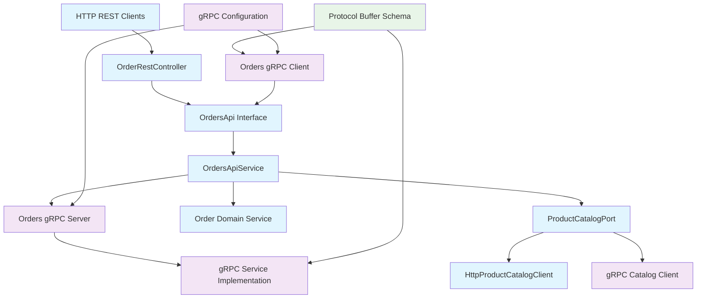
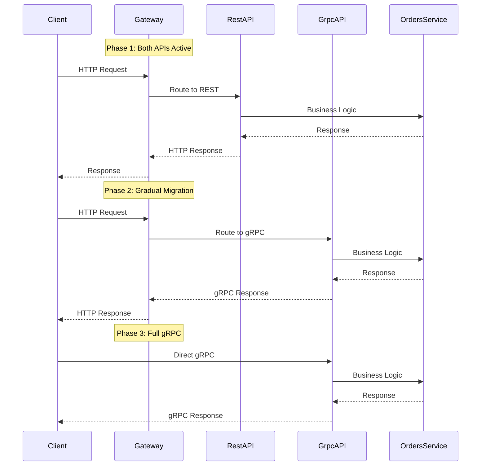

# Design Document - Monolith Orders gRPC Migration

## Overview

This design outlines the migration from HTTP-based communication to gRPC for Orders module interactions within the Spring Boot modular monolith. The implementation will maintain existing business logic while replacing REST endpoints and HTTP clients with gRPC services, ensuring backward compatibility and improved performance.

The design focuses on three main areas: gRPC server implementation in the Orders module, gRPC client implementation for inter-module communication, and Protocol Buffer schema definitions that mirror existing API contracts.

## Steering Document Alignment

### Technical Standards (tech.md)
The gRPC implementation aligns with Spring Boot best practices:
- **Dependency Injection**: gRPC services and clients will be managed as Spring beans with proper lifecycle management
- **Configuration Properties**: gRPC settings will follow Spring Boot's `@ConfigurationProperties` pattern similar to existing `ProductApiProperties`
- **Error Handling**: Consistent exception translation between gRPC status codes and existing Spring exception patterns
- **Observability**: Integration with existing Micrometer metrics and Spring Actuator health checks

### Project Structure
gRPC components will follow established module organization patterns:
- Protocol Buffer definitions in `src/main/proto/` following Maven conventions
- gRPC service implementations in respective module `infrastructure/grpc/` packages
- Configuration classes in existing `config/` packages alongside current configurations like `ProductClientConfiguration`
- Generated Protocol Buffer classes in `target/generated-sources/protobuf/java/`

## Code Reuse Analysis

### Existing Components to Leverage
- **OrdersApiService**: Complete business logic reuse - gRPC server will delegate to existing implementation
- **OrdersApi Interface**: Service contract will be preserved - gRPC implementation will implement this interface
- **ProductCatalogPort**: Port interface will be maintained - gRPC client will implement this port
- **Order Domain Objects**: Existing `Order`, `OrderItem`, `Customer` entities will remain unchanged
- **Exception Classes**: `OrderNotFoundException`, `InvalidOrderException` will be reused with gRPC status mapping
- **Configuration Patterns**: `ProductApiProperties` structure will be extended for gRPC settings
- **Resilience Patterns**: Existing `@CircuitBreaker` and `@Retry` annotations will be applied to gRPC clients

### Integration Points
- **Spring Modulith Event System**: gRPC operations will continue to publish domain events through existing event infrastructure
- **Database Layer**: No changes to JPA repositories or database schemas
- **Caching Layer**: Existing Hazelcast cache integration will remain unchanged
- **Monitoring Infrastructure**: gRPC metrics will integrate with existing Micrometer configuration
- **Security Context**: Authentication and authorization patterns will be preserved

## Architecture

The gRPC integration maintains the hexagonal architecture pattern with clear separation between domain, application, and infrastructure layers.



## Components and Interfaces

### Component 1: Protocol Buffer Schema
- **Purpose:** Define strongly-typed service contracts and message formats for Orders operations
- **Interfaces:**
  - `OrdersService` gRPC service with `CreateOrder`, `FindOrder`, `FindOrders` methods
  - Message types: `CreateOrderRequest`, `CreateOrderResponse`, `OrderDto`, `OrderView`
  - Nested messages: `Customer`, `OrderItem`, `OrderStatus`
- **Dependencies:** None (schema definition)
- **Reuses:** Mirrors existing API model classes structure and validation constraints

### Component 2: Orders gRPC Server Implementation
- **Purpose:** Expose Orders module functionality via gRPC while delegating to existing business logic
- **Interfaces:**
  - `OrdersGrpcService extends OrdersServiceGrpc.OrdersServiceImplBase`
  - Integration with Spring Boot lifecycle and error handling
- **Dependencies:** `OrdersApiService`, Protocol Buffer generated classes, gRPC server runtime
- **Reuses:** Complete delegation to `OrdersApiService` for all business operations, existing exception handling patterns

### Component 3: gRPC Configuration and Server Startup
- **Purpose:** Configure gRPC server with Spring Boot integration, health checks, and metrics
- **Interfaces:**
  - `GrpcServerConfiguration` with `@Configuration` annotation
  - `GrpcServerProperties` extending configuration properties pattern
- **Dependencies:** Spring Boot auto-configuration, Micrometer, Spring Actuator
- **Reuses:** Configuration patterns from `ProductClientConfiguration` and `ProductApiProperties`

### Component 4: Orders gRPC Client Implementation
- **Purpose:** Replace HTTP-based communication with gRPC for main application to Orders module calls
- **Interfaces:**
  - `OrdersGrpcClient` implementing existing client interface patterns
  - Connection management and resilience patterns
- **Dependencies:** gRPC client stubs, Protocol Buffer generated classes, Resilience4j
- **Reuses:** Same interface contracts as existing HTTP clients, identical timeout and retry configurations

### Component 5: Product Catalog gRPC Client Integration
- **Purpose:** Replace `HttpProductCatalogClient` with gRPC-based product validation while maintaining `ProductCatalogPort` contract
- **Interfaces:**
  - `GrpcProductCatalogClient implements ProductCatalogPort`
  - Same `validate(String productCode, BigDecimal price)` method signature
- **Dependencies:** Catalog module gRPC service, Protocol Buffer generated classes
- **Reuses:** Identical validation logic, price tolerance calculations, and exception handling from existing `HttpProductCatalogClient`

## Configuration and Properties

### gRPC Server Configuration
```java
@ConfigurationProperties(prefix = "grpc.server")
public record GrpcServerProperties(
    @DefaultValue("9090") int port,
    @DefaultValue("4MB") DataSize maxInboundMessageSize,
    @DefaultValue("PT30S") Duration keepAliveTime,
    @DefaultValue("PT5S") Duration keepAliveTimeout,
    @DefaultValue("true") boolean keepAliveWithoutCalls,
    @DefaultValue("PT60S") Duration maxConnectionIdle,
    @DefaultValue("true") boolean enableReflection,
    SecurityConfig security
) {

    public record SecurityConfig(
        @DefaultValue("false") boolean tlsEnabled,
        String certChainPath,
        String privateKeyPath,
        String trustCertCollectionPath
    ) {}
}
```

### gRPC Client Configuration
```java
@ConfigurationProperties(prefix = "grpc.client.orders")
public record GrpcClientProperties(
    @DefaultValue("localhost:9090") String address,
    @DefaultValue("PT5S") Duration deadline,
    @DefaultValue("PT2S") Duration connectTimeout,
    @DefaultValue("PT30S") Duration keepAliveTime,
    @DefaultValue("true") boolean keepAliveWithoutCalls,
    @DefaultValue("4MB") DataSize maxInboundMessageSize,
    SecurityConfig security,
    RetryConfig retry
) {

    public record RetryConfig(
        @DefaultValue("3") int maxAttempts,
        @DefaultValue("PT1S") Duration initialBackoff,
        @DefaultValue("PT10S") Duration maxBackoff,
        @DefaultValue("2.0") double multiplier
    ) {}
}
```

### Application Properties Examples
```properties
# gRPC Server Configuration
grpc.server.port=9090
grpc.server.max-inbound-message-size=4MB
grpc.server.keep-alive-time=30s
grpc.server.security.tls-enabled=false

# gRPC Client Configuration
grpc.client.orders.address=localhost:9090
grpc.client.orders.deadline=5s
grpc.client.orders.connect-timeout=2s
grpc.client.orders.retry.max-attempts=3
grpc.client.orders.retry.initial-backoff=1s

# Production TLS Configuration
grpc.server.security.tls-enabled=true
grpc.server.security.cert-chain-path=/etc/certs/server.pem
grpc.server.security.private-key-path=/etc/certs/server.key
```

## Parallel Operation Strategy

### Migration Phases


### Configuration Switching
- **Feature Flags**: Use Spring profiles to control gRPC vs HTTP routing
- **Load Balancing**: Configure percentage-based traffic routing
- **Fallback Mechanism**: HTTP endpoints remain available as fallback during gRPC issues

## Security Configuration

### TLS Encryption
```java
@Configuration
@ConditionalOnProperty(value = "grpc.server.security.tls-enabled", havingValue = "true")
public class GrpcSecurityConfiguration {

    @Bean
    public NettyChannelBuilder secureChannelBuilder(GrpcClientProperties properties) {
        return NettyChannelBuilder.forAddress(properties.address())
            .sslContext(buildSslContext(properties.security()))
            .build();
    }

    @Bean
    public NettyServerBuilder secureServerBuilder(GrpcServerProperties properties) {
        return NettyServerBuilder.forPort(properties.port())
            .sslContext(buildServerSslContext(properties.security()))
            .build();
    }
}
```

### Authentication Integration
```java
@Component
public class GrpcAuthenticationInterceptor implements ServerInterceptor {

    @Override
    public <ReqT, RespT> ServerCall.Listener<ReqT> interceptCall(
            ServerCall<ReqT, RespT> call,
            Metadata headers,
            ServerCallHandler<ReqT, RespT> next) {

        // Extract authentication token from metadata
        String token = headers.get(Metadata.Key.of("authorization", ASCII_STRING_MARSHALLER));

        // Validate token and set security context
        SecurityContext context = validateToken(token);
        SecurityContextHolder.setContext(context);

        return next.startCall(call, headers);
    }
}

## Data Models

### Protocol Buffer Messages
```protobuf
// CreateOrderRequest message
message CreateOrderRequest {
  Customer customer = 1;
  string delivery_address = 2;
  OrderItem item = 3;
}

// Customer nested message
message Customer {
  string name = 1;
  string email = 2;
  string phone = 3;
}

// OrderItem nested message
message OrderItem {
  string code = 1;
  string name = 2;
  double price = 3;
  int32 quantity = 4;
}

// OrderDto response message
message OrderDto {
  string order_number = 1;
  Customer customer = 2;
  string delivery_address = 3;
  OrderItem item = 4;
  OrderStatus status = 5;
  string created_at = 6;
}
```

### Message Mapping Strategy
- **Java Records → Proto Messages**: Direct field mapping with type conversion (BigDecimal → double, LocalDateTime → string)
- **Validation**: Business validation remains in Java layer, Proto schema provides structure validation
- **Backward Compatibility**: Optional fields and default values ensure schema evolution capability

### Schema Evolution Strategy
```protobuf
// Version 1.0 - Initial schema
message OrderItem {
  string code = 1;
  string name = 2;
  double price = 3;
  int32 quantity = 4;
}

// Version 1.1 - Backward compatible evolution
message OrderItem {
  string code = 1;
  string name = 2;
  double price = 3;
  int32 quantity = 4;
  // New optional fields for backward compatibility
  optional string category = 5;
  optional double discount_percentage = 6;
  optional bool is_digital = 7;
}
```

**Evolution Rules**:
- Never change field numbers for existing fields
- Use `optional` for all new fields with sensible defaults
- Deprecated fields remain in schema with `[deprecated = true]` option
- Version compatibility tested with automated protobuf compatibility checks

## Performance Validation

### Benchmarking Strategy
```java
@Component
public class GrpcPerformanceMonitor {

    private final MeterRegistry meterRegistry;
    private final Timer grpcRequestTimer;
    private final Timer httpRequestTimer;

    public void recordGrpcLatency(String operation, Duration duration) {
        Timer.Sample.stop(Timer.builder("grpc.request.duration")
            .tag("operation", operation)
            .register(meterRegistry));
    }

    public void comparePerformance() {
        // Target: gRPC should be ≤ HTTP response time
        // Measurement: 99th percentile latency comparison
        Duration grpcP99 = grpcRequestTimer.percentile(0.99);
        Duration httpP99 = httpRequestTimer.percentile(0.99);

        if (grpcP99.compareTo(httpP99) > 0) {
            log.warn("gRPC performance degradation detected: {} vs {}", grpcP99, httpP99);
        }
    }
}
```

### Performance Targets
- **Latency**: gRPC operations ≤ 100ms (95th percentile) vs current HTTP baseline
- **Throughput**: Support same concurrent request volume as existing HTTP clients
- **Resource Usage**: Memory overhead <10% increase, CPU utilization comparable
- **Serialization**: Protocol Buffer serialization should be 2-3x faster than JSON for complex objects

## Monitoring and Observability

### Metrics Integration
```java
@Configuration
public class GrpcMetricsConfiguration {

    @Bean
    public ServerInterceptor metricsServerInterceptor(MeterRegistry meterRegistry) {
        return new GrpcMetricsServerInterceptor(meterRegistry);
    }

    @Bean
    public ClientInterceptor metricsClientInterceptor(MeterRegistry meterRegistry) {
        return new GrpcMetricsClientInterceptor(meterRegistry);
    }
}
```

### Health Check Integration
```java
@Component
public class GrpcHealthIndicator implements HealthIndicator {

    private final OrdersServiceStub ordersStub;

    @Override
    public Health health() {
        try {
            // Perform gRPC health check call
            HealthCheckResponse response = ordersStub
                .withDeadlineAfter(5, SECONDS)
                .check(HealthCheckRequest.newBuilder().build());

            return response.getStatus() == ServingStatus.SERVING
                ? Health.up().withDetail("grpc.orders", "Available").build()
                : Health.down().withDetail("grpc.orders", "Unavailable").build();
        } catch (Exception e) {
            return Health.down(e).withDetail("grpc.orders", "Error").build();
        }
    }
}
```

### Log Correlation
```java
@Component
public class GrpcTracingInterceptor implements ServerInterceptor {

    @Override
    public <ReqT, RespT> ServerCall.Listener<ReqT> interceptCall(
            ServerCall<ReqT, RespT> call, Metadata headers, ServerCallHandler<ReqT, RespT> next) {

        // Extract trace context from gRPC metadata
        String traceId = headers.get(Metadata.Key.of("x-trace-id", ASCII_STRING_MARSHALLER));

        // Set MDC for consistent logging
        MDC.put("traceId", traceId);
        MDC.put("grpc.method", call.getMethodDescriptor().getFullMethodName());

        return next.startCall(call, headers);
    }
}
```

## Error Handling

### Error Scenarios
1. **Order Not Found (404 equivalent)**
   - **Handling:** Convert `OrderNotFoundException` to `Status.NOT_FOUND` with descriptive message
   - **User Impact:** gRPC client receives NOT_FOUND status, maintains existing error handling behavior

2. **Invalid Order Data (400 equivalent)**
   - **Handling:** Convert `InvalidOrderException` to `Status.INVALID_ARGUMENT` with validation details
   - **User Impact:** Same validation messages as current REST API, consistent error experience

3. **Product Validation Failure (422 equivalent)**
   - **Handling:** Convert catalog validation errors to `Status.FAILED_PRECONDITION` with product details
   - **User Impact:** Preserve existing price mismatch and product not found error messages

4. **Service Unavailable (503 equivalent)**
   - **Handling:** Circuit breaker activation converts to `Status.UNAVAILABLE` with retry hints
   - **User Impact:** Client-side retry logic matches current HTTP client behavior

5. **gRPC Connection Failures**
   - **Handling:** Connection pooling and automatic retry with exponential backoff
   - **User Impact:** Transparent failover with logging for operational visibility

### Exception Translation Framework
```java
// Centralized exception mapping
@Component
public class GrpcExceptionMapper {
    public StatusRuntimeException mapToGrpcException(Exception ex) {
        return switch (ex) {
            case OrderNotFoundException onf -> Status.NOT_FOUND
                .withDescription(onf.getMessage())
                .asRuntimeException();
            case InvalidOrderException ioe -> Status.INVALID_ARGUMENT
                .withDescription(ioe.getMessage())
                .asRuntimeException();
            default -> Status.INTERNAL
                .withDescription("Internal server error")
                .asRuntimeException();
        };
    }
}
```

## Testing Strategy

### Unit Testing Framework
```java
// gRPC Service Unit Tests
@ExtendWith(MockitoExtension.class)
class OrdersGrpcServiceTest {

    @Mock
    private OrdersApiService ordersApiService;

    @Mock
    private GrpcExceptionMapper exceptionMapper;

    @InjectMocks
    private OrdersGrpcService grpcService;

    @Test
    void shouldCreateOrderSuccessfully() {
        // Test service delegation and proto message mapping
        CreateOrderRequest request = CreateOrderRequest.newBuilder()
            .setCustomer(Customer.newBuilder().setName("Test").build())
            .build();

        when(ordersApiService.createOrder(any())).thenReturn(mockResponse);

        CreateOrderResponse response = grpcService.createOrder(request);

        assertThat(response.getOrderNumber()).isEqualTo("ORD-123");
    }
}
```

### Integration Testing with TestContainers
```java
@SpringBootTest
@Testcontainers
class GrpcIntegrationTest {

    @Container
    static PostgreSQLContainer<?> postgres = new PostgreSQLContainer<>("postgres:15")
        .withDatabaseName("bookstore")
        .withUsername("test")
        .withPassword("test");

    @TestConfiguration
    static class TestConfig {
        @Bean
        @Primary
        public GrpcServerProperties testGrpcProperties() {
            return new GrpcServerProperties(
                0, // Random port for testing
                DataSize.ofMegabytes(1),
                Duration.ofSeconds(10),
                Duration.ofSeconds(5),
                true,
                Duration.ofSeconds(30),
                true,
                new GrpcServerProperties.SecurityConfig(false, null, null, null)
            );
        }
    }

    @Test
    void shouldHandleFullGrpcFlow() {
        // Test complete gRPC flow with real database
        OrdersServiceGrpc.OrdersServiceBlockingStub stub = createGrpcStub();

        CreateOrderRequest request = buildTestOrderRequest();
        CreateOrderResponse response = stub.createOrder(request);

        assertThat(response.getOrderNumber()).startsWith("ORD-");
    }
}
```

### gRPC-Specific Testing Tools
```java
// In-process gRPC server for testing
@TestMethodOrder(OrderAnnotation.class)
class GrpcServerTest {

    @RegisterExtension
    static final GrpcServerExtension grpcServerExtension = GrpcServerExtension.builder()
        .addService(new OrdersGrpcService(ordersApiService, exceptionMapper))
        .build();

    @Test
    @Order(1)
    void shouldStartGrpcServerSuccessfully() {
        OrdersServiceGrpc.OrdersServiceBlockingStub stub = grpcServerExtension.getStub();

        // Test server startup and basic connectivity
        assertThatCode(() -> stub.findOrders(FindOrdersRequest.getDefaultInstance()))
            .doesNotThrowAnyException();
    }
}
```

### Performance Testing
```java
@Component
public class GrpcPerformanceTest {

    @Test
    void shouldMeetPerformanceTargets() {
        // Load testing with concurrent gRPC calls
        int concurrentUsers = 100;
        int requestsPerUser = 10;

        StopWatch stopWatch = new StopWatch();
        stopWatch.start();

        CompletableFuture<Void>[] futures = IntStream.range(0, concurrentUsers)
            .mapToObj(i -> CompletableFuture.runAsync(this::performGrpcCalls))
            .toArray(CompletableFuture[]::new);

        CompletableFuture.allOf(futures).join();
        stopWatch.stop();

        Duration totalTime = Duration.ofMillis(stopWatch.getTotalTimeMillis());
        double avgLatency = totalTime.toMillis() / (double)(concurrentUsers * requestsPerUser);

        // Assert performance targets
        assertThat(avgLatency).isLessThan(100.0); // <100ms average
    }
}
```

### Schema Compatibility Testing
```java
@Test
void shouldMaintainBackwardCompatibility() {
    // Test Protocol Buffer schema evolution
    byte[] oldFormatMessage = createV1OrderMessage();
    byte[] newFormatMessage = createV2OrderMessage();

    // V2 service should handle V1 messages
    OrderDto oldParsed = OrderDto.parseFrom(oldFormatMessage);
    OrderDto newParsed = OrderDto.parseFrom(newFormatMessage);

    assertThat(oldParsed.getOrderNumber()).isNotEmpty();
    assertThat(newParsed.getOrderNumber()).isNotEmpty();

    // New fields should have default values in old messages
    assertThat(oldParsed.hasNewField()).isFalse();
    assertThat(newParsed.hasNewField()).isTrue();
}
```

### End-to-End Migration Testing
```java
@SpringBootTest(webEnvironment = RANDOM_PORT)
class MigrationCompatibilityTest {

    @Test
    void shouldProduceSameResultsViaHttpAndGrpc() {
        // Test identical requests through both HTTP and gRPC
        CreateOrderRequest httpRequest = buildHttpOrderRequest();
        CreateOrderRequest grpcRequest = buildGrpcOrderRequest();

        // Execute via HTTP REST API
        ResponseEntity<CreateOrderResponse> httpResponse =
            restTemplate.postForEntity("/api/orders", httpRequest, CreateOrderResponse.class);

        // Execute via gRPC API
        CreateOrderResponse grpcResponse = grpcStub.createOrder(grpcRequest);

        // Compare results
        assertThat(httpResponse.getBody().getOrderNumber())
            .matches("ORD-\\d{6}");
        assertThat(grpcResponse.getOrderNumber())
            .matches("ORD-\\d{6}");

        // Verify both orders exist in database
        assertThat(orderRepository.findByOrderNumber(httpResponse.getBody().getOrderNumber()))
            .isPresent();
        assertThat(orderRepository.findByOrderNumber(grpcResponse.getOrderNumber()))
            .isPresent();
    }
}
```