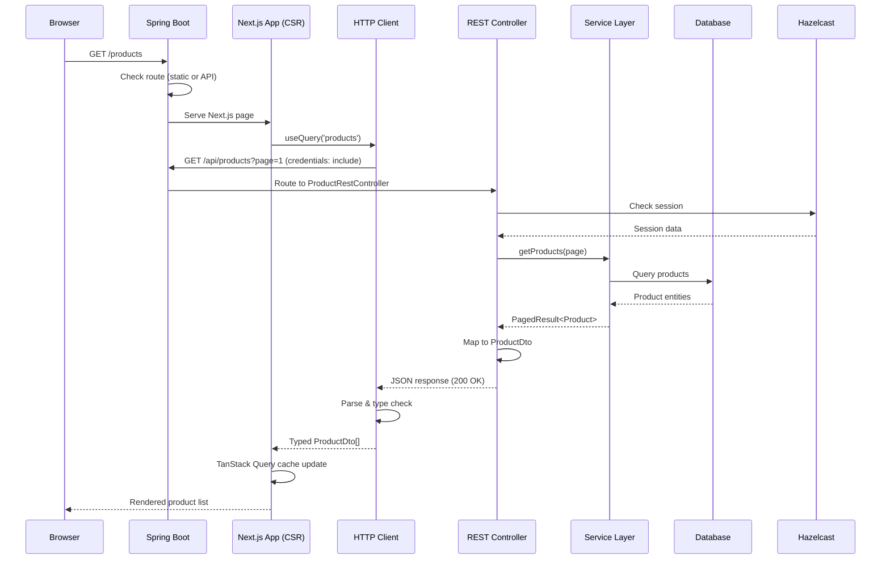
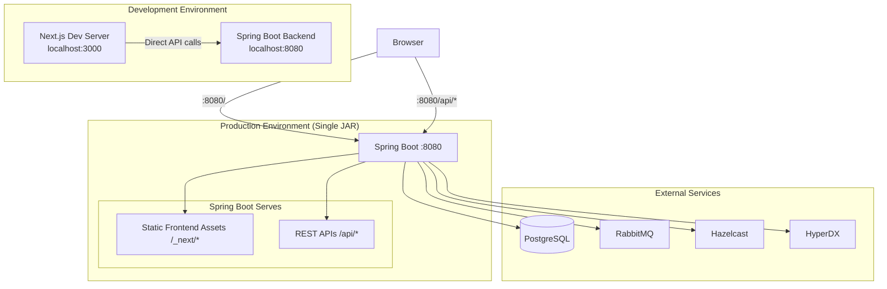
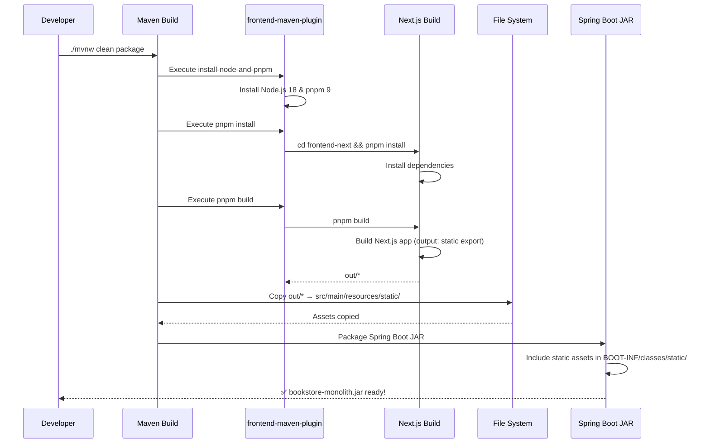

# Design Document: Next.js Frontend Integration

## Overview

This design document defines the technical architecture for integrating a Next.js 14 frontend application with the Spring Boot modular monolith backend. The integration creates a unified full-stack bookstore application using Next.js App Router with client-side rendering, maintaining clear separation between frontend (served by Spring Boot) and backend APIs.

### Key Design Goals
- **Seamless API Integration**: Type-safe communication between Next.js frontend and Spring Boot REST APIs
- **Development Independence**: Frontend and backend can be developed, tested, and deployed independently  
- **Production Efficiency**: Spring Boot serves optimized static assets alongside API endpoints
- **Type Safety**: End-to-end type safety from database to UI through OpenAPI-generated types
- **Session Management**: Distributed session handling via Hazelcast for stateful cart operations
- **Maven Integration**: Single JAR deployment with embedded frontend assets

## Steering Document Alignment

### Technical Standards (tech.md)
- **Backend**: Spring Boot 3.5.5, Java 21, Spring Modulith 1.4.3
- **Frontend**: Next.js 14 (App Router), TypeScript strict mode, React 18
- **API Contract**: OpenAPI 3.0 with Springdoc OpenAPI
- **Build System**: Maven with frontend-maven-plugin for Next.js build
- **Session Store**: Hazelcast for distributed HTTP sessions

### Project Structure (structure.md)
- **Backend Modules**: `src/main/java/com/sivalabs/bookstore/{catalog,orders,inventory,notifications,web}`
- **Frontend Location**: `frontend-next/` directory (Next.js 14 App Router)
- **Build Outputs**: `frontend-next/out/` for static export
- **Static Assets**: `src/main/resources/static/` for embedded frontend in JAR
- **OpenAPI Config**: `src/main/java/com/sivalabs/bookstore/config/OpenApiConfig.java`

## Code Reuse Analysis

### Existing Components to Leverage

#### Backend Components
- **REST Controllers**: ProductRestController, CartRestController, OrdersRestController
- **OpenAPI Configuration**: OpenApiConfig.java, Springdoc with API groups
- **Session Management**: HttpSession with Hazelcast, CartUtil helpers

#### Frontend Components (To Be Created)
- **HTTP Client**: `src/lib/api/client.ts` - fetch-based with credentials
- **TanStack Query**: React Query for server state management  
- **MSW Mocks**: Mock Service Worker in `src/mocks/`
- **Feature Modules**: `src/app/{products,cart,orders}/` using App Router

### Integration Points
- **OpenAPI Endpoint**: `/api-docs` (backend serves JSON spec)
- **Type Generation**: `openapi-typescript` generates `openapi.d.ts`
- **CORS**: Development only for `localhost:3000`
- **Static Assets**: Spring Boot serves from `src/main/resources/static/`
- **API Routes**: Backend handles `/api/*`, frontend handles other routes

## Authentication and Authorization Strategy

### Phase 1: Anonymous Sessions Only
Uses anonymous sessions for cart management without user authentication per Requirement 12.

**Session Flow**:
1. User visits → Spring Boot creates anonymous session → Cookie sent
2. Cart operations use session ID via `credentials: 'include'`
3. Session stored in Hazelcast (30 min timeout)

### Phase 2: User Authentication (Future)
- Session-based auth with username/password
- Protected routes with Next.js middleware
- Spring Security form login

## Architecture

### Component Interaction Diagram



### System Architecture Diagram



### Build and Deployment Flow



## Components and Interfaces

### Component 0: OpenAPI Configuration

**Purpose**: Configure and expose OpenAPI specification for frontend type generation

**Implementation**: Backend OpenAPI configuration (already exists in codebase)

**Existing Configuration**: `src/main/java/com/sivalabs/bookstore/config/OpenApiConfig.java`

```java
@Configuration
public class OpenApiConfig {
    @Bean
    public GroupedOpenApi catalogApi() {
        return GroupedOpenApi.builder()
            .group("catalog")
            .pathsToMatch("/api/products/**")
            .build();
    }

    @Bean
    public GroupedOpenApi cartApi() {
        return GroupedOpenApi.builder()
            .group("cart")
            .pathsToMatch("/api/cart/**")
            .build();
    }

    @Bean
    public GroupedOpenApi ordersApi() {
        return GroupedOpenApi.builder()
            .group("orders")
            .pathsToMatch("/api/orders/**")
            .build();
    }
}
```

**API Endpoints**:
- **OpenAPI Specification**: `GET /api-docs` - Returns OpenAPI 3.0 JSON specification
- **Swagger UI**: `GET /swagger-ui.html` - Interactive API documentation
- **API Groups**: Separate documentation for catalog, cart, and orders modules

**Frontend Integration**:
- Frontend runs `pnpm gen:types` to fetch from `/api-docs`
- Generated types match backend DTOs exactly (ProductDto, CartDto, OrderDto, PagedResult)
- Changes to backend REST controllers automatically reflected in OpenAPI spec via Springdoc runtime generation

**Reuses**: Existing Springdoc OpenAPI dependency and configuration in backend

---

### Component 1: Maven Frontend Build Integration

**Purpose**: Integrate Next.js build into Maven lifecycle

**Implementation**: `pom.xml` (add to existing file)

```xml
<plugin>
    <groupId>com.github.eirslett</groupId>
    <artifactId>frontend-maven-plugin</artifactId>
    <version>1.15.0</version>
    <configuration>
        <workingDirectory>frontend-next</workingDirectory>
        <installDirectory>${project.build.directory}</installDirectory>
    </configuration>
    <executions>
        <execution>
            <id>install node and pnpm</id>
            <goals><goal>install-node-and-pnpm</goal></goals>
            <configuration>
                <nodeVersion>v18.19.0</nodeVersion>
                <pnpmVersion>9.0.0</pnpmVersion>
            </configuration>
        </execution>
        <execution>
            <id>pnpm install</id>
            <goals><goal>pnpm</goal></goals>
            <configuration>
                <arguments>install --frozen-lockfile</arguments>
            </configuration>
        </execution>
        <execution>
            <id>pnpm build</id>
            <goals><goal>pnpm</goal></goals>
            <configuration>
                <arguments>build</arguments>
            </configuration>
        </execution>
    </executions>
</plugin>

<plugin>
    <artifactId>maven-resources-plugin</artifactId>
    <version>3.3.1</version>
    <executions>
        <execution>
            <id>copy-frontend-static</id>
            <phase>process-classes</phase>
            <goals><goal>copy-resources</goal></goals>
            <configuration>
                <outputDirectory>${project.build.outputDirectory}/static</outputDirectory>
                <resources>
                    <resource>
                        <directory>frontend-next/out</directory>
                        <filtering>false</filtering>
                    </resource>
                </resources>
            </configuration>
        </execution>
    </executions>
</plugin>
```

**Next.js Configuration**: `frontend-next/next.config.js`

```javascript
/** @type {import('next').NextConfig} */
const nextConfig = {
  output: 'export',
  images: { unoptimized: true },
  basePath: process.env.NODE_ENV === 'production' ? '' : '',
  trailingSlash: true,
}
module.exports = nextConfig
```

**Reuses**: Existing Maven build, Spring Boot packaging

### Component 2: CORS Configuration (Development Only)

**Purpose**: Enable cross-origin requests during development

**Implementation**: `src/main/java/com/sivalabs/bookstore/config/CorsConfig.java`

```java
package com.sivalabs.bookstore.config;

import org.springframework.context.annotation.Configuration;
import org.springframework.context.annotation.Profile;
import org.springframework.web.servlet.config.annotation.CorsRegistry;
import org.springframework.web.servlet.config.annotation.WebMvcConfigurer;

@Configuration
@Profile("dev")
public class CorsConfig implements WebMvcConfigurer {
    @Override
    public void addCorsMappings(CorsRegistry registry) {
        registry.addMapping("/api/**")
            .allowedOrigins("http://localhost:3000")
            .allowedMethods("GET", "POST", "PUT", "DELETE", "OPTIONS")
            .allowedHeaders("*")
            .allowCredentials(true)
            .maxAge(3600);
    }
}
```

**Reuses**: Existing Spring Web MVC configuration

### Component 3: Next.js HTTP Client with TanStack Query

**Purpose**: Type-safe API calls with React Query

**Implementation**: `src/lib/api/client.ts`

```typescript
const API_BASE_URL = process.env.NEXT_PUBLIC_API_URL || (
  process.env.NODE_ENV === 'production' ? '' : 'http://localhost:8080'
);

export class HttpError extends Error {
  constructor(public status: number, message: string, public details?: unknown) {
    super(message);
    this.name = 'HttpError';
  }
}

// Session expiration detection
const handleSessionExpiration = (status: number) => {
  if (status === 401 || status === 403) {
    // Detect session expiration and prompt user
    const shouldRefresh = confirm(
      'Your session has expired. Please refresh the page to continue.'
    );
    if (shouldRefresh) {
      window.location.reload();
    }
    return true;
  }
  return false;
};

export const apiClient = {
  async get<T = unknown>(path: string, init?: RequestInit): Promise<T> {
    const res = await fetch(`${API_BASE_URL}${path}`, {
      ...init,
      credentials: 'include',
      headers: { 'Accept': 'application/json', ...init?.headers },
    });
    if (!res.ok) {
      // Check for session expiration
      if (handleSessionExpiration(res.status)) {
        throw new HttpError(res.status, 'Session expired', { sessionExpired: true });
      }

      const error = await res.json().catch(() => ({ message: res.statusText }));
      throw new HttpError(res.status, error.message || res.statusText, error);
    }
    return res.json();
  },

  async post<T = unknown>(path: string, body?: unknown, init?: RequestInit): Promise<T> {
    const res = await fetch(`${API_BASE_URL}${path}`, {
      method: 'POST',
      headers: {
        'Content-Type': 'application/json',
        'Accept': 'application/json',
        ...init?.headers,
      },
      credentials: 'include',
      body: body ? JSON.stringify(body) : undefined,
      ...init,
    });
    if (!res.ok) {
      if (handleSessionExpiration(res.status)) {
        throw new HttpError(res.status, 'Session expired', { sessionExpired: true });
      }

      const error = await res.json().catch(() => ({ message: res.statusText }));
      throw new HttpError(res.status, error.message || res.statusText, error);
    }
    return res.status === 204 ? (undefined as T) : res.json();
  },

  async put<T = unknown>(path: string, body?: unknown, init?: RequestInit): Promise<T> {
    const res = await fetch(`${API_BASE_URL}${path}`, {
      method: 'PUT',
      headers: {
        'Content-Type': 'application/json',
        'Accept': 'application/json',
        ...init?.headers,
      },
      credentials: 'include',
      body: body ? JSON.stringify(body) : undefined,
      ...init,
    });
    if (!res.ok) {
      if (handleSessionExpiration(res.status)) {
        throw new HttpError(res.status, 'Session expired', { sessionExpired: true });
      }

      const error = await res.json().catch(() => ({ message: res.statusText }));
      throw new HttpError(res.status, error.message || res.statusText, error);
    }
    return res.json();
  },

  async delete<T = unknown>(path: string, init?: RequestInit): Promise<T> {
    const res = await fetch(`${API_BASE_URL}${path}`, {
      method: 'DELETE',
      credentials: 'include',
      ...init,
    });
    if (!res.ok) {
      if (handleSessionExpiration(res.status)) {
        throw new HttpError(res.status, 'Session expired', { sessionExpired: true });
      }

      const error = await res.json().catch(() => ({ message: res.statusText }));
      throw new HttpError(res.status, error.message || res.statusText, error);
    }
    return res.status === 204 ? (undefined as T) : res.json();
  },
};
```

**Reuses**: None (new Next.js implementation)

### Component 4: OpenAPI Type Generation

**Purpose**: Generate TypeScript types from OpenAPI spec

**Implementation**: `frontend-next/package.json`

```json
{
  "scripts": {
    "gen:types": "openapi-typescript http://localhost:8080/api-docs -o src/lib/types/openapi.d.ts"
  },
  "devDependencies": {
    "openapi-typescript": "^7.0.0"
  }
}
```

**Reuses**: Backend OpenAPI endpoint

### Component 5: TanStack Query Hooks

**Purpose**: Type-safe React Query hooks

**Implementation**: `src/lib/hooks/use-products.ts`

```typescript
import { useQuery, useMutation, useQueryClient } from '@tanstack/react-query';
import { apiClient } from '@/lib/api/client';
import type { paths } from '@/lib/types/openapi';

type ProductsResponse = paths['/api/products']['get']['responses']['200']['content']['application/json'];
type ProductResponse = paths['/api/products/{code}']['get']['responses']['200']['content']['application/json'];

export function useProducts(page: number = 1) {
  return useQuery({
    queryKey: ['products', page],
    queryFn: () => apiClient.get<ProductsResponse>(`/api/products?page=${page}`),
    staleTime: 1000 * 60 * 5,
  });
}

export function useProduct(code: string) {
  return useQuery({
    queryKey: ['product', code],
    queryFn: () => apiClient.get<ProductResponse>(`/api/products/${code}`),
    enabled: !!code,
  });
}
```

**Cart Hook**: `src/lib/hooks/use-cart.ts`

```typescript
import { useQuery, useMutation, useQueryClient } from '@tanstack/react-query';
import { apiClient } from '@/lib/api/client';
import type { paths } from '@/lib/types/openapi';

type CartResponse = paths['/api/cart']['get']['responses']['200']['content']['application/json'];
type AddToCartRequest = paths['/api/cart/items']['post']['requestBody']['content']['application/json'];

export function useCart() {
  const queryClient = useQueryClient();

  const cart = useQuery({
    queryKey: ['cart'],
    queryFn: () => apiClient.get<CartResponse>('/api/cart'),
    staleTime: 1000 * 30,
  });

  const addItem = useMutation({
    mutationFn: (item: AddToCartRequest) =>
      apiClient.post<CartResponse>('/api/cart/items', item),
    onSuccess: () => queryClient.invalidateQueries({ queryKey: ['cart'] }),
  });

  const updateQuantity = useMutation({
    mutationFn: ({ code, quantity }: { code: string; quantity: number }) =>
      apiClient.put<CartResponse>(`/api/cart/items/${code}`, { quantity }),
    onSuccess: () => queryClient.invalidateQueries({ queryKey: ['cart'] }),
  });

  const removeItem = useMutation({
    mutationFn: (code: string) => apiClient.delete(`/api/cart/items/${code}`),
    onSuccess: () => queryClient.invalidateQueries({ queryKey: ['cart'] }),
  });

  return { cart, addItem, updateQuantity, removeItem };
}
```

**Orders Hook**: `src/lib/hooks/use-orders.ts`

```typescript
import { useQuery, useMutation, useQueryClient } from '@tanstack/react-query';
import { apiClient } from '@/lib/api/client';
import type { paths } from '@/lib/types/openapi';

type OrdersResponse = paths['/api/orders']['get']['responses']['200']['content']['application/json'];
type OrderResponse = paths['/api/orders/{orderNumber}']['get']['responses']['200']['content']['application/json'];
type CreateOrderRequest = paths['/api/orders']['post']['requestBody']['content']['application/json'];
type CreateOrderResponse = paths['/api/orders']['post']['responses']['201']['content']['application/json'];

// PagedResult type helper
type PagedResult<T> = {
  data: T[];
  totalElements: number;
  pageNumber: number;
  totalPages: number;
  isFirst: boolean;
  isLast: boolean;
  hasNext: boolean;
  hasPrevious: boolean;
};

export function useOrders(page: number = 1, pageSize: number = 10) {
  return useQuery({
    queryKey: ['orders', page, pageSize],
    queryFn: () => apiClient.get<PagedResult<OrderResponse>>(
      `/api/orders?page=${page}&pageSize=${pageSize}`
    ),
    staleTime: 1000 * 60 * 2, // 2 minutes
  });
}

export function useOrder(orderNumber: string) {
  return useQuery({
    queryKey: ['order', orderNumber],
    queryFn: () => apiClient.get<OrderResponse>(`/api/orders/${orderNumber}`),
    enabled: !!orderNumber,
  });
}

export function useCreateOrder() {
  const queryClient = useQueryClient();

  return useMutation({
    mutationFn: (request: CreateOrderRequest) =>
      apiClient.post<CreateOrderResponse>('/api/orders', request),
    onSuccess: () => {
      queryClient.invalidateQueries({ queryKey: ['orders'] });
      queryClient.invalidateQueries({ queryKey: ['cart'] });
    },
  });
}
```

**Pagination Handling Pattern**:

```typescript
// Example usage in a component
function OrdersPage() {
  const [page, setPage] = useState(1);
  const { data, isLoading, error } = useOrders(page, 10);

  if (isLoading) return <LoadingSpinner />;
  if (error) return <ErrorMessage error={error} />;

  return (
    <div>
      <OrderList orders={data.data} />
      <Pagination
        currentPage={data.pageNumber}
        totalPages={data.totalPages}
        hasNext={data.hasNext}
        hasPrevious={data.hasPrevious}
        onPageChange={setPage}
      />
    </div>
  );
}
```

**Reuses**: OpenAPI types, API client

### Component 6: Query Provider Setup

**Purpose**: Configure TanStack Query for Next.js

**Implementation**: `src/app/providers.tsx`

```typescript
'use client';

import { QueryClient, QueryClientProvider } from '@tanstack/react-query';
import { ReactQueryDevtools } from '@tanstack/react-query-devtools';
import { useState } from 'react';

export function Providers({ children }: { children: React.ReactNode }) {
  const [queryClient] = useState(
    () =>
      new QueryClient({
        defaultOptions: {
          queries: {
            staleTime: 1000 * 60 * 5,
            retry: 1,
            refetchOnWindowFocus: false,
          },
          mutations: { retry: 1 },
        },
      })
  );

  return (
    <QueryClientProvider client={queryClient}>
      {children}
      <ReactQueryDevtools initialIsOpen={false} />
    </QueryClientProvider>
  );
}
```

**Root Layout**: `src/app/layout.tsx`

```typescript
import { Providers } from './providers';

export default function RootLayout({ children }: { children: React.ReactNode }) {
  return (
    <html lang="en">
      <body>
        <Providers>{children}</Providers>
      </body>
    </html>
  );
}
```

**Reuses**: None (new Next.js setup)

**Cross-Tab Synchronization**: `src/lib/hooks/use-broadcast-sync.ts`

To ensure cart updates are reflected across multiple browser tabs, implement cross-tab synchronization using Broadcast Channel API:

```typescript
'use client';

import { useEffect } from 'react';
import { useQueryClient } from '@tanstack/react-query';

export function useBroadcastSync() {
  const queryClient = useQueryClient();

  useEffect(() => {
    // Check if Broadcast Channel API is supported
    if (typeof BroadcastChannel === 'undefined') {
      console.warn('Broadcast Channel API not supported, cross-tab sync disabled');
      return;
    }

    const channel = new BroadcastChannel('bookstore-sync');

    // Listen for sync messages from other tabs
    channel.onmessage = (event) => {
      if (event.data.type === 'CART_UPDATED') {
        queryClient.invalidateQueries({ queryKey: ['cart'] });
      }
    };

    // Broadcast cart updates to other tabs
    const broadcastCartUpdate = () => {
      channel.postMessage({ type: 'CART_UPDATED', timestamp: Date.now() });
    };

    // Subscribe to cart mutations
    const unsubscribe = queryClient.getMutationCache().subscribe((mutation) => {
      if (mutation?.state.status === 'success' &&
          mutation?.options.mutationKey?.[0] === 'cart') {
        broadcastCartUpdate();
      }
    });

    return () => {
      unsubscribe();
      channel.close();
    };
  }, [queryClient]);
}
```

**Integration in Root Layout**:

```typescript
// src/app/layout.tsx
import { Providers } from './providers';
import { BroadcastSyncProvider } from '@/lib/providers/broadcast-sync-provider';

export default function RootLayout({ children }: { children: React.ReactNode }) {
  return (
    <html lang="en">
      <body>
        <Providers>
          <BroadcastSyncProvider />
          {children}
        </Providers>
      </body>
    </html>
  );
}
```

```typescript
// src/lib/providers/broadcast-sync-provider.tsx
'use client';

import { useBroadcastSync } from '@/lib/hooks/use-broadcast-sync';

export function BroadcastSyncProvider() {
  useBroadcastSync();
  return null;
}
```

**Fallback for Unsupported Browsers**: For browsers that don't support Broadcast Channel API (e.g., older Safari versions), implement polling fallback:

```typescript
// Fallback: Poll cart every 30 seconds when other tabs might be active
useEffect(() => {
  if (typeof BroadcastChannel === 'undefined') {
    const interval = setInterval(() => {
      queryClient.invalidateQueries({ queryKey: ['cart'] });
    }, 30000); // 30 seconds
    return () => clearInterval(interval);
  }
}, [queryClient]);
```

**Reuses**: TanStack Query client, existing cart mutation hooks

---

### Component 7: Error Handling Infrastructure

**Purpose**: Provide comprehensive error handling with retry logic, timeouts, and error boundaries

**Implementation**: Error handling utilities and React components

**Error Boundary Component**: `src/components/error-boundary.tsx`

```typescript
'use client';

import React, { Component, ErrorInfo, ReactNode } from 'react';

interface Props {
  children: ReactNode;
  fallback?: (error: Error, retry: () => void) => ReactNode;
}

interface State {
  hasError: boolean;
  error: Error | null;
}

export class ErrorBoundary extends Component<Props, State> {
  constructor(props: Props) {
    super(props);
    this.state = { hasError: false, error: null };
  }

  static getDerivedStateFromError(error: Error): State {
    return { hasError: true, error };
  }

  componentDidCatch(error: Error, errorInfo: ErrorInfo) {
    console.error('ErrorBoundary caught error:', error, errorInfo);
    // Log to error tracking service (e.g., Sentry, HyperDX)
  }

  handleRetry = () => {
    this.setState({ hasError: false, error: null });
  };

  render() {
    if (this.state.hasError && this.state.error) {
      if (this.props.fallback) {
        return this.props.fallback(this.state.error, this.handleRetry);
      }

      return (
        <div className="error-container">
          <h2>Something went wrong</h2>
          <p>{this.state.error.message}</p>
          <button onClick={this.handleRetry}>Try Again</button>
        </div>
      );
    }

    return this.props.children;
  }
}
```

**HTTP Client with Timeout and Retry**: Update `src/lib/api/client.ts`

```typescript
const API_TIMEOUT = 10000; // 10 seconds

export const apiClient = {
  async get<T = unknown>(path: string, init?: RequestInit): Promise<T> {
    const controller = new AbortController();
    const timeoutId = setTimeout(() => controller.abort(), API_TIMEOUT);

    try {
      const res = await fetch(`${API_BASE_URL}${path}`, {
        ...init,
        signal: controller.signal,
        credentials: 'include',
        headers: { 'Accept': 'application/json', ...init?.headers },
      });

      clearTimeout(timeoutId);

      if (!res.ok) {
        const error = await res.json().catch(() => ({ message: res.statusText }));
        throw new HttpError(res.status, error.message || res.statusText, error);
      }

      return res.json();
    } catch (err) {
      clearTimeout(timeoutId);

      if (err instanceof DOMException && err.name === 'AbortError') {
        throw new HttpError(408, 'Request timeout. Please try again.', { timeout: API_TIMEOUT });
      }

      throw err;
    }
  },
  // ... other methods with same timeout logic
};
```

**TanStack Query Retry Configuration**: Update `src/app/providers.tsx`

```typescript
export function Providers({ children }: { children: React.ReactNode }) {
  const [queryClient] = useState(
    () =>
      new QueryClient({
        defaultOptions: {
          queries: {
            staleTime: 1000 * 60 * 5,
            retry: (failureCount, error) => {
              // Don't retry on 4xx errors except 408 (timeout)
              if (error instanceof HttpError) {
                if (error.status >= 400 && error.status < 500 && error.status !== 408) {
                  return false;
                }
              }
              // Retry up to 3 times for network errors and 5xx
              return failureCount < 3;
            },
            retryDelay: (attemptIndex) => Math.min(1000 * 2 ** attemptIndex, 30000),
            refetchOnWindowFocus: false,
          },
          mutations: {
            retry: 1, // Retry mutations once
            retryDelay: 1000,
          },
        },
      })
  );

  return (
    <QueryClientProvider client={queryClient}>
      {children}
      <ReactQueryDevtools initialIsOpen={false} />
    </QueryClientProvider>
  );
}
```

**Error Display Component**: `src/components/error-message.tsx`

```typescript
'use client';

import { HttpError } from '@/lib/api/client';

interface ErrorMessageProps {
  error: unknown;
  onRetry?: () => void;
}

export function ErrorMessage({ error, onRetry }: ErrorMessageProps) {
  const getMessage = () => {
    if (error instanceof HttpError) {
      // 4xx: Show specific error from backend
      if (error.status >= 400 && error.status < 500) {
        return error.message;
      }
      // 5xx: Show generic error with error ID
      if (error.status >= 500) {
        return `Something went wrong. Please try again later. (Error ${error.status})`;
      }
    }

    if (error instanceof Error) {
      if (error.message.includes('Failed to fetch') || error.message.includes('NetworkError')) {
        return 'Unable to connect. Please check your internet connection.';
      }
      return error.message;
    }

    return 'An unexpected error occurred.';
  };

  const isRetryable = () => {
    if (error instanceof HttpError) {
      // Allow retry for timeout, network errors, and 5xx
      return error.status === 408 || error.status >= 500 || error.status === 503;
    }
    return true; // Allow retry for network errors
  };

  return (
    <div className="error-message" role="alert">
      <p>{getMessage()}</p>
      {onRetry && isRetryable() && (
        <button onClick={onRetry} className="retry-button">
          Retry
        </button>
      )}
    </div>
  );
}
```

**Usage in Components**:

```typescript
function ProductsPage() {
  const { data, error, isLoading, refetch } = useProducts(1);

  if (error) return <ErrorMessage error={error} onRetry={refetch} />;
  if (isLoading) return <LoadingSpinner />;

  return <ProductList products={data.data} />;
}
```

**Reuses**: HTTP client, TanStack Query, OpenAPI types

---

### Component 8: MSW Mock Infrastructure

**Purpose**: Provide OpenAPI-aligned mocks for frontend development without backend dependency

**Implementation**: Mock Service Worker handlers matching OpenAPI specification

**MSW Setup**: `src/mocks/browser.ts`

```typescript
import { setupWorker } from 'msw/browser';
import { handlers } from './handlers';

export const worker = setupWorker(...handlers);
```

**Mock Handlers**: `src/mocks/handlers.ts`

```typescript
import { http, HttpResponse, delay } from 'msw';
import type { paths } from '@/lib/types/openapi';

// Type-safe response types from OpenAPI
type ProductsResponse = paths['/api/products']['get']['responses']['200']['content']['application/json'];
type ProductResponse = paths['/api/products/{code}']['get']['responses']['200']['content']['application/json'];
type CartResponse = paths['/api/cart']['get']['responses']['200']['content']['application/json'];
type OrdersResponse = paths['/api/orders']['get']['responses']['200']['content']['application/json'];

// Mock data that matches backend DTOs
const mockProducts = [
  { code: 'BOOK-001', name: 'Clean Code', description: 'A Handbook of Agile Software Craftsmanship', imageUrl: '/images/clean-code.jpg', price: 29.99 },
  { code: 'BOOK-002', name: 'Design Patterns', description: 'Elements of Reusable Object-Oriented Software', imageUrl: '/images/design-patterns.jpg', price: 39.99 },
  // ... more realistic products
];

export const handlers = [
  // Products API
  http.get('/api/products', async ({ request }) => {
    await delay(300); // Simulate network latency
    const url = new URL(request.url);
    const page = parseInt(url.searchParams.get('page') || '1');
    const pageSize = parseInt(url.searchParams.get('pageSize') || '10');

    const startIndex = (page - 1) * pageSize;
    const endIndex = startIndex + pageSize;
    const paginatedProducts = mockProducts.slice(startIndex, endIndex);

    return HttpResponse.json<ProductsResponse>({
      data: paginatedProducts,
      totalElements: mockProducts.length,
      pageNumber: page,
      totalPages: Math.ceil(mockProducts.length / pageSize),
      isFirst: page === 1,
      isLast: endIndex >= mockProducts.length,
      hasNext: endIndex < mockProducts.length,
      hasPrevious: page > 1,
    });
  }),

  http.get('/api/products/:code', async ({ params }) => {
    await delay(200);
    const product = mockProducts.find(p => p.code === params.code);

    if (!product) {
      return new HttpResponse(null, { status: 404 });
    }

    return HttpResponse.json<ProductResponse>(product);
  }),

  // Cart API
  http.get('/api/cart', async () => {
    await delay(200);
    return HttpResponse.json<CartResponse>({
      items: [
        { code: 'BOOK-001', name: 'Clean Code', price: 29.99, quantity: 1 },
      ],
      totalAmount: 29.99,
      itemCount: 1,
    });
  }),

  http.post('/api/cart/items', async ({ request }) => {
    await delay(300);
    const body = await request.json();
    // Validate against OpenAPI schema if needed
    return HttpResponse.json<CartResponse>({
      items: [
        { code: 'BOOK-001', name: 'Clean Code', price: 29.99, quantity: 1 },
        body as any, // Add new item
      ],
      totalAmount: 59.98,
      itemCount: 2,
    });
  }),

  http.put('/api/cart/items/:code', async ({ params, request }) => {
    await delay(200);
    const body = await request.json();
    return HttpResponse.json<CartResponse>({
      items: [
        { code: params.code as string, name: 'Clean Code', price: 29.99, quantity: (body as any).quantity },
      ],
      totalAmount: 29.99 * (body as any).quantity,
      itemCount: 1,
    });
  }),

  http.delete('/api/cart/items/:code', async () => {
    await delay(200);
    return new HttpResponse(null, { status: 204 });
  }),

  // Orders API
  http.get('/api/orders', async ({ request }) => {
    await delay(300);
    const url = new URL(request.url);
    const page = parseInt(url.searchParams.get('page') || '1');

    return HttpResponse.json<OrdersResponse>({
      data: [
        {
          orderNumber: 'ORD-001',
          status: 'DELIVERED',
          customer: { name: 'John Doe', email: 'john@example.com', phone: '+1234567890' },
          deliveryAddress: '123 Main St',
          items: [{ code: 'BOOK-001', name: 'Clean Code', price: 29.99, quantity: 1 }],
          createdAt: new Date().toISOString(),
        },
      ],
      totalElements: 1,
      pageNumber: page,
      totalPages: 1,
      isFirst: true,
      isLast: true,
      hasNext: false,
      hasPrevious: false,
    });
  }),

  http.post('/api/orders', async ({ request }) => {
    await delay(500);
    const body = await request.json();

    return HttpResponse.json({
      orderNumber: `ORD-${Date.now()}`,
      status: 'PROCESSING',
      ...(body as any),
      createdAt: new Date().toISOString(),
    }, { status: 201 });
  }),

  // Error scenarios for testing
  http.get('/api/products/ERROR-500', async () => {
    await delay(200);
    return new HttpResponse(
      JSON.stringify({ message: 'Internal Server Error' }),
      { status: 500 }
    );
  }),
];
```

**MSW Initialization**: `src/app/layout.tsx`

```typescript
import { MSWProvider } from '@/lib/providers/msw-provider';

export default function RootLayout({ children }: { children: React.ReactNode }) {
  return (
    <html lang="en">
      <body>
        <MSWProvider>
          <Providers>{children}</Providers>
        </MSWProvider>
      </body>
    </html>
  );
}
```

**Conditional MSW Provider**: `src/lib/providers/msw-provider.tsx`

```typescript
'use client';

import { useEffect, useState } from 'react';

export function MSWProvider({ children }: { children: React.ReactNode }) {
  const [mswReady, setMswReady] = useState(false);

  useEffect(() => {
    // Only enable MSW in development if USE_MOCKS=true
    if (
      process.env.NODE_ENV === 'development' &&
      process.env.NEXT_PUBLIC_USE_MOCKS === 'true'
    ) {
      import('@/mocks/browser').then(({ worker }) => {
        worker.start({
          onUnhandledRequest: 'bypass', // Don't warn for unhandled requests
        });
        setMswReady(true);
      });
    } else {
      setMswReady(true);
    }
  }, []);

  if (!mswReady) {
    return <div>Loading mocks...</div>;
  }

  return <>{children}</>;
}
```

**Environment Configuration**: `.env.local` (for development)

```env
# Enable MSW mocks (set to 'false' to use real backend)
NEXT_PUBLIC_USE_MOCKS=true

# Backend URL (used when mocks disabled)
NEXT_PUBLIC_API_URL=http://localhost:8080
```

**Testing with MSW**: `src/__tests__/products.test.tsx`

```typescript
import { render, screen } from '@testing-library/react';
import { QueryClient, QueryClientProvider } from '@tanstack/react-query';
import { server } from '@/mocks/server'; // Node.js server for tests
import { ProductsPage } from '@/app/products/page';

beforeAll(() => server.listen());
afterEach(() => server.resetHandlers());
afterAll(() => server.close());

test('displays products from MSW', async () => {
  const queryClient = new QueryClient();

  render(
    <QueryClientProvider client={queryClient}>
      <ProductsPage />
    </QueryClientProvider>
  );

  expect(await screen.findByText('Clean Code')).toBeInTheDocument();
  expect(await screen.findByText('Design Patterns')).toBeInTheDocument();
});
```

**MSW Server for Tests**: `src/mocks/server.ts`

```typescript
import { setupServer } from 'msw/node';
import { handlers } from './handlers';

export const server = setupServer(...handlers);
```

**OpenAPI Schema Validation** (optional): Use `openapi-typescript-validator` to ensure mock responses match schema:

```typescript
import { validateResponse } from 'openapi-typescript-validator';
import openapiSpec from '@/lib/types/openapi.json'; // Export JSON from backend

// In handler
const response = { /* mock data */ };
const isValid = validateResponse(response, openapiSpec, '/api/products', 'get', 200);
if (!isValid) {
  console.warn('Mock response does not match OpenAPI schema');
}
```

**Reuses**: OpenAPI types, HTTP client structure, realistic backend DTO formats

---

## Data Models

All DTOs defined in backend, types generated for frontend:

- **ProductDto**: code, name, description, imageUrl, price
- **CartDto**: items[], totalAmount, itemCount
- **OrderDto**: orderNumber, status, customer, deliveryAddress, items[], createdAt
- **PagedResult<T>**: data[], totalElements, pageNumber, totalPages, isFirst, isLast, hasNext, hasPrevious

## Development Workflow

### Local Development Setup

**Prerequisites**:
- Java 21+, Maven 3.8+
- Node.js 18+, pnpm 9.0+
- Docker and Docker Compose
- Running PostgreSQL, RabbitMQ, and HyperDX services

### Backend Development

**Start Backend Services**:

```bash
# Start all backend services (PostgreSQL, RabbitMQ, HyperDX)
task start

# Or manually using Docker Compose
docker compose up -d
```

**Run Spring Boot Backend**:

```bash
# Development mode with DevTools (auto-restart on changes)
./mvnw spring-boot:run -Dspring-boot.run.profiles=dev

# Backend available at http://localhost:8080
# OpenAPI docs at http://localhost:8080/swagger-ui.html
```

**Spring Boot DevTools Features**:
- Automatic restart on classpath changes
- LiveReload support for browser refresh
- Property overrides for development
- Faster restart than full application restart

### Frontend Development

**Initial Setup**:

```bash
# Navigate to frontend directory
cd frontend-next

# Install dependencies
pnpm install

# Generate TypeScript types from backend OpenAPI spec
# (Requires backend running on localhost:8080)
pnpm gen:types
```

**Development Server**:

```bash
# Start Next.js dev server (with hot reload)
cd frontend-next
pnpm dev

# Frontend available at http://localhost:3000
# Auto-reloads on file changes
```

**Environment Configuration**:

Create `frontend-next/.env.local`:

```env
# Use MSW mocks (no backend required)
NEXT_PUBLIC_USE_MOCKS=true

# Or use real backend
NEXT_PUBLIC_USE_MOCKS=false
NEXT_PUBLIC_API_URL=http://localhost:8080
```

**Hot Module Replacement (HMR)**:
- Next.js automatically detects file changes
- Browser updates without full page reload
- Fast Refresh preserves component state
- Instant feedback during development

### Integrated Development (Both Running)

**Terminal 1 - Backend**:
```bash
task start  # Starts all services
./mvnw spring-boot:run -Dspring-boot.run.profiles=dev
```

**Terminal 2 - Frontend**:
```bash
cd frontend-next
pnpm dev
```

**Workflow**:
1. Frontend dev server runs on `localhost:3000` with HMR
2. Backend runs on `localhost:8080` with DevTools
3. CORS enabled in dev profile allows cross-origin requests
4. Frontend calls backend APIs with `credentials: 'include'` for session cookies
5. Changes to frontend code trigger HMR (instant)
6. Changes to backend code trigger DevTools restart (~2-3 seconds)

### Mock-Driven Development (Frontend Only)

**Start with Mocks**:

```bash
cd frontend-next

# Enable MSW mocks
export NEXT_PUBLIC_USE_MOCKS=true

# Start dev server
pnpm dev
```

**Switch to Real Backend**:

```bash
# Disable mocks
export NEXT_PUBLIC_USE_MOCKS=false

# Or edit .env.local
# NEXT_PUBLIC_USE_MOCKS=false

# Restart dev server
pnpm dev
```

**MSW Indicators**:
- Console log: `[MSW] Mocking enabled`
- Network tab shows requests intercepted by Service Worker
- Responses have `x-powered-by: msw` header (visible in DevTools)

### Type Generation Workflow

**When to Regenerate Types**:
- After backend API changes (new endpoints, modified DTOs)
- After pulling latest backend code
- Before starting new frontend feature development

**Regenerate Process**:

```bash
# 1. Ensure backend is running
curl http://localhost:8080/api-docs  # Should return OpenAPI JSON

# 2. Generate types
cd frontend-next
pnpm gen:types

# 3. Verify types updated
git diff src/lib/types/openapi.d.ts

# 4. Fix TypeScript errors if DTOs changed
pnpm type-check
```

### Testing Workflows

**Frontend Unit Tests**:

```bash
cd frontend-next

# Run tests with MSW
pnpm test

# Watch mode for TDD
pnpm test:watch

# Coverage report
pnpm test:coverage
```

**Backend Tests**:

```bash
# Run all tests
task test

# Or using Maven
./mvnw clean verify
```

**E2E Tests** (future):

```bash
# Start backend
task start
./mvnw spring-boot:run

# Run Playwright tests
cd frontend-next
pnpm test:e2e
```

### Build and Production Testing

**Local Production Build**:

```bash
# Build entire application (backend + frontend)
./mvnw clean package

# Run production JAR
java -jar target/bookstore-monolith-*.jar

# Application serves both frontend and backend at http://localhost:8080
# Frontend at http://localhost:8080/
# API at http://localhost:8080/api/*
```

**Frontend-Only Production Build**:

```bash
cd frontend-next

# Build static export
pnpm build

# Preview production build
pnpm start  # Serves from out/ directory
```

### Troubleshooting

**Backend not starting**:
- Check PostgreSQL/RabbitMQ running: `docker compose ps`
- Check logs: `docker compose logs -f`
- Verify port 8080 not in use: `lsof -i :8080`

**Frontend can't connect to backend**:
- Verify CORS enabled: Check `@Profile("dev")` in CorsConfig
- Check NEXT_PUBLIC_API_URL in .env.local
- Verify backend running: `curl http://localhost:8080/actuator/health`

**Type generation fails**:
- Ensure backend running on localhost:8080
- Check OpenAPI endpoint: `curl http://localhost:8080/api-docs`
- Verify openapi-typescript version: `pnpm list openapi-typescript`

**MSW not intercepting requests**:
- Check browser console for `[MSW] Mocking enabled` log
- Verify NEXT_PUBLIC_USE_MOCKS=true in environment
- Clear Service Worker: DevTools → Application → Service Workers → Unregister
- Hard refresh: Cmd+Shift+R (Mac) or Ctrl+Shift+R (Windows)

**Session not persisting**:
- Verify credentials: 'include' in fetch calls
- Check browser allows third-party cookies (dev mode)
- Inspect cookies: DevTools → Application → Cookies → localhost:8080

---

## Error Handling

### Error Scenarios

1. **Backend Unreachable**: Display "Unable to connect" with retry
2. **4xx Errors**: Show specific backend error message
3. **5xx Errors**: Show generic "Something went wrong" message
4. **Session Timeout**: Detect and prompt page refresh
5. **Type Generation Failure**: Clear error with backend start instructions

## Testing Strategy

### Unit Testing
- **Frontend**: HTTP client, Query hooks, Components (Vitest, Testing Library, MSW)
- **Backend**: Existing REST controller and service tests

### Integration Testing
- Full user flows with Testcontainers + Playwright
- API contract validation

### End-to-End Testing
- Happy path, error handling, session persistence
- Browser compatibility (Playwright)

## Production Considerations

### Build Optimization
- Next.js static export with optimized builds
- Bundle size <500KB gzipped
- Spring Boot serves with 1-year cache for immutable assets

### Session Management
- Hazelcast distributed sessions (30 min timeout)
- HttpOnly, Secure, SameSite=Strict cookies

### Monitoring
- Backend: Micrometer, OpenTelemetry to HyperDX
- Frontend: Web Vitals (future)
- TanStack Query DevTools for debugging

### Security
- CORS disabled in production (same origin)
- HTTPS enforced via deployment platform
- Session cookies secured in production

### Scalability
- Stateless backend (sessions in Hazelcast)
- TanStack Query client-side caching
- Connection pooling (Hikari, max 10 per instance)
