# Design Document: Nuxt Frontend Integration

## Overview

This design document defines the technical architecture for integrating the Nuxt 3 frontend application with the Spring Boot modular monolith backend through an nginx reverse proxy. The integration creates a unified full-stack bookstore application while maintaining clear separation between frontend static assets (served by nginx) and backend APIs (served by Spring Boot).

### Key Design Goals
- **Seamless API Integration**: Type-safe communication between Nuxt frontend and Spring Boot REST APIs
- **Development Independence**: Frontend and backend can be developed, tested, and deployed independently
- **Production Efficiency**: Nginx serves optimized static assets while proxying API calls to backend
- **Type Safety**: End-to-end type safety from database to UI through OpenAPI-generated types
- **Session Management**: Distributed session handling via Hazelcast for stateful cart operations
- **Reverse Proxy Architecture**: Nginx webproxy handles routing and static asset serving

## Steering Document Alignment

### Technical Standards (tech.md)
- **Backend**: Spring Boot 3.5.5, Java 21, Spring Modulith 1.4.3
- **Frontend**: Nuxt 3, TypeScript strict mode, Vue 3
- **Reverse Proxy**: Nginx 1.29.2 with OpenTelemetry module
- **API Contract**: OpenAPI 3.0 with Springdoc OpenAPI
- **Build System**: Separate builds - pnpm for frontend, Maven for backend, Docker for nginx
- **Session Store**: Hazelcast for distributed HTTP sessions

### Project Structure (structure.md)
- **Backend Modules**: `src/main/java/com/sivalabs/bookstore/{catalog,orders,inventory,notifications,web}`
- **Frontend Location**: `frontend-nuxt/` directory (Nuxt 3 monorepo with apps/packages)
- **Nginx Config**: `webproxy/` directory with Dockerfile, nginx.conf, and static assets
- **Build Outputs**: `frontend-nuxt/apps/web/.output/` for Nuxt build, `webproxy/dist/` for nginx static files
- **OpenAPI Config**: `src/main/java/com/sivalabs/bookstore/config/OpenApiConfig.java`

## Code Reuse Analysis

### Existing Components to Leverage

#### Backend Components
- **REST Controllers**:
  - `ProductRestController` (`/api/products`) - catalog queries with OpenAPI annotations
  - `CartRestController` (`/api/cart`) - session-based cart management
  - `OrdersRestController` (`/api/orders`) - order creation and retrieval

- **OpenAPI Configuration**:
  - `OpenApiConfig.java` - provides programmatic OpenAPI customization
  - Springdoc already configured with API groups (catalog, cart, orders)
  - Swagger UI available at `/swagger-ui.html`

- **Session Management**:
  - `HttpSession` used in `CartRestController` for stateful cart
  - Hazelcast distributed session store already configured
  - `CartUtil.getCart(session)` and `CartUtil.setCart(session, cart)` utilities

#### Frontend Components
- **HTTP Client**: `apps/web/lib/http.ts` - basic GET/POST client (needs enhancement)
- **Pinia**: Vue state management already configured (replaces TanStack Query)
- **MSW Mocks**: Mock Service Worker setup in `apps/web/mocks/` for API mocking (optional in Nuxt)
- **Feature Modules**: Existing structure in `apps/web/features/{books,cart,orders}/` or Nuxt pages/composables

### Integration Points
- **OpenAPI Endpoint**: `/api-docs` (backend serves JSON spec)
- **Type Generation**: `openapi-typescript` tool generates `openapi.d.ts` from spec
- **CORS**: Needed only for `localhost:3000` in development when running Nuxt dev server
- **Static Assets**: Nginx serves pre-built Nuxt static files from `/usr/share/nginx/html/dist/`
- **Reverse Proxy**: Nginx forwards `/api/*` requests to `monolith:8080`

## Authentication and Authorization Strategy

### Phase 1: Anonymous Sessions Only
The initial integration phase uses **anonymous sessions** for cart management without user authentication. This aligns with Requirement 12 which states "Full authentication (login/register) is marked for Phase 2; initial release uses anonymous sessions only."

**Session Flow**:
1. User visits application → Spring Boot creates anonymous session → Session ID cookie sent to browser
2. Cart operations use session ID automatically (via `credentials: 'include'`)
3. Session stored in Hazelcast for distribution across instances
4. Session timeout: 30 minutes

### Phase 2: User Authentication (Future)
Planned for future release:
- **Authentication Method**: Session-based authentication with username/password
- **Protected Routes**: Order history, user profile
- **Frontend Implementation**: Login/register pages, protected route guards
- **Backend Implementation**: Spring Security with form login

**Note**: Current design focuses on Phase 1 (anonymous sessions). Authentication details will be specified in a separate design document when Phase 2 begins.

## Architecture

### Component Interaction Diagram


### System Architecture Diagram


### Build and Deployment Flow

```mermaid
sequenceDiagram
    participant Dev as Developer
    participant Script as build.sh
    participant Nuxt as Nuxt Build
    participant FS as File System
    participant Docker as Docker Build
    participant Compose as Docker Compose

    Dev->>Script: ./build.sh
    Script->>Script: Verify Node.js & pnpm
    Script->>Nuxt: cd frontend-nuxt && pnpm install
    Nuxt->>Nuxt: Install dependencies
    Script->>Nuxt: pnpm build
    Nuxt->>Nuxt: Build static site (nuxt generate)
    Nuxt-->>Script: apps/web/.output/public/*
    Script->>FS: mkdir -p webproxy/dist
    Script->>FS: cp .output/public/* → webproxy/dist/
    FS-->>Script: Assets copied
    Script->>Docker: docker build webproxy -t webproxy:latest
    Docker->>Docker: Build nginx image with static assets
    Docker-->>Script: webproxy:latest image ready
    Script-->>Dev: ✅ Build complete!

    Dev->>Compose: docker compose up
    Compose->>Compose: Start nginx webproxy
    Compose->>Compose: Start monolith backend
    Compose-->>Dev: Services running on :8080
```



### API Type Generation Flow


## Components and Interfaces

### Component 1: Shell Script Build Orchestration

**Purpose**: Build frontend as static assets and copy to nginx webproxy directory

**Design Rationale**: Nuxt generates static HTML/CSS/JS that nginx serves directly. The build script orchestrates frontend build and asset copying to the webproxy directory for Docker build.

**Implementation**: `build.sh`

```bash
#!/bin/bash
set -e  # Exit immediately on error

echo "======================================"
echo "Building Nuxt Frontend"
echo "======================================"

cd frontend-nuxt

# Verify prerequisites
if ! command -v node &> /dev/null; then
    echo "❌ Error: Node.js is not installed"
    exit 1
fi

if ! command -v pnpm &> /dev/null; then
    echo "❌ Error: pnpm is not installed"
    echo "Install with: npm install -g pnpm"
    exit 1
fi

echo "📦 Installing frontend dependencies..."
pnpm install --frozen-lockfile

echo "🔨 Building Nuxt application (static generation)..."
pnpm generate

# Verify build output
if [ ! -d "apps/web/.output/public" ]; then
    echo "❌ Error: Frontend build failed - .output/public directory not found"
    exit 1
fi

echo "✅ Frontend build completed successfully"
cd ..

echo "======================================"
echo "Copying Frontend Assets to Webproxy"
echo "======================================"

# Create target directory
mkdir -p webproxy/dist

# Clean old assets
echo "🧹 Cleaning old frontend assets..."
rm -rf webproxy/dist/*

# Copy Nuxt static output
echo "📋 Copying static assets..."
cp -r frontend-nuxt/apps/web/.output/public/* webproxy/dist/

echo "✅ Frontend assets copied to webproxy/dist/"

echo "======================================"
echo "Building Webproxy Docker Image"
echo "======================================"

docker build -t webproxy:latest webproxy/

echo "======================================"
echo "✨ Build Complete!"
echo "======================================"
echo "🐳 Webproxy image: webproxy:latest"
echo "🚀 Run with: docker compose up"
```

**Additional Utility Scripts**:

`build-frontend-only.sh` (for frontend development):
```bash
#!/bin/bash
set -e

cd frontend-nuxt
pnpm install && pnpm generate
cd ..

mkdir -p webproxy/dist
rm -rf webproxy/dist/*
cp -r frontend-nuxt/apps/web/.output/public/* webproxy/dist/

echo "✅ Frontend built and copied to webproxy/dist/"
```

`clean.sh`:
```bash
#!/bin/bash
set -e

rm -rf frontend-nuxt/apps/web/.output
rm -rf frontend-nuxt/node_modules
rm -rf webproxy/dist
echo "✅ Build artifacts cleaned"
```

**Interfaces**:
- Input: Source code in `frontend-nuxt/`
- Output: Docker image `webproxy:latest` with static assets in `/usr/share/nginx/html/dist/`

**Dependencies**:
- Node.js 18+ (system prerequisite)
- pnpm 9.0+ (install via: `npm install -g pnpm`)
- Docker 20.10+ for image building
- Bash shell (Linux/macOS/Git Bash on Windows)

**Reuses**: Existing `webproxy/` directory with Dockerfile and nginx.conf

**CI/CD Integration**:
```yaml
# GitHub Actions example
- name: Setup Node.js
  uses: actions/setup-node@v3
  with:
    node-version: '18'
- name: Setup pnpm
  uses: pnpm/action-setup@v2
  with:
    version: 9
- name: Setup Docker Buildx
  uses: docker/setup-buildx-action@v2
- name: Make script executable
  run: chmod +x build.sh
- name: Build application
  run: ./build.sh
```

### Component 2: CORS Configuration (Development Only)

**Purpose**: Enable cross-origin requests when running Nuxt dev server separately from backend

**Note**: In production, CORS is not needed because nginx serves both frontend and proxies API requests.

**Implementation**: `src/main/java/com/sivalabs/bookstore/config/CorsConfig.java`

```java
@Configuration
@Profile("dev")
public class CorsConfig implements WebMvcConfigurer {

    @Override
    public void addCorsMappings(CorsRegistry registry) {
        registry.addMapping("/api/**")
            .allowedOrigins("http://localhost:3000")  // Nuxt dev server
            .allowedMethods("GET", "POST", "PUT", "DELETE", "OPTIONS")
            .allowedHeaders("*")
            .allowCredentials(true)
            .maxAge(3600);
    }
}
```

**Development Workflow**:
- Terminal 1: `cd frontend-nuxt && pnpm dev` (starts Nuxt on :3000)
- Terminal 2: `./mvnw spring-boot:run` (starts backend on :8080)
- Browser accesses `http://localhost:3000`, API calls go to `:8080`

**Interfaces**:
- Input: HTTP requests from `localhost:3000` (Nuxt dev server)
- Output: CORS headers in HTTP responses

**Dependencies**: Spring Web MVC, profile-based activation

**Reuses**: Existing Spring Web MVC configuration infrastructure

### Component 2.5: Session Cookie Configuration

**Purpose**: Secure HTTP session cookies for production environments

**Implementation**: `src/main/resources/application.properties`

```properties
# Session configuration
server.servlet.session.timeout=30m
server.servlet.session.cookie.name=BOOKSTORE_SESSION
server.servlet.session.cookie.http-only=true
server.servlet.session.cookie.secure=${USE_SECURE_COOKIES:false}
server.servlet.session.cookie.same-site=strict

# Hazelcast session store
spring.session.store-type=hazelcast
spring.session.hazelcast.map-name=spring:session:sessions
```

**Profile-Specific Configuration** (`application-prod.properties`):
```properties
USE_SECURE_COOKIES=true
server.servlet.session.cookie.domain=${FRONTEND_DOMAIN}
```

**Interfaces**:
- Input: HTTP requests with session cookies
- Output: Secure, HttpOnly session cookies

**Dependencies**: Spring Session, Hazelcast

**Reuses**: Existing Hazelcast configuration

### Component 3: Enhanced HTTP Client

**Purpose**: Provide type-safe API calls with error handling and session management

**Migration Strategy**: The existing `http.ts` returns `{ data: T }` wrapper. We will enhance it in-place to maintain backward compatibility initially, then migrate to direct return types.

**Current Implementation** (`apps/web/lib/http.ts`):
```typescript
export const client = {
  async GET<T = unknown>(path: string, init?: RequestInit): Promise<{ data: T }> {
    const res = await fetch(path, { ...init });
    if (!res.ok) throw new Error(`HTTP ${res.status}`);
    return { data: await res.json() };
  },
  // ... POST method
};
```

**Enhanced Implementation** (Phase 1 - Add alongside existing)

```typescript
// In production (nginx), use relative URLs to leverage reverse proxy
// In development, use full URL to backend
const API_BASE_URL = process.env.NUXT_PUBLIC_API_URL || (
  process.env.NODE_ENV === 'production' ? '' : 'http://localhost:8080'
);

export interface ApiError {
  status: number;
  message: string;
  details?: unknown;
}

export class HttpError extends Error {
  constructor(public status: number, message: string, public details?: unknown) {
    super(message);
    this.name = 'HttpError';
  }
}

export const client = {
  async GET<T = unknown>(path: string, init?: RequestInit): Promise<T> {
    const res = await fetch(`${API_BASE_URL}${path}`, {
      ...init,
      credentials: 'include', // Include session cookie
      headers: {
        'Accept': 'application/json',
        ...init?.headers,
      },
    });

    if (!res.ok) {
      const error = await res.json().catch(() => ({ message: res.statusText }));
      throw new HttpError(res.status, error.message || res.statusText, error);
    }

    return res.json();
  },

  async POST<T = unknown>(path: string, body?: unknown, init?: RequestInit): Promise<T> {
    const res = await fetch(`${API_BASE_URL}${path}`, {
      method: 'POST',
      headers: {
        'Content-Type': 'application/json',
        'Accept': 'application/json',
        ...init?.headers,
      },
      credentials: 'include',
      body: body ? JSON.stringify(body) : undefined,
      ...init,
    });

    if (!res.ok) {
      const error = await res.json().catch(() => ({ message: res.statusText }));
      throw new HttpError(res.status, error.message || res.statusText, error);
    }

    return res.status === 204 ? undefined : res.json();
  },

  async PUT<T = unknown>(path: string, body?: unknown, init?: RequestInit): Promise<T> {
    // Similar implementation to POST with method: 'PUT'
  },

  async DELETE<T = unknown>(path: string, init?: RequestInit): Promise<T> {
    // Similar implementation to GET with method: 'DELETE'
  },
};
```

**Interfaces**:
- Input: API path, request body (typed via OpenAPI)
- Output: Typed response data or HttpError

**Dependencies**: Fetch API, environment variables

**Reuses**: Existing `http.ts` structure, extends with credentials and error handling

### Component 4: OpenAPI Type Generation Script

**Purpose**: Generate TypeScript types from backend OpenAPI specification

**Implementation**: `frontend-nuxt/package.json` (updated scripts)

**Migration Note**: The existing script uses a YAML file (`docs/specs/api/openapi.yaml`). We will support both modes:

```json
{
  "scripts": {
    "gen:types": "openapi-typescript ${OPENAPI_SOURCE:-http://localhost:8080/api-docs} -o apps/web/lib/types/openapi.d.ts",
    "gen:types:local": "openapi-typescript http://localhost:8080/api-docs -o apps/web/lib/types/openapi.d.ts",
    "gen:types:spec": "openapi-typescript docs/specs/api/openapi.yaml -o apps/web/lib/types/openapi.d.ts"
  }
}
```

**Recommended Workflow**:
1. **Development**: Use `gen:types:local` - fetches live spec from running backend on :8080
2. **CI/CD**: Use `gen:types:spec` - uses committed OpenAPI YAML file
3. **Default**: Use `gen:types` - respects `OPENAPI_SOURCE` environment variable

**Note**: In development, type generation connects directly to `localhost:8080`. In production, types are generated during build time before the nginx container is created.

**Interfaces**:
- Input: OpenAPI JSON from `/api-docs` or YAML file
- Output: TypeScript definitions in `openapi.d.ts`

**Dependencies**: `openapi-typescript` package (already in devDependencies)

**Reuses**: Existing type generation workflow, adds HTTP endpoint support

### Component 5: API Composables with Generated Types

**Purpose**: Type-safe Nuxt composables for API calls using Pinia and $fetch

**Implementation**: `apps/web/composables/useProducts.ts` (Nuxt pattern)

```typescript
import type { paths } from '@/lib/types/openapi';

// Extract types from OpenAPI schema
type ProductsResponse = paths['/api/products']['get']['responses']['200']['content']['application/json'];
type ProductResponse = paths['/api/products/{code}']['get']['responses']['200']['content']['application/json'];

export const useProducts = () => {
  const products = ref<ProductsResponse | null>(null);
  const loading = ref(false);
  const error = ref<Error | null>(null);

  const fetchProducts = async (page: number = 1) => {
    loading.value = true;
    error.value = null;
    try {
      products.value = await $fetch<ProductsResponse>(`/api/products?page=${page}`, {
        credentials: 'include',
      });
    } catch (e) {
      error.value = e as Error;
    } finally {
      loading.value = false;
    }
  };

  return {
    products: readonly(products),
    loading: readonly(loading),
    error: readonly(error),
    fetchProducts,
  };
};

export const useProduct = (code: string) => {
  const product = ref<ProductResponse | null>(null);
  const loading = ref(false);
  const error = ref<Error | null>(null);

  const fetchProduct = async () => {
    loading.value = true;
    error.value = null;
    try {
      product.value = await $fetch<ProductResponse>(`/api/products/${code}`, {
        credentials: 'include',
      });
    } catch (e) {
      error.value = e as Error;
    } finally {
      loading.value = false;
    }
  };

  // Auto-fetch on mount
  onMounted(() => {
    fetchProduct();
  });

  return {
    product: readonly(product),
    loading: readonly(loading),
    error: readonly(error),
    refresh: fetchProduct,
  };
};
```

**Alternative with Pinia Store**: `apps/web/stores/products.ts`

```typescript
import { defineStore } from 'pinia';
import type { paths } from '@/lib/types/openapi';

type ProductsResponse = paths['/api/products']['get']['responses']['200']['content']['application/json'];

export const useProductsStore = defineStore('products', () => {
  const products = ref<ProductsResponse | null>(null);
  const loading = ref(false);
  const error = ref<Error | null>(null);

  async function fetchProducts(page: number = 1) {
    loading.value = true;
    error.value = null;
    try {
      products.value = await $fetch<ProductsResponse>(`/api/products?page=${page}`, {
        credentials: 'include',
      });
    } catch (e) {
      error.value = e as Error;
    } finally {
      loading.value = false;
    }
  }

  return { products, loading, error, fetchProducts };
});
```

**Interfaces**:
- Input: Query parameters (page, code, etc.)
- Output: Typed refs with loading/error states

**Dependencies**: Nuxt 3, Pinia, $fetch, generated OpenAPI types

**Reuses**: OpenAPI type generation, composables pattern from Nuxt

### Component 6: Nginx Configuration for Static Assets and Reverse Proxy

**Purpose**: Serve frontend static assets and proxy API requests to backend

**Design Rationale**: Nginx efficiently serves static files and acts as a reverse proxy for API calls, maintaining session cookies across the boundary.

**Implementation**: `webproxy/nginx.conf` (enhanced)

```nginx
load_module modules/ngx_otel_module.so;

user  nginx;
worker_processes  auto;

error_log  /var/log/nginx/error.log warn;
pid        /var/run/nginx.pid;

events {
    worker_connections  1024;
}

http {
    include       /etc/nginx/mime.types;
    default_type  application/octet-stream;

    sendfile        on;
    keepalive_timeout  65;
    gzip            on;
    gzip_types      text/plain text/css application/json application/javascript text/xml application/xml application/xml+rss text/javascript;

    log_format main '$remote_addr - $remote_user [$time_local] "$request" '
                    '$status $body_bytes_sent "$http_referer" '
                    '"$http_user_agent" "$http_x_forwarded_for"';

    # OpenTelemetry configuration
    otel_exporter {
        endpoint hyperdx:4317;
        header authorization ${HYPERDX_API_KEY};
    }
    otel_service_name nginx-webproxy;
    otel_trace on;
    otel_trace_context propagate;

    access_log /var/log/nginx/access.log main;

    server {
        listen 80;

        # Serve Nuxt static assets
        location / {
            root /usr/share/nginx/html/dist;
            try_files $uri $uri/ /index.html;

            # Cache static assets
            location ~* \.(js|css|png|jpg|jpeg|gif|ico|svg|woff|woff2|ttf|eot)$ {
                expires 1y;
                add_header Cache-Control "public, immutable";
            }

            # No cache for HTML files
            location ~* \.html$ {
                expires -1;
                add_header Cache-Control "no-store, no-cache, must-revalidate, proxy-revalidate, max-age=0";
            }
        }

        # Proxy API requests to monolith backend
        location /api/ {
            resolver 127.0.0.11 valid=10s;
            set $target http://monolith:8080;
            proxy_pass $target;
            proxy_set_header Host $http_host;
            proxy_set_header X-Real-IP $remote_addr;
            proxy_set_header X-Forwarded-For $proxy_add_x_forwarded_for;
            proxy_set_header X-Forwarded-Proto $scheme;
            proxy_set_header X-Forwarded-Host $http_host;

            # Pass cookies for session management
            proxy_set_header Cookie $http_cookie;
            proxy_pass_header Set-Cookie;

            proxy_redirect off;
        }
    }
}
```

**Dockerfile Enhancement**: `webproxy/Dockerfile`

```dockerfile
FROM nginx:1.29.2-alpine-otel

RUN rm -rf /etc/nginx/conf.d/*

# Copy static assets
COPY dist/ /usr/share/nginx/html/dist/

# Copy nginx configuration
COPY nginx.conf /tmp/nginx.conf.template
COPY entrypoint.sh /docker-entrypoint.d/40-envsubst-nginx-conf.sh
RUN chmod +x /docker-entrypoint.d/40-envsubst-nginx-conf.sh
```

**Interfaces**:
- Input: HTTP requests to `:80` (exposed as `:8080` in Docker Compose)
- Output: Static files or proxied API responses

**Dependencies**: Nginx 1.29.2, Docker, existing nginx.conf structure

**Reuses**: Existing `webproxy/` directory, OpenTelemetry configuration

## Data Models

### Frontend-Backend DTO Mapping

All DTOs are defined in the backend and types are generated for frontend use:

#### ProductDto
```typescript
// Generated from backend ProductDto
interface ProductDto {
  code: string;
  name: string;
  description: string;
  imageUrl: string;
  price: number;
}
```
**Backend Source**: `com.sivalabs.bookstore.catalog.api.ProductDto`

#### CartDto
```typescript
// Generated from backend CartDto and CartItemDto
interface CartDto {
  items: CartItemDto[];
  totalAmount: number;
  itemCount: number;
}

interface CartItemDto {
  code: string;
  name: string;
  price: number;
  quantity: number;
}
```
**Backend Source**: `com.sivalabs.bookstore.web.dto.{CartDto, CartItemDto}`

#### OrderDto
```typescript
// Generated from backend OrderDto
interface CreateOrderRequest {
  customer: {
    name: string;
    email: string;
    phone: string;
  };
  deliveryAddress: string;
  items: Array<{
    code: string;
    name: string;
    price: number;
    quantity: number;
  }>;
}

interface CreateOrderResponse {
  orderNumber: string;
}

interface OrderDto {
  orderNumber: string;
  status: string;
  customer: Customer;
  deliveryAddress: string;
  items: OrderItem[];
  createdAt: string;
}
```
**Backend Source**: `com.sivalabs.bookstore.orders.api.{CreateOrderRequest, CreateOrderResponse, OrderDto}`

#### PagedResult
```typescript
// Generated from backend PagedResult
interface PagedResult<T> {
  data: T[];
  totalElements: number;
  pageNumber: number;
  totalPages: number;
  isFirst: boolean;
  isLast: boolean;
  hasNext: boolean;
  hasPrevious: boolean;
}
```
**Backend Source**: `com.sivalabs.bookstore.common.models.PagedResult`

## Error Handling

### Error Scenarios

#### Scenario 1: Backend API Unreachable
**Description**: Frontend cannot connect to backend (network error, backend down)
**Handling**:
- HTTP client catches fetch errors
- Display user-friendly message: "Unable to connect. Please check your connection."
- TanStack Query provides automatic retry with exponential backoff (3 attempts)
**User Impact**: Red error banner with retry button

#### Scenario 2: Invalid API Response (4xx)
**Description**: Client error (bad request, not found, validation error)
**Handling**:
- HTTP client throws `HttpError` with status code and backend error message
- Frontend displays specific error from backend response body
- Form validation errors highlighted inline
**User Impact**: Inline error messages, form field highlights

#### Scenario 3: Server Error (5xx)
**Description**: Backend internal error, database connection failure
**Handling**:
- HTTP client throws `HttpError` with 5xx status
- Display generic message: "Something went wrong. Please try again later."
- Error logged to console with full details for debugging
**User Impact**: Generic error banner, option to retry

#### Scenario 4: Session Timeout
**Description**: User session expires during cart operation
**Handling**:
- Backend returns 401 or session-related error
- Frontend detects session expiration
- Display message: "Your session has expired. Please refresh the page."
- Cart state cleared on frontend
**User Impact**: Session expiration notice, page refresh prompt

#### Scenario 5: OpenAPI Type Generation Failure
**Description**: Backend not running when `pnpm gen:types` executed
**Handling**:
- openapi-typescript fails with connection error
- Display clear error message with instructions to start backend
- Build process continues with stale types (if exists)
**User Impact**: Developer sees error message, must start backend and retry

### Error Response Format

Backend error responses follow consistent structure:
```json
{
  "timestamp": "2025-10-18T17:00:00Z",
  "status": 400,
  "error": "Bad Request",
  "message": "Product code is required",
  "path": "/api/cart/items"
}
```

Frontend `HttpError` class captures this structure for consistent error handling.

## Testing Strategy

### Unit Testing

#### Frontend Unit Tests
- **HTTP Client Tests**: Test error handling, credentials, base URL configuration
- **Query Hook Tests**: Test data fetching, caching, error states with MSW
- **Component Tests**: Test UI components with mocked API responses

**Tools**: Vitest, Testing Library, MSW

**Coverage Target**: 80% for critical paths (API client, query hooks, cart logic)

#### Backend Unit Tests (Existing)
- REST controller tests already exist
- DTO validation tests
- Service layer tests

**Reuses**: Existing test infrastructure in `src/test/java`

### Integration Testing

#### Frontend-Backend Integration
- **Scenario**: Full user flow from browsing products to placing order
- **Approach**: Start backend with Testcontainers (PostgreSQL), run Playwright E2E tests
- **Key Flows**:
  1. Browse products → Add to cart → View cart
  2. Update cart quantity → Remove from cart
  3. Fill order form → Submit order → View order confirmation

**Tools**: Playwright, Testcontainers

#### API Contract Testing
- **Approach**: Validate frontend MSW mocks match backend OpenAPI spec
- **Tool**: openapi-typescript with validation mode
- **Frequency**: On every backend API change

### End-to-End Testing

#### E2E Test Scenarios
1. **Happy Path**: Complete shopping flow with successful order
2. **Error Handling**: Network errors, validation errors, session timeout
3. **Session Persistence**: Cart survives page refresh
4. **Browser Compatibility**: Chrome, Firefox, Safari (via Playwright)

**Test Location**: `frontend-nuxt/apps/web/e2e/`

**Reuses**: Existing Playwright configuration

## Production Considerations

### Build Optimization
- Nuxt static generation with `nuxt generate` for pre-rendered HTML
- Static asset compression (gzip/brotli) via Nginx
- Cache busting with content hashes in filenames (handled by Nuxt)
- Bundle size budget: <500KB initial load (gzipped)
- Nginx serves static assets with 1-year cache for immutable files

### Session Management
- Hazelcast distributed sessions for multi-instance deployment
- Session timeout: 30 minutes (configurable)
- Session cookie flags: HttpOnly, Secure (production), SameSite=Strict
- Nginx proxies session cookies to backend transparently

### Monitoring and Observability
- Backend: Micrometer metrics, OpenTelemetry traces to HyperDX
- Nginx: OpenTelemetry module sends traces to HyperDX (gRPC endpoint)
- Frontend: Web Vitals tracking (LCP, FID, CLS) - future enhancement
- Health check: `/actuator/health` for backend, nginx logs for frontend

### Security
- CORS not needed (nginx serves both frontend and proxies API)
- HTTPS enforced in production via nginx SSL termination
- CSP headers configured in nginx for Nuxt assets
- Session cookies secured with Secure flag via nginx proxy headers

### Scalability
- Stateless backend instances (session in Hazelcast)
- CDN-ready static asset structure via nginx
- Multiple nginx instances with load balancer (future)
- API response caching via HTTP cache headers at nginx level
- Database connection pooling (Hikari, max 10 connections per instance)
