# Design Document: Next.js Frontend Integration

## Overview

This design document defines the technical architecture for integrating the Next.js 14 frontend application with the Spring Boot modular monolith backend. The integration creates a unified full-stack bookstore application while maintaining the independence and architectural principles of both systems.

### Key Design Goals
- **Seamless API Integration**: Type-safe communication between Next.js frontend and Spring Boot REST APIs
- **Development Independence**: Frontend and backend can be developed, tested, and deployed independently
- **Production Efficiency**: Single JAR deployment with embedded frontend assets
- **Type Safety**: End-to-end type safety from database to UI through OpenAPI-generated types
- **Session Management**: Distributed session handling via Hazelcast for stateful cart operations

## Steering Document Alignment

### Technical Standards (tech.md)
- **Backend**: Spring Boot 3.5.5, Java 21, Spring Modulith 1.4.3
- **Frontend**: Next.js 14 (App Router), TypeScript strict mode, React 18
- **API Contract**: OpenAPI 3.0 with Springdoc OpenAPI
- **Build System**: Maven with frontend-maven-plugin for unified builds
- **Session Store**: Hazelcast for distributed HTTP sessions

### Project Structure (structure.md)
- **Backend Modules**: `src/main/java/com/sivalabs/bookstore/{catalog,orders,inventory,notifications,web}`
- **Frontend Location**: `frontend-nuxt/` directory (contains Next.js, not Nuxt despite directory name)
- **Static Resources**: `src/main/resources/static/` for production frontend assets
- **OpenAPI Config**: `src/main/java/com/sivalabs/bookstore/config/OpenApiConfig.java`

## Code Reuse Analysis

### Existing Components to Leverage

#### Backend Components
- **REST Controllers**:
  - `ProductRestController` (`/api/products`) - catalog queries with OpenAPI annotations
  - `CartRestController` (`/api/cart`) - session-based cart management
  - `OrdersRestController` (`/api/orders`) - order creation and retrieval

- **OpenAPI Configuration**:
  - `OpenApiConfig.java` - provides programmatic OpenAPI customization
  - Springdoc already configured with API groups (catalog, cart, orders)
  - Swagger UI available at `/swagger-ui.html`

- **Session Management**:
  - `HttpSession` used in `CartRestController` for stateful cart
  - Hazelcast distributed session store already configured
  - `CartUtil.getCart(session)` and `CartUtil.setCart(session, cart)` utilities

#### Frontend Components
- **HTTP Client**: `apps/web/lib/http.ts` - basic GET/POST client (needs enhancement)
- **TanStack Query**: Already configured for server state management
- **MSW Mocks**: Mock Service Worker setup in `apps/web/mocks/` for API mocking
- **Feature Modules**: Existing structure in `apps/web/features/{books,cart,orders}/`

### Integration Points
- **OpenAPI Endpoint**: `/api-docs` (backend serves JSON spec)
- **Type Generation**: `openapi-typescript` tool generates `openapi.d.ts` from spec
- **CORS**: Needs configuration for `localhost:3000` in development profile
- **Static Assets**: Spring Boot's `ResourceHandlerRegistry` serves frontend from `/` path

## Authentication and Authorization Strategy

### Phase 1: Anonymous Sessions Only
The initial integration phase uses **anonymous sessions** for cart management without user authentication. This aligns with Requirement 12 which states "Full authentication (login/register) is marked for Phase 2; initial release uses anonymous sessions only."

**Session Flow**:
1. User visits application → Spring Boot creates anonymous session → Session ID cookie sent to browser
2. Cart operations use session ID automatically (via `credentials: 'include'`)
3. Session stored in Hazelcast for distribution across instances
4. Session timeout: 30 minutes

### Phase 2: User Authentication (Future)
Planned for future release:
- **Authentication Method**: Session-based authentication with username/password
- **Protected Routes**: Order history, user profile
- **Frontend Implementation**: Login/register pages, protected route guards
- **Backend Implementation**: Spring Security with form login

**Note**: Current design focuses on Phase 1 (anonymous sessions). Authentication details will be specified in a separate design document when Phase 2 begins.

## Architecture

### Component Interaction Diagram


### System Architecture Diagram


### Build and Deployment Flow

```mermaid
sequenceDiagram
    participant Dev as Developer
    participant Script as build.sh
    participant Next as Next.js Build
    participant FS as File System
    participant Maven as Maven Build
    participant Spring as Spring Boot

    Dev->>Script: ./build.sh
    Script->>Script: Verify Node.js & pnpm
    Script->>Next: cd frontend-nuxt && pnpm install
    Next->>Next: Install dependencies
    Script->>Next: pnpm build
    Next->>Next: Build optimized bundle
    Next-->>Script: .next/standalone + .next/static
    Script->>FS: mkdir -p src/main/resources/static
    Script->>FS: cp frontend assets → static/
    FS-->>Script: Assets copied
    Script->>Maven: ./mvnw clean package -DskipTests
    Maven->>Maven: Package JAR with frontend assets
    Maven-->>Script: target/*.jar
    Script-->>Dev: ✅ Build complete!

    Dev->>Spring: java -jar target/*.jar
    Spring->>Spring: Serve frontend at /
    Spring->>Spring: Serve APIs at /api/*
```



### API Type Generation Flow


## Components and Interfaces

### Component 1: Shell Script Build Orchestration

**Purpose**: Build frontend and backend independently using shell script coordination

**Design Rationale**: Frontend and backend maintain separate build processes for maximum independence and flexibility. A shell script orchestrates both builds and manages asset copying.

**Implementation**: `build.sh`

```bash
#!/bin/bash
set -e  # Exit immediately on error

echo "======================================"
echo "Building Next.js Frontend"
echo "======================================"

cd frontend-nuxt

# Verify prerequisites
if ! command -v node &> /dev/null; then
    echo "❌ Error: Node.js is not installed"
    exit 1
fi

if ! command -v pnpm &> /dev/null; then
    echo "❌ Error: pnpm is not installed"
    echo "Install with: npm install -g pnpm"
    exit 1
fi

echo "📦 Installing frontend dependencies..."
pnpm install --frozen-lockfile

echo "🔨 Building Next.js application..."
pnpm build

# Verify build output
if [ ! -d "apps/web/.next" ]; then
    echo "❌ Error: Frontend build failed - .next directory not found"
    exit 1
fi

echo "✅ Frontend build completed successfully"
cd ..

echo "======================================"
echo "Copying Frontend Assets to Backend"
echo "======================================"

# Create target directory
mkdir -p src/main/resources/static

# Clean old assets
echo "🧹 Cleaning old frontend assets..."
rm -rf src/main/resources/static/_next
rm -f src/main/resources/static/*.html

# Copy Next.js standalone output
if [ -d "frontend-nuxt/apps/web/.next/standalone/apps/web" ]; then
    echo "📋 Copying standalone files..."
    cp -r frontend-nuxt/apps/web/.next/standalone/apps/web/* src/main/resources/static/
fi

# Copy Next.js static assets
if [ -d "frontend-nuxt/apps/web/.next/static" ]; then
    echo "📋 Copying static assets..."
    mkdir -p src/main/resources/static/_next/static
    cp -r frontend-nuxt/apps/web/.next/static/* src/main/resources/static/_next/static/
fi

echo "✅ Frontend assets copied successfully"

echo "======================================"
echo "Building Spring Boot Backend"
echo "======================================"

./mvnw clean package -DskipTests

echo "======================================"
echo "✨ Build Complete!"
echo "======================================"
echo "📦 JAR file: target/spring-modular-monolith-0.0.1-SNAPSHOT.jar"
echo "🚀 Run with: java -jar target/spring-modular-monolith-0.0.1-SNAPSHOT.jar"
```

**Additional Utility Scripts**:

`build-frontend-only.sh` (for frontend development):
```bash
#!/bin/bash
set -e

cd frontend-nuxt
pnpm install && pnpm build
cd ..

mkdir -p src/main/resources/static
rm -rf src/main/resources/static/_next
cp -r frontend-nuxt/apps/web/.next/standalone/apps/web/* src/main/resources/static/
mkdir -p src/main/resources/static/_next/static
cp -r frontend-nuxt/apps/web/.next/static/* src/main/resources/static/_next/static/

echo "✅ Frontend built and copied to backend resources"
```

`clean.sh`:
```bash
#!/bin/bash
set -e

rm -rf frontend-nuxt/apps/web/.next
rm -rf frontend-nuxt/node_modules
./mvnw clean
rm -rf src/main/resources/static/_next
echo "✅ Build artifacts cleaned"
```

**Interfaces**:
- Input: Source code in `frontend-nuxt/` and `src/`
- Output: `target/spring-modular-monolith-0.0.1-SNAPSHOT.jar` with embedded frontend

**Dependencies**:
- Node.js 18+ (system prerequisite)
- pnpm 9.0+ (install via: `npm install -g pnpm`)
- Maven 3.8+ (via `./mvnw` wrapper)
- Bash shell (Linux/macOS/Git Bash on Windows)

**Reuses**: None - new build orchestration approach

**CI/CD Integration**:
```yaml
# GitHub Actions example
- name: Setup Node.js
  uses: actions/setup-node@v3
  with:
    node-version: '18'
- name: Setup pnpm
  uses: pnpm/action-setup@v2
  with:
    version: 9
- name: Make script executable
  run: chmod +x build.sh
- name: Build application
  run: ./build.sh
```

### Component 2: CORS Configuration

**Purpose**: Enable cross-origin requests during development

**Implementation**: `src/main/java/com/sivalabs/bookstore/config/CorsConfig.java`

```java
@Configuration
@Profile("dev")
public class CorsConfig implements WebMvcConfigurer {

    @Override
    public void addCorsMappings(CorsRegistry registry) {
        registry.addMapping("/api/**")
            .allowedOrigins("http://localhost:3000")
            .allowedMethods("GET", "POST", "PUT", "DELETE", "OPTIONS")
            .allowedHeaders("*")
            .allowCredentials(true)
            .maxAge(3600);
    }
}
```

**Interfaces**:
- Input: HTTP requests from `localhost:3000`
- Output: CORS headers in HTTP responses

**Dependencies**: Spring Web MVC, profile-based activation

**Reuses**: Existing Spring Web MVC configuration infrastructure

### Component 2.5: Session Cookie Configuration

**Purpose**: Secure HTTP session cookies for production environments

**Implementation**: `src/main/resources/application.properties`

```properties
# Session configuration
server.servlet.session.timeout=30m
server.servlet.session.cookie.name=BOOKSTORE_SESSION
server.servlet.session.cookie.http-only=true
server.servlet.session.cookie.secure=${USE_SECURE_COOKIES:false}
server.servlet.session.cookie.same-site=strict

# Hazelcast session store
spring.session.store-type=hazelcast
spring.session.hazelcast.map-name=spring:session:sessions
```

**Profile-Specific Configuration** (`application-prod.properties`):
```properties
USE_SECURE_COOKIES=true
server.servlet.session.cookie.domain=${FRONTEND_DOMAIN}
```

**Interfaces**:
- Input: HTTP requests with session cookies
- Output: Secure, HttpOnly session cookies

**Dependencies**: Spring Session, Hazelcast

**Reuses**: Existing Hazelcast configuration

### Component 3: Enhanced HTTP Client

**Purpose**: Provide type-safe API calls with error handling and session management

**Migration Strategy**: The existing `http.ts` returns `{ data: T }` wrapper. We will enhance it in-place to maintain backward compatibility initially, then migrate to direct return types.

**Current Implementation** (`apps/web/lib/http.ts`):
```typescript
export const client = {
  async GET<T = unknown>(path: string, init?: RequestInit): Promise<{ data: T }> {
    const res = await fetch(path, { ...init });
    if (!res.ok) throw new Error(`HTTP ${res.status}`);
    return { data: await res.json() };
  },
  // ... POST method
};
```

**Enhanced Implementation** (Phase 1 - Add alongside existing)

```typescript
const API_BASE_URL = process.env.NEXT_PUBLIC_API_URL || 'http://localhost:8080';

export interface ApiError {
  status: number;
  message: string;
  details?: unknown;
}

export class HttpError extends Error {
  constructor(public status: number, message: string, public details?: unknown) {
    super(message);
    this.name = 'HttpError';
  }
}

export const client = {
  async GET<T = unknown>(path: string, init?: RequestInit): Promise<T> {
    const res = await fetch(`${API_BASE_URL}${path}`, {
      ...init,
      credentials: 'include', // Include session cookie
      headers: {
        'Accept': 'application/json',
        ...init?.headers,
      },
    });

    if (!res.ok) {
      const error = await res.json().catch(() => ({ message: res.statusText }));
      throw new HttpError(res.status, error.message || res.statusText, error);
    }

    return res.json();
  },

  async POST<T = unknown>(path: string, body?: unknown, init?: RequestInit): Promise<T> {
    const res = await fetch(`${API_BASE_URL}${path}`, {
      method: 'POST',
      headers: {
        'Content-Type': 'application/json',
        'Accept': 'application/json',
        ...init?.headers,
      },
      credentials: 'include',
      body: body ? JSON.stringify(body) : undefined,
      ...init,
    });

    if (!res.ok) {
      const error = await res.json().catch(() => ({ message: res.statusText }));
      throw new HttpError(res.status, error.message || res.statusText, error);
    }

    return res.status === 204 ? undefined : res.json();
  },

  async PUT<T = unknown>(path: string, body?: unknown, init?: RequestInit): Promise<T> {
    // Similar implementation to POST with method: 'PUT'
  },

  async DELETE<T = unknown>(path: string, init?: RequestInit): Promise<T> {
    // Similar implementation to GET with method: 'DELETE'
  },
};
```

**Interfaces**:
- Input: API path, request body (typed via OpenAPI)
- Output: Typed response data or HttpError

**Dependencies**: Fetch API, environment variables

**Reuses**: Existing `http.ts` structure, extends with credentials and error handling

### Component 4: OpenAPI Type Generation Script

**Purpose**: Generate TypeScript types from backend OpenAPI specification

**Implementation**: `frontend-nuxt/package.json` (updated scripts)

**Migration Note**: The existing script uses a YAML file (`docs/specs/api/openapi.yaml`). We will support both modes:

```json
{
  "scripts": {
    "gen:types": "openapi-typescript ${OPENAPI_SOURCE:-http://localhost:8080/api-docs} -o apps/web/lib/types/openapi.d.ts",
    "gen:types:local": "openapi-typescript http://localhost:8080/api-docs -o apps/web/lib/types/openapi.d.ts",
    "gen:types:spec": "openapi-typescript docs/specs/api/openapi.yaml -o apps/web/lib/types/openapi.d.ts"
  }
}
```

**Recommended Workflow**:
1. **Development**: Use `gen:types:local` - fetches live spec from running backend
2. **CI/CD**: Use `gen:types:spec` - uses committed OpenAPI YAML file
3. **Default**: Use `gen:types` - respects `OPENAPI_SOURCE` environment variable

**Interfaces**:
- Input: OpenAPI JSON from `/api-docs` or YAML file
- Output: TypeScript definitions in `openapi.d.ts`

**Dependencies**: `openapi-typescript` package (already in devDependencies)

**Reuses**: Existing type generation workflow, adds HTTP endpoint support

### Component 5: API Query Hooks with Generated Types

**Purpose**: Type-safe TanStack Query hooks for API calls

**Implementation**: `apps/web/features/books/api/queries.ts` (enhanced)

```typescript
import { useQuery, useMutation, useQueryClient } from '@tanstack/react-query';
import { client } from '@/lib/http';
import type { paths } from '@/lib/types/openapi';

// Extract types from OpenAPI schema
type ProductsResponse = paths['/api/products']['get']['responses']['200']['content']['application/json'];
type ProductResponse = paths['/api/products/{code}']['get']['responses']['200']['content']['application/json'];

export const qk = {
  products: (params?: { page?: number }) => ['products', 'list', params ?? {}] as const,
  product: (code: string) => ['products', 'detail', code] as const,
};

export function useProducts(page: number = 1) {
  return useQuery({
    queryKey: qk.products({ page }),
    queryFn: () => client.GET<ProductsResponse>(`/api/products?page=${page}`),
  });
}

export function useProduct(code: string) {
  return useQuery({
    queryKey: qk.product(code),
    queryFn: () => client.GET<ProductResponse>(`/api/products/${code}`),
  });
}
```

**Interfaces**:
- Input: Query parameters (page, code, etc.)
- Output: Typed query results with loading/error states

**Dependencies**: TanStack Query, enhanced HTTP client, generated OpenAPI types

**Reuses**: Existing query key factory pattern, adds OpenAPI type constraints

### Component 6: Static Resource Handler

**Purpose**: Serve frontend assets and handle SPA routing

**Implementation**: `src/main/java/com/sivalabs/bookstore/config/StaticResourceConfig.java`

```java
@Configuration
public class StaticResourceConfig implements WebMvcConfigurer {

    @Override
    public void addResourceHandlers(ResourceHandlerRegistry registry) {
        // Serve Next.js static assets
        registry.addResourceHandler("/_next/static/**")
            .addResourceLocations("classpath:/static/_next/static/")
            .setCacheControl(CacheControl.maxAge(365, TimeUnit.DAYS).cachePublic());

        // Serve other static assets
        registry.addResourceHandler("/favicon.ico", "/images/**", "/css/**")
            .addResourceLocations("classpath:/static/")
            .setCacheControl(CacheControl.maxAge(7, TimeUnit.DAYS).cachePublic());
    }

    @Bean
    @Order(Ordered.LOWEST_PRECEDENCE)
    public WebMvcConfigurer spaRoutingConfigurer() {
        return new WebMvcConfigurer() {
            @Override
            public void addViewControllers(ViewControllerRegistry registry) {
                // Forward all non-API routes to index.html for SPA routing
                registry.addViewController("/{spring:[^\\.]*}")
                    .setViewName("forward:/index.html");
            }
        };
    }
}
```

**Interfaces**:
- Input: HTTP requests to `/` paths (non-API)
- Output: Static assets or index.html for SPA routing

**Dependencies**: Spring Web MVC, classpath resources

**Reuses**: Spring Boot's static resource serving, adds Next.js-specific paths

## Data Models

### Frontend-Backend DTO Mapping

All DTOs are defined in the backend and types are generated for frontend use:

#### ProductDto
```typescript
// Generated from backend ProductDto
interface ProductDto {
  code: string;
  name: string;
  description: string;
  imageUrl: string;
  price: number;
}
```
**Backend Source**: `com.sivalabs.bookstore.catalog.api.ProductDto`

#### CartDto
```typescript
// Generated from backend CartDto and CartItemDto
interface CartDto {
  items: CartItemDto[];
  totalAmount: number;
  itemCount: number;
}

interface CartItemDto {
  code: string;
  name: string;
  price: number;
  quantity: number;
}
```
**Backend Source**: `com.sivalabs.bookstore.web.dto.{CartDto, CartItemDto}`

#### OrderDto
```typescript
// Generated from backend OrderDto
interface CreateOrderRequest {
  customer: {
    name: string;
    email: string;
    phone: string;
  };
  deliveryAddress: string;
  items: Array<{
    code: string;
    name: string;
    price: number;
    quantity: number;
  }>;
}

interface CreateOrderResponse {
  orderNumber: string;
}

interface OrderDto {
  orderNumber: string;
  status: string;
  customer: Customer;
  deliveryAddress: string;
  items: OrderItem[];
  createdAt: string;
}
```
**Backend Source**: `com.sivalabs.bookstore.orders.api.{CreateOrderRequest, CreateOrderResponse, OrderDto}`

#### PagedResult
```typescript
// Generated from backend PagedResult
interface PagedResult<T> {
  data: T[];
  totalElements: number;
  pageNumber: number;
  totalPages: number;
  isFirst: boolean;
  isLast: boolean;
  hasNext: boolean;
  hasPrevious: boolean;
}
```
**Backend Source**: `com.sivalabs.bookstore.common.models.PagedResult`

## Error Handling

### Error Scenarios

#### Scenario 1: Backend API Unreachable
**Description**: Frontend cannot connect to backend (network error, backend down)
**Handling**:
- HTTP client catches fetch errors
- Display user-friendly message: "Unable to connect. Please check your connection."
- TanStack Query provides automatic retry with exponential backoff (3 attempts)
**User Impact**: Red error banner with retry button

#### Scenario 2: Invalid API Response (4xx)
**Description**: Client error (bad request, not found, validation error)
**Handling**:
- HTTP client throws `HttpError` with status code and backend error message
- Frontend displays specific error from backend response body
- Form validation errors highlighted inline
**User Impact**: Inline error messages, form field highlights

#### Scenario 3: Server Error (5xx)
**Description**: Backend internal error, database connection failure
**Handling**:
- HTTP client throws `HttpError` with 5xx status
- Display generic message: "Something went wrong. Please try again later."
- Error logged to console with full details for debugging
**User Impact**: Generic error banner, option to retry

#### Scenario 4: Session Timeout
**Description**: User session expires during cart operation
**Handling**:
- Backend returns 401 or session-related error
- Frontend detects session expiration
- Display message: "Your session has expired. Please refresh the page."
- Cart state cleared on frontend
**User Impact**: Session expiration notice, page refresh prompt

#### Scenario 5: OpenAPI Type Generation Failure
**Description**: Backend not running when `pnpm gen:types` executed
**Handling**:
- openapi-typescript fails with connection error
- Display clear error message with instructions to start backend
- Build process continues with stale types (if exists)
**User Impact**: Developer sees error message, must start backend and retry

### Error Response Format

Backend error responses follow consistent structure:
```json
{
  "timestamp": "2025-10-18T17:00:00Z",
  "status": 400,
  "error": "Bad Request",
  "message": "Product code is required",
  "path": "/api/cart/items"
}
```

Frontend `HttpError` class captures this structure for consistent error handling.

## Testing Strategy

### Unit Testing

#### Frontend Unit Tests
- **HTTP Client Tests**: Test error handling, credentials, base URL configuration
- **Query Hook Tests**: Test data fetching, caching, error states with MSW
- **Component Tests**: Test UI components with mocked API responses

**Tools**: Vitest, Testing Library, MSW

**Coverage Target**: 80% for critical paths (API client, query hooks, cart logic)

#### Backend Unit Tests (Existing)
- REST controller tests already exist
- DTO validation tests
- Service layer tests

**Reuses**: Existing test infrastructure in `src/test/java`

### Integration Testing

#### Frontend-Backend Integration
- **Scenario**: Full user flow from browsing products to placing order
- **Approach**: Start backend with Testcontainers (PostgreSQL), run Playwright E2E tests
- **Key Flows**:
  1. Browse products → Add to cart → View cart
  2. Update cart quantity → Remove from cart
  3. Fill order form → Submit order → View order confirmation

**Tools**: Playwright, Testcontainers

#### API Contract Testing
- **Approach**: Validate frontend MSW mocks match backend OpenAPI spec
- **Tool**: openapi-typescript with validation mode
- **Frequency**: On every backend API change

### End-to-End Testing

#### E2E Test Scenarios
1. **Happy Path**: Complete shopping flow with successful order
2. **Error Handling**: Network errors, validation errors, session timeout
3. **Session Persistence**: Cart survives page refresh
4. **Browser Compatibility**: Chrome, Firefox, Safari (via Playwright)

**Test Location**: `frontend-nuxt/apps/web/e2e/`

**Reuses**: Existing Playwright configuration

## Production Considerations

### Build Optimization
- Next.js production build with `output: 'standalone'` for minimal bundle
- Static asset compression (gzip/brotli) via Spring Boot
- Cache busting with content hashes in filenames
- Bundle size budget: <500KB initial load (gzipped)

### Session Management
- Hazelcast distributed sessions for multi-instance deployment
- Session timeout: 30 minutes (configurable)
- Session cookie flags: HttpOnly, Secure (production), SameSite=Strict

### Monitoring and Observability
- Backend: Micrometer metrics, OpenTelemetry traces to HyperDX
- Frontend: Web Vitals tracking (LCP, FID, CLS) - future enhancement
- Health check: `/actuator/health` includes frontend asset verification

### Security
- CORS restricted to production domain
- HTTPS enforced in production
- CSP headers configured for Next.js assets
- Session cookies secured with Secure flag

### Scalability
- Stateless backend instances (session in Hazelcast)
- CDN-ready static asset structure
- API response caching via HTTP cache headers
- Database connection pooling (Hikari, max 10 connections per instance)
