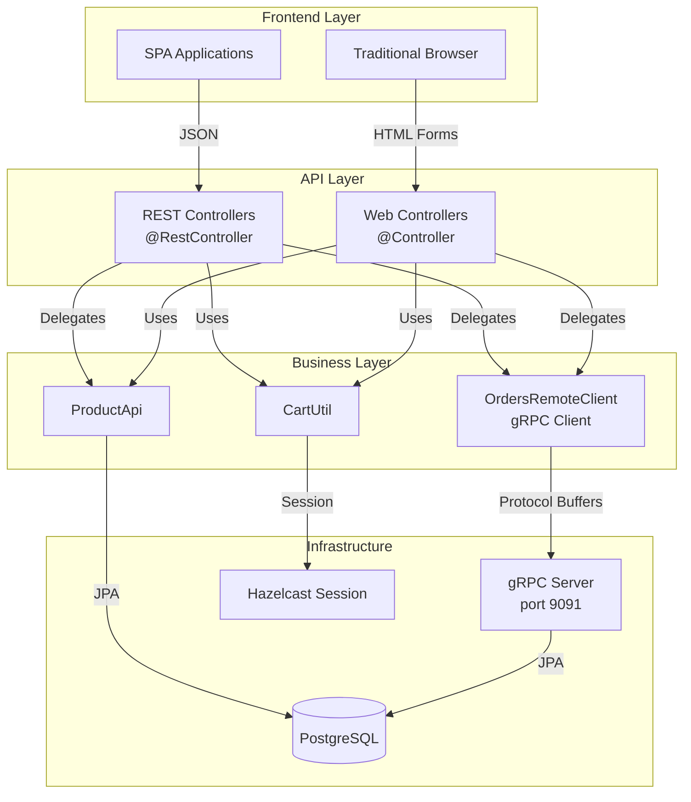

# Design Document

## Overview

This design document outlines the implementation of a comprehensive REST API layer with OpenAPI documentation support for the BookStore Modular Monolith application. The solution adds `@RestController` endpoints that return JSON responses while coexisting with existing `@Controller` endpoints that return HTML views. The REST layer will reuse existing business logic through gRPC clients and service APIs, ensuring no duplication of business rules. The implementation follows Spring Boot best practices and maintains the modular architecture principles established in the codebase.

## Steering Document Alignment

### Technical Standards (tech.md)

**Framework Compatibility**:
- Uses Spring Boot 3.5.5 with `springdoc-openapi-starter-webmvc-ui` (version 2.6.0 for Spring Boot 3.x compatibility)
- Maintains Spring Modulith 1.4.3 module boundaries without modifications
- Follows existing Java 21 language features and coding standards

**Architecture Patterns**:
- **Event-Driven**: REST layer observes same event patterns; order creation via REST publishes same `OrderCreatedEvent`
- **Hexagonal Architecture**: REST controllers act as new adapters in the web layer, calling existing domain services
- **API-based Integration**: REST controllers use `ProductApi` and `OrdersRemoteClient` (existing public APIs)

**Code Quality**:
- Adheres to Spotless + Palantir Java Format standards
- Follows existing error handling patterns (`@RestControllerAdvice` similar to `CatalogExceptionHandler`)
- Maintains >90% test coverage target with `@WebMvcTest` and `@SpringBootTest`

### Project Structure (structure.md)

**Module Organization**:
```
src/main/java/com/sivalabs/bookstore/
├── catalog/
│   └── web/
│       ├── ProductRestController.java     # Enhanced with OpenAPI
│       └── CatalogExceptionHandler.java   # Existing, will be referenced
├── orders/
│   └── web/
│       ├── OrdersRestController.java      # NEW - REST API
│       └── OrdersRestExceptionHandler.java # NEW - Error handling
└── web/
    ├── CartRestController.java            # NEW - REST API
    └── OrdersWebController.java           # Existing, unchanged
```

**Configuration**:
- OpenAPI config in `src/main/java/com/sivalabs/bookstore/config/OpenApiConfig.java`
- Properties in existing `application.properties` (no new files)

## Code Reuse Analysis

### Existing Components to Leverage

**1. gRPC Client Infrastructure** (`orders` module):
- **`OrdersRemoteClient`**: Will be injected into `OrdersRestController` for all order operations
- **gRPC error handling**: Existing `StatusRuntimeException` handling patterns will be reused
- **Retry/Circuit Breaker**: Existing gRPC client configuration applies to REST layer

**2. Service APIs** (`catalog` module):
- **`ProductService`**: Already used by `ProductRestController` for product queries
- **`ProductMapper`**: Existing DTO mapping logic reused for REST responses
- **`ProductApi`**: Public API used by `CartRestController` for product validation

**3. Session Management** (`web` module):
- **`CartUtil`**: Utility class for cart session management (already static methods)
- **`Cart` and `Cart.LineItem`**: Existing data structures reused for cart operations
- **Hazelcast Session Store**: Shared between Web Controllers and REST Controllers

**4. Error Handling Patterns**:
- **`CatalogExceptionHandler`**: Reference implementation for `@RestControllerAdvice` pattern
- **`ProductNotFoundException`**: Existing exception will be caught by REST exception handlers
- **HTTP status mapping**: Existing patterns from `OrdersWebController.handleGrpcStatusException()`

### Integration Points

**1. Existing gRPC Server** (port 9091):
- REST Controllers → `OrdersRemoteClient` → gRPC Server (localhost:9091)
- No changes to gRPC proto definitions or server implementation
- REST layer acts as additional client of existing gRPC services

**2. Database Schemas**:
- No direct database access from REST layer
- All database operations through existing services (`ProductService`, gRPC for orders)
- Maintains schema isolation (catalog, orders, inventory schemas)

**3. Event Publishing**:
- REST-created orders trigger same `OrderCreatedEvent` as Web Controller
- Events flow through existing Spring Modulith event bus
- RabbitMQ external publishing unchanged

## Architecture

The design follows a **layered adapter pattern** where REST controllers act as thin HTTP adapters over existing business logic. No business rules are duplicated; all operations delegate to existing services and clients.

### Architectural Principles

**1. Separation of Concerns**:
- `@Controller` (Web): Handle form submissions, return HTML views (unchanged)
- `@RestController` (REST API): Handle JSON requests, return JSON responses (new layer)
- Business Logic: Remains in services, gRPC clients, and domain modules (unchanged)

**2. Coexistence Strategy**:
- Both controller types share same session management (Hazelcast)
- Both use same DTOs where applicable (`ProductDto`, `OrderDto`)
- URL namespacing: `/api/*` for REST, `/*` for Web

**3. Error Handling Hierarchy**:
```
REST Controllers
    ↓ (delegates to)
Services/gRPC Clients
    ↓ (throws domain exceptions)
@RestControllerAdvice
    ↓ (maps to HTTP responses)
ErrorResponse DTO
```

### System Architecture Diagram



## Components and Interfaces

### Component 1: OpenApiConfig (Configuration)

- **Purpose:** Configure SpringDoc OpenAPI documentation and Swagger UI
- **Location:** `src/main/java/com/sivalabs/bookstore/config/OpenApiConfig.java`
- **Interfaces:**
  - `@Bean OpenAPI customOpenAPI()` - Defines API metadata
  - Returns `OpenAPI` object with title, version, description, servers
- **Dependencies:** `springdoc-openapi-starter-webmvc-ui` library
- **Reuses:** Reads application properties for server URL configuration

```java
@Configuration
public class OpenApiConfig {
    @Bean
    public OpenAPI customOpenAPI() {
        return new OpenAPI()
            .info(new Info()
                .title("BookStore REST API")
                .version("1.0.0")
                .description("REST API for BookStore Modular Monolith"))
            .servers(List.of(new Server().url("http://localhost:8080")));
    }
}
```

### Component 2: Enhanced ProductRestController

- **Purpose:** Provide REST API for product catalog with OpenAPI documentation
- **Location:** `src/main/java/com/sivalabs/bookstore/catalog/web/ProductRestController.java` (existing, enhanced)
- **Interfaces:**
  - `GET /api/products?page={page}` → `PagedResult<ProductDto>`
  - `GET /api/products/{code}` → `ProductDto`
- **Dependencies:** `ProductService`, `ProductMapper`
- **Reuses:** Existing service layer, DTO mapping logic

**OpenAPI Annotations:**
```java
@Tag(name = "Products", description = "Product catalog management API")
@Operation(summary = "Get paginated products")
@ApiResponses({
    @ApiResponse(responseCode = "200", description = "Successfully retrieved"),
    @ApiResponse(responseCode = "400", description = "Invalid page parameter")
})
```

### Component 3: CartRestController (New)

- **Purpose:** Provide REST API for shopping cart operations
- **Location:** `src/main/java/com/sivalabs/bookstore/web/CartRestController.java`
- **Interfaces:**
  - `POST /api/cart/items` - Add item to cart
  - `PUT /api/cart/items/{code}` - Update item quantity
  - `GET /api/cart` - Get cart contents
  - `DELETE /api/cart` - Clear cart
- **Dependencies:** `ProductApi`, `CartUtil` (existing)
- **Reuses:** Session management via `HttpSession`, existing `Cart` model

**Implementation Pattern:**
```java
@RestController
@RequestMapping("/api/cart")
@Tag(name = "Cart", description = "Shopping cart management API")
public class CartRestController {
    private final ProductApi productApi;

    @PostMapping("/items")
    public ResponseEntity<CartDto> addItem(
        @Valid @RequestBody AddToCartRequest request,
        HttpSession session
    ) {
        Cart cart = CartUtil.getCart(session);
        ProductDto product = productApi.getByCode(request.code()).orElseThrow();
        // Add to cart logic
        return ResponseEntity.ok(mapToDto(cart));
    }
}
```

### Component 4: OrdersRestController (New)

- **Purpose:** Provide REST API for order management, delegating to gRPC
- **Location:** `src/main/java/com/sivalabs/bookstore/orders/web/OrdersRestController.java`
- **Interfaces:**
  - `POST /api/orders` → `CreateOrderResponse` (HTTP 201)
  - `GET /api/orders` → `List<OrderView>`
  - `GET /api/orders/{orderNumber}` → `OrderDto`
- **Dependencies:** `OrdersRemoteClient` (existing gRPC client)
- **Reuses:** gRPC client, existing DTOs, session management

**gRPC Error Mapping:**
```java
@RestController
@RequestMapping("/api/orders")
public class OrdersRestController {
    private final OrdersRemoteClient ordersClient;

    @PostMapping
    public ResponseEntity<CreateOrderResponse> createOrder(
        @Valid @RequestBody CreateOrderRequest request
    ) {
        try {
            CreateOrderResponse response = ordersClient.createOrder(request);
            return ResponseEntity.status(HttpStatus.CREATED).body(response);
        } catch (StatusRuntimeException ex) {
            // Map gRPC status to HTTP status (reuse existing logic)
            throw mapGrpcException(ex);
        }
    }
}
```

### Component 5: OrdersRestExceptionHandler (New)

- **Purpose:** Unified error handling for REST API endpoints
- **Location:** `src/main/java/com/sivalabs/bookstore/orders/web/OrdersRestExceptionHandler.java`
- **Interfaces:**
  - `@ExceptionHandler` methods for domain exceptions
  - Returns `ResponseEntity<ErrorResponse>`
- **Dependencies:** None (handles exceptions globally)
- **Reuses:** Error mapping patterns from `OrdersWebController.handleGrpcStatusException()`

**Error Response Format:**
```java
public record ErrorResponse(
    @Schema(description = "HTTP status code") int status,
    @Schema(description = "Error message") String message,
    @Schema(description = "Timestamp") LocalDateTime timestamp
) {}

@RestControllerAdvice(assignableTypes = OrdersRestController.class)
public class OrdersRestExceptionHandler {
    @ExceptionHandler(OrderNotFoundException.class)
    public ResponseEntity<ErrorResponse> handleOrderNotFound(OrderNotFoundException ex) {
        return ResponseEntity.status(HttpStatus.NOT_FOUND)
            .body(new ErrorResponse(404, ex.getMessage(), LocalDateTime.now()));
    }
}
```

## Data Models

### CartDto (New)

```java
@Schema(description = "Shopping cart with items and total")
public record CartDto(
    @Schema(description = "Cart items", required = true)
    List<CartItemDto> items,

    @Schema(description = "Total amount", example = "99.99")
    BigDecimal totalAmount,

    @Schema(description = "Number of items in cart", example = "3")
    int itemCount
) {}
```

### CartItemDto (New)

```java
@Schema(description = "Shopping cart line item")
public record CartItemDto(
    @Schema(description = "Product code", example = "P001")
    String code,

    @Schema(description = "Product name", example = "Spring Boot in Action")
    String name,

    @Schema(description = "Unit price", example = "29.99")
    BigDecimal price,

    @Schema(description = "Quantity", example = "2", minimum = "1")
    @Min(1) int quantity,

    @Schema(description = "Subtotal (price * quantity)", example = "59.98")
    BigDecimal subtotal
) {}
```

### AddToCartRequest (New)

```java
@Schema(description = "Request to add item to cart")
public record AddToCartRequest(
    @Schema(description = "Product code", required = true, example = "P001")
    @NotBlank String code,

    @Schema(description = "Quantity to add", required = true, example = "1", minimum = "1")
    @Min(1) int quantity
) {}
```

### UpdateQuantityRequest (New)

```java
@Schema(description = "Request to update cart item quantity")
public record UpdateQuantityRequest(
    @Schema(description = "New quantity", required = true, example = "3", minimum = "1")
    @Min(1) int quantity
) {}
```

### ErrorResponse (New)

```java
@Schema(description = "Error response format")
public record ErrorResponse(
    @Schema(description = "HTTP status code", example = "404")
    int status,

    @Schema(description = "Error message", example = "Order not found")
    String message,

    @Schema(description = "Error timestamp", example = "2025-10-11T12:00:00")
    LocalDateTime timestamp
) {}
```

### Enhanced Existing DTOs

**ProductDto** (add `@Schema` annotations):
```java
@Schema(description = "Product information")
public record ProductDto(
    @Schema(description = "Product code", example = "P001")
    String code,

    @Schema(description = "Product name", example = "Spring Boot in Action")
    String name,

    @Schema(description = "Product price", example = "29.99")
    BigDecimal price,

    @Schema(description = "Product image URL")
    String imageUrl
) {}
```

**OrderDto, OrderView, CreateOrderRequest, CreateOrderResponse** (add `@Schema` annotations to all fields)

## Error Handling

### Error Scenarios

#### 1. Product Not Found
- **Description:** Client requests non-existent product code
- **Handling:**
  - `ProductApi.getByCode()` returns `Optional.empty()`
  - Throw `ProductNotFoundException.forCode(code)`
  - `@ExceptionHandler` catches and returns 404
- **User Impact:** Receives `{"status": 404, "message": "Product with code 'INVALID' not found", "timestamp": "..."}`

#### 2. gRPC Communication Failure
- **Description:** Orders gRPC server is unavailable or unresponsive
- **Handling:**
  - `OrdersRemoteClient` throws `StatusRuntimeException`
  - Map gRPC status codes: `UNAVAILABLE` → HTTP 503, `DEADLINE_EXCEEDED` → HTTP 504
  - Include retry guidance in error message
- **User Impact:** Receives `{"status": 503, "message": "Orders service unavailable. Please retry.", "timestamp": "..."}`

#### 3. Invalid Request Data
- **Description:** Client sends malformed JSON or fails validation
- **Handling:**
  - Spring Validation throws `MethodArgumentNotValidException`
  - `@ExceptionHandler` extracts field errors
  - Return HTTP 400 with field-level error details
- **User Impact:** Receives `{"status": 400, "message": "Validation failed: quantity must be >= 1", "timestamp": "..."}`

#### 4. Session Cart Not Found
- **Description:** Client tries to access cart without valid session
- **Handling:**
  - `CartUtil.getCart()` always returns cart (creates if missing)
  - No error case for missing cart (empty cart returned)
- **User Impact:** Receives empty cart response `{"items": [], "totalAmount": 0.00, "itemCount": 0}`

#### 5. Order Creation Business Rule Violation
- **Description:** gRPC server rejects order due to business rules (e.g., insufficient stock)
- **Handling:**
  - gRPC returns `FAILED_PRECONDITION` or `INVALID_ARGUMENT`
  - Map to HTTP 400 with descriptive message from gRPC error details
  - Parse `status.getDescription()` for business rule message
- **User Impact:** Receives `{"status": 400, "message": "Insufficient stock for product P001", "timestamp": "..."}`

## Testing Strategy

### Unit Testing

**ProductRestController Tests** (`ProductRestControllerTests.java`):
- Mock `ProductService` and `ProductMapper`
- Test pagination logic with various page numbers
- Test product-by-code lookup (found and not found cases)
- Verify OpenAPI annotations are present (via reflection or Swagger JSON validation)

**CartRestController Tests** (`CartRestControllerTests.java`):
- Mock `ProductApi` and `HttpSession`
- Test add-to-cart with valid/invalid product codes
- Test quantity update with boundary values (1, Integer.MAX_VALUE, 0)
- Test cart retrieval and clearing
- Verify session interaction (CartUtil usage)

**OrdersRestController Tests** (`OrdersRestControllerTests.java`):
- Mock `OrdersRemoteClient`
- Test order creation success path
- Test gRPC error mapping (UNAVAILABLE → 503, INVALID_ARGUMENT → 400, etc.)
- Test order retrieval and list operations
- Verify JSON serialization of gRPC responses

**Exception Handler Tests** (`OrdersRestExceptionHandlerTests.java`):
- Test all `@ExceptionHandler` methods
- Verify HTTP status codes and error response format
- Test gRPC exception mapping completeness
- Validate error messages don't leak internal details

### Integration Testing

**REST API Integration Tests** (`RestApiIntegrationTests.java`):
- Use `@SpringBootTest(webEnvironment = WebEnvironment.RANDOM_PORT)`
- Use `TestRestTemplate` or `WebTestClient`
- Test full request-response cycles (JSON in, JSON out)
- Verify session persistence across requests (cart operations)
- Test gRPC integration with Testcontainers (if gRPC server mocked)

**OpenAPI Specification Tests** (`OpenApiSpecificationTests.java`):
- Load generated OpenAPI JSON from `/api-docs`
- Validate against OpenAPI 3.0 schema
- Verify all endpoints are documented
- Check for required fields in request/response schemas
- Ensure error responses are documented

**Cross-Controller Tests** (`RestAndWebCoexistenceTests.java`):
- Verify Web Controllers and REST Controllers can coexist
- Test session sharing (add to cart via Web, retrieve via REST API)
- Verify both layers work independently
- Test URL routing doesn't conflict (`/products` vs `/api/products`)

### End-to-End Testing

**Shopping Flow E2E Test** (`ShoppingFlowE2ETests.java`):
1. GET `/api/products` - Retrieve product list
2. POST `/api/cart/items` - Add product to cart
3. GET `/api/cart` - Verify cart contents
4. POST `/api/orders` - Create order from cart
5. GET `/api/orders/{orderNumber}` - Verify order details
6. Verify event publishing (check `OrderCreatedEvent` in test event listener)

**Error Handling E2E Test** (`ErrorHandlingE2ETests.java`):
- Test 404 path: Request invalid product code
- Test 400 path: Send invalid JSON, violate validation rules
- Test 503 path: Simulate gRPC service down (via chaos engineering or mock)
- Verify all error responses match ErrorResponse schema

**SDK Generation Test** (`SdkGenerationTests.java`):
- Export OpenAPI spec to file
- Run `openapi-generator-cli` to generate TypeScript SDK
- Compile generated SDK (verify no TypeScript errors)
- Test basic SDK usage against running server
