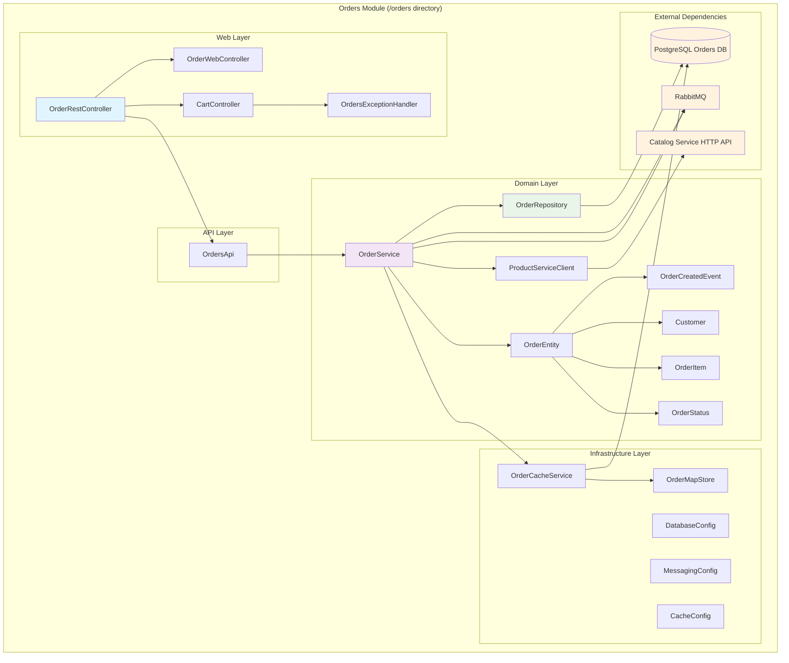

# Design Document

## Overview

This design document outlines the technical architecture for extracting the Orders module from the current Spring modular monolith into an independent Spring Modulith project located in a dedicated `/orders` directory. The design maintains all existing functionality while establishing clear boundaries for future microservices evolution.

The extracted Orders module will be a fully independent Spring Boot application with its own database, caching infrastructure, external API integrations, and comprehensive testing suite, following the monorepo pattern where both the main monolith and extracted module coexist in the same repository.

## Steering Document Alignment

### Technical Standards (tech.md)

The design follows documented technical patterns:
- **Spring Boot 3.5.5** with **Spring Modulith 1.4.3** for consistency with current stack
- **Java 21** runtime maintaining language version compatibility
- **PostgreSQL 17** with dedicated database for data isolation
- **Maven build system** with independent pom.xml for the extracted module
- **Event-driven architecture** using RabbitMQ for external messaging
- **Hazelcast caching** maintaining the same performance characteristics
- **TestContainers** for integration testing consistency

### Project Structure (structure.md)

The implementation follows project organization conventions:
- **Modular directory structure** with `/orders` at repository root level
- **Package naming** using `com.sivalabs.bookstore.orders` as root package
- **Layer separation** maintaining domain, infrastructure, and web layers
- **API-first approach** for external integrations with clean contracts
- **Test organization** following `@ApplicationModuleTest` patterns
- **Configuration management** using Spring profiles and externalized configuration

## Code Reuse Analysis

### Existing Components to Leverage

- **AbstractCacheService**: Will be replicated within the orders module to maintain Hazelcast caching functionality with circuit breaker patterns
- **CacheErrorHandler**: Common error handling patterns will be adapted for the independent cache infrastructure
- **Event Publishing Patterns**: RabbitMQ configuration patterns from the monolith will be replicated for OrderCreatedEvent publishing
- **Database Migration Patterns**: Liquibase migration structure (V4 and V5 scripts) will be migrated to maintain schema consistency
- **Testing Utilities**: TestContainers patterns for PostgreSQL and RabbitMQ will be replicated for isolated testing

### Integration Points

- **External Catalog API**: The ProductServiceClient will be converted to use HTTP-based REST API calls instead of in-process Spring Modulith API calls
- **RabbitMQ Messaging**: OrderCreatedEvent will continue to be published to BookStoreExchange with routing key "orders.new" for downstream services
- **Database Connection**: Completely independent PostgreSQL database instance with dedicated connection pool
- **Configuration Management**: Separate application.properties with environment-specific overrides

## Architecture

The extracted Orders module follows a clean, layered architecture with clear separation of concerns and external integration points:

### Modular Design Principles

- **Single File Responsibility**: Each class handles one specific business concern within the order domain
- **Component Isolation**: Domain, infrastructure, and web layers are clearly separated with well-defined boundaries
- **Service Layer Separation**: Business logic, data access, and presentation layers maintain strict separation
- **Utility Modularity**: Cache services, external clients, and utilities are focused, single-purpose modules



## Components and Interfaces

### Web Layer Components

#### OrderRestController
- **Purpose:** Provides REST API endpoints for order management operations
- **Interfaces:**
  - `POST /api/orders` - Create new order with validation
  - `GET /api/orders/{orderNumber}` - Retrieve order by order number
  - `GET /api/orders` - List all orders with pagination support
- **Dependencies:** OrdersApi for business logic delegation
- **Reuses:** Existing REST endpoint patterns and JSON serialization

#### OrderWebController
- **Purpose:** Handles web UI interactions for order management pages
- **Interfaces:**
  - `GET /orders` - Display orders list page
  - `GET /orders/{orderNumber}` - Display order details page
  - `POST /orders/create` - Handle order creation form submission
- **Dependencies:** OrdersApi, Thymeleaf templates
- **Reuses:** Existing Thymeleaf templates and Bootstrap styling

#### CartController
- **Purpose:** Manages shopping cart functionality and order preparation
- **Interfaces:**
  - `GET /cart` - Display cart contents
  - `POST /cart/add` - Add items to cart
  - `POST /cart/checkout` - Convert cart to order
- **Dependencies:** OrdersApi, session-based cart storage
- **Reuses:** Existing cart utilities and session management

### Domain Layer Components

#### OrderService
- **Purpose:** Core business logic for order management and workflow orchestration
- **Interfaces:**
  - `createOrder(OrderEntity)` - Create and validate new orders
  - `findOrder(String)` - Retrieve orders by order number with caching
  - `findOrders()` - List all orders with sorting
- **Dependencies:** OrderRepository, OrderCacheService, ProductServiceClient, ApplicationEventPublisher
- **Reuses:** Existing business validation logic and event publishing patterns

#### ProductServiceClient
- **Purpose:** External API client for product validation and pricing verification
- **Interfaces:**
  - `validateProduct(String, BigDecimal)` - Verify product existence and price
  - `getProductInfo(String)` - Retrieve product details
- **Dependencies:** HTTP client, circuit breaker, retry mechanisms
- **Reuses:** Converted from in-process API calls to HTTP REST client integration

#### OrderRepository
- **Purpose:** Data access layer for order persistence operations
- **Interfaces:**
  - `findByOrderNumber(String)` - Query by unique order identifier
  - `findAllBy(Sort)` - List orders with sorting support
  - `save(OrderEntity)` - Persist order entities
- **Dependencies:** JPA, PostgreSQL database connection
- **Reuses:** Existing JPA repository patterns and query methods

### Infrastructure Layer Components

#### OrderCacheService
- **Purpose:** Hazelcast-based caching with write-through patterns and circuit breaker protection
- **Interfaces:**
  - `cacheOrder(String, OrderEntity)` - Cache order data
  - `findByOrderNumber(String)` - Retrieve cached orders
  - `isCircuitBreakerOpen()` - Check cache availability
- **Dependencies:** Hazelcast, OrderMapStore, circuit breaker
- **Reuses:** Existing Hazelcast configuration patterns and error handling

#### Configuration Components
- **Purpose:** Spring Boot auto-configuration for database, messaging, and caching
- **Interfaces:** Standard Spring Boot configuration
- **Dependencies:** PostgreSQL driver, RabbitMQ client, Hazelcast
- **Reuses:** Existing configuration patterns adapted for independent deployment

## Data Models

### OrderEntity (JPA Entity)
```java
@Entity
@Table(name = "orders", schema = "orders")
public class OrderEntity {
    @Id
    @GeneratedValue(strategy = GenerationType.SEQUENCE, generator = "order_id_seq")
    private Long id;

    @Column(nullable = false, unique = true)
    private String orderNumber;

    @Column(nullable = false)
    private String customerName;

    @Column(nullable = false)
    private String customerEmail;

    @Column(nullable = false)
    private String customerPhone;

    @Column(nullable = false)
    private String deliveryAddress;

    @Column(nullable = false)
    private String productCode;

    @Column(nullable = false)
    private String productName;

    @Column(nullable = false)
    private BigDecimal productPrice;

    @Column(nullable = false)
    private Integer quantity;

    @Enumerated(EnumType.STRING)
    @Column(nullable = false)
    private OrderStatus status;

    @Column
    private String comments;

    @Column(nullable = false)
    private LocalDateTime createdAt;

    @Column
    private LocalDateTime updatedAt;
}
```

### Domain Models

#### Customer (Value Object)
```java
public record Customer(
    String name,
    String email,
    String phone,
    String deliveryAddress
) {}
```

#### OrderItem (Value Object)
```java
public record OrderItem(
    String productCode,
    String productName,
    BigDecimal price,
    Integer quantity
) {}
```

#### OrderCreatedEvent (Domain Event)
```java
@Externalized("BookStoreExchange::orders.new")
public record OrderCreatedEvent(
    String orderNumber,
    String productCode,
    int quantity,
    Customer customer
) {}
```

#### OrderStatus (Enumeration)
```java
public enum OrderStatus {
    NEW,
    CONFIRMED,
    DELIVERED,
    CANCELLED
}
```

## Error Handling

### Error Scenarios

1. **Product Validation Failure**
   - **Handling:** ProductServiceClient throws InvalidOrderException with specific error details
   - **User Impact:** HTTP 400 with clear validation error message in JSON/HTML format

2. **External API Timeout**
   - **Handling:** Circuit breaker pattern with retry logic and fallback mechanisms
   - **User Impact:** HTTP 503 with "Service temporarily unavailable" message

3. **Database Connection Failure**
   - **Handling:** Connection pool retry with exponential backoff and health check reporting
   - **User Impact:** HTTP 503 with database connectivity error message

4. **Cache Service Unavailability**
   - **Handling:** Graceful degradation to database-only operations without impacting business flow
   - **User Impact:** Transparent fallback with possible performance degradation

5. **Message Publishing Failure**
   - **Handling:** Log error but continue with order creation; implement retry mechanism for message delivery
   - **User Impact:** Order creation succeeds; downstream services may experience delayed notifications

6. **Invalid Order Data**
   - **Handling:** Validation at API boundary with comprehensive error details
   - **User Impact:** HTTP 400 with field-specific validation error messages

## Testing Strategy

### Unit Testing
- **Service Layer Testing:** Mock all external dependencies (ProductServiceClient, OrderRepository, cache)
- **Repository Testing:** Use `@DataJpaTest` with H2 in-memory database for isolated data layer testing
- **Cache Testing:** Test cache operations with embedded Hazelcast instance
- **Controller Testing:** Use `@WebMvcTest` with mocked service dependencies
- **Event Testing:** Verify OrderCreatedEvent publishing with Spring Boot test event listeners

### Integration Testing
- **Module Integration:** Use `@SpringBootTest` for full application context testing
- **Database Integration:** TestContainers PostgreSQL for realistic database testing
- **Messaging Integration:** TestContainers RabbitMQ for event publishing verification
- **External API Integration:** WireMock for ProductServiceClient HTTP interactions
- **Cache Integration:** TestContainers Hazelcast for distributed cache testing

### End-to-End Testing
- **Order Creation Workflow:** Complete flow from cart to order creation with external validations
- **API Contract Testing:** REST endpoint testing with realistic payloads and error scenarios
- **Web UI Testing:** Selenium/TestContainers for web interface validation
- **Performance Testing:** Load testing for caching effectiveness and database performance
- **Event Flow Testing:** Verify OrderCreatedEvent publishing to RabbitMQ and consumption by test listeners