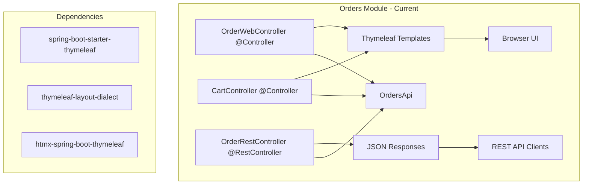

# Design: Orders Thymeleaf Removal

## Overview

This document outlines the technical design for removing Thymeleaf template dependencies from the orders module and converting web controllers to REST API endpoints. The design maintains all existing functionality while eliminating UI template dependencies.

## Architecture Decisions

### ADR-1: Convert @Controller to @RestController Pattern
**Decision**: Transform existing `@Controller` classes to `@RestController` following the established pattern in `OrderRestController.java`
**Reasoning**:
- Maintains consistency with existing REST API architecture
- Leverages established error handling patterns via `@RestControllerAdvice`
- Provides OpenAPI documentation capability through Swagger annotations
- Eliminates template dependency while preserving endpoint functionality

### ADR-2: Preserve Existing API Contracts
**Decision**: Maintain identical URL paths and HTTP methods but change response format from template views to JSON
**Reasoning**:
- Minimizes impact on potential API consumers
- Follows REST API conventions
- Maintains backward compatibility for non-template usage
- Enables progressive migration strategy

### ADR-3: Leverage Existing DTO/Response Patterns
**Decision**: Reuse existing API models (`OrderDto`, `OrderView`, `CreateOrderResponse`) for consistency
**Reasoning**:
- Reduces code duplication
- Maintains data structure consistency across API endpoints
- Leverages existing validation and serialization logic
- Simplifies testing by using established patterns

## System Architecture

### Current State


### Target State
```mermaid
graph TB
    subgraph "Orders Module - Target"
        ORC[OrderRestController @RestController] --> JSON[JSON Responses]
        CRC[CartRestController @RestController] --> JSON

        ORC --> API[OrdersApi]
        CRC --> API

        JSON --> RestClient[REST API Clients]
        JSON --> MainApp[Main Monolith UI]
    end

    subgraph "Main Monolith"
        UI[UI Templates] --> MainController[@Controller]
        MainController --> OrdersAPI[Orders Module API]
    end
```

## Component Design

### 1. Controller Transformation

#### OrderWebController → OrderRestController Enhancement
**Current Structure Analysis**:
- `OrderWebController` has 3 endpoints: POST `/orders`, GET `/orders`, GET `/orders/{orderNumber}`
- Returns template view names: `"cart"`, `"orders"`, `"order_details"`
- Uses Model to pass data to templates

**Design Pattern**:
```java
// Current Pattern (to be removed)
@Controller
public class OrderWebController {
    @GetMapping("/orders")
    String getOrders(Model model, HtmxRequest hxRequest) {
        fetchOrders(model);
        return "orders"; // Template name
    }
}

// Target Pattern (following existing OrderRestController)
@RestController
@RequestMapping("/api/orders")
public class OrderRestController {
    @GetMapping
    List<OrderView> getOrders() {
        return ordersApi.findOrders(); // Direct JSON response
    }
}
```

#### CartController → CartRestController Transformation
**Current Functionality Analysis**:
- POST `/buy` - Add product to cart, redirects to `/cart`
- GET `/cart` - Show cart with order form, returns `"cart"` template
- POST `/update-cart` - HTMX endpoint, returns fragment

**Target Design**:
```java
@RestController
@RequestMapping("/api/cart")
public class CartRestController {
    @PostMapping("/items")
    ResponseEntity<CartDto> addItem(@RequestBody AddToCartRequest request) {
        // Add item logic, return cart state as JSON
    }

    @GetMapping
    CartDto getCart(HttpSession session) {
        // Return current cart state as JSON
    }

    @PutMapping("/items/{productCode}")
    CartDto updateItem(@PathVariable String productCode, @RequestBody UpdateQuantityRequest request) {
        // Update quantity, return updated cart as JSON
    }
}
```

### 2. Data Transfer Objects

#### New DTOs Required
```java
// Cart-related DTOs
public record CartDto(
    CartItemDto item,
    BigDecimal totalAmount
) {}

public record CartItemDto(
    String code,
    String name,
    BigDecimal price,
    Integer quantity
) {}

public record AddToCartRequest(String productCode) {}
public record UpdateQuantityRequest(Integer quantity) {}

// Response wrapper for consistency
public record ApiResponse<T>(
    T data,
    String message,
    Instant timestamp
) {}
```

### 3. Error Handling Strategy

**Leverage Existing Pattern**:
- Extend existing `OrdersExceptionHandler` with cart-specific exceptions
- Use `ProblemDetail` pattern for consistent error responses
- Maintain HTTP status code conventions

```java
@RestControllerAdvice
public class OrdersExceptionHandler extends ResponseEntityExceptionHandler {

    // Existing handlers...

    @ExceptionHandler(CartNotFoundException.class)
    ProblemDetail handle(CartNotFoundException e) {
        ProblemDetail problemDetail = ProblemDetail.forStatusAndDetail(
            HttpStatus.NOT_FOUND, e.getMessage());
        problemDetail.setTitle("Cart Not Found");
        problemDetail.setProperty("timestamp", Instant.now());
        return problemDetail;
    }
}
```

### 4. Session Management Strategy

**Design Decision**: Maintain existing session-based cart management
- Continue using `HttpSession` for cart state
- `CartUtil` helper class remains unchanged
- Session timeout and cleanup behavior preserved

**Rationale**:
- Minimal disruption to existing cart logic
- Session management is independent of template rendering
- Consistent with current architecture patterns

### 5. Testing Strategy

#### Update Test Patterns
**Web Controller Tests → REST Controller Tests**:
```java
// Follow existing pattern from OrderRestControllerTests
@WebMvcTest(CartRestController.class)
@Import(OrdersExceptionHandler.class)
class CartRestControllerTests {

    @Test
    void shouldReturnCartAsJson() throws Exception {
        // Test JSON response instead of template view
        mockMvc.perform(get("/api/cart"))
            .andExpect(status().isOk())
            .andExpect(jsonPath("$.totalAmount").exists())
            .andExpected(content().contentType(MediaType.APPLICATION_JSON));
    }
}
```

#### Remove Template-Specific Tests
- Template rendering tests become obsolete
- Focus on JSON response validation
- Maintain integration test coverage for business logic

## File Structure Changes

### Files to Remove
```
orders/src/main/resources/templates/
├── cart.html                          [DELETE]
├── layout.html                        [DELETE]
├── order_details.html                 [DELETE]
├── orders.html                        [DELETE]
└── partials/
    ├── cart.html                      [DELETE]
    ├── order-form.html                [DELETE]
    └── orders.html                    [DELETE]
```

### Files to Modify
```
orders/pom.xml                         [MODIFY: Remove Thymeleaf dependencies]
orders/src/main/java/com/sivalabs/bookstore/orders/web/
├── OrderWebController.java            [DELETE]
├── CartController.java                [DELETE]
├── OrderRestController.java           [MODIFY: Add new endpoints]
└── OrdersExceptionHandler.java        [MODIFY: Add cart exceptions]
```

### Files to Create
```
orders/src/main/java/com/sivalabs/bookstore/orders/web/
├── CartRestController.java            [CREATE]
└── dto/
    ├── CartDto.java                   [CREATE]
    ├── CartItemDto.java               [CREATE]
    ├── AddToCartRequest.java          [CREATE]
    └── UpdateQuantityRequest.java     [CREATE]

orders/src/test/java/com/sivalabs/bookstore/orders/web/
└── CartRestControllerTests.java       [CREATE]
```

## API Endpoint Mapping

### Order Endpoints (Enhancement)
| Current Web Endpoint | New REST Endpoint | Method | Response Type |
|---------------------|-------------------|---------|---------------|
| `GET /orders` | `GET /api/orders` | GET | `List<OrderView>` |
| `GET /orders/{id}` | `GET /api/orders/{id}` | GET | `OrderDto` |
| `POST /orders` | `POST /api/orders` | POST | `CreateOrderResponse` |

### Cart Endpoints (New)
| Current Web Endpoint | New REST Endpoint | Method | Response Type |
|---------------------|-------------------|---------|---------------|
| `GET /cart` | `GET /api/cart` | GET | `CartDto` |
| `POST /buy` | `POST /api/cart/items` | POST | `CartDto` |
| `POST /update-cart` | `PUT /api/cart/items/{code}` | PUT | `CartDto` |

## Dependency Management

### Dependencies to Remove from pom.xml
```xml
<!-- Remove these dependencies -->
<dependency>
    <groupId>org.springframework.boot</groupId>
    <artifactId>spring-boot-starter-thymeleaf</artifactId>
</dependency>
<dependency>
    <groupId>nz.net.ultraq.thymeleaf</groupId>
    <artifactId>thymeleaf-layout-dialect</artifactId>
</dependency>
<dependency>
    <groupId>io.github.wimdeblauwe</groupId>
    <artifactId>htmx-spring-boot-thymeleaf</artifactId>
    <version>${htmx-spring-boot-thymeleaf.version}</version>
</dependency>
```

### Properties to Remove
```xml
<!-- Remove this property -->
<htmx-spring-boot-thymeleaf.version>4.0.1</htmx-spring-boot-thymeleaf.version>
```

## Integration Considerations

### 1. Main Monolith Integration
**Strategy**: Main application continues to provide UI functionality
- Main app templates can call orders module APIs via HTTP
- HTMX integration moves to main application
- Orders module focuses purely on business logic and API

### 2. Test Integration Impact
**Changes Required**:
- Update integration tests to use REST endpoints
- Remove template-related test utilities
- Maintain test container and database integration tests
- Update MockMvc tests to expect JSON responses

### 3. Session Compatibility
**Design**: Maintain session management compatibility
- `HttpSession` handling remains identical
- Cart state management unchanged
- Session security and timeout policies preserved

## Performance Considerations

### Build Performance Improvements
- **Dependency Reduction**: Removal of 3 UI dependencies
- **Faster Compilation**: No template processing during build
- **Smaller JAR**: Reduced artifact size without template resources

### Runtime Performance Impact
- **Memory Usage**: Reduced heap usage without Thymeleaf template caching
- **Startup Time**: Faster startup without template dialect initialization
- **Response Time**: JSON serialization typically faster than template rendering

## Security Considerations

### Maintained Security Features
- **Input Validation**: `@Valid` annotations preserved on DTOs
- **Session Security**: Session management and CSRF protection unchanged
- **Error Handling**: ProblemDetail responses prevent information leakage

### Enhanced Security
- **API Documentation**: OpenAPI specs improve security testing capability
- **Content Type Enforcement**: Explicit JSON content type reduces attack surface
- **Input Sanitization**: JSON deserialization provides automatic XSS protection

## Migration Strategy

### Phase 1: Preparation
1. Create new REST controller classes with JSON endpoints
2. Add new DTOs for cart operations
3. Update exception handler for cart-specific errors

### Phase 2: Endpoint Migration
1. Migrate order endpoints to enhanced REST controller
2. Implement cart REST endpoints with session compatibility
3. Update all tests to validate JSON responses

### Phase 3: Cleanup
1. Remove web controller classes
2. Delete template files and directories
3. Remove Thymeleaf dependencies from pom.xml
4. Clean up unused imports and test utilities

### Phase 4: Validation
1. Run full test suite
2. Validate API documentation generation
3. Performance testing and monitoring
4. Integration testing with main application

## Success Criteria

### Functional Validation
- [ ] All REST endpoints return correct JSON responses
- [ ] Session-based cart management works identically
- [ ] Order creation, retrieval, and listing functionality preserved
- [ ] Error handling provides appropriate HTTP status codes and messages

### Technical Validation
- [ ] Build time improves by 10-20%
- [ ] No Thymeleaf dependencies in dependency tree
- [ ] All tests pass with 100% success rate
- [ ] Code coverage maintained at existing levels

### Integration Validation
- [ ] Main application can consume orders APIs successfully
- [ ] Database integration tests continue to pass
- [ ] RabbitMQ event publishing continues to work
- [ ] Hazelcast caching functionality remains operational

## Risk Mitigation

### High-Risk Areas
1. **Session Management Changes**: Mitigation - maintain identical session handling patterns
2. **API Contract Breaking**: Mitigation - preserve existing endpoint URLs and HTTP methods
3. **Integration Test Failures**: Mitigation - comprehensive test coverage during migration

### Rollback Strategy
- Keep deleted controllers in git history for quick restoration if needed
- Implement feature flags for gradual endpoint migration
- Maintain comprehensive test coverage to detect regressions early

## Documentation Updates

### API Documentation
- Generate OpenAPI/Swagger documentation for new cart endpoints
- Update existing order endpoint documentation
- Provide migration guide for API consumers

### Development Documentation
- Update CLAUDE.md with new API endpoint information
- Document new testing patterns for REST controllers
- Update build and deployment guides with dependency changes