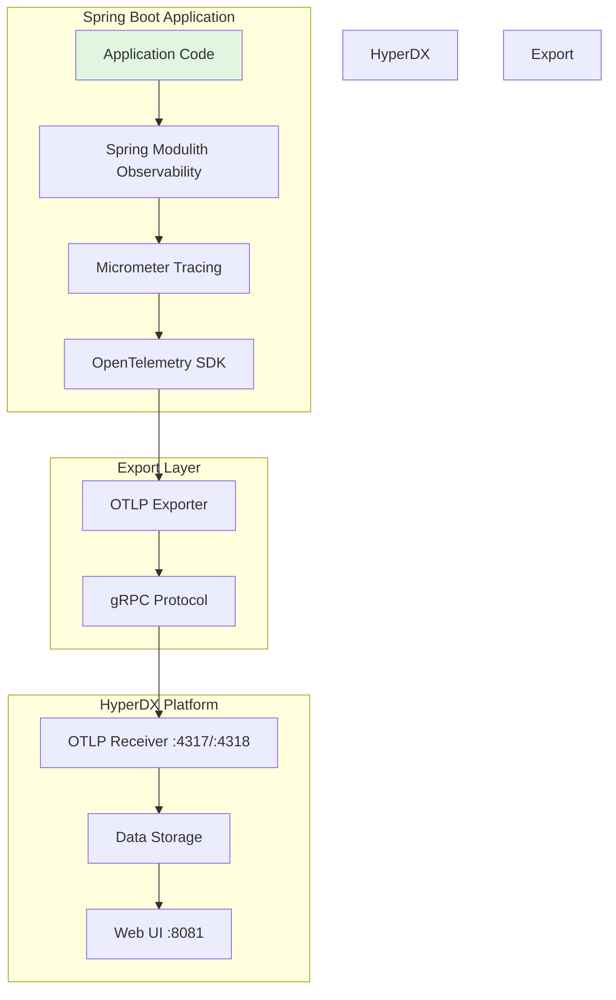

# Design Document

## Overview

This design document outlines the technical approach for replacing Zipkin with HyperDX as the observability platform for the Spring Boot Modular Monolith application. HyperDX is an all-in-one observability platform that natively supports OpenTelemetry protocol, providing integrated traces, metrics, and logs visualization. The migration will leverage existing Spring Boot Micrometer Tracing infrastructure while replacing the export destination from Zipkin to HyperDX using gRPC protocol for efficient data transmission.

## Steering Document Alignment

### Technical Standards (tech.md)

The design adheres to the documented technical standards by:
- **Spring Boot 3.5.5 + Spring Modulith 1.4.3**: Maintaining compatibility with existing framework versions
- **Observability Best Practices**: Using industry-standard OpenTelemetry protocol for vendor-neutral observability
- **Docker Compose Development**: Continuing use of docker-compose for local development environment
- **Maven Dependency Management**: Leveraging Maven BOM for consistent dependency versions
- **Configuration Externalization**: Using Spring Boot properties and environment variables for configuration

### Project Structure (structure.md)

The implementation follows project organization conventions:
- **Configuration in pom.xml**: Dependency changes isolated to Maven configuration files
- **Properties in application.properties**: Runtime configuration in standard Spring Boot properties files
- **Infrastructure in compose.yml**: Docker service definitions in project root
- **Documentation in CLAUDE.md and README.md**: Developer documentation updates in established locations
- **No Code Changes**: Observability changes are configuration-only, not impacting application code

## Code Reuse Analysis

### Existing Components to Leverage

- **Micrometer Tracing Infrastructure**: Already configured with `micrometer-tracing-bridge-otel`, will be retained
- **Spring Modulith Observability**: Existing `spring-modulith-observability` dependency automatically generates spans for module interactions
- **Spring Boot Actuator**: Current actuator configuration provides observability endpoints
- **Docker Compose Network**: Existing `proxy` network will be reused for HyperDX service communication
- **Environment Variable Pattern**: Established pattern for service configuration via env vars in compose.yml

### Integration Points

- **Spring Boot Auto-Configuration**: Spring Boot will auto-configure OpenTelemetry exporter based on properties
- **Micrometer Observation API**: Spring Modulith uses Micrometer Observation API which bridges to OpenTelemetry
- **Docker Compose Services**: HyperDX service will integrate into existing docker-compose infrastructure
- **Application Properties**: Configuration will integrate with existing Spring Boot property hierarchy

## Architecture

The migration follows a **configuration-first, zero-code-change approach** where observability infrastructure is modified through dependency updates, property configuration, and Docker service replacement.

### Modular Design Principles

- **Single Responsibility**: Each configuration file has one concern (dependencies in pom.xml, runtime config in properties, infrastructure in compose.yml)
- **Separation of Concerns**: Observability infrastructure is completely separated from application business logic
- **Configuration Over Code**: No application code changes required; all changes are declarative configuration
- **Environment-Specific Settings**: Development (docker-compose) and production configurations remain separate

### Architecture Diagram



### Data Flow

1. **Trace Generation**: Application code and Spring Modulith generate Micrometer Observations
2. **Bridge to OTel**: Micrometer Tracing Bridge converts Observations to OpenTelemetry spans
3. **OTLP Export**: OpenTelemetry SDK exports spans via OTLP protocol using gRPC
4. **HyperDX Reception**: HyperDX receives spans on port 4317 (gRPC) or 4318 (HTTP)
5. **Storage & Visualization**: HyperDX stores and displays traces in integrated UI on port 8081

## Components and Interfaces

### Component 1: Maven Dependencies (pom.xml)

- **Purpose:** Manage observability library dependencies
- **Changes:**
  - Remove: `opentelemetry-exporter-zipkin` (currently exports to Zipkin format)
  - Remove (commented): `micrometer-tracing-bridge-brave` and `zipkin-reporter-brave`
  - Add: `io.opentelemetry:opentelemetry-exporter-otlp` (OTLP gRPC/HTTP exporter)
  - Keep: `micrometer-tracing-bridge-otel` (already present, bridges Micrometer to OTel)
- **Dependencies:** Spring Boot Parent POM, Spring Modulith BOM
- **Reuses:** Existing dependencyManagement section for version control

### Component 2: Application Properties (application.properties)

- **Purpose:** Configure OpenTelemetry exporter endpoints
- **Changes:**
  - Remove: `management.zipkin.tracing.endpoint=http://localhost:9411/api/v2/spans`
  - Add: `management.otlp.tracing.endpoint=http://localhost:4318/v1/traces` (HTTP)
  - Add: `management.otlp.tracing.protocol=grpc` (optional, for gRPC)
  - Keep: `management.tracing.enabled=true` and `management.tracing.sampling.probability=1.0`
- **Interfaces:** Spring Boot auto-configuration reads these properties
- **Dependencies:** Spring Boot Actuator, Micrometer Tracing
- **Reuses:** Existing management.* property namespace

### Component 3: Docker Compose Service (compose.yml)

- **Purpose:** Provide HyperDX observability platform in development environment
- **Changes:**
  - Remove: `zipkin` service definition
  - Add: `hyperdx` service with image `docker.hyperdx.io/hyperdx/hyperdx-all-in-one`
  - Ports: 8081:8080 (UI), 4317:4317 (gRPC), 4318:4318 (HTTP)
  - Update monolith environment:
    - Remove: `MANAGEMENT_ZIPKIN_TRACING_ENDPOINT`
    - Add: `OTEL_EXPORTER_OTLP_ENDPOINT=http://hyperdx:4317`
    - Add: `OTEL_EXPORTER_OTLP_PROTOCOL=grpc`
    - Add: `MANAGEMENT_OTLP_TRACING_ENDPOINT=http://hyperdx:4318/v1/traces`
  - Update orders-service environment (same changes)
- **Interfaces:** Docker Compose networking, environment variable injection
- **Dependencies:** Docker network `proxy`
- **Reuses:** Existing docker-compose infrastructure and networking

### Component 4: Orders Service POM (orders/pom.xml)

- **Purpose:** Ensure consistent observability dependencies in orders-service module
- **Changes:** Same as main pom.xml (remove Zipkin, add OTLP exporter)
- **Dependencies:** Parent POM, Spring Boot BOM
- **Reuses:** Dependency management from parent POM

### Component 5: Documentation Updates

- **Purpose:** Guide developers on accessing and using HyperDX
- **Changes:**
  - CLAUDE.md: Update Application URLs section, replace Zipkin with HyperDX
  - README.md: Update Technology Stack and Configuration sections
- **Interfaces:** Developer documentation
- **Reuses:** Existing documentation structure and format

## Data Models

### Configuration Model (application.properties)

```properties
# Tracing configuration
management.tracing.enabled=true
management.tracing.sampling.probability=1.0

# OpenTelemetry OTLP exporter configuration
management.otlp.tracing.endpoint=http://localhost:4318/v1/traces
management.otlp.tracing.protocol=http  # or 'grpc' for gRPC protocol

# Alternative: Use environment variables for Docker
# OTEL_EXPORTER_OTLP_ENDPOINT=http://hyperdx:4317
# OTEL_EXPORTER_OTLP_PROTOCOL=grpc
# MANAGEMENT_OTLP_TRACING_ENDPOINT=http://hyperdx:4318/v1/traces
```

### Docker Environment Model (compose.yml)

```yaml
hyperdx:
  image: docker.hyperdx.io/hyperdx/hyperdx-all-in-one
  ports:
    - '8081:8080'   # HyperDX UI
    - '4317:4317'   # OpenTelemetry gRPC
    - '4318:4318'   # OpenTelemetry HTTP
  networks:
    - proxy

monolith:
  environment:
    OTEL_EXPORTER_OTLP_ENDPOINT: http://hyperdx:4317
    OTEL_EXPORTER_OTLP_PROTOCOL: grpc
    MANAGEMENT_OTLP_TRACING_ENDPOINT: http://hyperdx:4318/v1/traces
```

### Maven Dependency Model

```xml
<!-- Remove -->
<!-- <dependency>
    <groupId>io.opentelemetry</groupId>
    <artifactId>opentelemetry-exporter-zipkin</artifactId>
</dependency> -->

<!-- Add -->
<dependency>
    <groupId>io.opentelemetry</groupId>
    <artifactId>opentelemetry-exporter-otlp</artifactId>
</dependency>

<!-- Keep (already present) -->
<dependency>
    <groupId>io.micrometer</groupId>
    <artifactId>micrometer-tracing-bridge-otel</artifactId>
</dependency>
```

## Error Handling

### Error Scenarios

1. **HyperDX Service Unavailable**
   - **Handling:** OpenTelemetry SDK will log connection errors but application continues normally
   - **User Impact:** Application remains functional; traces are lost until HyperDX recovers
   - **Mitigation:** Spring Boot's graceful degradation ensures observability failures don't crash the application

2. **Port Conflicts**
   - **Handling:** Docker Compose will fail to start if ports 4317, 4318, or 8081 are in use
   - **User Impact:** Developer must stop conflicting services or remap ports
   - **Mitigation:** Use `docker-compose down` to stop previous services; check port availability with `lsof -i :PORT`

3. **Missing OTLP Exporter Dependency**
   - **Handling:** Application will fail to start with ClassNotFoundException if dependency is missing
   - **User Impact:** Build must include `opentelemetry-exporter-otlp` dependency
   - **Mitigation:** Maven build will fail at compile time with clear dependency error

4. **Incorrect Endpoint Configuration**
   - **Handling:** OpenTelemetry SDK logs connection errors, no traces exported
   - **User Impact:** Traces don't appear in HyperDX UI
   - **Mitigation:** Verify endpoint configuration in logs, check HyperDX service status with `docker-compose ps`

5. **gRPC Protocol Mismatch**
   - **Handling:** Connection fails if client uses gRPC but endpoint expects HTTP or vice versa
   - **User Impact:** No traces exported to HyperDX
   - **Mitigation:** Ensure `OTEL_EXPORTER_OTLP_PROTOCOL=grpc` matches endpoint protocol, or use HTTP endpoint

## Testing Strategy

### Unit Testing

No new unit tests required as this is a configuration-only change. Existing tests will continue to work as:
- Application code remains unchanged
- Spring Modulith observability continues to function
- Micrometer Tracing API remains the same

### Integration Testing

Test the end-to-end tracing pipeline:

1. **Start Services Test**
   ```bash
   docker-compose up -d
   docker-compose ps  # Verify all services running
   ```

2. **Trace Generation Test**
   - Execute application workflows (create order, query products)
   - Verify spans appear in application logs with trace IDs
   - Check HyperDX UI at http://localhost:8081 for traces

3. **Module Boundary Tracing Test**
   - Execute cross-module operations (Orders calling Catalog)
   - Verify spans show module boundaries in HyperDX UI
   - Confirm trace context propagation across modules

4. **gRPC Export Verification**
   ```bash
   docker-compose logs hyperdx | grep "OTLP"
   # Should show incoming OTLP requests on port 4317
   ```

### End-to-End Testing

1. **Developer Workflow Test**
   - Fresh checkout of repository
   - Run `docker-compose up`
   - Access application at http://localhost:8080
   - Perform user actions (browse catalog, create order)
   - Open HyperDX UI at http://localhost:8081
   - Verify traces are visible and queryable

2. **Documentation Verification**
   - Follow CLAUDE.md instructions for accessing HyperDX
   - Verify all URLs are correct and accessible
   - Confirm README.md reflects current observability stack

3. **Production Configuration Test**
   - Deploy with production environment variables
   - Verify OTLP exporter connects to production HyperDX instance
   - Confirm sampling rate is configurable via `management.tracing.sampling.probability`
   - Validate network security (HyperDX not exposed publicly except UI)

### Verification Checklist

- [ ] Application starts without errors after dependency changes
- [ ] HyperDX service starts and exposes ports 4317, 4318, 8081
- [ ] Traces appear in HyperDX UI within seconds of generation
- [ ] Module boundary spans are visible in trace visualization
- [ ] gRPC connection is established (check logs for "connected" messages)
- [ ] Application continues functioning if HyperDX is stopped (graceful degradation)
- [ ] Documentation accurately describes new setup
- [ ] All docker-compose services pass health checks
