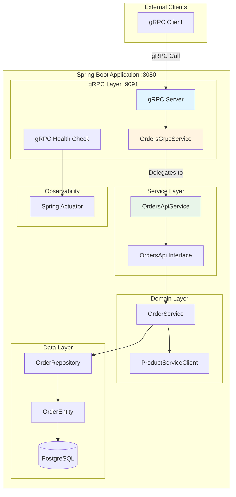
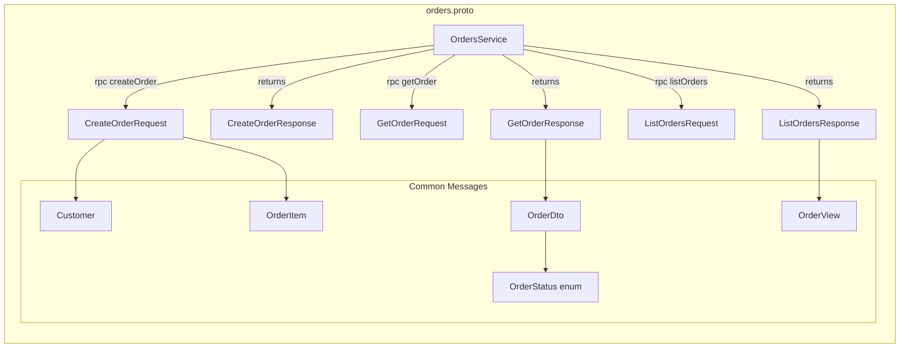

# Design Document: REST to gRPC Complete Migration for Orders Module

## Overview

This design document specifies the complete replacement of REST API communication with gRPC protocol for the Orders module in the Spring Modular Monolith bookstore application. The migration will introduce Protocol Buffer service definitions, gRPC server infrastructure, client implementations, and proper integration with existing Spring Modulith architecture while maintaining module boundaries and leveraging existing business logic.

## Steering Document Alignment

### Technical Standards (tech.md)

This design follows established project patterns:
- **Conditional Bean Loading**: Using `@ConditionalOnClass` and `@ConditionalOnProperty` for gRPC components (as documented in CLAUDE.md)
- **Configuration Properties**: Following the `CacheProperties` pattern with `@ConfigurationProperties` and validation
- **Spring Boot Integration**: Leveraging Spring Boot's auto-configuration and starter dependencies
- **Java 21 Compatibility**: All generated code and implementations compatible with Java 21

### Project Structure (structure.md)

File organization follows Spring Modulith conventions:
- **Proto Files**: `src/main/proto/orders.proto` for service definitions
- **Configuration**: `src/main/java/com/sivalabs/bookstore/config/GrpcServerConfig.java`
- **Module-specific**: `src/main/java/com/sivalabs/bookstore/orders/grpc/` for Orders gRPC implementations
- **Generated Code**: `target/generated-sources/protobuf/` (build-time generation)
- **Tests**: `src/test/java/com/sivalabs/bookstore/orders/grpc/` for gRPC-specific tests

## Code Reuse Analysis

### Existing Components to Leverage

- **OrdersApi Interface** (`orders.api.OrdersApi`): Core business interface - will be called by gRPC service layer
- **OrdersApiService** (`orders.OrdersApiService`): Existing implementation containing business logic
- **DTO Classes**: `CreateOrderRequest`, `CreateOrderResponse`, `OrderDto`, `OrderView` - will be mapped to/from Protobuf messages
- **Model Classes**: `Customer`, `OrderItem`, `OrderStatus` - structures to be mirrored in Protocol Buffers
- **Configuration Pattern**: `CacheProperties` style with `@ConfigurationProperties` for `GrpcProperties`
- **Conditional Loading Pattern**: CLAUDE.md's documented approach for optional features

### Integration Points

- **OrdersApi Service Layer**: gRPC service will delegate to existing `OrdersApi` interface
- **Spring Modulith Events**: gRPC operations will continue triggering `OrderCreatedEvent`
- **Spring Actuator**: New `GrpcHealthIndicator` following existing `CacheHealthIndicator` pattern
- **Module Boundaries**: gRPC components respect `@ApplicationModule(allowedDependencies = {"catalog::product-api", "common::common-cache"})`

## Architecture

### System Architecture Overview



### Protocol Buffer Schema Design



## Components and Interfaces

### Component 1: Protocol Buffer Definitions

**Purpose:** Define strongly-typed service contracts and message structures

**File:** `src/main/proto/orders.proto`

**Interface:**
```protobuf
syntax = "proto3";

package com.sivalabs.bookstore.orders.grpc.proto;

import "google/protobuf/timestamp.proto";

// Orders service definition
service OrdersService {
  // Create a new order
  rpc CreateOrder(CreateOrderRequest) returns (CreateOrderResponse);

  // Get order by order number
  rpc GetOrder(GetOrderRequest) returns (GetOrderResponse);

  // List all orders
  rpc ListOrders(ListOrdersRequest) returns (ListOrdersResponse);
}

// Messages mirror existing DTOs
message CreateOrderRequest {
  Customer customer = 1;
  string delivery_address = 2;
  OrderItem item = 3;
}

message CreateOrderResponse {
  string order_number = 1;
}

message GetOrderRequest {
  string order_number = 1;
}

message GetOrderResponse {
  OrderDto order = 1;
}

message ListOrdersRequest {
  // Future: pagination parameters
}

message ListOrdersResponse {
  repeated OrderView orders = 1;
}

message Customer {
  string name = 1;
  string email = 2;
  string phone = 3;
}

message OrderItem {
  string code = 1;
  string name = 2;
  string price = 3;  // String for BigDecimal precision
  int32 quantity = 4;
}

message OrderDto {
  string order_number = 1;
  OrderItem item = 2;
  Customer customer = 3;
  string delivery_address = 4;
  OrderStatus status = 5;
  google.protobuf.Timestamp created_at = 6;
  string total_amount = 7;  // String for BigDecimal
}

message OrderView {
  string order_number = 1;
  OrderStatus status = 2;
}

enum OrderStatus {
  ORDER_STATUS_UNSPECIFIED = 0;
  NEW = 1;
  DELIVERED = 2;
  CANCELLED = 3;
  ERROR = 4;
}
```

**Dependencies:**
- Google Protocol Buffers 3.x
- Maven protobuf plugin

**Reuses:** Structure mirrors existing DTO classes in `orders.api` package

### Component 2: gRPC Properties Configuration

**Purpose:** Externalized configuration for gRPC server and client settings

**File:** `src/main/java/com/sivalabs/bookstore/config/GrpcProperties.java`

**Interface:**
```java
@ConfigurationProperties(prefix = "bookstore.grpc")
@Validated
public class GrpcProperties {
    private ServerProperties server = new ServerProperties();
    private ClientProperties client = new ClientProperties();

    public static class ServerProperties {
        @Min(1024) @Max(65535)
        private int port = 9091;

        private boolean healthCheckEnabled = true;
        private boolean reflectionEnabled = true;

        @Min(1)
        private int maxInboundMessageSize = 4194304; // 4MB

        @Min(0)
        private long shutdownGracePeriodSeconds = 30;

        // Getters/setters
    }

    public static class ClientProperties {
        private String target = "localhost:9091";

        @Min(1000)
        private long deadlineMs = 5000;

        private boolean retryEnabled = true;

        @Min(1)
        private int maxRetryAttempts = 3;

        // Getters/setters
    }
}
```

**Dependencies:** Spring Boot Configuration Processor

**Reuses:** `CacheProperties` pattern with validation annotations

### Component 3: gRPC Server Configuration

**Purpose:** Configure and start gRPC server with health checks and interceptors

**File:** `src/main/java/com/sivalabs/bookstore/config/GrpcServerConfig.java`

**Interface:**
```java
@Configuration
@EnableConfigurationProperties(GrpcProperties.class)
@ConditionalOnClass(name = "io.grpc.Server")
public class GrpcServerConfig {

    @Bean
    public Server grpcServer(
            GrpcProperties properties,
            OrdersGrpcService ordersGrpcService) {

        ServerBuilder<?> serverBuilder = ServerBuilder.forPort(properties.getServer().getPort())
            .addService(ordersGrpcService)
            .maxInboundMessageSize(properties.getServer().getMaxInboundMessageSize());

        if (properties.getServer().isHealthCheckEnabled()) {
            serverBuilder.addService(new HealthStatusManager().getHealthService());
        }

        if (properties.getServer().isReflectionEnabled()) {
            serverBuilder.addService(ProtoReflectionService.newInstance());
        }

        return serverBuilder.build();
    }

    @Bean
    public GrpcServerLifecycle grpcServerLifecycle(Server grpcServer, GrpcProperties properties) {
        return new GrpcServerLifecycle(grpcServer, properties.getServer().getShutdownGracePeriodSeconds());
    }
}
```

**Dependencies:**
- gRPC Java libraries
- Spring context

**Reuses:** Conditional loading pattern from CLAUDE.md

### Component 4: OrdersGrpcService Implementation

**Purpose:** Implement gRPC service by delegating to existing OrdersApi

**File:** `src/main/java/com/sivalabs/bookstore/orders/grpc/OrdersGrpcService.java`

**Interface:**
```java
@Component
public class OrdersGrpcService extends OrdersServiceGrpc.OrdersServiceImplBase {

    private final OrdersApi ordersApi;
    private final GrpcMessageMapper messageMapper;

    public OrdersGrpcService(OrdersApi ordersApi, GrpcMessageMapper messageMapper) {
        this.ordersApi = ordersApi;
        this.messageMapper = messageMapper;
    }

    @Override
    public void createOrder(CreateOrderRequest request, StreamObserver<CreateOrderResponse> responseObserver) {
        try {
            // Convert Protobuf request to DTO
            var orderRequest = messageMapper.toCreateOrderRequest(request);

            // Delegate to existing service
            var response = ordersApi.createOrder(orderRequest);

            // Convert DTO response to Protobuf
            var grpcResponse = messageMapper.toCreateOrderResponse(response);

            responseObserver.onNext(grpcResponse);
            responseObserver.onCompleted();
        } catch (Exception e) {
            responseObserver.onError(GrpcExceptionHandler.handleException(e));
        }
    }

    @Override
    public void getOrder(GetOrderRequest request, StreamObserver<GetOrderResponse> responseObserver) {
        // Similar pattern
    }

    @Override
    public void listOrders(ListOrdersRequest request, StreamObserver<ListOrdersResponse> responseObserver) {
        // Similar pattern
    }
}
```

**Dependencies:**
- Generated gRPC stubs
- OrdersApi interface

**Reuses:** Existing `OrdersApi` interface and implementations

### Component 5: gRPC Message Mapper

**Purpose:** Convert between Protobuf messages and Java DTOs

**File:** `src/main/java/com/sivalabs/bookstore/orders/grpc/GrpcMessageMapper.java`

**Interface:**
```java
@Component
public class GrpcMessageMapper {

    public com.sivalabs.bookstore.orders.api.CreateOrderRequest toCreateOrderRequest(
            CreateOrderRequest protoRequest) {

        var customer = new Customer(
            protoRequest.getCustomer().getName(),
            protoRequest.getCustomer().getEmail(),
            protoRequest.getCustomer().getPhone()
        );

        var item = new OrderItem(
            protoRequest.getItem().getCode(),
            protoRequest.getItem().getName(),
            new BigDecimal(protoRequest.getItem().getPrice()),
            protoRequest.getItem().getQuantity()
        );

        return new com.sivalabs.bookstore.orders.api.CreateOrderRequest(
            customer,
            protoRequest.getDeliveryAddress(),
            item
        );
    }

    public CreateOrderResponse toCreateOrderResponse(
            com.sivalabs.bookstore.orders.api.CreateOrderResponse dtoResponse) {

        return CreateOrderResponse.newBuilder()
            .setOrderNumber(dtoResponse.orderNumber())
            .build();
    }

    public OrderDto toOrderDto(com.sivalabs.bookstore.orders.api.OrderDto dto) {
        return OrderDto.newBuilder()
            .setOrderNumber(dto.orderNumber())
            .setItem(toOrderItemProto(dto.item()))
            .setCustomer(toCustomerProto(dto.customer()))
            .setDeliveryAddress(dto.deliveryAddress())
            .setStatus(toOrderStatusProto(dto.status()))
            .setCreatedAt(toTimestamp(dto.createdAt()))
            .setTotalAmount(dto.getTotalAmount().toString())
            .build();
    }

    private Timestamp toTimestamp(LocalDateTime dateTime) {
        Instant instant = dateTime.atZone(ZoneId.systemDefault()).toInstant();
        return Timestamp.newBuilder()
            .setSeconds(instant.getEpochSecond())
            .setNanos(instant.getNano())
            .build();
    }

    // Additional mapping methods...
}
```

**Dependencies:**
- Generated Protobuf classes
- Existing DTO classes

**Reuses:** Existing DTO structures from `orders.api` package

### Component 6: gRPC Exception Handler

**Purpose:** Map Java exceptions to gRPC status codes

**File:** `src/main/java/com/sivalabs/bookstore/orders/grpc/GrpcExceptionHandler.java`

**Interface:**
```java
public class GrpcExceptionHandler {

    public static StatusRuntimeException handleException(Exception e) {
        if (e instanceof OrderNotFoundException) {
            return Status.NOT_FOUND
                .withDescription(e.getMessage())
                .asRuntimeException();
        }

        if (e instanceof InvalidOrderException) {
            return Status.INVALID_ARGUMENT
                .withDescription(e.getMessage())
                .asRuntimeException();
        }

        if (e instanceof ConstraintViolationException) {
            return Status.INVALID_ARGUMENT
                .withDescription("Validation failed: " + e.getMessage())
                .asRuntimeException();
        }

        // Log unexpected errors
        return Status.INTERNAL
            .withDescription("Internal server error")
            .asRuntimeException();
    }
}
```

**Dependencies:** gRPC Status codes

**Reuses:** Existing exception types (`OrderNotFoundException`, `InvalidOrderException`)

### Component 7: gRPC Health Indicator

**Purpose:** Expose gRPC server health via Spring Actuator

**File:** `src/main/java/com/sivalabs/bookstore/config/GrpcHealthIndicator.java`

**Interface:**
```java
@Component
@ConditionalOnClass(name = "io.grpc.Server")
public class GrpcHealthIndicator implements HealthIndicator {

    private final Server grpcServer;

    @Override
    public Health health() {
        if (grpcServer != null && !grpcServer.isShutdown() && !grpcServer.isTerminated()) {
            return Health.up()
                .withDetail("port", grpcServer.getPort())
                .withDetail("services", grpcServer.getServices().size())
                .build();
        }
        return Health.down()
            .withDetail("reason", "gRPC server not running")
            .build();
    }
}
```

**Dependencies:** Spring Boot Actuator

**Reuses:** `CacheHealthIndicator` pattern

## Data Models

### Protobuf Message Structures

All Protobuf messages mirror existing Java record DTOs with these considerations:

**BigDecimal Handling:**
```protobuf
// Use string for decimal precision
string price = 1;  // "19.99"
string total_amount = 2;  // "99.95"
```

**LocalDateTime Handling:**
```protobuf
import "google/protobuf/timestamp.proto";
google.protobuf.Timestamp created_at = 1;
```

**Enum Mapping:**
```protobuf
enum OrderStatus {
  ORDER_STATUS_UNSPECIFIED = 0;  // Proto3 requires zero value
  NEW = 1;
  DELIVERED = 2;
  CANCELLED = 3;
  ERROR = 4;
}
```

## Error Handling

### Error Scenarios

#### Scenario 1: Order Not Found
- **Handling:** Map `OrderNotFoundException` to `Status.NOT_FOUND`
- **User Impact:** Client receives `NOT_FOUND` status with error message

#### Scenario 2: Invalid Order Data
- **Handling:** Map `InvalidOrderException` and validation errors to `Status.INVALID_ARGUMENT`
- **User Impact:** Client receives `INVALID_ARGUMENT` with validation details

#### Scenario 3: Product Validation Failure
- **Handling:** Propagate from `ProductServiceClient`, map to `Status.FAILED_PRECONDITION`
- **User Impact:** Client receives precondition failure with product details

#### Scenario 4: Internal Server Error
- **Handling:** Log full stack trace, return `Status.INTERNAL` with generic message
- **User Impact:** Client receives internal error without sensitive details

#### Scenario 5: gRPC Server Unavailable
- **Handling:** Client retry with exponential backoff
- **User Impact:** Transparent retry up to configured limit

## Testing Strategy

### Unit Testing

**Test Focus:**
- Message mapping (Protobuf � DTO conversions)
- Exception handling (Java exceptions � gRPC status codes)
- Configuration properties validation

**Test Classes:**
- `GrpcMessageMapperTest`: Verify bidirectional message conversions
- `GrpcExceptionHandlerTest`: Test exception-to-status mapping
- `GrpcPropertiesTest`: Validate property constraints

**Framework:** JUnit 5, AssertJ

**Reuses:** Existing test infrastructure from `orders` module

### Integration Testing

**Test Focus:**
- In-process gRPC server communication
- End-to-end request/response flow
- OrdersApi integration

**Test Classes:**
- `OrdersGrpcServiceIntegrationTest`: Test full gRPC call flow
- `GrpcServerIntegrationTest`: Test server lifecycle and configuration

**Framework:**
- JUnit 5
- gRPC in-process server
- Spring Boot Test
- Testcontainers (PostgreSQL)

**Approach:**
```java
@SpringBootTest
@ApplicationModuleTest
class OrdersGrpcServiceIntegrationTest {

    @Test
    void shouldCreateOrderViaGrpc() {
        // Use in-process server
        ManagedChannel channel = InProcessChannelBuilder
            .forName("test-server")
            .directExecutor()
            .build();

        OrdersServiceGrpc.OrdersServiceBlockingStub stub =
            OrdersServiceGrpc.newBlockingStub(channel);

        // Test gRPC call
        CreateOrderResponse response = stub.createOrder(request);

        assertThat(response.getOrderNumber()).isNotEmpty();
    }
}
```

### End-to-End Testing

**Test Focus:**
- Real gRPC client-server communication
- Tracing propagation
- Metrics collection

**Test Scenarios:**
- Create order and verify in database
- Retrieve order by number
- List all orders
- Error scenarios (not found, validation failures)

**Tools:**
- grpcurl for manual testing
- Automated E2E tests with TestContainers

## Maven Configuration

### Dependencies to Add

```xml
<properties>
    <grpc.version>1.65.1</grpc.version>
    <protobuf.version>3.25.3</protobuf.version>
</properties>

<dependencies>
    <!-- gRPC dependencies -->
    <dependency>
        <groupId>io.grpc</groupId>
        <artifactId>grpc-netty-shaded</artifactId>
        <version>${grpc.version}</version>
    </dependency>
    <dependency>
        <groupId>io.grpc</groupId>
        <artifactId>grpc-protobuf</artifactId>
        <version>${grpc.version}</version>
    </dependency>
    <dependency>
        <groupId>io.grpc</groupId>
        <artifactId>grpc-stub</artifactId>
        <version>${grpc.version}</version>
    </dependency>
    <dependency>
        <groupId>io.grpc</groupId>
        <artifactId>grpc-services</artifactId>
        <version>${grpc.version}</version>
    </dependency>

    <!-- Protocol Buffers -->
    <dependency>
        <groupId>com.google.protobuf</groupId>
        <artifactId>protobuf-java</artifactId>
        <version>${protobuf.version}</version>
    </dependency>

    <!-- gRPC Testing -->
    <dependency>
        <groupId>io.grpc</groupId>
        <artifactId>grpc-testing</artifactId>
        <version>${grpc.version}</version>
        <scope>test</scope>
    </dependency>
</dependencies>
```

### Build Plugin Configuration

```xml
<build>
    <extensions>
        <extension>
            <groupId>kr.motd.maven</groupId>
            <artifactId>os-maven-plugin</artifactId>
            <version>1.7.1</version>
        </extension>
    </extensions>

    <plugins>
        <plugin>
            <groupId>org.xolstice.maven.plugins</groupId>
            <artifactId>protobuf-maven-plugin</artifactId>
            <version>0.6.1</version>
            <configuration>
                <protocArtifact>com.google.protobuf:protoc:${protobuf.version}:exe:${os.detected.classifier}</protocArtifact>
                <pluginId>grpc-java</pluginId>
                <pluginArtifact>io.grpc:protoc-gen-grpc-java:${grpc.version}:exe:${os.detected.classifier}</pluginArtifact>
            </configuration>
            <executions>
                <execution>
                    <goals>
                        <goal>compile</goal>
                        <goal>compile-custom</goal>
                    </goals>
                </execution>
            </executions>
        </plugin>
    </plugins>
</build>
```

## Application Properties Configuration

```properties
# gRPC Server Configuration
bookstore.grpc.server.port=9091
bookstore.grpc.server.health-check-enabled=true
bookstore.grpc.server.reflection-enabled=true
bookstore.grpc.server.max-inbound-message-size=4194304
bookstore.grpc.server.shutdown-grace-period-seconds=30

# gRPC Client Configuration
bookstore.grpc.client.target=localhost:9091
bookstore.grpc.client.deadline-ms=5000
bookstore.grpc.client.retry-enabled=true
bookstore.grpc.client.max-retry-attempts=3

# Logging
logging.level.io.grpc=INFO
logging.level.com.sivalabs.bookstore.orders.grpc=DEBUG
```

## Migration Strategy

### Phase 1: Setup and Infrastructure
1. Add gRPC dependencies to pom.xml
2. Create proto files mirroring existing DTOs
3. Configure Maven plugin for code generation
4. Verify build produces generated classes

### Phase 2: Server Implementation
1. Create `GrpcProperties` configuration class
2. Implement `GrpcServerConfig` with conditional loading
3. Implement `OrdersGrpcService` delegating to `OrdersApi`
4. Create `GrpcMessageMapper` for message conversion
5. Add `GrpcExceptionHandler` for error mapping

### Phase 3: Testing
1. Write unit tests for message mapping
2. Create integration tests with in-process server
3. Add E2E tests verifying full flow
4. Performance testing comparing with REST baseline

### Phase 4: REST Endpoint Removal
1. Remove or disable REST controllers for Orders API
2. Update documentation
3. Remove REST-specific dependencies if not needed elsewhere

### Phase 5: Monitoring and Validation
1. Verify health checks working
2. Confirm metrics collection
3. Validate tracing integration
4. Load testing under realistic conditions
