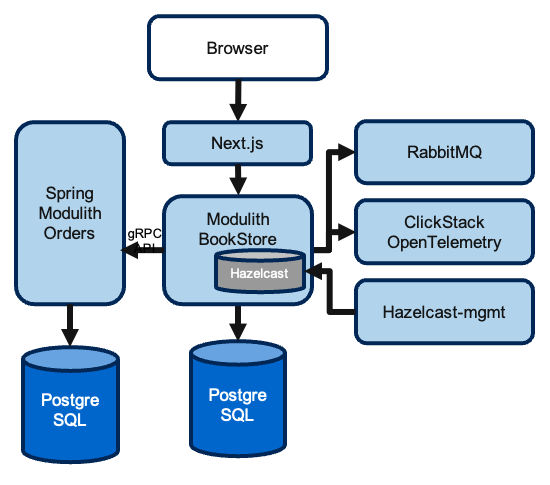

# spring-modular-monolith

An e-commerce application built with Spring Modulith. The backend publishes REST and gRPC APIs, persists data per module, and coordinates domain events through RabbitMQ. A Next.js 14 (App Router) storefront lives in `frontend-next/` and consumes the `/api/**` endpoints proxied by nginx when running under Docker Compose.



## Architecture Overview

- **common** – shared utilities, exception handling, cache helpers, and Hazelcast session integration that are intentionally exported for other modules.
- **catalog** – product catalogue domain, Liquibase migrations for the `catalog` schema, and the `ProductRestController` REST surface.
- **orders** – order lifecycle, cart REST endpoints, Hazelcast write-through cache, gRPC client/server adapters, and the `OrdersApi` facade for other modules.
- **inventory** – inventory projections that react to `OrderCreatedEvent`, inventory cache configuration, and Liquibase migrations for the `inventory` schema.
- **notifications** – listens to published domain events and records notification intents (currently via logging; ready for future email integration).
- **config** – infrastructural wiring (Hazelcast bootstrap, OpenAPI, gRPC server, observability, health checks, and session/CORS configuration).

> The legacy Thymeleaf “web” module has been fully retired. UI traffic is now served by `frontend-next` or via `/api/**` for API clients.

### Frontend & Integration Points

- `frontend-next/` hosts a Next.js 14 App Router application that uses React Query and the generated TypeScript SDK in `frontend-sdk/`.
- Docker Compose entrypoint: `http://localhost` is served by the `webproxy` nginx container, forwarding `/` to Next.js and `/api/**` to the Spring Boot monolith.
- Session state is stored in Hazelcast and exposed as the `BOOKSTORE_SESSION` cookie; when bypassing nginx ensure requests include credentials so the cookie is sent.

### Observability & Infrastructure

- Hazelcast provides distributed caching for catalog, orders, inventory data and serves as the Spring Session store. Management Center runs on port `38080`.
- OpenTelemetry traces/metrics/logs are exported over OTLP gRPC (4317) to the bundled HyperDX all-in-one appliance (`compose.yml` service `hyperdx`).
- RabbitMQ transports domain events and their dead-letter queues. Modulith events are also persisted to the `events` schema for replay.

### Module Communication

- Catalog exports `ProductApi`, which the Orders module consumes for price validation.
- Orders publishes `OrderCreatedEvent`; Inventory and Notifications consume it to update stock and log notification intents.
- Common helpers are marked as exported modules and are the only shared implementation allowed across boundaries.
- Cross-module interactions flow through exported APIs or domain events—direct repository access across modules is not permitted.

### gRPC Integration

- **Server:** `GrpcServerConfig` starts an in-process gRPC server (default port `9091`) exposing Orders operations to external consumers.
- **Client:** `OrdersGrpcClient` targets `bookstore.grpc.client.target`; in Docker Compose it points to `orders-service:9090` so the monolith calls the extracted Orders service, while local development defaults to the in-process server.
- Health checks, reflection, deadlines, and retry behaviour are fully configurable via `application.properties`.

## Prerequisites

- Java 21+ (tested with Temurin via SDKMAN)
- Docker & Docker Compose (for the full stack)
- Node.js ≥ 18.17 with `pnpm` (for frontend work)
- Go Task runner (`brew install go-task` or `go install github.com/go-task/task/v3/cmd/task@latest`)
- Optional: k6 for load tests, Playwright for frontend E2E

Verify the toolchain:

```shell
java -version
docker info
docker compose version
task --version
pnpm --version
```

## Quick Start

### Docker Compose (recommended)

```shell
# Build and start monolith, orders-service, postgres, rabbitmq, HyperDX, frontend-next, nginx proxy…
task start

# Stop everything
task stop

# Rebuild images and restart
task restart
```

When the stack is up:

| Component | URL |
| --- | --- |
| Storefront (nginx → Next.js) | http://localhost |
| Next.js (direct) | http://localhost:3000 |
| Spring Boot API | http://localhost:8080 |
| Swagger UI | http://localhost:8080/swagger-ui.html |
| OpenAPI JSON | http://localhost:8080/api-docs |
| Actuator root | http://localhost:8080/actuator |
| Modulith info | http://localhost:8080/actuator/modulith |
| HyperDX UI | http://localhost:8081 |
| RabbitMQ console | http://localhost:15672 (guest/guest) |
| Hazelcast Management Center | http://localhost:38080 |

### Backend development without Docker

Provide PostgreSQL and RabbitMQ locally, then run:

```shell
export SPRING_DATASOURCE_URL=jdbc:postgresql://localhost:5432/postgres
export SPRING_RABBITMQ_HOST=localhost
./mvnw spring-boot:run
```

### Frontend development

```shell
cd frontend-next
pnpm install
pnpm dev   # serves on http://localhost:3000
```

Enable the backend `dev` profile (`SPRING_PROFILES_ACTIVE=dev`) so CORS allows `http://localhost:3000`. Make sure frontend fetches include `credentials: 'include'` to forward the `BOOKSTORE_SESSION` cookie.

## Build, Test & QA

- Backend build: `./mvnw -ntp clean verify`
- Formatting: `./mvnw spotless:apply`
- Load tests: `k6 run k6.js` (supports overriding `BASE_URL`)
- Modulith documentation: `./mvnw test` regenerates `target/spring-modulith-docs/`
- Frontend: `pnpm test` (unit), `pnpm test:e2e` (Playwright after `pnpm build && pnpm start`)

## Project Layout

```
src/main/java/com/sivalabs/bookstore/
├── common/        # shared helpers, cache utilities, session support
├── catalog/       # product domain + REST API + Liquibase changelog
├── orders/        # order domain, cart REST, gRPC adapters, Hazelcast MapStore
├── inventory/     # inventory projections & cache configuration
├── notifications/ # domain event consumers
└── config/        # infrastructure wiring (Hazelcast, OTEL, gRPC, CORS, sessions)

src/main/resources/db/migration/ # Liquibase change sets (schemas: catalog, orders, inventory)
frontend-next/                   # Next.js storefront
frontend-sdk/                    # Generated TypeScript API client
```

## Database & Migrations

- Liquibase change sets reside in `src/main/resources/db/migration/`.
- Schemas: `catalog`, `orders`, `inventory`, plus `events` for Modulith event persistence.
- Apply locally with `./mvnw liquibase:update` (uses Spring datasource properties).

## Troubleshooting

- **Port conflicts:** adjust mappings in `compose.yml` (notably 80, 3000, 8080, 4317, 15672, 38080).
- **Session issues:** confirm `BOOKSTORE_SESSION` cookie is issued and requests include credentials; inspect `/api/cart` logs for session reuse.
- **CORS failures in dev:** ensure `SPRING_PROFILES_ACTIVE=dev` or override `cors.allowed-origins` to your frontend origin.
- **Missing traces:** verify the `hyperdx` container is healthy and OTLP env vars (`OTLP_ENDPOINT`, `OTLP_GRPC_HEADERS_AUTHORIZATION`) are configured.
- **Orders service offline:** fall back to the in-process gRPC server by setting `bookstore.grpc.client.target=localhost:9091`.

Refer to the markdown files under `docs/` for historical context, API deep dives, and module-specific analyses.
