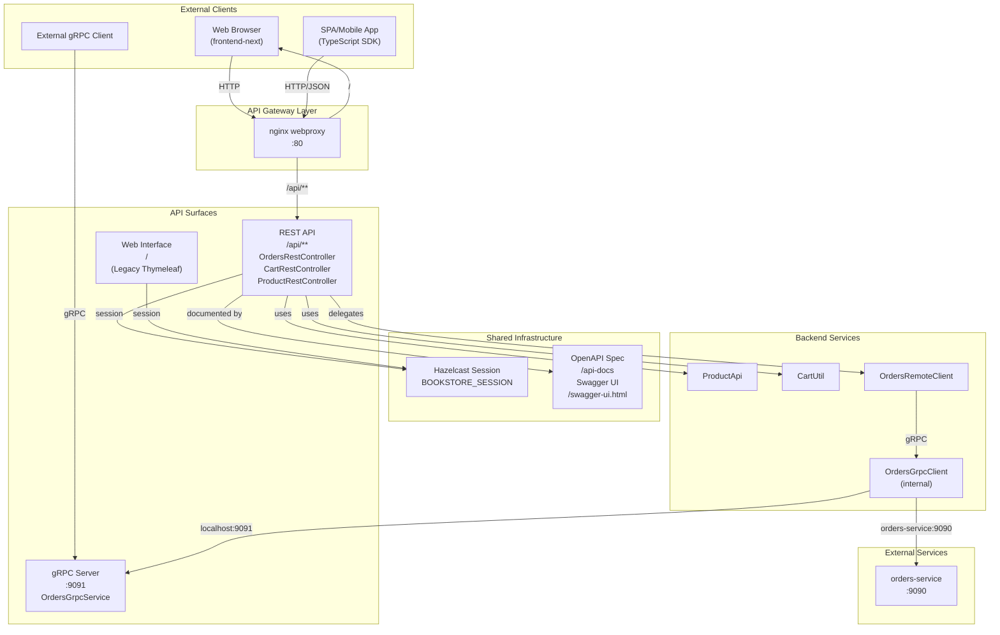
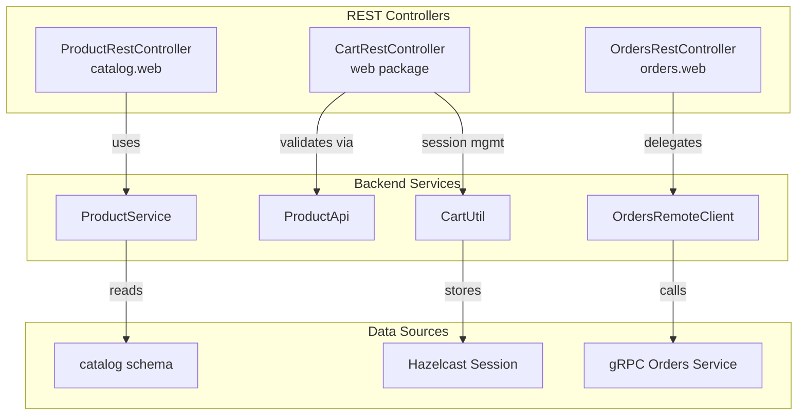
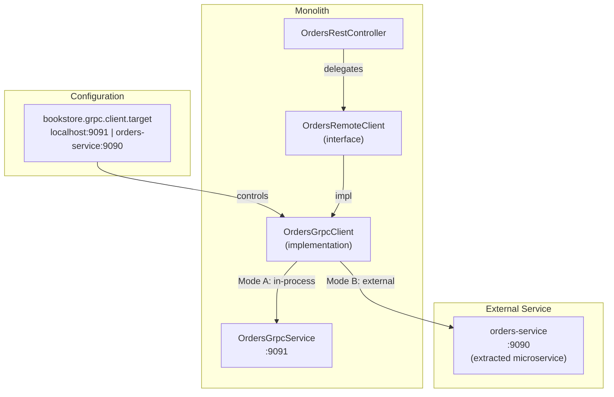

# API Documentation

> **Relevant source files**
> * [.gitignore](https://github.com/philipz/spring-modular-monolith/blob/30c9bf30/.gitignore)
> * [.spec-workflow/approvals/next-frontend-integration/approval_1760807319093_l7v5gve2o.json](https://github.com/philipz/spring-modular-monolith/blob/30c9bf30/.spec-workflow/approvals/next-frontend-integration/approval_1760807319093_l7v5gve2o.json)
> * [.spec-workflow/approvals/next-frontend-integration/approval_1760833920449_qtnnlhttk.json](https://github.com/philipz/spring-modular-monolith/blob/30c9bf30/.spec-workflow/approvals/next-frontend-integration/approval_1760833920449_qtnnlhttk.json)
> * [.spec-workflow/approvals/next-frontend-integration/approval_1760837739843_h9y1nukfu.json](https://github.com/philipz/spring-modular-monolith/blob/30c9bf30/.spec-workflow/approvals/next-frontend-integration/approval_1760837739843_h9y1nukfu.json)
> * [.spec-workflow/approvals/next-frontend-integration/approval_1760850183470_6dmde9if0.json](https://github.com/philipz/spring-modular-monolith/blob/30c9bf30/.spec-workflow/approvals/next-frontend-integration/approval_1760850183470_6dmde9if0.json)
> * [.spec-workflow/archive/specs/openapi-rest-api/design.md](https://github.com/philipz/spring-modular-monolith/blob/30c9bf30/.spec-workflow/archive/specs/openapi-rest-api/design.md)
> * [.spec-workflow/archive/specs/openapi-rest-api/requirements.md](https://github.com/philipz/spring-modular-monolith/blob/30c9bf30/.spec-workflow/archive/specs/openapi-rest-api/requirements.md)
> * [.spec-workflow/archive/specs/openapi-rest-api/tasks.md](https://github.com/philipz/spring-modular-monolith/blob/30c9bf30/.spec-workflow/archive/specs/openapi-rest-api/tasks.md)
> * [README-API.md](https://github.com/philipz/spring-modular-monolith/blob/30c9bf30/README-API.md)
> * [README.md](https://github.com/philipz/spring-modular-monolith/blob/30c9bf30/README.md)
> * [docs/API_ANALYSIS_SUMMARY.txt](https://github.com/philipz/spring-modular-monolith/blob/30c9bf30/docs/API_ANALYSIS_SUMMARY.txt)
> * [docs/REST_API_ANALYSIS.md](https://github.com/philipz/spring-modular-monolith/blob/30c9bf30/docs/REST_API_ANALYSIS.md)
> * [docs/bookstore-microservices.png](https://github.com/philipz/spring-modular-monolith/blob/30c9bf30/docs/bookstore-microservices.png)
> * [docs/improvement.md](https://github.com/philipz/spring-modular-monolith/blob/30c9bf30/docs/improvement.md)
> * [docs/orders-data-ownership-analysis.md](https://github.com/philipz/spring-modular-monolith/blob/30c9bf30/docs/orders-data-ownership-analysis.md)
> * [docs/orders-module-boundary-analysis.md](https://github.com/philipz/spring-modular-monolith/blob/30c9bf30/docs/orders-module-boundary-analysis.md)
> * [docs/orders-traffic-migration.md](https://github.com/philipz/spring-modular-monolith/blob/30c9bf30/docs/orders-traffic-migration.md)
> * [k6.js](https://github.com/philipz/spring-modular-monolith/blob/30c9bf30/k6.js)
> * [openapi.json](https://github.com/philipz/spring-modular-monolith/blob/30c9bf30/openapi.json)
> * [openapitools.json](https://github.com/philipz/spring-modular-monolith/blob/30c9bf30/openapitools.json)
> * [src/main/java/com/sivalabs/bookstore/catalog/web/CatalogExceptionHandler.java](https://github.com/philipz/spring-modular-monolith/blob/30c9bf30/src/main/java/com/sivalabs/bookstore/catalog/web/CatalogExceptionHandler.java)
> * [src/main/java/com/sivalabs/bookstore/orders/web/OrdersRestController.java](https://github.com/philipz/spring-modular-monolith/blob/30c9bf30/src/main/java/com/sivalabs/bookstore/orders/web/OrdersRestController.java)
> * [src/main/java/com/sivalabs/bookstore/orders/web/OrdersRestExceptionHandler.java](https://github.com/philipz/spring-modular-monolith/blob/30c9bf30/src/main/java/com/sivalabs/bookstore/orders/web/OrdersRestExceptionHandler.java)

This page provides an overview of all API interfaces exposed by the Spring Modular Monolith bookstore application. The system exposes three primary API surfaces: a **REST API** for JSON-based client integration, a **gRPC API** for high-performance service-to-service communication, and a legacy **Web Interface** for server-rendered HTML (now largely superseded by the Next.js frontend).

For detailed endpoint specifications, see [REST API Endpoints](/philipz/spring-modular-monolith/7.1-rest-api-endpoints). For gRPC service definitions and protocol buffer schemas, see [gRPC Services and Protocol Buffers](/philipz/spring-modular-monolith/7.2-grpc-services-and-protocol-buffers). For error handling patterns and response formats, see [Exception Handling and Error Responses](/philipz/spring-modular-monolith/7.3-exception-handling-and-error-responses).

---

## API Surface Overview

The application provides multiple API access patterns to serve different client types. All APIs share common infrastructure including session management (Hazelcast), observability (OpenTelemetry), and database access, but differ in their protocols and use cases.



**Sources:**

* [README.md L1-L150](https://github.com/philipz/spring-modular-monolith/blob/30c9bf30/README.md#L1-L150)
* [README-API.md L1-L173](https://github.com/philipz/spring-modular-monolith/blob/30c9bf30/README-API.md#L1-L173)
* [docs/REST_API_ANALYSIS.md L1-L102](https://github.com/philipz/spring-modular-monolith/blob/30c9bf30/docs/REST_API_ANALYSIS.md#L1-L102)

---

## REST API Overview

The REST API exposes JSON-based endpoints under the `/api/**` prefix for product catalog browsing, shopping cart management, and order operations. All endpoints are documented using OpenAPI 3.0 annotations and accessible via Swagger UI.

### Base URLs and Access Points

| Environment | Base URL | Description |
| --- | --- | --- |
| **Local (direct)** | `http://localhost:8080` | Direct Spring Boot access |
| **Docker Compose** | `http://localhost` | Routed through nginx webproxy |
| **OpenAPI Spec** | `http://localhost:8080/api-docs` | JSON schema |
| **Swagger UI** | `http://localhost:8080/swagger-ui.html` | Interactive documentation |

### API Endpoint Groups

The REST API is organized into three functional groups aligned with the modular monolith's business modules:

| Tag | Module | Controller | Endpoints |
| --- | --- | --- | --- |
| **Products** | `catalog` | `ProductRestController` | `/api/products`, `/api/products/{code}` |
| **Cart** | `orders` (web package) | `CartRestController` | `/api/cart`, `/api/cart/items`, `/api/cart/items/{code}` |
| **Orders** | `orders` | `OrdersRestController` | `/api/orders`, `/api/orders/{orderNumber}` |



**Sources:**

* [README-API.md L1-L173](https://github.com/philipz/spring-modular-monolith/blob/30c9bf30/README-API.md#L1-L173)
* [src/main/java/com/sivalabs/bookstore/orders/web/OrdersRestController.java L1-L89](https://github.com/philipz/spring-modular-monolith/blob/30c9bf30/src/main/java/com/sivalabs/bookstore/orders/web/OrdersRestController.java#L1-L89)
* [docs/REST_API_ANALYSIS.md L9-L45](https://github.com/philipz/spring-modular-monolith/blob/30c9bf30/docs/REST_API_ANALYSIS.md#L9-L45)

---

## gRPC API Overview

The gRPC API provides high-performance RPC-based communication for order operations. The monolith runs an in-process gRPC server on port 9091, and the REST layer delegates order operations to a gRPC client that can target either the local server or the extracted `orders-service`.

### gRPC Server Configuration

The gRPC server is configured via `GrpcServerConfig` and exposes services defined in `orders.proto`:

* **Server Port**: `bookstore.grpc.server.port` (default: 9091)
* **Service**: `OrdersGrpcService` implementing the `Orders` service
* **Features**: Health checks, reflection, max message size configuration

### gRPC Client Configuration

The `OrdersGrpcClient` is configured to target:

* **Local Server**: `localhost:9091` (in-process, development)
* **External Service**: `orders-service:9090` (Docker Compose, production)

Configuration is controlled via `bookstore.grpc.client.target` property.



**Sources:**

* [README.md L37-L42](https://github.com/philipz/spring-modular-monolith/blob/30c9bf30/README.md#L37-L42)
* [docs/orders-traffic-migration.md L1-L69](https://github.com/philipz/spring-modular-monolith/blob/30c9bf30/docs/orders-traffic-migration.md#L1-L69)

---

## Session-Based Authentication

The API uses session-based authentication via the `BOOKSTORE_SESSION` cookie backed by Hazelcast distributed session storage. No user authentication is currently implemented (all endpoints are open for demonstration purposes).

### Session Configuration

| Property | Value | Description |
| --- | --- | --- |
| **Cookie Name** | `BOOKSTORE_SESSION` | Configured in `application.properties` |
| **Storage** | Hazelcast | `spring.session.store-type=hazelcast` |
| **Attributes** | HttpOnly, SameSite=Strict | Security settings |
| **TTL** | 30 minutes | Session timeout |

### Session Usage Across APIs

* **Cart Operations**: Cart state stored in session via `CartUtil.getCart(session)`
* **Order Creation**: Session required to access cart items
* **Frontend Integration**: Next.js frontend must use `credentials: 'include'` in fetch requests

### CORS Configuration

For local development, the `dev` profile enables CORS for `http://localhost:3000`:

* **Configuration Class**: `CorsConfig` (activated by `@Profile("dev")`)
* **Production**: nginx proxy eliminates CORS (same-origin)

**Sources:**

* [README-API.md L49-L58](https://github.com/philipz/spring-modular-monolith/blob/30c9bf30/README-API.md#L49-L58)
* [docs/REST_API_ANALYSIS.md L49-L58](https://github.com/philipz/spring-modular-monolith/blob/30c9bf30/docs/REST_API_ANALYSIS.md#L49-L58)
* [docs/API_ANALYSIS_SUMMARY.txt L35-L45](https://github.com/philipz/spring-modular-monolith/blob/30c9bf30/docs/API_ANALYSIS_SUMMARY.txt#L35-L45)

---

## OpenAPI Documentation and Tooling

All REST endpoints are documented using SpringDoc OpenAPI annotations. The generated OpenAPI 3.0 specification is used for interactive documentation and TypeScript SDK generation.

### OpenAPI Configuration

The OpenAPI configuration is defined in `OpenApiConfig`:

* **API Title**: "BookStore REST API"
* **Version**: "1.0.0"
* **Server URL**: `http://localhost:8080`
* **Tags**: Products, Cart, Orders

### Documentation Endpoints

| Endpoint | Format | Purpose |
| --- | --- | --- |
| `/api-docs` | JSON | OpenAPI 3.0 specification |
| `/swagger-ui.html` | HTML | Interactive API explorer |

### TypeScript SDK Generation

The frontend uses `openapi-typescript` to generate a TypeScript SDK from the OpenAPI specification:

```python
pnpm gen:types  # Generates frontend-sdk/ from openapi.json
```

The generated SDK is consumed by the Next.js frontend in `frontend-next/`.

**Sources:**

* [README-API.md L162-L166](https://github.com/philipz/spring-modular-monolith/blob/30c9bf30/README-API.md#L162-L166)
* [openapi.json L1](https://github.com/philipz/spring-modular-monolith/blob/30c9bf30/openapi.json#L1-L1)
* [openapitools.json L1-L8](https://github.com/philipz/spring-modular-monolith/blob/30c9bf30/openapitools.json#L1-L8)

---

## Error Response Format

All API endpoints return errors in a standardized JSON format defined by the `ErrorResponse` record. This ensures consistent error handling across REST and gRPC APIs.

### Error Response Schema

```
// Common error response format
public record ErrorResponse(
    int status,         // HTTP status code
    String message,     // Human-readable error message
    LocalDateTime timestamp
) {}
```

### HTTP Status Code Mapping

REST controllers map domain exceptions and gRPC errors to appropriate HTTP status codes:

| Status Code | Scenario | Example |
| --- | --- | --- |
| **200** | Success | Product list retrieved |
| **201** | Created | Order successfully created |
| **204** | No Content | Cart cleared |
| **400** | Bad Request | Invalid order data, validation failure |
| **404** | Not Found | Product/Order not found |
| **503** | Service Unavailable | gRPC UNAVAILABLE status |
| **504** | Gateway Timeout | gRPC DEADLINE_EXCEEDED |

### gRPC to HTTP Status Mapping

The `OrdersRestExceptionHandler` maps gRPC `StatusRuntimeException` to HTTP codes:

* `NOT_FOUND` → HTTP 404
* `INVALID_ARGUMENT` → HTTP 400
* `UNAVAILABLE` → HTTP 503
* `DEADLINE_EXCEEDED` → HTTP 504
* Other codes → HTTP 500

For detailed error handling patterns, see [Exception Handling and Error Responses](/philipz/spring-modular-monolith/7.3-exception-handling-and-error-responses).

**Sources:**

* [src/main/java/com/sivalabs/bookstore/orders/web/OrdersRestExceptionHandler.java L1-L154](https://github.com/philipz/spring-modular-monolith/blob/30c9bf30/src/main/java/com/sivalabs/bookstore/orders/web/OrdersRestExceptionHandler.java#L1-L154)
* [README-API.md L151-L156](https://github.com/philipz/spring-modular-monolith/blob/30c9bf30/README-API.md#L151-L156)
* [docs/REST_API_ANALYSIS.md L46-L58](https://github.com/philipz/spring-modular-monolith/blob/30c9bf30/docs/REST_API_ANALYSIS.md#L46-L58)

---

## API Integration Checklist

For clients consuming the API, follow these integration guidelines:

### REST API Clients

1. **Session Management**: Include `credentials: 'include'` in fetch requests to send `BOOKSTORE_SESSION` cookie
2. **Content Type**: Set `Accept: application/json` header for all requests
3. **Error Handling**: Handle `201 Created`, `204 No Content`, and error responses with `ErrorResponse` schema
4. **OpenAPI Reference**: Consult `/swagger-ui.html` for authoritative endpoint documentation

### gRPC Clients

1. **Service Discovery**: Connect to `localhost:9091` (local) or `orders-service:9090` (Docker Compose)
2. **Protocol Buffers**: Import `orders.proto` for message and service definitions
3. **Retry Logic**: Configure exponential backoff for `UNAVAILABLE` errors
4. **Deadlines**: Set appropriate gRPC deadlines (default: 5 seconds)

### Development Environment

1. **CORS**: Enable `dev` profile (`SPRING_PROFILES_ACTIVE=dev`) for `http://localhost:3000` access
2. **Base URL**: Set `NEXT_PUBLIC_API_URL=http://localhost:8080` for local development
3. **Session Cookie**: Ensure backend is accessible from frontend origin for cookie transmission

**Sources:**

* [README-API.md L167-L173](https://github.com/philipz/spring-modular-monolith/blob/30c9bf30/README-API.md#L167-L173)
* [docs/REST_API_ANALYSIS.md L84-L91](https://github.com/philipz/spring-modular-monolith/blob/30c9bf30/docs/REST_API_ANALYSIS.md#L84-L91)
* [docs/API_ANALYSIS_SUMMARY.txt L81-L99](https://github.com/philipz/spring-modular-monolith/blob/30c9bf30/docs/API_ANALYSIS_SUMMARY.txt#L81-L99)