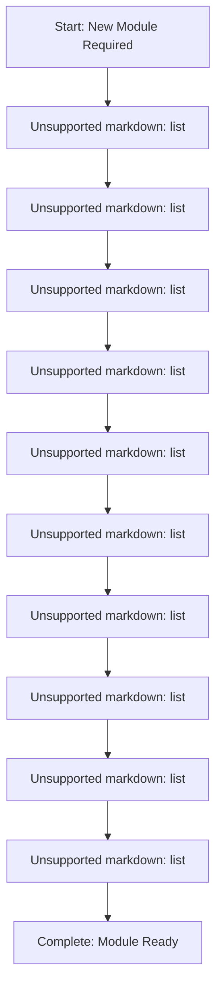
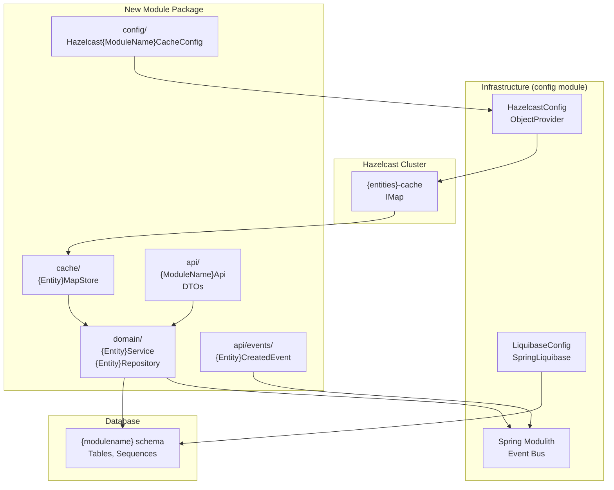
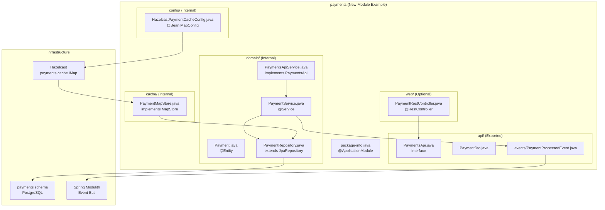

# Adding New Modules

> **Relevant source files**
> * [CLAUDE.md](https://github.com/philipz/spring-modular-monolith/blob/30c9bf30/CLAUDE.md)
> * [README-API.md](https://github.com/philipz/spring-modular-monolith/blob/30c9bf30/README-API.md)
> * [README.md](https://github.com/philipz/spring-modular-monolith/blob/30c9bf30/README.md)
> * [docs/API_ANALYSIS_SUMMARY.txt](https://github.com/philipz/spring-modular-monolith/blob/30c9bf30/docs/API_ANALYSIS_SUMMARY.txt)
> * [docs/REST_API_ANALYSIS.md](https://github.com/philipz/spring-modular-monolith/blob/30c9bf30/docs/REST_API_ANALYSIS.md)
> * [docs/bookstore-microservices.png](https://github.com/philipz/spring-modular-monolith/blob/30c9bf30/docs/bookstore-microservices.png)
> * [docs/improvement.md](https://github.com/philipz/spring-modular-monolith/blob/30c9bf30/docs/improvement.md)
> * [docs/orders-data-ownership-analysis.md](https://github.com/philipz/spring-modular-monolith/blob/30c9bf30/docs/orders-data-ownership-analysis.md)
> * [docs/orders-module-boundary-analysis.md](https://github.com/philipz/spring-modular-monolith/blob/30c9bf30/docs/orders-module-boundary-analysis.md)
> * [docs/orders-traffic-migration.md](https://github.com/philipz/spring-modular-monolith/blob/30c9bf30/docs/orders-traffic-migration.md)
> * [k6.js](https://github.com/philipz/spring-modular-monolith/blob/30c9bf30/k6.js)
> * [src/main/java/com/sivalabs/bookstore/config/LiquibaseConfig.java](https://github.com/philipz/spring-modular-monolith/blob/30c9bf30/src/main/java/com/sivalabs/bookstore/config/LiquibaseConfig.java)
> * [src/main/java/com/sivalabs/bookstore/config/OtlpGrpcTracingConfig.java](https://github.com/philipz/spring-modular-monolith/blob/30c9bf30/src/main/java/com/sivalabs/bookstore/config/OtlpGrpcTracingConfig.java)
> * [src/main/java/com/sivalabs/bookstore/config/OtlpProperties.java](https://github.com/philipz/spring-modular-monolith/blob/30c9bf30/src/main/java/com/sivalabs/bookstore/config/OtlpProperties.java)

This page provides a step-by-step guide for creating new business modules in the Spring Modulith architecture. It covers module structure, infrastructure integration, and testing requirements to maintain proper boundaries and enable independent deployment.

For information about the existing module architecture and communication patterns, see [Spring Modulith Architecture](/philipz/spring-modular-monolith/3-spring-modulith-architecture). For details on testing modules in isolation, see [Integration Testing Strategies](/philipz/spring-modular-monolith/11.3-integration-testing-strategies).

---

## Module Structure Requirements

A Spring Modulith module is a self-contained package with clear boundaries, its own database schema, cache configuration, and well-defined APIs. Each module must follow these structural conventions:

### Package Organization

```markdown
src/main/java/com/sivalabs/bookstore/{modulename}/
├── api/                    # Public API interfaces and DTOs (exported)
│   ├── events/            # Domain events for other modules
│   └── {ModuleName}Api.java
├── domain/                # Domain entities and business logic (internal)
│   ├── {Entity}.java
│   ├── {Entity}Repository.java
│   └── {Entity}Service.java
├── cache/                 # Module-specific cache implementation (internal)
│   └── {Entity}MapStore.java
├── config/                # Module infrastructure configuration (internal)
│   └── Hazelcast{ModuleName}CacheConfig.java
├── web/                   # REST controllers (optional)
│   └── {Entity}RestController.java
├── grpc/                  # gRPC adapters (optional)
│   ├── {ModuleName}GrpcService.java
│   └── {ModuleName}GrpcClient.java
└── package-info.java      # Module boundary definition (required)
```

**Sources:**

* [README.md L119-L133](https://github.com/philipz/spring-modular-monolith/blob/30c9bf30/README.md#L119-L133)
* [CLAUDE.md L236-L247](https://github.com/philipz/spring-modular-monolith/blob/30c9bf30/CLAUDE.md#L236-L247)

---

## Module Boundary Definition

Every module must declare its boundaries using `@ApplicationModule` in `package-info.java`:

```javascript
@ApplicationModule(allowedDependencies = {
    "catalog::product-api",  // Can call Catalog's ProductApi
    "common::cache",         // Can use common cache utilities
    "common::events"         // Can use common event infrastructure
})
package com.sivalabs.bookstore.{modulename};

import org.springframework.modulith.ApplicationModule;
```

The `allowedDependencies` attribute explicitly declares which other modules this module may depend on, using the syntax `"moduleName::namedInterface"`. The `common` module is marked as `OPEN` and is accessible to all modules without explicit declaration.

**Key Rules:**

* Only depend on exported APIs, never on internal implementation
* Prefer event-driven communication over direct API calls
* Repository and service classes remain internal to the module
* Use `@NamedInterface` to create fine-grained access points within a module

**Sources:**

* [CLAUDE.md L249-L256](https://github.com/philipz/spring-modular-monolith/blob/30c9bf30/CLAUDE.md#L249-L256)
* [README.md L30-L35](https://github.com/philipz/spring-modular-monolith/blob/30c9bf30/README.md#L30-L35)

---

## Step-by-Step Module Creation

### Diagram: New Module Creation Flow



**Sources:**

* [CLAUDE.md L257-L263](https://github.com/philipz/spring-modular-monolith/blob/30c9bf30/CLAUDE.md#L257-L263)
* [README.md L7-L15](https://github.com/philipz/spring-modular-monolith/blob/30c9bf30/README.md#L7-L15)

---

### 1. Create Package Structure

Create the base package and subdirectories:

```
mkdir -p src/main/java/com/sivalabs/bookstore/{modulename}/{api,domain,cache,config,web}
mkdir -p src/main/java/com/sivalabs/bookstore/{modulename}/api/events
mkdir -p src/main/resources/db/migration/{modulename}
mkdir -p src/test/java/com/sivalabs/bookstore/{modulename}
```

**Sources:**

* [CLAUDE.md L236-L247](https://github.com/philipz/spring-modular-monolith/blob/30c9bf30/CLAUDE.md#L236-L247)

---

### 2. Define Module Boundary

Create `package-info.java` at the module root:

```javascript
/**
 * {ModuleName} Module
 * 
 * Manages {brief description of module responsibility}
 */
@ApplicationModule(allowedDependencies = {
    // List only required dependencies
    // Example: "catalog::product-api" if you need product information
})
package com.sivalabs.bookstore.{modulename};

import org.springframework.modulith.ApplicationModule;
```

Reference the catalog module's boundary definition at [src/main/java/com/sivalabs/bookstore/catalog/package-info.java L1-L11](https://github.com/philipz/spring-modular-monolith/blob/30c9bf30/src/main/java/com/sivalabs/bookstore/catalog/package-info.java#L1-L11)

 and orders module at [src/main/java/com/sivalabs/bookstore/orders/package-info.java L1-L17](https://github.com/philipz/spring-modular-monolith/blob/30c9bf30/src/main/java/com/sivalabs/bookstore/orders/package-info.java#L1-L17)

 for examples.

**Sources:**

* [CLAUDE.md L249-L256](https://github.com/philipz/spring-modular-monolith/blob/30c9bf30/CLAUDE.md#L249-L256)

---

### 3. Create Database Schema with Liquibase

Create Liquibase changesets for your module's schema:

**File:** `src/main/resources/db/migration/{modulename}/V1__{modulename}_create_tables.sql`

```sql
-- Create dedicated schema for this module
CREATE SCHEMA IF NOT EXISTS {modulename};

-- Create main entity table
CREATE TABLE {modulename}.{entities} (
    id BIGSERIAL PRIMARY KEY,
    -- Add columns
    created_at TIMESTAMP NOT NULL DEFAULT CURRENT_TIMESTAMP,
    updated_at TIMESTAMP NOT NULL DEFAULT CURRENT_TIMESTAMP
);

-- Create indexes
CREATE INDEX idx_{entity}_{field} ON {modulename}.{entities}({field});
```

The `LiquibaseConfig` automatically discovers and applies these migrations. Each module owns its schema independently, following the database-per-module pattern.

**Sources:**

* [src/main/java/com/sivalabs/bookstore/config/LiquibaseConfig.java L1-L76](https://github.com/philipz/spring-modular-monolith/blob/30c9bf30/src/main/java/com/sivalabs/bookstore/config/LiquibaseConfig.java#L1-L76)
* [README.md L135-L139](https://github.com/philipz/spring-modular-monolith/blob/30c9bf30/README.md#L135-L139)

---

### 4. Implement Domain Layer

Create JPA entities, repositories, and services within the `domain/` package:

**Entity:**

```python
package com.sivalabs.bookstore.{modulename}.domain;

@Entity
@Table(name = "{entities}", schema = "{modulename}")
public class {Entity} {
    @Id
    @GeneratedValue(strategy = GenerationType.IDENTITY)
    private Long id;
    
    // Fields, getters, setters
}
```

**Repository:**

```go
package com.sivalabs.bookstore.{modulename}.domain;

interface {Entity}Repository extends JpaRepository<{Entity}, Long> {
    // Custom query methods
}
```

**Service:**

```javascript
package com.sivalabs.bookstore.{modulename}.domain;

@Service
@Transactional(readOnly = true)
class {Entity}Service {
    private final {Entity}Repository repository;
    private final ApplicationEventPublisher eventPublisher;
    
    @Transactional
    public {Entity} create({Entity}Request request) {
        // Business logic
        var entity = repository.save(newEntity);
        
        // Publish domain event
        eventPublisher.publishEvent(new {Entity}CreatedEvent(entity.getId()));
        
        return entity;
    }
}
```

Repository and service classes should not be public—they are internal to the module.

**Sources:**

* [README.md L30-L35](https://github.com/philipz/spring-modular-monolith/blob/30c9bf30/README.md#L30-L35)
* [CLAUDE.md L163-L172](https://github.com/philipz/spring-modular-monolith/blob/30c9bf30/CLAUDE.md#L163-L172)

---

### 5. Configure Hazelcast Cache

Each module contributes its own `MapConfig` bean for Hazelcast caching:

**Cache Configuration:**

```python
package com.sivalabs.bookstore.{modulename}.config;

@Configuration
public class Hazelcast{ModuleName}CacheConfig {
    
    @Bean
    public MapConfig {entity}CacheConfig(CacheProperties cacheProperties) {
        String cacheName = "{entities}-cache";
        
        MapConfig mapConfig = new MapConfig(cacheName);
        mapConfig.setTimeToLiveSeconds(cacheProperties.getTimeToLiveSeconds());
        mapConfig.setMaxIdleSeconds(cacheProperties.getMaxIdleSeconds());
        
        // Configure eviction
        EvictionConfig evictionConfig = new EvictionConfig()
            .setEvictionPolicy(EvictionPolicy.LRU)
            .setMaxSizePolicy(MaxSizePolicy.PER_NODE)
            .setSize(cacheProperties.getMaxSize());
        mapConfig.setEvictionConfig(evictionConfig);
        
        return mapConfig;
    }
}
```

**MapStore for Write-Through Caching:**

```python
package com.sivalabs.bookstore.{modulename}.cache;

@Component
public class {Entity}MapStore implements MapStore<Long, {Entity}> {
    private final {Entity}Repository repository;
    
    @Override
    public {Entity} load(Long key) {
        return repository.findById(key).orElse(null);
    }
    
    @Override
    public Map<Long, {Entity}> loadAll(Collection<Long> keys) {
        return repository.findAllById(keys).stream()
            .collect(Collectors.toMap({Entity}::getId, Function.identity()));
    }
    
    @Override
    public void store(Long key, {Entity} value) {
        repository.save(value);
    }
    
    // Implement other MapStore methods
}
```

The `HazelcastConfig` at [src/main/java/com/sivalabs/bookstore/config/HazelcastConfig.java L1-L100](https://github.com/philipz/spring-modular-monolith/blob/30c9bf30/src/main/java/com/sivalabs/bookstore/config/HazelcastConfig.java#L1-L100)

 automatically discovers all `MapConfig` beans using `ObjectProvider<MapConfig>`.

**Sources:**

* [README.md L26-L27](https://github.com/philipz/spring-modular-monolith/blob/30c9bf30/README.md#L26-L27)
* [CLAUDE.md L142-L154](https://github.com/philipz/spring-modular-monolith/blob/30c9bf30/CLAUDE.md#L142-L154)

---

### Diagram: Module Infrastructure Integration



**Sources:**

* [README.md L26-L28](https://github.com/philipz/spring-modular-monolith/blob/30c9bf30/README.md#L26-L28)
* [CLAUDE.md L142-L154](https://github.com/philipz/spring-modular-monolith/blob/30c9bf30/CLAUDE.md#L142-L154)
* System Architecture Diagrams (Diagram 3: Data, Caching, and Persistence Architecture)

---

### 6. Define Public API

Create an exported API interface and DTOs for cross-module communication:

**API Interface:**

```go
package com.sivalabs.bookstore.{modulename}.api;

public interface {ModuleName}Api {
    {Entity}Dto getById(Long id);
    List<{Entity}Dto> findAll();
}
```

**Implementation (internal to module):**

```python
package com.sivalabs.bookstore.{modulename}.domain;

@Service
class {ModuleName}ApiService implements {ModuleName}Api {
    private final {Entity}Service service;
    
    @Override
    public {Entity}Dto getById(Long id) {
        return service.findById(id)
            .map(this::toDto)
            .orElseThrow(() -> new {Entity}NotFoundException(id));
    }
}
```

The `api/` package contents are exported and can be imported by other modules. All other packages remain internal.

**Sources:**

* [README.md L32-L33](https://github.com/philipz/spring-modular-monolith/blob/30c9bf30/README.md#L32-L33)
* [CLAUDE.md L233-L235](https://github.com/philipz/spring-modular-monolith/blob/30c9bf30/CLAUDE.md#L233-L235)

---

### 7. Add REST or gRPC Endpoints (Optional)

If external access is required, implement REST controllers or gRPC services:

**REST Controller:**

```python
package com.sivalabs.bookstore.{modulename}.web;

@RestController
@RequestMapping("/api/{entities}")
public class {Entity}RestController {
    private final {ModuleName}Api api;
    
    @GetMapping("/{id}")
    public ResponseEntity<{Entity}Dto> getById(@PathVariable Long id) {
        return ResponseEntity.ok(api.getById(id));
    }
}
```

**gRPC Service (if needed):**

1. Define `.proto` file in `src/main/proto/`
2. Implement gRPC service following the pattern in [src/main/java/com/sivalabs/bookstore/orders/grpc/](https://github.com/philipz/spring-modular-monolith/blob/30c9bf30/src/main/java/com/sivalabs/bookstore/orders/grpc/)
3. Configure gRPC server/client beans in the module's `config/` package

**Sources:**

* [README.md L37-L41](https://github.com/philipz/spring-modular-monolith/blob/30c9bf30/README.md#L37-L41)
* [CLAUDE.md L223-L229](https://github.com/philipz/spring-modular-monolith/blob/30c9bf30/CLAUDE.md#L223-L229)

---

### 8. Configure Event Publishing and Consumption

**Publishing Events:**

```python
package com.sivalabs.bookstore.{modulename}.domain;

@Service
class {Entity}Service {
    private final ApplicationEventPublisher eventPublisher;
    
    public void performAction({Entity} entity) {
        // Business logic
        
        // Publish domain event
        eventPublisher.publishEvent(
            new {Entity}CreatedEvent(entity.getId(), entity.getCode())
        );
    }
}
```

**Event Class (in api/events/):**

```go
package com.sivalabs.bookstore.{modulename}.api.events;

public record {Entity}CreatedEvent(Long id, String code) {}
```

**Consuming Events (in other modules):**

```python
@Component
class {Entity}EventListener {
    
    @EventListener
    @Transactional
    public void on({Entity}CreatedEvent event) {
        // Handle event
    }
}
```

Events are automatically published to both the internal Spring Modulith event bus (JDBC-backed) and external RabbitMQ for asynchronous processing.

**Sources:**

* [README.md L30-L35](https://github.com/philipz/spring-modular-monolith/blob/30c9bf30/README.md#L30-L35)
* [CLAUDE.md L275-L280](https://github.com/philipz/spring-modular-monolith/blob/30c9bf30/CLAUDE.md#L275-L280)

---

### 9. Add Module Tests

Create integration tests using `@ApplicationModuleTest`:

```javascript
package com.sivalabs.bookstore.{modulename};

@ApplicationModuleTest
class {ModuleName}IntegrationTests {
    
    @Autowired
    private {ModuleName}Api api;
    
    @Autowired
    private Scenario scenario;
    
    @Test
    void shouldPublishEventWhenCreated() {
        // Given
        var request = new Create{Entity}Request(/*...*/);
        
        // When/Then
        scenario.publish(() -> api.create(request))
            .andWaitForEventOfType({Entity}CreatedEvent.class)
            .matching(event -> event.id() != null)
            .toArrive();
    }
}
```

Test event flows using Spring Modulith's `Scenario` API to verify event publication and consumption.

**Sources:**

* [CLAUDE.md L173-L180](https://github.com/philipz/spring-modular-monolith/blob/30c9bf30/CLAUDE.md#L173-L180)
* [CLAUDE.md L288-L293](https://github.com/philipz/spring-modular-monolith/blob/30c9bf30/CLAUDE.md#L288-L293)

---

### 10. Verify Module Structure

Add the new module to `ModularityTests`:

```
@Test
void verifyModuleStructure() {
    ApplicationModules modules = ApplicationModules.of(BookStoreApplication.class);
    modules.verify();
}

@Test
void shouldNotHaveUnauthorizedDependencies() {
    ApplicationModules modules = ApplicationModules.of(BookStoreApplication.class);
    modules.forEach(module -> {
        // Verify no internal types are exposed
        // Verify dependencies match @ApplicationModule declaration
    });
}
```

Run tests with `./mvnw test` to ensure no module boundary violations exist.

**Sources:**

* [CLAUDE.md L157-L162](https://github.com/philipz/spring-modular-monolith/blob/30c9bf30/CLAUDE.md#L157-L162)

---

## Module Integration Checklist

Use this checklist to ensure complete integration:

| Component | Location | Required | Notes |
| --- | --- | --- | --- |
| `package-info.java` | Module root | ✅ | Defines boundaries with `@ApplicationModule` |
| Database schema | `db/migration/{modulename}/` | ✅ | One or more Liquibase changesets |
| JPA entities | `domain/` | ✅ | Annotated with schema name |
| Repository | `domain/` | ✅ | Extends `JpaRepository` |
| Service | `domain/` | ✅ | Contains business logic |
| Public API | `api/` | ✅ | Exported interface for other modules |
| DTOs | `api/` | ✅ | Data transfer objects |
| Domain events | `api/events/` | ⚠️ | If publishing events to other modules |
| Cache config | `config/` | ⚠️ | `MapConfig` bean if caching is needed |
| MapStore | `cache/` | ⚠️ | If using write-through caching |
| REST controller | `web/` | ❌ | Only if external HTTP access needed |
| gRPC service | `grpc/` | ❌ | Only if gRPC access needed |
| Integration tests | `src/test/` | ✅ | Using `@ApplicationModuleTest` |
| Module verification | `ModularityTests` | ✅ | Updated to include new module |

**Legend:** ✅ Required, ⚠️ Conditional, ❌ Optional

**Sources:**

* [CLAUDE.md L257-L263](https://github.com/philipz/spring-modular-monolith/blob/30c9bf30/CLAUDE.md#L257-L263)
* [README.md L7-L15](https://github.com/philipz/spring-modular-monolith/blob/30c9bf30/README.md#L7-L15)

---

## Diagram: Complete Module Structure Example



**Sources:**

* [README.md L119-L133](https://github.com/philipz/spring-modular-monolith/blob/30c9bf30/README.md#L119-L133)
* [CLAUDE.md L236-L247](https://github.com/philipz/spring-modular-monolith/blob/30c9bf30/CLAUDE.md#L236-L247)

---

## Best Practices

### Module Independence

* Keep modules as self-contained as possible
* Minimize dependencies on other modules (prefer events over APIs)
* Never access another module's `domain/`, `cache/`, or `config/` packages directly
* Always go through exported `api/` interfaces

### Data Ownership

* Each module owns its database schema completely
* No cross-schema foreign keys or joins
* Use domain events to maintain eventual consistency across modules

### Cache Isolation

* Each module configures its own caches independently
* Use distinct cache names: `{entities}-cache`
* Choose appropriate TTL based on data volatility (products: 3600s, inventory: 1800s)

### Event Design

* Events should be immutable records
* Place events in `api/events/` package
* Include only necessary data (avoid exposing internal IDs unnecessarily)
* Events are persisted in the `events` schema for replay

### Testing Strategy

* Use `@ApplicationModuleTest` to test modules in isolation
* Test event flows with Spring Modulith's `Scenario` API
* Ensure `ModularityTests.verify()` passes before committing
* Use Testcontainers for integration tests requiring database/messaging

**Sources:**

* [CLAUDE.md L229-L237](https://github.com/philipz/spring-modular-monolith/blob/30c9bf30/CLAUDE.md#L229-L237)
* [README.md L30-L35](https://github.com/philipz/spring-modular-monolith/blob/30c9bf30/README.md#L30-L35)

---

## Common Pitfalls

1. **Forgetting `package-info.java`**: Module boundaries won't be enforced
2. **Exposing internal classes**: Keep `domain/`, `cache/`, `config/` package-private
3. **Cross-module repository access**: Always use exported APIs
4. **Missing MapStore registration**: Cache won't persist to database
5. **Wrong Liquibase path**: Migrations must be in `db/migration/{modulename}/`
6. **Hardcoded cache names**: Use properties or constants for consistency

**Sources:**

* [CLAUDE.md L303-L313](https://github.com/philipz/spring-modular-monolith/blob/30c9bf30/CLAUDE.md#L303-L313)

---

## Related Configuration

### Cache Properties

All modules share common cache configuration properties defined in `application.properties`. When creating a new module, these defaults apply unless overridden in your `MapConfig`:

```
bookstore.cache.enabled=true
bookstore.cache.time-to-live-seconds=3600
bookstore.cache.max-size=1000
bookstore.cache.write-through=true
```

See [Configuration Reference](/philipz/spring-modular-monolith/15-configuration-reference) for the complete list of cache properties.

### Observability

New modules automatically benefit from OpenTelemetry instrumentation. Module boundaries and event publication are traced via Spring Modulith's observability module. Ensure you test traces in HyperDX after creating a module.

**Sources:**

* [src/main/java/com/sivalabs/bookstore/config/OtlpProperties.java L1-L63](https://github.com/philipz/spring-modular-monolith/blob/30c9bf30/src/main/java/com/sivalabs/bookstore/config/OtlpProperties.java#L1-L63)
* [src/main/java/com/sivalabs/bookstore/config/OtlpGrpcTracingConfig.java L1-L64](https://github.com/philipz/spring-modular-monolith/blob/30c9bf30/src/main/java/com/sivalabs/bookstore/config/OtlpGrpcTracingConfig.java#L1-L64)

---

## Example: Creating a Shipping Module

A complete example of adding a `shipping` module:

1. **Create structure:** ``` mkdir -p src/main/java/com/sivalabs/bookstore/shipping/{api,domain,cache,config} ```
2. **Define boundary** (`package-info.java`): ```go @ApplicationModule(allowedDependencies = {"orders::order-api", "common::cache"}) package com.sivalabs.bookstore.shipping; ```
3. **Create schema** (`db/migration/shipping/V1__shipping_create_tables.sql`): ```sql CREATE SCHEMA IF NOT EXISTS shipping; CREATE TABLE shipping.shipments (...); ```
4. **Implement domain** (entity, repository, service in `domain/`)
5. **Add cache** (`config/HazelcastShippingCacheConfig.java` with `MapConfig` bean)
6. **Export API** (`api/ShippingApi.java` interface)
7. **Subscribe to events:** ```sql @EventListener public void onOrderCreated(OrderCreatedEvent event) {     // Create shipment } ```
8. **Test** with `@ApplicationModuleTest`

**Sources:**

* [CLAUDE.md L257-L263](https://github.com/philipz/spring-modular-monolith/blob/30c9bf30/CLAUDE.md#L257-L263)
* [README.md L7-L15](https://github.com/philipz/spring-modular-monolith/blob/30c9bf30/README.md#L7-L15)