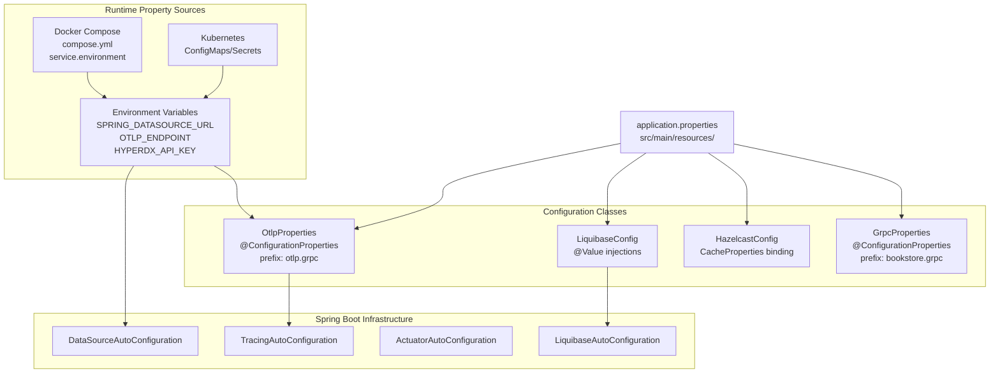
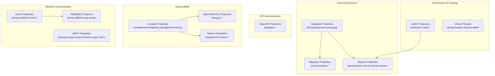
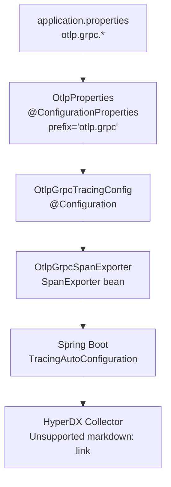
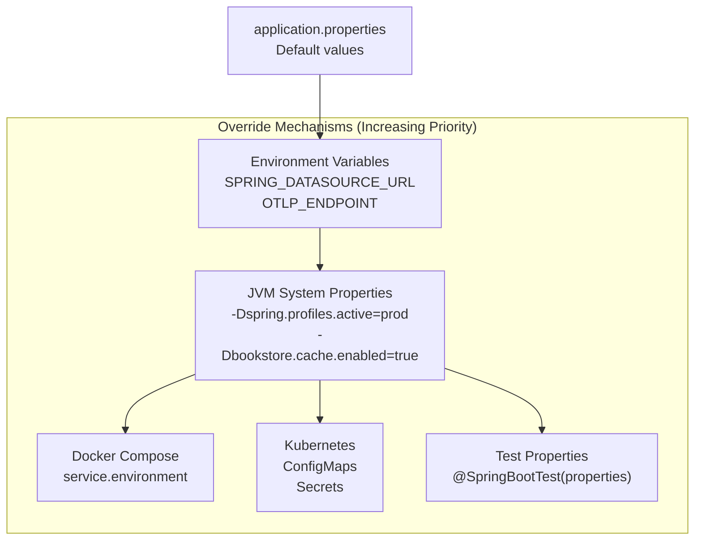

# Application Properties

> **Relevant source files**
> * [CLAUDE.md](https://github.com/philipz/spring-modular-monolith/blob/30c9bf30/CLAUDE.md)
> * [compose.yml](https://github.com/philipz/spring-modular-monolith/blob/30c9bf30/compose.yml)
> * [pom.xml](https://github.com/philipz/spring-modular-monolith/blob/30c9bf30/pom.xml)
> * [src/main/java/com/sivalabs/bookstore/config/LiquibaseConfig.java](https://github.com/philipz/spring-modular-monolith/blob/30c9bf30/src/main/java/com/sivalabs/bookstore/config/LiquibaseConfig.java)
> * [src/main/java/com/sivalabs/bookstore/config/OtlpGrpcTracingConfig.java](https://github.com/philipz/spring-modular-monolith/blob/30c9bf30/src/main/java/com/sivalabs/bookstore/config/OtlpGrpcTracingConfig.java)
> * [src/main/java/com/sivalabs/bookstore/config/OtlpProperties.java](https://github.com/philipz/spring-modular-monolith/blob/30c9bf30/src/main/java/com/sivalabs/bookstore/config/OtlpProperties.java)
> * [src/main/resources/application.properties](https://github.com/philipz/spring-modular-monolith/blob/30c9bf30/src/main/resources/application.properties)
> * [src/test/java/com/sivalabs/bookstore/BookStoreApplicationTests.java](https://github.com/philipz/spring-modular-monolith/blob/30c9bf30/src/test/java/com/sivalabs/bookstore/BookStoreApplicationTests.java)
> * [src/test/java/com/sivalabs/bookstore/TestcontainersConfiguration.java](https://github.com/philipz/spring-modular-monolith/blob/30c9bf30/src/test/java/com/sivalabs/bookstore/TestcontainersConfiguration.java)

This page documents all Spring Boot application properties defined in the main configuration file for the Spring Modular Monolith application. These properties control database connections, caching behavior, messaging, observability, gRPC communication, and module-specific settings.

For cache-specific properties and their detailed semantics, see [Cache Properties](/philipz/spring-modular-monolith/15.2-cache-properties). For gRPC-specific properties and configuration classes, see [gRPC Properties](/philipz/spring-modular-monolith/15.3-grpc-properties). For environment variables used in Docker Compose and Kubernetes deployments, see [Environment Variables](/philipz/spring-modular-monolith/15.4-environment-variables).

## Configuration Architecture

The application uses a hierarchical configuration system where properties from `application.properties` can be overridden by environment variables in different deployment contexts.



**Sources:**

* [src/main/resources/application.properties L1-L150](https://github.com/philipz/spring-modular-monolith/blob/30c9bf30/src/main/resources/application.properties#L1-L150)
* [src/main/java/com/sivalabs/bookstore/config/OtlpProperties.java L1-L63](https://github.com/philipz/spring-modular-monolith/blob/30c9bf30/src/main/java/com/sivalabs/bookstore/config/OtlpProperties.java#L1-L63)
* [src/main/java/com/sivalabs/bookstore/config/LiquibaseConfig.java L1-L76](https://github.com/philipz/spring-modular-monolith/blob/30c9bf30/src/main/java/com/sivalabs/bookstore/config/LiquibaseConfig.java#L1-L76)
* [compose.yml L58-L117](https://github.com/philipz/spring-modular-monolith/blob/30c9bf30/compose.yml#L58-L117)

## Property Categories and Usage



**Sources:**

* [src/main/resources/application.properties L1-L150](https://github.com/philipz/spring-modular-monolith/blob/30c9bf30/src/main/resources/application.properties#L1-L150)

## Application General Settings

These properties configure the core Spring Boot application behavior.

| Property | Default Value | Description |
| --- | --- | --- |
| `spring.application.name` | `spring-modular-monolith` | Application name used in logging and distributed tracing |
| `spring.threads.virtual.enabled` | `true` | Enables Java 21 virtual threads for improved scalability |
| `logging.pattern.correlation` | `[${spring.application.name:},%X{traceId:-},%X{spanId:-}]` | Log pattern including trace correlation IDs |
| `logging.include-application-name` | `false` | Controls whether application name is included separately in logs |
| `spring.docker.compose.enabled` | `false` | Disables automatic Docker Compose integration |

**Sources:**

* [src/main/resources/application.properties L1-L5](https://github.com/philipz/spring-modular-monolith/blob/30c9bf30/src/main/resources/application.properties#L1-L5)

## Database Configuration

PostgreSQL database connection settings with HikariCP connection pooling.

| Property | Default Value | Environment Override | Description |
| --- | --- | --- | --- |
| `spring.datasource.url` | `jdbc:postgresql://localhost:5432/postgres` | `SPRING_DATASOURCE_URL` | JDBC connection URL |
| `spring.datasource.username` | `postgres` | `SPRING_DATASOURCE_USERNAME` | Database username |
| `spring.datasource.password` | `postgres` | `SPRING_DATASOURCE_PASSWORD` | Database password |
| `spring.datasource.hikari.maximum-pool-size` | `10` | `SPRING_DATASOURCE_POOL_SIZE` | Maximum number of database connections in pool |
| `spring.jpa.open-in-view` | `false` | - | Disables Open Session In View anti-pattern |
| `spring.jpa.show-sql` | `false` | - | Controls SQL statement logging |

### JDBC DataSource Proxy Configuration

| Property | Default Value | Description |
| --- | --- | --- |
| `jdbc.datasource-proxy.query.enable-logging` | `false` | Enables query logging via datasource-proxy |
| `jdbc.datasource-proxy.query.logger-name` | `bookstore.query-logger` | Logger name for query logging |
| `jdbc.datasource-proxy.query.log-level` | `DEBUG` | Log level for queries |
| `jdbc.datasource-proxy.multiline` | `false` | Single-line query formatting |
| `logging.level.bookstore.query-logger` | `DEBUG` | Logger level for query output |

**Docker Compose Override Example:**

```yaml
# From compose.yml:62-66
SPRING_DATASOURCE_DRIVER_CLASS_NAME: org.postgresql.Driver
SPRING_DATASOURCE_URL: jdbc:postgresql://postgres:5432/postgres
SPRING_DATASOURCE_USERNAME: postgres
SPRING_DATASOURCE_PASSWORD: postgres
SPRING_DATASOURCE_POOL_SIZE: 200
```

**Sources:**

* [src/main/resources/application.properties L7-L18](https://github.com/philipz/spring-modular-monolith/blob/30c9bf30/src/main/resources/application.properties#L7-L18)
* [compose.yml L62-L66](https://github.com/philipz/spring-modular-monolith/blob/30c9bf30/compose.yml#L62-L66)
* [pom.xml L89-L93](https://github.com/philipz/spring-modular-monolith/blob/30c9bf30/pom.xml#L89-L93)

## Database Migration Configuration

Liquibase controls database schema evolution for all modules.

| Property | Default Value | Description |
| --- | --- | --- |
| `spring.liquibase.enabled` | `true` | Enables Liquibase migration on startup |
| `spring.liquibase.change-log` | `classpath:db/db.changelog-master.xml` | Master changelog file location |
| `spring.liquibase.contexts` | (empty) | Comma-separated Liquibase contexts |
| `spring.liquibase.default-schema` | (empty) | Default schema for Liquibase metadata tables |
| `spring.liquibase.drop-first` | `false` | Whether to drop database before migration (dangerous) |

The `LiquibaseConfig` class reads these properties and creates a `SpringLiquibase` bean. Each module maintains its own migration files under `src/main/resources/db/migration/`.

**Sources:**

* [src/main/resources/application.properties L20-L25](https://github.com/philipz/spring-modular-monolith/blob/30c9bf30/src/main/resources/application.properties#L20-L25)
* [src/main/java/com/sivalabs/bookstore/config/LiquibaseConfig.java L20-L75](https://github.com/philipz/spring-modular-monolith/blob/30c9bf30/src/main/java/com/sivalabs/bookstore/config/LiquibaseConfig.java#L20-L75)

## RabbitMQ Configuration

Message broker connection settings for external event publishing.

| Property | Default Value | Description |
| --- | --- | --- |
| `spring.rabbitmq.host` | `localhost` | RabbitMQ server hostname |
| `spring.rabbitmq.port` | `5672` | RabbitMQ AMQP port |
| `spring.rabbitmq.username` | `guest` | RabbitMQ username |
| `spring.rabbitmq.password` | `guest` | RabbitMQ password |
| `app.amqp.new-orders.bind` | `true` | Enables new-orders queue and exchange binding |

**Docker Compose Configuration:**
The `compose.yml` file shows how RabbitMQ is configured in different services:

```yaml
# Monolith service (compose.yml:67-70)
SPRING_RABBITMQ_HOST: rabbitmq
SPRING_RABBITMQ_PORT: 5672
SPRING_RABBITMQ_USERNAME: guest
SPRING_RABBITMQ_PASSWORD: guest

# Orders service with additional tuning (compose.yml:101-105)
SPRING_RABBITMQ_HOST: rabbitmq
SPRING_RABBITMQ_PORT: 5672
SPRING_RABBITMQ_USERNAME: guest
SPRING_RABBITMQ_PASSWORD: guest
SPRING_RABBITMQ_CACHE_CHANNEL_SIZE: 300
```

**Sources:**

* [src/main/resources/application.properties L27-L34](https://github.com/philipz/spring-modular-monolith/blob/30c9bf30/src/main/resources/application.properties#L27-L34)
* [compose.yml L67-L70](https://github.com/philipz/spring-modular-monolith/blob/30c9bf30/compose.yml#L67-L70)
* [compose.yml L101-L105](https://github.com/philipz/spring-modular-monolith/blob/30c9bf30/compose.yml#L101-L105)

## Spring Modulith Events Configuration

Configuration for the internal JDBC-backed event store that ensures guaranteed event delivery.

| Property | Default Value | Description |
| --- | --- | --- |
| `spring.modulith.events.jdbc.schema` | `events` | Database schema for event publication log |
| `spring.modulith.events.jdbc.schema-initialization.enabled` | `true` | Auto-create event tables on startup |
| `spring.modulith.events.republish-outstanding-events-on-restart` | `true` | Republish incomplete events after restart |

The `events` schema stores the event publication log, tracking which events have been successfully published to external listeners. This provides at-least-once delivery guarantees for domain events.

**Sources:**

* [src/main/resources/application.properties L36-L40](https://github.com/philipz/spring-modular-monolith/blob/30c9bf30/src/main/resources/application.properties#L36-L40)

## Cache Configuration

Hazelcast distributed cache settings. For detailed cache property documentation, see [Cache Properties](/philipz/spring-modular-monolith/15.2-cache-properties).

| Property | Default Value | Description |
| --- | --- | --- |
| `bookstore.cache.enabled` | `true` | Master switch for all module caches |
| `bookstore.cache.max-size` | `1000` | Maximum entries per cache map |
| `bookstore.cache.time-to-live-seconds` | `3600` | Default TTL (1 hour) for cache entries |
| `bookstore.cache.max-idle-seconds` | `0` | Maximum idle time (0 = disabled) |
| `bookstore.cache.backup-count` | `1` | Number of backup replicas in cluster |
| `bookstore.cache.write-through` | `true` | Enables write-through to database via MapStore |
| `bookstore.cache.write-batch-size` | `1` | Number of entries to batch in write operations |
| `bookstore.cache.write-delay-seconds` | `0` | Delay before writing (0 = immediate) |
| `bookstore.cache.read-backup-data` | `true` | Allow reading from backup replicas |
| `bookstore.cache.metrics-enabled` | `true` | Expose cache metrics to Actuator |
| `bookstore.cache.circuit-breaker.failure-threshold` | `5` | Failures before circuit opens |
| `bookstore.cache.circuit-breaker.recovery-timeout` | `30000` | Milliseconds before attempting recovery |

The comment on line 68 documents module-specific TTL overrides that are hard-coded in configuration classes rather than externalized as properties.

**Sources:**

* [src/main/resources/application.properties L42-L69](https://github.com/philipz/spring-modular-monolith/blob/30c9bf30/src/main/resources/application.properties#L42-L69)

## Actuator and Observability Configuration

Spring Boot Actuator exposes management endpoints for monitoring and health checks.

| Property | Default Value | Description |
| --- | --- | --- |
| `management.endpoints.web.exposure.include` | `*` | Expose all actuator endpoints (development setting) |
| `management.endpoint.health.probes.enabled` | `true` | Enable Kubernetes liveness/readiness probes |
| `management.tracing.enabled` | `true` | Enable distributed tracing |
| `management.tracing.sampling.probability` | `1.0` | Sample 100% of traces (full sampling) |

### Metrics Configuration

| Property | Default Value | Description |
| --- | --- | --- |
| `management.metrics.enable.jdbc` | `false` | Disable JDBC connection metrics to avoid tag conflicts |
| `management.metrics.enable.hikaricp` | `false` | Disable HikariCP metrics to avoid tag conflicts |
| `management.metrics.tags.common.application` | `${spring.application.name}` | Common tag applied to all metrics |

The `spring.modulith.observability.instrumentation.datasource.enabled=false` setting prevents module-specific datasource metrics that would create Prometheus tag cardinality issues.

**Sources:**

* [src/main/resources/application.properties L70-L111](https://github.com/philipz/spring-modular-monolith/blob/30c9bf30/src/main/resources/application.properties#L70-L111)

## OpenTelemetry OTLP Configuration

OpenTelemetry Protocol (OTLP) settings for exporting traces to HyperDX or other observability backends.

| Property | Default Value | Environment Override | Description |
| --- | --- | --- | --- |
| `otlp.grpc.enabled` | `true` | - | Enable OTLP gRPC exporter |
| `otlp.grpc.endpoint` | `http://localhost:4317` | `OTLP_ENDPOINT` | OTLP gRPC collector endpoint |
| `otlp.grpc.timeout` | `10s` | - | Request timeout for trace export |
| `otlp.grpc.compression` | `gzip` | - | Compression algorithm (none, gzip) |
| `otlp.grpc.headers.authorization` | (empty) | `OTLP_GRPC_HEADERS_AUTHORIZATION` | Authorization header for collector authentication |

These properties bind to the `OtlpProperties` configuration class via `@ConfigurationProperties(prefix = "otlp.grpc")`.



**Docker Compose Example:**

```css
# From compose.yml:72-73
OTLP_ENDPOINT: http://hyperdx:4317
OTLP_GRPC_HEADERS_AUTHORIZATION: ${HYPERDX_API_KEY}
```

**Sources:**

* [src/main/resources/application.properties L76-L82](https://github.com/philipz/spring-modular-monolith/blob/30c9bf30/src/main/resources/application.properties#L76-L82)
* [src/main/java/com/sivalabs/bookstore/config/OtlpProperties.java L9-L63](https://github.com/philipz/spring-modular-monolith/blob/30c9bf30/src/main/java/com/sivalabs/bookstore/config/OtlpProperties.java#L9-L63)
* [src/main/java/com/sivalabs/bookstore/config/OtlpGrpcTracingConfig.java L34-L62](https://github.com/philipz/spring-modular-monolith/blob/30c9bf30/src/main/java/com/sivalabs/bookstore/config/OtlpGrpcTracingConfig.java#L34-L62)
* [compose.yml L72-L73](https://github.com/philipz/spring-modular-monolith/blob/30c9bf30/compose.yml#L72-L73)

## Session Management Configuration

Hazelcast-backed distributed session storage enables stateful shopping cart functionality.

| Property | Default Value | Description |
| --- | --- | --- |
| `spring.session.store-type` | `hazelcast` | Use Hazelcast for session storage |
| `spring.session.hazelcast.map-name` | `spring:session:sessions` | Hazelcast IMap name for sessions |
| `spring.session.timeout` | `30m` | Session timeout duration |
| `server.servlet.session.timeout` | `30m` | Servlet container session timeout |
| `server.servlet.session.cookie.name` | `BOOKSTORE_SESSION` | Session cookie name |
| `server.servlet.session.cookie.http-only` | `true` | Prevent JavaScript access to cookie |
| `server.servlet.session.cookie.secure` | `${USE_SECURE_COOKIES:false}` | Require HTTPS for cookie (production setting) |
| `server.servlet.session.cookie.same-site` | `strict` | CSRF protection via SameSite attribute |

**Sources:**

* [src/main/resources/application.properties L89-L99](https://github.com/philipz/spring-modular-monolith/blob/30c9bf30/src/main/resources/application.properties#L89-L99)

## gRPC Configuration

gRPC server and client settings for order service communication. For detailed documentation, see [gRPC Properties](/philipz/spring-modular-monolith/15.3-grpc-properties).

### Server Configuration

| Property | Default Value | Description |
| --- | --- | --- |
| `bookstore.grpc.server.port` | `9091` | gRPC server listening port |
| `bookstore.grpc.server.health-check-enabled` | `true` | Enable gRPC health checking protocol |
| `bookstore.grpc.server.reflection-enabled` | `true` | Enable server reflection for tools like grpcurl |
| `bookstore.grpc.server.max-inbound-message-size` | `4194304` | Maximum message size (4MB) |
| `bookstore.grpc.server.shutdown-grace-period-seconds` | `30` | Graceful shutdown timeout |

### Client Configuration

| Property | Default Value | Environment Override | Description |
| --- | --- | --- | --- |
| `bookstore.grpc.client.target` | `localhost:9091` | `BOOKSTORE_GRPC_CLIENT_TARGET` | Target server address |
| `bookstore.grpc.client.deadline-ms` | `5000` | - | Request deadline (5 seconds) |
| `bookstore.grpc.client.retry-enabled` | `true` | - | Enable client-side retries |
| `bookstore.grpc.client.max-retry-attempts` | `3` | - | Maximum retry attempts |

### Logging Configuration

| Property | Default Value | Description |
| --- | --- | --- |
| `logging.level.io.grpc` | `INFO` | gRPC library logging level |
| `logging.level.com.sivalabs.bookstore.orders.grpc` | `DEBUG` | Application gRPC code logging level |

**Sources:**

* [src/main/resources/application.properties L113-L126](https://github.com/philipz/spring-modular-monolith/blob/30c9bf30/src/main/resources/application.properties#L113-L126)
* [compose.yml L76](https://github.com/philipz/spring-modular-monolith/blob/30c9bf30/compose.yml#L76-L76)

## OpenAPI and Swagger Configuration

API documentation generation settings using SpringDoc.

| Property | Default Value | Description |
| --- | --- | --- |
| `springdoc.api-docs.path` | `/api-docs` | OpenAPI JSON endpoint |
| `springdoc.api-docs.enabled` | `true` | Enable OpenAPI documentation |
| `springdoc.swagger-ui.path` | `/swagger-ui.html` | Swagger UI endpoint |
| `springdoc.swagger-ui.enabled` | `true` | Enable Swagger UI |
| `springdoc.swagger-ui.try-it-out-enabled` | `true` | Enable "Try it out" feature in UI |
| `springdoc.show-actuator` | `false` | Hide actuator endpoints from API docs |

### API Grouping

The configuration defines three API groups for organizing endpoints:

| Group Name | Path Pattern | Description |
| --- | --- | --- |
| `catalog` | `/api/products/**` | Product catalog endpoints |
| `cart` | `/api/cart/**` | Shopping cart endpoints |
| `orders` | `/api/orders/**` | Order management endpoints |

Configuration is defined as indexed properties:

```
springdoc.group-configs[0].group=catalog
springdoc.group-configs[0].paths-to-match=/api/products/**

springdoc.group-configs[1].group=cart
springdoc.group-configs[1].paths-to-match=/api/cart/**

springdoc.group-configs[2].group=orders
springdoc.group-configs[2].paths-to-match=/api/orders/**
```

**Sources:**

* [src/main/resources/application.properties L128-L149](https://github.com/philipz/spring-modular-monolith/blob/30c9bf30/src/main/resources/application.properties#L128-L149)

## Test Configuration

Test-specific property overrides used in integration tests.

```
// From BookStoreApplicationTests.java:11
@SpringBootTest(
    webEnvironment = RANDOM_PORT,
    properties = {"bookstore.grpc.server.port=0"})
```

Setting `bookstore.grpc.server.port=0` allows the operating system to assign a random available port, preventing port conflicts when running multiple test suites concurrently.

**Sources:**

* [src/test/java/com/sivalabs/bookstore/BookStoreApplicationTests.java L9-L12](https://github.com/philipz/spring-modular-monolith/blob/30c9bf30/src/test/java/com/sivalabs/bookstore/BookStoreApplicationTests.java#L9-L12)
* [src/test/java/com/sivalabs/bookstore/TestcontainersConfiguration.java L12-L32](https://github.com/philipz/spring-modular-monolith/blob/30c9bf30/src/test/java/com/sivalabs/bookstore/TestcontainersConfiguration.java#L12-L32)

## Property Override Hierarchy



Spring Boot's property resolution follows this hierarchy (later sources override earlier ones):

1. Default values in `application.properties`
2. Environment variables (e.g., `SPRING_DATASOURCE_URL`)
3. Java system properties (e.g., `-Dserver.port=9090`)
4. Docker Compose environment section
5. Kubernetes ConfigMaps and Secrets
6. Test-specific properties in `@SpringBootTest`

**Sources:**

* [src/main/resources/application.properties L1-L150](https://github.com/philipz/spring-modular-monolith/blob/30c9bf30/src/main/resources/application.properties#L1-L150)
* [compose.yml L60-L117](https://github.com/philipz/spring-modular-monolith/blob/30c9bf30/compose.yml#L60-L117)