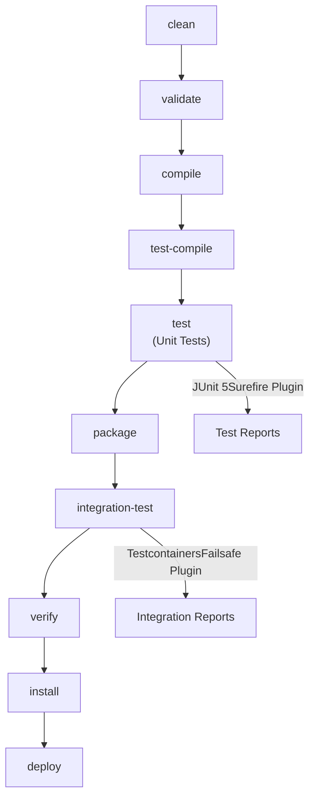
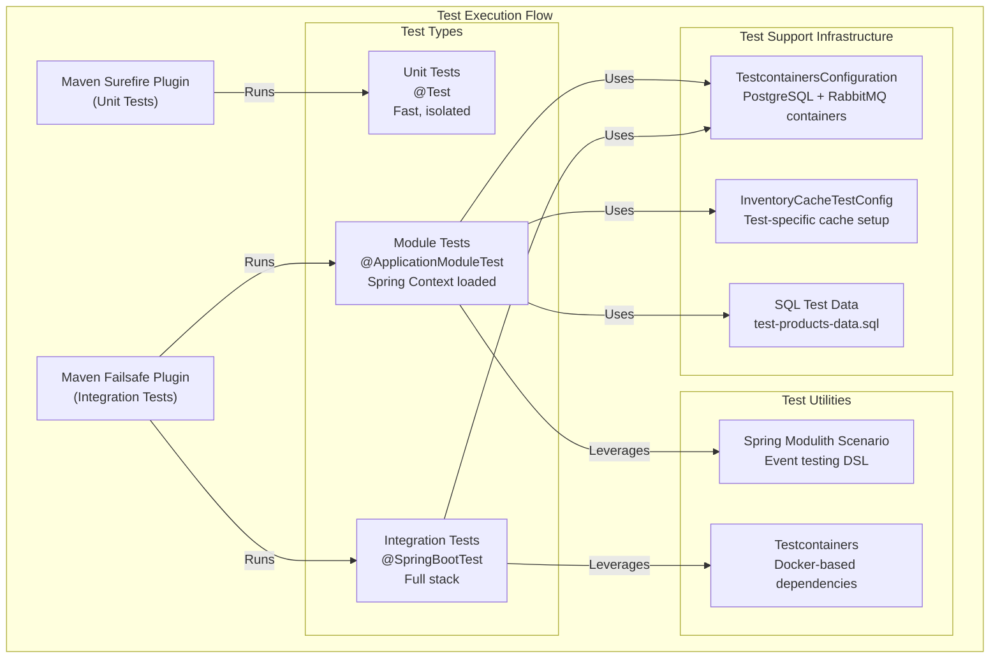
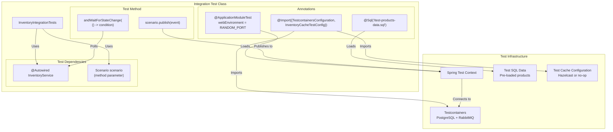
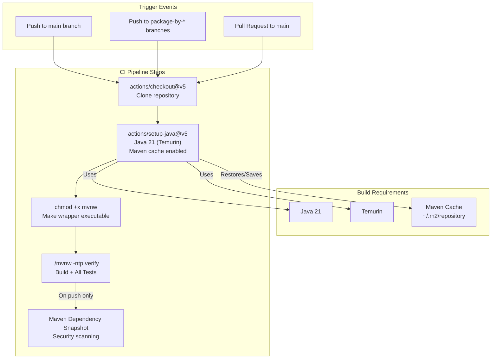

# Building and Testing

> **Relevant source files**
> * [.github/workflows/maven.yml](https://github.com/philipz/spring-modular-monolith/blob/30c9bf30/.github/workflows/maven.yml)
> * [.sdkmanrc](https://github.com/philipz/spring-modular-monolith/blob/30c9bf30/.sdkmanrc)
> * [renovate.json](https://github.com/philipz/spring-modular-monolith/blob/30c9bf30/renovate.json)
> * [src/main/java/com/sivalabs/bookstore/catalog/domain/ProductService.java](https://github.com/philipz/spring-modular-monolith/blob/30c9bf30/src/main/java/com/sivalabs/bookstore/catalog/domain/ProductService.java)
> * [src/test/java/com/sivalabs/bookstore/inventory/InventoryIntegrationTests.java](https://github.com/philipz/spring-modular-monolith/blob/30c9bf30/src/test/java/com/sivalabs/bookstore/inventory/InventoryIntegrationTests.java)

This page documents the build process and testing strategies for the Spring Modular Monolith application. It covers Maven build configuration, test execution, integration testing with Testcontainers, and Spring Modulith testing patterns.

For code quality and formatting standards, see [Code Quality and Formatting](/philipz/spring-modular-monolith/11.2-code-quality-and-formatting). For detailed integration testing strategies and patterns, see [Integration Testing Strategies](/philipz/spring-modular-monolith/11.3-integration-testing-strategies).

---

## Build System Overview

The application uses **Maven 3.9.11** as its build tool with **Java 21** (Temurin distribution) as the target runtime. The Maven wrapper (`mvnw`) is included in the repository to ensure consistent build execution across environments.

### Required Versions

| Tool | Version | Source |
| --- | --- | --- |
| Java | 21 (24.0.1-tem) | [.sdkmanrc L1](https://github.com/philipz/spring-modular-monolith/blob/30c9bf30/.sdkmanrc#L1-L1) |
| Maven | 3.9.11 | [.sdkmanrc L2](https://github.com/philipz/spring-modular-monolith/blob/30c9bf30/.sdkmanrc#L2-L2) |
| Spring Boot | 3.5.5 | pom.xml |

### Maven Wrapper Execution

The Maven wrapper ensures reproducible builds without requiring Maven to be pre-installed:

```markdown
# Make wrapper executable (Unix/Linux/macOS)
chmod +x mvnw

# Execute build
./mvnw clean verify

# Windows
mvnw.cmd clean verify
```

**Sources:** [.sdkmanrc L1-L2](https://github.com/philipz/spring-modular-monolith/blob/30c9bf30/.sdkmanrc#L1-L2)

 [.github/workflows/maven.yml L40-L44](https://github.com/philipz/spring-modular-monolith/blob/30c9bf30/.github/workflows/maven.yml#L40-L44)

---

## Maven Build Lifecycle

The project follows the standard Maven build lifecycle with several key phases:



### Key Build Commands

| Command | Purpose | Test Execution |
| --- | --- | --- |
| `./mvnw clean compile` | Compile source code only | None |
| `./mvnw test` | Run unit tests only | Unit tests |
| `./mvnw verify` | Full build with all tests | Unit + Integration tests |
| `./mvnw package -DskipTests` | Build JAR without tests | None |
| `./mvnw clean install` | Install to local Maven repo | Unit + Integration tests |

The CI pipeline uses `./mvnw -ntp verify` where `-ntp` disables transfer progress output for cleaner logs.

**Sources:** [.github/workflows/maven.yml L44](https://github.com/philipz/spring-modular-monolith/blob/30c9bf30/.github/workflows/maven.yml#L44-L44)

---

## Test Execution Architecture

The application uses **JUnit 5** (Jupiter) as the test framework with specialized configurations for different test types.



**Sources:** [src/test/java/com/sivalabs/bookstore/inventory/InventoryIntegrationTests.java L1-L32](https://github.com/philipz/spring-modular-monolith/blob/30c9bf30/src/test/java/com/sivalabs/bookstore/inventory/InventoryIntegrationTests.java#L1-L32)

---

## Integration Testing with Testcontainers

Integration tests use **Testcontainers** to spin up real PostgreSQL and RabbitMQ instances in Docker containers, ensuring tests run against actual infrastructure rather than mocks.

### TestcontainersConfiguration Setup

The `TestcontainersConfiguration` class provides container lifecycle management:

```python
@TestConfiguration(proxyBeanMethods = false)
class TestcontainersConfiguration {
    // PostgreSQL container for multi-schema database
    @Bean
    @ServiceConnection
    PostgreSQLContainer<?> postgresContainer() {
        return new PostgreSQLContainer<>(DockerImageName.parse("postgres:17-alpine"));
    }
    
    // RabbitMQ container for message broker
    @Bean
    @ServiceConnection
    RabbitMQContainer rabbitContainer() {
        return new RabbitMQContainer(DockerImageName.parse("rabbitmq:4.0-alpine"));
    }
}
```

These containers are automatically started before tests and stopped after tests complete. The `@ServiceConnection` annotation automatically configures Spring Boot's datasource and RabbitMQ properties from the container.

### Integration Test Structure



**Sources:** [src/test/java/com/sivalabs/bookstore/inventory/InventoryIntegrationTests.java L17-L31](https://github.com/philipz/spring-modular-monolith/blob/30c9bf30/src/test/java/com/sivalabs/bookstore/inventory/InventoryIntegrationTests.java#L17-L31)

---

## Spring Modulith Testing Patterns

The application leverages **Spring Modulith's testing support** for verifying module boundaries and event-driven interactions.

### @ApplicationModuleTest Annotation

The `@ApplicationModuleTest` annotation provides module-scoped testing:

```python
@ApplicationModuleTest(webEnvironment = RANDOM_PORT)
@Import({TestcontainersConfiguration.class, 
         InventoryCacheTestConfig.class})
@Sql("/test-products-data.sql")
class InventoryIntegrationTests {
    // Test implementation
}
```

This annotation:

* Loads only the Spring context required for the `inventory` module
* Starts a web server on a random port for API testing
* Verifies module boundaries are not violated
* Provides access to the `Scenario` API for event testing

**Sources:** [src/test/java/com/sivalabs/bookstore/inventory/InventoryIntegrationTests.java L17-L20](https://github.com/philipz/spring-modular-monolith/blob/30c9bf30/src/test/java/com/sivalabs/bookstore/inventory/InventoryIntegrationTests.java#L17-L20)

### Scenario API for Event Testing

The `Scenario` parameter enables testing event-driven interactions:

```javascript
@Test
void handleOrderCreatedEvent(Scenario scenario) {
    var customer = new Customer("Siva", "siva@gmail.com", "9987654");
    String productCode = "P114";
    var event = new OrderCreatedEvent(
        UUID.randomUUID().toString(), 
        productCode, 
        2, 
        customer
    );
    
    scenario.publish(event)
            .andWaitForStateChange(() -> 
                inventoryService.getStockLevel(productCode) == 598
            );
}
```

This pattern:

1. **Publishes** an `OrderCreatedEvent` to the internal Spring Modulith event bus
2. **Waits** for the inventory module's event listener to process the event
3. **Polls** the `inventoryService.getStockLevel()` method until the expected state is reached (stock level = 598)
4. **Fails** if the state change does not occur within the timeout period

**Sources:** [src/test/java/com/sivalabs/bookstore/inventory/InventoryIntegrationTests.java L25-L31](https://github.com/philipz/spring-modular-monolith/blob/30c9bf30/src/test/java/com/sivalabs/bookstore/inventory/InventoryIntegrationTests.java#L25-L31)

---

## Test Data Management

Integration tests use **SQL scripts** to populate test data:

```python
@Sql("/test-products-data.sql")
class InventoryIntegrationTests {
    // Tests execute with pre-loaded data
}
```

The `@Sql` annotation:

* Executes SQL scripts from the classpath before test methods run
* Can be placed at class level (runs before all tests) or method level (runs before specific test)
* Supports multiple scripts: `@Sql({"/schema.sql", "/data.sql"})`
* Uses the Testcontainers PostgreSQL instance automatically

Common test data locations:

* `/test-products-data.sql` - Product catalog test data
* Module-specific test data in `src/test/resources/`

**Sources:** [src/test/java/com/sivalabs/bookstore/inventory/InventoryIntegrationTests.java L19](https://github.com/philipz/spring-modular-monolith/blob/30c9bf30/src/test/java/com/sivalabs/bookstore/inventory/InventoryIntegrationTests.java#L19-L19)

---

## Continuous Integration with GitHub Actions

The project uses **GitHub Actions** for automated build and test execution on every push and pull request.

### CI Workflow Configuration



### Workflow Definition

The Maven Build workflow is defined in [.github/workflows/maven.yml L1-L48](https://github.com/philipz/spring-modular-monolith/blob/30c9bf30/.github/workflows/maven.yml#L1-L48)

:

```yaml
name: Maven Build

on:
  push:
    branches: ["main", "package-by-*"]
    paths-ignore: ['.gitignore', 'README.md', 'k8s/**']
  pull_request:
    branches: ["main"]
    paths: ['pom.xml', '**/pom.xml', 'src/**']

jobs:
  build:
    runs-on: ubuntu-latest
    steps:
      - uses: actions/checkout@v5
      - uses: actions/setup-java@v5
        with:
          java-version: 21
          distribution: 'temurin'
          cache: 'maven'
      - run: chmod +x mvnw
      - run: ./mvnw -ntp verify
      - uses: advanced-security/maven-dependency-submission-action@v5
```

**Key Features:**

* **Path-based Triggering:** Only runs when source code or POM files change
* **Maven Caching:** Caches `~/.m2/repository` to speed up builds
* **Dependency Scanning:** Submits dependency graph for security vulnerability detection
* **No Transfer Progress:** `-ntp` flag keeps logs clean

**Sources:** [.github/workflows/maven.yml L1-L48](https://github.com/philipz/spring-modular-monolith/blob/30c9bf30/.github/workflows/maven.yml#L1-L48)

---

## Cache-Aware Testing

Services that use caching must handle cache availability gracefully in tests:

```python
@Service
public class ProductService {
    private final ProductCacheService productCacheService;
    
    ProductService(ProductRepository repo, 
                   @Autowired(required = false) ProductCacheService productCacheService) {
        this.productCacheService = productCacheService;
        
        if (productCacheService != null) {
            log.info("ProductService initialized with cache support enabled");
        } else {
            log.info("ProductService initialized without cache support");
        }
    }
    
    private boolean isCacheAvailable() {
        return productCacheService != null 
            && !productCacheService.isCircuitBreakerOpen();
    }
}
```

This pattern allows:

* **Test Configuration Control:** Tests can provide `InventoryCacheTestConfig` or omit it
* **Fallback Logic:** Services degrade gracefully when cache is unavailable
* **Circuit Breaker Awareness:** Tests can simulate cache failures

**Sources:** [src/main/java/com/sivalabs/bookstore/catalog/domain/ProductService.java L24-L42](https://github.com/philipz/spring-modular-monolith/blob/30c9bf30/src/main/java/com/sivalabs/bookstore/catalog/domain/ProductService.java#L24-L42)

---

## Running Tests Locally

### All Tests

```go
# Run all tests (unit + integration)
./mvnw verify

# Run with clean build
./mvnw clean verify

# Skip tests during build
./mvnw package -DskipTests
```

### Specific Test Classes

```markdown
# Run single test class
./mvnw test -Dtest=InventoryIntegrationTests

# Run tests matching pattern
./mvnw test -Dtest=*IntegrationTests

# Run specific test method
./mvnw test -Dtest=InventoryIntegrationTests#handleOrderCreatedEvent
```

### Integration Tests Only

```markdown
# Run integration tests only (skip unit tests)
./mvnw verify -DskipUnitTests

# Run specific integration test
./mvnw verify -Dit.test=InventoryIntegrationTests
```

**Sources:** [.github/workflows/maven.yml L44](https://github.com/philipz/spring-modular-monolith/blob/30c9bf30/.github/workflows/maven.yml#L44-L44)

---

## Test Output and Reporting

The build produces test reports in standard Maven formats:

| Report Type | Location | Format |
| --- | --- | --- |
| Surefire (Unit) | `target/surefire-reports/` | XML + TXT |
| Failsafe (Integration) | `target/failsafe-reports/` | XML + TXT |
| JaCoCo Coverage | `target/site/jacoco/` | HTML |

Test reports include:

* **Execution Time:** Per-test timing information
* **Failure Details:** Stack traces and assertion failures
* **System Output:** Console logs from test execution
* **Coverage Metrics:** Line and branch coverage (if JaCoCo enabled)

For CI builds, test results are automatically published by GitHub Actions and visible in the "Actions" tab.

**Sources:** [.github/workflows/maven.yml L25-L48](https://github.com/philipz/spring-modular-monolith/blob/30c9bf30/.github/workflows/maven.yml#L25-L48)

---

## Summary

The Spring Modular Monolith build and test infrastructure provides:

1. **Reproducible Builds:** Maven wrapper with pinned Java 21 version
2. **Fast Feedback:** Automated CI on every push and pull request
3. **Realistic Testing:** Testcontainers for actual PostgreSQL and RabbitMQ instances
4. **Module Boundary Verification:** Spring Modulith's `@ApplicationModuleTest` ensures architectural integrity
5. **Event-Driven Testing:** `Scenario` API for testing asynchronous event flows
6. **Cache-Aware Services:** Graceful degradation when cache is unavailable in tests
7. **Dependency Security:** Automated dependency scanning in CI pipeline

For local development, developers can run the full test suite with `./mvnw verify` or use the Taskfile tasks documented in [Development Workflow and Build Tasks](/philipz/spring-modular-monolith/2.3-development-workflow-and-build-tasks).

**Sources:** [.github/workflows/maven.yml L1-L48](https://github.com/philipz/spring-modular-monolith/blob/30c9bf30/.github/workflows/maven.yml#L1-L48)

 [src/test/java/com/sivalabs/bookstore/inventory/InventoryIntegrationTests.java L1-L32](https://github.com/philipz/spring-modular-monolith/blob/30c9bf30/src/test/java/com/sivalabs/bookstore/inventory/InventoryIntegrationTests.java#L1-L32)

 [.sdkmanrc L1-L2](https://github.com/philipz/spring-modular-monolith/blob/30c9bf30/.sdkmanrc#L1-L2)