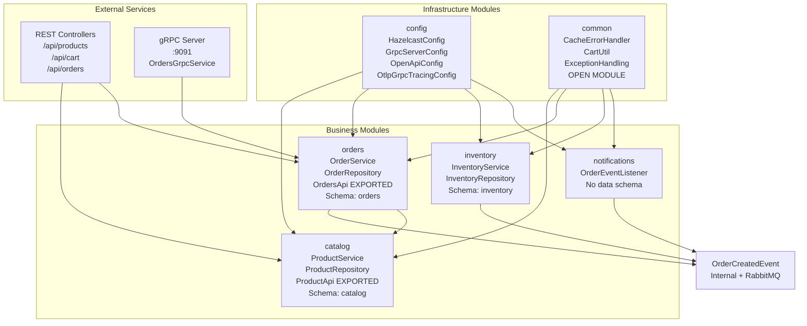
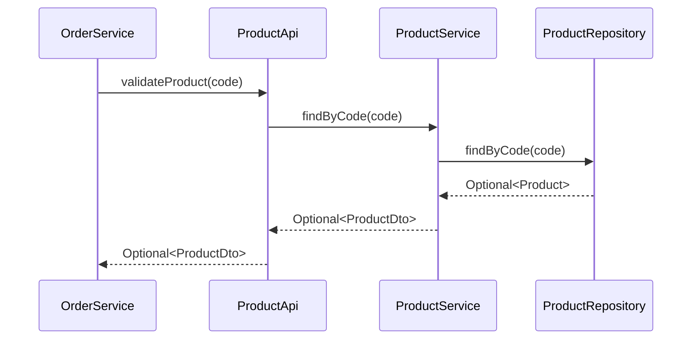
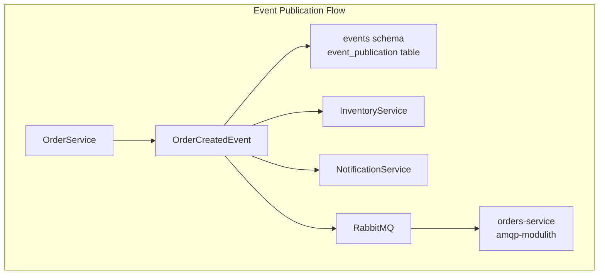
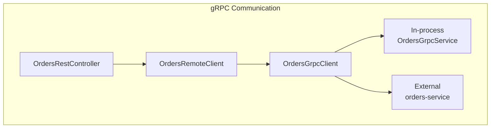
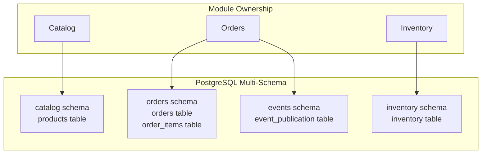
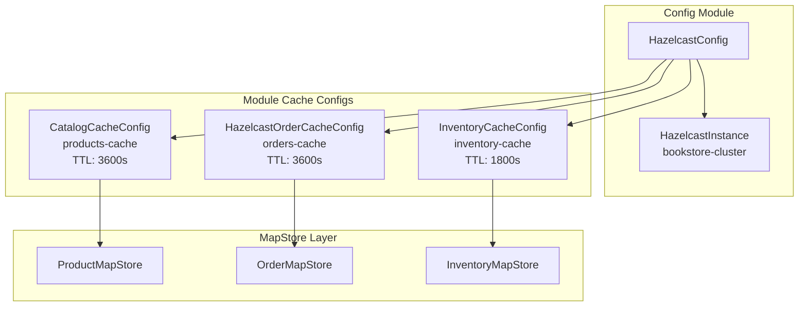

# Business Modules

> **Relevant source files**
> * [CLAUDE.md](https://github.com/philipz/spring-modular-monolith/blob/30c9bf30/CLAUDE.md)
> * [README-API.md](https://github.com/philipz/spring-modular-monolith/blob/30c9bf30/README-API.md)
> * [README.md](https://github.com/philipz/spring-modular-monolith/blob/30c9bf30/README.md)
> * [docs/API_ANALYSIS_SUMMARY.txt](https://github.com/philipz/spring-modular-monolith/blob/30c9bf30/docs/API_ANALYSIS_SUMMARY.txt)
> * [docs/REST_API_ANALYSIS.md](https://github.com/philipz/spring-modular-monolith/blob/30c9bf30/docs/REST_API_ANALYSIS.md)
> * [docs/bookstore-microservices.png](https://github.com/philipz/spring-modular-monolith/blob/30c9bf30/docs/bookstore-microservices.png)
> * [docs/improvement.md](https://github.com/philipz/spring-modular-monolith/blob/30c9bf30/docs/improvement.md)
> * [docs/orders-data-ownership-analysis.md](https://github.com/philipz/spring-modular-monolith/blob/30c9bf30/docs/orders-data-ownership-analysis.md)
> * [docs/orders-module-boundary-analysis.md](https://github.com/philipz/spring-modular-monolith/blob/30c9bf30/docs/orders-module-boundary-analysis.md)
> * [docs/orders-traffic-migration.md](https://github.com/philipz/spring-modular-monolith/blob/30c9bf30/docs/orders-traffic-migration.md)
> * [k6.js](https://github.com/philipz/spring-modular-monolith/blob/30c9bf30/k6.js)
> * [src/main/java/com/sivalabs/bookstore/config/LiquibaseConfig.java](https://github.com/philipz/spring-modular-monolith/blob/30c9bf30/src/main/java/com/sivalabs/bookstore/config/LiquibaseConfig.java)
> * [src/main/java/com/sivalabs/bookstore/config/OtlpGrpcTracingConfig.java](https://github.com/philipz/spring-modular-monolith/blob/30c9bf30/src/main/java/com/sivalabs/bookstore/config/OtlpGrpcTracingConfig.java)
> * [src/main/java/com/sivalabs/bookstore/config/OtlpProperties.java](https://github.com/philipz/spring-modular-monolith/blob/30c9bf30/src/main/java/com/sivalabs/bookstore/config/OtlpProperties.java)

## Purpose and Scope

This page documents the business modules that comprise the Spring Modular Monolith bookstore application. Each module encapsulates a distinct business domain with its own data schema, cache configuration, and service layer. The modules communicate through well-defined APIs and domain events, enforced by Spring Modulith's architectural verification.

For deployment topology and infrastructure services (PostgreSQL, RabbitMQ, Hazelcast, nginx), see [Overview](/philipz/spring-modular-monolith/1-overview). For observability configuration across modules, see [Observability and Monitoring](/philipz/spring-modular-monolith/9-observability-and-monitoring). For detailed information about individual modules, see their respective sub-pages: [Catalog](/philipz/spring-modular-monolith/8.1-catalog-module), [Orders](/philipz/spring-modular-monolith/8.2-orders-module), [Inventory](/philipz/spring-modular-monolith/8.3-inventory-module), [Notifications](/philipz/spring-modular-monolith/8.4-notifications-module), [Config](/philipz/spring-modular-monolith/8.5-config-module), and [Common](/philipz/spring-modular-monolith/8.6-common-module).

---

## Module Architecture Overview

The application consists of six modules organized into three categories:

| Category | Modules | Purpose |
| --- | --- | --- |
| **Infrastructure** | `config`, `common` | Provide shared infrastructure beans and utilities without creating reverse dependencies |
| **Business Domains** | `catalog`, `orders`, `inventory`, `notifications` | Implement business logic with strict data ownership and isolation |
| **Cross-cutting** | `common` | Explicitly open module providing shared utilities accessible to all modules |



**Sources:** [README.md L7-L16](https://github.com/philipz/spring-modular-monolith/blob/30c9bf30/README.md#L7-L16)

 [CLAUDE.md L116-L134](https://github.com/philipz/spring-modular-monolith/blob/30c9bf30/CLAUDE.md#L116-L134)

---

## Module Directory Structure

Each business module follows a consistent internal organization:

```markdown
src/main/java/com/sivalabs/bookstore/{module}/
├── package-info.java          # Module boundary definition
├── domain/                    # Entities, repositories, services
├── api/                       # Exported interfaces and DTOs
├── web/                       # REST controllers (if applicable)
├── grpc/                      # gRPC services (if applicable)
├── cache/                     # MapStore implementations
└── config/                    # Module-specific configuration
```

Database migrations are located at:

```
src/main/resources/db/migration/{module}/
└── V{version}__{description}.sql
```

**Sources:** [CLAUDE.md L240-L248](https://github.com/philipz/spring-modular-monolith/blob/30c9bf30/CLAUDE.md#L240-L248)

 [README.md L119-L133](https://github.com/philipz/spring-modular-monolith/blob/30c9bf30/README.md#L119-L133)

---

## Module Communication Patterns

### API-Based Communication

Modules expose typed APIs through the `api` sub-package. These APIs define contracts without exposing internal implementation details.



**Example:** The `orders` module consumes `catalog.ProductApi` for product validation during order creation:

* `ProductApi` interface: [src/main/java/com/sivalabs/bookstore/catalog/api/ProductApi.java](https://github.com/philipz/spring-modular-monolith/blob/30c9bf30/src/main/java/com/sivalabs/bookstore/catalog/api/ProductApi.java)
* Implementation: [src/main/java/com/sivalabs/bookstore/catalog/api/ProductApiService.java](https://github.com/philipz/spring-modular-monolith/blob/30c9bf30/src/main/java/com/sivalabs/bookstore/catalog/api/ProductApiService.java)
* Consumer: [src/main/java/com/sivalabs/bookstore/orders/domain/ProductServiceClient.java](https://github.com/philipz/spring-modular-monolith/blob/30c9bf30/src/main/java/com/sivalabs/bookstore/orders/domain/ProductServiceClient.java)

**Sources:** [README.md L30-L36](https://github.com/philipz/spring-modular-monolith/blob/30c9bf30/README.md#L30-L36)

 [CLAUDE.md L126-L130](https://github.com/philipz/spring-modular-monolith/blob/30c9bf30/CLAUDE.md#L126-L130)

### Event-Driven Communication

Modules publish domain events through Spring Modulith's internal event bus. Events are persisted to the `events` schema and republished to RabbitMQ for external consumption.



**Key Event Types:**

* `OrderCreatedEvent` - published by `orders`, consumed by `inventory` and `notifications`

Event classes are located in the `api.events` sub-package to avoid loading module internals:

* Event definition: [src/main/java/com/sivalabs/bookstore/orders/api/events/OrderCreatedEvent.java](https://github.com/philipz/spring-modular-monolith/blob/30c9bf30/src/main/java/com/sivalabs/bookstore/orders/api/events/OrderCreatedEvent.java)
* Publisher: [src/main/java/com/sivalabs/bookstore/orders/domain/OrderService.java](https://github.com/philipz/spring-modular-monolith/blob/30c9bf30/src/main/java/com/sivalabs/bookstore/orders/domain/OrderService.java)
* Consumers: * [src/main/java/com/sivalabs/bookstore/inventory/domain/InventoryService.java](https://github.com/philipz/spring-modular-monolith/blob/30c9bf30/src/main/java/com/sivalabs/bookstore/inventory/domain/InventoryService.java) * [src/main/java/com/sivalabs/bookstore/notifications/OrderEventListener.java](https://github.com/philipz/spring-modular-monolith/blob/30c9bf30/src/main/java/com/sivalabs/bookstore/notifications/OrderEventListener.java)

**Sources:** [README.md L13](https://github.com/philipz/spring-modular-monolith/blob/30c9bf30/README.md#L13-L13)

 [README.md L28-L29](https://github.com/philipz/spring-modular-monolith/blob/30c9bf30/README.md#L28-L29)

 [CLAUDE.md L276-L280](https://github.com/philipz/spring-modular-monolith/blob/30c9bf30/CLAUDE.md#L276-L280)

### gRPC-Based Communication

The `orders` module exposes gRPC services for synchronous remote invocation. The monolith's REST layer delegates to `OrdersGrpcClient`, which can target either an in-process server or the extracted `orders-service`.



**Proto Definition:** [src/main/proto/orders.proto](https://github.com/philipz/spring-modular-monolith/blob/30c9bf30/src/main/proto/orders.proto)

**Key Classes:**

* gRPC Service: [src/main/java/com/sivalabs/bookstore/orders/grpc/OrdersGrpcService.java](https://github.com/philipz/spring-modular-monolith/blob/30c9bf30/src/main/java/com/sivalabs/bookstore/orders/grpc/OrdersGrpcService.java)
* gRPC Client: [src/main/java/com/sivalabs/bookstore/orders/grpc/OrdersGrpcClient.java](https://github.com/philipz/spring-modular-monolith/blob/30c9bf30/src/main/java/com/sivalabs/bookstore/orders/grpc/OrdersGrpcClient.java)
* REST Controller: [src/main/java/com/sivalabs/bookstore/orders/web/OrdersRestController.java](https://github.com/philipz/spring-modular-monolith/blob/30c9bf30/src/main/java/com/sivalabs/bookstore/orders/web/OrdersRestController.java)

**Sources:** [README.md L37-L41](https://github.com/philipz/spring-modular-monolith/blob/30c9bf30/README.md#L37-L41)

 [CLAUDE.md L131-L134](https://github.com/philipz/spring-modular-monolith/blob/30c9bf30/CLAUDE.md#L131-L134)

---

## Data and Cache Architecture

Each business module owns its database schema and Hazelcast cache configuration. This ensures data isolation and independent schema evolution.

### Database Schema Ownership



**Liquibase Configuration:** [src/main/java/com/sivalabs/bookstore/config/LiquibaseConfig.java L1-L76](https://github.com/philipz/spring-modular-monolith/blob/30c9bf30/src/main/java/com/sivalabs/bookstore/config/LiquibaseConfig.java#L1-L76)

**Migration Directories:**

* Catalog: [src/main/resources/db/migration/catalog/](https://github.com/philipz/spring-modular-monolith/blob/30c9bf30/src/main/resources/db/migration/catalog/)
* Orders: [src/main/resources/db/migration/orders/](https://github.com/philipz/spring-modular-monolith/blob/30c9bf30/src/main/resources/db/migration/orders/)
* Inventory: [src/main/resources/db/migration/inventory/](https://github.com/philipz/spring-modular-monolith/blob/30c9bf30/src/main/resources/db/migration/inventory/)

**Sources:** [README.md L135-L139](https://github.com/philipz/spring-modular-monolith/blob/30c9bf30/README.md#L135-L139)

 [CLAUDE.md L283-L287](https://github.com/philipz/spring-modular-monolith/blob/30c9bf30/CLAUDE.md#L283-L287)

### Module-Specific Cache Configuration

Each module contributes its own `MapConfig` bean to the global Hazelcast instance. The `config` module aggregates these configurations without creating reverse dependencies.



**Key Configuration Classes:**

* Base: [src/main/java/com/sivalabs/bookstore/config/HazelcastConfig.java](https://github.com/philipz/spring-modular-monolith/blob/30c9bf30/src/main/java/com/sivalabs/bookstore/config/HazelcastConfig.java)
* Catalog: [src/main/java/com/sivalabs/bookstore/catalog/config/CatalogCacheConfig.java](https://github.com/philipz/spring-modular-monolith/blob/30c9bf30/src/main/java/com/sivalabs/bookstore/catalog/config/CatalogCacheConfig.java)
* Orders: [src/main/java/com/sivalabs/bookstore/orders/config/HazelcastOrderCacheConfig.java](https://github.com/philipz/spring-modular-monolith/blob/30c9bf30/src/main/java/com/sivalabs/bookstore/orders/config/HazelcastOrderCacheConfig.java)
* Inventory: [src/main/java/com/sivalabs/bookstore/inventory/config/InventoryCacheConfig.java](https://github.com/philipz/spring-modular-monolith/blob/30c9bf30/src/main/java/com/sivalabs/bookstore/inventory/config/InventoryCacheConfig.java)

**Sources:** [README.md L26](https://github.com/philipz/spring-modular-monolith/blob/30c9bf30/README.md#L26-L26)

 [CLAUDE.md L143-L148](https://github.com/philipz/spring-modular-monolith/blob/30c9bf30/CLAUDE.md#L143-L148)

---

## Module Boundaries and Enforcement

Spring Modulith enforces module boundaries through `@ApplicationModule` annotations and architectural verification tests.

### Boundary Definition

Each module defines its boundaries in `package-info.java`:

```javascript
@ApplicationModule(allowedDependencies = {"catalog::product-api", "common::common-cache"})
package com.sivalabs.bookstore.orders;

import org.springframework.modulith.ApplicationModule;
```

This example shows the `orders` module explicitly declaring its dependencies on:

* The `product-api` named interface from the `catalog` module
* The `common-cache` interface from the `common` module

### Named Interfaces

Modules can export specific sub-packages as named interfaces:

```javascript
@NamedInterface("product-api")
package com.sivalabs.bookstore.catalog.api;

import org.springframework.modulith.NamedInterface;
```

Only classes within named interfaces are accessible to other modules with declared dependencies.

### Verification Testing

Module boundaries are verified in tests:

```
@Test
void verifyModularity() {
    ApplicationModules.of(BookStoreApplication.class).verify();
}
```

**Test Location:** [src/test/java/com/sivalabs/bookstore/ModularityTests.java](https://github.com/philipz/spring-modular-monolith/blob/30c9bf30/src/test/java/com/sivalabs/bookstore/ModularityTests.java)

**Sources:** [CLAUDE.md L245-L255](https://github.com/philipz/spring-modular-monolith/blob/30c9bf30/CLAUDE.md#L245-L255)

 [CLAUDE.md L157-L161](https://github.com/philipz/spring-modular-monolith/blob/30c9bf30/CLAUDE.md#L157-L161)

---

## Module Summary

### Catalog Module

**Responsibility:** Product catalog management and queries

**Exported API:** `ProductApi` interface for product lookups and validation

**Key Classes:**

* `ProductService` - business logic
* `ProductRepository` - data access
* `ProductRestController` - REST endpoints at `/api/products`
* `ProductMapStore` - write-through cache

**Database Schema:** `catalog` (products table)

**Cache:** `products-cache` with 3600s TTL

For detailed information, see [Catalog Module](/philipz/spring-modular-monolith/8.1-catalog-module).

---

### Orders Module

**Responsibility:** Order lifecycle management, cart operations, and gRPC integration

**Exported API:** `OrdersApi` interface for order creation and queries

**Key Classes:**

* `OrderService` - order creation and event publishing
* `OrderRepository` - data access
* `OrdersRestController` - REST endpoints at `/api/orders`
* `CartRestController` - REST endpoints at `/api/cart`
* `OrdersGrpcService` - gRPC server implementation
* `OrdersGrpcClient` - gRPC client for remote calls
* `OrderMapStore` - write-through cache

**Database Schema:** `orders` (orders and order_items tables)

**Cache:** `orders-cache` with 3600s TTL

**Published Events:** `OrderCreatedEvent`

For detailed information, see [Orders Module](/philipz/spring-modular-monolith/8.2-orders-module).

---

### Inventory Module

**Responsibility:** Inventory projection and stock level management

**Exported API:** None (purely reactive to events)

**Key Classes:**

* `InventoryService` - stock updates via event listeners
* `InventoryRepository` - data access
* `InventoryMapStore` - write-through cache

**Database Schema:** `inventory` (inventory table)

**Cache:** `inventory-cache` with 1800s TTL (shorter due to higher volatility)

**Consumed Events:** `OrderCreatedEvent`

For detailed information, see [Inventory Module](/philipz/spring-modular-monolith/8.3-inventory-module).

---

### Notifications Module

**Responsibility:** Process domain events and record notification intents

**Exported API:** None (purely reactive to events)

**Key Classes:**

* `OrderEventListener` - event handler for order notifications

**Database Schema:** None (logs only, future email integration planned)

**Consumed Events:** `OrderCreatedEvent`

For detailed information, see [Notifications Module](/philipz/spring-modular-monolith/8.4-notifications-module).

---

### Config Module

**Responsibility:** Infrastructure bean wiring and cross-cutting configuration

**Exported API:** None (provides beans via Spring context)

**Key Classes:**

* `HazelcastConfig` - distributed cache and session store
* `GrpcServerConfig` - gRPC server on port 9091
* `GrpcClientConfig` - gRPC client channel
* `OpenApiConfig` - API documentation
* `OtlpGrpcTracingConfig` - OpenTelemetry trace export
* `CorsConfig` - CORS for development
* `SessionConfig` - Hazelcast-backed sessions
* `LiquibaseConfig` - database migration orchestration

**Design Pattern:** This module only provides infrastructure beans without creating dependencies on business modules.

For detailed information, see [Config Module](/philipz/spring-modular-monolith/8.5-config-module).

---

### Common Module

**Responsibility:** Shared utilities accessible to all modules

**Module Type:** Explicitly marked as `@ApplicationModule(type = ApplicationModule.Type.OPEN)`

**Exported Utilities:**

* `CacheErrorHandler` - centralized cache exception handling
* `CartUtil` - session-based cart operations
* `SpringAwareMapStoreConfig` - base class for MapStore configuration
* Exception mapping classes for REST and gRPC

**Design Pattern:** This is the only module allowed to export implementation code rather than just interfaces.

For detailed information, see [Common Module](/philipz/spring-modular-monolith/8.6-common-module).

**Sources:** [README.md L7-L16](https://github.com/philipz/spring-modular-monolith/blob/30c9bf30/README.md#L7-L16)

 [README.md L9](https://github.com/philipz/spring-modular-monolith/blob/30c9bf30/README.md#L9-L9)

---

## Module Testing Strategy

Each module can be tested in isolation using `@ApplicationModuleTest`:

```python
@ApplicationModuleTest
class CatalogIntegrationTests {
    // Only loads catalog module components
}
```

This annotation ensures that only the specified module and its dependencies are loaded, enabling fast, focused integration tests.

**Test Locations:**

* Catalog: [src/test/java/com/sivalabs/bookstore/catalog/](https://github.com/philipz/spring-modular-monolith/blob/30c9bf30/src/test/java/com/sivalabs/bookstore/catalog/)
* Orders: [src/test/java/com/sivalabs/bookstore/orders/](https://github.com/philipz/spring-modular-monolith/blob/30c9bf30/src/test/java/com/sivalabs/bookstore/orders/)
* Inventory: [src/test/java/com/sivalabs/bookstore/inventory/](https://github.com/philipz/spring-modular-monolith/blob/30c9bf30/src/test/java/com/sivalabs/bookstore/inventory/)

**Sources:** [CLAUDE.md L173-L180](https://github.com/philipz/spring-modular-monolith/blob/30c9bf30/CLAUDE.md#L173-L180)

 [CLAUDE.md L289-L294](https://github.com/philipz/spring-modular-monolith/blob/30c9bf30/CLAUDE.md#L289-L294)