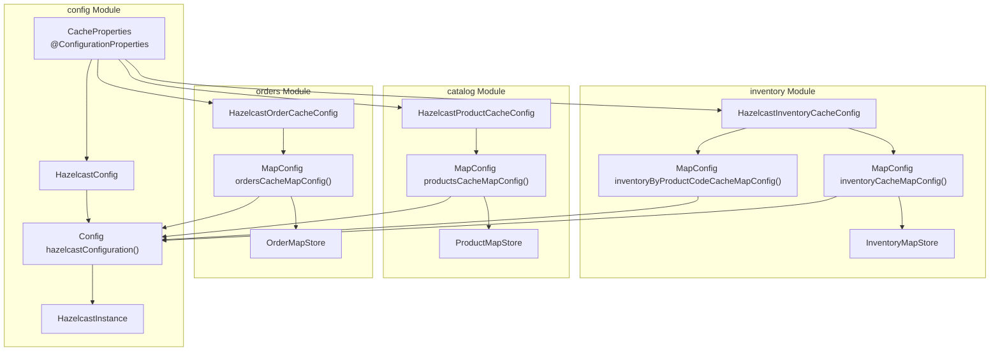
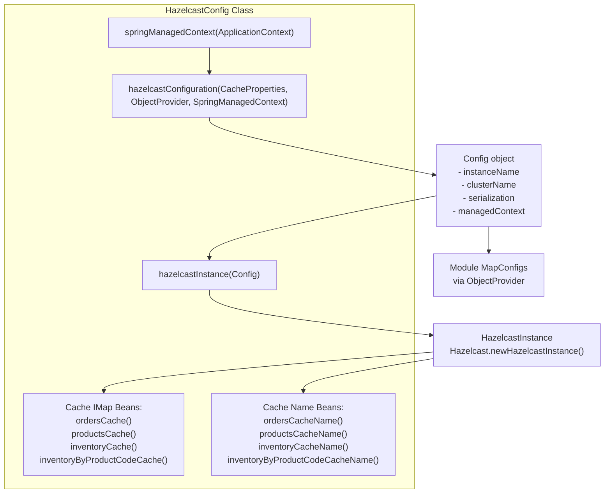
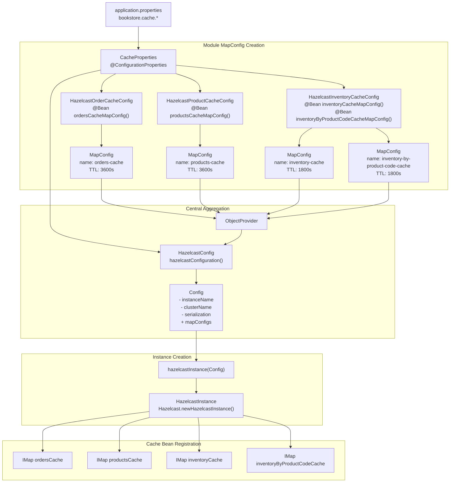

# Cache Configuration and MapConfigs

> **Relevant source files**
> * [src/main/java/com/sivalabs/bookstore/catalog/cache/ProductMapStore.java](https://github.com/philipz/spring-modular-monolith/blob/30c9bf30/src/main/java/com/sivalabs/bookstore/catalog/cache/ProductMapStore.java)
> * [src/main/java/com/sivalabs/bookstore/catalog/config/HazelcastProductCacheConfig.java](https://github.com/philipz/spring-modular-monolith/blob/30c9bf30/src/main/java/com/sivalabs/bookstore/catalog/config/HazelcastProductCacheConfig.java)
> * [src/main/java/com/sivalabs/bookstore/common/cache/SpringAwareMapStoreConfig.java](https://github.com/philipz/spring-modular-monolith/blob/30c9bf30/src/main/java/com/sivalabs/bookstore/common/cache/SpringAwareMapStoreConfig.java)
> * [src/main/java/com/sivalabs/bookstore/config/CacheProperties.java](https://github.com/philipz/spring-modular-monolith/blob/30c9bf30/src/main/java/com/sivalabs/bookstore/config/CacheProperties.java)
> * [src/main/java/com/sivalabs/bookstore/config/HazelcastConfig.java](https://github.com/philipz/spring-modular-monolith/blob/30c9bf30/src/main/java/com/sivalabs/bookstore/config/HazelcastConfig.java)
> * [src/main/java/com/sivalabs/bookstore/inventory/cache/InventoryMapStore.java](https://github.com/philipz/spring-modular-monolith/blob/30c9bf30/src/main/java/com/sivalabs/bookstore/inventory/cache/InventoryMapStore.java)
> * [src/main/java/com/sivalabs/bookstore/inventory/config/HazelcastInventoryCacheConfig.java](https://github.com/philipz/spring-modular-monolith/blob/30c9bf30/src/main/java/com/sivalabs/bookstore/inventory/config/HazelcastInventoryCacheConfig.java)
> * [src/main/java/com/sivalabs/bookstore/orders/cache/OrderMapStore.java](https://github.com/philipz/spring-modular-monolith/blob/30c9bf30/src/main/java/com/sivalabs/bookstore/orders/cache/OrderMapStore.java)
> * [src/main/java/com/sivalabs/bookstore/orders/config/HazelcastOrderCacheConfig.java](https://github.com/philipz/spring-modular-monolith/blob/30c9bf30/src/main/java/com/sivalabs/bookstore/orders/config/HazelcastOrderCacheConfig.java)
> * [src/test/java/com/sivalabs/bookstore/catalog/cache/ProductMapStoreTests.java](https://github.com/philipz/spring-modular-monolith/blob/30c9bf30/src/test/java/com/sivalabs/bookstore/catalog/cache/ProductMapStoreTests.java)
> * [src/test/java/com/sivalabs/bookstore/config/HazelcastConfigTests.java](https://github.com/philipz/spring-modular-monolith/blob/30c9bf30/src/test/java/com/sivalabs/bookstore/config/HazelcastConfigTests.java)
> * [src/test/java/com/sivalabs/bookstore/inventory/cache/InventoryMapStoreTests.java](https://github.com/philipz/spring-modular-monolith/blob/30c9bf30/src/test/java/com/sivalabs/bookstore/inventory/cache/InventoryMapStoreTests.java)
> * [src/test/java/com/sivalabs/bookstore/orders/OrdersCacheIntegrationTests.java](https://github.com/philipz/spring-modular-monolith/blob/30c9bf30/src/test/java/com/sivalabs/bookstore/orders/OrdersCacheIntegrationTests.java)
> * [src/test/java/com/sivalabs/bookstore/orders/cache/OrderMapStoreTests.java](https://github.com/philipz/spring-modular-monolith/blob/30c9bf30/src/test/java/com/sivalabs/bookstore/orders/cache/OrderMapStoreTests.java)
> * [src/test/java/com/sivalabs/bookstore/orders/config/HazelcastOrderCacheConfigTests.java](https://github.com/philipz/spring-modular-monolith/blob/30c9bf30/src/test/java/com/sivalabs/bookstore/orders/config/HazelcastOrderCacheConfigTests.java)

## Purpose and Scope

This page documents how Hazelcast cache configuration is organized in the Spring modular monolith, focusing on the decentralized pattern where each business module contributes its own `MapConfig` bean. The central `HazelcastConfig` class aggregates these contributions and establishes the Hazelcast instance with appropriate serialization and Spring integration settings.

For details on how MapStore implementations provide write-through database synchronization, see [MapStore Write-Through Pattern](/philipz/spring-modular-monolith/5.2-mapstore-write-through-pattern). For session management using Hazelcast, see [Session Management with Hazelcast](/philipz/spring-modular-monolith/5.3-session-management-with-hazelcast).

---

## Configuration Architecture

### Module Contribution Pattern

The cache configuration follows a **decentralized contribution pattern** that respects Spring Modulith boundaries. Each business module defines its own cache configuration through `@Configuration` classes that produce `MapConfig` beans. The central `HazelcastConfig` in the config module aggregates these contributions using Spring's `ObjectProvider<MapConfig>`.



**Key Implementation Details:**

The central aggregation happens in `HazelcastConfig.hazelcastConfiguration()`:

[src/main/java/com/sivalabs/bookstore/config/HazelcastConfig.java L45-L62](https://github.com/philipz/spring-modular-monolith/blob/30c9bf30/src/main/java/com/sivalabs/bookstore/config/HazelcastConfig.java#L45-L62)

This method receives all `MapConfig` beans from the application context via `ObjectProvider<MapConfig>` and adds them to the Hazelcast `Config` instance. The use of `orderedStream()` ensures consistent ordering if modules implement `@Order` or `Ordered`.

**Sources:**

* [src/main/java/com/sivalabs/bookstore/config/HazelcastConfig.java L1-L224](https://github.com/philipz/spring-modular-monolith/blob/30c9bf30/src/main/java/com/sivalabs/bookstore/config/HazelcastConfig.java#L1-L224)
* [src/main/java/com/sivalabs/bookstore/orders/config/HazelcastOrderCacheConfig.java L1-L72](https://github.com/philipz/spring-modular-monolith/blob/30c9bf30/src/main/java/com/sivalabs/bookstore/orders/config/HazelcastOrderCacheConfig.java#L1-L72)
* [src/main/java/com/sivalabs/bookstore/catalog/config/HazelcastProductCacheConfig.java L1-L76](https://github.com/philipz/spring-modular-monolith/blob/30c9bf30/src/main/java/com/sivalabs/bookstore/catalog/config/HazelcastProductCacheConfig.java#L1-L76)
* [src/main/java/com/sivalabs/bookstore/inventory/config/HazelcastInventoryCacheConfig.java L1-L97](https://github.com/philipz/spring-modular-monolith/blob/30c9bf30/src/main/java/com/sivalabs/bookstore/inventory/config/HazelcastInventoryCacheConfig.java#L1-L97)

---

## Cache Properties Configuration

### CacheProperties Class

Cache behavior is externalized through the `CacheProperties` class annotated with `@ConfigurationProperties(prefix = "bookstore.cache")`. This allows configuration via `application.properties` or environment variables.

[src/main/java/com/sivalabs/bookstore/config/CacheProperties.java L13-L14](https://github.com/philipz/spring-modular-monolith/blob/30c9bf30/src/main/java/com/sivalabs/bookstore/config/CacheProperties.java#L13-L14)

### Available Properties

| Property | Type | Default | Description |
| --- | --- | --- | --- |
| `enabled` | boolean | `true` | Master switch for cache functionality |
| `maxSize` | int | `1000` | Maximum entries per node (PER_NODE policy) |
| `timeToLiveSeconds` | int | `3600` | TTL for products/orders caches (1 hour) |
| `inventoryTimeToLiveSeconds` | int | `1800` | TTL for inventory cache (30 minutes) |
| `writeThrough` | boolean | `true` | Enable write-through (0 delay) vs write-behind |
| `writeBatchSize` | int | `1` | Batch size for MapStore writes |
| `writeDelaySeconds` | int | `0` | Delay for write-behind mode (0 = write-through) |
| `maxIdleSeconds` | int | `0` | Max idle time before eviction (0 = disabled) |
| `backupCount` | int | `1` | Number of synchronous backup replicas |
| `readBackupData` | boolean | `true` | Allow reads from backup replicas |
| `metricsEnabled` | boolean | `true` | Enable cache statistics collection |
| `circuitBreakerFailureThreshold` | int | `5` | Failures before circuit opens |
| `circuitBreakerRecoveryTimeoutMs` | long | `30000` | Recovery timeout in milliseconds |

**Inventory-Specific TTL:**

The inventory cache has a shorter TTL (`inventoryTimeToLiveSeconds = 1800`) compared to products and orders (`timeToLiveSeconds = 3600`) because inventory quantities change more frequently due to order processing.

[src/main/java/com/sivalabs/bookstore/config/CacheProperties.java L32-L35](https://github.com/philipz/spring-modular-monolith/blob/30c9bf30/src/main/java/com/sivalabs/bookstore/config/CacheProperties.java#L32-L35)

**Sources:**

* [src/main/java/com/sivalabs/bookstore/config/CacheProperties.java L1-L235](https://github.com/philipz/spring-modular-monolith/blob/30c9bf30/src/main/java/com/sivalabs/bookstore/config/CacheProperties.java#L1-L235)

---

## Module-Specific MapConfig Contributions

### Orders Module: ordersCacheMapConfig

The orders module contributes the `orders-cache` MapConfig in `HazelcastOrderCacheConfig`:

[src/main/java/com/sivalabs/bookstore/orders/config/HazelcastOrderCacheConfig.java L28-L62](https://github.com/philipz/spring-modular-monolith/blob/30c9bf30/src/main/java/com/sivalabs/bookstore/orders/config/HazelcastOrderCacheConfig.java#L28-L62)

**Key Configuration Points:**

1. **Cache Name**: `"orders-cache"` (String key = order number)
2. **Eviction**: LRU policy, max size per node from `bookstore.cache.max-size`
3. **TTL**: Uses `bookstore.cache.time-to-live-seconds` (default 3600s)
4. **MapStore**: References `OrderMapStore` bean for database synchronization
5. **Initial Load**: `LAZY` mode - loads from database on cache miss
6. **Write Mode**: Configurable write-through (delay=0) or write-behind (delay>0)

### Catalog Module: productsCacheMapConfig

The catalog module contributes the `products-cache` MapConfig in `HazelcastProductCacheConfig`:

[src/main/java/com/sivalabs/bookstore/catalog/config/HazelcastProductCacheConfig.java L29-L65](https://github.com/philipz/spring-modular-monolith/blob/30c9bf30/src/main/java/com/sivalabs/bookstore/catalog/config/HazelcastProductCacheConfig.java#L29-L65)

Configuration is nearly identical to orders cache but with:

* **Cache Name**: `"products-cache"` (String key = product code)
* **MapStore**: References `ProductMapStore` bean

### Inventory Module: inventoryCacheMapConfig and inventoryByProductCodeCacheMapConfig

The inventory module contributes **two** MapConfig beans:

1. **Primary Inventory Cache** (`inventory-cache`):

[src/main/java/com/sivalabs/bookstore/inventory/config/HazelcastInventoryCacheConfig.java L29-L64](https://github.com/philipz/spring-modular-monolith/blob/30c9bf30/src/main/java/com/sivalabs/bookstore/inventory/config/HazelcastInventoryCacheConfig.java#L29-L64)

* **Key Type**: `Long` (inventory ID, not String like others)
* **Shorter TTL**: Uses `bookstore.cache.inventory-time-to-live-seconds` (1800s)
* **MapStore**: References `InventoryMapStore` for database sync

1. **Inventory Index Cache** (`inventory-by-product-code-cache`):

[src/main/java/com/sivalabs/bookstore/inventory/config/HazelcastInventoryCacheConfig.java L68-L88](https://github.com/philipz/spring-modular-monolith/blob/30c9bf30/src/main/java/com/sivalabs/bookstore/inventory/config/HazelcastInventoryCacheConfig.java#L68-L88)

* **Key Type**: `String` (product code)
* **Value Type**: `Long` (inventory ID)
* **No MapStore**: This is a derived index cache without database backing
* **Purpose**: Fast lookup of inventory ID by product code

### Configuration Comparison Table

| Cache Name | Key Type | Value Type | MapStore | TTL (default) | Purpose |
| --- | --- | --- | --- | --- | --- |
| `orders-cache` | String | OrderEntity | OrderMapStore | 3600s | Order entities by order number |
| `products-cache` | String | ProductEntity | ProductMapStore | 3600s | Product entities by product code |
| `inventory-cache` | Long | InventoryEntity | InventoryMapStore | 1800s | Inventory by ID |
| `inventory-by-product-code-cache` | String | Long | None | 1800s | Index: product code → inventory ID |

**Sources:**

* [src/main/java/com/sivalabs/bookstore/orders/config/HazelcastOrderCacheConfig.java L1-L72](https://github.com/philipz/spring-modular-monolith/blob/30c9bf30/src/main/java/com/sivalabs/bookstore/orders/config/HazelcastOrderCacheConfig.java#L1-L72)
* [src/main/java/com/sivalabs/bookstore/catalog/config/HazelcastProductCacheConfig.java L1-L76](https://github.com/philipz/spring-modular-monolith/blob/30c9bf30/src/main/java/com/sivalabs/bookstore/catalog/config/HazelcastProductCacheConfig.java#L1-L76)
* [src/main/java/com/sivalabs/bookstore/inventory/config/HazelcastInventoryCacheConfig.java L1-L97](https://github.com/philipz/spring-modular-monolith/blob/30c9bf30/src/main/java/com/sivalabs/bookstore/inventory/config/HazelcastInventoryCacheConfig.java#L1-L97)

---

## Central Hazelcast Configuration

### HazelcastConfig Bean Structure



### Configuration Method Implementation

The `hazelcastConfiguration()` method performs several critical setup tasks:

[src/main/java/com/sivalabs/bookstore/config/HazelcastConfig.java L45-L94](https://github.com/philipz/spring-modular-monolith/blob/30c9bf30/src/main/java/com/sivalabs/bookstore/config/HazelcastConfig.java#L45-L94)

**Instance Naming:**

* Dynamic instance name using timestamp to avoid conflicts in tests: `"bookstore-hazelcast-" + System.currentTimeMillis()`
* Cluster name: `"bookstore-cluster"`

**MapConfig Aggregation:**

```
mapConfigs.orderedStream().forEach(config::addMapConfig);
```

This line is the key integration point where module-contributed MapConfig beans are added to the central configuration.

**Metrics:**
Conditionally enabled based on `CacheProperties.metricsEnabled`:

[src/main/java/com/sivalabs/bookstore/config/HazelcastConfig.java L65-L67](https://github.com/philipz/spring-modular-monolith/blob/30c9bf30/src/main/java/com/sivalabs/bookstore/config/HazelcastConfig.java#L65-L67)

### Serialization Configuration

Hazelcast serialization is configured to support Java records and complex objects:

[src/main/java/com/sivalabs/bookstore/config/HazelcastConfig.java L69-L82](https://github.com/philipz/spring-modular-monolith/blob/30c9bf30/src/main/java/com/sivalabs/bookstore/config/HazelcastConfig.java#L69-L82)

**Key Settings:**

* `checkClassDefErrors = false`: Better compatibility with Java records
* `allowOverrideDefaultSerializers = true`: Enables custom serialization if needed
* `allowUnsafe = false`: Safety over performance
* `enableCompression = false`: Simplifies debugging
* `enableSharedObject = false`: Simpler serialization without shared references

### SpringManagedContext Setup

The `SpringManagedContext` bean enables Spring dependency injection into Hazelcast components like MapStore implementations:

[src/main/java/com/sivalabs/bookstore/config/HazelcastConfig.java L96-L102](https://github.com/philipz/spring-modular-monolith/blob/30c9bf30/src/main/java/com/sivalabs/bookstore/config/HazelcastConfig.java#L96-L102)

This is crucial because MapStore instances need access to Spring-managed repositories (e.g., `OrderRepository`, `ProductRepository`). The managed context is set on the Hazelcast Config:

[src/main/java/com/sivalabs/bookstore/config/HazelcastConfig.java L59](https://github.com/philipz/spring-modular-monolith/blob/30c9bf30/src/main/java/com/sivalabs/bookstore/config/HazelcastConfig.java#L59-L59)

### HazelcastInstance Bean

The actual Hazelcast instance is created and registered as a Spring bean with a destroy method:

[src/main/java/com/sivalabs/bookstore/config/HazelcastConfig.java L110-L116](https://github.com/philipz/spring-modular-monolith/blob/30c9bf30/src/main/java/com/sivalabs/bookstore/config/HazelcastConfig.java#L110-L116)

The `destroyMethod = "shutdown"` ensures graceful shutdown when the Spring context closes.

**Sources:**

* [src/main/java/com/sivalabs/bookstore/config/HazelcastConfig.java L1-L224](https://github.com/philipz/spring-modular-monolith/blob/30c9bf30/src/main/java/com/sivalabs/bookstore/config/HazelcastConfig.java#L1-L224)

---

## Cache IMap Bean Registration

### IMap Bean Definitions

Each cache is exposed as an `IMap<K, V>` Spring bean for injection into services. These beans are defined in `HazelcastConfig`:

**Orders Cache:**
[src/main/java/com/sivalabs/bookstore/config/HazelcastConfig.java L126-L134](https://github.com/philipz/spring-modular-monolith/blob/30c9bf30/src/main/java/com/sivalabs/bookstore/config/HazelcastConfig.java#L126-L134)

**Products Cache:**
[src/main/java/com/sivalabs/bookstore/config/HazelcastConfig.java L154-L161](https://github.com/philipz/spring-modular-monolith/blob/30c9bf30/src/main/java/com/sivalabs/bookstore/config/HazelcastConfig.java#L154-L161)

**Inventory Cache:**
[src/main/java/com/sivalabs/bookstore/config/HazelcastConfig.java L182-L189](https://github.com/philipz/spring-modular-monolith/blob/30c9bf30/src/main/java/com/sivalabs/bookstore/config/HazelcastConfig.java#L182-L189)

**Inventory By Product Code Cache:**
[src/main/java/com/sivalabs/bookstore/config/HazelcastConfig.java L208-L215](https://github.com/philipz/spring-modular-monolith/blob/30c9bf30/src/main/java/com/sivalabs/bookstore/config/HazelcastConfig.java#L208-L215)

### Key Type Considerations

Notice the generic type parameters:

* Most caches use `IMap<String, Object>` - String keys for codes/numbers
* Inventory cache uses `IMap<Long, Object>` - Long keys for database IDs
* All use `Object` as value type to **avoid module boundary violations**

The actual entity types (`OrderEntity`, `ProductEntity`, `InventoryEntity`) are module-internal. The config module uses `Object` to maintain proper encapsulation.

### Lazy Initialization

Cache beans are marked with `@Lazy` to ensure MapStore beans are created first:

[src/main/java/com/sivalabs/bookstore/config/HazelcastConfig.java L127](https://github.com/philipz/spring-modular-monolith/blob/30c9bf30/src/main/java/com/sivalabs/bookstore/config/HazelcastConfig.java#L127-L127)

This prevents circular dependency issues during Spring context initialization.

### Cache Name Beans

Companion String beans provide cache names as constants for use in other modules:

[src/main/java/com/sivalabs/bookstore/config/HazelcastConfig.java L141-L144](https://github.com/philipz/spring-modular-monolith/blob/30c9bf30/src/main/java/com/sivalabs/bookstore/config/HazelcastConfig.java#L141-L144)

These enable modules to reference cache names without hardcoding strings.

**Sources:**

* [src/main/java/com/sivalabs/bookstore/config/HazelcastConfig.java L126-L223](https://github.com/philipz/spring-modular-monolith/blob/30c9bf30/src/main/java/com/sivalabs/bookstore/config/HazelcastConfig.java#L126-L223)

---

## MapStoreConfig Setup Pattern

### SpringAwareMapStoreConfig

Module configurations use `SpringAwareMapStoreConfig` instead of the standard Hazelcast `MapStoreConfig`:

[src/main/java/com/sivalabs/bookstore/common/cache/SpringAwareMapStoreConfig.java L1-L28](https://github.com/philipz/spring-modular-monolith/blob/30c9bf30/src/main/java/com/sivalabs/bookstore/common/cache/SpringAwareMapStoreConfig.java#L1-L28)

This custom subclass solves a testing issue: when setting MapStore via `setImplementation()`, Hazelcast clears the class name. `SpringAwareMapStoreConfig` overrides `getClassName()` to derive the name from the implementation object, allowing integration tests to verify MapStore configuration.

### Typical MapStoreConfig Pattern

Each module follows this pattern when configuring its MapStore:

```
SpringAwareMapStoreConfig mapStoreConfig = new SpringAwareMapStoreConfig();
mapStoreConfig.setEnabled(true);
mapStoreConfig.setImplementation(orderMapStore); // Spring-managed bean
mapStoreConfig.setInitialLoadMode(MapStoreConfig.InitialLoadMode.LAZY);

boolean writeThrough = getBoolean(environment, "bookstore.cache.write-through", true);
if (writeThrough) {
    mapStoreConfig.setWriteDelaySeconds(0);
    mapStoreConfig.setWriteBatchSize(getInt(environment, "bookstore.cache.write-batch-size", 1));
} else {
    int writeDelaySeconds = getInt(environment, "bookstore.cache.write-delay-seconds", 1);
    if (writeDelaySeconds <= 0) {
        writeDelaySeconds = 1;
    }
    mapStoreConfig.setWriteDelaySeconds(writeDelaySeconds);
    mapStoreConfig.setWriteBatchSize(getInt(environment, "bookstore.cache.write-batch-size", 100));
}
```

Example from orders module: [src/main/java/com/sivalabs/bookstore/orders/config/HazelcastOrderCacheConfig.java L43-L59](https://github.com/philipz/spring-modular-monolith/blob/30c9bf30/src/main/java/com/sivalabs/bookstore/orders/config/HazelcastOrderCacheConfig.java#L43-L59)

**Key Points:**

1. **LAZY Initial Load**: MapStore doesn't preload all data on startup; it loads on-demand
2. **Write-Through Mode**: `writeDelaySeconds = 0` means synchronous database writes
3. **Write-Behind Mode**: `writeDelaySeconds > 0` buffers writes for batch processing
4. **Batch Size**: For write-through, typically 1; for write-behind, larger (e.g., 100)

**Sources:**

* [src/main/java/com/sivalabs/bookstore/common/cache/SpringAwareMapStoreConfig.java L1-L28](https://github.com/philipz/spring-modular-monolith/blob/30c9bf30/src/main/java/com/sivalabs/bookstore/common/cache/SpringAwareMapStoreConfig.java#L1-L28)
* [src/main/java/com/sivalabs/bookstore/orders/config/HazelcastOrderCacheConfig.java L43-L61](https://github.com/philipz/spring-modular-monolith/blob/30c9bf30/src/main/java/com/sivalabs/bookstore/orders/config/HazelcastOrderCacheConfig.java#L43-L61)
* [src/main/java/com/sivalabs/bookstore/catalog/config/HazelcastProductCacheConfig.java L44-L63](https://github.com/philipz/spring-modular-monolith/blob/30c9bf30/src/main/java/com/sivalabs/bookstore/catalog/config/HazelcastProductCacheConfig.java#L44-L63)
* [src/main/java/com/sivalabs/bookstore/inventory/config/HazelcastInventoryCacheConfig.java L45-L62](https://github.com/philipz/spring-modular-monolith/blob/30c9bf30/src/main/java/com/sivalabs/bookstore/inventory/config/HazelcastInventoryCacheConfig.java#L45-L62)

---

## Eviction Configuration

### Eviction Policy Settings

All caches use LRU (Least Recently Used) eviction policy with per-node max size:

Example from catalog module:
[src/main/java/com/sivalabs/bookstore/catalog/config/HazelcastProductCacheConfig.java L32-L36](https://github.com/philipz/spring-modular-monolith/blob/30c9bf30/src/main/java/com/sivalabs/bookstore/catalog/config/HazelcastProductCacheConfig.java#L32-L36)

**Eviction Configuration Parameters:**

| Parameter | Value | Purpose |
| --- | --- | --- |
| `MaxSizePolicy` | `PER_NODE` | Size limit applies per cluster node |
| `Size` | `bookstore.cache.max-size` (default 1000) | Maximum entries per node |
| `EvictionPolicy` | `LRU` | Evict least recently used entries |

### Backup Configuration

Caches are configured with synchronous backups for data resilience:

[src/main/java/com/sivalabs/bookstore/orders/config/HazelcastOrderCacheConfig.java L39-L41](https://github.com/philipz/spring-modular-monolith/blob/30c9bf30/src/main/java/com/sivalabs/bookstore/orders/config/HazelcastOrderCacheConfig.java#L39-L41)

**Backup Settings:**

| Property | Default | Description |
| --- | --- | --- |
| `backupCount` | 1 | Number of synchronous backup replicas |
| `readBackupData` | true | Allow reading from backup nodes for better performance |

When `readBackupData = true`, read operations can be served from backup replicas, improving read scalability in a clustered environment.

### Statistics

Cache statistics are enabled for monitoring:

[src/main/java/com/sivalabs/bookstore/orders/config/HazelcastOrderCacheConfig.java L41](https://github.com/philipz/spring-modular-monolith/blob/30c9bf30/src/main/java/com/sivalabs/bookstore/orders/config/HazelcastOrderCacheConfig.java#L41-L41)

This allows runtime observation of cache hit rates, miss rates, and eviction counts through Hazelcast management tools.

**Sources:**

* [src/main/java/com/sivalabs/bookstore/orders/config/HazelcastOrderCacheConfig.java L31-L41](https://github.com/philipz/spring-modular-monolith/blob/30c9bf30/src/main/java/com/sivalabs/bookstore/orders/config/HazelcastOrderCacheConfig.java#L31-L41)
* [src/main/java/com/sivalabs/bookstore/catalog/config/HazelcastProductCacheConfig.java L32-L42](https://github.com/philipz/spring-modular-monolith/blob/30c9bf30/src/main/java/com/sivalabs/bookstore/catalog/config/HazelcastProductCacheConfig.java#L32-L42)
* [src/main/java/com/sivalabs/bookstore/inventory/config/HazelcastInventoryCacheConfig.java L32-L43](https://github.com/philipz/spring-modular-monolith/blob/30c9bf30/src/main/java/com/sivalabs/bookstore/inventory/config/HazelcastInventoryCacheConfig.java#L32-L43)

---

## Configuration Validation

### Test Coverage

Comprehensive integration tests verify cache configuration in `HazelcastConfigTests`:

[src/test/java/com/sivalabs/bookstore/config/HazelcastConfigTests.java L1-L580](https://github.com/philipz/spring-modular-monolith/blob/30c9bf30/src/test/java/com/sivalabs/bookstore/config/HazelcastConfigTests.java#L1-L580)

**Key Test Areas:**

1. **Hazelcast Instance Creation**: Verifies instance name, cluster name, and network settings * [src/test/java/com/sivalabs/bookstore/config/HazelcastConfigTests.java L90-L109](https://github.com/philipz/spring-modular-monolith/blob/30c9bf30/src/test/java/com/sivalabs/bookstore/config/HazelcastConfigTests.java#L90-L109)
2. **All MapConfigs Present**: Ensures all four caches are configured * [src/test/java/com/sivalabs/bookstore/config/HazelcastConfigTests.java L468-L506](https://github.com/philipz/spring-modular-monolith/blob/30c9bf30/src/test/java/com/sivalabs/bookstore/config/HazelcastConfigTests.java#L468-L506)
3. **MapStore Configuration**: Validates MapStore is enabled with correct class names * [src/test/java/com/sivalabs/bookstore/config/HazelcastConfigTests.java L142-L173](https://github.com/philipz/spring-modular-monolith/blob/30c9bf30/src/test/java/com/sivalabs/bookstore/config/HazelcastConfigTests.java#L142-L173)
4. **Write-Through Settings**: Confirms writeDelaySeconds=0 and writeBatchSize=1 * [src/test/java/com/sivalabs/bookstore/config/HazelcastConfigTests.java L509-L530](https://github.com/philipz/spring-modular-monolith/blob/30c9bf30/src/test/java/com/sivalabs/bookstore/config/HazelcastConfigTests.java#L509-L530)
5. **TTL Configuration**: Verifies different TTL values for different cache types * [src/test/java/com/sivalabs/bookstore/config/HazelcastConfigTests.java L533-L543](https://github.com/philipz/spring-modular-monolith/blob/30c9bf30/src/test/java/com/sivalabs/bookstore/config/HazelcastConfigTests.java#L533-L543)
6. **SpringManagedContext Integration**: Ensures Spring DI works in MapStore instances * [src/test/java/com/sivalabs/bookstore/config/HazelcastConfigTests.java L296-L303](https://github.com/philipz/spring-modular-monolith/blob/30c9bf30/src/test/java/com/sivalabs/bookstore/config/HazelcastConfigTests.java#L296-L303)

### Conditional Configuration

All cache configuration classes are conditionally enabled:

[src/main/java/com/sivalabs/bookstore/config/HazelcastConfig.java L29](https://github.com/philipz/spring-modular-monolith/blob/30c9bf30/src/main/java/com/sivalabs/bookstore/config/HazelcastConfig.java#L29-L29)

If `bookstore.cache.enabled=false`, the entire cache infrastructure is disabled. This is useful for:

* Testing scenarios where caching should be bypassed
* Performance profiling to measure cache impact
* Environments with insufficient memory resources

**Sources:**

* [src/test/java/com/sivalabs/bookstore/config/HazelcastConfigTests.java L1-L580](https://github.com/philipz/spring-modular-monolith/blob/30c9bf30/src/test/java/com/sivalabs/bookstore/config/HazelcastConfigTests.java#L1-L580)
* [src/main/java/com/sivalabs/bookstore/config/HazelcastConfig.java L27-L29](https://github.com/philipz/spring-modular-monolith/blob/30c9bf30/src/main/java/com/sivalabs/bookstore/config/HazelcastConfig.java#L27-L29)

---

## Complete Configuration Flow



**Complete Configuration Flow Steps:**

1. **Externalized Properties**: Configuration starts from `application.properties` with `bookstore.cache.*` prefix
2. **CacheProperties Binding**: Spring Boot binds properties to `CacheProperties` class
3. **Module MapConfig Creation**: Each module's `@Configuration` class reads properties and creates `MapConfig` beans
4. **ObjectProvider Aggregation**: Spring collects all `MapConfig` beans into `ObjectProvider<MapConfig>`
5. **Central Configuration**: `HazelcastConfig.hazelcastConfiguration()` receives properties and MapConfigs, builds `Config` object
6. **Instance Creation**: `HazelcastConfig.hazelcastInstance()` creates the actual `HazelcastInstance`
7. **Cache Bean Registration**: Individual `IMap` beans are created by calling `hazelcastInstance.getMap(name)`

**Sources:**

* [src/main/java/com/sivalabs/bookstore/config/HazelcastConfig.java L1-L224](https://github.com/philipz/spring-modular-monolith/blob/30c9bf30/src/main/java/com/sivalabs/bookstore/config/HazelcastConfig.java#L1-L224)
* [src/main/java/com/sivalabs/bookstore/config/CacheProperties.java L1-L235](https://github.com/philipz/spring-modular-monolith/blob/30c9bf30/src/main/java/com/sivalabs/bookstore/config/CacheProperties.java#L1-L235)
* [src/main/java/com/sivalabs/bookstore/orders/config/HazelcastOrderCacheConfig.java L1-L72](https://github.com/philipz/spring-modular-monolith/blob/30c9bf30/src/main/java/com/sivalabs/bookstore/orders/config/HazelcastOrderCacheConfig.java#L1-L72)
* [src/main/java/com/sivalabs/bookstore/catalog/config/HazelcastProductCacheConfig.java L1-L76](https://github.com/philipz/spring-modular-monolith/blob/30c9bf30/src/main/java/com/sivalabs/bookstore/catalog/config/HazelcastProductCacheConfig.java#L1-L76)
* [src/main/java/com/sivalabs/bookstore/inventory/config/HazelcastInventoryCacheConfig.java L1-L97](https://github.com/philipz/spring-modular-monolith/blob/30c9bf30/src/main/java/com/sivalabs/bookstore/inventory/config/HazelcastInventoryCacheConfig.java#L1-L97)

---

## Summary

The cache configuration architecture demonstrates several key patterns:

1. **Decentralized Ownership**: Each module owns its cache configuration, maintaining Spring Modulith boundaries
2. **Central Aggregation**: `HazelcastConfig` provides infrastructure without creating reverse dependencies
3. **Externalized Configuration**: `CacheProperties` enables environment-specific tuning
4. **Spring Integration**: `SpringManagedContext` enables DI into Hazelcast MapStore components
5. **Type Safety via Encapsulation**: `Object` value types in config module prevent module boundary violations
6. **Flexible Write Modes**: Configurable write-through (immediate consistency) vs write-behind (batched performance)
7. **Different TTL Strategies**: Shorter TTL for volatile data (inventory), longer for stable data (products/orders)

The resulting system provides distributed caching with database synchronization while maintaining clean module separation and testability.