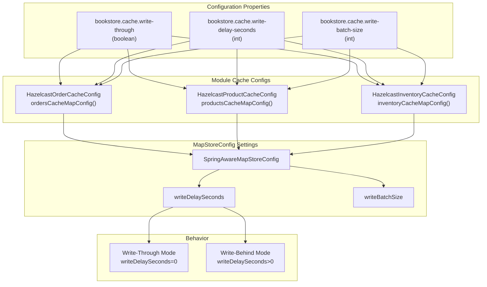
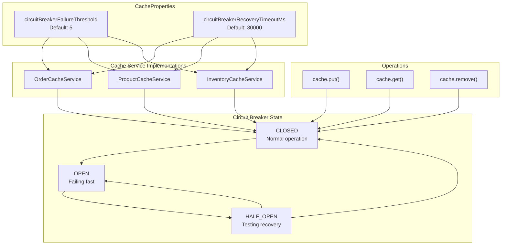
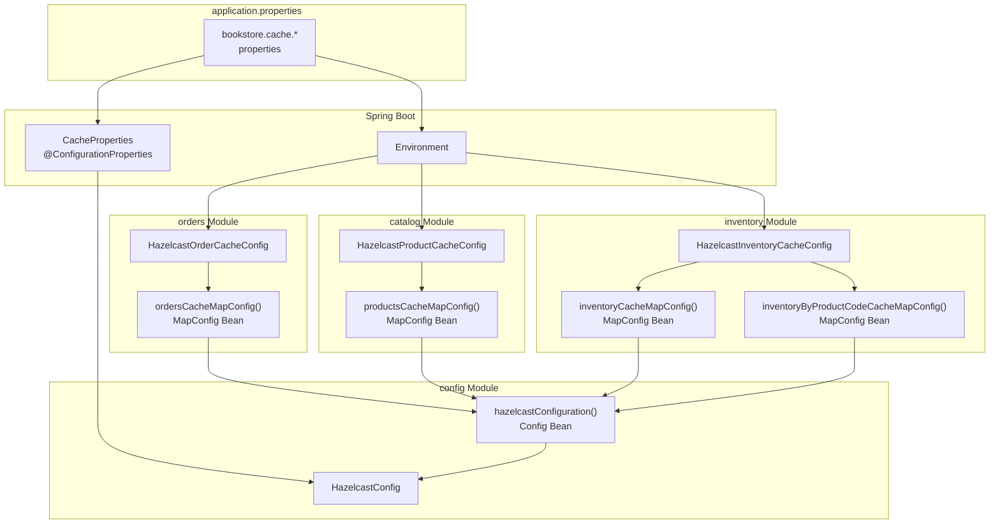

# Cache Properties

> **Relevant source files**
> * [src/main/java/com/sivalabs/bookstore/catalog/cache/ProductMapStore.java](https://github.com/philipz/spring-modular-monolith/blob/30c9bf30/src/main/java/com/sivalabs/bookstore/catalog/cache/ProductMapStore.java)
> * [src/main/java/com/sivalabs/bookstore/catalog/config/HazelcastProductCacheConfig.java](https://github.com/philipz/spring-modular-monolith/blob/30c9bf30/src/main/java/com/sivalabs/bookstore/catalog/config/HazelcastProductCacheConfig.java)
> * [src/main/java/com/sivalabs/bookstore/common/cache/SpringAwareMapStoreConfig.java](https://github.com/philipz/spring-modular-monolith/blob/30c9bf30/src/main/java/com/sivalabs/bookstore/common/cache/SpringAwareMapStoreConfig.java)
> * [src/main/java/com/sivalabs/bookstore/config/CacheProperties.java](https://github.com/philipz/spring-modular-monolith/blob/30c9bf30/src/main/java/com/sivalabs/bookstore/config/CacheProperties.java)
> * [src/main/java/com/sivalabs/bookstore/config/HazelcastConfig.java](https://github.com/philipz/spring-modular-monolith/blob/30c9bf30/src/main/java/com/sivalabs/bookstore/config/HazelcastConfig.java)
> * [src/main/java/com/sivalabs/bookstore/inventory/cache/InventoryMapStore.java](https://github.com/philipz/spring-modular-monolith/blob/30c9bf30/src/main/java/com/sivalabs/bookstore/inventory/cache/InventoryMapStore.java)
> * [src/main/java/com/sivalabs/bookstore/inventory/config/HazelcastInventoryCacheConfig.java](https://github.com/philipz/spring-modular-monolith/blob/30c9bf30/src/main/java/com/sivalabs/bookstore/inventory/config/HazelcastInventoryCacheConfig.java)
> * [src/main/java/com/sivalabs/bookstore/orders/cache/OrderMapStore.java](https://github.com/philipz/spring-modular-monolith/blob/30c9bf30/src/main/java/com/sivalabs/bookstore/orders/cache/OrderMapStore.java)
> * [src/main/java/com/sivalabs/bookstore/orders/config/HazelcastOrderCacheConfig.java](https://github.com/philipz/spring-modular-monolith/blob/30c9bf30/src/main/java/com/sivalabs/bookstore/orders/config/HazelcastOrderCacheConfig.java)
> * [src/test/java/com/sivalabs/bookstore/catalog/cache/ProductMapStoreTests.java](https://github.com/philipz/spring-modular-monolith/blob/30c9bf30/src/test/java/com/sivalabs/bookstore/catalog/cache/ProductMapStoreTests.java)
> * [src/test/java/com/sivalabs/bookstore/config/HazelcastConfigTests.java](https://github.com/philipz/spring-modular-monolith/blob/30c9bf30/src/test/java/com/sivalabs/bookstore/config/HazelcastConfigTests.java)
> * [src/test/java/com/sivalabs/bookstore/inventory/cache/InventoryMapStoreTests.java](https://github.com/philipz/spring-modular-monolith/blob/30c9bf30/src/test/java/com/sivalabs/bookstore/inventory/cache/InventoryMapStoreTests.java)
> * [src/test/java/com/sivalabs/bookstore/orders/OrdersCacheIntegrationTests.java](https://github.com/philipz/spring-modular-monolith/blob/30c9bf30/src/test/java/com/sivalabs/bookstore/orders/OrdersCacheIntegrationTests.java)
> * [src/test/java/com/sivalabs/bookstore/orders/cache/OrderMapStoreTests.java](https://github.com/philipz/spring-modular-monolith/blob/30c9bf30/src/test/java/com/sivalabs/bookstore/orders/cache/OrderMapStoreTests.java)
> * [src/test/java/com/sivalabs/bookstore/orders/config/HazelcastOrderCacheConfigTests.java](https://github.com/philipz/spring-modular-monolith/blob/30c9bf30/src/test/java/com/sivalabs/bookstore/orders/config/HazelcastOrderCacheConfigTests.java)

## Purpose

This document provides a comprehensive reference for all Hazelcast cache configuration properties available under the `bookstore.cache.*` prefix. These properties control cache behavior including write-through semantics, eviction policies, TTL settings, circuit breaker configuration, and health check behavior.

For information about the cache architecture and MapStore implementation patterns, see [MapStore Write-Through Pattern](/philipz/spring-modular-monolith/5.2-mapstore-write-through-pattern). For information about how caches are configured per module, see [Cache Configuration and MapConfigs](/philipz/spring-modular-monolith/5.1-cache-configuration-and-mapconfigs).

## Configuration Properties Class

All cache properties are defined in the `CacheProperties` class and bound to the Spring Boot configuration system using the `@ConfigurationProperties` annotation with prefix `bookstore.cache`.

**Sources:** [src/main/java/com/sivalabs/bookstore/config/CacheProperties.java L1-L234](https://github.com/philipz/spring-modular-monolith/blob/30c9bf30/src/main/java/com/sivalabs/bookstore/config/CacheProperties.java#L1-L234)

## Property Reference Table

| Property | Type | Default | Validation | Description |
| --- | --- | --- | --- | --- |
| `bookstore.cache.enabled` | boolean | `true` | - | Master switch to enable/disable all cache functionality |
| `bookstore.cache.max-size` | int | `1000` | @Min(1) | Maximum number of entries per cache (PER_NODE policy) |
| `bookstore.cache.time-to-live-seconds` | int | `3600` | @Min(0) | TTL for products and orders cache entries (1 hour) |
| `bookstore.cache.inventory-time-to-live-seconds` | int | `1800` | @Min(0) | TTL for inventory cache entries (30 minutes) |
| `bookstore.cache.write-through` | boolean | `true` | - | Enable write-through (sync) or write-behind (async) mode |
| `bookstore.cache.write-batch-size` | int | `1` | @Min(1) | Batch size for write operations to database |
| `bookstore.cache.write-delay-seconds` | int | `0` | @Min(0) | Write delay for write-behind mode (0 = write-through) |
| `bookstore.cache.metrics-enabled` | boolean | `true` | - | Enable cache statistics collection |
| `bookstore.cache.read-backup-data` | boolean | `true` | - | Allow reading from backup replicas |
| `bookstore.cache.max-idle-seconds` | int | `0` | @Min(0) | Maximum idle time before eviction (0 = disabled) |
| `bookstore.cache.backup-count` | int | `1` | @Min(0) | Number of synchronous backup replicas |
| `bookstore.cache.circuit-breaker-failure-threshold` | int | `5` | @Min(1) | Number of failures before circuit opens |
| `bookstore.cache.circuit-breaker-recovery-timeout-ms` | long | `30000` | @Min(0) | Recovery timeout in milliseconds (30 seconds) |
| `bookstore.cache.basic-operations-read-only` | boolean | `true` | - | Health checks use read-only operations |
| `bookstore.cache.test-basic-operations-enabled` | boolean | `true` | - | Enable/disable basic operations health check |

**Sources:** [src/main/java/com/sivalabs/bookstore/config/CacheProperties.java L17-L213](https://github.com/philipz/spring-modular-monolith/blob/30c9bf30/src/main/java/com/sivalabs/bookstore/config/CacheProperties.java#L17-L213)

## Property Categories and Usage

### Core Cache Settings

#### bookstore.cache.enabled

The master switch that controls whether Hazelcast caching is active. When set to `false`, the `HazelcastConfig` bean will not be created due to the `@ConditionalOnProperty` annotation.

```python
@Configuration
@EnableConfigurationProperties(CacheProperties.class)
@ConditionalOnProperty(prefix = "bookstore.cache", name = "enabled", havingValue = "true", matchIfMissing = true)
public class HazelcastConfig {
    // Configuration only active when cache is enabled
}
```

**Sources:** [src/main/java/com/sivalabs/bookstore/config/HazelcastConfig.java L27-L30](https://github.com/philipz/spring-modular-monolith/blob/30c9bf30/src/main/java/com/sivalabs/bookstore/config/HazelcastConfig.java#L27-L30)

 [src/main/java/com/sivalabs/bookstore/config/CacheProperties.java L17-L20](https://github.com/philipz/spring-modular-monolith/blob/30c9bf30/src/main/java/com/sivalabs/bookstore/config/CacheProperties.java#L17-L20)

#### bookstore.cache.max-size

Controls the maximum number of entries per node in each cache map. Used with `MaxSizePolicy.PER_NODE` eviction policy. When the cache reaches this size, the least recently used entries are evicted according to the LRU policy.

**Sources:** [src/main/java/com/sivalabs/bookstore/config/CacheProperties.java L22-L25](https://github.com/philipz/spring-modular-monolith/blob/30c9bf30/src/main/java/com/sivalabs/bookstore/config/CacheProperties.java#L22-L25)

 [src/main/java/com/sivalabs/bookstore/orders/config/HazelcastOrderCacheConfig.java L31-L34](https://github.com/philipz/spring-modular-monolith/blob/30c9bf30/src/main/java/com/sivalabs/bookstore/orders/config/HazelcastOrderCacheConfig.java#L31-L34)

#### bookstore.cache.metrics-enabled

Enables collection of cache statistics including hit/miss ratios, operation counts, and memory usage. Accessed through cache management interfaces and Spring Actuator endpoints.

**Sources:** [src/main/java/com/sivalabs/bookstore/config/CacheProperties.java L52-L55](https://github.com/philipz/spring-modular-monolith/blob/30c9bf30/src/main/java/com/sivalabs/bookstore/config/CacheProperties.java#L52-L55)

 [src/main/java/com/sivalabs/bookstore/config/HazelcastConfig.java L64-L67](https://github.com/philipz/spring-modular-monolith/blob/30c9bf30/src/main/java/com/sivalabs/bookstore/config/HazelcastConfig.java#L64-L67)

### Write-Through vs Write-Behind Configuration

#### Property Flow Diagram



**Sources:** [src/main/java/com/sivalabs/bookstore/orders/config/HazelcastOrderCacheConfig.java L48-L59](https://github.com/philipz/spring-modular-monolith/blob/30c9bf30/src/main/java/com/sivalabs/bookstore/orders/config/HazelcastOrderCacheConfig.java#L48-L59)

 [src/main/java/com/sivalabs/bookstore/catalog/config/HazelcastProductCacheConfig.java L49-L62](https://github.com/philipz/spring-modular-monolith/blob/30c9bf30/src/main/java/com/sivalabs/bookstore/catalog/config/HazelcastProductCacheConfig.java#L49-L62)

 [src/main/java/com/sivalabs/bookstore/inventory/config/HazelcastInventoryCacheConfig.java L50-L61](https://github.com/philipz/spring-modular-monolith/blob/30c9bf30/src/main/java/com/sivalabs/bookstore/inventory/config/HazelcastInventoryCacheConfig.java#L50-L61)

#### bookstore.cache.write-through

Controls whether cache writes are synchronous (write-through) or asynchronous (write-behind). When `true`, sets `writeDelaySeconds=0` for immediate database synchronization. When `false`, uses the configured write delay.

```
boolean writeThrough = getBoolean(environment, "bookstore.cache.write-through", true);
if (writeThrough) {
    mapStoreConfig.setWriteDelaySeconds(0);
    mapStoreConfig.setWriteBatchSize(getInt(environment, "bookstore.cache.write-batch-size", 1));
} else {
    int writeDelaySeconds = getInt(environment, "bookstore.cache.write-delay-seconds", 1);
    if (writeDelaySeconds <= 0) {
        writeDelaySeconds = 1; // Enforce minimum delay for write-behind
    }
    mapStoreConfig.setWriteDelaySeconds(writeDelaySeconds);
    mapStoreConfig.setWriteBatchSize(getInt(environment, "bookstore.cache.write-batch-size", 100));
}
```

**Sources:** [src/main/java/com/sivalabs/bookstore/orders/config/HazelcastOrderCacheConfig.java L48-L59](https://github.com/philipz/spring-modular-monolith/blob/30c9bf30/src/main/java/com/sivalabs/bookstore/orders/config/HazelcastOrderCacheConfig.java#L48-L59)

 [src/main/java/com/sivalabs/bookstore/config/CacheProperties.java L37-L40](https://github.com/philipz/spring-modular-monolith/blob/30c9bf30/src/main/java/com/sivalabs/bookstore/config/CacheProperties.java#L37-L40)

#### bookstore.cache.write-batch-size

Number of write operations to batch together before flushing to the database. In write-through mode, typically set to `1` for immediate synchronization. In write-behind mode, can be set higher (e.g., `100`) for better performance.

**Sources:** [src/main/java/com/sivalabs/bookstore/config/CacheProperties.java L42-L45](https://github.com/philipz/spring-modular-monolith/blob/30c9bf30/src/main/java/com/sivalabs/bookstore/config/CacheProperties.java#L42-L45)

#### bookstore.cache.write-delay-seconds

Delay in seconds before write operations are flushed to the database in write-behind mode. Must be greater than 0 for write-behind mode. When `write-through` is true, this is forced to 0.

**Sources:** [src/main/java/com/sivalabs/bookstore/config/CacheProperties.java L47-L50](https://github.com/philipz/spring-modular-monolith/blob/30c9bf30/src/main/java/com/sivalabs/bookstore/config/CacheProperties.java#L47-L50)

### Eviction and TTL Settings

#### bookstore.cache.time-to-live-seconds

Default TTL for cache entries in the products and orders caches. Entries are automatically evicted after this duration, regardless of access patterns. Default is 3600 seconds (1 hour).

**Sources:** [src/main/java/com/sivalabs/bookstore/config/CacheProperties.java L27-L30](https://github.com/philipz/spring-modular-monolith/blob/30c9bf30/src/main/java/com/sivalabs/bookstore/config/CacheProperties.java#L27-L30)

 [src/main/java/com/sivalabs/bookstore/orders/config/HazelcastOrderCacheConfig.java L37](https://github.com/philipz/spring-modular-monolith/blob/30c9bf30/src/main/java/com/sivalabs/bookstore/orders/config/HazelcastOrderCacheConfig.java#L37-L37)

#### bookstore.cache.inventory-time-to-live-seconds

Dedicated TTL for inventory cache entries. Set lower than the default (1800 seconds = 30 minutes) because inventory data is more volatile and changes more frequently.

```
inventoryCacheConfig.setTimeToLiveSeconds(
    getInt(environment, "bookstore.cache.inventory-time-to-live-seconds", 1_800)
);
```

**Sources:** [src/main/java/com/sivalabs/bookstore/config/CacheProperties.java L32-L35](https://github.com/philipz/spring-modular-monolith/blob/30c9bf30/src/main/java/com/sivalabs/bookstore/config/CacheProperties.java#L32-L35)

 [src/main/java/com/sivalabs/bookstore/inventory/config/HazelcastInventoryCacheConfig.java L38-L39](https://github.com/philipz/spring-modular-monolith/blob/30c9bf30/src/main/java/com/sivalabs/bookstore/inventory/config/HazelcastInventoryCacheConfig.java#L38-L39)

#### bookstore.cache.max-idle-seconds

Maximum time an entry can remain idle (not accessed) before being evicted. When set to 0 (default), idle-based eviction is disabled and only TTL-based eviction occurs.

**Sources:** [src/main/java/com/sivalabs/bookstore/config/CacheProperties.java L74-L76](https://github.com/philipz/spring-modular-monolith/blob/30c9bf30/src/main/java/com/sivalabs/bookstore/config/CacheProperties.java#L74-L76)

 [src/main/java/com/sivalabs/bookstore/orders/config/HazelcastOrderCacheConfig.java L38](https://github.com/philipz/spring-modular-monolith/blob/30c9bf30/src/main/java/com/sivalabs/bookstore/orders/config/HazelcastOrderCacheConfig.java#L38-L38)

### Backup and Replication Settings

#### bookstore.cache.backup-count

Number of synchronous backup replicas to maintain for each cache entry. With a backup count of 1, each entry is replicated to one other node in the cluster, providing fault tolerance.

**Sources:** [src/main/java/com/sivalabs/bookstore/config/CacheProperties.java L78-L81](https://github.com/philipz/spring-modular-monolith/blob/30c9bf30/src/main/java/com/sivalabs/bookstore/config/CacheProperties.java#L78-L81)

 [src/main/java/com/sivalabs/bookstore/orders/config/HazelcastOrderCacheConfig.java L39](https://github.com/philipz/spring-modular-monolith/blob/30c9bf30/src/main/java/com/sivalabs/bookstore/orders/config/HazelcastOrderCacheConfig.java#L39-L39)

#### bookstore.cache.read-backup-data

When `true`, allows read operations to be served from backup replicas, reducing load on primary nodes and improving read performance. Trade-off: may read slightly stale data during partition migrations.

**Sources:** [src/main/java/com/sivalabs/bookstore/config/CacheProperties.java L57-L60](https://github.com/philipz/spring-modular-monolith/blob/30c9bf30/src/main/java/com/sivalabs/bookstore/config/CacheProperties.java#L57-L60)

 [src/main/java/com/sivalabs/bookstore/orders/config/HazelcastOrderCacheConfig.java L40](https://github.com/philipz/spring-modular-monolith/blob/30c9bf30/src/main/java/com/sivalabs/bookstore/orders/config/HazelcastOrderCacheConfig.java#L40-L40)

### Circuit Breaker Configuration

The cache system includes a circuit breaker pattern to prevent cascading failures when cache operations encounter persistent errors.

#### Property-to-Implementation Diagram



**Sources:** [src/main/java/com/sivalabs/bookstore/config/CacheProperties.java L84-L92](https://github.com/philipz/spring-modular-monolith/blob/30c9bf30/src/main/java/com/sivalabs/bookstore/config/CacheProperties.java#L84-L92)

#### bookstore.cache.circuit-breaker-failure-threshold

Number of consecutive failures required before the circuit breaker opens. When the circuit is open, cache operations fail fast without attempting to contact the cache, preventing resource exhaustion.

**Sources:** [src/main/java/com/sivalabs/bookstore/config/CacheProperties.java L84-L86](https://github.com/philipz/spring-modular-monolith/blob/30c9bf30/src/main/java/com/sivalabs/bookstore/config/CacheProperties.java#L84-L86)

#### bookstore.cache.circuit-breaker-recovery-timeout-ms

Time in milliseconds to wait before attempting to close the circuit after it has opened. After this timeout, the circuit enters a HALF_OPEN state where a test operation determines whether to close or re-open the circuit.

**Sources:** [src/main/java/com/sivalabs/bookstore/config/CacheProperties.java L88-L91](https://github.com/philipz/spring-modular-monolith/blob/30c9bf30/src/main/java/com/sivalabs/bookstore/config/CacheProperties.java#L88-L91)

### Health Check Configuration

#### bookstore.cache.basic-operations-read-only

When `true`, health check basic operations use only `get()` operations to avoid triggering MapStore writes during health checks. This prevents health checks from affecting the database.

**Sources:** [src/main/java/com/sivalabs/bookstore/config/CacheProperties.java L62-L66](https://github.com/philipz/spring-modular-monolith/blob/30c9bf30/src/main/java/com/sivalabs/bookstore/config/CacheProperties.java#L62-L66)

#### bookstore.cache.test-basic-operations-enabled

Enables or disables the basic operations health check block entirely. Useful for disabling intrusive health checks in production environments.

**Sources:** [src/main/java/com/sivalabs/bookstore/config/CacheProperties.java L68-L71](https://github.com/philipz/spring-modular-monolith/blob/30c9bf30/src/main/java/com/sivalabs/bookstore/config/CacheProperties.java#L68-L71)

## Module-Specific Configuration Consumption

Each business module (orders, catalog, inventory) contributes its own `MapConfig` bean that reads these properties from the Spring `Environment`.

### Configuration Flow Diagram



**Sources:** [src/main/java/com/sivalabs/bookstore/config/HazelcastConfig.java L46-L63](https://github.com/philipz/spring-modular-monolith/blob/30c9bf30/src/main/java/com/sivalabs/bookstore/config/HazelcastConfig.java#L46-L63)

 [src/main/java/com/sivalabs/bookstore/orders/config/HazelcastOrderCacheConfig.java L28-L62](https://github.com/philipz/spring-modular-monolith/blob/30c9bf30/src/main/java/com/sivalabs/bookstore/orders/config/HazelcastOrderCacheConfig.java#L28-L62)

 [src/main/java/com/sivalabs/bookstore/catalog/config/HazelcastProductCacheConfig.java L29-L65](https://github.com/philipz/spring-modular-monolith/blob/30c9bf30/src/main/java/com/sivalabs/bookstore/catalog/config/HazelcastProductCacheConfig.java#L29-L65)

 [src/main/java/com/sivalabs/bookstore/inventory/config/HazelcastInventoryCacheConfig.java L29-L88](https://github.com/philipz/spring-modular-monolith/blob/30c9bf30/src/main/java/com/sivalabs/bookstore/inventory/config/HazelcastInventoryCacheConfig.java#L29-L88)

### Property Reading Pattern

All module-specific cache configuration classes use a consistent pattern to read properties from the Spring `Environment`:

```java
private int getInt(Environment environment, String propertyKey, int defaultValue) {
    return environment.getProperty(propertyKey, Integer.class, defaultValue);
}

private boolean getBoolean(Environment environment, String propertyKey, boolean defaultValue) {
    return environment.getProperty(propertyKey, Boolean.class, defaultValue);
}
```

This pattern allows module configurations to remain independent while still sharing common cache properties.

**Sources:** [src/main/java/com/sivalabs/bookstore/orders/config/HazelcastOrderCacheConfig.java L65-L71](https://github.com/philipz/spring-modular-monolith/blob/30c9bf30/src/main/java/com/sivalabs/bookstore/orders/config/HazelcastOrderCacheConfig.java#L65-L71)

 [src/main/java/com/sivalabs/bookstore/catalog/config/HazelcastProductCacheConfig.java L68-L74](https://github.com/philipz/spring-modular-monolith/blob/30c9bf30/src/main/java/com/sivalabs/bookstore/catalog/config/HazelcastProductCacheConfig.java#L68-L74)

 [src/main/java/com/sivalabs/bookstore/inventory/config/HazelcastInventoryCacheConfig.java L90-L96](https://github.com/philipz/spring-modular-monolith/blob/30c9bf30/src/main/java/com/sivalabs/bookstore/inventory/config/HazelcastInventoryCacheConfig.java#L90-L96)

## Per-Cache Configuration Summary

### Orders Cache (orders-cache)

| Setting | Property | Value |
| --- | --- | --- |
| TTL | `time-to-live-seconds` | 3600s (1 hour) |
| Max Size | `max-size` | 1000 entries |
| Eviction | Fixed | LRU |
| MapStore | Fixed | `OrderMapStore` |
| Initial Load | Fixed | LAZY |

**Sources:** [src/main/java/com/sivalabs/bookstore/orders/config/HazelcastOrderCacheConfig.java L28-L62](https://github.com/philipz/spring-modular-monolith/blob/30c9bf30/src/main/java/com/sivalabs/bookstore/orders/config/HazelcastOrderCacheConfig.java#L28-L62)

### Products Cache (products-cache)

| Setting | Property | Value |
| --- | --- | --- |
| TTL | `time-to-live-seconds` | 3600s (1 hour) |
| Max Size | `max-size` | 1000 entries |
| Eviction | Fixed | LRU |
| MapStore | Fixed | `ProductMapStore` |
| Initial Load | Fixed | LAZY |

**Sources:** [src/main/java/com/sivalabs/bookstore/catalog/config/HazelcastProductCacheConfig.java L29-L65](https://github.com/philipz/spring-modular-monolith/blob/30c9bf30/src/main/java/com/sivalabs/bookstore/catalog/config/HazelcastProductCacheConfig.java#L29-L65)

### Inventory Cache (inventory-cache)

| Setting | Property | Value |
| --- | --- | --- |
| TTL | `inventory-time-to-live-seconds` | 1800s (30 minutes) |
| Max Size | `max-size` | 1000 entries |
| Eviction | Fixed | LRU |
| MapStore | Fixed | `InventoryMapStore` |
| Initial Load | Fixed | LAZY |

**Sources:** [src/main/java/com/sivalabs/bookstore/inventory/config/HazelcastInventoryCacheConfig.java L29-L64](https://github.com/philipz/spring-modular-monolith/blob/30c9bf30/src/main/java/com/sivalabs/bookstore/inventory/config/HazelcastInventoryCacheConfig.java#L29-L64)

### Inventory By Product Code Cache (inventory-by-product-code-cache)

| Setting | Property | Value |
| --- | --- | --- |
| TTL | `inventory-time-to-live-seconds` | 1800s (30 minutes) |
| Max Size | `max-size` | 1000 entries |
| Eviction | Fixed | LRU |
| MapStore | Fixed | None (in-memory only) |
| Initial Load | Fixed | N/A |

This cache is an index-only cache with no MapStore backing, used for product code to inventory ID lookups.

**Sources:** [src/main/java/com/sivalabs/bookstore/inventory/config/HazelcastInventoryCacheConfig.java L68-L88](https://github.com/philipz/spring-modular-monolith/blob/30c9bf30/src/main/java/com/sivalabs/bookstore/inventory/config/HazelcastInventoryCacheConfig.java#L68-L88)

## Test Configuration Examples

The test suite demonstrates various property configurations:

### Write-Through Mode (Default)

```
bookstore.cache.enabled=true
bookstore.cache.write-through=true
bookstore.cache.max-size=100
bookstore.cache.time-to-live-seconds=3600
bookstore.cache.write-delay-seconds=1
bookstore.cache.metrics-enabled=true
```

**Sources:** [src/test/java/com/sivalabs/bookstore/config/HazelcastConfigTests.java L43-L50](https://github.com/philipz/spring-modular-monolith/blob/30c9bf30/src/test/java/com/sivalabs/bookstore/config/HazelcastConfigTests.java#L43-L50)

### Write-Behind Mode

```
bookstore.cache.enabled=true
bookstore.cache.write-through=false
bookstore.cache.write-delay-seconds=5
bookstore.cache.write-batch-size=10
```

**Sources:** [src/test/java/com/sivalabs/bookstore/orders/config/HazelcastOrderCacheConfigTests.java L23-L32](https://github.com/philipz/spring-modular-monolith/blob/30c9bf30/src/test/java/com/sivalabs/bookstore/orders/config/HazelcastOrderCacheConfigTests.java#L23-L32)

### Integration Test Configuration

```
bookstore.cache.enabled=true
bookstore.cache.write-through=true
bookstore.cache.max-size=50
bookstore.cache.time-to-live-seconds=60
bookstore.cache.write-delay-seconds=0
bookstore.cache.metrics-enabled=true
```

**Sources:** [src/test/java/com/sivalabs/bookstore/orders/OrdersCacheIntegrationTests.java L41-L51](https://github.com/philipz/spring-modular-monolith/blob/30c9bf30/src/test/java/com/sivalabs/bookstore/orders/OrdersCacheIntegrationTests.java#L41-L51)

## Property Validation

The `CacheProperties` class uses Jakarta Bean Validation annotations to enforce constraints:

* `@Min(1)` on `maxSize`, `writeBatchSize`, `circuitBreakerFailureThreshold`
* `@Min(0)` on `timeToLiveSeconds`, `inventoryTimeToLiveSeconds`, `writeDelaySeconds`, `maxIdleSeconds`, `backupCount`, `circuitBreakerRecoveryTimeoutMs`
* `@Validated` on the class enables validation at runtime

Invalid property values will cause application startup to fail with a `BindValidationException`.

**Sources:** [src/main/java/com/sivalabs/bookstore/config/CacheProperties.java L3-L91](https://github.com/philipz/spring-modular-monolith/blob/30c9bf30/src/main/java/com/sivalabs/bookstore/config/CacheProperties.java#L3-L91)

## Related Configuration

For properties related to specific cache behaviors:

* Session management configuration (Spring Session with Hazelcast): See [Session Management with Hazelcast](/philipz/spring-modular-monolith/5.3-session-management-with-hazelcast)
* Hazelcast cluster and network settings: Configured directly in [HazelcastConfig.java L52-L92](https://github.com/philipz/spring-modular-monolith/blob/30c9bf30/HazelcastConfig.java#L52-L92)
* MapStore implementations: See [MapStore Write-Through Pattern](/philipz/spring-modular-monolith/5.2-mapstore-write-through-pattern)