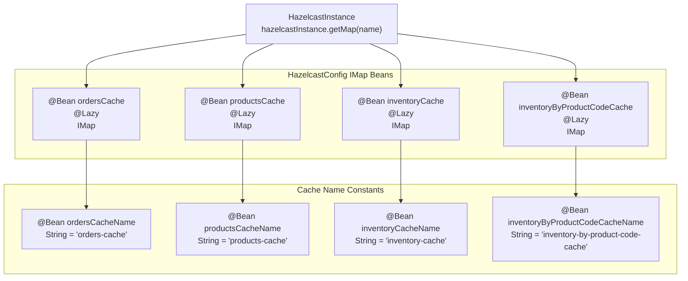
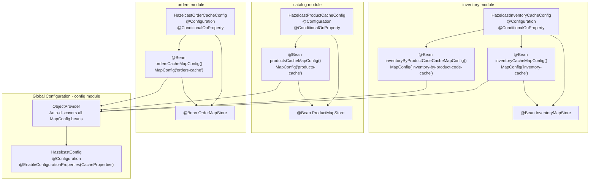
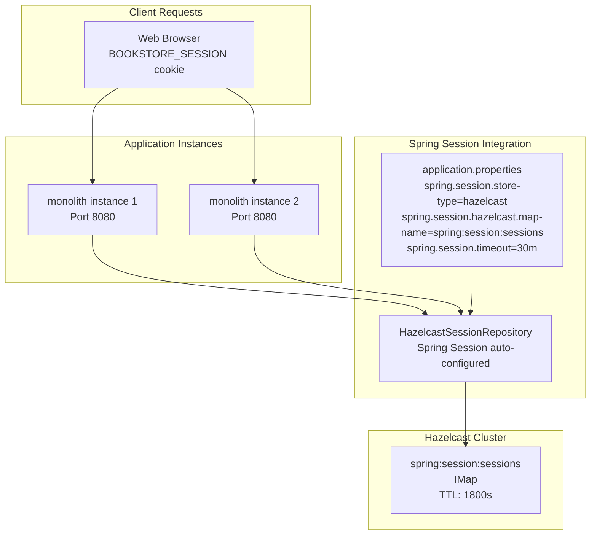
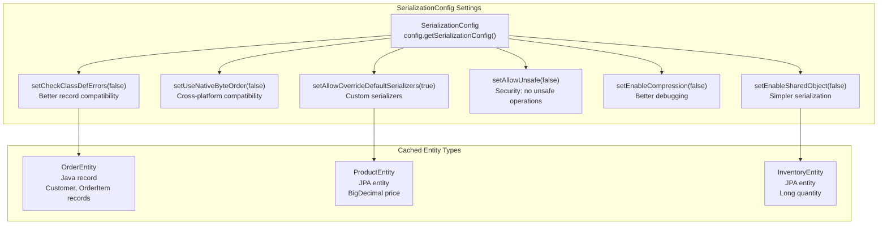

# Caching with Hazelcast

> **Relevant source files**
> * [compose.yml](https://github.com/philipz/spring-modular-monolith/blob/30c9bf30/compose.yml)
> * [pom.xml](https://github.com/philipz/spring-modular-monolith/blob/30c9bf30/pom.xml)
> * [src/main/java/com/sivalabs/bookstore/catalog/cache/ProductMapStore.java](https://github.com/philipz/spring-modular-monolith/blob/30c9bf30/src/main/java/com/sivalabs/bookstore/catalog/cache/ProductMapStore.java)
> * [src/main/java/com/sivalabs/bookstore/catalog/config/HazelcastProductCacheConfig.java](https://github.com/philipz/spring-modular-monolith/blob/30c9bf30/src/main/java/com/sivalabs/bookstore/catalog/config/HazelcastProductCacheConfig.java)
> * [src/main/java/com/sivalabs/bookstore/common/cache/SpringAwareMapStoreConfig.java](https://github.com/philipz/spring-modular-monolith/blob/30c9bf30/src/main/java/com/sivalabs/bookstore/common/cache/SpringAwareMapStoreConfig.java)
> * [src/main/java/com/sivalabs/bookstore/config/CacheProperties.java](https://github.com/philipz/spring-modular-monolith/blob/30c9bf30/src/main/java/com/sivalabs/bookstore/config/CacheProperties.java)
> * [src/main/java/com/sivalabs/bookstore/config/HazelcastConfig.java](https://github.com/philipz/spring-modular-monolith/blob/30c9bf30/src/main/java/com/sivalabs/bookstore/config/HazelcastConfig.java)
> * [src/main/java/com/sivalabs/bookstore/inventory/cache/InventoryMapStore.java](https://github.com/philipz/spring-modular-monolith/blob/30c9bf30/src/main/java/com/sivalabs/bookstore/inventory/cache/InventoryMapStore.java)
> * [src/main/java/com/sivalabs/bookstore/inventory/config/HazelcastInventoryCacheConfig.java](https://github.com/philipz/spring-modular-monolith/blob/30c9bf30/src/main/java/com/sivalabs/bookstore/inventory/config/HazelcastInventoryCacheConfig.java)
> * [src/main/java/com/sivalabs/bookstore/orders/cache/OrderMapStore.java](https://github.com/philipz/spring-modular-monolith/blob/30c9bf30/src/main/java/com/sivalabs/bookstore/orders/cache/OrderMapStore.java)
> * [src/main/java/com/sivalabs/bookstore/orders/config/HazelcastOrderCacheConfig.java](https://github.com/philipz/spring-modular-monolith/blob/30c9bf30/src/main/java/com/sivalabs/bookstore/orders/config/HazelcastOrderCacheConfig.java)
> * [src/main/resources/application.properties](https://github.com/philipz/spring-modular-monolith/blob/30c9bf30/src/main/resources/application.properties)
> * [src/test/java/com/sivalabs/bookstore/BookStoreApplicationTests.java](https://github.com/philipz/spring-modular-monolith/blob/30c9bf30/src/test/java/com/sivalabs/bookstore/BookStoreApplicationTests.java)
> * [src/test/java/com/sivalabs/bookstore/TestcontainersConfiguration.java](https://github.com/philipz/spring-modular-monolith/blob/30c9bf30/src/test/java/com/sivalabs/bookstore/TestcontainersConfiguration.java)
> * [src/test/java/com/sivalabs/bookstore/catalog/cache/ProductMapStoreTests.java](https://github.com/philipz/spring-modular-monolith/blob/30c9bf30/src/test/java/com/sivalabs/bookstore/catalog/cache/ProductMapStoreTests.java)
> * [src/test/java/com/sivalabs/bookstore/config/HazelcastConfigTests.java](https://github.com/philipz/spring-modular-monolith/blob/30c9bf30/src/test/java/com/sivalabs/bookstore/config/HazelcastConfigTests.java)
> * [src/test/java/com/sivalabs/bookstore/inventory/cache/InventoryMapStoreTests.java](https://github.com/philipz/spring-modular-monolith/blob/30c9bf30/src/test/java/com/sivalabs/bookstore/inventory/cache/InventoryMapStoreTests.java)
> * [src/test/java/com/sivalabs/bookstore/orders/OrdersCacheIntegrationTests.java](https://github.com/philipz/spring-modular-monolith/blob/30c9bf30/src/test/java/com/sivalabs/bookstore/orders/OrdersCacheIntegrationTests.java)
> * [src/test/java/com/sivalabs/bookstore/orders/cache/OrderMapStoreTests.java](https://github.com/philipz/spring-modular-monolith/blob/30c9bf30/src/test/java/com/sivalabs/bookstore/orders/cache/OrderMapStoreTests.java)
> * [src/test/java/com/sivalabs/bookstore/orders/config/HazelcastOrderCacheConfigTests.java](https://github.com/philipz/spring-modular-monolith/blob/30c9bf30/src/test/java/com/sivalabs/bookstore/orders/config/HazelcastOrderCacheConfigTests.java)

This document describes the distributed caching architecture using Hazelcast 5.5.6, which provides read-through and write-through caching for business entities across all Spring Modulith modules. The caching layer improves performance by reducing database roundtrips and enables horizontal scaling with session distribution.

For detailed information about cache configuration and MapConfig beans contributed by each module, see [Cache Configuration and MapConfigs](/philipz/spring-modular-monolith/5.1-cache-configuration-and-mapconfigs). For details about the write-through synchronization pattern with PostgreSQL, see [MapStore Write-Through Pattern](/philipz/spring-modular-monolith/5.2-mapstore-write-through-pattern). For distributed session storage, see [Session Management with Hazelcast](/philipz/spring-modular-monolith/5.3-session-management-with-hazelcast).

## Overview

Hazelcast serves as the distributed in-memory data grid for the Spring modular monolith, providing:

* **Module-specific caches**: Each business module (catalog, orders, inventory) contributes its own cache configuration through MapConfig beans
* **Write-through persistence**: MapStore implementations synchronize cache operations with PostgreSQL automatically
* **Distributed sessions**: Spring Session integration enables stateful shopping cart functionality across horizontal instances
* **Circuit breaker protection**: Fault tolerance mechanism prevents cascading failures when cache operations fail
* **Observability**: Cache metrics exposed through Spring Actuator and Micrometer

The system uses a cluster named `bookstore-cluster` with management center available at `http://localhost:38080`.

**Sources:**

* [src/main/java/com/sivalabs/bookstore/config/HazelcastConfig.java L1-L224](https://github.com/philipz/spring-modular-monolith/blob/30c9bf30/src/main/java/com/sivalabs/bookstore/config/HazelcastConfig.java#L1-L224)
* [compose.yml L175-L185](https://github.com/philipz/spring-modular-monolith/blob/30c9bf30/compose.yml#L175-L185)
* [pom.xml L130-L140](https://github.com/philipz/spring-modular-monolith/blob/30c9bf30/pom.xml#L130-L140)

## Hazelcast Cluster Architecture

```

```

**Hazelcast Cluster and Configuration Bean Structure**

The `HazelcastConfig` class creates a centralized Hazelcast instance that aggregates MapConfig beans contributed by individual modules. The `springManagedContext()` bean enables Spring dependency injection into MapStore implementations, allowing them to use Spring-managed repositories. Each module contributes its cache configuration through `@Bean` methods returning `MapConfig`, which are automatically discovered through `ObjectProvider<MapConfig>`.

**Sources:**

* [src/main/java/com/sivalabs/bookstore/config/HazelcastConfig.java L45-L94](https://github.com/philipz/spring-modular-monolith/blob/30c9bf30/src/main/java/com/sivalabs/bookstore/config/HazelcastConfig.java#L45-L94)
* [src/main/java/com/sivalabs/bookstore/config/HazelcastConfig.java L110-L116](https://github.com/philipz/spring-modular-monolith/blob/30c9bf30/src/main/java/com/sivalabs/bookstore/config/HazelcastConfig.java#L110-L116)
* [src/main/java/com/sivalabs/bookstore/config/HazelcastConfig.java L96-L102](https://github.com/philipz/spring-modular-monolith/blob/30c9bf30/src/main/java/com/sivalabs/bookstore/config/HazelcastConfig.java#L96-L102)
* [src/main/java/com/sivalabs/bookstore/orders/config/HazelcastOrderCacheConfig.java L22-L63](https://github.com/philipz/spring-modular-monolith/blob/30c9bf30/src/main/java/com/sivalabs/bookstore/orders/config/HazelcastOrderCacheConfig.java#L22-L63)
* [src/main/java/com/sivalabs/bookstore/catalog/config/HazelcastProductCacheConfig.java L22-L66](https://github.com/philipz/spring-modular-monolith/blob/30c9bf30/src/main/java/com/sivalabs/bookstore/catalog/config/HazelcastProductCacheConfig.java#L22-L66)
* [src/main/java/com/sivalabs/bookstore/inventory/config/HazelcastInventoryCacheConfig.java L22-L88](https://github.com/philipz/spring-modular-monolith/blob/30c9bf30/src/main/java/com/sivalabs/bookstore/inventory/config/HazelcastInventoryCacheConfig.java#L22-L88)

## Module-Specific Cache Design

Each business module owns its cache configuration and MapStore implementation, maintaining Spring Modulith boundaries while leveraging shared Hazelcast infrastructure.

### Cache Map Registry

| Cache Name | Key Type | Value Type | TTL | Module | MapStore |
| --- | --- | --- | --- | --- | --- |
| `orders-cache` | `String` (orderNumber) | `Object` (OrderEntity) | 3600s | orders | OrderMapStore |
| `products-cache` | `String` (productCode) | `Object` (ProductEntity) | 3600s | catalog | ProductMapStore |
| `inventory-cache` | `Long` (inventoryId) | `Object` (InventoryEntity) | 1800s | inventory | InventoryMapStore |
| `inventory-by-product-code-cache` | `String` (productCode) | `Object` (Long inventoryId) | 1800s | inventory | None (in-memory index) |
| `spring:session:sessions` | `String` (sessionId) | `Object` (Session) | 1800s | N/A | Spring Session |

The inventory module has a shorter TTL (1800 seconds vs 3600 seconds) due to higher volatility of stock levels. The `inventory-by-product-code-cache` is an in-memory index without MapStore backing, used for product code lookups.

**Sources:**

* [src/main/java/com/sivalabs/bookstore/config/HazelcastConfig.java L34-L37](https://github.com/philipz/spring-modular-monolith/blob/30c9bf30/src/main/java/com/sivalabs/bookstore/config/HazelcastConfig.java#L34-L37)
* [src/main/resources/application.properties L42-L68](https://github.com/philipz/spring-modular-monolith/blob/30c9bf30/src/main/resources/application.properties#L42-L68)
* [src/main/java/com/sivalabs/bookstore/inventory/config/HazelcastInventoryCacheConfig.java L38-L39](https://github.com/philipz/spring-modular-monolith/blob/30c9bf30/src/main/java/com/sivalabs/bookstore/inventory/config/HazelcastInventoryCacheConfig.java#L38-L39)

### IMap Bean Creation Pattern

Each cache is exposed as an `IMap` bean with `@Lazy` initialization to avoid circular dependencies with MapStore beans:



**IMap Bean Creation and Cache Name Constants**

The `@Lazy` annotation on IMap beans ensures they are created only after MapStore beans are available, avoiding circular dependency issues during Spring context initialization. Cache name constant beans provide reusable String values for other components.

**Sources:**

* [src/main/java/com/sivalabs/bookstore/config/HazelcastConfig.java L126-L144](https://github.com/philipz/spring-modular-monolith/blob/30c9bf30/src/main/java/com/sivalabs/bookstore/config/HazelcastConfig.java#L126-L144)
* [src/main/java/com/sivalabs/bookstore/config/HazelcastConfig.java L154-L171](https://github.com/philipz/spring-modular-monolith/blob/30c9bf30/src/main/java/com/sivalabs/bookstore/config/HazelcastConfig.java#L154-L171)
* [src/main/java/com/sivalabs/bookstore/config/HazelcastConfig.java L182-L199](https://github.com/philipz/spring-modular-monolith/blob/30c9bf30/src/main/java/com/sivalabs/bookstore/config/HazelcastConfig.java#L182-L199)
* [src/main/java/com/sivalabs/bookstore/config/HazelcastConfig.java L208-L223](https://github.com/philipz/spring-modular-monolith/blob/30c9bf30/src/main/java/com/sivalabs/bookstore/config/HazelcastConfig.java#L208-L223)

## Cache Configuration Properties

The `CacheProperties` class provides externalized configuration through `application.properties`:

### Core Configuration Properties

| Property | Default | Description |
| --- | --- | --- |
| `bookstore.cache.enabled` | `true` | Global cache enable/disable flag |
| `bookstore.cache.max-size` | `1000` | Maximum entries per cache (PER_NODE) |
| `bookstore.cache.time-to-live-seconds` | `3600` | Default TTL for orders/products caches |
| `bookstore.cache.inventory-time-to-live-seconds` | `1800` | TTL for inventory cache (shorter due to volatility) |
| `bookstore.cache.max-idle-seconds` | `0` | Max idle time (0 = disabled) |
| `bookstore.cache.backup-count` | `1` | Number of backup replicas |
| `bookstore.cache.read-backup-data` | `true` | Enable reading from backup nodes |
| `bookstore.cache.metrics-enabled` | `true` | Enable cache statistics and metrics |

### Write-Through Configuration

| Property | Default | Description |
| --- | --- | --- |
| `bookstore.cache.write-through` | `true` | Enable write-through mode (0 delay) |
| `bookstore.cache.write-delay-seconds` | `0` | Delay for write-behind mode (0 = write-through) |
| `bookstore.cache.write-batch-size` | `1` | Batch size for write operations |

### Circuit Breaker Configuration

| Property | Default | Description |
| --- | --- | --- |
| `bookstore.cache.circuit-breaker.failure-threshold` | `5` | Failures before opening circuit |
| `bookstore.cache.circuit-breaker.recovery-timeout` | `30000` | Recovery timeout in milliseconds |

The circuit breaker protects against cascading failures when cache operations fail, automatically opening after 5 consecutive failures and attempting recovery after 30 seconds.

**Sources:**

* [src/main/resources/application.properties L42-L68](https://github.com/philipz/spring-modular-monolith/blob/30c9bf30/src/main/resources/application.properties#L42-L68)
* [src/main/java/com/sivalabs/bookstore/config/CacheProperties.java L1-L234](https://github.com/philipz/spring-modular-monolith/blob/30c9bf30/src/main/java/com/sivalabs/bookstore/config/CacheProperties.java#L1-L234)

## Write-Through Pattern with MapStore

Each module implements a MapStore for automatic database synchronization:

```

```

**Write-Through Cache Pattern with MapStore Implementations**

MapStore implementations use `ObjectProvider<Repository>` for lazy repository access, avoiding circular dependencies during Spring context initialization. The `@SpringAware` annotation enables Spring dependency injection into Hazelcast MapStore instances. With `writeDelaySeconds=0`, all cache writes immediately trigger `store()` method calls that synchronize to PostgreSQL. Cache reads trigger `load()` on cache miss, automatically populating the cache.

**Sources:**

* [src/main/java/com/sivalabs/bookstore/orders/cache/OrderMapStore.java L31-L97](https://github.com/philipz/spring-modular-monolith/blob/30c9bf30/src/main/java/com/sivalabs/bookstore/orders/cache/OrderMapStore.java#L31-L97)
* [src/main/java/com/sivalabs/bookstore/catalog/cache/ProductMapStore.java L33-L99](https://github.com/philipz/spring-modular-monolith/blob/30c9bf30/src/main/java/com/sivalabs/bookstore/catalog/cache/ProductMapStore.java#L33-L99)
* [src/main/java/com/sivalabs/bookstore/inventory/cache/InventoryMapStore.java L34-L98](https://github.com/philipz/spring-modular-monolith/blob/30c9bf30/src/main/java/com/sivalabs/bookstore/inventory/cache/InventoryMapStore.java#L34-L98)
* [src/main/java/com/sivalabs/bookstore/orders/config/HazelcastOrderCacheConfig.java L48-L59](https://github.com/philipz/spring-modular-monolith/blob/30c9bf30/src/main/java/com/sivalabs/bookstore/orders/config/HazelcastOrderCacheConfig.java#L48-L59)

### MapStore Lifecycle Methods

All MapStore implementations implement `MapLoaderLifecycleSupport` for initialization and cleanup:

| Method | Purpose | Timing |
| --- | --- | --- |
| `init(HazelcastInstance, Properties, String)` | Initialize MapStore with Hazelcast instance | Called once during cache initialization |
| `destroy()` | Cleanup resources | Called during Hazelcast shutdown |
| `store(K key, V value)` | Write single entry to database | Called on cache put() with writeDelaySeconds=0 |
| `storeAll(Map<K, V> entries)` | Batch write to database | Called on batch cache operations |
| `load(K key)` | Read single entry from database | Called on cache miss |
| `loadAll(Collection<K> keys)` | Batch read from database | Called on batch cache miss |
| `loadAllKeys()` | Pre-load all keys | Called during cache warming |
| `delete(K key)` | Delete from database | Called on cache remove() |
| `deleteAll(Collection<K> keys)` | Batch delete from database | Called on batch remove |

The current implementation uses write-through mode where `store()` methods only validate data consistency (keys match entity values) rather than performing actual database writes, as writes are handled by service layer repositories. This pattern ensures cache and database remain synchronized without duplicate write operations.

**Sources:**

* [src/main/java/com/sivalabs/bookstore/orders/cache/OrderMapStore.java L55-L97](https://github.com/philipz/spring-modular-monolith/blob/30c9bf30/src/main/java/com/sivalabs/bookstore/orders/cache/OrderMapStore.java#L55-L97)
* [src/main/java/com/sivalabs/bookstore/catalog/cache/ProductMapStore.java L57-L99](https://github.com/philipz/spring-modular-monolith/blob/30c9bf30/src/main/java/com/sivalabs/bookstore/catalog/cache/ProductMapStore.java#L57-L99)
* [src/main/java/com/sivalabs/bookstore/inventory/cache/InventoryMapStore.java L58-L98](https://github.com/philipz/spring-modular-monolith/blob/30c9bf30/src/main/java/com/sivalabs/bookstore/inventory/cache/InventoryMapStore.java#L58-L98)

## Module Contribution Pattern

Each module contributes its cache configuration through a dedicated config class:



**Module Cache Configuration Contribution Pattern**

Each module contributes MapConfig beans that are automatically discovered by `HazelcastConfig` through `ObjectProvider<MapConfig>`. The `@ConditionalOnProperty` annotation ensures cache configuration is only active when `bookstore.cache.enabled=true`. This pattern maintains module boundaries while allowing centralized Hazelcast instance management.

**Sources:**

* [src/main/java/com/sivalabs/bookstore/config/HazelcastConfig.java L45-L62](https://github.com/philipz/spring-modular-monolith/blob/30c9bf30/src/main/java/com/sivalabs/bookstore/config/HazelcastConfig.java#L45-L62)
* [src/main/java/com/sivalabs/bookstore/orders/config/HazelcastOrderCacheConfig.java L21-L63](https://github.com/philipz/spring-modular-monolith/blob/30c9bf30/src/main/java/com/sivalabs/bookstore/orders/config/HazelcastOrderCacheConfig.java#L21-L63)
* [src/main/java/com/sivalabs/bookstore/catalog/config/HazelcastProductCacheConfig.java L22-L66](https://github.com/philipz/spring-modular-monolith/blob/30c9bf30/src/main/java/com/sivalabs/bookstore/catalog/config/HazelcastProductCacheConfig.java#L22-L66)
* [src/main/java/com/sivalabs/bookstore/inventory/config/HazelcastInventoryCacheConfig.java L21-L88](https://github.com/philipz/spring-modular-monolith/blob/30c9bf30/src/main/java/com/sivalabs/bookstore/inventory/config/HazelcastInventoryCacheConfig.java#L21-L88)

### MapConfig Construction Example

The orders module's MapConfig bean demonstrates the configuration pattern:

| Configuration Aspect | Implementation | Purpose |
| --- | --- | --- |
| Eviction Policy | `EvictionPolicy.LRU` | Least Recently Used eviction |
| Max Size Policy | `MaxSizePolicy.PER_NODE` | Size limit per cluster node |
| MapStore Implementation | `orderMapStore` injected | Spring-managed MapStore instance |
| Initial Load Mode | `LAZY` | Load data on first access, not startup |
| Write Configuration | `writeDelaySeconds=0` (write-through) or `>0` (write-behind) | Based on `bookstore.cache.write-through` |
| Statistics | Enabled when `bookstore.cache.metrics-enabled=true` | Expose metrics through Actuator |

The configuration reads properties from `Environment` using helper methods like `getInt()` and `getBoolean()`, allowing different values per environment without code changes.

**Sources:**

* [src/main/java/com/sivalabs/bookstore/orders/config/HazelcastOrderCacheConfig.java L28-L63](https://github.com/philipz/spring-modular-monolith/blob/30c9bf30/src/main/java/com/sivalabs/bookstore/orders/config/HazelcastOrderCacheConfig.java#L28-L63)
* [src/main/java/com/sivalabs/bookstore/catalog/config/HazelcastProductCacheConfig.java L29-L66](https://github.com/philipz/spring-modular-monolith/blob/30c9bf30/src/main/java/com/sivalabs/bookstore/catalog/config/HazelcastProductCacheConfig.java#L29-L66)
* [src/main/java/com/sivalabs/bookstore/inventory/config/HazelcastInventoryCacheConfig.java L29-L65](https://github.com/philipz/spring-modular-monolith/blob/30c9bf30/src/main/java/com/sivalabs/bookstore/inventory/config/HazelcastInventoryCacheConfig.java#L29-L65)

## Session Management with Spring Session

Hazelcast provides distributed session storage for stateful shopping cart functionality:



**Distributed Session Storage with Hazelcast**

Spring Session automatically configures `HazelcastSessionRepository` when `spring.session.store-type=hazelcast` is set. The session map name `spring:session:sessions` is created by Spring Session, not by application code. Session timeout is 30 minutes (1800 seconds). The `BOOKSTORE_SESSION` cookie (configured via `server.servlet.session.cookie.name`) maintains session affinity across requests.

**Sources:**

* [src/main/resources/application.properties L89-L99](https://github.com/philipz/spring-modular-monolith/blob/30c9bf30/src/main/resources/application.properties#L89-L99)
* [pom.xml L168-L170](https://github.com/philipz/spring-modular-monolith/blob/30c9bf30/pom.xml#L168-L170)
* [src/main/java/com/sivalabs/bookstore/config/HazelcastConfig.java L110-L116](https://github.com/philipz/spring-modular-monolith/blob/30c9bf30/src/main/java/com/sivalabs/bookstore/config/HazelcastConfig.java#L110-L116)

### Session Cookie Configuration

| Property | Value | Purpose |
| --- | --- | --- |
| `server.servlet.session.cookie.name` | `BOOKSTORE_SESSION` | Custom session cookie name |
| `server.servlet.session.cookie.http-only` | `true` | Prevent JavaScript access (XSS protection) |
| `server.servlet.session.cookie.secure` | `false` (dev), `true` (prod) | HTTPS-only in production |
| `server.servlet.session.cookie.same-site` | `strict` | CSRF protection |
| `server.servlet.session.timeout` | `30m` | Session expiration time |

Sessions are automatically distributed across all monolith instances through Hazelcast, enabling seamless horizontal scaling without sticky sessions.

**Sources:**

* [src/main/resources/application.properties L94-L99](https://github.com/philipz/spring-modular-monolith/blob/30c9bf30/src/main/resources/application.properties#L94-L99)

## Serialization Configuration

Hazelcast serialization is configured to support Java records and complex objects:



**Hazelcast Serialization Configuration for Complex Types**

The serialization configuration disables class definition error checking to support Java records used in `OrderEntity`, `Customer`, and `OrderItem`. Compression is disabled during development for easier debugging. Unsafe operations are disabled for security. These settings ensure entities serialize correctly when distributed across Hazelcast cluster nodes.

**Sources:**

* [src/main/java/com/sivalabs/bookstore/config/HazelcastConfig.java L69-L83](https://github.com/philipz/spring-modular-monolith/blob/30c9bf30/src/main/java/com/sivalabs/bookstore/config/HazelcastConfig.java#L69-L83)

## Resilience and Circuit Breaker

The cache layer includes circuit breaker protection for fault tolerance (implementation in module-specific cache service classes):

| Circuit Breaker State | Condition | Behavior |
| --- | --- | --- |
| `CLOSED` | Failures < threshold (5) | Normal cache operations |
| `OPEN` | Failures ≥ threshold (5) | Bypass cache, fallback to database |
| `HALF_OPEN` | After recovery timeout (30s) | Test single operation to verify recovery |

The circuit breaker protects against:

* Hazelcast cluster connectivity issues
* MapStore operation failures
* Serialization/deserialization errors
* Network timeouts

When the circuit opens, services automatically fall back to direct database access, ensuring system availability even when cache infrastructure experiences issues.

**Sources:**

* [src/main/resources/application.properties L61-L63](https://github.com/philipz/spring-modular-monolith/blob/30c9bf30/src/main/resources/application.properties#L61-L63)
* [src/main/java/com/sivalabs/bookstore/config/CacheProperties.java L83-L91](https://github.com/philipz/spring-modular-monolith/blob/30c9bf30/src/main/java/com/sivalabs/bookstore/config/CacheProperties.java#L83-L91)

## Monitoring and Management

### Hazelcast Management Center

The Hazelcast Management Center provides web-based monitoring at `http://localhost:38080`:

* Real-time cache statistics (hits, misses, evictions)
* Cluster topology and member health
* Memory usage per cache map
* Client connections and operations per second
* MapStore operation metrics

The management center automatically discovers the `bookstore-cluster` cluster through the configured cluster name.

**Sources:**

* [compose.yml L175-L185](https://github.com/philipz/spring-modular-monolith/blob/30c9bf30/compose.yml#L175-L185)
* [src/main/java/com/sivalabs/bookstore/config/HazelcastConfig.java L56](https://github.com/philipz/spring-modular-monolith/blob/30c9bf30/src/main/java/com/sivalabs/bookstore/config/HazelcastConfig.java#L56-L56)

### Spring Actuator Integration

Cache metrics are exposed through Spring Boot Actuator when `bookstore.cache.metrics-enabled=true`:

* Cache size metrics per IMap
* Hit/miss ratios
* Eviction counts
* MapStore operation latencies

Metrics are available at `/actuator/metrics` endpoint in Prometheus format through Micrometer.

**Sources:**

* [src/main/resources/application.properties L59](https://github.com/philipz/spring-modular-monolith/blob/30c9bf30/src/main/resources/application.properties#L59-L59)
* [src/main/resources/application.properties L70-L74](https://github.com/philipz/spring-modular-monolith/blob/30c9bf30/src/main/resources/application.properties#L70-L74)
* [pom.xml L64-L70](https://github.com/philipz/spring-modular-monolith/blob/30c9bf30/pom.xml#L64-L70)

## Testing Strategy

The codebase includes comprehensive cache integration tests:

### HazelcastConfigTests

Tests Hazelcast instance creation and configuration:

* Cluster name and instance settings validation
* MapConfig verification for all caches (orders, products, inventory, inventory-by-product-code)
* MapStore configuration validation (class names, initial load mode, write-through settings)
* TTL configuration per cache type
* Cross-cache isolation and operations

**Sources:**

* [src/test/java/com/sivalabs/bookstore/config/HazelcastConfigTests.java L40-L580](https://github.com/philipz/spring-modular-monolith/blob/30c9bf30/src/test/java/com/sivalabs/bookstore/config/HazelcastConfigTests.java#L40-L580)

### MapStore Unit Tests

Each MapStore has dedicated unit tests using Mockito:

* `ProductMapStoreTests`: Tests batch queries, fallback per-key loading, edge cases
* `OrderMapStoreTests`: Tests order loading, batch operations, null handling
* `InventoryMapStoreTests`: Tests Long key operations, quantity ranges, edge values

These tests verify MapStore operations without requiring a running Hazelcast cluster.

**Sources:**

* [src/test/java/com/sivalabs/bookstore/catalog/cache/ProductMapStoreTests.java L27-L352](https://github.com/philipz/spring-modular-monolith/blob/30c9bf30/src/test/java/com/sivalabs/bookstore/catalog/cache/ProductMapStoreTests.java#L27-L352)
* [src/test/java/com/sivalabs/bookstore/orders/cache/OrderMapStoreTests.java L33-L324](https://github.com/philipz/spring-modular-monolith/blob/30c9bf30/src/test/java/com/sivalabs/bookstore/orders/cache/OrderMapStoreTests.java#L33-L324)
* [src/test/java/com/sivalabs/bookstore/inventory/cache/InventoryMapStoreTests.java L26-L458](https://github.com/philipz/spring-modular-monolith/blob/30c9bf30/src/test/java/com/sivalabs/bookstore/inventory/cache/InventoryMapStoreTests.java#L26-L458)

### Cache Integration Tests

`OrdersCacheIntegrationTests` validates end-to-end cache behavior with real database:

* Write-through cache consistency verification
* Cache-database synchronization validation
* Transaction boundary testing
* Cache health and circuit breaker behavior
* Performance improvement demonstration
* Cache warming scenarios

Currently disabled (`@Disabled`) due to Spring Test Context cache issue.

**Sources:**

* [src/test/java/com/sivalabs/bookstore/orders/OrdersCacheIntegrationTests.java L39-L490](https://github.com/philipz/spring-modular-monolith/blob/30c9bf30/src/test/java/com/sivalabs/bookstore/orders/OrdersCacheIntegrationTests.java#L39-L490)

## JVM Configuration

The monolith requires JVM options for Hazelcast compatibility with Java modular system:

```
JDK_JAVA_OPTIONS="--add-modules java.se \
  --add-exports java.base/jdk.internal.ref=ALL-UNNAMED \
  --add-opens java.base/java.lang=ALL-UNNAMED \
  --add-opens java.base/sun.nio.ch=ALL-UNNAMED \
  --add-opens java.management/sun.management=ALL-UNNAMED \
  --add-opens jdk.management/com.sun.management.internal=ALL-UNNAMED"
```

These options enable Hazelcast to access internal JVM APIs required for clustering and memory management in Java 21.

**Sources:**

* [compose.yml L77-L78](https://github.com/philipz/spring-modular-monolith/blob/30c9bf30/compose.yml#L77-L78)