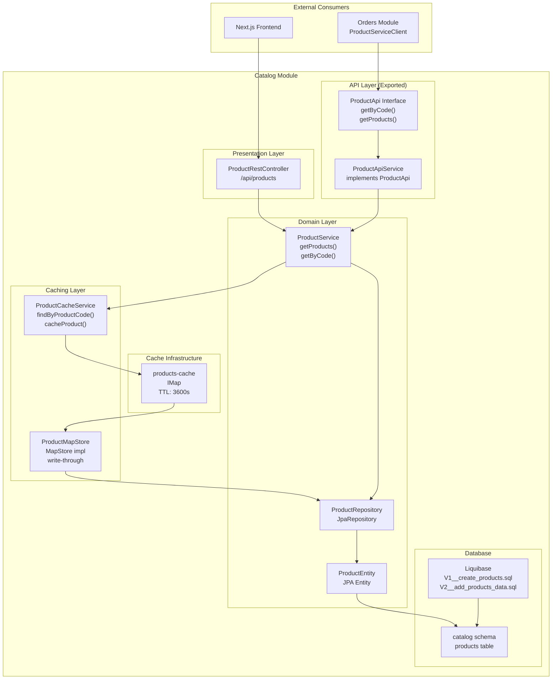
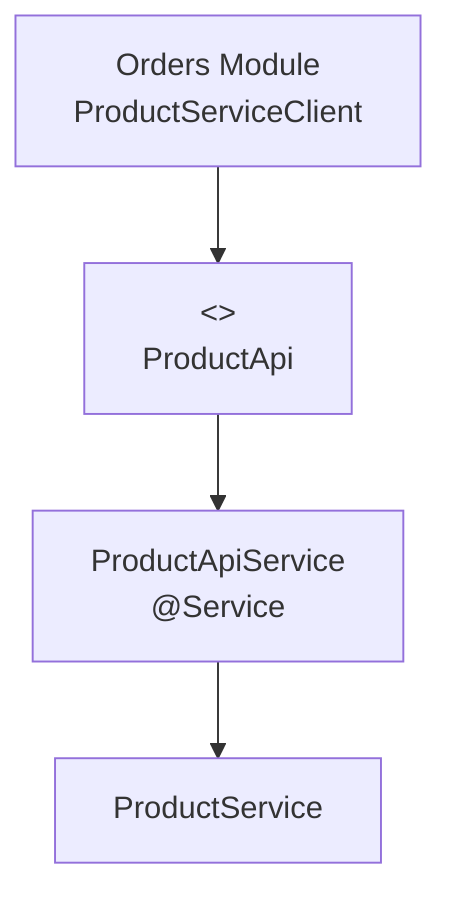
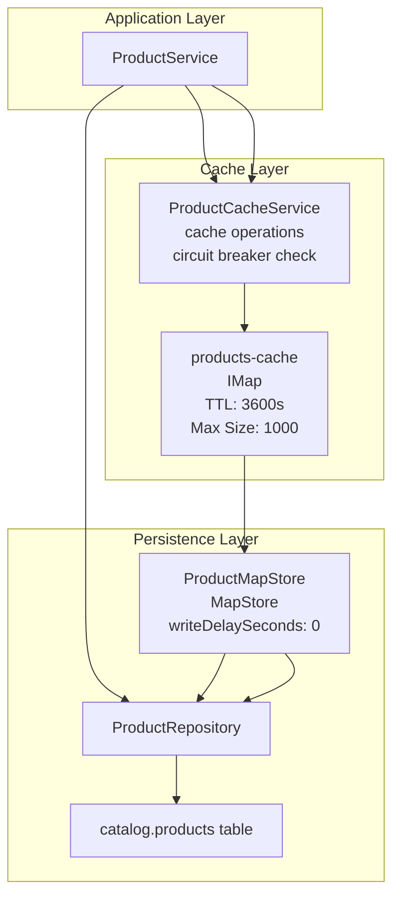
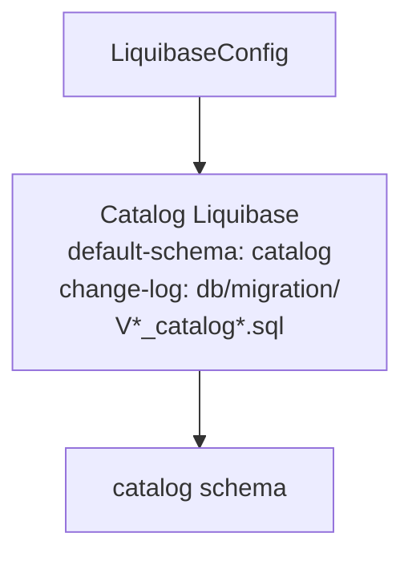
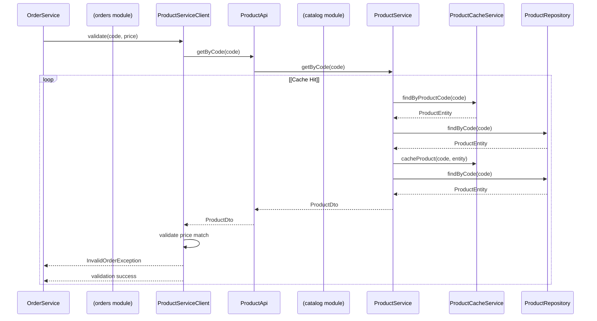

# Catalog Module

> **Relevant source files**
> * [.github/workflows/maven.yml](https://github.com/philipz/spring-modular-monolith/blob/30c9bf30/.github/workflows/maven.yml)
> * [.sdkmanrc](https://github.com/philipz/spring-modular-monolith/blob/30c9bf30/.sdkmanrc)
> * [README-API.md](https://github.com/philipz/spring-modular-monolith/blob/30c9bf30/README-API.md)
> * [README.md](https://github.com/philipz/spring-modular-monolith/blob/30c9bf30/README.md)
> * [docs/API_ANALYSIS_SUMMARY.txt](https://github.com/philipz/spring-modular-monolith/blob/30c9bf30/docs/API_ANALYSIS_SUMMARY.txt)
> * [docs/REST_API_ANALYSIS.md](https://github.com/philipz/spring-modular-monolith/blob/30c9bf30/docs/REST_API_ANALYSIS.md)
> * [docs/bookstore-microservices.png](https://github.com/philipz/spring-modular-monolith/blob/30c9bf30/docs/bookstore-microservices.png)
> * [docs/improvement.md](https://github.com/philipz/spring-modular-monolith/blob/30c9bf30/docs/improvement.md)
> * [docs/orders-data-ownership-analysis.md](https://github.com/philipz/spring-modular-monolith/blob/30c9bf30/docs/orders-data-ownership-analysis.md)
> * [docs/orders-module-boundary-analysis.md](https://github.com/philipz/spring-modular-monolith/blob/30c9bf30/docs/orders-module-boundary-analysis.md)
> * [docs/orders-traffic-migration.md](https://github.com/philipz/spring-modular-monolith/blob/30c9bf30/docs/orders-traffic-migration.md)
> * [http_requests.http](http_requests.http)
> * [k6.js](https://github.com/philipz/spring-modular-monolith/blob/30c9bf30/k6.js)
> * [renovate.json](https://github.com/philipz/spring-modular-monolith/blob/30c9bf30/renovate.json)
> * [src/main/java/com/sivalabs/bookstore/catalog/domain/ProductService.java](https://github.com/philipz/spring-modular-monolith/blob/30c9bf30/src/main/java/com/sivalabs/bookstore/catalog/domain/ProductService.java)
> * [src/main/java/com/sivalabs/bookstore/orders/domain/ProductServiceClient.java](https://github.com/philipz/spring-modular-monolith/blob/30c9bf30/src/main/java/com/sivalabs/bookstore/orders/domain/ProductServiceClient.java)

## Purpose and Scope

This document describes the **Catalog Module** within the Spring Modular Monolith, which manages the product catalogue domain. It covers the module's responsibilities, domain model, caching strategy, REST API surface, database schema management, and integration points with other modules.

For information about how the Orders module consumes product data, see [Orders Module](/philipz/spring-modular-monolith/8.2-orders-module). For cache infrastructure configuration, see [Cache Configuration and MapConfigs](/philipz/spring-modular-monolith/5.1-cache-configuration-and-mapconfigs). For REST API documentation, see [REST API Endpoints](/philipz/spring-modular-monolith/7.1-rest-api-endpoints).

---

## Module Overview

The Catalog module is a business domain module responsible for:

* **Product master data management**: Maintaining the product catalogue including codes, names, descriptions, images, and prices
* **Product queries**: Providing paginated product listings and individual product lookups
* **Price validation**: Exposing product information to other modules for order validation
* **Data isolation**: Owning the `catalog` database schema and managing its migrations
* **Distributed caching**: Implementing write-through and read-through caching with Hazelcast

**Module Location**: `src/main/java/com/sivalabs/bookstore/catalog/`

**Key Characteristics**:

* Exports `ProductApi` interface for cross-module consumption
* Maintains strict boundaries—no direct repository access from other modules
* Uses Liquibase for schema versioning
* Implements cache-aside pattern with circuit breaker protection

**Sources**: [README.md L10](https://github.com/philipz/spring-modular-monolith/blob/30c9bf30/README.md#L10-L10)

 [README.md L32](https://github.com/philipz/spring-modular-monolith/blob/30c9bf30/README.md#L32-L32)

---

## Module Structure



**Diagram: Catalog Module Internal Structure and External Integrations**

This diagram shows the layered architecture of the Catalog module, with the exported `ProductApi` interface serving as the boundary for cross-module communication. The REST controller handles external HTTP clients, while the domain layer coordinates between caching and persistence.

**Sources**: [README.md L10](https://github.com/philipz/spring-modular-monolith/blob/30c9bf30/README.md#L10-L10)

 [README.md L119-L128](https://github.com/philipz/spring-modular-monolith/blob/30c9bf30/README.md#L119-L128)

---

## Domain Model

### ProductEntity

The `ProductEntity` JPA entity represents a product in the catalogue. It maps to the `products` table in the `catalog` schema.

**Key Attributes**:

* `id` (Long): Primary key (auto-generated)
* `code` (String): Unique product code (e.g., "P100")
* `name` (String): Product name
* `description` (String): Product description
* `imageUrl` (String): Product image URL
* `price` (BigDecimal): Product price

**Entity Location**: `src/main/java/com/sivalabs/bookstore/catalog/domain/ProductEntity.java`

### ProductRepository

The repository interface extends Spring Data JPA's `JpaRepository` and provides database access methods.

**Key Methods**:

* `Optional<ProductEntity> findByCode(String code)`: Lookup product by unique code
* `Page<ProductEntity> findAll(Pageable pageable)`: Paginated product listing with sorting

**Repository Location**: `src/main/java/com/sivalabs/bookstore/catalog/domain/ProductRepository.java`

**Sources**: [src/main/java/com/sivalabs/bookstore/catalog/domain/ProductService.java L1-L90](https://github.com/philipz/spring-modular-monolith/blob/30c9bf30/src/main/java/com/sivalabs/bookstore/catalog/domain/ProductService.java#L1-L90)

---

## Exported API

### ProductApi Interface

The `ProductApi` interface is the module's public contract, exported for consumption by other modules (particularly Orders for price validation).



**Diagram: ProductApi Contract and Consumption**

**API Methods**:

* `Optional<ProductDto> getByCode(String code)`: Retrieve product by code, returning DTO
* `PagedResult<ProductDto> getProducts(int pageNo)`: Get paginated product list

**DTO Mapping**: `ProductApiService` translates `ProductEntity` to `ProductDto` to prevent domain model leakage.

**Consumer Example**: The Orders module validates product codes and prices during order creation:

[src/main/java/com/sivalabs/bookstore/orders/domain/ProductServiceClient.java L16-L23](https://github.com/philipz/spring-modular-monolith/blob/30c9bf30/src/main/java/com/sivalabs/bookstore/orders/domain/ProductServiceClient.java#L16-L23)

The `ProductServiceClient` in Orders calls `productApi.getByCode()` to ensure the product exists and the price matches before accepting an order.

**Sources**: [README.md L32](https://github.com/philipz/spring-modular-monolith/blob/30c9bf30/README.md#L32-L32)

 [src/main/java/com/sivalabs/bookstore/orders/domain/ProductServiceClient.java L1-L25](https://github.com/philipz/spring-modular-monolith/blob/30c9bf30/src/main/java/com/sivalabs/bookstore/orders/domain/ProductServiceClient.java#L1-L25)

---

## Caching Strategy

The Catalog module implements a **multi-tier caching strategy** with Hazelcast:

1. **Cache-aside on reads**: Check cache first, fall back to database on miss
2. **Write-through on writes**: MapStore synchronizes cache updates to database
3. **Circuit breaker protection**: Graceful degradation when cache is unavailable

### Cache Configuration



**Diagram: Catalog Caching Architecture with Cache-Aside and Write-Through Patterns**

**Cache Properties** (from `application.properties`):

* **TTL**: 3600 seconds (1 hour)
* **Max Size**: 1000 entries
* **Eviction Policy**: LRU (Least Recently Used)
* **Backup Count**: 1 (for resilience in Hazelcast cluster)
* **Write Delay**: 0 seconds (immediate write-through)

### ProductCacheService

The `ProductCacheService` abstracts Hazelcast operations and checks circuit breaker state before accessing the cache.

**Key Methods**:

* `Optional<ProductEntity> findByProductCode(String code)`: Retrieve from cache
* `void cacheProduct(String code, ProductEntity product)`: Store in cache
* `boolean isCircuitBreakerOpen()`: Check if cache is available

**Implementation Pattern** (from [src/main/java/com/sivalabs/bookstore/catalog/domain/ProductService.java L54-L89](https://github.com/philipz/spring-modular-monolith/blob/30c9bf30/src/main/java/com/sivalabs/bookstore/catalog/domain/ProductService.java#L54-L89)

):

1. Check if cache is available via `isCacheAvailable()` [line 40-42](https://github.com/philipz/spring-modular-monolith/blob/30c9bf30/line 40-42)
2. Try reading from cache [line 56-62](https://github.com/philipz/spring-modular-monolith/blob/30c9bf30/line 56-62)
3. On cache miss or unavailability, query database [line 75](https://github.com/philipz/spring-modular-monolith/blob/30c9bf30/line 75)
4. Cache the database result if found [line 78-86](https://github.com/philipz/spring-modular-monolith/blob/30c9bf30/line 78-86)
5. Handle exceptions gracefully without failing the read operation [line 64-69, 82-85](https://github.com/philipz/spring-modular-monolith/blob/30c9bf30/line 64-69, 82-85)

### ProductMapStore

The `ProductMapStore` implements Hazelcast's `MapStore<String, Object>` interface to provide:

* **Read-through**: Load from database when cache entry is missing
* **Write-through**: Persist cache writes immediately to database (writeDelaySeconds=0)

**MapStore Configuration**: Registered via `HazelcastProductCacheConfig` bean in the catalog module, which provides a `MapConfig` bean for the `products-cache` map.

**Sources**: [src/main/java/com/sivalabs/bookstore/catalog/domain/ProductService.java L1-L90](https://github.com/philipz/spring-modular-monolith/blob/30c9bf30/src/main/java/com/sivalabs/bookstore/catalog/domain/ProductService.java#L1-L90)

 [README.md L26](https://github.com/philipz/spring-modular-monolith/blob/30c9bf30/README.md#L26-L26)

 High-level Diagram 3

---

## REST Endpoints

The `ProductRestController` exposes the catalog API under `/api/products`.

### Endpoints

| Method | Path | Description | Response Type |
| --- | --- | --- | --- |
| `GET` | `/api/products` | Paginated product list | `PagedResult<ProductDto>` |
| `GET` | `/api/products/{code}` | Single product by code | `ProductDto` |

### Request/Response Examples

**Get Products (paginated)**:

```yaml
GET /api/products?page=1
Accept: application/json
```

Response structure:

```json
{
  "data": [
    {
      "code": "P100",
      "name": "The Hunger Games",
      "description": "Winning will make you famous...",
      "imageUrl": "https://images.sivalabs.in/products/the-hunger-games.jpg",
      "price": 34.0
    }
  ],
  "totalElements": 100,
  "pageNumber": 1,
  "totalPages": 10,
  "isFirst": true,
  "isLast": false,
  "hasNext": true,
  "hasPrevious": false
}
```

**Get Product by Code**:

```yaml
GET /api/products/P100
Accept: application/json
```

Response: Single `ProductDto` object with 200 status, or 404 if not found.

**Controller Location**: `src/main/java/com/sivalabs/bookstore/catalog/web/ProductRestController.java`

**Pagination Default**: 10 items per page (defined by `PRODUCT_PAGE_SIZE` in [src/main/java/com/sivalabs/bookstore/catalog/domain/ProductService.java L20](https://github.com/philipz/spring-modular-monolith/blob/30c9bf30/src/main/java/com/sivalabs/bookstore/catalog/domain/ProductService.java#L20-L20)

)

**Sources**: [README-API.md L18-L51](https://github.com/philipz/spring-modular-monolith/blob/30c9bf30/README-API.md#L18-L51)

 [docs/REST_API_ANALYSIS.md L20-L25](https://github.com/philipz/spring-modular-monolith/blob/30c9bf30/docs/REST_API_ANALYSIS.md#L20-L25)

---

## Database Schema

### Catalog Schema

The Catalog module owns the `catalog` database schema within the shared PostgreSQL instance.

**Schema Name**: `catalog`

**Tables**:

* `products`: Product master data

**Schema Structure**:

| Column | Type | Constraints | Description |
| --- | --- | --- | --- |
| `id` | `bigserial` | PRIMARY KEY | Auto-incrementing ID |
| `code` | `varchar(100)` | NOT NULL, UNIQUE | Product code (e.g., P100) |
| `name` | `varchar(500)` | NOT NULL | Product name |
| `description` | `text` |  | Product description |
| `image_url` | `varchar(1000)` |  | Product image URL |
| `price` | `numeric(10,2)` | NOT NULL | Product price |

### Liquibase Migrations

The Catalog module manages its schema independently using Liquibase changesets.

**Migration Files**:

* `V1__catalog_create_products_table.sql`: Creates `products` table
* `V2__catalog_add_products_data.sql`: Seeds initial product data

**Migration Location**: `src/main/resources/db/migration/`

**Liquibase Configuration**: The `LiquibaseConfig` class configures separate Liquibase instances per module, each targeting its own schema:



**Diagram: Catalog Schema Management with Liquibase**

**Apply Migrations Locally**:

```sql
./mvnw liquibase:update
```

This applies all pending changesets to the configured datasource.

**Sources**: [README.md L136-L139](https://github.com/philipz/spring-modular-monolith/blob/30c9bf30/README.md#L136-L139)

 [README.md L130](https://github.com/philipz/spring-modular-monolith/blob/30c9bf30/README.md#L130-L130)

---

## Integration Points

### Cross-Module API Consumption

The Orders module is the primary consumer of Catalog's exported API:



**Diagram: Order Price Validation Flow Using Catalog API**

**Integration Flow**:

1. `OrderService` calls `ProductServiceClient.validate()` during order creation
2. `ProductServiceClient` consumes `ProductApi.getByCode()`
3. Catalog returns a `ProductDto` (never the JPA entity)
4. Client validates that the order's price matches the current product price
5. Throws `InvalidOrderException` if mismatch detected

**Why DTO Boundary Matters**: Returning DTOs instead of entities prevents the Orders module from depending on Catalog's internal domain model. This allows independent evolution of the `ProductEntity` schema without breaking the Orders module.

**Sources**: [src/main/java/com/sivalabs/bookstore/orders/domain/ProductServiceClient.java L1-L25](https://github.com/philipz/spring-modular-monolith/blob/30c9bf30/src/main/java/com/sivalabs/bookstore/orders/domain/ProductServiceClient.java#L1-L25)

 [README.md L32](https://github.com/philipz/spring-modular-monolith/blob/30c9bf30/README.md#L32-L32)

### External API Clients

The Next.js frontend consumes Catalog's REST endpoints:

**Frontend API Client**: `frontend-next/apps/web/lib/api/client.ts`

**Example Usage**:

* Product listing page calls `GET /api/products?page=N`
* Product detail page calls `GET /api/products/{code}`

**TypeScript SDK**: Generated from OpenAPI spec via `pnpm gen:types`, located in `frontend-sdk/`

**Sources**: [README-API.md L1-L51](https://github.com/philipz/spring-modular-monolith/blob/30c9bf30/README-API.md#L1-L51)

 [README.md L20](https://github.com/philipz/spring-modular-monolith/blob/30c9bf30/README.md#L20-L20)

---

## Configuration Reference

### Application Properties

Catalog-specific properties from `application.properties`:

**Cache Settings** (via `bookstore.cache.*`):

```
bookstore.cache.products.ttl-seconds=3600
bookstore.cache.products.max-size=1000
bookstore.cache.products.eviction-policy=LRU
bookstore.cache.products.backup-count=1
bookstore.cache.products.write-delay-seconds=0
```

**Database Connection**:

```
spring.datasource.url=jdbc:postgresql://localhost:5432/postgres
spring.datasource.username=${DB_USER:postgres}
spring.datasource.password=${DB_PASSWORD:postgres}
```

**Liquibase Configuration**:

```
spring.liquibase.enabled=true
spring.liquibase.change-log=classpath:db/migration/
spring.liquibase.default-schema=catalog
```

### Hazelcast Configuration

The Catalog module contributes its `MapConfig` via `HazelcastProductCacheConfig`:

**Bean Registration**: The config class creates a `@Bean` of type `MapConfig` for `products-cache`, which is automatically discovered and registered by `HazelcastConfig` using `ObjectProvider<MapConfig>`.

**Key Configuration**:

* Map name: `products-cache`
* MapStore: `ProductMapStore` (Spring-managed, injected via `SpringAwareMapStoreConfig`)
* Write-delay: 0 seconds (write-through)
* Eviction policy: LRU
* TTL: 3600 seconds

**Circuit Breaker**: Configured via `bookstore.cache.circuit-breaker.*` properties:

```
bookstore.cache.circuit-breaker.failure-threshold=5
bookstore.cache.circuit-breaker.recovery-timeout-seconds=30
```

**Sources**: [README.md L26](https://github.com/philipz/spring-modular-monolith/blob/30c9bf30/README.md#L26-L26)

 High-level Diagram 3

---

## Testing

### Unit Tests

**Test Location**: `src/test/java/com/sivalabs/bookstore/catalog/`

**Key Test Classes**:

* `ProductServiceTest`: Tests service layer with mocked repository and cache
* `ProductCacheServiceTest`: Tests cache operations and circuit breaker logic
* `ProductMapStoreTest`: Tests write-through and read-through behavior

### Integration Tests

**Spring Modulith Test Support**: Use `@ApplicationModuleTest` to test the Catalog module in isolation:

```python
@ApplicationModuleTest(mode = BootstrapMode.STANDALONE)
class CatalogModuleTests {
    // Tests run with only catalog module dependencies loaded
}
```

**Testcontainers**: Integration tests use Testcontainers to spin up PostgreSQL and Hazelcast instances.

**Sources**: [README.md L116](https://github.com/philipz/spring-modular-monolith/blob/30c9bf30/README.md#L116-L116)

 [README.md L111-L117](https://github.com/philipz/spring-modular-monolith/blob/30c9bf30/README.md#L111-L117)

---

## Modularity Verification

The Catalog module's boundaries are enforced by Spring Modulith's `ModularityTests`:

**Test Location**: `src/test/java/com/sivalabs/bookstore/ModularityTests.java`

**Verification**:

* `ApplicationModules.verify()` ensures no unauthorized dependencies
* Catalog can only be accessed via exported `ProductApi` interface
* Internal classes (`ProductEntity`, `ProductRepository`, `ProductService`) are not accessible to other modules

**Violations Would Fail Build**: If another module directly imported `ProductEntity` or `ProductRepository`, the `ModularityTests` would fail, preventing the violation from merging.

**Sources**: [README.md L36](https://github.com/philipz/spring-modular-monolith/blob/30c9bf30/README.md#L36-L36)

 [docs/orders-module-boundary-analysis.md L9-L14](https://github.com/philipz/spring-modular-monolith/blob/30c9bf30/docs/orders-module-boundary-analysis.md#L9-L14)

---

## Summary

The Catalog module demonstrates a well-bounded domain module with:

* **Clear API contract**: `ProductApi` interface as the only cross-module boundary
* **Data ownership**: Exclusive control over `catalog` schema and migrations
* **Caching resilience**: Multi-tier caching with circuit breaker protection and graceful degradation
* **REST exposure**: HTTP API for external clients (frontend, mobile apps)
* **Independent evolution**: DTO boundaries prevent coupling to internal domain model

This design supports the modular monolith's goal of preparing for potential microservice extraction while maintaining operational simplicity.

**Sources**: [README.md L7-L15](https://github.com/philipz/spring-modular-monolith/blob/30c9bf30/README.md#L7-L15)

 [README.md L30-L36](https://github.com/philipz/spring-modular-monolith/blob/30c9bf30/README.md#L30-L36)