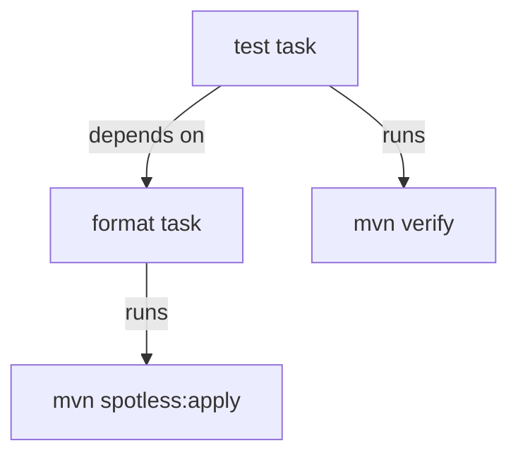
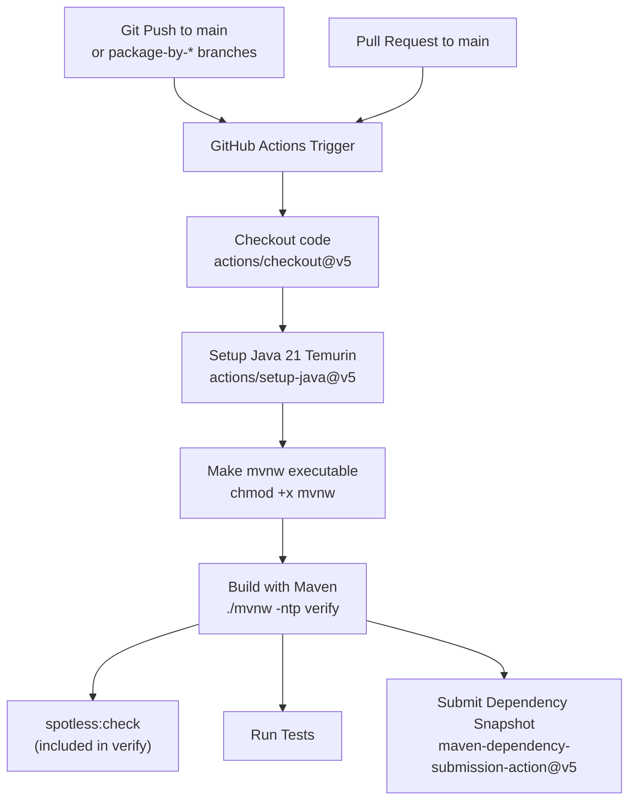
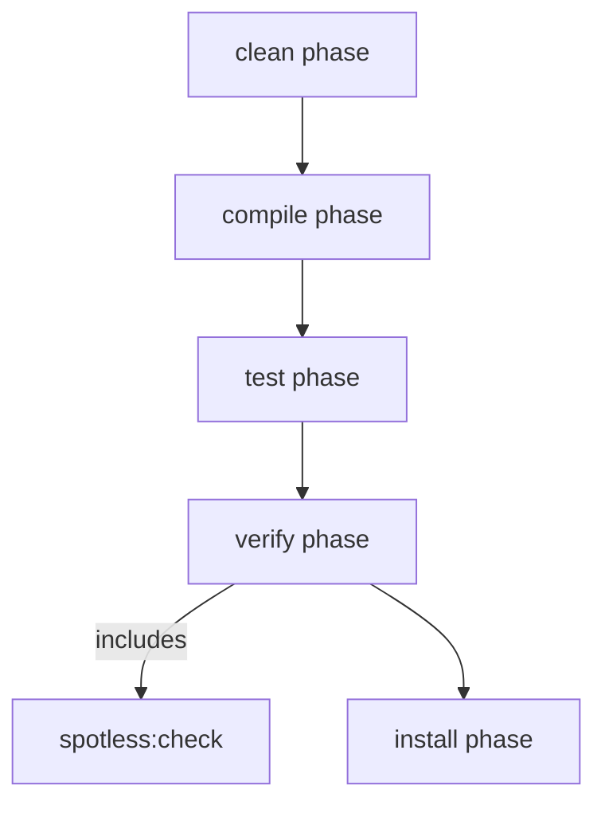
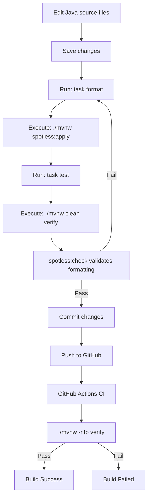

# Code Quality and Formatting

> **Relevant source files**
> * [.github/workflows/maven.yml](https://github.com/philipz/spring-modular-monolith/blob/30c9bf30/.github/workflows/maven.yml)
> * [.sdkmanrc](https://github.com/philipz/spring-modular-monolith/blob/30c9bf30/.sdkmanrc)
> * [Taskfile.yml](https://github.com/philipz/spring-modular-monolith/blob/30c9bf30/Taskfile.yml)
> * [renovate.json](https://github.com/philipz/spring-modular-monolith/blob/30c9bf30/renovate.json)
> * [src/main/java/com/sivalabs/bookstore/catalog/domain/ProductService.java](https://github.com/philipz/spring-modular-monolith/blob/30c9bf30/src/main/java/com/sivalabs/bookstore/catalog/domain/ProductService.java)

This document describes the code quality enforcement mechanisms in the Spring Modular Monolith codebase, focusing on automated code formatting using Spotless with Palantir Java Format. It covers how to run formatting locally, how formatting is integrated into the build pipeline, and how CI validates code quality.

For information about testing strategies and quality assurance through tests, see [Integration Testing Strategies](/philipz/spring-modular-monolith/11.3-integration-testing-strategies). For build and test execution details, see [Building and Testing](/philipz/spring-modular-monolith/11.1-building-and-testing).

---

## Overview

The codebase enforces consistent code formatting automatically using Maven Spotless plugin with Palantir Java Format. Code formatting is integrated into the development workflow at multiple levels: local development tasks, Maven build lifecycle, and continuous integration checks.

**Sources:** [Taskfile.yml L18-L20](https://github.com/philipz/spring-modular-monolith/blob/30c9bf30/Taskfile.yml#L18-L20)

 [.github/workflows/maven.yml L43-L44](https://github.com/philipz/spring-modular-monolith/blob/30c9bf30/.github/workflows/maven.yml#L43-L44)

---

## Code Formatting Tool: Spotless

The project uses the **Spotless Maven Plugin** configured with **Palantir Java Format** as the code formatter. Spotless provides automated code formatting that can both check for violations and automatically fix formatting issues.

### Key Characteristics

| Aspect | Details |
| --- | --- |
| **Formatter** | Palantir Java Format |
| **Plugin** | maven-spotless-plugin |
| **Enforcement** | Both local and CI |
| **Auto-fix** | Yes, via `spotless:apply` |
| **Check** | Yes, via `spotless:check` (runs during `verify`) |

The Palantir Java Format is a variant of Google Java Format that provides deterministic, automated formatting with minimal configuration. It eliminates style debates by enforcing a consistent code style across the entire codebase.

**Sources:** [Taskfile.yml L18-L20](https://github.com/philipz/spring-modular-monolith/blob/30c9bf30/Taskfile.yml#L18-L20)

---

## Running Code Formatting

### Using Taskfile

The primary method for running code formatting during development is through the Taskfile task runner:

```
task format
```

This executes the Maven wrapper command `./mvnw spotless:apply`, which automatically formats all Java source files in place according to the Palantir Java Format rules.

**Sources:** [Taskfile.yml L18-L20](https://github.com/philipz/spring-modular-monolith/blob/30c9bf30/Taskfile.yml#L18-L20)

### Direct Maven Commands

Alternatively, formatting can be executed directly using Maven:

```markdown
# Apply formatting (fixes issues)
./mvnw spotless:apply

# Check formatting without modifying files
./mvnw spotless:check
```

The `spotless:apply` goal modifies files in place, while `spotless:check` only reports violations without making changes.

**Sources:** [Taskfile.yml L5](https://github.com/philipz/spring-modular-monolith/blob/30c9bf30/Taskfile.yml#L5-L5)

### Task Dependency Chain

The `format` task is automatically executed as a dependency of the `test` task:



**Diagram: Task Dependency Chain in Taskfile**

This ensures that code is automatically formatted before tests run, maintaining consistency in the development workflow.

**Sources:** [Taskfile.yml L13-L16](https://github.com/philipz/spring-modular-monolith/blob/30c9bf30/Taskfile.yml#L13-L16)

 [Taskfile.yml L18-L20](https://github.com/philipz/spring-modular-monolith/blob/30c9bf30/Taskfile.yml#L18-L20)

---

## CI Enforcement in GitHub Actions

Code formatting is enforced in continuous integration through the GitHub Actions workflow defined in `.github/workflows/maven.yml`.

### Maven Build Workflow



**Diagram: GitHub Actions CI Pipeline with Formatting Check**

The workflow executes `./mvnw -ntp verify`, which includes the `spotless:check` goal. If formatting violations are detected, the build fails, preventing unformatted code from being merged.

**Sources:** [.github/workflows/maven.yml L1-L48](https://github.com/philipz/spring-modular-monolith/blob/30c9bf30/.github/workflows/maven.yml#L1-L48)

### Workflow Triggers

The Maven build workflow is triggered on:

| Event Type | Conditions |
| --- | --- |
| **Push** | Branches: `main`, `package-by-*` |
| **Pull Request** | Target branch: `main` |
| **Path Filters** | Ignores: `.gitignore`, `.sdkmanrc`, `README.md`, `LICENSE`, `Taskfile.yml`, `renovate.json`, `k8s/**` |
| **Path Includes** | On PR: `pom.xml`, `**/pom.xml`, `src/**`, `.github/workflows/maven.yml` |

Path filters prevent unnecessary CI runs when non-code files are changed, while ensuring that any Java source changes trigger the full build including formatting checks.

**Sources:** [.github/workflows/maven.yml L3-L23](https://github.com/philipz/spring-modular-monolith/blob/30c9bf30/.github/workflows/maven.yml#L3-L23)

### Java Version Consistency

The CI environment uses Java 21 with the Temurin distribution, matching the development environment specification:

```yaml
- name: Setup Java
  uses: actions/setup-java@v5
  with:
    java-version: 21
    distribution: 'temurin'
    cache: 'maven'
```

This ensures that formatting behavior is consistent between local development and CI environments.

**Sources:** [.github/workflows/maven.yml L34-L38](https://github.com/philipz/spring-modular-monolith/blob/30c9bf30/.github/workflows/maven.yml#L34-L38)

 [.sdkmanrc L1](https://github.com/philipz/spring-modular-monolith/blob/30c9bf30/.sdkmanrc#L1-L1)

---

## Build Integration

### Maven Lifecycle Integration

The Spotless plugin is integrated into the Maven build lifecycle, automatically checking formatting during the `verify` phase:



**Diagram: Spotless Integration in Maven Lifecycle**

When running `./mvnw verify` or `./mvnw test`, the formatting check is automatically executed. If violations are found, the build fails with clear error messages indicating which files need formatting.

**Sources:** [.github/workflows/maven.yml L44](https://github.com/philipz/spring-modular-monolith/blob/30c9bf30/.github/workflows/maven.yml#L44-L44)

 [Taskfile.yml L16](https://github.com/philipz/spring-modular-monolith/blob/30c9bf30/Taskfile.yml#L16-L16)

### Maven Wrapper Configuration

The project uses the Maven Wrapper to ensure consistent Maven version across environments:

```
MVNW: '{{if eq .GOOS "windows"}}mvnw.cmd{{else}}./mvnw{{end}}'
```

The wrapper is made executable in CI and used consistently in all build tasks, ensuring that the correct Maven version (3.9.11) is used.

**Sources:** [Taskfile.yml L5](https://github.com/philipz/spring-modular-monolith/blob/30c9bf30/Taskfile.yml#L5-L5)

 [.sdkmanrc L2](https://github.com/philipz/spring-modular-monolith/blob/30c9bf30/.sdkmanrc#L2-L2)

 [.github/workflows/maven.yml L40-L41](https://github.com/philipz/spring-modular-monolith/blob/30c9bf30/.github/workflows/maven.yml#L40-L41)

---

## Development Workflow

### Recommended Pre-commit Flow

The typical developer workflow for maintaining code quality is:



**Diagram: Developer Workflow with Formatting Integration**

**Sources:** [Taskfile.yml L13-L20](https://github.com/philipz/spring-modular-monolith/blob/30c9bf30/Taskfile.yml#L13-L20)

 [.github/workflows/maven.yml L43-L44](https://github.com/philipz/spring-modular-monolith/blob/30c9bf30/.github/workflows/maven.yml#L43-L44)

### Taskfile Command Reference

| Command | Maven Command | Purpose |
| --- | --- | --- |
| `task format` | `./mvnw spotless:apply` | Apply formatting to all Java files |
| `task test` | `./mvnw clean verify` | Format code (via dependency), then run tests |
| `task build_image` | `./mvnw clean protobuf:compile package spring-boot:build-image -DskipTests` | Build without formatting check (skips tests) |

The `test` task automatically runs `format` first through task dependencies, ensuring that code is formatted before verification.

**Sources:** [Taskfile.yml L13-L24](https://github.com/philipz/spring-modular-monolith/blob/30c9bf30/Taskfile.yml#L13-L24)

---

## Formatting in Action: Code Examples

### Example Formatted Code

The codebase demonstrates consistent formatting throughout. For example, the `ProductService` class shows typical formatting patterns:

* Consistent indentation (4 spaces)
* Method parameter alignment
* Javadoc formatting with proper line breaks
* Import organization
* Brace placement (opening braces on same line)

[src/main/java/com/sivalabs/bookstore/catalog/domain/ProductService.java L35-L42](https://github.com/philipz/spring-modular-monolith/blob/30c9bf30/src/main/java/com/sivalabs/bookstore/catalog/domain/ProductService.java#L35-L42)

 demonstrates formatted Javadoc:

```java
/**
 * Check if cache service is available and operational.
 *
 * @return true if cache service is available, false otherwise
 */
private boolean isCacheAvailable() {
    return productCacheService != null && !productCacheService.isCircuitBreakerOpen();
}
```

**Sources:** [src/main/java/com/sivalabs/bookstore/catalog/domain/ProductService.java L1-L91](https://github.com/philipz/spring-modular-monolith/blob/30c9bf30/src/main/java/com/sivalabs/bookstore/catalog/domain/ProductService.java#L1-L91)

---

## Dependency Management and Updates

### Renovate Bot Configuration

The project uses Renovate Bot for automated dependency updates, configured in `renovate.json`:

```json
{
    "$schema": "https://docs.renovatebot.com/renovate-schema.json",
    "extends": [
        "config:recommended"
    ]
}
```

Renovate automatically creates pull requests for dependency updates, which then go through the CI pipeline including formatting checks. This ensures that any generated code or configuration changes from dependency updates maintain code quality standards.

**Sources:** [renovate.json L1-L7](https://github.com/philipz/spring-modular-monolith/blob/30c9bf30/renovate.json#L1-L7)

### SDK Version Management

Development environment versions are managed through SDK Manager (`.sdkmanrc`):

```
java=24.0.1-tem
maven=3.9.11
```

Note: While the `.sdkmanrc` specifies Java 24, the CI and production builds use Java 21 as defined in GitHub Actions and documented elsewhere. Developers should align their local environment with the CI specification.

**Sources:** [.sdkmanrc L1-L3](https://github.com/philipz/spring-modular-monolith/blob/30c9bf30/.sdkmanrc#L1-L3)

 [.github/workflows/maven.yml L36](https://github.com/philipz/spring-modular-monolith/blob/30c9bf30/.github/workflows/maven.yml#L36-L36)

---

## Summary

The code quality and formatting infrastructure in the Spring Modular Monolith ensures consistent code style through:

1. **Automated Formatting**: Spotless with Palantir Java Format provides deterministic formatting
2. **Local Integration**: Taskfile tasks make formatting easy (`task format`)
3. **Build Integration**: Maven lifecycle includes formatting checks in `verify` phase
4. **CI Enforcement**: GitHub Actions fails builds on formatting violations
5. **Developer Experience**: Pre-commit formatting via task dependencies prevents CI failures

The multi-layer approach ensures that code formatting is maintained consistently from local development through to production deployments.

**Sources:** [Taskfile.yml L1-L64](https://github.com/philipz/spring-modular-monolith/blob/30c9bf30/Taskfile.yml#L1-L64)

 [.github/workflows/maven.yml L1-L48](https://github.com/philipz/spring-modular-monolith/blob/30c9bf30/.github/workflows/maven.yml#L1-L48)

 [renovate.json L1-L7](https://github.com/philipz/spring-modular-monolith/blob/30c9bf30/renovate.json#L1-L7)

 [.sdkmanrc L1-L3](https://github.com/philipz/spring-modular-monolith/blob/30c9bf30/.sdkmanrc#L1-L3)