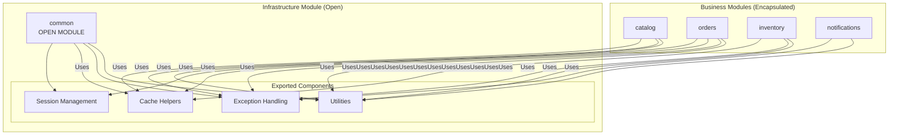
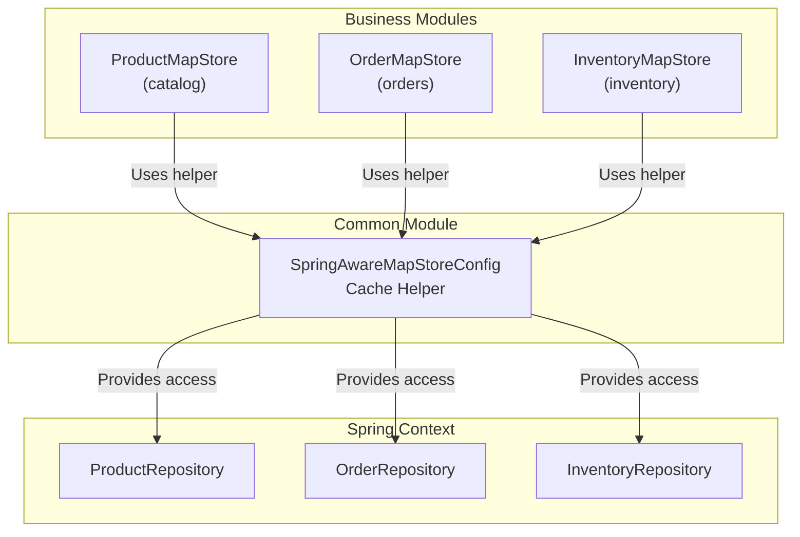
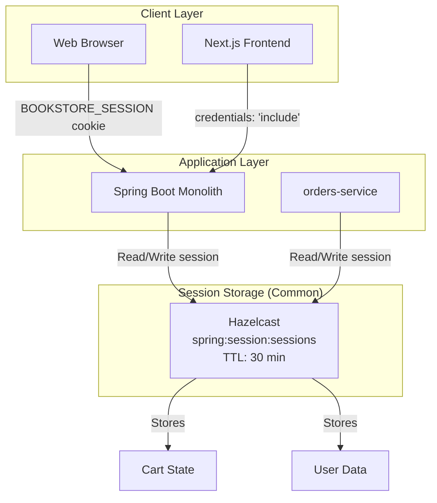
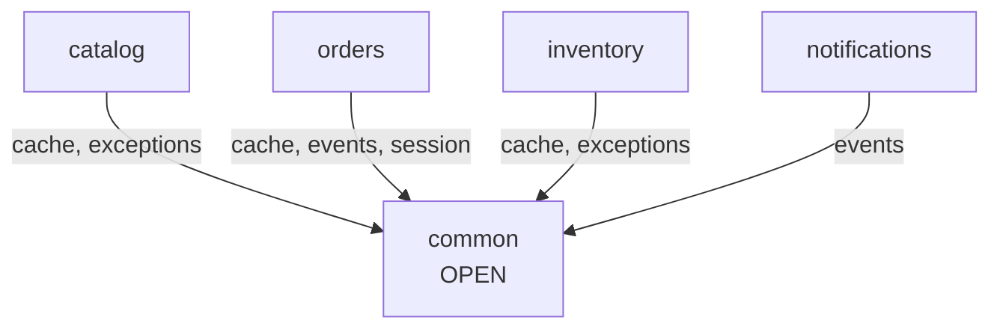

# Common Module

> **Relevant source files**
> * [README-API.md](https://github.com/philipz/spring-modular-monolith/blob/30c9bf30/README-API.md)
> * [README.md](https://github.com/philipz/spring-modular-monolith/blob/30c9bf30/README.md)
> * [docs/API_ANALYSIS_SUMMARY.txt](https://github.com/philipz/spring-modular-monolith/blob/30c9bf30/docs/API_ANALYSIS_SUMMARY.txt)
> * [docs/REST_API_ANALYSIS.md](https://github.com/philipz/spring-modular-monolith/blob/30c9bf30/docs/REST_API_ANALYSIS.md)
> * [docs/bookstore-microservices.png](https://github.com/philipz/spring-modular-monolith/blob/30c9bf30/docs/bookstore-microservices.png)
> * [docs/improvement.md](https://github.com/philipz/spring-modular-monolith/blob/30c9bf30/docs/improvement.md)
> * [docs/orders-data-ownership-analysis.md](https://github.com/philipz/spring-modular-monolith/blob/30c9bf30/docs/orders-data-ownership-analysis.md)
> * [docs/orders-module-boundary-analysis.md](https://github.com/philipz/spring-modular-monolith/blob/30c9bf30/docs/orders-module-boundary-analysis.md)
> * [docs/orders-traffic-migration.md](https://github.com/philipz/spring-modular-monolith/blob/30c9bf30/docs/orders-traffic-migration.md)
> * [k6.js](https://github.com/philipz/spring-modular-monolith/blob/30c9bf30/k6.js)

## Purpose and Scope

The `common` module serves as the foundation layer for the Spring Modular Monolith, providing shared utilities, exception handling, cache infrastructure, and Hazelcast session management accessible to all business modules. Unlike other modules with strict encapsulation, `common` is explicitly designated as an **OPEN module** in the Spring Modulith architecture, meaning all modules are permitted to access its exported components.

This document covers the common module's internal structure, exported components, and integration patterns. For information about specific business modules that consume common utilities, see:

* Catalog Module ([8.1](/philipz/spring-modular-monolith/8.1-catalog-module))
* Orders Module ([8.2](/philipz/spring-modular-monolith/8.2-orders-module))
* Inventory Module ([8.3](/philipz/spring-modular-monolith/8.3-inventory-module))
* Notifications Module ([8.4](/philipz/spring-modular-monolith/8.4-notifications-module))

For infrastructure configuration that works alongside common, see Config Module ([8.5](/philipz/spring-modular-monolith/8.5-config-module)).

**Sources:** README.md:9-16, docs/orders-module-boundary-analysis.md:12-15

---

## Module Design Philosophy

### Open Module Pattern

The common module follows the **Open Module** pattern, explicitly breaking Spring Modulith's default encapsulation rules to provide shared infrastructure. This design decision is intentional and documented in the architecture.



**Design Constraints:**

| Constraint | Rationale |
| --- | --- |
| **No business logic** | Common contains only technical infrastructure, never domain logic |
| **Stateless utilities** | All helpers are stateless or Spring-managed singletons |
| **Minimal dependencies** | Common depends only on framework libraries, not other business modules |
| **Stable contracts** | Changes to common APIs require careful coordination across all modules |

**Sources:** README.md:9-10, README.md:34-35, docs/orders-module-boundary-analysis.md:12-15

---

## Core Components

### Utilities

The common module provides general-purpose utilities used throughout the application. These include:

* **Cart utilities** - Helper methods for cart operations in session storage
* **Validation helpers** - Common validation logic
* **Data conversion utilities** - Formatters, converters

**Module Path:** `src/main/java/com/sivalabs/bookstore/common/`

**Sources:** README.md:9, docs/REST_API_ANALYSIS.md:66-70

---

### Exception Handling

Common provides a standardized exception handling framework used by all REST and gRPC endpoints.

#### ErrorResponse Format

All API errors are returned in a consistent format:

```json
{
  "status": 400,
  "message": "Validation failed: Product code is required",
  "timestamp": "2025-01-15T10:30:00Z"
}
```

#### Exception Handler Pattern

Business modules implement module-specific exception handlers that extend or use common's base patterns:

* `CatalogExceptionHandler` - Catalog module errors
* `OrdersRestExceptionHandler` - Orders module REST errors

These handlers translate domain exceptions into the standard `ErrorResponse` format.

**HTTP Status Code Mapping:**

| Exception Type | HTTP Status | Description |
| --- | --- | --- |
| Validation errors | 400 Bad Request | Bean validation failures |
| Resource not found | 404 Not Found | Product/Order doesn't exist |
| Business rule violations | 400 Bad Request | Cart empty, insufficient inventory |
| Integration errors | 503 Service Unavailable | gRPC connectivity issues |

**Sources:** README-API.md:151-155, docs/REST_API_ANALYSIS.md:44-45, docs/API_ANALYSIS_SUMMARY.txt:63-66

---

### Cache Helpers

The common module provides critical infrastructure for integrating Hazelcast MapStore implementations with Spring dependency injection.

#### SpringAwareMapStoreConfig

The `SpringAwareMapStoreConfig` utility enables MapStore instances to access Spring-managed beans (repositories, services) by bridging Hazelcast's factory pattern with Spring's ApplicationContext.



#### MapStore Write-Through Pattern

Each business module uses common's cache helpers to implement write-through caching:

| Module | MapStore Implementation | Repository Access |
| --- | --- | --- |
| `catalog` | `ProductMapStore` | `ProductRepository` via helper |
| `orders` | `OrderMapStore` | `OrderRepository` via helper |
| `inventory` | `InventoryMapStore` | `InventoryRepository` via helper |

**Write-Through Configuration:**

* `writeDelaySeconds=0` - Immediate database synchronization
* `writeCoalescing=false` - Every write triggers a database operation
* Cache-aside on reads via `load()` and `loadAll()` methods

**Sources:** docs/orders-module-boundary-analysis.md:12-15, docs/orders-data-ownership-analysis.md:18-20

---

### Hazelcast Session Integration

Common provides the foundation for distributed HTTP session management using Hazelcast as the session store.

#### Session Architecture



#### Session Cookie Configuration

The session cookie is configured through `application.properties` with the following attributes:

| Property | Value | Purpose |
| --- | --- | --- |
| `server.servlet.session.cookie.name` | `BOOKSTORE_SESSION` | Cookie identifier |
| `server.servlet.session.cookie.http-only` | `true` | Prevents JavaScript access |
| `server.servlet.session.cookie.same-site` | `Strict` | CSRF protection |
| `server.servlet.session.timeout` | `30m` | Session expiration |
| `spring.session.store-type` | `hazelcast` | Storage backend |

#### Cart Session Management

The shopping cart is stored entirely in the HTTP session, managed by Hazelcast:

1. **Add to cart:** Creates session if none exists, returns `Set-Cookie` header
2. **Subsequent requests:** Client includes `BOOKSTORE_SESSION` cookie
3. **Cart state:** Synchronized across all application instances via Hazelcast cluster
4. **Session expiry:** Cart data automatically cleared after 30 minutes of inactivity

**Frontend Integration:**

```yaml
// Next.js/browser must include credentials
fetch('/api/cart', {
  credentials: 'include'  // Required for session cookie
})
```

**Sources:** README.md:22-23, README-API.md:11-14, docs/REST_API_ANALYSIS.md:48-57, docs/API_ANALYSIS_SUMMARY.txt:35-41

---

## Module Location and Structure

```markdown
src/main/java/com/sivalabs/bookstore/
├── common/                    # Common module root
│   ├── cache/                # Cache helper utilities
│   │   └── SpringAwareMapStoreConfig.java
│   ├── events/               # Event handling utilities
│   ├── exceptions/           # Exception handling framework
│   │   └── ErrorResponse.java
│   ├── session/              # Hazelcast session integration
│   └── util/                 # General utilities
│       └── CartUtil.java
```

**Sources:** README.md:122-129

---

## Module Dependencies

### Inbound Dependencies (Who Uses Common)

All business modules depend on common for shared infrastructure:



### Outbound Dependencies (What Common Uses)

Common has minimal external dependencies, relying only on framework libraries:

| Dependency | Purpose | Scope |
| --- | --- | --- |
| Spring Framework | Dependency injection, session management | Core |
| Hazelcast | Session storage, cache infrastructure | Core |
| Jakarta Validation | Bean validation annotations | Optional |

**Important:** Common must NOT depend on any business modules (catalog, orders, inventory, notifications) to avoid circular dependencies.

**Sources:** docs/orders-module-boundary-analysis.md:9-15

---

## Integration Patterns

### Using Cache Helpers in MapStore

Business modules use common's `SpringAwareMapStoreConfig` to implement MapStore:

**Example from orders module:**

```python
// src/main/java/com/sivalabs/bookstore/orders/config/HazelcastOrderCacheConfig.java
@Configuration
public class HazelcastOrderCacheConfig {
    @Bean
    public MapConfig ordersMapConfig(
            CacheProperties cacheProperties,
            SpringAwareMapStoreConfig<String, Order> orderMapStoreConfig) {
        
        return new MapConfig("orders-cache")
            .setMapStoreConfig(new MapStoreConfig()
                .setEnabled(true)
                .setWriteDelaySeconds(0)  // Write-through
                .setFactoryImplementation(orderMapStoreConfig))
            .setTimeToLiveSeconds(cacheProperties.timeToLiveSeconds())
            .setBackupCount(cacheProperties.backupCount());
    }
}
```

The `orderMapStoreConfig` bean is provided by common and wired with Spring ApplicationContext.

**Sources:** docs/orders-data-ownership-analysis.md:18-20, docs/orders-module-boundary-analysis.md:12-15

---

### Using Session Management

Cart operations in the orders module rely on session storage provided by common:

**Cart workflow:**

1. Client makes first request to `/api/cart`
2. Spring Session creates session in Hazelcast via common's integration
3. Server returns `BOOKSTORE_SESSION` cookie
4. Cart state stored under session key in Hazelcast
5. All subsequent requests with cookie access same session/cart

**Session access in code:**

```
// Orders module uses HttpSession (backed by Hazelcast via common)
@GetMapping("/api/cart")
public CartDto getCart(HttpSession session) {
    Cart cart = CartUtil.getCart(session);  // Common utility
    // ...
}
```

**Sources:** README-API.md:55-62, docs/REST_API_ANALYSIS.md:30-35

---

### Using Exception Handling

Modules implement exception handlers that produce common's `ErrorResponse` format:

```python
// Module-specific handler
@RestControllerAdvice
public class OrdersRestExceptionHandler {
    
    @ExceptionHandler(InvalidProductException.class)
    public ResponseEntity<ErrorResponse> handleInvalidProduct(
            InvalidProductException ex) {
        
        return ResponseEntity
            .status(HttpStatus.BAD_REQUEST)
            .body(new ErrorResponse(  // Common's ErrorResponse
                HttpStatus.BAD_REQUEST.value(),
                ex.getMessage(),
                Instant.now()
            ));
    }
}
```

**Sources:** README-API.md:151-155, docs/REST_API_ANALYSIS.md:44-45

---

## Validation and Testing

### ModularityTests

The common module is explicitly whitelisted as an OPEN module in `ModularityTests`:

```
// src/test/java/com/sivalabs/bookstore/ModularityTests.java
@Test
void verifyModules() {
    ApplicationModules.of(BookstoreApplication.class)
        .verify();  // Common's OPEN status verified here
}
```

Spring Modulith allows unrestricted access to common because it's marked as an open module.

**Sources:** docs/orders-module-boundary-analysis.md:29-30

---

## Configuration Properties

Common-related configuration is minimal since most properties are managed by consuming modules:

### Session Configuration

| Property | Default | Purpose |
| --- | --- | --- |
| `spring.session.store-type` | `hazelcast` | Use Hazelcast for session storage |
| `server.servlet.session.cookie.name` | `BOOKSTORE_SESSION` | Session cookie name |
| `server.servlet.session.cookie.http-only` | `true` | JavaScript protection |
| `server.servlet.session.cookie.same-site` | `Strict` | CSRF protection |
| `server.servlet.session.cookie.max-age` | `30m` | Session timeout |

### Cache Circuit Breaker

Common's cache helpers support circuit breaker configuration:

| Property | Default | Purpose |
| --- | --- | --- |
| `bookstore.cache.circuit-breaker-enabled` | `true` | Enable circuit breaker |
| `bookstore.cache.circuit-breaker-failure-threshold` | `5` | Failures before opening circuit |
| `bookstore.cache.circuit-breaker-recovery-timeout` | `30s` | Time before retry |

**Sources:** docs/API_ANALYSIS_SUMMARY.txt:35-41, README.md:22-23

---

## Design Considerations

### Why an Open Module?

The decision to make common an OPEN module is intentional:

**Advantages:**

* Eliminates code duplication across modules
* Provides consistent patterns (exception handling, caching, session)
* Simplifies dependency management
* Enables rapid feature development

**Trade-offs:**

* Creates coupling risk if not carefully managed
* Changes to common require careful impact analysis
* All modules must be compatible with common's versions

### Boundary Discipline

To maintain the integrity of the modular monolith:

1. **No business logic in common** - Only technical infrastructure
2. **Stable APIs** - Breaking changes require major version bumps
3. **Zero business module dependencies** - Common depends only on frameworks
4. **Comprehensive testing** - Changes verified against all consuming modules

**Sources:** README.md:34-35, docs/orders-module-boundary-analysis.md:25-36

---

## Future Considerations

### Multi-Item Cart Support

Currently, the cart utilities in common support only a single item. Future enhancements require:

1. Extend `Cart` model to support `items` collection
2. Update session serialization logic
3. Modify MapStore behavior if cart state moves to database

**Sources:** docs/improvement.md:6, docs/orders-data-ownership-analysis.md:32

### Authentication Integration

When authentication is added, common will need to provide:

* Security context utilities
* JWT/OAuth token helpers
* User session management

**Sources:** docs/improvement.md:9-10

### Observability Enhancements

Common could provide:

* Structured logging utilities with trace context
* Metrics collection helpers
* Distributed tracing annotations

**Sources:** docs/improvement.md:17-19

---

## Summary

The common module serves as the foundational infrastructure layer for the Spring Modular Monolith, providing:

| Component | Consumers | Key Classes/Patterns |
| --- | --- | --- |
| **Cache Helpers** | catalog, orders, inventory | `SpringAwareMapStoreConfig` |
| **Exception Handling** | All REST/gRPC controllers | `ErrorResponse` |
| **Session Management** | orders (cart) | Hazelcast Spring Session integration |
| **Utilities** | All modules | `CartUtil`, validation helpers |

As an OPEN module, common intentionally breaks encapsulation rules to provide shared infrastructure while maintaining discipline through:

* No business logic
* Minimal dependencies
* Stable contracts
* Comprehensive testing via `ModularityTests`

**Sources:** README.md:9-16, docs/orders-module-boundary-analysis.md:9-36