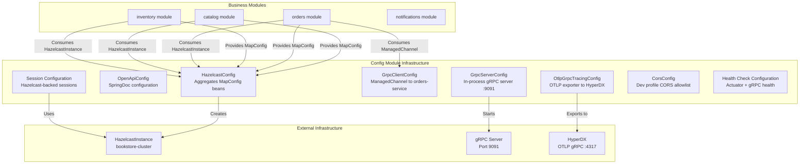
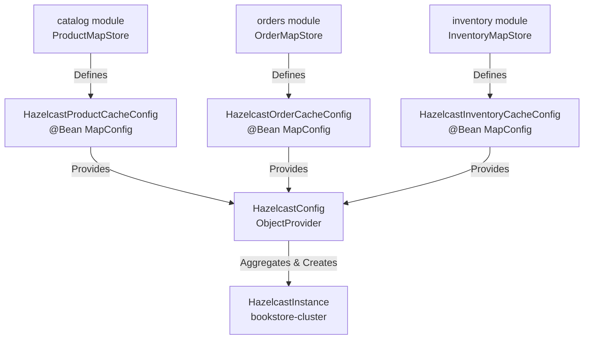
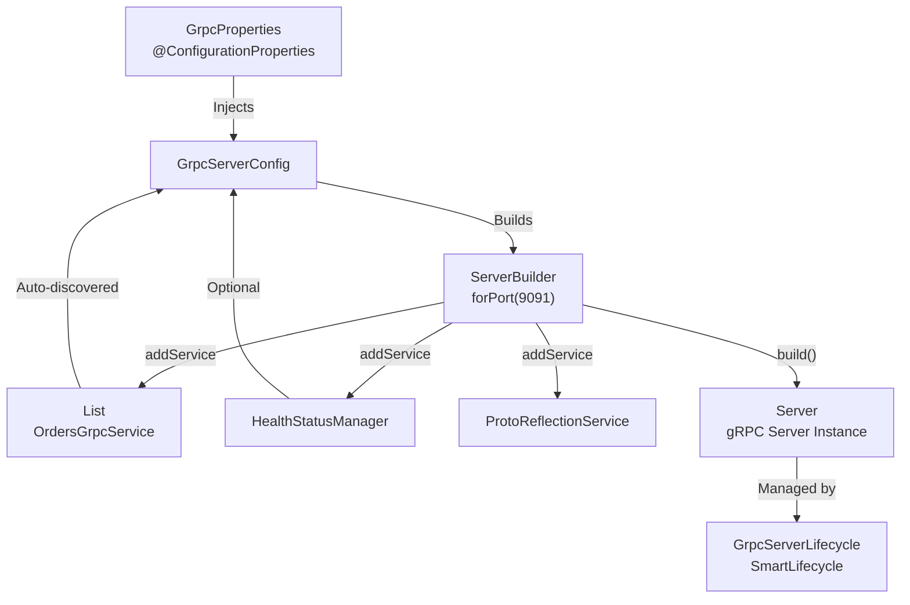
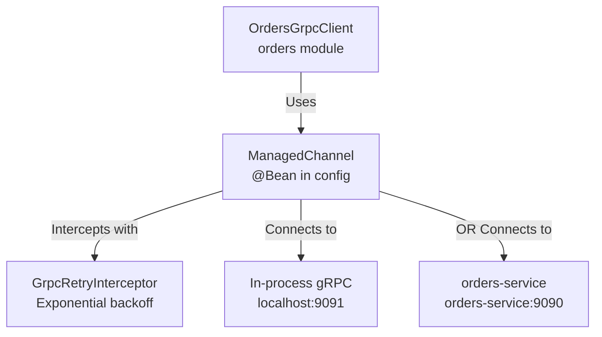
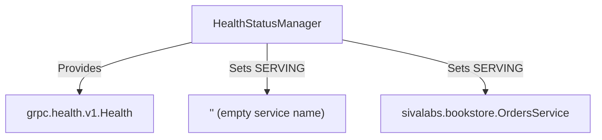
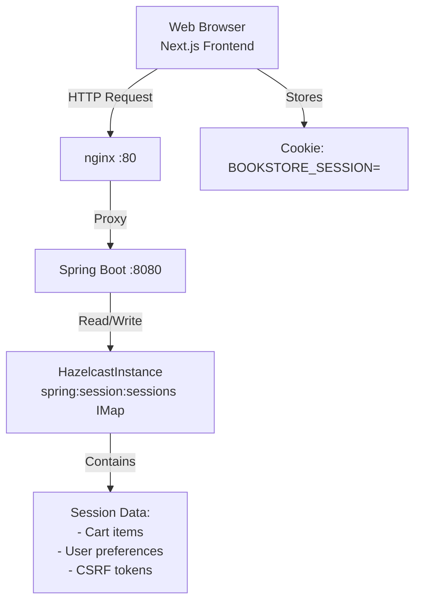
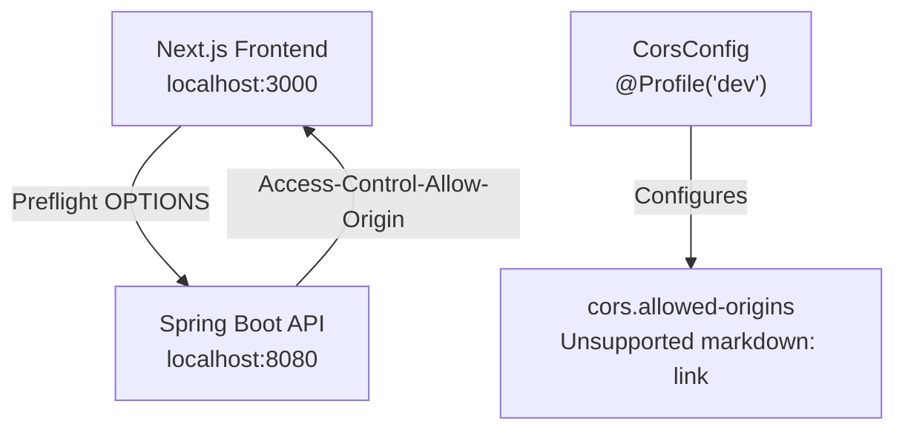
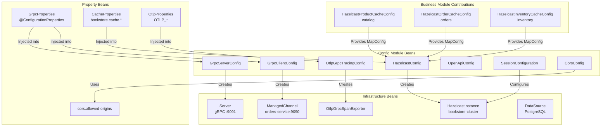

# Config Module

> **Relevant source files**
> * [README-API.md](https://github.com/philipz/spring-modular-monolith/blob/30c9bf30/README-API.md)
> * [README.md](https://github.com/philipz/spring-modular-monolith/blob/30c9bf30/README.md)
> * [docs/API_ANALYSIS_SUMMARY.txt](https://github.com/philipz/spring-modular-monolith/blob/30c9bf30/docs/API_ANALYSIS_SUMMARY.txt)
> * [docs/REST_API_ANALYSIS.md](https://github.com/philipz/spring-modular-monolith/blob/30c9bf30/docs/REST_API_ANALYSIS.md)
> * [docs/bookstore-microservices.png](https://github.com/philipz/spring-modular-monolith/blob/30c9bf30/docs/bookstore-microservices.png)
> * [docs/improvement.md](https://github.com/philipz/spring-modular-monolith/blob/30c9bf30/docs/improvement.md)
> * [docs/orders-data-ownership-analysis.md](https://github.com/philipz/spring-modular-monolith/blob/30c9bf30/docs/orders-data-ownership-analysis.md)
> * [docs/orders-module-boundary-analysis.md](https://github.com/philipz/spring-modular-monolith/blob/30c9bf30/docs/orders-module-boundary-analysis.md)
> * [docs/orders-traffic-migration.md](https://github.com/philipz/spring-modular-monolith/blob/30c9bf30/docs/orders-traffic-migration.md)
> * [k6.js](https://github.com/philipz/spring-modular-monolith/blob/30c9bf30/k6.js)
> * [src/main/java/com/sivalabs/bookstore/config/GrpcRetryInterceptor.java](https://github.com/philipz/spring-modular-monolith/blob/30c9bf30/src/main/java/com/sivalabs/bookstore/config/GrpcRetryInterceptor.java)
> * [src/main/java/com/sivalabs/bookstore/config/GrpcServerConfig.java](https://github.com/philipz/spring-modular-monolith/blob/30c9bf30/src/main/java/com/sivalabs/bookstore/config/GrpcServerConfig.java)
> * [src/main/java/com/sivalabs/bookstore/orders/grpc/GrpcExceptionHandler.java](https://github.com/philipz/spring-modular-monolith/blob/30c9bf30/src/main/java/com/sivalabs/bookstore/orders/grpc/GrpcExceptionHandler.java)

## Purpose and Scope

The **config** module serves as the infrastructure wiring layer for the Spring Modular Monolith. It provides foundational beans and configuration classes that other business modules (catalog, orders, inventory, notifications) depend upon without creating reverse dependencies. This module establishes Hazelcast distributed caching, OpenAPI documentation, gRPC server/client infrastructure, OpenTelemetry observability, health checks, and session/CORS policies.

For details on how business modules contribute their own cache configurations, see [Cache Configuration and MapConfigs](/philipz/spring-modular-monolith/5.1-cache-configuration-and-mapconfigs). For observability setup beyond the config module, see [OpenTelemetry Configuration](/philipz/spring-modular-monolith/9.1-opentelemetry-configuration).

**Sources**: [README.md L14](https://github.com/philipz/spring-modular-monolith/blob/30c9bf30/README.md#L14-L14)

---

## Module Overview

The config module is classified as an **Infrastructure Module** in the Spring Modulith architecture. Its primary responsibilities include:

* **Hazelcast Bootstrap**: Aggregates `MapConfig` beans contributed by business modules and constructs a unified `HazelcastInstance` for distributed caching and session storage
* **OpenAPI/Swagger**: Exposes REST API documentation at `/api-docs` and `/swagger-ui.html`
* **gRPC Infrastructure**: Configures in-process gRPC server (port 9091) and client channels for inter-service communication
* **Observability**: Wires OTLP gRPC exporters for traces, metrics, and logs to HyperDX
* **Health Checks**: Registers Spring Actuator endpoints and gRPC health services
* **Session Management**: Configures Spring Session with Hazelcast backing store (`BOOKSTORE_SESSION` cookie)
* **CORS Policies**: Enables cross-origin requests from the Next.js frontend during development

Unlike business modules, the config module does **not** own domain data or publish domain events. It is strictly an infrastructure provider.

**Sources**: [README.md L9-L14](https://github.com/philipz/spring-modular-monolith/blob/30c9bf30/README.md#L9-L14)

 [docs/REST_API_ANALYSIS.md L63-L73](https://github.com/philipz/spring-modular-monolith/blob/30c9bf30/docs/REST_API_ANALYSIS.md#L63-L73)

---

## Configuration Architecture



**Diagram**: Config Module Bean Provisioning Architecture

The config module follows a **provider pattern**: business modules contribute configuration beans (e.g., `MapConfig`), while the config module aggregates them and produces infrastructure beans (e.g., `HazelcastInstance`, `ManagedChannel`) that business modules consume.

**Sources**: [README.md L9-L14](https://github.com/philipz/spring-modular-monolith/blob/30c9bf30/README.md#L9-L14)

 [docs/orders-module-boundary-analysis.md L9-L15](https://github.com/philipz/spring-modular-monolith/blob/30c9bf30/docs/orders-module-boundary-analysis.md#L9-L15)

---

## Hazelcast Configuration

### HazelcastConfig Class

The `HazelcastConfig` class is responsible for:

1. **Aggregating Module-Specific Caches**: Uses `ObjectProvider<MapConfig>` to collect `MapConfig` beans registered by business modules (see [Cache Configuration and MapConfigs](/philipz/spring-modular-monolith/5.1-cache-configuration-and-mapconfigs))
2. **Creating HazelcastInstance**: Configures the `bookstore-cluster` with network settings, member attributes, and circuit breaker resilience
3. **Session Storage**: Enables Spring Session to use Hazelcast as the session store backend

Key configuration points:

| Property | Default | Description |
| --- | --- | --- |
| `spring.hazelcast.config` | N/A | Path to external Hazelcast XML config (optional) |
| `bookstore.cache.circuit-breaker.enabled` | `true` | Circuit breaker for cache failures |
| `bookstore.cache.circuit-breaker.failure-threshold` | `5` | Failures before opening circuit |
| `bookstore.cache.circuit-breaker.recovery-seconds` | `30` | Time before half-open retry |



**Diagram**: Hazelcast Configuration Aggregation Pattern

This design ensures the config module does not depend on internal classes from business modules. Each business module independently contributes its `MapConfig` bean, and `HazelcastConfig` discovers them via Spring's dependency injection.

**Sources**: [docs/orders-data-ownership-analysis.md L16-L20](https://github.com/philipz/spring-modular-monolith/blob/30c9bf30/docs/orders-data-ownership-analysis.md#L16-L20)

 [docs/orders-module-boundary-analysis.md L12-L15](https://github.com/philipz/spring-modular-monolith/blob/30c9bf30/docs/orders-module-boundary-analysis.md#L12-L15)

---

## OpenAPI and Swagger Configuration

### OpenApiConfig Class

The `OpenApiConfig` class configures SpringDoc OpenAPI 3.0 documentation:

* **API Spec Endpoint**: `/api-docs` (JSON format)
* **Swagger UI**: `/swagger-ui.html` (interactive documentation)
* **API Grouping**: Organizes endpoints by module (catalog, cart, orders)
* **Metadata**: Sets API version, description, license (Apache 2.0), and contact information

Configuration properties:

| Property | Value | Description |
| --- | --- | --- |
| `springdoc.api-docs.path` | `/api-docs` | OpenAPI JSON spec location |
| `springdoc.swagger-ui.path` | `/swagger-ui.html` | Swagger UI path |
| `springdoc.swagger-ui.enabled` | `true` | Enable interactive documentation |
| `springdoc.group-configs[*]` | catalog, cart, orders | API endpoint groupings |

When the application starts, SpringDoc scans `@RestController` classes and generates the OpenAPI specification. The frontend TypeScript SDK is generated from this spec using `openapi-typescript`.

**Sources**: [README-API.md L5-L9](https://github.com/philipz/spring-modular-monolith/blob/30c9bf30/README-API.md#L5-L9)

 [docs/API_ANALYSIS_SUMMARY.txt L48-L53](https://github.com/philipz/spring-modular-monolith/blob/30c9bf30/docs/API_ANALYSIS_SUMMARY.txt#L48-L53)

 [docs/REST_API_ANALYSIS.md L76-L80](https://github.com/philipz/spring-modular-monolith/blob/30c9bf30/docs/REST_API_ANALYSIS.md#L76-L80)

---

## gRPC Server Configuration

### GrpcServerConfig Class

The `GrpcServerConfig` class sets up an in-process gRPC server on port `9091` (configurable via `bookstore.grpc.server.port`). This server exposes the `OrdersGrpcService` for external gRPC clients or the extracted `orders-service`.

**Key Components**:



**Diagram**: gRPC Server Bean Construction Flow

**File Reference**: [src/main/java/com/sivalabs/bookstore/config/GrpcServerConfig.java L1-L77](https://github.com/philipz/spring-modular-monolith/blob/30c9bf30/src/main/java/com/sivalabs/bookstore/config/GrpcServerConfig.java#L1-L77)

**Configuration Properties**:

| Property | Default | Description |
| --- | --- | --- |
| `bookstore.grpc.server.enabled` | `true` | Enable gRPC server |
| `bookstore.grpc.server.port` | `9091` | Server listen port |
| `bookstore.grpc.server.max-inbound-message-size` | `4194304` | 4MB message limit |
| `bookstore.grpc.server.health-check-enabled` | `true` | Enable gRPC health service |
| `bookstore.grpc.server.reflection-enabled` | `true` | Enable server reflection (for grpcurl) |
| `bookstore.grpc.server.shutdown-grace-period-seconds` | `30` | Graceful shutdown timeout |

**Health Check Integration**: When health checks are enabled, `HealthStatusManager` is created and all registered `BindableService` implementations are marked as `SERVING`. This allows clients to use the standard `grpc.health.v1.Health` service to check server status.

**Sources**: [src/main/java/com/sivalabs/bookstore/config/GrpcServerConfig.java L24-L77](https://github.com/philipz/spring-modular-monolith/blob/30c9bf30/src/main/java/com/sivalabs/bookstore/config/GrpcServerConfig.java#L24-L77)

 [README.md L39-L41](https://github.com/philipz/spring-modular-monolith/blob/30c9bf30/README.md#L39-L41)

---

## gRPC Client Configuration

### GrpcClientConfig and Retry Interceptor

The config module provides a `ManagedChannel` bean for gRPC client communication. The `OrdersGrpcClient` (in the orders module) uses this channel to delegate operations to either:

* **In-process server**: `localhost:9091` (monolithic mode)
* **External orders-service**: `orders-service:9090` (microservice mode)

The channel is configured with:

* **Target Address**: `bookstore.grpc.client.target` (defaults to `localhost:9091`)
* **Retry Interceptor**: `GrpcRetryInterceptor` with exponential backoff
* **Deadline**: `bookstore.grpc.client.deadline-ms` (default 5000ms)



**Diagram**: gRPC Client Channel Configuration

### GrpcRetryInterceptor

The `GrpcRetryInterceptor` provides client-side resilience for transient failures:

**File Reference**: [src/main/java/com/sivalabs/bookstore/config/GrpcRetryInterceptor.java L1-L190](https://github.com/philipz/spring-modular-monolith/blob/30c9bf30/src/main/java/com/sivalabs/bookstore/config/GrpcRetryInterceptor.java#L1-L190)

**Retry Logic**:

| Aspect | Implementation |
| --- | --- |
| **Retryable Status Codes** | `UNAVAILABLE` |
| **Backoff Strategy** | Exponential: `100ms * 2^(attempt-1)` |
| **Max Attempts** | `bookstore.grpc.client.max-retry-attempts` (default 3) |
| **Deadline Handling** | Fresh deadline applied per attempt |
| **Scheduler** | Single-threaded `ScheduledExecutorService` |

The interceptor wraps each unary RPC call in a `RetryingClientCall` that:

1. Attempts the call with the specified deadline
2. On `UNAVAILABLE` status, schedules a retry after exponential backoff delay
3. Exhausts retries and propagates the final status to the caller

**Sources**: [src/main/java/com/sivalabs/bookstore/config/GrpcRetryInterceptor.java L20-L189](https://github.com/philipz/spring-modular-monolith/blob/30c9bf30/src/main/java/com/sivalabs/bookstore/config/GrpcRetryInterceptor.java#L20-L189)

 [README.md L39-L41](https://github.com/philipz/spring-modular-monolith/blob/30c9bf30/README.md#L39-L41)

---

## Observability Configuration

### OpenTelemetry OTLP Exporter

The config module configures OpenTelemetry's OTLP gRPC exporter to send traces, metrics, and logs to HyperDX on port `4317`.

**Configuration Classes**:

* `OtlpProperties`: Binds environment variables (`OTLP_ENDPOINT`, `OTLP_GRPC_HEADERS_AUTHORIZATION`)
* `OtlpGrpcTracingConfig`: Creates `OtlpGrpcSpanExporter` bean with gzip compression and 10-second timeout

**Instrumentation Layers**:

```

```

**Diagram**: OpenTelemetry Instrumentation and Export Pipeline

**Configuration Properties**:

| Property | Default | Description |
| --- | --- | --- |
| `management.tracing.sampling.probability` | `1.0` | 100% trace sampling |
| `management.otlp.tracing.endpoint` | `http://localhost:4317` | HyperDX OTLP endpoint |
| `management.otlp.tracing.compression` | `gzip` | Compression algorithm |
| `management.otlp.tracing.timeout` | `10s` | Export timeout |

The OpenTelemetry agent automatically instruments Spring Web MVC, JDBC, RabbitMQ, and gRPC without code changes. The `OtlpGrpcTracingConfig` class ensures all spans are exported to HyperDX with appropriate authentication headers.

**Sources**: [README.md L24-L28](https://github.com/philipz/spring-modular-monolith/blob/30c9bf30/README.md#L24-L28)

 [docs/REST_API_ANALYSIS.md L80-L81](https://github.com/philipz/spring-modular-monolith/blob/30c9bf30/docs/REST_API_ANALYSIS.md#L80-L81)

---

## Health Checks Configuration

The config module enables comprehensive health checks through two mechanisms:

### Spring Actuator Health Endpoints

All Actuator management endpoints are exposed via `management.endpoints.web.exposure.include=*`:

| Endpoint | Description |
| --- | --- |
| `/actuator/health` | Aggregate health status (UP/DOWN) |
| `/actuator/health/readiness` | Kubernetes readiness probe |
| `/actuator/health/liveness` | Kubernetes liveness probe |
| `/actuator/info` | Application metadata |
| `/actuator/metrics` | Micrometer metrics registry |
| `/actuator/modulith` | Spring Modulith module structure |

Health indicators include:

* **Database**: PostgreSQL connection status
* **RabbitMQ**: Message broker connectivity
* **Hazelcast**: Cluster member status
* **Disk Space**: Available disk capacity
* **Custom**: gRPC server port binding status

### gRPC Health Service

When `bookstore.grpc.server.health-check-enabled=true`, the `HealthStatusManager` bean is created and registered with the gRPC server. This implements the standard `grpc.health.v1.Health` service:

**File Reference**: [src/main/java/com/sivalabs/bookstore/config/GrpcServerConfig.java L40-L53](https://github.com/philipz/spring-modular-monolith/blob/30c9bf30/src/main/java/com/sivalabs/bookstore/config/GrpcServerConfig.java#L40-L53)



**Diagram**: gRPC Health Service Registration

Clients can query health status using `grpc_health_probe` or `grpcurl`:

```
grpcurl -plaintext localhost:9091 grpc.health.v1.Health/Check
```

**Sources**: [src/main/java/com/sivalabs/bookstore/config/GrpcServerConfig.java L40-L53](https://github.com/philipz/spring-modular-monolith/blob/30c9bf30/src/main/java/com/sivalabs/bookstore/config/GrpcServerConfig.java#L40-L53)

 [README.md L83-L89](https://github.com/philipz/spring-modular-monolith/blob/30c9bf30/README.md#L83-L89)

---

## Session Management Configuration

### Hazelcast-Backed Sessions

The config module enables Spring Session with Hazelcast as the backing store. This allows stateful cart operations across horizontal instances and provides session stickiness in load-balanced deployments.

**Configuration**:

| Property | Value | Description |
| --- | --- | --- |
| `spring.session.store-type` | `hazelcast` | Use Hazelcast for session storage |
| `spring.session.timeout` | `30m` | Session timeout duration |
| `server.servlet.session.cookie.name` | `BOOKSTORE_SESSION` | Cookie name |
| `server.servlet.session.cookie.http-only` | `true` | Prevent JavaScript access |
| `server.servlet.session.cookie.same-site` | `strict` | CSRF protection |
| `server.servlet.session.cookie.secure` | `false` | Set to `true` in production with HTTPS |

**Session Data Structure**:



**Diagram**: Session Management Flow with Hazelcast

The `BOOKSTORE_SESSION` cookie contains a session identifier that maps to a Hazelcast `IMap` entry. Cart operations (`POST /api/cart/items`) store the cart state in the session, eliminating the need for database-backed cart persistence.

**Sources**: [README.md L22-L23](https://github.com/philipz/spring-modular-monolith/blob/30c9bf30/README.md#L22-L23)

 [docs/REST_API_ANALYSIS.md L49-L56](https://github.com/philipz/spring-modular-monolith/blob/30c9bf30/docs/REST_API_ANALYSIS.md#L49-L56)

 [docs/API_ANALYSIS_SUMMARY.txt L36-L40](https://github.com/philipz/spring-modular-monolith/blob/30c9bf30/docs/API_ANALYSIS_SUMMARY.txt#L36-L40)

---

## CORS Configuration

### CorsConfig Class (Dev Profile)

The `CorsConfig` class is conditionally activated when the `dev` profile is enabled (`SPRING_PROFILES_ACTIVE=dev`). This allows the Next.js frontend running on `http://localhost:3000` to make cross-origin API requests during local development.

**Configuration**:



**Diagram**: CORS Configuration for Development

**Configuration Properties**:

| Property | Default | Description |
| --- | --- | --- |
| `cors.allowed-origins` | `http://localhost:3000` | Comma-separated list of allowed origins |
| `cors.allowed-methods` | `GET,POST,PUT,DELETE,OPTIONS` | Allowed HTTP methods |
| `cors.allowed-headers` | `*` | Allowed request headers |
| `cors.allow-credentials` | `true` | Allow cookies (for session) |

**Production Behavior**: In production (Docker Compose), nginx proxies both the frontend (`/`) and backend (`/api/**`) on the same origin (`http://localhost`), eliminating CORS requirements. The `CorsConfig` bean is not created when the `dev` profile is absent.

**Sources**: [README.md L109](https://github.com/philipz/spring-modular-monolith/blob/30c9bf30/README.md#L109-L109)

 [docs/REST_API_ANALYSIS.md L50-L56](https://github.com/philipz/spring-modular-monolith/blob/30c9bf30/docs/REST_API_ANALYSIS.md#L50-L56)

 [docs/API_ANALYSIS_SUMMARY.txt L43-L45](https://github.com/philipz/spring-modular-monolith/blob/30c9bf30/docs/API_ANALYSIS_SUMMARY.txt#L43-L45)

---

## Configuration Properties Reference

### GrpcProperties

All gRPC-related configuration is centralized in the `GrpcProperties` class:

**File Structure**:

* `bookstore.grpc.server.*` - Server properties
* `bookstore.grpc.client.*` - Client properties

**Server Properties**:

| Property | Type | Default | Description |
| --- | --- | --- | --- |
| `enabled` | boolean | `true` | Enable gRPC server |
| `port` | int | `9091` | Server port |
| `max-inbound-message-size` | int | `4194304` | 4MB limit |
| `health-check-enabled` | boolean | `true` | Enable health service |
| `reflection-enabled` | boolean | `true` | Enable reflection |
| `shutdown-grace-period-seconds` | long | `30` | Graceful shutdown timeout |

**Client Properties**:

| Property | Type | Default | Description |
| --- | --- | --- | --- |
| `target` | String | `localhost:9091` | Target server address |
| `deadline-ms` | long | `5000` | RPC deadline |
| `retry-enabled` | boolean | `true` | Enable retry interceptor |
| `max-retry-attempts` | int | `3` | Maximum retries |

These properties are bound via `@ConfigurationProperties("bookstore.grpc")` and can be overridden in `application.properties` or via environment variables.

**Sources**: [src/main/java/com/sivalabs/bookstore/config/GrpcRetryInterceptor.java L29-L34](https://github.com/philipz/spring-modular-monolith/blob/30c9bf30/src/main/java/com/sivalabs/bookstore/config/GrpcRetryInterceptor.java#L29-L34)

 [README.md L39-L41](https://github.com/philipz/spring-modular-monolith/blob/30c9bf30/README.md#L39-L41)

---

## Bean Dependency Graph



**Diagram**: Complete Configuration Bean Dependency Graph

This diagram illustrates how the config module acts as a central wiring point: it consumes property beans and module contributions, then produces infrastructure beans that business modules depend upon.

**Sources**: [docs/orders-module-boundary-analysis.md L9-L15](https://github.com/philipz/spring-modular-monolith/blob/30c9bf30/docs/orders-module-boundary-analysis.md#L9-L15)

 [docs/orders-data-ownership-analysis.md L16-L20](https://github.com/philipz/spring-modular-monolith/blob/30c9bf30/docs/orders-data-ownership-analysis.md#L16-L20)

---

## Exception Handling in gRPC

### GrpcExceptionHandler

The `GrpcExceptionHandler` utility class translates domain exceptions into gRPC `StatusRuntimeException`:

**File Reference**: [src/main/java/com/sivalabs/bookstore/orders/grpc/GrpcExceptionHandler.java L1-L78](https://github.com/philipz/spring-modular-monolith/blob/30c9bf30/src/main/java/com/sivalabs/bookstore/orders/grpc/GrpcExceptionHandler.java#L1-L78)

**Exception Mapping Table**:

| Domain Exception | gRPC Status | Description |
| --- | --- | --- |
| `OrderNotFoundException` | `NOT_FOUND` | Order not found by number |
| `InvalidOrderException` | `INVALID_ARGUMENT` | Business rule violation |
| `ConstraintViolationException` | `INVALID_ARGUMENT` | Bean validation failure |
| `StatusRuntimeException` | Propagated as-is | Already a gRPC exception |
| All others | `INTERNAL` | Unexpected server error |

**Usage Example**:

The `OrdersGrpcService` catches exceptions and delegates to `GrpcExceptionHandler.handleException()`:

```
try {
    // Business logic
} catch (Exception e) {
    throw GrpcExceptionHandler.handleException(e);
}
```

This ensures consistent error responses across all gRPC endpoints and allows clients to handle specific error codes (e.g., retry on `UNAVAILABLE`, display user error on `INVALID_ARGUMENT`).

**Sources**: [src/main/java/com/sivalabs/bookstore/orders/grpc/GrpcExceptionHandler.java L26-L72](https://github.com/philipz/spring-modular-monolith/blob/30c9bf30/src/main/java/com/sivalabs/bookstore/orders/grpc/GrpcExceptionHandler.java#L26-L72)

---

## Integration with Business Modules

The config module achieves clean separation by:

1. **Not Depending on Business Module Internals**: Uses `ObjectProvider<T>` to discover contributions without compile-time dependencies
2. **Providing Generic Infrastructure**: Beans like `HazelcastInstance` and `ManagedChannel` are framework-level, not domain-specific
3. **Configuration Properties**: Externalizes settings via `@ConfigurationProperties`, allowing override via environment variables or `application.properties`

**Anti-Pattern Avoided**: Previous designs had `HazelcastConfig` directly importing `OrderMapStore`, creating a reverse dependency. The current architecture uses `MapConfig` beans contributed by each module, eliminating this coupling.

**Sources**: [docs/orders-data-ownership-analysis.md L16-L20](https://github.com/philipz/spring-modular-monolith/blob/30c9bf30/docs/orders-data-ownership-analysis.md#L16-L20)

 [docs/orders-module-boundary-analysis.md L12-L15](https://github.com/philipz/spring-modular-monolith/blob/30c9bf30/docs/orders-module-boundary-analysis.md#L12-L15)

---

## Summary

The config module serves as the **infrastructure backbone** of the Spring Modular Monolith:

* **Hazelcast**: Aggregates module-specific cache configurations and provides distributed caching/sessions
* **gRPC**: Enables in-process server and client communication with retry resilience
* **OpenAPI**: Exposes REST API documentation for frontend SDK generation
* **Observability**: Exports traces/metrics/logs to HyperDX via OTLP gRPC
* **Health Checks**: Registers Spring Actuator and gRPC health services for readiness/liveness probes
* **Session Management**: Configures Hazelcast-backed HTTP sessions for stateful cart operations
* **CORS**: Allows cross-origin requests during local development

By centralizing infrastructure concerns, the config module allows business modules to focus on domain logic while consuming well-defined infrastructure beans.

**Sources**: [README.md L9-L14](https://github.com/philipz/spring-modular-monolith/blob/30c9bf30/README.md#L9-L14)

 [docs/REST_API_ANALYSIS.md L63-L73](https://github.com/philipz/spring-modular-monolith/blob/30c9bf30/docs/REST_API_ANALYSIS.md#L63-L73)

 [src/main/java/com/sivalabs/bookstore/config/GrpcServerConfig.java L1-L77](https://github.com/philipz/spring-modular-monolith/blob/30c9bf30/src/main/java/com/sivalabs/bookstore/config/GrpcServerConfig.java#L1-L77)