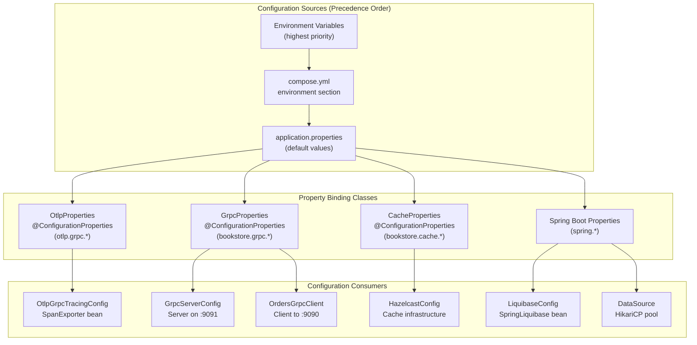
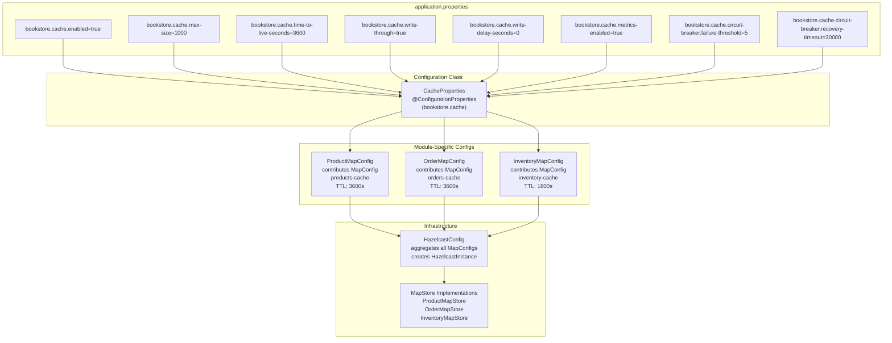

# Configuration Reference

> **Relevant source files**
> * [CLAUDE.md](https://github.com/philipz/spring-modular-monolith/blob/30c9bf30/CLAUDE.md)
> * [compose.yml](https://github.com/philipz/spring-modular-monolith/blob/30c9bf30/compose.yml)
> * [pom.xml](https://github.com/philipz/spring-modular-monolith/blob/30c9bf30/pom.xml)
> * [src/main/java/com/sivalabs/bookstore/config/LiquibaseConfig.java](https://github.com/philipz/spring-modular-monolith/blob/30c9bf30/src/main/java/com/sivalabs/bookstore/config/LiquibaseConfig.java)
> * [src/main/java/com/sivalabs/bookstore/config/OtlpGrpcTracingConfig.java](https://github.com/philipz/spring-modular-monolith/blob/30c9bf30/src/main/java/com/sivalabs/bookstore/config/OtlpGrpcTracingConfig.java)
> * [src/main/java/com/sivalabs/bookstore/config/OtlpProperties.java](https://github.com/philipz/spring-modular-monolith/blob/30c9bf30/src/main/java/com/sivalabs/bookstore/config/OtlpProperties.java)
> * [src/main/resources/application.properties](https://github.com/philipz/spring-modular-monolith/blob/30c9bf30/src/main/resources/application.properties)
> * [src/test/java/com/sivalabs/bookstore/BookStoreApplicationTests.java](https://github.com/philipz/spring-modular-monolith/blob/30c9bf30/src/test/java/com/sivalabs/bookstore/BookStoreApplicationTests.java)
> * [src/test/java/com/sivalabs/bookstore/TestcontainersConfiguration.java](https://github.com/philipz/spring-modular-monolith/blob/30c9bf30/src/test/java/com/sivalabs/bookstore/TestcontainersConfiguration.java)

This document provides a comprehensive reference of all configuration properties, environment variables, and settings used throughout the Spring Modular Monolith application. It covers application properties defined in `application.properties`, cache configuration, gRPC settings, and environment variables used in Docker Compose and Kubernetes deployments.

For information about deploying and running the application with these configurations, see [Deployment and Infrastructure](/philipz/spring-modular-monolith/10-deployment-and-infrastructure). For details on how modules use these configurations internally, see [Spring Modulith Architecture](/philipz/spring-modular-monolith/3-spring-modulith-architecture).

## Configuration Architecture

The application uses a hierarchical configuration system with multiple sources that override each other according to Spring Boot's property precedence rules.

**Configuration Sources and Binding**



**Sources:** [src/main/resources/application.properties L1-L150](https://github.com/philipz/spring-modular-monolith/blob/30c9bf30/src/main/resources/application.properties#L1-L150)

 [compose.yml L58-L117](https://github.com/philipz/spring-modular-monolith/blob/30c9bf30/compose.yml#L58-L117)

 [src/main/java/com/sivalabs/bookstore/config/OtlpProperties.java L9-L10](https://github.com/philipz/spring-modular-monolith/blob/30c9bf30/src/main/java/com/sivalabs/bookstore/config/OtlpProperties.java#L9-L10)

## Application Properties

The following sections document all properties defined in `application.properties`, organized by functional area.

### Core Application Settings

| Property | Default Value | Description |
| --- | --- | --- |
| `spring.application.name` | `spring-modular-monolith` | Application name used in logs and tracing |
| `spring.threads.virtual.enabled` | `true` | Enable Java 21 virtual threads for improved concurrency |
| `spring.docker.compose.enabled` | `false` | Disable automatic Docker Compose integration (managed externally) |

**Sources:** [src/main/resources/application.properties L1-L5](https://github.com/philipz/spring-modular-monolith/blob/30c9bf30/src/main/resources/application.properties#L1-L5)

### Database Configuration

| Property | Default Value | Description |
| --- | --- | --- |
| `spring.datasource.url` | `jdbc:postgresql://localhost:5432/postgres` | JDBC URL for PostgreSQL database |
| `spring.datasource.username` | `postgres` | Database username |
| `spring.datasource.password` | `postgres` | Database password |
| `spring.datasource.hikari.maximum-pool-size` | `10` | Maximum HikariCP connection pool size |
| `spring.jpa.open-in-view` | `false` | Disable OSIV anti-pattern |
| `spring.jpa.show-sql` | `false` | Disable SQL logging in console |
| `jdbc.datasource-proxy.query.enable-logging` | `false` | Disable datasource-proxy query logging |

**Environment Variable Overrides:**

* `SPRING_DATASOURCE_URL`
* `SPRING_DATASOURCE_USERNAME`
* `SPRING_DATASOURCE_PASSWORD`
* `SPRING_DATASOURCE_POOL_SIZE`

**Sources:** [src/main/resources/application.properties L7-L18](https://github.com/philipz/spring-modular-monolith/blob/30c9bf30/src/main/resources/application.properties#L7-L18)

 [compose.yml L62-L66](https://github.com/philipz/spring-modular-monolith/blob/30c9bf30/compose.yml#L62-L66)

### Liquibase Schema Management

| Property | Default Value | Description |
| --- | --- | --- |
| `spring.liquibase.enabled` | `true` | Enable Liquibase migrations on startup |
| `spring.liquibase.change-log` | `classpath:db/db.changelog-master.xml` | Master changelog file |
| `spring.liquibase.contexts` | *(empty)* | Liquibase contexts for conditional migrations |
| `spring.liquibase.default-schema` | *(empty)* | Default schema for Liquibase operations |
| `spring.liquibase.drop-first` | `false` | Drop database before running migrations (dangerous!) |

The `LiquibaseConfig` class [src/main/java/com/sivalabs/bookstore/config/LiquibaseConfig.java L18-L76](https://github.com/philipz/spring-modular-monolith/blob/30c9bf30/src/main/java/com/sivalabs/bookstore/config/LiquibaseConfig.java#L18-L76)

 binds these properties and creates the `SpringLiquibase` bean.

**Sources:** [src/main/resources/application.properties L20-L25](https://github.com/philipz/spring-modular-monolith/blob/30c9bf30/src/main/resources/application.properties#L20-L25)

 [src/main/java/com/sivalabs/bookstore/config/LiquibaseConfig.java L24-L34](https://github.com/philipz/spring-modular-monolith/blob/30c9bf30/src/main/java/com/sivalabs/bookstore/config/LiquibaseConfig.java#L24-L34)

### RabbitMQ Messaging

| Property | Default Value | Description |
| --- | --- | --- |
| `spring.rabbitmq.host` | `localhost` | RabbitMQ server hostname |
| `spring.rabbitmq.port` | `5672` | RabbitMQ AMQP port |
| `spring.rabbitmq.username` | `guest` | RabbitMQ username |
| `spring.rabbitmq.password` | `guest` | RabbitMQ password |
| `app.amqp.new-orders.bind` | `true` | Enable new-orders topology (queue, DLQ, bindings) |

**Environment Variable Overrides:**

* `SPRING_RABBITMQ_HOST`
* `SPRING_RABBITMQ_PORT`
* `SPRING_RABBITMQ_USERNAME`
* `SPRING_RABBITMQ_PASSWORD`
* `SPRING_RABBITMQ_CACHE_CHANNEL_SIZE` (for orders-service)

**Sources:** [src/main/resources/application.properties L27-L34](https://github.com/philipz/spring-modular-monolith/blob/30c9bf30/src/main/resources/application.properties#L27-L34)

 [compose.yml L67-L70](https://github.com/philipz/spring-modular-monolith/blob/30c9bf30/compose.yml#L67-L70)

 [compose.yml L101-L105](https://github.com/philipz/spring-modular-monolith/blob/30c9bf30/compose.yml#L101-L105)

### Spring Modulith Events

| Property | Default Value | Description |
| --- | --- | --- |
| `spring.modulith.events.jdbc.schema` | `events` | PostgreSQL schema for event publication log |
| `spring.modulith.events.jdbc.schema-initialization.enabled` | `true` | Auto-create event publication tables |
| `spring.modulith.events.republish-outstanding-events-on-restart` | `true` | Republish incomplete events on startup |

The `events` schema stores the event publication log for guaranteed delivery. For orders-service, this is overridden to `orders_events` via `SPRING_MODULITH_EVENTS_SCHEMA` environment variable [compose.yml L112](https://github.com/philipz/spring-modular-monolith/blob/30c9bf30/compose.yml#L112-L112)

**Sources:** [src/main/resources/application.properties L36-L40](https://github.com/philipz/spring-modular-monolith/blob/30c9bf30/src/main/resources/application.properties#L36-L40)

 [compose.yml L112](https://github.com/philipz/spring-modular-monolith/blob/30c9bf30/compose.yml#L112-L112)

### Session Management

| Property | Default Value | Description |
| --- | --- | --- |
| `spring.session.store-type` | `hazelcast` | Use Hazelcast for distributed session storage |
| `spring.session.hazelcast.map-name` | `spring:session:sessions` | Hazelcast IMap name for sessions |
| `spring.session.timeout` | `30m` | Session timeout duration |
| `server.servlet.session.timeout` | `30m` | Servlet session timeout |
| `server.servlet.session.cookie.name` | `BOOKSTORE_SESSION` | Session cookie name |
| `server.servlet.session.cookie.http-only` | `true` | Enable HttpOnly flag for security |
| `server.servlet.session.cookie.secure` | `false` | Enable Secure flag (set true in production) |
| `server.servlet.session.cookie.same-site` | `strict` | SameSite cookie attribute |

**Sources:** [src/main/resources/application.properties L89-L99](https://github.com/philipz/spring-modular-monolith/blob/30c9bf30/src/main/resources/application.properties#L89-L99)

### OpenTelemetry and Observability

| Property | Default Value | Description |
| --- | --- | --- |
| `management.endpoints.web.exposure.include` | `*` | Expose all Actuator endpoints |
| `management.endpoint.health.probes.enabled` | `true` | Enable Kubernetes liveness/readiness probes |
| `management.tracing.enabled` | `true` | Enable distributed tracing |
| `management.tracing.sampling.probability` | `1.0` | Sample 100% of traces (100% sampling) |
| `otlp.grpc.enabled` | `true` | Enable OTLP gRPC exporter |
| `otlp.grpc.endpoint` | `http://localhost:4317` | OTLP gRPC collector endpoint |
| `otlp.grpc.timeout` | `10s` | Request timeout for OTLP exports |
| `otlp.grpc.compression` | `gzip` | Compression for trace payloads |
| `otlp.grpc.headers.authorization` | *(empty)* | Authorization header (e.g., HyperDX API key) |

These properties are bound to `OtlpProperties` [src/main/java/com/sivalabs/bookstore/config/OtlpProperties.java L9-L63](https://github.com/philipz/spring-modular-monolith/blob/30c9bf30/src/main/java/com/sivalabs/bookstore/config/OtlpProperties.java#L9-L63)

 and consumed by `OtlpGrpcTracingConfig` [src/main/java/com/sivalabs/bookstore/config/OtlpGrpcTracingConfig.java L50-L62](https://github.com/philipz/spring-modular-monolith/blob/30c9bf30/src/main/java/com/sivalabs/bookstore/config/OtlpGrpcTracingConfig.java#L50-L62)

**Environment Variable Overrides:**

* `OTLP_ENDPOINT`
* `OTLP_GRPC_HEADERS_AUTHORIZATION` (used for HyperDX authentication)

**Sources:** [src/main/resources/application.properties L70-L82](https://github.com/philipz/spring-modular-monolith/blob/30c9bf30/src/main/resources/application.properties#L70-L82)

 [compose.yml L72-L73](https://github.com/philipz/spring-modular-monolith/blob/30c9bf30/compose.yml#L72-L73)

 [src/main/java/com/sivalabs/bookstore/config/OtlpProperties.java L9-L63](https://github.com/philipz/spring-modular-monolith/blob/30c9bf30/src/main/java/com/sivalabs/bookstore/config/OtlpProperties.java#L9-L63)

### Modulith Observability

| Property | Default Value | Description |
| --- | --- | --- |
| `spring.modulith.observability.instrumentation.datasource.enabled` | `false` | Disable module-specific datasource metrics (avoids tag conflicts) |
| `management.metrics.enable.jdbc` | `false` | Disable JDBC connection metrics globally |
| `management.metrics.enable.hikaricp` | `false` | Disable HikariCP metrics globally |
| `management.metrics.tags.common.application` | `${spring.application.name}` | Add application name as common tag |

**Sources:** [src/main/resources/application.properties L101-L110](https://github.com/philipz/spring-modular-monolith/blob/30c9bf30/src/main/resources/application.properties#L101-L110)

### OpenAPI Documentation

| Property | Default Value | Description |
| --- | --- | --- |
| `springdoc.api-docs.path` | `/api-docs` | OpenAPI JSON specification endpoint |
| `springdoc.api-docs.enabled` | `true` | Enable OpenAPI documentation generation |
| `springdoc.swagger-ui.path` | `/swagger-ui.html` | Swagger UI path |
| `springdoc.swagger-ui.enabled` | `true` | Enable Swagger UI |
| `springdoc.swagger-ui.try-it-out-enabled` | `true` | Enable "Try it out" in Swagger UI |
| `springdoc.show-actuator` | `false` | Hide Actuator endpoints from API docs |

**API Groups:**

* `catalog` - `/api/products/**`
* `cart` - `/api/cart/**`
* `orders` - `/api/orders/**`

**Sources:** [src/main/resources/application.properties L128-L149](https://github.com/philipz/spring-modular-monolith/blob/30c9bf30/src/main/resources/application.properties#L128-L149)

### Logging Configuration

| Property | Default Value | Description |
| --- | --- | --- |
| `logging.pattern.correlation` | `[${spring.application.name:},%X{traceId:-},%X{spanId:-}]` | Include trace IDs in logs for correlation |
| `logging.include-application-name` | `false` | Don't duplicate application name in logs |
| `logging.level.bookstore.query-logger` | `DEBUG` | Log level for query logger |
| `logging.level.io.grpc` | `INFO` | gRPC framework log level |
| `logging.level.com.sivalabs.bookstore.orders.grpc` | `DEBUG` | gRPC orders client log level |

**Sources:** [src/main/resources/application.properties L3-L4](https://github.com/philipz/spring-modular-monolith/blob/30c9bf30/src/main/resources/application.properties#L3-L4)

 [src/main/resources/application.properties L18](https://github.com/philipz/spring-modular-monolith/blob/30c9bf30/src/main/resources/application.properties#L18-L18)

 [src/main/resources/application.properties L125-L126](https://github.com/philipz/spring-modular-monolith/blob/30c9bf30/src/main/resources/application.properties#L125-L126)

## Cache Configuration Properties

The application uses Hazelcast for distributed caching with a sophisticated configuration system that allows per-module customization while sharing common defaults.

**Cache Property Binding and Usage**



**Sources:** [src/main/resources/application.properties L42-L68](https://github.com/philipz/spring-modular-monolith/blob/30c9bf30/src/main/resources/application.properties#L42-L68)

 [CLAUDE.md L337-L356](https://github.com/philipz/spring-modular-monolith/blob/30c9bf30/CLAUDE.md#L337-L356)

### Cache Global Settings

| Property | Default Value | Description |
| --- | --- | --- |
| `bookstore.cache.enabled` | `true` | Master switch to enable/disable all caching |
| `bookstore.cache.max-size` | `1000` | Maximum number of entries per cache |
| `bookstore.cache.time-to-live-seconds` | `3600` | Default TTL for cache entries (1 hour) |
| `bookstore.cache.max-idle-seconds` | `0` | Max idle time before eviction (0 = disabled) |
| `bookstore.cache.backup-count` | `1` | Number of backup copies in cluster |
| `bookstore.cache.read-backup-data` | `true` | Allow reading from backup copies |

**Sources:** [src/main/resources/application.properties L42-L56](https://github.com/philipz/spring-modular-monolith/blob/30c9bf30/src/main/resources/application.properties#L42-L56)

### Write-Through Cache Behavior

| Property | Default Value | Description |
| --- | --- | --- |
| `bookstore.cache.write-through` | `true` | Enable write-through to database via MapStore |
| `bookstore.cache.write-batch-size` | `1` | Number of writes to batch (1 = immediate) |
| `bookstore.cache.write-delay-seconds` | `0` | Delay before writing to database (0 = immediate) |

With `write-delay-seconds=0`, all cache writes are immediately synchronized to the database through the MapStore implementations (`ProductMapStore`, `OrderMapStore`, `InventoryMapStore`).

**Sources:** [src/main/resources/application.properties L52-L56](https://github.com/philipz/spring-modular-monolith/blob/30c9bf30/src/main/resources/application.properties#L52-L56)

### Cache Monitoring

| Property | Default Value | Description |
| --- | --- | --- |
| `bookstore.cache.metrics-enabled` | `true` | Enable cache metrics collection via Micrometer |

When enabled, cache metrics are exposed through Spring Actuator at `/actuator/metrics` including hit/miss ratios, eviction counts, and operation latencies.

**Sources:** [src/main/resources/application.properties L59](https://github.com/philipz/spring-modular-monolith/blob/30c9bf30/src/main/resources/application.properties#L59-L59)

### Circuit Breaker Configuration

| Property | Default Value | Description |
| --- | --- | --- |
| `bookstore.cache.circuit-breaker.failure-threshold` | `5` | Number of failures before opening circuit |
| `bookstore.cache.circuit-breaker.recovery-timeout` | `30000` | Recovery timeout in milliseconds (30 seconds) |

The circuit breaker protects against cascading failures when Hazelcast becomes unavailable, automatically opening after 5 consecutive failures and attempting recovery after 30 seconds.

**Sources:** [src/main/resources/application.properties L62-L63](https://github.com/philipz/spring-modular-monolith/blob/30c9bf30/src/main/resources/application.properties#L62-L63)

### Module-Specific TTL Overrides

While most caches use the default 3600-second TTL, inventory has a shorter TTL due to higher data volatility:

| Cache Name | TTL | Rationale |
| --- | --- | --- |
| `products-cache` | 3600s (1 hour) | Product data changes infrequently |
| `orders-cache` | 3600s (1 hour) | Order data is immutable after creation |
| `inventory-cache` | 1800s (30 minutes) | Stock levels change frequently |
| `inventory-by-product-code-cache` | N/A | Index-only cache with no MapStore |

**Sources:** [src/main/resources/application.properties L65-L68](https://github.com/philipz/spring-modular-monolith/blob/30c9bf30/src/main/resources/application.properties#L65-L68)

## gRPC Configuration Properties

The application uses gRPC for inter-service communication between the monolith and the extracted orders-service.

### gRPC Server Configuration

| Property | Default Value | Description |
| --- | --- | --- |
| `bookstore.grpc.server.port` | `9091` | Port for gRPC server in monolith |
| `bookstore.grpc.server.health-check-enabled` | `true` | Enable gRPC health check service |
| `bookstore.grpc.server.reflection-enabled` | `true` | Enable gRPC server reflection (for grpcurl) |
| `bookstore.grpc.server.max-inbound-message-size` | `4194304` | Max message size in bytes (4 MB) |
| `bookstore.grpc.server.shutdown-grace-period-seconds` | `30` | Graceful shutdown timeout |

The server configuration is consumed by `GrpcServerConfig` which registers services and starts the server on the specified port.

**Sources:** [src/main/resources/application.properties L113-L118](https://github.com/philipz/spring-modular-monolith/blob/30c9bf30/src/main/resources/application.properties#L113-L118)

### gRPC Client Configuration

| Property | Default Value | Description |
| --- | --- | --- |
| `bookstore.grpc.client.target` | `localhost:9091` | Target address for gRPC client |
| `bookstore.grpc.client.deadline-ms` | `5000` | Request deadline in milliseconds (5 seconds) |
| `bookstore.grpc.client.retry-enabled` | `true` | Enable retry logic with exponential backoff |
| `bookstore.grpc.client.max-retry-attempts` | `3` | Maximum number of retry attempts |

The client target is overridden in Docker Compose to `orders-service:9090` [compose.yml L76](https://github.com/philipz/spring-modular-monolith/blob/30c9bf30/compose.yml#L76-L76)

 to route requests to the extracted microservice.

**Environment Variable Override:**

* `BOOKSTORE_GRPC_CLIENT_TARGET`

**Sources:** [src/main/resources/application.properties L120-L124](https://github.com/philipz/spring-modular-monolith/blob/30c9bf30/src/main/resources/application.properties#L120-L124)

 [compose.yml L76](https://github.com/philipz/spring-modular-monolith/blob/30c9bf30/compose.yml#L76-L76)

## Environment Variables Reference

This section documents environment variables used in Docker Compose deployments and their mappings to application properties.

### Database Environment Variables

**PostgreSQL (Main Database)**

| Variable | Usage | Default | Services |
| --- | --- | --- | --- |
| `POSTGRES_DB` | Database name | `postgres` | postgres container |
| `POSTGRES_USER` | Database username | `postgres` | postgres container |
| `POSTGRES_PASSWORD` | Database password | `postgres` | postgres container |
| `SPRING_DATASOURCE_URL` | JDBC connection URL | `jdbc:postgresql://postgres:5432/postgres` | monolith |
| `SPRING_DATASOURCE_USERNAME` | Database username | `postgres` | monolith |
| `SPRING_DATASOURCE_PASSWORD` | Database password | `postgres` | monolith |
| `SPRING_DATASOURCE_POOL_SIZE` | HikariCP pool size | `200` | monolith, orders-service |

**PostgreSQL (Orders Service)**

| Variable | Usage | Default | Services |
| --- | --- | --- | --- |
| `POSTGRES_DB` | Database name | `postgres` | orders-postgres container |
| `POSTGRES_USER` | Database username | `postgres` | orders-postgres container |
| `POSTGRES_PASSWORD` | Database password | `postgres` | orders-postgres container |
| `SPRING_DATASOURCE_URL` | JDBC connection URL | `jdbc:postgresql://orders-postgres:5432/postgres` | orders-service |

**Sources:** [compose.yml L4-L7](https://github.com/philipz/spring-modular-monolith/blob/30c9bf30/compose.yml#L4-L7)

 [compose.yml L22-L24](https://github.com/philipz/spring-modular-monolith/blob/30c9bf30/compose.yml#L22-L24)

 [compose.yml L62-L66](https://github.com/philipz/spring-modular-monolith/blob/30c9bf30/compose.yml#L62-L66)

 [compose.yml L97-L100](https://github.com/philipz/spring-modular-monolith/blob/30c9bf30/compose.yml#L97-L100)

### Messaging Environment Variables

| Variable | Usage | Default | Services |
| --- | --- | --- | --- |
| `RABBITMQ_DEFAULT_USER` | RabbitMQ username | `guest` | rabbitmq container |
| `RABBITMQ_DEFAULT_PASS` | RabbitMQ password | `guest` | rabbitmq container |
| `SPRING_RABBITMQ_HOST` | RabbitMQ hostname | `rabbitmq` | monolith, orders-service, amqp-modulith |
| `SPRING_RABBITMQ_PORT` | RabbitMQ port | `5672` | monolith, orders-service, amqp-modulith |
| `SPRING_RABBITMQ_USERNAME` | RabbitMQ username | `guest` | monolith, orders-service, amqp-modulith |
| `SPRING_RABBITMQ_PASSWORD` | RabbitMQ password | `guest` | monolith, orders-service, amqp-modulith |
| `SPRING_RABBITMQ_CACHE_CHANNEL_SIZE` | Channel cache size | `300` | orders-service, amqp-modulith |

**Sources:** [compose.yml L36-L38](https://github.com/philipz/spring-modular-monolith/blob/30c9bf30/compose.yml#L36-L38)

 [compose.yml L67-L70](https://github.com/philipz/spring-modular-monolith/blob/30c9bf30/compose.yml#L67-L70)

 [compose.yml L101-L105](https://github.com/philipz/spring-modular-monolith/blob/30c9bf30/compose.yml#L101-L105)

 [compose.yml L130-L134](https://github.com/philipz/spring-modular-monolith/blob/30c9bf30/compose.yml#L130-L134)

### Observability Environment Variables

| Variable | Usage | Default | Services |
| --- | --- | --- | --- |
| `HYPERDX_API_KEY` | HyperDX authentication key | *(required)* | monolith, orders-service, webproxy |
| `OTLP_ENDPOINT` | OTLP collector endpoint | `http://hyperdx:4317` | monolith, orders-service |
| `OTLP_GRPC_HEADERS_AUTHORIZATION` | Authorization header | `${HYPERDX_API_KEY}` | monolith, orders-service |

The `HYPERDX_API_KEY` must be set in a `.env` file or passed as an environment variable when starting Docker Compose. The webproxy uses it for nginx OpenTelemetry module authentication [compose.yml L162](https://github.com/philipz/spring-modular-monolith/blob/30c9bf30/compose.yml#L162-L162)

**Sources:** [compose.yml L72-L73](https://github.com/philipz/spring-modular-monolith/blob/30c9bf30/compose.yml#L72-L73)

 [compose.yml L107-L108](https://github.com/philipz/spring-modular-monolith/blob/30c9bf30/compose.yml#L107-L108)

 [compose.yml L162](https://github.com/philipz/spring-modular-monolith/blob/30c9bf30/compose.yml#L162-L162)

### gRPC Environment Variables

| Variable | Usage | Default | Services |
| --- | --- | --- | --- |
| `BOOKSTORE_GRPC_CLIENT_TARGET` | gRPC client target address | `orders-service:9090` | monolith |

This variable overrides the default `localhost:9091` to route gRPC calls from the monolith to the extracted orders-service on port 9090.

**Sources:** [compose.yml L76](https://github.com/philipz/spring-modular-monolith/blob/30c9bf30/compose.yml#L76-L76)

### Spring Modulith Environment Variables

| Variable | Usage | Default | Services |
| --- | --- | --- | --- |
| `SPRING_MODULITH_EVENTS_SCHEMA` | Event publication schema | `orders_events` | orders-service |

This variable overrides the default `events` schema to use a separate schema in the orders-service database.

**Sources:** [compose.yml L112](https://github.com/philipz/spring-modular-monolith/blob/30c9bf30/compose.yml#L112-L112)

### Frontend Environment Variables

| Variable | Usage | Default | Services |
| --- | --- | --- | --- |
| `NODE_ENV` | Node environment | `production` | frontend-next |
| `PORT` | Server port | `3000` | frontend-next |
| `HOSTNAME` | Bind hostname | `0.0.0.0` | frontend-next |
| `NEXT_PUBLIC_API_URL` | Public API URL | `/api` | frontend-next |
| `NEXT_API_PROXY_TARGET` | Backend proxy target | `http://monolith:8080` | frontend-next |

**Sources:** [compose.yml L144-L149](https://github.com/philipz/spring-modular-monolith/blob/30c9bf30/compose.yml#L144-L149)

### Hazelcast Environment Variables

| Variable | Usage | Default | Services |
| --- | --- | --- | --- |
| `HZ_CLUSTERNAME` | Hazelcast cluster name | `bookstore-cluster` | hazelcast-mgmt |
| `HZ_NETWORK_PORT_AUTOINCREMENT` | Enable port auto-increment | `true` | hazelcast-mgmt |

**Sources:** [compose.yml L180-L181](https://github.com/philipz/spring-modular-monolith/blob/30c9bf30/compose.yml#L180-L181)

### JVM Configuration

| Variable | Usage | Services |
| --- | --- | --- |
| `JDK_JAVA_OPTIONS` | JVM options for Hazelcast module compatibility | monolith |

The monolith requires specific JVM flags for Hazelcast to work correctly in Java 21's modular environment:

```
--add-modules java.se 
--add-exports java.base/jdk.internal.ref=ALL-UNNAMED 
--add-opens java.base/java.lang=ALL-UNNAMED 
--add-opens java.base/sun.nio.ch=ALL-UNNAMED 
--add-opens java.management/sun.management=ALL-UNNAMED 
--add-opens jdk.management/com.sun.management.internal=ALL-UNNAMED
```

**Sources:** [compose.yml L78](https://github.com/philipz/spring-modular-monolith/blob/30c9bf30/compose.yml#L78-L78)

## Maven Build Properties

Build-time configuration is managed through Maven properties in `pom.xml`.

| Property | Default Value | Description |
| --- | --- | --- |
| `java.version` | `21` | Java language level |
| `dockerImageName` | `sivaprasadreddy/${project.artifactId}:${project.version}` | Docker image name pattern |
| `spring-modulith.version` | `1.4.3` | Spring Modulith version |
| `hazelcast.version` | `5.5.6` | Hazelcast version |
| `grpc.version` | `1.65.1` | gRPC Java version |
| `protobuf.version` | `3.25.3` | Protocol Buffers version |
| `spotless.version` | `2.46.1` | Spotless Maven plugin version |
| `palantir-java-format.version` | `2.72.0` | Palantir Java Format version |

**Liquibase Maven Properties:**

| Property | Environment Variable | Description |
| --- | --- | --- |
| `liquibase.url` | `LIQUIBASE_URL` | Database URL for Liquibase Maven plugin |
| `liquibase.username` | `LIQUIBASE_USERNAME` | Database username for migrations |
| `liquibase.password` | `LIQUIBASE_PASSWORD` | Database password for migrations |

These properties are used by the `liquibase-maven-plugin` for running migrations from Maven [pom.xml L350-L362](https://github.com/philipz/spring-modular-monolith/blob/30c9bf30/pom.xml#L350-L362)

 They are separate from runtime Spring Boot configuration.

**Sources:** [pom.xml L19-L38](https://github.com/philipz/spring-modular-monolith/blob/30c9bf30/pom.xml#L19-L38)

 [pom.xml L350-L361](https://github.com/philipz/spring-modular-monolith/blob/30c9bf30/pom.xml#L350-L361)

## Configuration Best Practices

### Property Precedence

Configuration values are resolved in the following order (highest to lowest precedence):

1. Environment variables (e.g., `SPRING_DATASOURCE_URL`)
2. Docker Compose `environment` section [compose.yml L60-L78](https://github.com/philipz/spring-modular-monolith/blob/30c9bf30/compose.yml#L60-L78)
3. `application.properties` defaults [src/main/resources/application.properties L1-L150](https://github.com/philipz/spring-modular-monolith/blob/30c9bf30/src/main/resources/application.properties#L1-L150)

### Externalizing Secrets

Never commit sensitive values to version control. Use environment variables for:

* Database passwords (`SPRING_DATASOURCE_PASSWORD`)
* RabbitMQ credentials (`SPRING_RABBITMQ_PASSWORD`)
* HyperDX API key (`HYPERDX_API_KEY`)
* Authorization headers (`OTLP_GRPC_HEADERS_AUTHORIZATION`)

Create a `.env` file (gitignored) for local development:

```
HYPERDX_API_KEY=your-api-key-here
SPRING_DATASOURCE_PASSWORD=secure-password
```

### Profile-Specific Configuration

The orders-service uses Spring profiles [compose.yml L96](https://github.com/philipz/spring-modular-monolith/blob/30c9bf30/compose.yml#L96-L96)

:

* `docker` profile for containerized deployment
* Default profile for local development

Additional profiles can be activated via `SPRING_PROFILES_ACTIVE` environment variable.

**Sources:** [compose.yml L96](https://github.com/philipz/spring-modular-monolith/blob/30c9bf30/compose.yml#L96-L96)

### Testing Configuration Overrides

Test classes can override configuration using `@SpringBootTest` properties:

```
@SpringBootTest(
    webEnvironment = RANDOM_PORT,
    properties = {"bookstore.grpc.server.port=0"})
```

The `TestcontainersConfiguration` [src/test/java/com/sivalabs/bookstore/TestcontainersConfiguration.java L14-L33](https://github.com/philipz/spring-modular-monolith/blob/30c9bf30/src/test/java/com/sivalabs/bookstore/TestcontainersConfiguration.java#L14-L33)

 provides `@ServiceConnection` beans that automatically configure test database and RabbitMQ connections.

**Sources:** [src/test/java/com/sivalabs/bookstore/BookStoreApplicationTests.java L9-L11](https://github.com/philipz/spring-modular-monolith/blob/30c9bf30/src/test/java/com/sivalabs/bookstore/BookStoreApplicationTests.java#L9-L11)

 [src/test/java/com/sivalabs/bookstore/TestcontainersConfiguration.java L14-L33](https://github.com/philipz/spring-modular-monolith/blob/30c9bf30/src/test/java/com/sivalabs/bookstore/TestcontainersConfiguration.java#L14-L33)