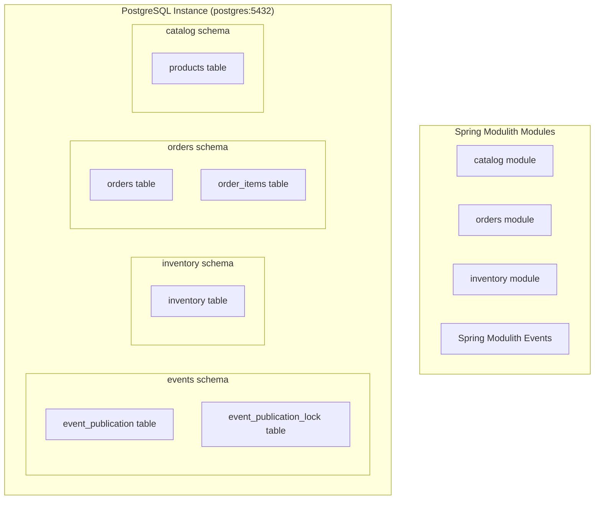
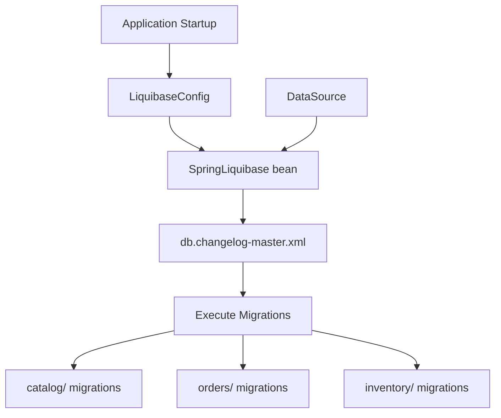
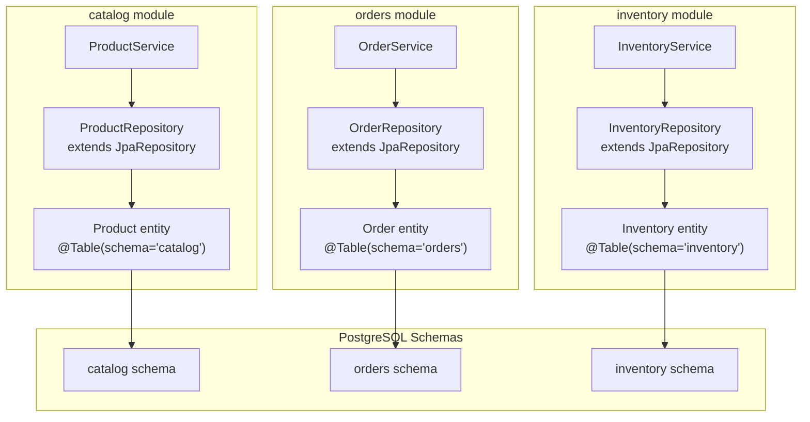
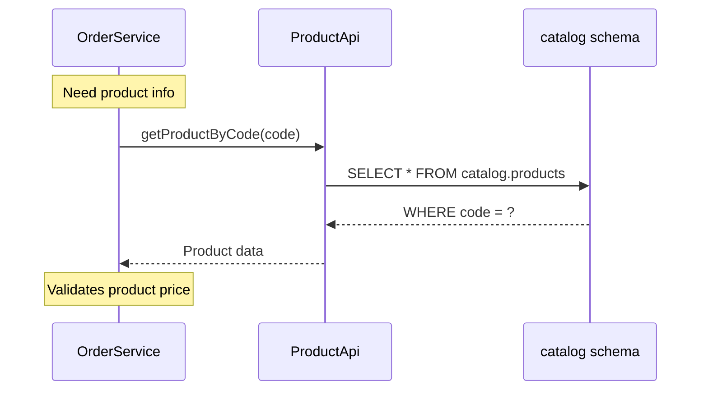
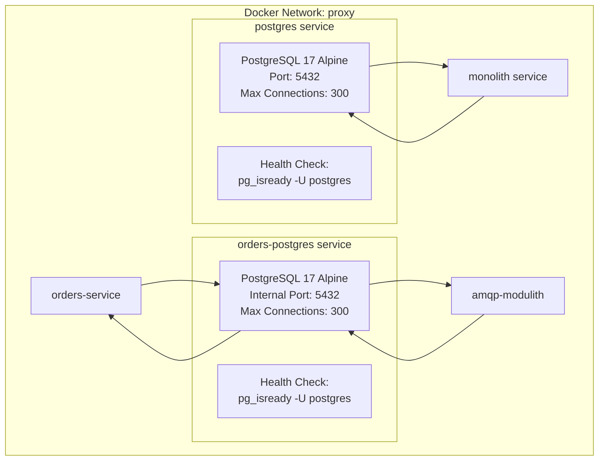

# Data and Persistence

> **Relevant source files**
> * [CLAUDE.md](https://github.com/philipz/spring-modular-monolith/blob/30c9bf30/CLAUDE.md)
> * [compose.yml](https://github.com/philipz/spring-modular-monolith/blob/30c9bf30/compose.yml)
> * [pom.xml](https://github.com/philipz/spring-modular-monolith/blob/30c9bf30/pom.xml)
> * [src/main/java/com/sivalabs/bookstore/config/LiquibaseConfig.java](https://github.com/philipz/spring-modular-monolith/blob/30c9bf30/src/main/java/com/sivalabs/bookstore/config/LiquibaseConfig.java)
> * [src/main/java/com/sivalabs/bookstore/config/OtlpGrpcTracingConfig.java](https://github.com/philipz/spring-modular-monolith/blob/30c9bf30/src/main/java/com/sivalabs/bookstore/config/OtlpGrpcTracingConfig.java)
> * [src/main/java/com/sivalabs/bookstore/config/OtlpProperties.java](https://github.com/philipz/spring-modular-monolith/blob/30c9bf30/src/main/java/com/sivalabs/bookstore/config/OtlpProperties.java)
> * [src/main/resources/application.properties](https://github.com/philipz/spring-modular-monolith/blob/30c9bf30/src/main/resources/application.properties)
> * [src/test/java/com/sivalabs/bookstore/BookStoreApplicationTests.java](https://github.com/philipz/spring-modular-monolith/blob/30c9bf30/src/test/java/com/sivalabs/bookstore/BookStoreApplicationTests.java)
> * [src/test/java/com/sivalabs/bookstore/TestcontainersConfiguration.java](https://github.com/philipz/spring-modular-monolith/blob/30c9bf30/src/test/java/com/sivalabs/bookstore/TestcontainersConfiguration.java)

This document describes the data persistence architecture of the Spring Modular Monolith application, including the multi-schema PostgreSQL design, Liquibase-based schema management, and data isolation principles that enforce module boundaries at the database level.

For information about caching and distributed data access, see [Caching with Hazelcast](/philipz/spring-modular-monolith/5-caching-with-hazelcast). For event storage and publication guarantees, see [Event-Driven Architecture](/philipz/spring-modular-monolith/3.3-event-driven-architecture).

---

## Database Architecture Overview

The application uses PostgreSQL as its primary relational database with a **multi-schema design** that enforces data ownership at the database level. Each business module owns a dedicated schema, preventing accidental cross-module data access and maintaining clear architectural boundaries.

### PostgreSQL Instances

The system deploys two PostgreSQL instances to support both the monolith and the extracted orders microservice:

| Instance | Container Name | Purpose | Schemas | Port |
| --- | --- | --- | --- | --- |
| Main Database | `postgres` | Monolith data storage | `catalog`, `orders`, `inventory`, `events` | 5432 |
| Orders Database | `orders-postgres` | Extracted orders-service data | `orders`, `orders_events` | Internal |

**Sources:** [compose.yml L2-L32](https://github.com/philipz/spring-modular-monolith/blob/30c9bf30/compose.yml#L2-L32)

### Multi-Schema Design Philosophy

Each module manages its own database schema independently, following the **database-per-module** pattern within a single PostgreSQL instance. This approach provides:

* **Data Isolation**: Modules cannot accidentally query other modules' tables
* **Independent Evolution**: Each module can evolve its schema without affecting others
* **Clear Ownership**: Schema names directly map to module names
* **Migration Autonomy**: Each module manages its own Liquibase migrations



**Multi-Schema Database Architecture**

**Sources:** [compose.yml L2-L17](https://github.com/philipz/spring-modular-monolith/blob/30c9bf30/compose.yml#L2-L17)

 [src/main/resources/application.properties L7-L18](https://github.com/philipz/spring-modular-monolith/blob/30c9bf30/src/main/resources/application.properties#L7-L18)

 Diagram 3 from high-level architecture

---

## Schema Organization

### Module-Specific Schemas

The application organizes database schemas according to business module boundaries:

#### Catalog Schema

* **Owner**: `catalog` module
* **Purpose**: Product catalog data
* **Key Tables**: `catalog.products`
* **Migration Path**: `db/migration/catalog/`

#### Orders Schema

* **Owner**: `orders` module
* **Purpose**: Order management and cart data
* **Key Tables**: `orders.orders`, `orders.order_items`
* **Migration Path**: `db/migration/orders/`

#### Inventory Schema

* **Owner**: `inventory` module
* **Purpose**: Stock level projections
* **Key Tables**: `inventory.inventory`
* **Migration Path**: `db/migration/inventory/`

### Events Schema

The `events` schema is special-purpose and managed by Spring Modulith's JDBC event publication mechanism. It provides guaranteed event delivery by persisting events before and after publication.

**Configuration:**

```
spring.modulith.events.jdbc.schema=events
spring.modulith.events.jdbc.schema-initialization.enabled=true
spring.modulith.events.republish-outstanding-events-on-restart=true
```

**Key Tables:**

* `event_publication`: Stores published events with completion status
* `event_publication_lock`: Provides distributed locking for event processing

**Sources:** [src/main/resources/application.properties L36-L40](https://github.com/philipz/spring-modular-monolith/blob/30c9bf30/src/main/resources/application.properties#L36-L40)

---

## Schema Management with Liquibase

### LiquibaseConfig Bean

The application uses Liquibase for database migration management. The `LiquibaseConfig` class creates and configures the `SpringLiquibase` bean with appropriate settings:



**Liquibase Configuration Flow**

**Sources:** [src/main/java/com/sivalabs/bookstore/config/LiquibaseConfig.java L1-L77](https://github.com/philipz/spring-modular-monolith/blob/30c9bf30/src/main/java/com/sivalabs/bookstore/config/LiquibaseConfig.java#L1-L77)

### Configuration Properties

The `LiquibaseConfig` class reads configuration from `application.properties`:

| Property | Default | Purpose |
| --- | --- | --- |
| `spring.liquibase.enabled` | `true` | Enable/disable Liquibase |
| `spring.liquibase.change-log` | `classpath:db/db.changelog-master.xml` | Master changelog file |
| `spring.liquibase.contexts` | *(empty)* | Execution contexts filter |
| `spring.liquibase.default-schema` | *(empty)* | Default schema for metadata |
| `spring.liquibase.drop-first` | `false` | Drop database before migration |

**Sources:** [src/main/java/com/sivalabs/bookstore/config/LiquibaseConfig.java L24-L34](https://github.com/philipz/spring-modular-monolith/blob/30c9bf30/src/main/java/com/sivalabs/bookstore/config/LiquibaseConfig.java#L24-L34)

 [src/main/resources/application.properties L20-L25](https://github.com/philipz/spring-modular-monolith/blob/30c9bf30/src/main/resources/application.properties#L20-L25)

### Migration File Organization

Each module maintains its own migration directory under `src/main/resources/db/migration/`:

```markdown
src/main/resources/db/
├── db.changelog-master.xml          # Master changelog
└── migration/
    ├── catalog/                      # Catalog module migrations
    │   └── V001__create_products.sql
    ├── orders/                       # Orders module migrations
    │   ├── V001__create_orders.sql
    │   └── V002__create_order_items.sql
    └── inventory/                    # Inventory module migrations
        └── V001__create_inventory.sql
```

The master changelog includes module-specific changesets:

```xml
<!-- db.changelog-master.xml structure -->
<databaseChangeLog>
    <!-- Catalog module -->
    <include file="classpath:db/migration/catalog/V001__create_products.sql"/>
    
    <!-- Orders module -->
    <include file="classpath:db/migration/orders/V001__create_orders.sql"/>
    <include file="classpath:db/migration/orders/V002__create_order_items.sql"/>
    
    <!-- Inventory module -->
    <include file="classpath:db/migration/inventory/V001__create_inventory.sql"/>
</databaseChangeLog>
```

**Sources:** [src/main/java/com/sivalabs/bookstore/config/LiquibaseConfig.java L24](https://github.com/philipz/spring-modular-monolith/blob/30c9bf30/src/main/java/com/sivalabs/bookstore/config/LiquibaseConfig.java#L24-L24)

 [src/main/resources/application.properties L22](https://github.com/philipz/spring-modular-monolith/blob/30c9bf30/src/main/resources/application.properties#L22-L22)

### Maven Liquibase Plugin

The project includes the `liquibase-maven-plugin` for command-line migration management during development:

**Configuration:**

```html
<plugin>
    <groupId>org.liquibase</groupId>
    <artifactId>liquibase-maven-plugin</artifactId>
    <configuration>
        <changeLogFile>src/main/resources/db/db.changelog-master.xml</changeLogFile>
        <url>${liquibase.url}</url>
        <username>${liquibase.username}</username>
        <password>${liquibase.password}</password>
        <driver>org.postgresql.Driver</driver>
    </configuration>
</plugin>
```

**Connection parameters are externalized** via environment variables or Maven properties:

* `LIQUIBASE_URL` / `-Dliquibase.url`
* `LIQUIBASE_USERNAME` / `-Dliquibase.username`
* `LIQUIBASE_PASSWORD` / `-Dliquibase.password`

**Sources:** [pom.xml L29-L38](https://github.com/philipz/spring-modular-monolith/blob/30c9bf30/pom.xml#L29-L38)

 [pom.xml L350-L362](https://github.com/philipz/spring-modular-monolith/blob/30c9bf30/pom.xml#L350-L362)

---

## Database Configuration

### DataSource Properties

The application configures the primary PostgreSQL connection through Spring Boot's `DataSource` properties:

```markdown
# Primary database connection
spring.datasource.url=jdbc:postgresql://localhost:5432/postgres
spring.datasource.username=postgres
spring.datasource.password=postgres

# HikariCP connection pool
spring.datasource.hikari.maximum-pool-size=10
```

In Docker Compose environments, these properties are overridden via environment variables:

```yaml
environment:
  SPRING_DATASOURCE_URL: jdbc:postgresql://postgres:5432/postgres
  SPRING_DATASOURCE_USERNAME: postgres
  SPRING_DATASOURCE_PASSWORD: postgres
  SPRING_DATASOURCE_POOL_SIZE: 200
```

**Sources:** [src/main/resources/application.properties L7-L11](https://github.com/philipz/spring-modular-monolith/blob/30c9bf30/src/main/resources/application.properties#L7-L11)

 [compose.yml L60-L66](https://github.com/philipz/spring-modular-monolith/blob/30c9bf30/compose.yml#L60-L66)

### HikariCP Connection Pooling

The application uses **HikariCP** as its connection pool implementation (default in Spring Boot). Connection pool sizing differs between environments:

| Environment | Pool Size | Rationale |
| --- | --- | --- |
| Local Development | 10 | Conserves resources for single-user development |
| Docker Compose | 200 | Supports concurrent requests across all services |
| PostgreSQL Max | 300 | Configured via `max_connections=300` |

The PostgreSQL instances are configured to support up to 300 concurrent connections:

```yaml
postgres:
  command: ['postgres', '-c', 'max_connections=300']
```

**Sources:** [src/main/resources/application.properties L11](https://github.com/philipz/spring-modular-monolith/blob/30c9bf30/src/main/resources/application.properties#L11-L11)

 [compose.yml L13](https://github.com/philipz/spring-modular-monolith/blob/30c9bf30/compose.yml#L13-L13)

 [compose.yml L66](https://github.com/philipz/spring-modular-monolith/blob/30c9bf30/compose.yml#L66-L66)

### DataSource Observability

The application includes `datasource-micrometer-spring-boot` for automatic JDBC query instrumentation and metrics:

```xml
<dependency>
    <groupId>net.ttddyy.observation</groupId>
    <artifactId>datasource-micrometer-spring-boot</artifactId>
    <version>1.1.2</version>
</dependency>
```

**Query Logging Configuration:**

```
jdbc.datasource-proxy.query.enable-logging=false
jdbc.datasource-proxy.query.logger-name=bookstore.query-logger
jdbc.datasource-proxy.query.log-level=DEBUG
logging.level.bookstore.query-logger=DEBUG
```

**Sources:** [pom.xml L90-L93](https://github.com/philipz/spring-modular-monolith/blob/30c9bf30/pom.xml#L90-L93)

 [src/main/resources/application.properties L14-L18](https://github.com/philipz/spring-modular-monolith/blob/30c9bf30/src/main/resources/application.properties#L14-L18)

---

## JPA and Data Access

### Spring Data JPA Configuration

The application uses **Spring Data JPA** for object-relational mapping and repository abstraction:

```xml
<dependency>
    <groupId>org.springframework.boot</groupId>
    <artifactId>spring-boot-starter-data-jpa</artifactId>
</dependency>
```

**JPA Configuration:**

```markdown
spring.jpa.open-in-view=false    # Disable OSIV to prevent lazy loading issues
spring.jpa.show-sql=false         # SQL logging handled by datasource-proxy
```

**Sources:** [pom.xml L96-L97](https://github.com/philipz/spring-modular-monolith/blob/30c9bf30/pom.xml#L96-L97)

 [src/main/resources/application.properties L12-L13](https://github.com/philipz/spring-modular-monolith/blob/30c9bf30/src/main/resources/application.properties#L12-L13)

### Module-Specific Repositories

Each module defines JPA entities and Spring Data repositories within its own package boundary. Entities are mapped to tables in the module's schema using the `@Table(schema = "...")` annotation.



**JPA Repository Architecture by Module**

**Example Entity Declaration:**

```python
@Entity
@Table(schema = "catalog", name = "products")
public class Product {
    @Id
    @GeneratedValue(strategy = GenerationType.IDENTITY)
    private Long id;
    private String code;
    private String name;
    // ...
}

interface ProductRepository extends JpaRepository<Product, Long> {
    Optional<Product> findByCode(String code);
}
```

**Sources:** Inferred from [src/main/resources/application.properties L7-L18](https://github.com/philipz/spring-modular-monolith/blob/30c9bf30/src/main/resources/application.properties#L7-L18)

 and module structure described in [CLAUDE.md L116-L124](https://github.com/philipz/spring-modular-monolith/blob/30c9bf30/CLAUDE.md#L116-L124)

---

## Data Isolation Principles

### No Cross-Schema Access

The multi-schema design enforces strict data boundaries between modules:

| Allowed | Prohibited |
| --- | --- |
| ✅ `catalog` module queries `catalog.products` | ❌ `orders` module queries `catalog.products` directly |
| ✅ `orders` module queries `orders.orders` | ❌ Cross-schema JOINs (e.g., `orders.orders JOIN catalog.products`) |
| ✅ Module-to-module via exported APIs | ❌ Direct repository access across modules |

**Enforcement Mechanisms:**

1. **Package Structure**: JPA repositories are package-private within each module
2. **Spring Modulith Verification**: `ModularityTests` validates module boundaries
3. **Schema Separation**: Database-level isolation prevents accidental cross-module queries
4. **Exported APIs**: Inter-module data access occurs only through exported API components (e.g., `ProductApi`)

**Sources:** [CLAUDE.md L148-L153](https://github.com/philipz/spring-modular-monolith/blob/30c9bf30/CLAUDE.md#L148-L153)

 Diagram 2 from high-level architecture

### Cross-Module Data Access Pattern

When a module needs data from another module, it must use the **exported API pattern**:



**Cross-Module Data Access via Exported API**

This pattern ensures:

* **Encapsulation**: Internal schema details remain hidden
* **Maintainability**: Schema changes don't break consumers
* **Testability**: APIs can be mocked in tests
* **Evolution**: Modules can migrate to separate databases without changing consumers

**Sources:** Diagram 2 from high-level architecture, [CLAUDE.md L127-L129](https://github.com/philipz/spring-modular-monolith/blob/30c9bf30/CLAUDE.md#L127-L129)

---

## Testcontainers for Integration Testing

The application uses **Testcontainers** to provide ephemeral PostgreSQL instances for integration tests, ensuring tests run against real database behavior:

```python
@TestConfiguration(proxyBeanMethods = false)
@Testcontainers
public class TestcontainersConfiguration {

    @Container
    static PostgreSQLContainer<?> postgres = 
        new PostgreSQLContainer<>(DockerImageName.parse("postgres:17-alpine"));

    @Bean
    @ServiceConnection
    PostgreSQLContainer<?> postgresContainer() {
        return postgres;
    }
}
```

**Integration Test Setup:**

```python
@SpringBootTest(webEnvironment = RANDOM_PORT)
@Import(TestcontainersConfiguration.class)
class BookStoreApplicationTests {
    @Test
    void contextLoads() {}
}
```

The `@ServiceConnection` annotation automatically configures Spring Boot's `DataSource` properties to connect to the Testcontainer instance, including running all Liquibase migrations.

**Sources:** [src/test/java/com/sivalabs/bookstore/TestcontainersConfiguration.java L1-L34](https://github.com/philipz/spring-modular-monolith/blob/30c9bf30/src/test/java/com/sivalabs/bookstore/TestcontainersConfiguration.java#L1-L34)

 [src/test/java/com/sivalabs/bookstore/BookStoreApplicationTests.java L1-L18](https://github.com/philipz/spring-modular-monolith/blob/30c9bf30/src/test/java/com/sivalabs/bookstore/BookStoreApplicationTests.java#L1-L18)

 [pom.xml L226-L234](https://github.com/philipz/spring-modular-monolith/blob/30c9bf30/pom.xml#L226-L234)

---

## Database Deployment Architecture

### Docker Compose Database Services

The complete Docker Compose deployment includes two PostgreSQL instances with health checks and connection tuning:



**Docker Compose Database Deployment**

**Key Features:**

* **Health Checks**: Services wait for PostgreSQL readiness before starting
* **Connection Tuning**: `max_connections=300` supports high concurrency
* **Network Isolation**: All services communicate via the `proxy` network
* **Volume Persistence**: Database data persists across container restarts (implicit volumes)

**Sources:** [compose.yml L2-L32](https://github.com/philipz/spring-modular-monolith/blob/30c9bf30/compose.yml#L2-L32)

 [compose.yml L79-L86](https://github.com/philipz/spring-modular-monolith/blob/30c9bf30/compose.yml#L79-L86)

 [compose.yml L90-L117](https://github.com/philipz/spring-modular-monolith/blob/30c9bf30/compose.yml#L90-L117)

 [compose.yml L119-L138](https://github.com/philipz/spring-modular-monolith/blob/30c9bf30/compose.yml#L119-L138)

---

## Summary

The Spring Modular Monolith's data persistence architecture enforces module boundaries at the database level through:

1. **Multi-Schema Design**: Each module owns a dedicated PostgreSQL schema (`catalog`, `orders`, `inventory`, `events`)
2. **Liquibase Management**: Independent migration paths per module with centralized execution via `LiquibaseConfig`
3. **Connection Pooling**: HikariCP with environment-specific sizing (10 local, 200 production)
4. **JPA Repositories**: Module-specific repositories access only their own schema
5. **Data Isolation**: No cross-schema queries; inter-module access via exported APIs only
6. **Event Persistence**: Spring Modulith's JDBC event store provides guaranteed delivery

This architecture provides a clear migration path: any module can be extracted into a microservice with its own database instance (as demonstrated by `orders-postgres`) without changing the data access patterns or requiring cross-database transactions.

**Sources:** All files listed above, Diagram 3 from high-level architecture