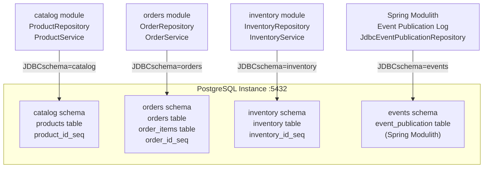

# Database Schema Organization

> **Relevant source files**
> * [README-API.md](https://github.com/philipz/spring-modular-monolith/blob/30c9bf30/README-API.md)
> * [README.md](https://github.com/philipz/spring-modular-monolith/blob/30c9bf30/README.md)
> * [compose.yml](https://github.com/philipz/spring-modular-monolith/blob/30c9bf30/compose.yml)
> * [docs/API_ANALYSIS_SUMMARY.txt](https://github.com/philipz/spring-modular-monolith/blob/30c9bf30/docs/API_ANALYSIS_SUMMARY.txt)
> * [docs/REST_API_ANALYSIS.md](https://github.com/philipz/spring-modular-monolith/blob/30c9bf30/docs/REST_API_ANALYSIS.md)
> * [docs/bookstore-microservices.png](https://github.com/philipz/spring-modular-monolith/blob/30c9bf30/docs/bookstore-microservices.png)
> * [docs/improvement.md](https://github.com/philipz/spring-modular-monolith/blob/30c9bf30/docs/improvement.md)
> * [docs/orders-data-ownership-analysis.md](https://github.com/philipz/spring-modular-monolith/blob/30c9bf30/docs/orders-data-ownership-analysis.md)
> * [docs/orders-module-boundary-analysis.md](https://github.com/philipz/spring-modular-monolith/blob/30c9bf30/docs/orders-module-boundary-analysis.md)
> * [docs/orders-traffic-migration.md](https://github.com/philipz/spring-modular-monolith/blob/30c9bf30/docs/orders-traffic-migration.md)
> * [k6.js](https://github.com/philipz/spring-modular-monolith/blob/30c9bf30/k6.js)
> * [pom.xml](https://github.com/philipz/spring-modular-monolith/blob/30c9bf30/pom.xml)
> * [src/main/resources/application.properties](https://github.com/philipz/spring-modular-monolith/blob/30c9bf30/src/main/resources/application.properties)
> * [src/test/java/com/sivalabs/bookstore/BookStoreApplicationTests.java](https://github.com/philipz/spring-modular-monolith/blob/30c9bf30/src/test/java/com/sivalabs/bookstore/BookStoreApplicationTests.java)
> * [src/test/java/com/sivalabs/bookstore/TestcontainersConfiguration.java](https://github.com/philipz/spring-modular-monolith/blob/30c9bf30/src/test/java/com/sivalabs/bookstore/TestcontainersConfiguration.java)

This page describes how the Spring Modular Monolith organizes its data persistence layer using a multi-schema PostgreSQL architecture. Each business module owns its dedicated schema within a shared database instance, providing logical isolation while maintaining operational simplicity. For information about how Liquibase manages schema migrations, see [Liquibase Schema Management](/philipz/spring-modular-monolith/4.2-liquibase-schema-management). For details on cache persistence patterns, see [MapStore Write-Through Pattern](/philipz/spring-modular-monolith/5.2-mapstore-write-through-pattern).

---

## Multi-Schema Architecture Overview

The application uses a **database-per-module** pattern implemented through PostgreSQL schemas. While a single PostgreSQL instance hosts multiple schemas, each module treats its schema as an isolated data store, enforcing module boundaries at the persistence layer.



**Key Characteristics:**

* **Logical Isolation**: Each schema namespace prevents accidental cross-module table access
* **Physical Sharing**: Single PostgreSQL instance simplifies operations (backups, connection pooling, monitoring)
* **Ownership Clarity**: Module teams control their schema evolution independently
* **Migration Independence**: Liquibase change logs per module prevent merge conflicts

**Sources:**

* [compose.yml L2-L17](https://github.com/philipz/spring-modular-monolith/blob/30c9bf30/compose.yml#L2-L17)
* [README.md L136-L139](https://github.com/philipz/spring-modular-monolith/blob/30c9bf30/README.md#L136-L139)
* [application.properties L7-L25](https://github.com/philipz/spring-modular-monolith/blob/30c9bf30/application.properties#L7-L25)

---

## Schema-to-Module Mapping

Each business module declares its schema ownership through Liquibase configuration and JPA entity mapping. The following table shows the complete mapping:

| Module | Schema Name | Tables | Primary Entity | Liquibase Changelog |
| --- | --- | --- | --- | --- |
| **catalog** | `catalog` | `products` | `Product` | `db/migration/catalog/` |
| **orders** | `orders` | `orders`, `order_items` | `Order`, `OrderItem` | `db/migration/orders/` |
| **inventory** | `inventory` | `inventory` | `Inventory` | `db/migration/inventory/` |
| **Spring Modulith** | `events` | `event_publication` | N/A (framework-managed) | Auto-initialized by framework |


**Schema Configuration:**

The monolith's single datasource connection [application.properties L8](https://github.com/philipz/spring-modular-monolith/blob/30c9bf30/application.properties#L8-L8)

 points to the PostgreSQL instance without specifying a default schema. Each JPA entity uses `@Table(schema = "...")` annotations to target its module's schema, while Liquibase changesets explicitly declare their schema context.

**Sources:**

* [README.md L10-L14](https://github.com/philipz/spring-modular-monolith/blob/30c9bf30/README.md#L10-L14)
* [docs/orders-data-ownership-analysis.md L3-L5](https://github.com/philipz/spring-modular-monolith/blob/30c9bf30/docs/orders-data-ownership-analysis.md#L3-L5)
* [application.properties L21-L25](https://github.com/philipz/spring-modular-monolith/blob/30c9bf30/application.properties#L21-L25)

---

## Physical Database Deployment

The system deploys **two separate PostgreSQL instances** to support the strangler pattern migration where the `orders-service` microservice has been extracted:


**Connection Configuration:**

| Service | Environment Variable | Target |
| --- | --- | --- |
| `monolith` | `SPRING_DATASOURCE_URL` | `jdbc:postgresql://postgres:5432/postgres` |
| `orders-service` | `SPRING_DATASOURCE_URL` | `jdbc:postgresql://orders-postgres:5432/postgres` |
| `amqp-modulith` | `SPRING_DATASOURCE_URL` | `jdbc:postgresql://orders-postgres:5432/postgres` |

The monolith maintains a connection pool of up to 200 connections [compose.yml L66](https://github.com/philipz/spring-modular-monolith/blob/30c9bf30/compose.yml#L66-L66)

 shared across all schemas, while `orders-service` has its own pool [compose.yml L100](https://github.com/philipz/spring-modular-monolith/blob/30c9bf30/compose.yml#L100-L100)

 for independence.

**Sources:**

* [compose.yml L2-L32](https://github.com/philipz/spring-modular-monolith/blob/30c9bf30/compose.yml#L2-L32)
* [compose.yml L58-L86](https://github.com/philipz/spring-modular-monolith/blob/30c9bf30/compose.yml#L58-L86)
* [compose.yml L88-L117](https://github.com/philipz/spring-modular-monolith/blob/30c9bf30/compose.yml#L88-L117)
* [README.md L5](https://github.com/philipz/spring-modular-monolith/blob/30c9bf30/README.md#L5-L5)

---

## Schema Isolation Enforcement

### JPA Entity Schema Binding

Each module's JPA entities use `@Table(schema = "...")` annotations to bind to their designated schema. This prevents accidental cross-module data access at the ORM layer:

```
catalog/domain/Product.java:
  @Entity
  @Table(schema = "catalog")
  
orders/domain/Order.java:
  @Entity
  @Table(schema = "orders")
  
inventory/domain/Inventory.java:
  @Entity
  @Table(schema = "inventory")
```

### Repository Access Boundaries

Module repositories are package-private or internal to their module, preventing external access:


Cross-module interactions flow exclusively through:

1. **Exported APIs**: `ProductApi`, `OrdersApi` interfaces
2. **Domain Events**: `OrderCreatedEvent` published via Spring Modulith
3. **gRPC Services**: `OrdersGrpcService` for external access

Direct repository references across module boundaries are detected and rejected by `ModularityTests` [docs/orders-module-boundary-analysis.md L4-L5](https://github.com/philipz/spring-modular-monolith/blob/30c9bf30/docs/orders-module-boundary-analysis.md#L4-L5)

**Sources:**

* [docs/orders-data-ownership-analysis.md L7-L14](https://github.com/philipz/spring-modular-monolith/blob/30c9bf30/docs/orders-data-ownership-analysis.md#L7-L14)
* [docs/orders-module-boundary-analysis.md L9-L15](https://github.com/philipz/spring-modular-monolith/blob/30c9bf30/docs/orders-module-boundary-analysis.md#L9-L15)

---

## Spring Modulith Events Schema

The `events` schema stores the **event publication log** for Spring Modulith's transactional outbox pattern:


**Configuration:**

[application.properties L37-L40](https://github.com/philipz/spring-modular-monolith/blob/30c9bf30/application.properties#L37-L40)

 configures the events schema:

```
spring.modulith.events.jdbc.schema=events
spring.modulith.events.jdbc.schema-initialization.enabled=true
spring.modulith.events.republish-outstanding-events-on-restart=true
```

The framework automatically creates the `event_publication` table in the `events` schema during startup. Events remain in this table until successfully consumed by all listeners, providing **guaranteed delivery** and **exactly-once processing** semantics.

**Sources:**

* [application.properties L36-L40](https://github.com/philipz/spring-modular-monolith/blob/30c9bf30/application.properties#L36-L40)
* [README.md L28](https://github.com/philipz/spring-modular-monolith/blob/30c9bf30/README.md#L28-L28)

---

## Database-per-Service Migration Pattern

The extracted `orders-service` demonstrates the **database-per-service** pattern while maintaining backward compatibility:

### Migration Stages

| Stage | Monolith `orders` Schema | Orders-Service Database | Client Routing |
| --- | --- | --- | --- |
| **Phase 0**: Monolith only | Read/Write (active) | N/A | All traffic to monolith |
| **Phase 1**: Dual-write | Read/Write (active) | Read/Write (sync via events) | Monolith gRPC → orders-service |
| **Phase 2**: Service active | Read-only (fallback) | Read/Write (primary) | nginx routes API traffic |
| **Phase 3**: Decommission | Archived or dropped | Read/Write (sole owner) | Direct to orders-service |

### Schema Synchronization

The `orders` schema exists in **both databases** during the transition:


The `orders-service` connects to its dedicated PostgreSQL instance [compose.yml L97](https://github.com/philipz/spring-modular-monolith/blob/30c9bf30/compose.yml#L97-L97)

 while the monolith retains its multi-schema connection. The nginx proxy [docs/orders-traffic-migration.md L7-L19](https://github.com/philipz/spring-modular-monolith/blob/30c9bf30/docs/orders-traffic-migration.md#L7-L19)

 gradually shifts traffic using the `ORDERS_SERVICE_PERCENT` environment variable.

**Sources:**

* [compose.yml L19-L32](https://github.com/philipz/spring-modular-monolith/blob/30c9bf30/compose.yml#L19-L32)
* [compose.yml L88-L117](https://github.com/philipz/spring-modular-monolith/blob/30c9bf30/compose.yml#L88-L117)
* [docs/orders-traffic-migration.md L1-L69](https://github.com/philipz/spring-modular-monolith/blob/30c9bf30/docs/orders-traffic-migration.md#L1-L69)

---

## Benefits of Schema-per-Module

| Benefit | Implementation |
| --- | --- |
| **Modularity Enforcement** | JPA entities bound to schemas prevent cross-module repository access |
| **Independent Evolution** | Each module's Liquibase changelog evolves without merge conflicts |
| **Gradual Extraction** | Schemas can be migrated to separate databases (e.g., orders-service) |
| **Performance Isolation** | Connection pool exhaustion in one module doesn't block others |
| **Security Boundaries** | Future: database roles per schema for fine-grained access control |
| **Testing Simplicity** | Testcontainers create a single PostgreSQL instance for all schemas |

**Operational Simplicity:**

Despite logical isolation, all modules share:

* Single database backup/restore process
* Unified connection pooling [application.properties L11](https://github.com/philipz/spring-modular-monolith/blob/30c9bf30/application.properties#L11-L11)
* One Testcontainers instance [TestcontainersConfiguration.java L17](https://github.com/philipz/spring-modular-monolith/blob/30c9bf30/TestcontainersConfiguration.java#L17-L17)
* Shared HikariCP connection pool with 200 max connections [compose.yml L66](https://github.com/philipz/spring-modular-monolith/blob/30c9bf30/compose.yml#L66-L66)

**Sources:**

* [README.md L136-L139](https://github.com/philipz/spring-modular-monolith/blob/30c9bf30/README.md#L136-L139)
* [TestcontainersConfiguration.java L14-L33](https://github.com/philipz/spring-modular-monolith/blob/30c9bf30/TestcontainersConfiguration.java#L14-L33)
* [docs/orders-module-boundary-analysis.md L26-L30](https://github.com/philipz/spring-modular-monolith/blob/30c9bf30/docs/orders-module-boundary-analysis.md#L26-L30)

---

## Liquibase Schema Management

Liquibase applies migrations per schema through a **master changelog** that delegates to module-specific changelogs:

```markdown
src/main/resources/db/
├── db.changelog-master.xml          # Main entry point
└── migration/
    ├── catalog/
    │   ├── V1__catalog_create_products_table.sql
    │   └── V2__catalog_add_products_data.sql
    ├── orders/
    │   ├── V4__orders_create_orders_table.sql
    │   └── V5__orders_add_orders_data.sql
    └── inventory/
        ├── V7__inventory_create_inventory_table.sql
        └── V8__inventory_add_inventory_data.sql
```

Each SQL migration file includes an explicit schema declaration:

```sql
-- V4__orders_create_orders_table.sql
CREATE TABLE orders.orders (
    order_id BIGSERIAL PRIMARY KEY,
    order_number VARCHAR(255) NOT NULL,
    ...
);

CREATE SEQUENCE orders.order_id_seq;
```

For detailed migration management including rollback strategies and CI integration, see [Liquibase Schema Management](/philipz/spring-modular-monolith/4.2-liquibase-schema-management).

**Sources:**

* [README.md L136-L139](https://github.com/philipz/spring-modular-monolith/blob/30c9bf30/README.md#L136-L139)
* [application.properties L20-L25](https://github.com/philipz/spring-modular-monolith/blob/30c9bf30/application.properties#L20-L25)
* [pom.xml L99-L101](https://github.com/philipz/spring-modular-monolith/blob/30c9bf30/pom.xml#L99-L101)