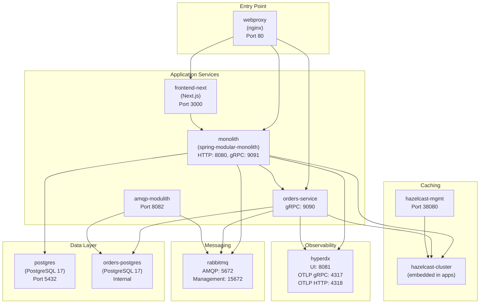
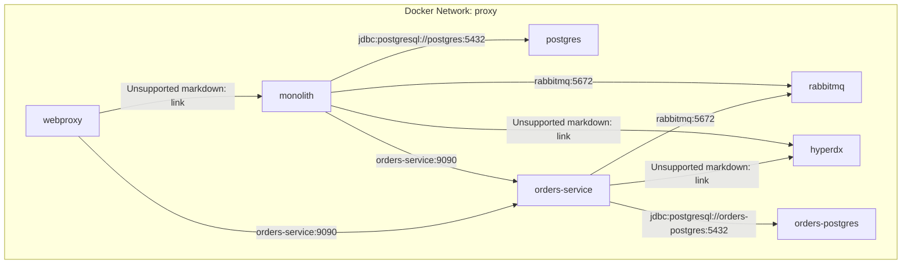
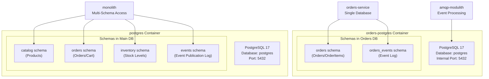
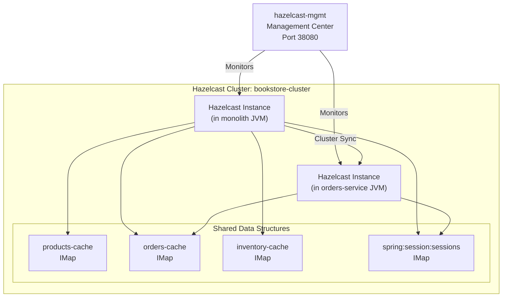
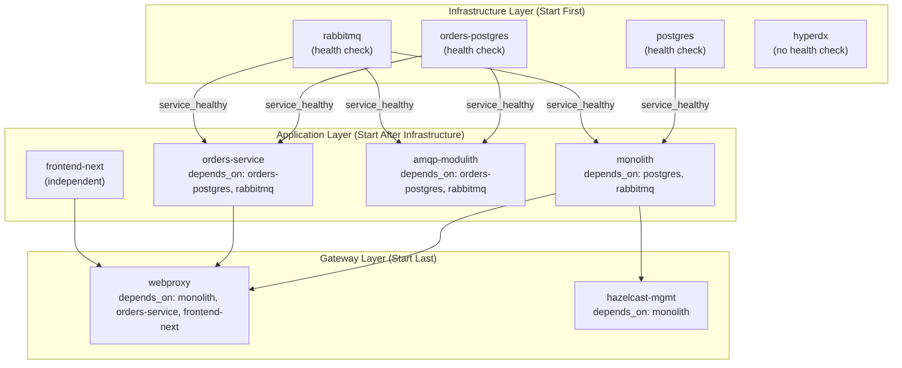
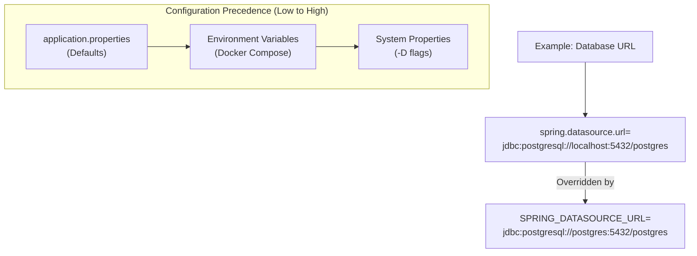

# Deployment and Infrastructure

> **Relevant source files**
> * [Taskfile.yml](https://github.com/philipz/spring-modular-monolith/blob/30c9bf30/Taskfile.yml)
> * [compose.yml](https://github.com/philipz/spring-modular-monolith/blob/30c9bf30/compose.yml)
> * [k8s/manifests/rabbitmq.yaml](https://github.com/philipz/spring-modular-monolith/blob/30c9bf30/k8s/manifests/rabbitmq.yaml)
> * [pom.xml](https://github.com/philipz/spring-modular-monolith/blob/30c9bf30/pom.xml)
> * [src/main/resources/application.properties](https://github.com/philipz/spring-modular-monolith/blob/30c9bf30/src/main/resources/application.properties)
> * [src/test/java/com/sivalabs/bookstore/BookStoreApplicationTests.java](https://github.com/philipz/spring-modular-monolith/blob/30c9bf30/src/test/java/com/sivalabs/bookstore/BookStoreApplicationTests.java)
> * [src/test/java/com/sivalabs/bookstore/TestcontainersConfiguration.java](https://github.com/philipz/spring-modular-monolith/blob/30c9bf30/src/test/java/com/sivalabs/bookstore/TestcontainersConfiguration.java)

## Purpose and Scope

This document provides comprehensive guidance for deploying the Spring Modular Monolith application across different environments. It covers the complete infrastructure stack including databases, message queues, caching, observability, and reverse proxy configuration. This page focuses on deployment mechanics and infrastructure topology; for application configuration details, see [Configuration Reference](/philipz/spring-modular-monolith/15-configuration-reference). For traffic migration strategies between monolith and microservices, see [Traffic Migration Strategy](/philipz/spring-modular-monolith/10.4-traffic-migration-strategy).

---

## Deployment Architecture Overview

The application can be deployed in two primary modes:

1. **Docker Compose** - Recommended for local development and testing
2. **Kubernetes with Kind** - For cluster-based development and staging

Both deployment modes provide the complete infrastructure stack required to run the modular monolith alongside the extracted orders microservice.

### Complete Service Topology



**Sources:** [compose.yml L1-L189](https://github.com/philipz/spring-modular-monolith/blob/30c9bf30/compose.yml#L1-L189)

---

## Docker Compose Deployment

The Docker Compose deployment is defined in `compose.yml` and provides a complete, self-contained environment with all infrastructure services.

### Service Definitions

| Service | Image | Ports | Purpose |
| --- | --- | --- | --- |
| `postgres` | `postgres:17-alpine` | 5432 | Main database for monolith (multi-schema) |
| `orders-postgres` | `postgres:17-alpine` | Internal | Dedicated database for orders-service |
| `rabbitmq` | `rabbitmq:4.1.3-management-alpine` | 5672, 15672 | Message broker with management UI |
| `hyperdx` | `hyperdx-all-in-one` | 8081, 4317, 4318 | Observability platform (UI + OTLP) |
| `monolith` | `sivaprasadreddy/spring-modular-monolith:0.0.1-SNAPSHOT` | None | Main Spring Boot application |
| `orders-service` | `philipz/orders-service:0.0.1-SNAPSHOT` | 9090 | Extracted orders microservice (gRPC) |
| `amqp-modulith` | `philipz/amqp-modulith:0.0.1-SNAPSHOT` | 8082 | AMQP event processor |
| `frontend-next` | Built from `./frontend-next` | 3000 | Next.js frontend application |
| `webproxy` | Built from `./webproxy` | 80 | Nginx reverse proxy with OpenTelemetry |
| `hazelcast-mgmt` | `hazelcast/management-center:latest` | 38080 | Hazelcast management console |

**Sources:** [compose.yml L1-L189](https://github.com/philipz/spring-modular-monolith/blob/30c9bf30/compose.yml#L1-L189)

### Starting the Application Stack

The application uses Taskfile for build and deployment automation:

```markdown
# Build Docker image and start all services
task start

# Stop all services
task stop

# Restart services (rebuild + restart)
task restart
```

The `task start` command executes:

1. `./mvnw clean protobuf:compile package spring-boot:build-image -DskipTests` - Compiles protobuf definitions, packages application, and builds Docker image
2. `docker compose up --force-recreate -d` - Starts all services in detached mode

**Sources:** [Taskfile.yml L22-L40](https://github.com/philipz/spring-modular-monolith/blob/30c9bf30/Taskfile.yml#L22-L40)

 [pom.xml L277-L292](https://github.com/philipz/spring-modular-monolith/blob/30c9bf30/pom.xml#L277-L292)

### Network Architecture

All services communicate over a single Docker network named `proxy`:



Service discovery uses Docker's built-in DNS, allowing services to reference each other by container name (e.g., `postgres`, `rabbitmq`).

**Sources:** [compose.yml L187-L189](https://github.com/philipz/spring-modular-monolith/blob/30c9bf30/compose.yml#L187-L189)

 [compose.yml L62-L76](https://github.com/philipz/spring-modular-monolith/blob/30c9bf30/compose.yml#L62-L76)

 [compose.yml L95-L117](https://github.com/philipz/spring-modular-monolith/blob/30c9bf30/compose.yml#L95-L117)

---

## PostgreSQL Database Infrastructure

### Dual-Database Architecture

The system employs a dual-database strategy to support both monolithic and microservice patterns:



**Configuration:**

| Database | User | Password | Max Connections | Health Check |
| --- | --- | --- | --- | --- |
| postgres | postgres | postgres | 300 | `pg_isready -U postgres -d postgres` |
| orders-postgres | postgres | postgres | 300 | `pg_isready -U postgres -d postgres` |

**Sources:** [compose.yml L2-L17](https://github.com/philipz/spring-modular-monolith/blob/30c9bf30/compose.yml#L2-L17)

 [compose.yml L19-L32](https://github.com/philipz/spring-modular-monolith/blob/30c9bf30/compose.yml#L19-L32)

### Connection Configuration Mapping

The monolith connects to the main `postgres` database:

```yaml
SPRING_DATASOURCE_URL: jdbc:postgresql://postgres:5432/postgres
SPRING_DATASOURCE_USERNAME: postgres
SPRING_DATASOURCE_PASSWORD: postgres
SPRING_DATASOURCE_POOL_SIZE: 200
```

The orders-service uses its dedicated database:

```yaml
SPRING_DATASOURCE_URL: jdbc:postgresql://orders-postgres:5432/postgres
SPRING_DATASOURCE_USERNAME: postgres
SPRING_DATASOURCE_PASSWORD: postgres
SPRING_DATASOURCE_POOL_SIZE: 200
```

**Sources:** [compose.yml L62-L66](https://github.com/philipz/spring-modular-monolith/blob/30c9bf30/compose.yml#L62-L66)

 [compose.yml L97-L100](https://github.com/philipz/spring-modular-monolith/blob/30c9bf30/compose.yml#L97-L100)

 [application.properties L8-L11](https://github.com/philipz/spring-modular-monolith/blob/30c9bf30/application.properties#L8-L11)

### Health Checks

Both PostgreSQL services implement identical health check configurations:

* **Test Command:** `pg_isready -U postgres -d postgres`
* **Interval:** 10 seconds
* **Timeout:** 5 seconds
* **Retries:** 5 attempts before marking unhealthy

Services dependent on databases use `depends_on` with `condition: service_healthy` to ensure databases are ready before application startup.

**Sources:** [compose.yml L8-L12](https://github.com/philipz/spring-modular-monolith/blob/30c9bf30/compose.yml#L8-L12)

 [compose.yml L79-L83](https://github.com/philipz/spring-modular-monolith/blob/30c9bf30/compose.yml#L79-L83)

 [compose.yml L90-L94](https://github.com/philipz/spring-modular-monolith/blob/30c9bf30/compose.yml#L90-L94)

---

## RabbitMQ Message Broker

### Configuration

RabbitMQ provides the external event bus for asynchronous communication between services:

```yaml
rabbitmq:
  image: 'rabbitmq:4.1.3-management-alpine'
  environment:
    - 'RABBITMQ_DEFAULT_USER=guest'
    - 'RABBITMQ_DEFAULT_PASS=guest'
  ports:
    - '5672:5672'    # AMQP protocol
    - '15672:15672'  # Management UI
```

**Access Points:**

* **AMQP Protocol:** `localhost:5672` (for message publishing/consuming)
* **Management UI:** `http://localhost:15672` (username: `guest`, password: `guest`)

**Sources:** [compose.yml L34-L48](https://github.com/philipz/spring-modular-monolith/blob/30c9bf30/compose.yml#L34-L48)

### Application Integration

Applications connect to RabbitMQ using environment variables:

```yaml
SPRING_RABBITMQ_HOST: rabbitmq
SPRING_RABBITMQ_PORT: 5672
SPRING_RABBITMQ_USERNAME: guest
SPRING_RABBITMQ_PASSWORD: guest
```

The `amqp-modulith` and `orders-service` additionally configure channel caching:

```yaml
SPRING_RABBITMQ_CACHE_CHANNEL_SIZE: 300
```

**Sources:** [compose.yml L67-L70](https://github.com/philipz/spring-modular-monolith/blob/30c9bf30/compose.yml#L67-L70)

 [compose.yml L101-L105](https://github.com/philipz/spring-modular-monolith/blob/30c9bf30/compose.yml#L101-L105)

 [compose.yml L130-L134](https://github.com/philipz/spring-modular-monolith/blob/30c9bf30/compose.yml#L130-L134)

 [application.properties L27-L31](https://github.com/philipz/spring-modular-monolith/blob/30c9bf30/application.properties#L27-L31)

### Health Monitoring

RabbitMQ health check:

* **Test Command:** `rabbitmq-diagnostics check_running`
* **Interval:** 10 seconds
* **Timeout:** 5 seconds
* **Retries:** 5 attempts

**Sources:** [compose.yml L42-L46](https://github.com/philipz/spring-modular-monolith/blob/30c9bf30/compose.yml#L42-L46)

---

## HyperDX Observability Platform

HyperDX provides unified observability with traces, metrics, and logs collection via OpenTelemetry Protocol (OTLP).

### Service Configuration

```yaml
hyperdx:
  image: 'docker.hyperdx.io/hyperdx/hyperdx-all-in-one'
  ports:
    - '8081:8080'   # HyperDX UI (remapped to avoid conflict)
    - '4317:4317'   # OpenTelemetry gRPC receiver
    - '4318:4318'   # OpenTelemetry HTTP receiver
```

**Access Points:**

* **UI:** `http://localhost:8081`
* **OTLP gRPC Endpoint:** `http://localhost:4317` (primary, used by all applications)
* **OTLP HTTP Endpoint:** `http://localhost:4318` (alternative)

**Sources:** [compose.yml L49-L56](https://github.com/philipz/spring-modular-monolith/blob/30c9bf30/compose.yml#L49-L56)

### Application Telemetry Configuration

All application services export telemetry to HyperDX using OTLP gRPC protocol:

```yaml
OTLP_ENDPOINT: http://hyperdx:4317
OTLP_GRPC_HEADERS_AUTHORIZATION: ${HYPERDX_API_KEY}
```

The `HYPERDX_API_KEY` environment variable must be set before starting the stack:

```javascript
export HYPERDX_API_KEY=your-api-key-here
docker compose up -d
```

Nginx webproxy also requires this key for authentication:

```yaml
webproxy:
  environment:
    HYPERDX_API_KEY: ${HYPERDX_API_KEY}
```

**Sources:** [compose.yml L72-L73](https://github.com/philipz/spring-modular-monolith/blob/30c9bf30/compose.yml#L72-L73)

 [compose.yml L107-L108](https://github.com/philipz/spring-modular-monolith/blob/30c9bf30/compose.yml#L107-L108)

 [compose.yml L161-L162](https://github.com/philipz/spring-modular-monolith/blob/30c9bf30/compose.yml#L161-L162)

 [application.properties L76-L82](https://github.com/philipz/spring-modular-monolith/blob/30c9bf30/application.properties#L76-L82)

### Tracing Configuration in Application

The application uses OTLP gRPC exporter with optimized settings:

```css
# OpenTelemetry OTLP gRPC exporter configuration
otlp.grpc.enabled=true
otlp.grpc.endpoint=${OTLP_ENDPOINT:http://localhost:4317}
otlp.grpc.timeout=10s
otlp.grpc.compression=gzip
otlp.grpc.headers.authorization=${OTLP_GRPC_HEADERS_AUTHORIZATION:}

# Full sampling for development/staging
management.tracing.enabled=true
management.tracing.sampling.probability=1.0
```

**Sources:** [application.properties L76-L82](https://github.com/philipz/spring-modular-monolith/blob/30c9bf30/application.properties#L76-L82)

 [application.properties L73-L74](https://github.com/philipz/spring-modular-monolith/blob/30c9bf30/application.properties#L73-L74)

For detailed observability configuration, see [OpenTelemetry Configuration](/philipz/spring-modular-monolith/9.1-opentelemetry-configuration) and [Distributed Tracing with HyperDX](/philipz/spring-modular-monolith/9.2-distributed-tracing-with-hyperdx).

---

## Hazelcast Distributed Cache

### Embedded Cluster Architecture

Hazelcast operates as an embedded cache within application JVMs, forming a distributed cluster named `bookstore-cluster`:



**Sources:** [compose.yml L175-L185](https://github.com/philipz/spring-modular-monolith/blob/30c9bf30/compose.yml#L175-L185)

### JVM Optimization for Hazelcast

The monolith requires specific JVM options to support Hazelcast in Java modular environments:

```yaml
monolith:
  environment:
    JDK_JAVA_OPTIONS: "--add-modules java.se 
                       --add-exports java.base/jdk.internal.ref=ALL-UNNAMED 
                       --add-opens java.base/java.lang=ALL-UNNAMED 
                       --add-opens java.base/sun.nio.ch=ALL-UNNAMED 
                       --add-opens java.management/sun.management=ALL-UNNAMED 
                       --add-opens jdk.management/com.sun.management.internal=ALL-UNNAMED"
```

These flags allow Hazelcast to access internal JDK classes required for clustering and management.

**Sources:** [compose.yml L77-L78](https://github.com/philipz/spring-modular-monolith/blob/30c9bf30/compose.yml#L77-L78)

### Management Center

The Hazelcast Management Center provides cluster monitoring and management capabilities:

```yaml
hazelcast-mgmt:
  image: hazelcast/management-center:latest
  environment:
    - HZ_CLUSTERNAME=bookstore-cluster
    - HZ_NETWORK_PORT_AUTOINCREMENT=true
  ports:
    - "38080:8080"
```

**Access:** `http://localhost:38080`

The management center automatically discovers Hazelcast instances in the `bookstore-cluster` through Docker networking.

**Sources:** [compose.yml L175-L185](https://github.com/philipz/spring-modular-monolith/blob/30c9bf30/compose.yml#L175-L185)

For cache configuration details, see [Cache Configuration and MapConfigs](/philipz/spring-modular-monolith/5.1-cache-configuration-and-mapconfigs) and [Cache Properties](/philipz/spring-modular-monolith/15.2-cache-properties).

---

## Frontend and Reverse Proxy

### Next.js Frontend Service

The `frontend-next` service provides the user interface:

```yaml
frontend-next:
  build:
    context: ./frontend-next
    dockerfile: Dockerfile
  environment:
    NODE_ENV: production
    PORT: 3000
    HOSTNAME: 0.0.0.0
    NEXT_PUBLIC_API_URL: /api
    NEXT_API_PROXY_TARGET: http://monolith:8080
  ports:
    - "3000:3000"
```

**Configuration:**

* **NEXT_PUBLIC_API_URL:** Client-side API base path (proxied through nginx)
* **NEXT_API_PROXY_TARGET:** Server-side API proxy target (direct to monolith)

The frontend implements a dual-proxy pattern:

* Client requests go through nginx at `/api/*`
* Server-side rendering connects directly to `http://monolith:8080`

**Sources:** [compose.yml L140-L158](https://github.com/philipz/spring-modular-monolith/blob/30c9bf30/compose.yml#L140-L158)

### Nginx Webproxy

The `webproxy` service provides unified entry point and traffic management:

```yaml
webproxy:
  environment:
    HYPERDX_API_KEY: ${HYPERDX_API_KEY}
  depends_on:
    - monolith
    - orders-service
    - frontend-next
  build:
    context: .
    dockerfile: webproxy/Dockerfile
  ports:
    - "80:80"
```

Nginx routes traffic based on URL paths:

* `/` → `frontend-next:3000`
* `/api/**` → `monolith:8080` or `orders-service:9090` (based on traffic split configuration)

The proxy integrates OpenTelemetry for distributed tracing. For detailed nginx configuration, see [Nginx Reverse Proxy](/philipz/spring-modular-monolith/10.3-nginx-reverse-proxy).

**Sources:** [compose.yml L160-L173](https://github.com/philipz/spring-modular-monolith/blob/30c9bf30/compose.yml#L160-L173)

---

## Application Services Configuration

### Monolith Service Environment

```mermaid
flowchart TD

monolith["monolith Service"]
dbUrl["SPRING_DATASOURCE_URL<br>jdbc:postgresql://postgres:5432/postgres"]
dbUser["SPRING_DATASOURCE_USERNAME: postgres"]
dbPass["SPRING_DATASOURCE_PASSWORD: postgres"]
dbPool["SPRING_DATASOURCE_POOL_SIZE: 200"]
rabbitmqHost["SPRING_RABBITMQ_HOST: rabbitmq"]
rabbitmqPort["SPRING_RABBITMQ_PORT: 5672"]
rabbitmqUser["SPRING_RABBITMQ_USERNAME: guest"]
rabbitmqPass["SPRING_RABBITMQ_PASSWORD: guest"]
otlpEndpoint["OTLP_ENDPOINT<br>Unsupported markdown: link"]
otlpAuth["OTLP_GRPC_HEADERS_AUTHORIZATION<br>HYPERDX_API_KEY"]
grpcTarget["BOOKSTORE_GRPC_CLIENT_TARGET<br>orders-service:9090"]

monolith --> dbUrl
monolith --> dbUser
monolith --> dbPass
monolith --> dbPool
monolith --> rabbitmqHost
monolith --> rabbitmqPort
monolith --> rabbitmqUser
monolith --> rabbitmqPass
monolith --> otlpEndpoint
monolith --> otlpAuth
monolith --> grpcTarget

subgraph subGraph3 ["gRPC Client Configuration"]
    grpcTarget
end

subgraph subGraph2 ["Observability Configuration"]
    otlpEndpoint
    otlpAuth
end

subgraph subGraph1 ["Messaging Configuration"]
    rabbitmqHost
    rabbitmqPort
    rabbitmqUser
    rabbitmqPass
end

subgraph subGraph0 ["Database Configuration"]
    dbUrl
    dbUser
    dbPass
    dbPool
end
```



**Key Configuration:**

* **gRPC Client Target:** `orders-service:9090` - Routes gRPC calls to the extracted orders microservice
* **Database Pool Size:** 200 connections (increased from default 10 to support concurrent load)
* **No REST API URL:** Previously used `ORDERS_SERVICE_API_URL`, now removed after gRPC migration

**Sources:** [compose.yml L58-L86](https://github.com/philipz/spring-modular-monolith/blob/30c9bf30/compose.yml#L58-L86)

### Orders Service Environment

The `orders-service` operates independently with its own database:

```yaml
orders-service:
  environment:
    SPRING_PROFILES_ACTIVE: docker
    SPRING_DATASOURCE_URL: jdbc:postgresql://orders-postgres:5432/postgres
    SPRING_DATASOURCE_USERNAME: postgres
    SPRING_DATASOURCE_PASSWORD: postgres
    SPRING_DATASOURCE_POOL_SIZE: 200
    SPRING_RABBITMQ_HOST: rabbitmq
    SPRING_RABBITMQ_PORT: 5672
    SPRING_RABBITMQ_CACHE_CHANNEL_SIZE: 300
    OTLP_ENDPOINT: http://hyperdx:4317
    SPRING_MODULITH_EVENTS_SCHEMA: orders_events
    PRODUCT_API_BASE_URL: http://monolith:8080
  ports:
    - "9090:9090"  # gRPC server port
```

**Notable Configuration:**

* **SPRING_MODULITH_EVENTS_SCHEMA:** Uses `orders_events` schema for event publication log
* **PRODUCT_API_BASE_URL:** Calls back to monolith for product price validation
* **SPRING_RABBITMQ_CACHE_CHANNEL_SIZE:** 300 channels for high-throughput messaging

**Sources:** [compose.yml L88-L117](https://github.com/philipz/spring-modular-monolith/blob/30c9bf30/compose.yml#L88-L117)

### AMQP Modulith Event Processor

The `amqp-modulith` service consumes events from RabbitMQ and processes them:

```yaml
amqp-modulith:
  environment:
    SPRING_DATASOURCE_URL: jdbc:postgresql://orders-postgres:5432/postgres
    SPRING_RABBITMQ_HOST: rabbitmq
    SPRING_RABBITMQ_CACHE_CHANNEL_SIZE: 300
  ports:
    - "8082:8082"
```

This service shares the `orders-postgres` database with `orders-service` but operates independently, consuming events from the RabbitMQ queue.

**Sources:** [compose.yml L119-L138](https://github.com/philipz/spring-modular-monolith/blob/30c9bf30/compose.yml#L119-L138)

---

## Dependency and Startup Order

Docker Compose manages service startup order using `depends_on` with health check conditions:



The startup order ensures:

1. Infrastructure services (databases, message broker) start and become healthy
2. Application services wait for infrastructure health checks before starting
3. Gateway services (nginx, management UIs) start after applications are available

**Sources:** [compose.yml L79-L86](https://github.com/philipz/spring-modular-monolith/blob/30c9bf30/compose.yml#L79-L86)

 [compose.yml L90-L94](https://github.com/philipz/spring-modular-monolith/blob/30c9bf30/compose.yml#L90-L94)

 [compose.yml L121-L125](https://github.com/philipz/spring-modular-monolith/blob/30c9bf30/compose.yml#L121-L125)

 [compose.yml L163-L166](https://github.com/philipz/spring-modular-monolith/blob/30c9bf30/compose.yml#L163-L166)

 [compose.yml L176-L177](https://github.com/philipz/spring-modular-monolith/blob/30c9bf30/compose.yml#L176-L177)

---

## Kubernetes Deployment with Kind

For Kubernetes-based deployments, the repository provides manifests and tooling for Kind (Kubernetes in Docker) clusters.

### Kind Cluster Management

The `Taskfile.yml` provides commands for Kind cluster lifecycle:

```python
# Create a Kind cluster named "sivalabs-k8s"
task kind_create

# Deploy application to Kubernetes
task k8s_deploy

# Remove application from Kubernetes
task k8s_undeploy

# Destroy the Kind cluster
task kind_destroy
```

**Sources:** [Taskfile.yml L42-L57](https://github.com/philipz/spring-modular-monolith/blob/30c9bf30/Taskfile.yml#L42-L57)

### Kubernetes Deployment Workflow

The `k8s_deploy` task performs:

1. Load Docker image into Kind cluster: ``` kind load docker-image sivaprasadreddy/spring-modular-monolith --name sivalabs-k8s ```
2. Apply Kubernetes manifests: ``` kubectl apply -f k8s/manifests/ ```

**Sources:** [Taskfile.yml L50-L53](https://github.com/philipz/spring-modular-monolith/blob/30c9bf30/Taskfile.yml#L50-L53)

### RabbitMQ Kubernetes Manifest Example

The `k8s/manifests/rabbitmq.yaml` demonstrates the Kubernetes deployment pattern:

```yaml
apiVersion: v1
kind: Service
metadata:
  name: spring-modular-monolith-rabbitmq-svc
spec:
  type: NodePort
  selector:
    app: spring-modular-monolith-rabbitmq-pod
  ports:
    - name: rabbitmq-port-mapping
      port: 5672
      targetPort: 5672
    - name: rabbitmq-gui-port-mapping
      port: 15672
      targetPort: 15672
      nodePort: 30091
---
apiVersion: apps/v1
kind: Deployment
metadata:
  name: spring-modular-monolith-rabbitmq-deployment
spec:
  selector:
    matchLabels:
      app: spring-modular-monolith-rabbitmq-pod
  template:
    metadata:
      labels:
        app: spring-modular-monolith-rabbitmq-pod
    spec:
      containers:
        - name: rabbitmq
          image: "rabbitmq:4.1.3-management-alpine"
          ports:
            - containerPort: 5672
            - containerPort: 15672
          env:
            - name: RABBITMQ_DEFAULT_USER
              value: guest
            - name: RABBITMQ_DEFAULT_PASS
              value: guest
```

**Key Features:**

* **Service Type:** NodePort for external access (management UI accessible at `<node-ip>:30091`)
* **Pod Labels:** `app: spring-modular-monolith-rabbitmq-pod` for service selector
* **Environment Variables:** Credentials configured via Kubernetes env array

**Sources:** [k8s/manifests/rabbitmq.yaml L1-L48](https://github.com/philipz/spring-modular-monolith/blob/30c9bf30/k8s/manifests/rabbitmq.yaml#L1-L48)

For complete Kubernetes deployment configuration, see [Kubernetes Deployment with Kind](/philipz/spring-modular-monolith/10.2-kubernetes-deployment-with-kind).

---

## Container Build Process

### Maven Build Configuration

The build process is orchestrated through Maven with Spring Boot's build plugin:

```html
<plugin>
    <groupId>org.springframework.boot</groupId>
    <artifactId>spring-boot-maven-plugin</artifactId>
    <configuration>
        <image>
            <name>${dockerImageName}</name>
        </image>
    </configuration>
</plugin>
```

Where `dockerImageName` is defined as:

```xml
<dockerImageName>sivaprasadreddy/${project.artifactId}:${project.version}</dockerImageName>
```

This produces: `sivaprasadreddy/spring-modular-monolith:0.0.1-SNAPSHOT`

**Sources:** [pom.xml L21](https://github.com/philipz/spring-modular-monolith/blob/30c9bf30/pom.xml#L21-L21)

 [pom.xml L277-L292](https://github.com/philipz/spring-modular-monolith/blob/30c9bf30/pom.xml#L277-L292)

### Protobuf Compilation

Before building the Docker image, Protocol Buffer definitions must be compiled:

```html
<plugin>
    <groupId>org.xolstice.maven.plugins</groupId>
    <artifactId>protobuf-maven-plugin</artifactId>
    <version>0.6.1</version>
    <configuration>
        <protocArtifact>com.google.protobuf:protoc:${protobuf.version}:exe:${os.detected.classifier}</protocArtifact>
        <pluginId>grpc-java</pluginId>
        <pluginArtifact>io.grpc:protoc-gen-grpc-java:${grpc.version}:exe:${os.detected.classifier}</pluginArtifact>
        <protoSourceRoot>${project.basedir}/src/main/proto</protoSourceRoot>
    </configuration>
</plugin>
```

The build command combines both steps:

```go
./mvnw clean protobuf:compile package spring-boot:build-image -DskipTests
```

**Sources:** [pom.xml L293-L318](https://github.com/philipz/spring-modular-monolith/blob/30c9bf30/pom.xml#L293-L318)

 [Taskfile.yml L22-L24](https://github.com/philipz/spring-modular-monolith/blob/30c9bf30/Taskfile.yml#L22-L24)

### OS Detection for Native Compilation

The build uses `os-maven-plugin` to detect the platform for downloading correct native executables:

```xml
<extensions>
    <extension>
        <groupId>kr.motd.maven</groupId>
        <artifactId>os-maven-plugin</artifactId>
        <version>1.7.1</version>
    </extension>
</extensions>
```

This extension sets properties like `${os.detected.classifier}` used by the protobuf plugin.

**Sources:** [pom.xml L269-L275](https://github.com/philipz/spring-modular-monolith/blob/30c9bf30/pom.xml#L269-L275)

---

## Test Infrastructure with Testcontainers

For integration testing, the application uses Testcontainers to provide ephemeral infrastructure:

```python
@TestConfiguration(proxyBeanMethods = false)
@Testcontainers
public class TestcontainersConfiguration {

    @Container
    static PostgreSQLContainer<?> postgres = 
        new PostgreSQLContainer<>(DockerImageName.parse("postgres:17-alpine"));

    @Container
    static RabbitMQContainer rabbitmq = 
        new RabbitMQContainer(DockerImageName.parse("rabbitmq:4.1.3-alpine"));

    @Bean
    @ServiceConnection
    PostgreSQLContainer<?> postgresContainer() {
        return postgres;
    }

    @Bean
    @ServiceConnection
    RabbitMQContainer rabbitmq() {
        return rabbitmq;
    }
}
```

Test infrastructure matches production versions:

* **PostgreSQL:** `postgres:17-alpine`
* **RabbitMQ:** `rabbitmq:4.1.3-alpine` (without management UI for lighter weight)

The `@ServiceConnection` annotation auto-configures Spring Boot properties from container connection details.

**Sources:** [src/test/java/com/sivalabs/bookstore/TestcontainersConfiguration.java L1-L33](https://github.com/philipz/spring-modular-monolith/blob/30c9bf30/src/test/java/com/sivalabs/bookstore/TestcontainersConfiguration.java#L1-L33)

### Test Execution

Tests are executed with the tree reporter for better readability:

```html
<plugin>
    <artifactId>maven-surefire-plugin</artifactId>
    <dependencies>
        <dependency>
            <groupId>me.fabriciorby</groupId>
            <artifactId>maven-surefire-junit5-tree-reporter</artifactId>
            <version>1.4.0</version>
        </dependency>
    </dependencies>
    <configuration>
        <argLine>-Djdk.attach.allowAttachSelf=true -XX:+EnableDynamicAgentLoading</argLine>
        <statelessTestsetInfoReporter implementation="org.apache.maven.plugin.surefire.extensions.junit5.JUnit5StatelessTestsetInfoTreeReporter">
            <theme>UNICODE</theme>
        </statelessTestsetInfoReporter>
    </configuration>
</plugin>
```

The JVM args allow Testcontainers to attach to the running JVM for container management.

**Sources:** [pom.xml L319-L347](https://github.com/philipz/spring-modular-monolith/blob/30c9bf30/pom.xml#L319-L347)

---

## Environment Variables Reference

### Required Environment Variables

| Variable | Purpose | Example | Used By |
| --- | --- | --- | --- |
| `HYPERDX_API_KEY` | Authentication for HyperDX telemetry | `your-api-key` | monolith, orders-service, webproxy |

### Optional Environment Variables

| Variable | Default | Purpose |
| --- | --- | --- |
| `SPRING_DATASOURCE_URL` | `jdbc:postgresql://localhost:5432/postgres` | Database connection URL |
| `SPRING_DATASOURCE_USERNAME` | `postgres` | Database username |
| `SPRING_DATASOURCE_PASSWORD` | `postgres` | Database password |
| `SPRING_DATASOURCE_POOL_SIZE` | `10` | HikariCP connection pool size |
| `SPRING_RABBITMQ_HOST` | `localhost` | RabbitMQ hostname |
| `SPRING_RABBITMQ_PORT` | `5672` | RabbitMQ AMQP port |
| `SPRING_RABBITMQ_USERNAME` | `guest` | RabbitMQ username |
| `SPRING_RABBITMQ_PASSWORD` | `guest` | RabbitMQ password |
| `OTLP_ENDPOINT` | `http://localhost:4317` | OpenTelemetry collector gRPC endpoint |
| `BOOKSTORE_GRPC_CLIENT_TARGET` | `localhost:9091` | gRPC client target for orders service |

**Sources:** [compose.yml L62-L76](https://github.com/philipz/spring-modular-monolith/blob/30c9bf30/compose.yml#L62-L76)

 [compose.yml L95-L113](https://github.com/philipz/spring-modular-monolith/blob/30c9bf30/compose.yml#L95-L113)

 [application.properties L8-L11](https://github.com/philipz/spring-modular-monolith/blob/30c9bf30/application.properties#L8-L11)

 [application.properties L27-L31](https://github.com/philipz/spring-modular-monolith/blob/30c9bf30/application.properties#L27-L31)

 [application.properties L79-L82](https://github.com/philipz/spring-modular-monolith/blob/30c9bf30/application.properties#L79-L82)

---

## Port Allocation Summary

### Externally Accessible Ports

| Port | Service | Protocol | Purpose |
| --- | --- | --- | --- |
| 80 | webproxy | HTTP | Unified entry point (UI + API) |
| 3000 | frontend-next | HTTP | Next.js dev server (direct access) |
| 5432 | postgres | PostgreSQL | Main database (external tools) |
| 5672 | rabbitmq | AMQP | Message broker protocol |
| 8081 | hyperdx | HTTP | HyperDX observability UI |
| 8082 | amqp-modulith | HTTP | Event processor service |
| 9090 | orders-service | gRPC | Orders microservice gRPC API |
| 15672 | rabbitmq | HTTP | RabbitMQ management UI |
| 38080 | hazelcast-mgmt | HTTP | Hazelcast management center |
| 4317 | hyperdx | gRPC | OpenTelemetry OTLP gRPC receiver |
| 4318 | hyperdx | HTTP | OpenTelemetry OTLP HTTP receiver |

### Internal-Only Ports

| Port | Service | Protocol | Purpose |
| --- | --- | --- | --- |
| 8080 | monolith | HTTP | Spring Boot REST API (behind nginx) |
| 9091 | monolith | gRPC | Internal gRPC server (for debugging) |
| 5432 | orders-postgres | PostgreSQL | Orders database (internal only) |

**Production Recommendation:** In production, only port 80 (or 443 for HTTPS) should be externally accessible. All other ports should be restricted to internal networks.

**Sources:** [compose.yml L14-L15](https://github.com/philipz/spring-modular-monolith/blob/30c9bf30/compose.yml#L14-L15)

 [compose.yml L39-L41](https://github.com/philipz/spring-modular-monolith/blob/30c9bf30/compose.yml#L39-L41)

 [compose.yml L51-L54](https://github.com/philipz/spring-modular-monolith/blob/30c9bf30/compose.yml#L51-L54)

 [compose.yml L114-L115](https://github.com/philipz/spring-modular-monolith/blob/30c9bf30/compose.yml#L114-L115)

 [compose.yml L135-L136](https://github.com/philipz/spring-modular-monolith/blob/30c9bf30/compose.yml#L135-L136)

 [compose.yml L150-L151](https://github.com/philipz/spring-modular-monolith/blob/30c9bf30/compose.yml#L150-L151)

 [compose.yml L172-L173](https://github.com/philipz/spring-modular-monolith/blob/30c9bf30/compose.yml#L172-L173)

 [compose.yml L184-L185](https://github.com/philipz/spring-modular-monolith/blob/30c9bf30/compose.yml#L184-L185)

---

## Configuration Property Inheritance

Environment variables in Docker Compose override application defaults:



Spring Boot automatically maps environment variables to properties:

* `SPRING_DATASOURCE_URL` → `spring.datasource.url`
* `SPRING_RABBITMQ_HOST` → `spring.rabbitmq.host`

Underscores in environment variable names are converted to dots and lowercase.

**Sources:** [application.properties L8-L11](https://github.com/philipz/spring-modular-monolith/blob/30c9bf30/application.properties#L8-L11)

 [application.properties L27-L31](https://github.com/philipz/spring-modular-monolith/blob/30c9bf30/application.properties#L27-L31)

 [compose.yml L62-L76](https://github.com/philipz/spring-modular-monolith/blob/30c9bf30/compose.yml#L62-L76)

---

## Troubleshooting Deployment Issues

### Database Connection Failures

**Symptom:** Application fails to start with "Connection refused" errors

**Solutions:**

1. Verify PostgreSQL health check is passing: ``` docker compose ps ``` Look for `healthy` status on postgres services.
2. Check database logs: ``` docker compose logs postgres ```
3. Verify connection configuration matches container name: ```yaml SPRING_DATASOURCE_URL: jdbc:postgresql://postgres:5432/postgres ```

**Sources:** [compose.yml L8-L12](https://github.com/philipz/spring-modular-monolith/blob/30c9bf30/compose.yml#L8-L12)

 [compose.yml L62-L66](https://github.com/philipz/spring-modular-monolith/blob/30c9bf30/compose.yml#L62-L66)

### Hazelcast Cluster Formation Issues

**Symptom:** Applications start but Hazelcast warnings about cluster formation

**Solutions:**

1. Ensure `JDK_JAVA_OPTIONS` are set correctly for Java modules: ```yaml JDK_JAVA_OPTIONS: "--add-modules java.se --add-exports java.base/jdk.internal.ref=ALL-UNNAMED ..." ```
2. Verify all services are on the same Docker network (`proxy`)
3. Check Hazelcast Management Center at `http://localhost:38080` for cluster status

**Sources:** [compose.yml L77-L78](https://github.com/philipz/spring-modular-monolith/blob/30c9bf30/compose.yml#L77-L78)

### RabbitMQ Connection Errors

**Symptom:** "Connection refused" to RabbitMQ on port 5672

**Solutions:**

1. Ensure RabbitMQ health check passes: ``` docker compose logs rabbitmq ```
2. Verify environment variables: ```yaml SPRING_RABBITMQ_HOST: rabbitmq SPRING_RABBITMQ_PORT: 5672 ```
3. Access management UI at `http://localhost:15672` to verify broker is operational

**Sources:** [compose.yml L42-L46](https://github.com/philipz/spring-modular-monolith/blob/30c9bf30/compose.yml#L42-L46)

 [compose.yml L67-L70](https://github.com/philipz/spring-modular-monolith/blob/30c9bf30/compose.yml#L67-L70)

### OpenTelemetry Export Failures

**Symptom:** Warnings about failed OTLP exports in application logs

**Solutions:**

1. Verify `HYPERDX_API_KEY` is set: ```php echo $HYPERDX_API_KEY ```
2. Check HyperDX container is running: ``` docker compose ps hyperdx ```
3. Verify OTLP endpoint configuration: ```yaml OTLP_ENDPOINT: http://hyperdx:4317 ```

**Sources:** [compose.yml L72-L73](https://github.com/philipz/spring-modular-monolith/blob/30c9bf30/compose.yml#L72-L73)

 [compose.yml L161-L162](https://github.com/philipz/spring-modular-monolith/blob/30c9bf30/compose.yml#L161-L162)

### gRPC Communication Issues

**Symptom:** Orders service calls fail with "UNAVAILABLE" status

**Solutions:**

1. Verify orders-service is listening on port 9090: ``` docker compose logs orders-service | grep "gRPC server started" ```
2. Check gRPC client target configuration: ```yaml BOOKSTORE_GRPC_CLIENT_TARGET: orders-service:9090 ```
3. Test gRPC health check: ``` grpcurl -plaintext localhost:9090 grpc.health.v1.Health/Check ```

**Sources:** [compose.yml L76](https://github.com/philipz/spring-modular-monolith/blob/30c9bf30/compose.yml#L76-L76)

 [compose.yml L114-L115](https://github.com/philipz/spring-modular-monolith/blob/30c9bf30/compose.yml#L114-L115)

 [application.properties L114-L126](https://github.com/philipz/spring-modular-monolith/blob/30c9bf30/application.properties#L114-L126)

---

## Performance Considerations

### Database Connection Pooling

Connection pool sizes are tuned for containerized environments:

* **Development (default):** 10 connections per application
* **Production (Docker Compose):** 200 connections per application

Database max connections must accommodate all application pools:

* **postgres:** 300 max connections (supports monolith with 200 + headroom)
* **orders-postgres:** 300 max connections (supports orders-service + amqp-modulith)

**Sources:** [compose.yml L13](https://github.com/philipz/spring-modular-monolith/blob/30c9bf30/compose.yml#L13-L13)

 [compose.yml L30](https://github.com/philipz/spring-modular-monolith/blob/30c9bf30/compose.yml#L30-L30)

 [compose.yml L66](https://github.com/philipz/spring-modular-monolith/blob/30c9bf30/compose.yml#L66-L66)

 [compose.yml L100](https://github.com/philipz/spring-modular-monolith/blob/30c9bf30/compose.yml#L100-L100)

### RabbitMQ Channel Caching

High-throughput services use increased channel cache:

```yaml
SPRING_RABBITMQ_CACHE_CHANNEL_SIZE: 300
```

This setting applies to `orders-service` and `amqp-modulith` which handle high message volumes.

**Sources:** [compose.yml L105](https://github.com/philipz/spring-modular-monolith/blob/30c9bf30/compose.yml#L105-L105)

 [compose.yml L134](https://github.com/philipz/spring-modular-monolith/blob/30c9bf30/compose.yml#L134-L134)

### Hazelcast Backup Configuration

Distributed cache uses 1 backup copy for fault tolerance:

```
bookstore.cache.backup-count=1
```

With 2 application instances (monolith + orders-service), each cache entry has 1 primary + 1 backup, providing resilience against single instance failure.

**Sources:** [application.properties L50](https://github.com/philipz/spring-modular-monolith/blob/30c9bf30/application.properties#L50-L50)

### OpenTelemetry Compression

OTLP gRPC exports use gzip compression to reduce network overhead:

```
otlp.grpc.compression=gzip
```

This reduces telemetry data size by approximately 70-80%.

**Sources:** [application.properties L81](https://github.com/philipz/spring-modular-monolith/blob/30c9bf30/application.properties#L81-L81)

---

## Security Considerations

### Default Credentials

**⚠️ WARNING:** The default deployment uses hardcoded credentials suitable only for development:

| Service | Username | Password |
| --- | --- | --- |
| PostgreSQL | `postgres` | `postgres` |
| RabbitMQ | `guest` | `guest` |

**Production Deployment:** Replace all default credentials with secure, randomly generated passwords managed through secrets management (e.g., Kubernetes Secrets, HashiCorp Vault).

**Sources:** [compose.yml L5-L6](https://github.com/philipz/spring-modular-monolith/blob/30c9bf30/compose.yml#L5-L6)

 [compose.yml L22-L24](https://github.com/philipz/spring-modular-monolith/blob/30c9bf30/compose.yml#L22-L24)

 [compose.yml L37-L38](https://github.com/philipz/spring-modular-monolith/blob/30c9bf30/compose.yml#L37-L38)

### Network Isolation

The Docker Compose configuration uses a single `proxy` network for simplicity. For production:

1. Create separate networks for different tiers: * `frontend-network` (webproxy ↔ frontend-next) * `app-network` (applications ↔ databases/cache) * `data-network` (databases only)
2. Apply network policies to restrict inter-service communication

**Sources:** [compose.yml L187-L189](https://github.com/philipz/spring-modular-monolith/blob/30c9bf30/compose.yml#L187-L189)

### API Key Management

The `HYPERDX_API_KEY` must be provided as an environment variable:

```javascript
export HYPERDX_API_KEY=your-secret-key
docker compose up -d
```

**Never commit API keys to version control.** Use:

* `.env` file (git-ignored)
* CI/CD secrets management
* Kubernetes Secrets

**Sources:** [compose.yml L73](https://github.com/philipz/spring-modular-monolith/blob/30c9bf30/compose.yml#L73-L73)

 [compose.yml L162](https://github.com/philipz/spring-modular-monolith/blob/30c9bf30/compose.yml#L162-L162)

---

**Sources:** [compose.yml L1-L189](https://github.com/philipz/spring-modular-monolith/blob/30c9bf30/compose.yml#L1-L189)

 [pom.xml L1-L388](https://github.com/philipz/spring-modular-monolith/blob/30c9bf30/pom.xml#L1-L388)

 [application.properties L1-L150](https://github.com/philipz/spring-modular-monolith/blob/30c9bf30/application.properties#L1-L150)

 [Taskfile.yml L1-L64](https://github.com/philipz/spring-modular-monolith/blob/30c9bf30/Taskfile.yml#L1-L64)

 [k8s/manifests/rabbitmq.yaml L1-L48](https://github.com/philipz/spring-modular-monolith/blob/30c9bf30/k8s/manifests/rabbitmq.yaml#L1-L48)

 [src/test/java/com/sivalabs/bookstore/TestcontainersConfiguration.java L1-L33](https://github.com/philipz/spring-modular-monolith/blob/30c9bf30/src/test/java/com/sivalabs/bookstore/TestcontainersConfiguration.java#L1-L33)