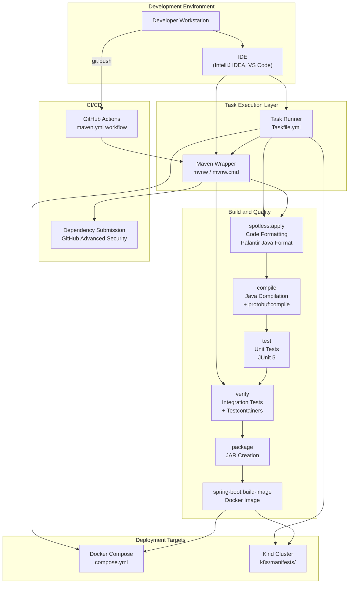
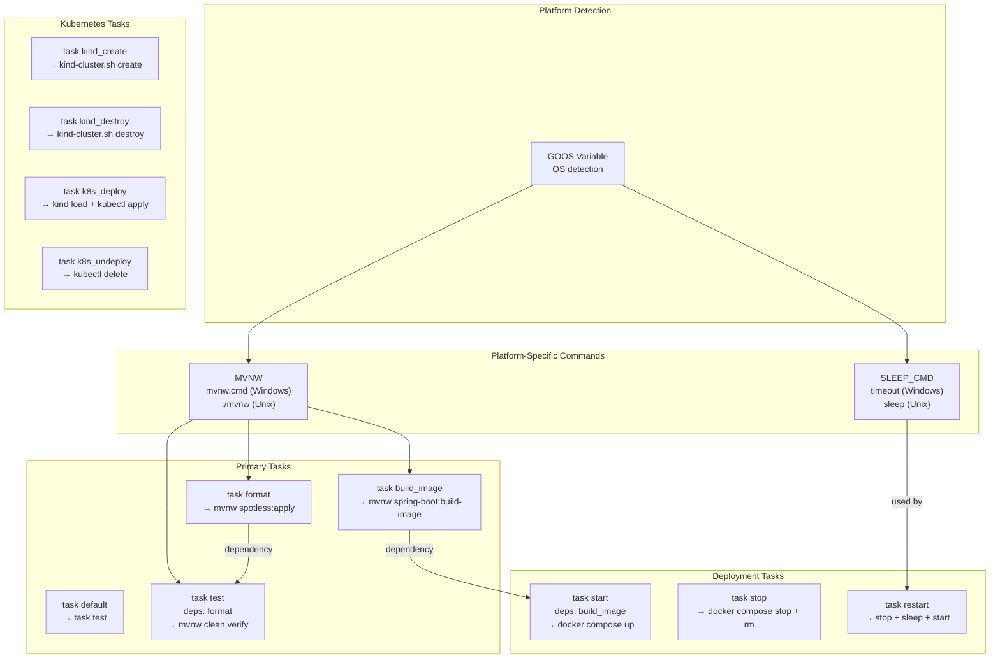
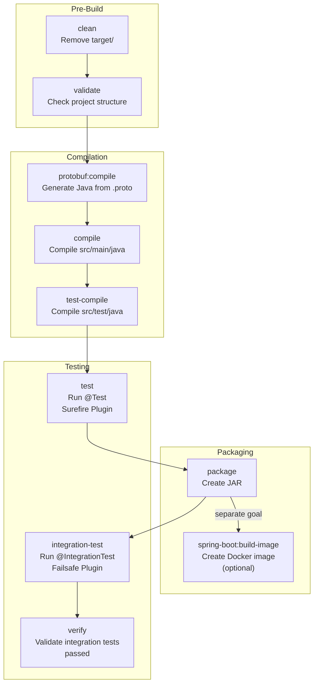
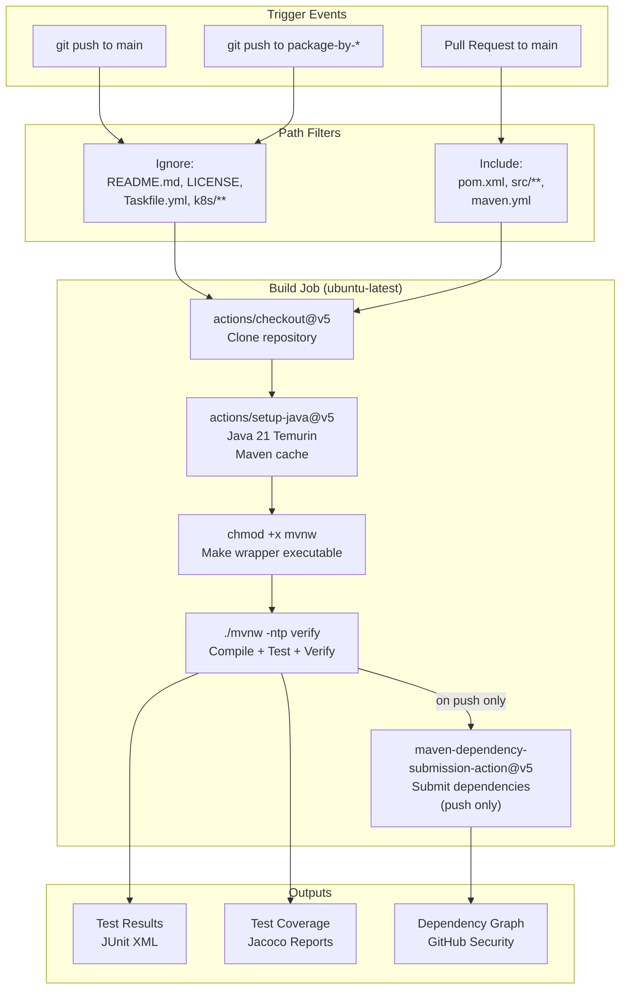

# Development Guide

> **Relevant source files**
> * [.github/workflows/maven.yml](https://github.com/philipz/spring-modular-monolith/blob/30c9bf30/.github/workflows/maven.yml)
> * [.sdkmanrc](https://github.com/philipz/spring-modular-monolith/blob/30c9bf30/.sdkmanrc)
> * [Taskfile.yml](https://github.com/philipz/spring-modular-monolith/blob/30c9bf30/Taskfile.yml)
> * [renovate.json](https://github.com/philipz/spring-modular-monolith/blob/30c9bf30/renovate.json)
> * [src/main/java/com/sivalabs/bookstore/catalog/domain/ProductService.java](https://github.com/philipz/spring-modular-monolith/blob/30c9bf30/src/main/java/com/sivalabs/bookstore/catalog/domain/ProductService.java)

This document provides comprehensive guidelines for developers working on the Spring Modular Monolith codebase. It covers the development workflow, build processes, testing strategies, code quality standards, and tooling configuration.

For detailed information about specific topics:

* Building and running tests: see [Building and Testing](/philipz/spring-modular-monolith/11.1-building-and-testing)
* Code formatting and quality tools: see [Code Quality and Formatting](/philipz/spring-modular-monolith/11.2-code-quality-and-formatting)
* Writing integration tests: see [Integration Testing Strategies](/philipz/spring-modular-monolith/11.3-integration-testing-strategies)
* Creating new modules: see [Adding New Modules](/philipz/spring-modular-monolith/11.4-adding-new-modules)

For deployment and running the application locally, see [Getting Started](/philipz/spring-modular-monolith/2-getting-started).

---

## Prerequisites and Development Environment

### Required Software Versions

The project enforces specific versions of development tools to ensure consistency across development environments:

| Tool | Required Version | Configuration Source |
| --- | --- | --- |
| Java | 21 (Temurin distribution) | [.sdkmanrc L1](https://github.com/philipz/spring-modular-monolith/blob/30c9bf30/.sdkmanrc#L1-L1) |
| Maven | 3.9.11 | [.sdkmanrc L2](https://github.com/philipz/spring-modular-monolith/blob/30c9bf30/.sdkmanrc#L2-L2) |
| Docker | Latest stable | Required for Testcontainers and local deployment |
| Task | Latest | Optional, for simplified task execution |

**SDKMAN Configuration**: The project includes an `.sdkmanrc` file that automatically configures the correct Java and Maven versions when using SDKMAN:

```
sdk env install
sdk env
```

**Maven Wrapper**: The project includes Maven wrapper (`mvnw`/`mvnw.cmd`) to ensure consistent Maven execution without requiring system-wide installation. The GitHub Actions workflow makes the wrapper executable before use: [.github/workflows/maven.yml L40-L41](https://github.com/philipz/spring-modular-monolith/blob/30c9bf30/.github/workflows/maven.yml#L40-L41)

**Sources**: [.sdkmanrc L1-L3](https://github.com/philipz/spring-modular-monolith/blob/30c9bf30/.sdkmanrc#L1-L3)

 [.github/workflows/maven.yml L33-L38](https://github.com/philipz/spring-modular-monolith/blob/30c9bf30/.github/workflows/maven.yml#L33-L38)

---

## Development Workflow Overview



**Workflow Description**:

1. **Local Development**: Developers write code in their IDE and use either Task or Maven wrapper directly
2. **Code Formatting**: `spotless:apply` formats code according to Palantir Java Format standards
3. **Build Pipeline**: Maven executes phases sequentially (compile → test → verify → package)
4. **Image Creation**: `spring-boot:build-image` creates OCI-compliant Docker images using Cloud Native Buildpacks
5. **Local Deployment**: Docker Compose or Kind deploys the built images for testing
6. **CI/CD**: GitHub Actions runs the same Maven build on push/PR and submits dependency snapshots

**Sources**: [Taskfile.yml L1-L64](https://github.com/philipz/spring-modular-monolith/blob/30c9bf30/Taskfile.yml#L1-L64)

 [.github/workflows/maven.yml L1-L48](https://github.com/philipz/spring-modular-monolith/blob/30c9bf30/.github/workflows/maven.yml#L1-L48)

---

## Task-Based Development Commands

The project uses [Taskfile](https://taskfile.dev) to provide platform-independent task execution. The `Taskfile.yml` abstracts differences between Windows and Unix-like systems.

### Task Configuration



### Common Task Commands

| Command | Description | Dependencies |
| --- | --- | --- |
| `task` or `task default` | Runs format + test | `task test` |
| `task test` | Formats code and runs full test suite | `task format` |
| `task format` | Applies Spotless code formatting | None |
| `task build_image` | Builds Docker image with Spring Boot | None |
| `task start` | Builds image and starts Docker Compose stack | `task build_image` |
| `task stop` | Stops and removes Docker Compose containers | None |
| `task restart` | Full restart with 5-second delay | `task stop`, `task start` |
| `task kind_create` | Creates local Kind Kubernetes cluster | None |
| `task kind_destroy` | Destroys Kind cluster | None |
| `task k8s_deploy` | Loads image to Kind and deploys manifests | None |
| `task k8s_undeploy` | Removes Kubernetes resources | None |

**Platform Abstraction**: The Taskfile detects the operating system and selects the appropriate commands:

* **Maven Wrapper**: [Taskfile.yml L5](https://github.com/philipz/spring-modular-monolith/blob/30c9bf30/Taskfile.yml#L5-L5)  selects `mvnw.cmd` on Windows, `./mvnw` otherwise
* **Sleep Command**: [Taskfile.yml L6](https://github.com/philipz/spring-modular-monolith/blob/30c9bf30/Taskfile.yml#L6-L6)  uses `timeout` on Windows, `sleep` on Unix
* **Compose File**: [Taskfile.yml L7](https://github.com/philipz/spring-modular-monolith/blob/30c9bf30/Taskfile.yml#L7-L7)  references `compose.yml` consistently

**Sources**: [Taskfile.yml L1-L64](https://github.com/philipz/spring-modular-monolith/blob/30c9bf30/Taskfile.yml#L1-L64)

---

## Maven Build Process

### Build Command Structure

The Maven wrapper provides the core build functionality. The typical development build command is:

```
./mvnw clean verify
```

This executes the following phases:

1. **clean**: Removes `target/` directory
2. **validate**: Validates project structure
3. **compile**: Compiles main source code and generates Protocol Buffers
4. **test**: Runs unit tests with JUnit 5
5. **package**: Creates JAR file
6. **verify**: Runs integration tests with Testcontainers

### Maven Lifecycle Phases



**Key Maven Goals**:

| Goal | Purpose | When Used |
| --- | --- | --- |
| `clean` | Delete build artifacts | Before fresh build |
| `compile` | Compile Java source | Automatic in build |
| `test` | Run unit tests | Automatic in verify |
| `verify` | Run integration tests | Full test execution |
| `package` | Create JAR | Before deployment |
| `spring-boot:build-image` | Build Docker image | Local/CI deployment |
| `spotless:apply` | Format code | Before commit |
| `protobuf:compile` | Generate gRPC stubs | Automatic in compile |

**CI Build Command**: GitHub Actions uses the no-transfer-progress flag for cleaner logs:

```
./mvnw -ntp verify
```

The `-ntp` flag suppresses progress output during dependency downloads: [.github/workflows/maven.yml L44](https://github.com/philipz/spring-modular-monolith/blob/30c9bf30/.github/workflows/maven.yml#L44-L44)

**Sources**: [.github/workflows/maven.yml L40-L44](https://github.com/philipz/spring-modular-monolith/blob/30c9bf30/.github/workflows/maven.yml#L40-L44)

 [Taskfile.yml L16](https://github.com/philipz/spring-modular-monolith/blob/30c9bf30/Taskfile.yml#L16-L16)

---

## Continuous Integration Pipeline

### GitHub Actions Workflow

The project uses GitHub Actions for continuous integration. The workflow is triggered on:

* **Push events** to `main` and `package-by-*` branches (excluding documentation changes)
* **Pull requests** to `main` affecting Java source or build configuration



**Workflow Configuration Details**:

1. **Path Exclusions** (push events): [.github/workflows/maven.yml L8-L15](https://github.com/philipz/spring-modular-monolith/blob/30c9bf30/.github/workflows/maven.yml#L8-L15) * `.gitignore`, `.sdkmanrc`, `README.md`, `LICENSE` * `Taskfile.yml`, `renovate.json` * `k8s/**` (Kubernetes manifests)
2. **Path Inclusions** (pull requests): [.github/workflows/maven.yml L19-L23](https://github.com/philipz/spring-modular-monolith/blob/30c9bf30/.github/workflows/maven.yml#L19-L23) * `pom.xml` and nested POM files * `src/**` (all source code) * `.github/workflows/maven.yml` (workflow itself)
3. **Java Setup**: [.github/workflows/maven.yml L33-L38](https://github.com/philipz/spring-modular-monolith/blob/30c9bf30/.github/workflows/maven.yml#L33-L38) * Java 21 from Eclipse Temurin distribution * Maven dependency caching enabled * Required for builds and tests
4. **Permissions**: [.github/workflows/maven.yml L28-L29](https://github.com/philipz/spring-modular-monolith/blob/30c9bf30/.github/workflows/maven.yml#L28-L29) * `contents: write` required for dependency submission to GitHub's dependency graph
5. **Dependency Submission**: [.github/workflows/maven.yml L46-L48](https://github.com/philipz/spring-modular-monolith/blob/30c9bf30/.github/workflows/maven.yml#L46-L48) * Only runs on push events (not PRs) * Submits Maven dependency tree to GitHub Advanced Security * Enables Dependabot security alerts

**Sources**: [.github/workflows/maven.yml L1-L48](https://github.com/philipz/spring-modular-monolith/blob/30c9bf30/.github/workflows/maven.yml#L1-L48)

---

## Development Best Practices

### Code Organization Patterns

The codebase follows Spring Modulith conventions with specific patterns visible in service implementations:

**1. Optional Dependency Injection**: Services gracefully handle missing dependencies, particularly for caching infrastructure: [src/main/java/com/sivalabs/bookstore/catalog/domain/ProductService.java L24](https://github.com/philipz/spring-modular-monolith/blob/30c9bf30/src/main/java/com/sivalabs/bookstore/catalog/domain/ProductService.java#L24-L24)

```
ProductService(ProductRepository repo, 
               @Autowired(required = false) ProductCacheService productCacheService) {
    this.repo = repo;
    this.productCacheService = productCacheService;
    // Log cache availability status
}
```

**2. Circuit Breaker Awareness**: Services check cache availability before use: [src/main/java/com/sivalabs/bookstore/catalog/domain/ProductService.java L40-L42](https://github.com/philipz/spring-modular-monolith/blob/30c9bf30/src/main/java/com/sivalabs/bookstore/catalog/domain/ProductService.java#L40-L42)

```java
private boolean isCacheAvailable() {
    return productCacheService != null && !productCacheService.isCircuitBreakerOpen();
}
```

**3. Fallback Patterns**: Services implement graceful degradation when cache is unavailable: [src/main/java/com/sivalabs/bookstore/catalog/domain/ProductService.java L54-L89](https://github.com/philipz/spring-modular-monolith/blob/30c9bf30/src/main/java/com/sivalabs/bookstore/catalog/domain/ProductService.java#L54-L89)

```
// Try cache first if available
if (isCacheAvailable()) {
    Optional<ProductEntity> cachedProduct = productCacheService.findByProductCode(code);
    if (cachedProduct.isPresent()) {
        return cachedProduct;
    }
}
// Fallback to database query
Optional<ProductEntity> product = repo.findByCode(code);
```

**4. Defensive Exception Handling**: Cache operations are wrapped in try-catch to prevent failures from affecting business logic: [src/main/java/com/sivalabs/bookstore/catalog/domain/ProductService.java L64-L69](https://github.com/philipz/spring-modular-monolith/blob/30c9bf30/src/main/java/com/sivalabs/bookstore/catalog/domain/ProductService.java#L64-L69)

**Sources**: [src/main/java/com/sivalabs/bookstore/catalog/domain/ProductService.java L1-L90](https://github.com/philipz/spring-modular-monolith/blob/30c9bf30/src/main/java/com/sivalabs/bookstore/catalog/domain/ProductService.java#L1-L90)

---

## Dependency Management

### Renovate Configuration

The project uses Renovate for automated dependency updates. Configuration is minimal, extending recommended defaults: [renovate.json L1-L6](https://github.com/philipz/spring-modular-monolith/blob/30c9bf30/renovate.json#L1-L6)

```json
{
    "$schema": "https://docs.renovatebot.com/renovate-schema.json",
    "extends": [
        "config:recommended"
    ]
}
```

Renovate automatically:

* Creates pull requests for dependency updates
* Groups related updates together
* Respects semantic versioning rules
* Triggers GitHub Actions builds for validation

### Dependency Submission

The GitHub Actions workflow submits the complete Maven dependency tree to GitHub's dependency graph on every push to main: [.github/workflows/maven.yml L46-L48](https://github.com/philipz/spring-modular-monolith/blob/30c9bf30/.github/workflows/maven.yml#L46-L48)

 This enables:

* **Security Alerts**: Dependabot alerts for known vulnerabilities
* **Dependency Insights**: Visual dependency graph in repository
* **Supply Chain Security**: Track transitive dependencies
* **License Compliance**: Identify dependency licenses

**Sources**: [renovate.json L1-L6](https://github.com/philipz/spring-modular-monolith/blob/30c9bf30/renovate.json#L1-L6)

 [.github/workflows/maven.yml L46-L48](https://github.com/philipz/spring-modular-monolith/blob/30c9bf30/.github/workflows/maven.yml#L46-L48)

---

## Quick Reference

### Essential Commands

```markdown
# Format and test (full verification)
task test

# Format code only
task format

# Build Docker image
task build_image

# Start full stack locally
task start

# Restart services (useful after code changes)
task restart

# Maven commands (direct)
./mvnw clean verify
./mvnw spotless:apply
./mvnw spring-boot:build-image -DskipTests
```

### Debugging Tips

1. **Cache Issues**: Check Hazelcast circuit breaker status in logs
2. **Test Failures**: Review Testcontainers logs in `target/` directory
3. **Build Failures**: Ensure Java 21 is active (`java -version`)
4. **Format Issues**: Run `task format` before committing
5. **Docker Issues**: Check Docker daemon is running for image builds

### Related Documentation

* For detailed testing strategies: see [Integration Testing Strategies](/philipz/spring-modular-monolith/11.3-integration-testing-strategies)
* For code formatting rules: see [Code Quality and Formatting](/philipz/spring-modular-monolith/11.2-code-quality-and-formatting)
* For creating new modules: see [Adding New Modules](/philipz/spring-modular-monolith/11.4-adding-new-modules)
* For deployment procedures: see [Docker Compose Deployment](/philipz/spring-modular-monolith/10.1-docker-compose-deployment)
* For running locally: see [Running Locally with Docker Compose](/philipz/spring-modular-monolith/2.2-running-locally-with-docker-compose)

**Sources**: [Taskfile.yml L1-L64](https://github.com/philipz/spring-modular-monolith/blob/30c9bf30/Taskfile.yml#L1-L64)

 [.github/workflows/maven.yml L1-L48](https://github.com/philipz/spring-modular-monolith/blob/30c9bf30/.github/workflows/maven.yml#L1-L48)

 [.sdkmanrc L1-L3](https://github.com/philipz/spring-modular-monolith/blob/30c9bf30/.sdkmanrc#L1-L3)