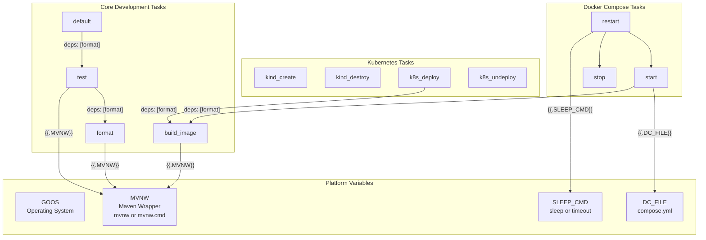
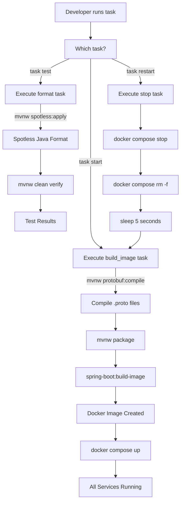
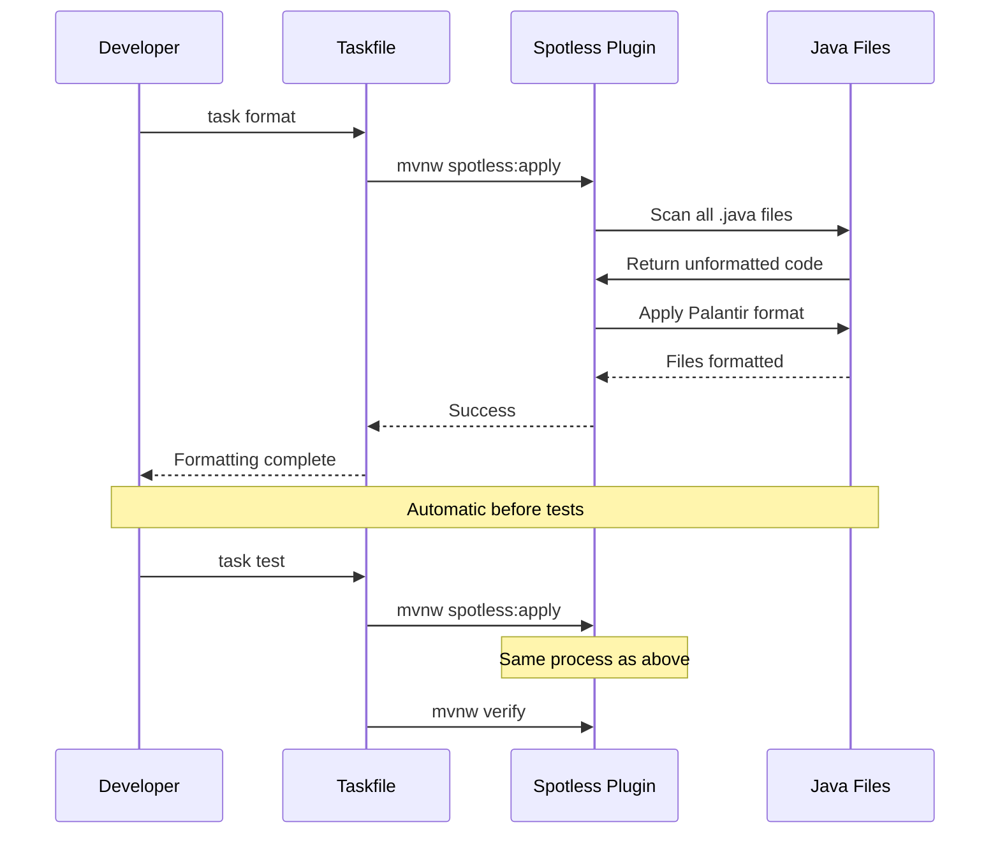
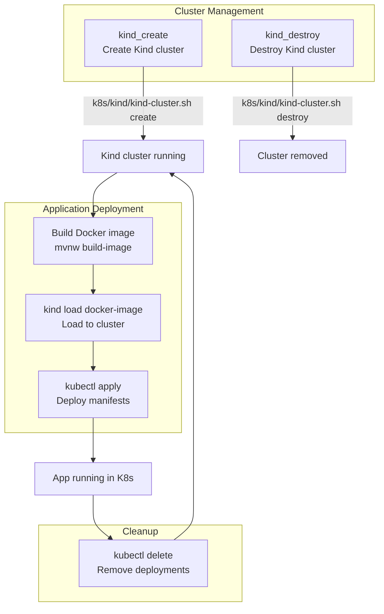
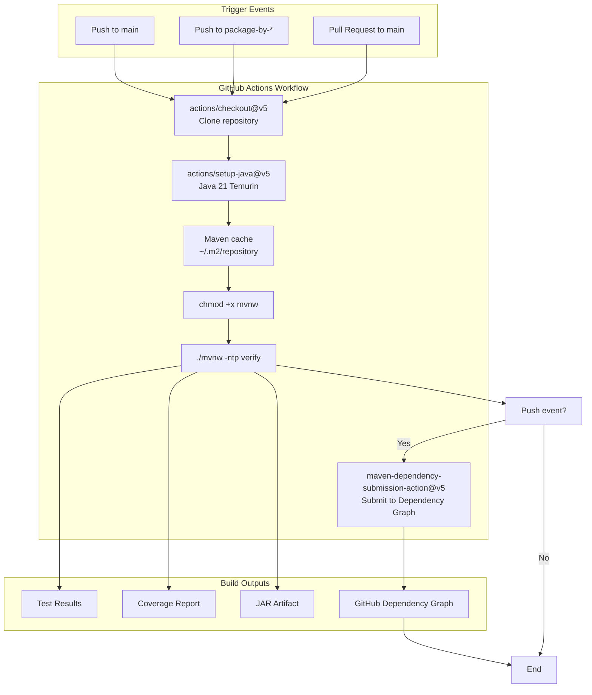
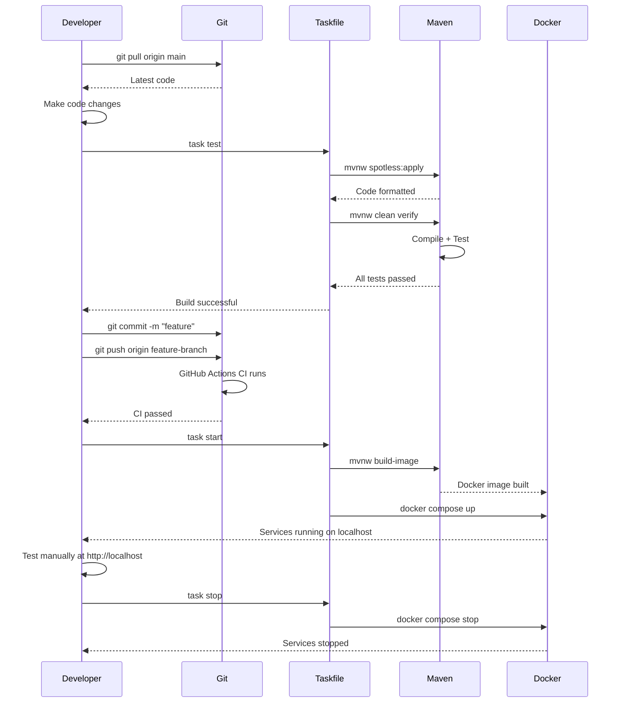

# Development Workflow and Build Tasks

> **Relevant source files**
> * [.github/workflows/maven.yml](https://github.com/philipz/spring-modular-monolith/blob/30c9bf30/.github/workflows/maven.yml)
> * [.sdkmanrc](https://github.com/philipz/spring-modular-monolith/blob/30c9bf30/.sdkmanrc)
> * [Taskfile.yml](https://github.com/philipz/spring-modular-monolith/blob/30c9bf30/Taskfile.yml)
> * [renovate.json](https://github.com/philipz/spring-modular-monolith/blob/30c9bf30/renovate.json)
> * [src/main/java/com/sivalabs/bookstore/catalog/domain/ProductService.java](https://github.com/philipz/spring-modular-monolith/blob/30c9bf30/src/main/java/com/sivalabs/bookstore/catalog/domain/ProductService.java)

This page documents the development tasks, build automation, and workflow patterns available when working with the Spring Modular Monolith codebase. It covers the Taskfile-based automation, Maven build lifecycle, continuous integration pipeline, and common development operations including testing, formatting, image building, and deployment.

For information about running the application locally with Docker Compose, see [Running Locally with Docker Compose](/philipz/spring-modular-monolith/2.2-running-locally-with-docker-compose). For details on testing strategies and integration tests, see [Integration Testing Strategies](/philipz/spring-modular-monolith/11.3-integration-testing-strategies).

---

## Task Automation with Taskfile

The repository uses [Task](https://taskfile.dev/) as the primary task automation tool, defined in `Taskfile.yml`. Task provides a simple, cross-platform way to execute development workflows without requiring complex shell scripts or Makefiles.

### Taskfile Structure

The Taskfile defines platform-specific variables and task dependencies to orchestrate the development workflow:



**Sources:**

* [Taskfile.yml L1-L64](https://github.com/philipz/spring-modular-monolith/blob/30c9bf30/Taskfile.yml#L1-L64)

---

## Available Development Tasks

The following table summarizes all tasks available through the Taskfile:

| Task | Command | Description | Dependencies |
| --- | --- | --- | --- |
| `default` | `task` | Runs the test task (default when no task specified) | `format` |
| `test` | `task test` | Cleans, formats code, and runs all tests | `format` |
| `format` | `task format` | Applies code formatting using Spotless | None |
| `build_image` | `task build_image` | Compiles protobuf, builds application, creates Docker image | None |
| `start` | `task start` | Builds image and starts all services with Docker Compose | `build_image` |
| `stop` | `task stop` | Stops and removes all Docker Compose services | None |
| `restart` | `task restart` | Stops services, waits 5 seconds, then starts them again | `stop`, `start` |
| `kind_create` | `task kind_create` | Creates a Kind (Kubernetes in Docker) cluster | None |
| `kind_destroy` | `task kind_destroy` | Destroys the Kind cluster | None |
| `k8s_deploy` | `task k8s_deploy` | Loads image to Kind and deploys to Kubernetes | `build_image` |
| `k8s_undeploy` | `task k8s_undeploy` | Removes Kubernetes deployments | None |
| `sleep` | `task sleep` | Platform-specific sleep command (default 5s) | None |

### Task Execution Flow



**Sources:**

* [Taskfile.yml L9-L64](https://github.com/philipz/spring-modular-monolith/blob/30c9bf30/Taskfile.yml#L9-L64)

---

## Maven Build Process

The project uses Maven as the build tool with the Maven Wrapper (`mvnw` / `mvnw.cmd`) to ensure consistent Maven versions across environments.

### Maven Wrapper Execution

The Taskfile automatically selects the appropriate Maven wrapper based on the operating system:

* **Unix/Linux/macOS**: `./mvnw`
* **Windows**: `mvnw.cmd`

This is controlled by the `MVNW` variable: [Taskfile.yml L5](https://github.com/philipz/spring-modular-monolith/blob/30c9bf30/Taskfile.yml#L5-L5)

### Key Maven Commands

#### Test Execution

```markdown
task test
# Executes: ./mvnw clean verify
```

This command performs:

1. **Code formatting** via Spotless (automatic dependency)
2. **Clean**: Removes `target/` directory
3. **Compile**: Compiles main and test sources
4. **Test**: Runs unit tests with JUnit 5
5. **Integration-test**: Runs integration tests with Testcontainers
6. **Verify**: Validates test results

#### Image Building

```go
task build_image
# Executes: ./mvnw clean protobuf:compile package spring-boot:build-image -DskipTests
```

This command performs:

1. **protobuf:compile**: Generates Java classes from `src/main/proto/orders.proto`
2. **package**: Creates JAR file
3. **spring-boot:build-image**: Builds OCI image using Cloud Native Buildpacks
4. **-DskipTests**: Skips test execution for faster builds

**Sources:**

* [Taskfile.yml L13-L24](https://github.com/philipz/spring-modular-monolith/blob/30c9bf30/Taskfile.yml#L13-L24)
* [.github/workflows/maven.yml L44](https://github.com/philipz/spring-modular-monolith/blob/30c9bf30/.github/workflows/maven.yml#L44-L44)

---

## Code Formatting with Spotless

The project enforces consistent code style using [Spotless](https://github.com/philipz/spring-modular-monolith/blob/30c9bf30/Spotless)

 with Palantir Java Format.

### Formatting Workflow



### Format Command

```markdown
task format
# Executes: ./mvnw spotless:apply
```

**Automatic Formatting**: The `test` task automatically depends on `format`, ensuring code is formatted before running tests: [Taskfile.yml L14](https://github.com/philipz/spring-modular-monolith/blob/30c9bf30/Taskfile.yml#L14-L14)

For more details on code quality standards, see [Code Quality and Formatting](/philipz/spring-modular-monolith/11.2-code-quality-and-formatting).

**Sources:**

* [Taskfile.yml L18-L20](https://github.com/philipz/spring-modular-monolith/blob/30c9bf30/Taskfile.yml#L18-L20)

---

## Docker Compose Lifecycle Management

The Taskfile provides tasks for managing the Docker Compose stack defined in `compose.yml`.

### Service Lifecycle Tasks

```

```

### Start Command

```
task start
```

**Execution Flow:**

1. Builds Docker image via `build_image` dependency
2. Runs `docker compose --profile app -f compose.yml up --force-recreate -d`
3. Force-recreates containers to ensure clean state
4. Runs in detached mode (`-d`)

[Taskfile.yml L26-L29](https://github.com/philipz/spring-modular-monolith/blob/30c9bf30/Taskfile.yml#L26-L29)

### Stop Command

```
task stop
```

**Execution Flow:**

1. Stops all running containers: `docker compose stop`
2. Removes stopped containers: `docker compose rm -f`
3. Preserves volumes and networks

[Taskfile.yml L31-L34](https://github.com/philipz/spring-modular-monolith/blob/30c9bf30/Taskfile.yml#L31-L34)

### Restart Command

```
task restart
```

**Execution Flow:**

1. Executes `stop` task
2. Waits 5 seconds (configurable via `DURATION` variable)
3. Executes `start` task

This ensures a clean restart without stale connections or cached state.

[Taskfile.yml L36-L40](https://github.com/philipz/spring-modular-monolith/blob/30c9bf30/Taskfile.yml#L36-L40)

**Sources:**

* [Taskfile.yml L26-L40](https://github.com/philipz/spring-modular-monolith/blob/30c9bf30/Taskfile.yml#L26-L40)
* [Taskfile.yml L7](https://github.com/philipz/spring-modular-monolith/blob/30c9bf30/Taskfile.yml#L7-L7)  (DC_FILE variable)

---

## Kubernetes Development Workflow

The Taskfile includes tasks for deploying to a local Kubernetes cluster using [Kind](https://kind.sigs.k8s.io/) (Kubernetes in Docker).

### Kubernetes Task Flow



### Kind Cluster Management

#### Create Cluster

```sql
task kind_create
# Executes: ./k8s/kind/kind-cluster.sh create
```

Creates a Kind cluster named `sivalabs-k8s` with port mappings configured in the cluster definition script.

[Taskfile.yml L42-L44](https://github.com/philipz/spring-modular-monolith/blob/30c9bf30/Taskfile.yml#L42-L44)

#### Destroy Cluster

```markdown
task kind_destroy
# Executes: ./k8s/kind/kind-cluster.sh destroy
```

Removes the Kind cluster and all associated resources.

[Taskfile.yml L46-L48](https://github.com/philipz/spring-modular-monolith/blob/30c9bf30/Taskfile.yml#L46-L48)

### Application Deployment to Kubernetes

#### Deploy

```
task k8s_deploy
```

**Execution Flow:**

1. Loads Docker image into Kind cluster: `kind load docker-image sivaprasadreddy/spring-modular-monolith --name sivalabs-k8s`
2. Applies Kubernetes manifests: `kubectl apply -f k8s/manifests/`

This deploys all Kubernetes resources defined in the `k8s/manifests/` directory including Deployments, Services, ConfigMaps, and Secrets.

[Taskfile.yml L50-L53](https://github.com/philipz/spring-modular-monolith/blob/30c9bf30/Taskfile.yml#L50-L53)

#### Undeploy

```sql
task k8s_undeploy
# Executes: kubectl delete -f k8s/manifests/
```

Removes all Kubernetes resources deployed by the manifests.

[Taskfile.yml L55-L57](https://github.com/philipz/spring-modular-monolith/blob/30c9bf30/Taskfile.yml#L55-L57)

For detailed Kubernetes deployment configuration, see [Kubernetes Deployment with Kind](/philipz/spring-modular-monolith/10.2-kubernetes-deployment-with-kind).

**Sources:**

* [Taskfile.yml L42-L57](https://github.com/philipz/spring-modular-monolith/blob/30c9bf30/Taskfile.yml#L42-L57)

---

## Continuous Integration Pipeline

The project uses GitHub Actions for continuous integration, defined in `.github/workflows/maven.yml`.

### CI Pipeline Architecture



### Workflow Configuration

#### Trigger Conditions

The workflow triggers on:

**Push Events** to branches:

* `main`
* `package-by-*` pattern branches

**Excluded paths** (workflow skipped):

* `.gitignore`
* `.sdkmanrc`
* `README.md`
* `LICENSE`
* `Taskfile.yml`
* `renovate.json`
* `k8s/**` (entire Kubernetes directory)

[.github/workflows/maven.yml L3-L15](https://github.com/philipz/spring-modular-monolith/blob/30c9bf30/.github/workflows/maven.yml#L3-L15)

**Pull Request Events** to `main` branch:

**Included paths** (workflow runs):

* `pom.xml`
* `**/pom.xml` (any module POM)
* `src/**` (source code)
* `.github/workflows/maven.yml` (workflow itself)

[.github/workflows/maven.yml L16-L23](https://github.com/philipz/spring-modular-monolith/blob/30c9bf30/.github/workflows/maven.yml#L16-L23)

### CI Build Steps

The workflow executes the following steps:

| Step | Action | Description |
| --- | --- | --- |
| 1. Checkout | `actions/checkout@v5` | Clone repository with full history |
| 2. Setup Java | `actions/setup-java@v5` | Install Java 21 (Temurin distribution) with Maven cache |
| 3. Make Executable | `chmod +x mvnw` | Ensure Maven wrapper is executable on Unix |
| 4. Build | `./mvnw -ntp verify` | Run Maven verify phase (compile, test, integration-test) |
| 5. Submit Dependencies | `maven-dependency-submission-action@v5` | Submit dependency snapshot to GitHub (push events only) |

The `-ntp` flag disables Maven's transfer progress output for cleaner CI logs.

[.github/workflows/maven.yml L30-L48](https://github.com/philipz/spring-modular-monolith/blob/30c9bf30/.github/workflows/maven.yml#L30-L48)

### Required Permissions

The workflow requires `contents: write` permission to submit dependency snapshots to GitHub's Dependency Graph API.

[.github/workflows/maven.yml L28-L29](https://github.com/philipz/spring-modular-monolith/blob/30c9bf30/.github/workflows/maven.yml#L28-L29)

**Sources:**

* [.github/workflows/maven.yml L1-L48](https://github.com/philipz/spring-modular-monolith/blob/30c9bf30/.github/workflows/maven.yml#L1-L48)

---

## SDK Version Management

The project uses [SDKMAN!](https://sdkman.io/) for managing Java and Maven versions. The `.sdkmanrc` file declares the required SDK versions.

### SDK Configuration

```
java=24.0.1-tem
maven=3.9.11
```

**Java**: Version 24.0.1 (Temurin distribution)
**Maven**: Version 3.9.11

[.sdkmanrc L1-L3](https://github.com/philipz/spring-modular-monolith/blob/30c9bf30/.sdkmanrc#L1-L3)

### Usage

Developers using SDKMAN! can automatically install and use the correct SDK versions:

```markdown
# Install SDKs declared in .sdkmanrc
sdk env install

# Use SDKs for current shell session
sdk env
```

This ensures all developers use consistent JDK and Maven versions, reducing "works on my machine" issues.

**Sources:**

* [.sdkmanrc L1-L3](https://github.com/philipz/spring-modular-monolith/blob/30c9bf30/.sdkmanrc#L1-L3)

---

## Dependency Management Automation

The project uses [Renovate](https://docs.renovatebot.com/) for automated dependency updates.

### Renovate Configuration

The `renovate.json` file extends Renovate's recommended configuration preset:

```json
{
    "$schema": "https://docs.renovatebot.com/renovate-schema.json",
    "extends": [
        "config:recommended"
    ]
}
```

[renovate.json L1-L6](https://github.com/philipz/spring-modular-monolith/blob/30c9bf30/renovate.json#L1-L6)

### Automated Updates

Renovate automatically:

1. Detects outdated dependencies in `pom.xml` files
2. Creates pull requests with dependency updates
3. Groups related updates together
4. Runs CI checks on update branches
5. Provides changelogs and release notes

This ensures the project stays up-to-date with security patches and new features from upstream dependencies.

**Sources:**

* [renovate.json L1-L6](https://github.com/philipz/spring-modular-monolith/blob/30c9bf30/renovate.json#L1-L6)

---

## Common Development Workflows

### Daily Development Cycle



### Recommended Workflow

1. **Start a task**: `task test` (runs formatting and tests)
2. **Make code changes**: Edit Java files, tests, or configuration
3. **Run tests**: `task test` (auto-formats before testing)
4. **Build and deploy locally**: `task start` (builds image and starts stack)
5. **Test manually**: Access application at [http://localhost](http://localhost)
6. **Stop services**: `task stop` when done testing
7. **Commit changes**: Git workflow with automatic CI validation

### Troubleshooting Failed Builds

If `task start` fails:

```markdown
# Stop existing services
task stop

# Clean Maven build
./mvnw clean

# Rebuild image
task build_image

# Restart services
task start
```

If tests fail:

```markdown
# Check formatting
task format

# Run tests with verbose output
./mvnw clean verify -X

# Check specific test class
./mvnw test -Dtest=OrderServiceTests
```

**Sources:**

* [Taskfile.yml L9-L64](https://github.com/philipz/spring-modular-monolith/blob/30c9bf30/Taskfile.yml#L9-L64)
* [.github/workflows/maven.yml L1-L48](https://github.com/philipz/spring-modular-monolith/blob/30c9bf30/.github/workflows/maven.yml#L1-L48)

---

## Summary

The Spring Modular Monolith provides comprehensive build automation through:

* **Taskfile**: Cross-platform task orchestration with 12 predefined tasks
* **Maven**: Java build lifecycle with protobuf compilation and Spring Boot image building
* **Spotless**: Automatic code formatting with Palantir Java Format
* **GitHub Actions**: Continuous integration with dependency tracking
* **SDKMAN!**: SDK version management for consistent environments
* **Renovate**: Automated dependency updates

This automation ensures consistent builds across development, CI, and production environments while minimizing manual configuration and setup overhead.