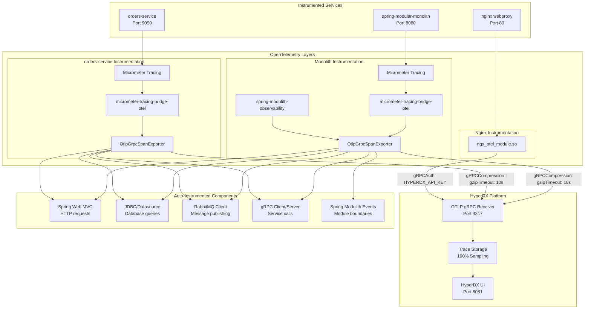
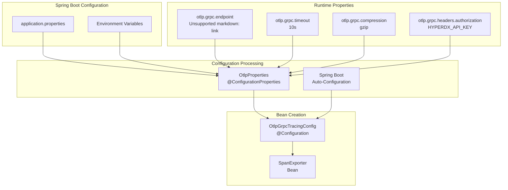
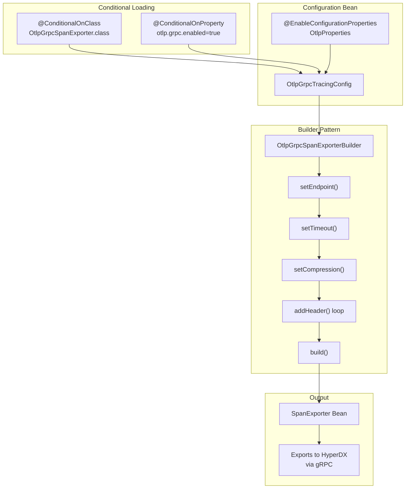
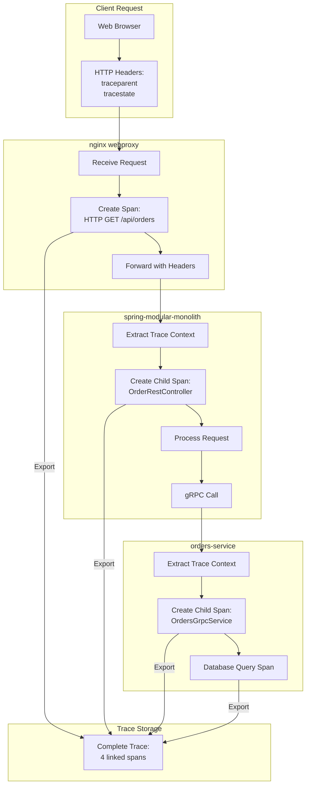
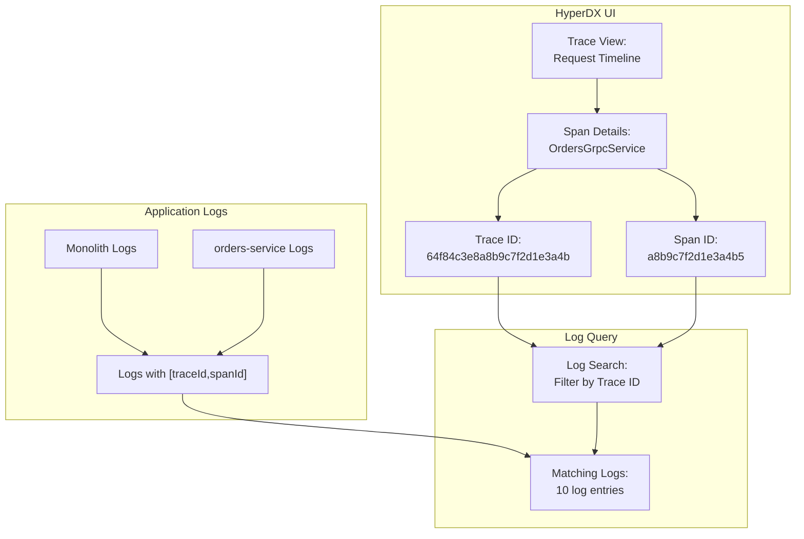
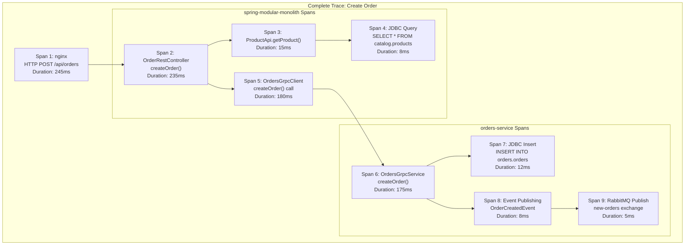

# Distributed Tracing with HyperDX

> **Relevant source files**
> * [CLAUDE.md](https://github.com/philipz/spring-modular-monolith/blob/30c9bf30/CLAUDE.md)
> * [compose.yml](https://github.com/philipz/spring-modular-monolith/blob/30c9bf30/compose.yml)
> * [pom.xml](https://github.com/philipz/spring-modular-monolith/blob/30c9bf30/pom.xml)
> * [src/main/java/com/sivalabs/bookstore/config/LiquibaseConfig.java](https://github.com/philipz/spring-modular-monolith/blob/30c9bf30/src/main/java/com/sivalabs/bookstore/config/LiquibaseConfig.java)
> * [src/main/java/com/sivalabs/bookstore/config/OtlpGrpcTracingConfig.java](https://github.com/philipz/spring-modular-monolith/blob/30c9bf30/src/main/java/com/sivalabs/bookstore/config/OtlpGrpcTracingConfig.java)
> * [src/main/java/com/sivalabs/bookstore/config/OtlpProperties.java](https://github.com/philipz/spring-modular-monolith/blob/30c9bf30/src/main/java/com/sivalabs/bookstore/config/OtlpProperties.java)
> * [src/main/resources/application.properties](https://github.com/philipz/spring-modular-monolith/blob/30c9bf30/src/main/resources/application.properties)
> * [src/test/java/com/sivalabs/bookstore/BookStoreApplicationTests.java](https://github.com/philipz/spring-modular-monolith/blob/30c9bf30/src/test/java/com/sivalabs/bookstore/BookStoreApplicationTests.java)
> * [src/test/java/com/sivalabs/bookstore/TestcontainersConfiguration.java](https://github.com/philipz/spring-modular-monolith/blob/30c9bf30/src/test/java/com/sivalabs/bookstore/TestcontainersConfiguration.java)

This page documents the distributed tracing implementation using HyperDX as the all-in-one observability backend. It covers the OpenTelemetry instrumentation, OTLP gRPC exporter configuration, trace propagation across services, and how to access and analyze traces in the HyperDX UI.

For OpenTelemetry configuration details, see [OpenTelemetry Configuration](/philipz/spring-modular-monolith/9.1-opentelemetry-configuration). For health check endpoints including trace availability, see [Spring Actuator and Health Checks](/philipz/spring-modular-monolith/9.3-spring-actuator-and-health-checks).

## HyperDX Overview

HyperDX is an all-in-one observability platform that collects and visualizes traces, metrics, and logs from all services in the system. It provides a unified interface for debugging distributed requests and analyzing system performance.

**Key Capabilities:**

* **Distributed Tracing**: Visualizes request flow across monolith, orders-service, and nginx
* **Metrics Collection**: Ingests Prometheus-formatted metrics via OTLP
* **Log Aggregation**: Correlates logs with traces using trace and span IDs
* **OTLP Protocol Support**: Accepts telemetry via OTLP gRPC (port 4317) and OTLP HTTP (port 4318)

**Deployment Configuration:**

The HyperDX service runs as a Docker container with the following ports exposed:

| Port | Protocol | Purpose |
| --- | --- | --- |
| 8081 | HTTP | HyperDX Web UI (remapped from 8080 to avoid conflict) |
| 4317 | gRPC | OpenTelemetry OTLP gRPC receiver |
| 4318 | HTTP | OpenTelemetry OTLP HTTP receiver |

**Sources:** [compose.yml L49-L56](https://github.com/philipz/spring-modular-monolith/blob/30c9bf30/compose.yml#L49-L56)

## OpenTelemetry Integration Architecture

The system uses OpenTelemetry for distributed tracing with automatic instrumentation provided by Spring Boot and Micrometer. All services export traces to HyperDX via the OTLP gRPC protocol.



**Automatic Instrumentation:**

The system automatically instruments the following components without code changes:

* **HTTP Requests**: Spring Web MVC automatically creates spans for REST API calls
* **Database Queries**: JDBC operations are traced via `datasource-micrometer-spring-boot`
* **Message Publishing**: RabbitMQ client operations generate spans for event publishing
* **gRPC Calls**: Both client and server gRPC operations are instrumented
* **Module Boundaries**: `spring-modulith-observability` creates spans for cross-module interactions

**Sources:** [compose.yml L58-L117](https://github.com/philipz/spring-modular-monolith/blob/30c9bf30/compose.yml#L58-L117)

 [pom.xml L64-L93](https://github.com/philipz/spring-modular-monolith/blob/30c9bf30/pom.xml#L64-L93)

 [src/main/resources/application.properties L70-L82](https://github.com/philipz/spring-modular-monolith/blob/30c9bf30/src/main/resources/application.properties#L70-L82)

## OTLP gRPC Configuration

The system uses OTLP gRPC protocol for exporting traces to HyperDX. This provides better performance than HTTP due to binary protocol encoding and HTTP/2 multiplexing.

### Configuration Properties



**Configuration Class Structure:**

The `OtlpProperties` class defines configuration properties with these defaults:

| Property | Default Value | Purpose |
| --- | --- | --- |
| `otlp.grpc.endpoint` | `http://localhost:4317` | HyperDX OTLP gRPC receiver URL |
| `otlp.grpc.timeout` | `10s` | Maximum time to wait for span export |
| `otlp.grpc.compression` | `gzip` | Compression algorithm for payload reduction |
| `otlp.grpc.headers.*` | Empty map | Custom headers (e.g., API key authentication) |

**Sources:** [src/main/java/com/sivalabs/bookstore/config/OtlpProperties.java L1-L63](https://github.com/philipz/spring-modular-monolith/blob/30c9bf30/src/main/java/com/sivalabs/bookstore/config/OtlpProperties.java#L1-L63)

 [src/main/resources/application.properties L76-L82](https://github.com/philipz/spring-modular-monolith/blob/30c9bf30/src/main/resources/application.properties#L76-L82)

### SpanExporter Bean Configuration

The `OtlpGrpcTracingConfig` creates the `SpanExporter` bean that Spring Boot's tracing infrastructure uses to export spans:



**Key Implementation Details:**

1. **Conditional Loading**: The configuration only activates when `OtlpGrpcSpanExporter` class is present and `otlp.grpc.enabled=true` (defaults to true)
2. **Builder Pattern**: Uses `OtlpGrpcSpanExporterBuilder` to configure endpoint, timeout, compression, and custom headers
3. **Header Injection**: Iterates through `OtlpProperties.headers` map to add authentication headers (e.g., `authorization: HYPERDX_API_KEY`)
4. **Automatic Registration**: Spring Boot's tracing auto-configuration discovers this bean and uses it for span export

**Sources:** [src/main/java/com/sivalabs/bookstore/config/OtlpGrpcTracingConfig.java L1-L63](https://github.com/philipz/spring-modular-monolith/blob/30c9bf30/src/main/java/com/sivalabs/bookstore/config/OtlpGrpcTracingConfig.java#L1-L63)

### Environment-Specific Configuration

The OTLP endpoint and authentication are configured via environment variables in Docker Compose:

**Monolith Configuration:**

```yaml
OTLP_ENDPOINT: http://hyperdx:4317
OTLP_GRPC_HEADERS_AUTHORIZATION: ${HYPERDX_API_KEY}
```

**orders-service Configuration:**

```yaml
OTLP_ENDPOINT: http://hyperdx:4317
OTLP_GRPC_HEADERS_AUTHORIZATION: ${HYPERDX_API_KEY}
```

**nginx webproxy Configuration:**

```
HYPERDX_API_KEY: ${HYPERDX_API_KEY}
```

The `${HYPERDX_API_KEY}` placeholder is resolved from the host environment, allowing secure API key injection without hardcoding credentials.

**Sources:** [compose.yml L60-L86](https://github.com/philipz/spring-modular-monolith/blob/30c9bf30/compose.yml#L60-L86)

 [compose.yml L88-L117](https://github.com/philipz/spring-modular-monolith/blob/30c9bf30/compose.yml#L88-L117)

 [compose.yml L160-L173](https://github.com/philipz/spring-modular-monolith/blob/30c9bf30/compose.yml#L160-L173)

## Trace Propagation and Sampling

The system uses W3C Trace Context propagation to maintain trace continuity across service boundaries.

### Trace Context Propagation



**Propagation Mechanism:**

1. **Incoming Requests**: nginx receives HTTP requests and generates a root span
2. **Header Injection**: OpenTelemetry automatically injects `traceparent` and `tracestate` headers
3. **Context Extraction**: Spring Boot services extract trace context from incoming headers
4. **Span Hierarchy**: Each service creates child spans that link to the parent trace ID
5. **gRPC Propagation**: gRPC metadata automatically carries trace context between services

**Sources:** [compose.yml L49-L56](https://github.com/philipz/spring-modular-monolith/blob/30c9bf30/compose.yml#L49-L56)

 [src/main/resources/application.properties L70-L74](https://github.com/philipz/spring-modular-monolith/blob/30c9bf30/src/main/resources/application.properties#L70-L74)

### Sampling Configuration

The system uses **100% sampling** to capture all traces for development and debugging:

```
management.tracing.sampling.probability=1.0
```

This configuration ensures every request generates a complete trace. For production environments, this value should be reduced (e.g., 0.1 for 10% sampling) to minimize overhead.

**Sources:** [src/main/resources/application.properties L74](https://github.com/philipz/spring-modular-monolith/blob/30c9bf30/src/main/resources/application.properties#L74-L74)

## Log Correlation with Traces

The system configures log patterns to include trace and span IDs, enabling correlation between logs and distributed traces.

### Log Pattern Configuration

```
logging.pattern.correlation=[${spring.application.name:},%X{traceId:-},%X{spanId:-}]
```

This pattern injects three correlation fields into every log line:

* **Application Name**: Service identifier (e.g., `spring-modular-monolith`)
* **Trace ID**: Unique identifier for the entire distributed request
* **Span ID**: Unique identifier for the current operation within the trace

**Example Log Output:**

```
[spring-modular-monolith,64f84c3e8a8b9c7f2d1e3a4b,a8b9c7f2d1e3a4b5] OrderService - Creating order for customer: john@example.com
```

### Trace-to-Log Lookup Workflow



**Correlation Workflow:**

1. **View Trace**: Open a trace in HyperDX UI to see the request timeline
2. **Copy IDs**: Copy the trace ID or span ID from the span details
3. **Search Logs**: Use the ID to filter logs in HyperDX log viewer
4. **Analyze Context**: View all log statements associated with that specific request or operation

**Sources:** [src/main/resources/application.properties L3-L4](https://github.com/philipz/spring-modular-monolith/blob/30c9bf30/src/main/resources/application.properties#L3-L4)

## Accessing the HyperDX UI

The HyperDX web interface provides visualization and analysis tools for distributed traces.

### Connection Details

| Property | Value | Description |
| --- | --- | --- |
| **URL** | [http://localhost:8081](http://localhost:8081) | HyperDX web interface (remapped from port 8080) |
| **OTLP gRPC** | localhost:4317 | Telemetry ingestion endpoint |
| **OTLP HTTP** | localhost:4318 | Alternative HTTP ingestion endpoint |
| **Network** | `proxy` | Docker Compose network for service communication |

**Accessing the UI:**

1. Ensure Docker Compose stack is running: `docker compose up -d`
2. Navigate to [http://localhost:8081](http://localhost:8081) in your browser
3. No authentication is required for local development instances

**Sources:** [compose.yml L49-L56](https://github.com/philipz/spring-modular-monolith/blob/30c9bf30/compose.yml#L49-L56)

### Available Features

The HyperDX UI provides these analysis capabilities:

**Trace Explorer:**

* View all captured traces with filtering by service, operation, duration, or status
* Search traces by trace ID, span ID, or custom attributes
* Visualize trace timelines with parent-child span relationships

**Service Map:**

* Visualize service dependencies and call patterns
* Identify bottlenecks by analyzing inter-service latency
* Monitor error rates between service boundaries

**Metrics Dashboard:**

* View Prometheus-formatted metrics from Spring Actuator
* Track JVM metrics, HTTP request rates, and database connection pools
* Create custom dashboards for business-specific metrics

**Log Viewer:**

* Search logs correlated with trace and span IDs
* Filter logs by service, log level, or time range
* View log context alongside trace spans

## Viewing and Analyzing Traces

### Trace Structure Example

When a user creates an order through the web interface, the complete trace contains these spans:



**Span Hierarchy Analysis:**

* **Root Span**: nginx creates the initial span when receiving the HTTP request
* **Controller Span**: Spring Web MVC creates a span for the REST controller method
* **Validation Span**: Product price validation creates a span for the catalog API call
* **Database Spans**: JDBC queries automatically generate spans for each database operation
* **gRPC Spans**: Both client and server sides of gRPC calls are instrumented
* **Event Spans**: Spring Modulith observability creates spans for event publication
* **Messaging Spans**: RabbitMQ client operations generate spans for message publishing

**Sources:** [compose.yml L58-L86](https://github.com/philipz/spring-modular-monolith/blob/30c9bf30/compose.yml#L58-L86)

 [compose.yml L88-L117](https://github.com/philipz/spring-modular-monolith/blob/30c9bf30/compose.yml#L88-L117)

### Debugging Performance Issues

Use HyperDX to identify performance bottlenecks:

**1. Identify Slow Traces:**

* Filter traces by duration threshold (e.g., > 500ms)
* Sort by slowest requests to find outliers
* Analyze trace waterfall to identify longest spans

**2. Analyze Span Details:**

* Click on individual spans to view attributes (HTTP status, database query, error messages)
* Compare span duration against total trace duration
* Identify spans with errors or exceptions

**3. Database Query Analysis:**

* Review JDBC spans to identify slow queries
* Check query patterns for N+1 query problems
* Verify database connection pool metrics

**4. gRPC Call Analysis:**

* Compare client-side span duration with server-side span duration
* Identify network latency by measuring the gap between spans
* Check for retry attempts in gRPC client spans

**5. Correlation with Logs:**

* Copy trace ID from slow trace
* Search logs using the trace ID to see detailed application logs
* Identify specific code paths and error conditions

### Common Trace Patterns

**Successful Order Creation:**

```
nginx (40ms) → OrderRestController (235ms) → [ProductApi (15ms), OrdersGrpcClient (180ms)] → OrdersGrpcService (175ms) → [Database (12ms), RabbitMQ (5ms)]
```

**Failed Validation:**

```
nginx (25ms) → OrderRestController (20ms) → ProductApi (15ms) → [Status: ERROR, Exception: ProductNotFoundException]
```

**gRPC Retry:**

```
nginx (350ms) → OrderRestController (340ms) → OrdersGrpcClient (330ms) → [Attempt 1: UNAVAILABLE, Attempt 2: UNAVAILABLE, Attempt 3: SUCCESS]
```

## Integration with Spring Modulith Observability

The `spring-modulith-observability` module adds instrumentation for Spring Modulith-specific operations:

**Module Boundary Spans:**

* Creates spans when crossing module boundaries via `@ApplicationModuleListener`
* Tracks event publishing and consumption
* Measures module-to-module interaction latency

**Event Publication Spans:**

* Instruments `ApplicationEventPublisher.publishEvent()` calls
* Tracks event serialization and persistence to JDBC event store
* Measures time from publication to RabbitMQ export

**Configuration:**

Module observability is automatically enabled when the dependency is present:

```xml
<dependency>
    <groupId>org.springframework.modulith</groupId>
    <artifactId>spring-modulith-observability</artifactId>
    <scope>runtime</scope>
</dependency>
```

However, datasource-level metrics are disabled to avoid Prometheus tag conflicts:

```
spring.modulith.observability.instrumentation.datasource.enabled=false
management.metrics.enable.jdbc=false
management.metrics.enable.hikaricp=false
```

**Sources:** [pom.xml L124-L128](https://github.com/philipz/spring-modular-monolith/blob/30c9bf30/pom.xml#L124-L128)

 [src/main/resources/application.properties L101-L110](https://github.com/philipz/spring-modular-monolith/blob/30c9bf30/src/main/resources/application.properties#L101-L110)

## Testing Trace Export

Verify that traces are being exported to HyperDX:

**1. Generate Test Traffic:**

```sql
# Create an order via REST API
curl -X POST http://localhost/api/orders \
  -H "Content-Type: application/json" \
  -d '{
    "customer": {"name": "Test User", "email": "test@example.com", "phone": "+12025550100"},
    "deliveryAddress": "123 Test Street",
    "item": {"code": "P100", "name": "Book Title", "price": 29.99, "quantity": 1}
  }'
```

**2. Check Application Logs:**
Look for trace and span IDs in the application logs:

```
[spring-modular-monolith,64f84c3e8a8b9c7f2d1e3a4b,a8b9c7f2d1e3a4b5] Creating order for customer: test@example.com
```

**3. View in HyperDX:**

* Open [http://localhost:8081](http://localhost:8081)
* Navigate to the Traces section
* Filter by service name: `spring-modular-monolith`
* Find the trace with operation: `POST /api/orders`
* Click to view the complete trace timeline

**4. Verify Span Details:**

* Confirm all expected spans are present (nginx, controller, gRPC, database)
* Check span attributes for HTTP status codes, database queries, error messages
* Verify parent-child relationships between spans

**Sources:** [compose.yml L49-L56](https://github.com/philipz/spring-modular-monolith/blob/30c9bf30/compose.yml#L49-L56)

 [src/main/resources/application.properties L3-L4](https://github.com/philipz/spring-modular-monolith/blob/30c9bf30/src/main/resources/application.properties#L3-L4)

 [src/main/resources/application.properties L70-L82](https://github.com/philipz/spring-modular-monolith/blob/30c9bf30/src/main/resources/application.properties#L70-L82)