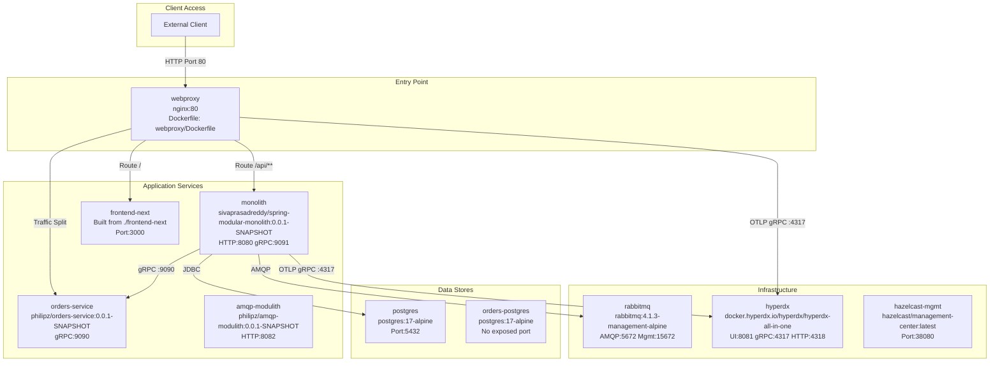
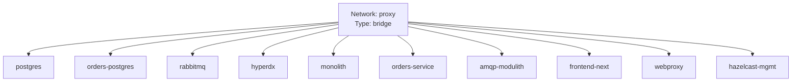
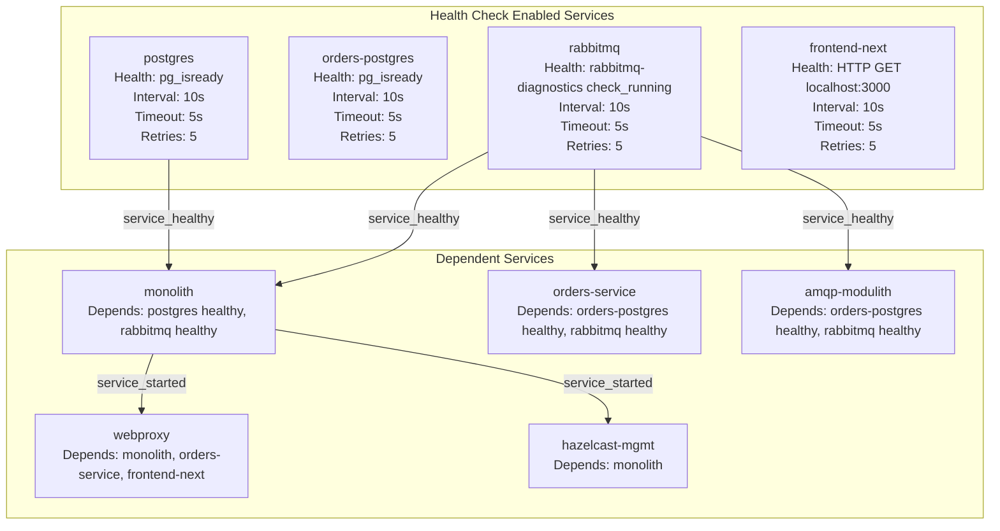
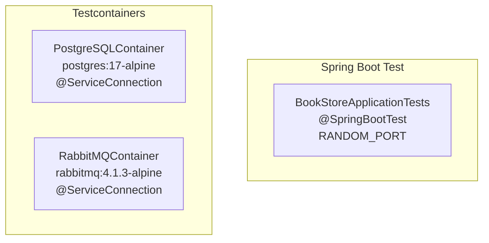

# Docker Compose Deployment

> **Relevant source files**
> * [Taskfile.yml](https://github.com/philipz/spring-modular-monolith/blob/30c9bf30/Taskfile.yml)
> * [compose.yml](https://github.com/philipz/spring-modular-monolith/blob/30c9bf30/compose.yml)
> * [pom.xml](https://github.com/philipz/spring-modular-monolith/blob/30c9bf30/pom.xml)
> * [src/main/resources/application.properties](https://github.com/philipz/spring-modular-monolith/blob/30c9bf30/src/main/resources/application.properties)
> * [src/test/java/com/sivalabs/bookstore/BookStoreApplicationTests.java](https://github.com/philipz/spring-modular-monolith/blob/30c9bf30/src/test/java/com/sivalabs/bookstore/BookStoreApplicationTests.java)
> * [src/test/java/com/sivalabs/bookstore/TestcontainersConfiguration.java](https://github.com/philipz/spring-modular-monolith/blob/30c9bf30/src/test/java/com/sivalabs/bookstore/TestcontainersConfiguration.java)

## Purpose and Scope

This document details the Docker Compose deployment configuration for the Spring Modular Monolith system. It covers all service definitions, networking setup, environment variable configuration, health checks, and deployment procedures for running the complete application stack locally or in development environments.

For Kubernetes deployment, see [Kubernetes Deployment with Kind](/philipz/spring-modular-monolith/10.2-kubernetes-deployment-with-kind). For the nginx reverse proxy configuration specifics, see [Nginx Reverse Proxy](/philipz/spring-modular-monolith/10.3-nginx-reverse-proxy). For production traffic migration strategies, see [Traffic Migration Strategy](/philipz/spring-modular-monolith/10.4-traffic-migration-strategy).

**Sources:** [compose.yml L1-L189](https://github.com/philipz/spring-modular-monolith/blob/30c9bf30/compose.yml#L1-L189)

## Complete Stack Architecture

The Docker Compose configuration orchestrates a multi-service architecture consisting of backend services, databases, message queues, observability platforms, and frontend applications.



**Sources:** [compose.yml L1-L189](https://github.com/philipz/spring-modular-monolith/blob/30c9bf30/compose.yml#L1-L189)

## Service Definitions

### Database Services

#### postgres

The primary PostgreSQL database for the Spring monolith, hosting multiple schemas (catalog, orders, inventory, events).

| Property | Value |
| --- | --- |
| **Image** | `postgres:17-alpine` |
| **Container Name** | `postgres` |
| **Port Mapping** | `5432:5432` |
| **Database** | `postgres` |
| **User/Password** | `postgres/postgres` |
| **Max Connections** | 300 |
| **Health Check** | `pg_isready -U postgres -d postgres` (10s interval) |
| **Network** | `proxy` |

**Sources:** [compose.yml L2-L17](https://github.com/philipz/spring-modular-monolith/blob/30c9bf30/compose.yml#L2-L17)

#### orders-postgres

Dedicated PostgreSQL instance for the extracted orders-service microservice, implementing the database-per-service pattern.

| Property | Value |
| --- | --- |
| **Image** | `postgres:17-alpine` |
| **Container Name** | `orders-postgres` |
| **Port Mapping** | None (internal only) |
| **Database** | `postgres` |
| **User/Password** | `postgres/postgres` |
| **Max Connections** | 300 |
| **Health Check** | `pg_isready -U postgres -d postgres` (10s interval) |
| **Network** | `proxy` |

**Sources:** [compose.yml L19-L32](https://github.com/philipz/spring-modular-monolith/blob/30c9bf30/compose.yml#L19-L32)

### Message Queue

#### rabbitmq

RabbitMQ message broker providing the external event bus for asynchronous communication between services.

| Property | Value |
| --- | --- |
| **Image** | `rabbitmq:4.1.3-management-alpine` |
| **Port Mappings** | `5672:5672` (AMQP), `15672:15672` (Management UI) |
| **Credentials** | `guest/guest` |
| **Health Check** | `rabbitmq-diagnostics check_running` (10s interval) |
| **Management UI** | `http://localhost:15672` |
| **Network** | `proxy` |

**Sources:** [compose.yml L34-L48](https://github.com/philipz/spring-modular-monolith/blob/30c9bf30/compose.yml#L34-L48)

### Observability Platform

#### hyperdx

All-in-one observability platform collecting traces, metrics, and logs from all services via OpenTelemetry Protocol (OTLP).

| Property | Value |
| --- | --- |
| **Image** | `docker.hyperdx.io/hyperdx/hyperdx-all-in-one` |
| **Port Mappings** | `8081:8080` (UI), `4317:4317` (OTLP gRPC), `4318:4318` (OTLP HTTP) |
| **UI Access** | `http://localhost:8081` |
| **Network** | `proxy` |

**Sources:** [compose.yml L49-L56](https://github.com/philipz/spring-modular-monolith/blob/30c9bf30/compose.yml#L49-L56)

### Application Services

#### monolith

The Spring Boot modular monolith application, serving REST APIs on port 8080 and exposing a gRPC server on port 9091.


| Property | Value |
| --- | --- |
| **Image** | `sivaprasadreddy/spring-modular-monolith:0.0.1-SNAPSHOT` |
| **Internal Ports** | 8080 (HTTP), 9091 (gRPC) |
| **Exposed Ports** | None (accessed via webproxy) |
| **Dependencies** | `postgres` (healthy), `rabbitmq` (healthy) |
| **Restart Policy** | `unless-stopped` |
| **Network** | `proxy` |

**Environment Variables:**

| Variable | Value | Purpose |
| --- | --- | --- |
| `SPRING_DATASOURCE_URL` | `jdbc:postgresql://postgres:5432/postgres` | Main database connection |
| `SPRING_DATASOURCE_USERNAME` | `postgres` | Database username |
| `SPRING_DATASOURCE_PASSWORD` | `postgres` | Database password |
| `SPRING_DATASOURCE_POOL_SIZE` | `200` | HikariCP connection pool size |
| `SPRING_RABBITMQ_HOST` | `rabbitmq` | RabbitMQ hostname |
| `SPRING_RABBITMQ_PORT` | `5672` | RabbitMQ AMQP port |
| `SPRING_RABBITMQ_USERNAME` | `guest` | RabbitMQ username |
| `SPRING_RABBITMQ_PASSWORD` | `guest` | RabbitMQ password |
| `OTLP_ENDPOINT` | `http://hyperdx:4317` | OpenTelemetry gRPC endpoint |
| `OTLP_GRPC_HEADERS_AUTHORIZATION` | `${HYPERDX_API_KEY}` | HyperDX authentication |
| `BOOKSTORE_GRPC_CLIENT_TARGET` | `orders-service:9090` | gRPC client target for orders-service |
| `JDK_JAVA_OPTIONS` | `--add-modules java.se --add-exports...` | Hazelcast JVM optimization |

**Sources:** [compose.yml L58-L86](https://github.com/philipz/spring-modular-monolith/blob/30c9bf30/compose.yml#L58-L86)

 [src/main/resources/application.properties L8-L11](https://github.com/philipz/spring-modular-monolith/blob/30c9bf30/src/main/resources/application.properties#L8-L11)

 [src/main/resources/application.properties L27-L31](https://github.com/philipz/spring-modular-monolith/blob/30c9bf30/src/main/resources/application.properties#L27-L31)

 [src/main/resources/application.properties L78-L82](https://github.com/philipz/spring-modular-monolith/blob/30c9bf30/src/main/resources/application.properties#L78-L82)

#### orders-service

Extracted microservice handling orders operations via gRPC, demonstrating the strangler pattern for gradual service extraction.

| Property | Value |
| --- | --- |
| **Image** | `philipz/orders-service:0.0.1-SNAPSHOT` |
| **Port Mapping** | `9090:9090` (gRPC) |
| **Dependencies** | `orders-postgres` (healthy), `rabbitmq` (healthy) |
| **Profile** | `docker` |
| **Network** | `proxy` |

**Environment Variables:**

| Variable | Value | Purpose |
| --- | --- | --- |
| `SPRING_PROFILES_ACTIVE` | `docker` | Activates Docker profile |
| `SPRING_DATASOURCE_URL` | `jdbc:postgresql://orders-postgres:5432/postgres` | Dedicated orders database |
| `SPRING_DATASOURCE_POOL_SIZE` | `200` | HikariCP pool size |
| `SPRING_RABBITMQ_HOST` | `rabbitmq` | Message broker |
| `SPRING_RABBITMQ_CACHE_CHANNEL_SIZE` | `300` | RabbitMQ channel cache |
| `OTLP_ENDPOINT` | `http://hyperdx:4317` | Observability endpoint |
| `SPRING_MODULITH_EVENTS_SCHEMA` | `orders_events` | Event publication schema |
| `PRODUCT_API_BASE_URL` | `http://monolith:8080` | Product API endpoint |

**Sources:** [compose.yml L88-L117](https://github.com/philipz/spring-modular-monolith/blob/30c9bf30/compose.yml#L88-L117)

#### amqp-modulith

Event processor service consuming messages from RabbitMQ queues for specialized event handling.

| Property | Value |
| --- | --- |
| **Image** | `philipz/amqp-modulith:0.0.1-SNAPSHOT` |
| **Port Mapping** | `8082:8082` |
| **Dependencies** | `orders-postgres` (healthy), `rabbitmq` (healthy) |
| **Network** | `proxy` |

**Environment Variables:**

| Variable | Value |
| --- | --- |
| `SPRING_DATASOURCE_URL` | `jdbc:postgresql://orders-postgres:5432/postgres` |
| `SPRING_RABBITMQ_HOST` | `rabbitmq` |
| `SPRING_RABBITMQ_CACHE_CHANNEL_SIZE` | `300` |

**Sources:** [compose.yml L119-L138](https://github.com/philipz/spring-modular-monolith/blob/30c9bf30/compose.yml#L119-L138)

#### frontend-next

Next.js 14 frontend application providing the web UI, built from the local `./frontend-next` directory.

| Property | Value |
| --- | --- |
| **Build Context** | `./frontend-next` |
| **Dockerfile** | `./frontend-next/Dockerfile` |
| **Port Mapping** | `3000:3000` |
| **Network** | `proxy` |
| **Health Check** | HTTP GET on `http://localhost:3000/` (10s interval) |

**Environment Variables:**

| Variable | Value | Purpose |
| --- | --- | --- |
| `NODE_ENV` | `production` | Node environment mode |
| `PORT` | `3000` | Server port |
| `HOSTNAME` | `0.0.0.0` | Bind to all interfaces |
| `NEXT_PUBLIC_API_URL` | `/api` | Client-side API URL |
| `NEXT_API_PROXY_TARGET` | `http://monolith:8080` | Server-side API proxy target |

**Sources:** [compose.yml L140-L158](https://github.com/philipz/spring-modular-monolith/blob/30c9bf30/compose.yml#L140-L158)

#### webproxy

Nginx reverse proxy serving as the unified entry point, routing traffic to frontend and backend services with OpenTelemetry instrumentation.

| Property | Value |
| --- | --- |
| **Build Context** | `.` |
| **Dockerfile** | `webproxy/Dockerfile` |
| **Port Mapping** | `80:80` |
| **Dependencies** | `monolith`, `orders-service`, `frontend-next` |
| **Network** | `proxy` |

**Environment Variables:**

| Variable | Value | Purpose |
| --- | --- | --- |
| `HYPERDX_API_KEY` | `${HYPERDX_API_KEY}` | OpenTelemetry authentication for nginx |

**Sources:** [compose.yml L160-L173](https://github.com/philipz/spring-modular-monolith/blob/30c9bf30/compose.yml#L160-L173)

#### hazelcast-mgmt

Hazelcast Management Center providing monitoring and management UI for the distributed cache cluster.

| Property | Value |
| --- | --- |
| **Image** | `hazelcast/management-center:latest` |
| **Port Mapping** | `38080:8080` |
| **Dependencies** | `monolith` |
| **Network** | `proxy` |
| **Management UI** | `http://localhost:38080` |

**Environment Variables:**

| Variable | Value |
| --- | --- |
| `HZ_CLUSTERNAME` | `bookstore-cluster` |
| `HZ_NETWORK_PORT_AUTOINCREMENT` | `true` |

**Sources:** [compose.yml L175-L185](https://github.com/philipz/spring-modular-monolith/blob/30c9bf30/compose.yml#L175-L185)

## Network Configuration

All services are connected to a single user-defined bridge network named `proxy`, enabling service discovery via DNS resolution.



Services communicate using service names as hostnames (e.g., `monolith`, `postgres`, `rabbitmq`). Docker's embedded DNS server resolves these names to container IP addresses.

**Sources:** [compose.yml L187-L188](https://github.com/philipz/spring-modular-monolith/blob/30c9bf30/compose.yml#L187-L188)

## Service Dependencies and Health Checks

The Docker Compose configuration implements health check-based dependency management to ensure services start in the correct order and only become available when their dependencies are healthy.



**Health Check Details:**

| Service | Command | Interval | Timeout | Retries |
| --- | --- | --- | --- | --- |
| `postgres` | `pg_isready -U postgres -d postgres` | 10s | 5s | 5 |
| `orders-postgres` | `pg_isready -U postgres -d postgres` | 10s | 5s | 5 |
| `rabbitmq` | `rabbitmq-diagnostics check_running` | 10s | 5s | 5 |
| `frontend-next` | Node.js HTTP GET on port 3000 | 10s | 5s | 5 |

**Sources:** [compose.yml L8-L12](https://github.com/philipz/spring-modular-monolith/blob/30c9bf30/compose.yml#L8-L12)

 [compose.yml L25-L29](https://github.com/philipz/spring-modular-monolith/blob/30c9bf30/compose.yml#L25-L29)

 [compose.yml L42-L46](https://github.com/philipz/spring-modular-monolith/blob/30c9bf30/compose.yml#L42-L46)

 [compose.yml L79-L83](https://github.com/philipz/spring-modular-monolith/blob/30c9bf30/compose.yml#L79-L83)

 [compose.yml L90-L94](https://github.com/philipz/spring-modular-monolith/blob/30c9bf30/compose.yml#L90-L94)

 [compose.yml L121-L125](https://github.com/philipz/spring-modular-monolith/blob/30c9bf30/compose.yml#L121-L125)

 [compose.yml L154-L158](https://github.com/philipz/spring-modular-monolith/blob/30c9bf30/compose.yml#L154-L158)

 [compose.yml L163-L166](https://github.com/philipz/spring-modular-monolith/blob/30c9bf30/compose.yml#L163-L166)

 [compose.yml L176-L177](https://github.com/philipz/spring-modular-monolith/blob/30c9bf30/compose.yml#L176-L177)

## Port Mappings and Access

The following ports are exposed to the host system:

| Service | Container Port | Host Port | Protocol | Purpose |
| --- | --- | --- | --- | --- |
| `postgres` | 5432 | 5432 | TCP | PostgreSQL database access |
| `rabbitmq` | 5672 | 5672 | AMQP | RabbitMQ message broker |
| `rabbitmq` | 15672 | 15672 | HTTP | RabbitMQ Management UI |
| `hyperdx` | 8080 | 8081 | HTTP | HyperDX observability UI |
| `hyperdx` | 4317 | 4317 | gRPC | OTLP gRPC endpoint |
| `hyperdx` | 4318 | 4318 | HTTP | OTLP HTTP endpoint |
| `orders-service` | 9090 | 9090 | gRPC | Orders gRPC service |
| `amqp-modulith` | 8082 | 8082 | HTTP | AMQP event processor |
| `frontend-next` | 3000 | 3000 | HTTP | Next.js frontend |
| `webproxy` | 80 | 80 | HTTP | Nginx reverse proxy |
| `hazelcast-mgmt` | 8080 | 38080 | HTTP | Hazelcast Management Center |

**Internal-Only Services:**

* `monolith`: Ports 8080 (HTTP) and 9091 (gRPC) are not exposed; accessed via `webproxy`
* `orders-postgres`: No exposed ports; accessed only by `orders-service` and `amqp-modulith`

**Sources:** [compose.yml L14-L15](https://github.com/philipz/spring-modular-monolith/blob/30c9bf30/compose.yml#L14-L15)

 [compose.yml L39-L41](https://github.com/philipz/spring-modular-monolith/blob/30c9bf30/compose.yml#L39-L41)

 [compose.yml L51-L54](https://github.com/philipz/spring-modular-monolith/blob/30c9bf30/compose.yml#L51-L54)

 [compose.yml L114-L115](https://github.com/philipz/spring-modular-monolith/blob/30c9bf30/compose.yml#L114-L115)

 [compose.yml L135-L136](https://github.com/philipz/spring-modular-monolith/blob/30c9bf30/compose.yml#L135-L136)

 [compose.yml L150-L151](https://github.com/philipz/spring-modular-monolith/blob/30c9bf30/compose.yml#L150-L151)

 [compose.yml L172-L173](https://github.com/philipz/spring-modular-monolith/blob/30c9bf30/compose.yml#L172-L173)

 [compose.yml L184-L185](https://github.com/philipz/spring-modular-monolith/blob/30c9bf30/compose.yml#L184-L185)

## Deployment Procedures

### Building Docker Images

The Docker images for the monolith and other services must be built before starting the stack.

**Building the Monolith:**

```go
./mvnw clean package spring-boot:build-image -DskipTests
```

This creates the `sivaprasadreddy/spring-modular-monolith:0.0.1-SNAPSHOT` image using Spring Boot's Cloud Native Buildpacks support.

**Using Taskfile:**

```
task build_image
```

This executes `./mvnw clean protobuf:compile package spring-boot:build-image -DskipTests`, which also compiles the gRPC protocol buffers.

**Sources:** [pom.xml L279-L284](https://github.com/philipz/spring-modular-monolith/blob/30c9bf30/pom.xml#L279-L284)

 [Taskfile.yml L22-L24](https://github.com/philipz/spring-modular-monolith/blob/30c9bf30/Taskfile.yml#L22-L24)

### Starting the Stack

**Using Docker Compose:**

```
docker compose up -d
```

This starts all services defined in `compose.yml` in detached mode.

**Using Taskfile:**

```
task start
```

This builds the image and starts the stack with `--force-recreate` to ensure fresh containers.

**Startup Sequence:**

1. `postgres` and `orders-postgres` start and wait for health checks
2. `rabbitmq` starts and waits for health check
3. `hyperdx` starts (no dependencies)
4. `monolith`, `orders-service`, and `amqp-modulith` start after their database and RabbitMQ dependencies are healthy
5. `frontend-next` starts and waits for health check
6. `webproxy` starts after `monolith`, `orders-service`, and `frontend-next` are available
7. `hazelcast-mgmt` starts after `monolith` is available

**Sources:** [Taskfile.yml L26-L29](https://github.com/philipz/spring-modular-monolith/blob/30c9bf30/Taskfile.yml#L26-L29)

### Stopping the Stack

**Using Docker Compose:**

```
docker compose down
```

This stops and removes all containers, but preserves volumes.

**Using Taskfile:**

```
task stop
```

This executes `docker compose stop` followed by `docker compose rm -f` to stop and remove containers.

**Sources:** [Taskfile.yml L31-L34](https://github.com/philipz/spring-modular-monolith/blob/30c9bf30/Taskfile.yml#L31-L34)

### Restarting Services

**Full Stack Restart:**

```
task restart
```

This stops the stack, waits 5 seconds, and starts it again.

**Individual Service Restart:**

```
docker compose restart monolith
```

**Sources:** [Taskfile.yml L36-L40](https://github.com/philipz/spring-modular-monolith/blob/30c9bf30/Taskfile.yml#L36-L40)

## Required Environment Variables

The `webproxy` service requires the `HYPERDX_API_KEY` environment variable for OpenTelemetry authentication. This must be set before starting the stack.

**Setting the Environment Variable:**

```javascript
export HYPERDX_API_KEY="your-api-key-here"
docker compose up -d
```

**Using .env File:**

Create a `.env` file in the same directory as `compose.yml`:

```
HYPERDX_API_KEY=your-api-key-here
```

Docker Compose automatically reads this file and substitutes the variable.

**Sources:** [compose.yml L73](https://github.com/philipz/spring-modular-monolith/blob/30c9bf30/compose.yml#L73-L73)

 [compose.yml L108](https://github.com/philipz/spring-modular-monolith/blob/30c9bf30/compose.yml#L108-L108)

 [compose.yml L162](https://github.com/philipz/spring-modular-monolith/blob/30c9bf30/compose.yml#L162-L162)

## Integration Testing Configuration

The Testcontainers configuration mirrors the Docker Compose services for integration tests, using the same PostgreSQL and RabbitMQ versions.



The `@ServiceConnection` annotation automatically configures Spring Boot's `DataSource` and `RabbitTemplate` beans to connect to the Testcontainers instances.

**Sources:** [src/test/java/com/sivalabs/bookstore/TestcontainersConfiguration.java L1-L33](https://github.com/philipz/spring-modular-monolith/blob/30c9bf30/src/test/java/com/sivalabs/bookstore/TestcontainersConfiguration.java#L1-L33)

 [src/test/java/com/sivalabs/bookstore/BookStoreApplicationTests.java L1-L17](https://github.com/philipz/spring-modular-monolith/blob/30c9bf30/src/test/java/com/sivalabs/bookstore/BookStoreApplicationTests.java#L1-L17)

## Volume Persistence

The current `compose.yml` configuration does not define any named volumes, meaning all data is stored in anonymous volumes that persist across container restarts but are removed when containers are deleted with `docker compose down -v`.

**To Add Persistent Volumes:**

Modify `compose.yml` to add volume definitions:

```yaml
volumes:
  postgres_data:
  orders_postgres_data:
  rabbitmq_data:

services:
  postgres:
    volumes:
      - postgres_data:/var/lib/postgresql/data
  
  orders-postgres:
    volumes:
      - orders_postgres_data:/var/lib/postgresql/data
  
  rabbitmq:
    volumes:
      - rabbitmq_data:/var/lib/rabbitmq
```

**Sources:** [compose.yml L1-L189](https://github.com/philipz/spring-modular-monolith/blob/30c9bf30/compose.yml#L1-L189)

## Service URLs and Access Points

Once the stack is running, access the services at these URLs:

| Service | URL | Credentials |
| --- | --- | --- |
| **Application** | `http://localhost` | N/A |
| **Next.js Frontend** | `http://localhost:3000` | N/A |
| **API Documentation** | `http://localhost/swagger-ui.html` | N/A |
| **OpenAPI Spec** | `http://localhost/api-docs` | N/A |
| **RabbitMQ Management** | `http://localhost:15672` | `guest` / `guest` |
| **HyperDX Observability** | `http://localhost:8081` | N/A |
| **Hazelcast Management** | `http://localhost:38080` | N/A |
| **PostgreSQL (Main)** | `localhost:5432` | `postgres` / `postgres` |
| **Orders gRPC** | `localhost:9090` | N/A |
| **AMQP Modulith** | `http://localhost:8082` | N/A |

**Sources:** [compose.yml L14-L15](https://github.com/philipz/spring-modular-monolith/blob/30c9bf30/compose.yml#L14-L15)

 [compose.yml L39-L41](https://github.com/philipz/spring-modular-monolith/blob/30c9bf30/compose.yml#L39-L41)

 [compose.yml L51-L54](https://github.com/philipz/spring-modular-monolith/blob/30c9bf30/compose.yml#L51-L54)

 [compose.yml L114-L115](https://github.com/philipz/spring-modular-monolith/blob/30c9bf30/compose.yml#L114-L115)

 [compose.yml L135-L136](https://github.com/philipz/spring-modular-monolith/blob/30c9bf30/compose.yml#L135-L136)

 [compose.yml L150-L151](https://github.com/philipz/spring-modular-monolith/blob/30c9bf30/compose.yml#L150-L151)

 [compose.yml L172-L173](https://github.com/philipz/spring-modular-monolith/blob/30c9bf30/compose.yml#L172-L173)

 [compose.yml L184-L185](https://github.com/philipz/spring-modular-monolith/blob/30c9bf30/compose.yml#L184-L185)