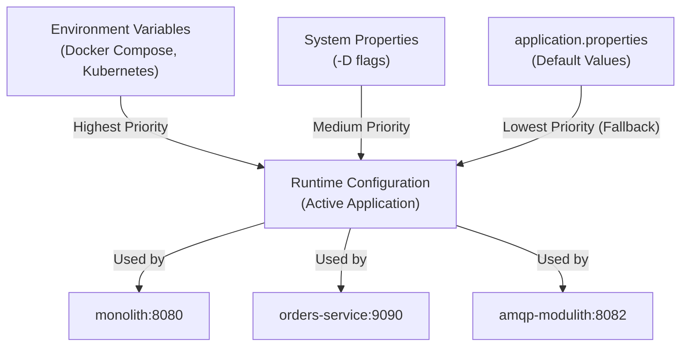
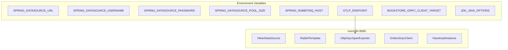
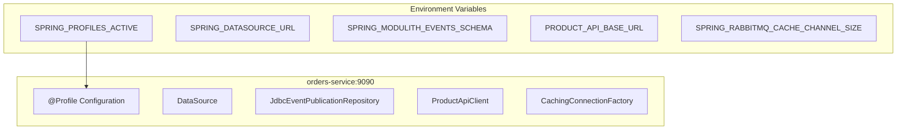
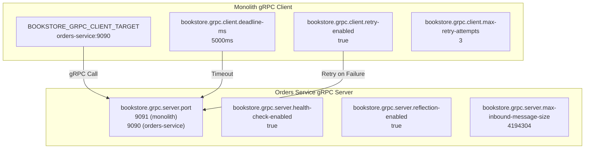
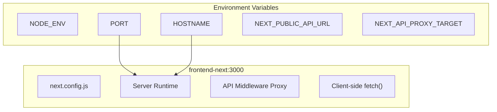
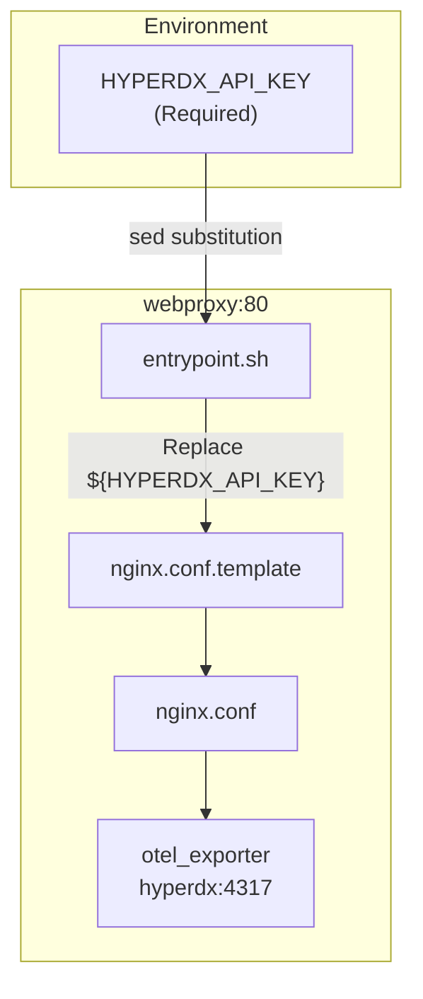
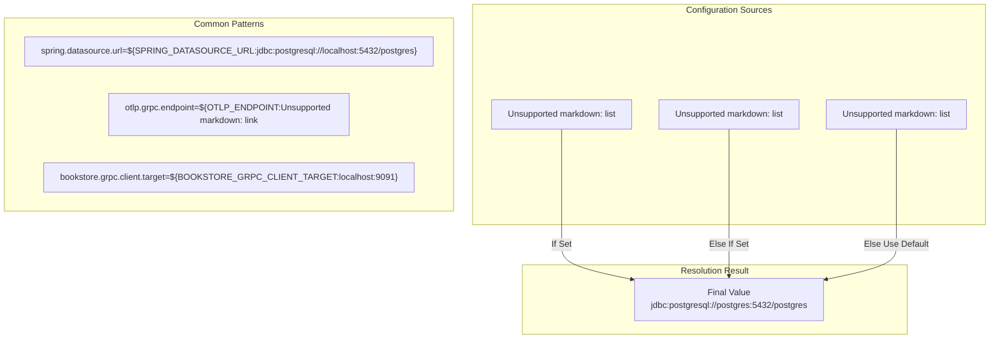

# Environment Variables

> **Relevant source files**
> * [.env.example](https://github.com/philipz/spring-modular-monolith/blob/30c9bf30/.env.example)
> * [compose.yml](https://github.com/philipz/spring-modular-monolith/blob/30c9bf30/compose.yml)
> * [pom.xml](https://github.com/philipz/spring-modular-monolith/blob/30c9bf30/pom.xml)
> * [src/main/resources/application.properties](https://github.com/philipz/spring-modular-monolith/blob/30c9bf30/src/main/resources/application.properties)
> * [src/test/java/com/sivalabs/bookstore/BookStoreApplicationTests.java](https://github.com/philipz/spring-modular-monolith/blob/30c9bf30/src/test/java/com/sivalabs/bookstore/BookStoreApplicationTests.java)
> * [src/test/java/com/sivalabs/bookstore/TestcontainersConfiguration.java](https://github.com/philipz/spring-modular-monolith/blob/30c9bf30/src/test/java/com/sivalabs/bookstore/TestcontainersConfiguration.java)
> * [webproxy/Dockerfile](https://github.com/philipz/spring-modular-monolith/blob/30c9bf30/webproxy/Dockerfile)
> * [webproxy/entrypoint.sh](https://github.com/philipz/spring-modular-monolith/blob/30c9bf30/webproxy/entrypoint.sh)
> * [webproxy/nginx.conf](https://github.com/philipz/spring-modular-monolith/blob/30c9bf30/webproxy/nginx.conf)

This document provides a comprehensive reference for all environment variables used throughout the Spring Modular Monolith system, including Docker Compose deployments, Kubernetes manifests, and local development configurations. Environment variables control database connections, messaging infrastructure, observability endpoints, gRPC communication, and application behavior across all services.

For application-level Spring Boot properties, see [Application Properties](/philipz/spring-modular-monolith/15.1-application-properties). For cache-specific configuration, see [Cache Properties](/philipz/spring-modular-monolith/15.2-cache-properties). For gRPC server and client settings, see [gRPC Properties](/philipz/spring-modular-monolith/15.3-grpc-properties).

## Variable Resolution Architecture

The system employs a multi-tier configuration resolution strategy where environment variables override default values defined in `application.properties`. Spring Boot's property resolution follows this precedence order:



**Sources:** [src/main/resources/application.properties L8-L11](https://github.com/philipz/spring-modular-monolith/blob/30c9bf30/src/main/resources/application.properties#L8-L11)

 [compose.yml L60-L86](https://github.com/philipz/spring-modular-monolith/blob/30c9bf30/compose.yml#L60-L86)

## Core Infrastructure Variables

These variables configure the foundational infrastructure services that all application components depend on.

### PostgreSQL Database Configuration

| Variable | Services | Purpose | Default Value | Example |
| --- | --- | --- | --- | --- |
| `POSTGRES_DB` | postgres, orders-postgres | Database name | `postgres` | `postgres` |
| `POSTGRES_USER` | postgres, orders-postgres | Database username | `postgres` | `postgres` |
| `POSTGRES_PASSWORD` | postgres, orders-postgres | Database password | `postgres` | `postgres123` |
| `SPRING_DATASOURCE_URL` | monolith, orders-service, amqp-modulith | JDBC connection URL | `jdbc:postgresql://localhost:5432/postgres` | `jdbc:postgresql://postgres:5432/postgres` |
| `SPRING_DATASOURCE_USERNAME` | monolith, orders-service, amqp-modulith | Application database user | `postgres` | `app_user` |
| `SPRING_DATASOURCE_PASSWORD` | monolith, orders-service, amqp-modulith | Application database password | `postgres` | `app_pass` |
| `SPRING_DATASOURCE_DRIVER_CLASS_NAME` | monolith | JDBC driver class | (auto-detected) | `org.postgresql.Driver` |
| `SPRING_DATASOURCE_POOL_SIZE` | monolith, orders-service | HikariCP maximum pool size | `10` | `200` |

The system uses two PostgreSQL instances:

* **postgres**: Multi-schema database for monolith (catalog, orders, inventory, events schemas)
* **orders-postgres**: Dedicated database for extracted orders-service

**Sources:** [compose.yml L2-L32](https://github.com/philipz/spring-modular-monolith/blob/30c9bf30/compose.yml#L2-L32)

 [compose.yml L62-L66](https://github.com/philipz/spring-modular-monolith/blob/30c9bf30/compose.yml#L62-L66)

 [src/main/resources/application.properties L8-L11](https://github.com/philipz/spring-modular-monolith/blob/30c9bf30/src/main/resources/application.properties#L8-L11)

### RabbitMQ Messaging Configuration

| Variable | Services | Purpose | Default Value | Example |
| --- | --- | --- | --- | --- |
| `RABBITMQ_DEFAULT_USER` | rabbitmq | RabbitMQ server username | `guest` | `admin` |
| `RABBITMQ_DEFAULT_PASS` | rabbitmq | RabbitMQ server password | `guest` | `rabbitmq123` |
| `SPRING_RABBITMQ_HOST` | monolith, orders-service, amqp-modulith | RabbitMQ hostname | `localhost` | `rabbitmq` |
| `SPRING_RABBITMQ_PORT` | monolith, orders-service, amqp-modulith | AMQP protocol port | `5672` | `5672` |
| `SPRING_RABBITMQ_USERNAME` | monolith, orders-service, amqp-modulith | Application AMQP username | `guest` | `app_user` |
| `SPRING_RABBITMQ_PASSWORD` | monolith, orders-service, amqp-modulith | Application AMQP password | `guest` | `app_pass` |
| `SPRING_RABBITMQ_CACHE_CHANNEL_SIZE` | orders-service, amqp-modulith | Channel cache size | (default) | `300` |

RabbitMQ serves as the external event bus for asynchronous event processing and microservice communication.

**Sources:** [compose.yml L34-L48](https://github.com/philipz/spring-modular-monolith/blob/30c9bf30/compose.yml#L34-L48)

 [compose.yml L67-L70](https://github.com/philipz/spring-modular-monolith/blob/30c9bf30/compose.yml#L67-L70)

 [compose.yml L101-L105](https://github.com/philipz/spring-modular-monolith/blob/30c9bf30/compose.yml#L101-L105)

### HyperDX Observability Configuration

| Variable | Services | Purpose | Default Value | Example |
| --- | --- | --- | --- | --- |
| `HYPERDX_API_KEY` | webproxy, monolith, orders-service | Authentication key for HyperDX OTLP exporter | (required) | `your-api-key-here` |
| `OTLP_ENDPOINT` | monolith, orders-service | OpenTelemetry collector endpoint | `http://localhost:4317` | `http://hyperdx:4317` |
| `OTLP_GRPC_HEADERS_AUTHORIZATION` | monolith, orders-service | Authorization header for OTLP gRPC | (empty) | `${HYPERDX_API_KEY}` |

The `HYPERDX_API_KEY` must be set as a shell environment variable before starting Docker Compose:

```javascript
export HYPERDX_API_KEY=your-api-key-here
docker compose up -d
```

**Sources:** [compose.yml L72-L73](https://github.com/philipz/spring-modular-monolith/blob/30c9bf30/compose.yml#L72-L73)

 [compose.yml L107-L108](https://github.com/philipz/spring-modular-monolith/blob/30c9bf30/compose.yml#L107-L108)

 [compose.yml L162](https://github.com/philipz/spring-modular-monolith/blob/30c9bf30/compose.yml#L162-L162)

 [.env.example L1](https://github.com/philipz/spring-modular-monolith/blob/30c9bf30/.env.example#L1-L1)

 [webproxy/entrypoint.sh L4-L8](https://github.com/philipz/spring-modular-monolith/blob/30c9bf30/webproxy/entrypoint.sh#L4-L8)

## Spring Boot Application Variables

### Monolith Service Variables



| Variable | Purpose | Default | Docker Compose Value |
| --- | --- | --- | --- |
| `SPRING_DATASOURCE_DRIVER_CLASS_NAME` | JDBC driver class | (auto) | `org.postgresql.Driver` |
| `SPRING_DATASOURCE_URL` | Database connection URL | `jdbc:postgresql://localhost:5432/postgres` | `jdbc:postgresql://postgres:5432/postgres` |
| `SPRING_DATASOURCE_USERNAME` | Database username | `postgres` | `postgres` |
| `SPRING_DATASOURCE_PASSWORD` | Database password | `postgres` | `postgres` |
| `SPRING_DATASOURCE_POOL_SIZE` | HikariCP pool size | `10` | `200` |
| `SPRING_RABBITMQ_HOST` | RabbitMQ hostname | `localhost` | `rabbitmq` |
| `SPRING_RABBITMQ_PORT` | RabbitMQ port | `5672` | `5672` |
| `SPRING_RABBITMQ_USERNAME` | RabbitMQ username | `guest` | `guest` |
| `SPRING_RABBITMQ_PASSWORD` | RabbitMQ password | `guest` | `guest` |
| `OTLP_ENDPOINT` | OpenTelemetry collector endpoint | `http://localhost:4317` | `http://hyperdx:4317` |
| `OTLP_GRPC_HEADERS_AUTHORIZATION` | OTLP auth header | (empty) | `${HYPERDX_API_KEY}` |
| `BOOKSTORE_GRPC_CLIENT_TARGET` | gRPC client target address | `localhost:9091` | `orders-service:9090` |
| `JDK_JAVA_OPTIONS` | JVM options for Hazelcast | (none) | `--add-modules java.se --add-exports ...` |

The `JDK_JAVA_OPTIONS` variable contains Java module system exports required for Hazelcast operation in modular Java environments.

**Sources:** [compose.yml L58-L86](https://github.com/philipz/spring-modular-monolith/blob/30c9bf30/compose.yml#L58-L86)

 [src/main/resources/application.properties L8-L11](https://github.com/philipz/spring-modular-monolith/blob/30c9bf30/src/main/resources/application.properties#L8-L11)

 [src/main/resources/application.properties L79](https://github.com/philipz/spring-modular-monolith/blob/30c9bf30/src/main/resources/application.properties#L79-L79)

### Orders Service Variables



| Variable | Purpose | Default | Docker Compose Value |
| --- | --- | --- | --- |
| `SPRING_PROFILES_ACTIVE` | Active Spring profile | (none) | `docker` |
| `SPRING_DATASOURCE_URL` | Database connection URL | (inherited) | `jdbc:postgresql://orders-postgres:5432/postgres` |
| `SPRING_DATASOURCE_USERNAME` | Database username | `postgres` | `postgres` |
| `SPRING_DATASOURCE_PASSWORD` | Database password | `postgres` | `postgres` |
| `SPRING_DATASOURCE_POOL_SIZE` | HikariCP pool size | `10` | `200` |
| `SPRING_RABBITMQ_HOST` | RabbitMQ hostname | `localhost` | `rabbitmq` |
| `SPRING_RABBITMQ_PORT` | RabbitMQ port | `5672` | `5672` |
| `SPRING_RABBITMQ_USERNAME` | RabbitMQ username | `guest` | `guest` |
| `SPRING_RABBITMQ_PASSWORD` | RabbitMQ password | `guest` | `guest` |
| `SPRING_RABBITMQ_CACHE_CHANNEL_SIZE` | RabbitMQ channel cache size | (default) | `300` |
| `OTLP_ENDPOINT` | OpenTelemetry endpoint | `http://localhost:4317` | `http://hyperdx:4317` |
| `OTLP_GRPC_HEADERS_AUTHORIZATION` | OTLP auth header | (empty) | `${HYPERDX_API_KEY}` |
| `SPRING_MODULITH_EVENTS_SCHEMA` | Event publication schema name | `events` | `orders_events` |
| `PRODUCT_API_BASE_URL` | Monolith product API URL | (none) | `http://monolith:8080` |

The `SPRING_MODULITH_EVENTS_SCHEMA` is set to `orders_events` to isolate the orders-service event publication log from the monolith's event store.

**Sources:** [compose.yml L88-L117](https://github.com/philipz/spring-modular-monolith/blob/30c9bf30/compose.yml#L88-L117)

 [src/main/resources/application.properties L37-L38](https://github.com/philipz/spring-modular-monolith/blob/30c9bf30/src/main/resources/application.properties#L37-L38)

### AMQP Modulith Variables

| Variable | Purpose | Docker Compose Value |
| --- | --- | --- |
| `SPRING_DATASOURCE_URL` | Database connection URL | `jdbc:postgresql://orders-postgres:5432/postgres` |
| `SPRING_DATASOURCE_USERNAME` | Database username | `postgres` |
| `SPRING_DATASOURCE_PASSWORD` | Database password | `postgres` |
| `SPRING_RABBITMQ_HOST` | RabbitMQ hostname | `rabbitmq` |
| `SPRING_RABBITMQ_PORT` | RabbitMQ port | `5672` |
| `SPRING_RABBITMQ_USERNAME` | RabbitMQ username | `guest` |
| `SPRING_RABBITMQ_PASSWORD` | RabbitMQ password | `guest` |
| `SPRING_RABBITMQ_CACHE_CHANNEL_SIZE` | Channel cache size | `300` |

The amqp-modulith service is a specialized event processor that shares the orders-postgres database.

**Sources:** [compose.yml L119-L138](https://github.com/philipz/spring-modular-monolith/blob/30c9bf30/compose.yml#L119-L138)

## gRPC Communication Variables

The system uses gRPC for synchronous communication between the monolith and the extracted orders-service. The monolith acts as a gRPC client, and the orders-service acts as a gRPC server.



| Variable | Purpose | Default | Docker Compose Override |
| --- | --- | --- | --- |
| `BOOKSTORE_GRPC_CLIENT_TARGET` | Target address for OrdersGrpcClient | `localhost:9091` | `orders-service:9090` |

All other gRPC properties are configured through application.properties and do not have corresponding environment variables in the Docker Compose deployment.

**Sources:** [compose.yml L76](https://github.com/philipz/spring-modular-monolith/blob/30c9bf30/compose.yml#L76-L76)

 [src/main/resources/application.properties L114-L126](https://github.com/philipz/spring-modular-monolith/blob/30c9bf30/src/main/resources/application.properties#L114-L126)

## Frontend Variables

### Next.js Frontend Configuration



| Variable | Purpose | Default | Docker Compose Value |
| --- | --- | --- | --- |
| `NODE_ENV` | Node.js environment mode | `development` | `production` |
| `PORT` | Next.js server port | `3000` | `3000` |
| `HOSTNAME` | Bind address | `localhost` | `0.0.0.0` |
| `NEXT_PUBLIC_API_URL` | Public-facing API URL (client-side) | (none) | `/api` |
| `NEXT_API_PROXY_TARGET` | Internal API proxy target (server-side) | (none) | `http://monolith:8080` |

The `NEXT_PUBLIC_API_URL` is used by client-side code to make API calls through the nginx reverse proxy. The `NEXT_API_PROXY_TARGET` is used by Next.js server-side middleware for internal API proxying during development.

**Sources:** [compose.yml L140-L158](https://github.com/philipz/spring-modular-monolith/blob/30c9bf30/compose.yml#L140-L158)

## Build and Development Variables

### Maven Liquibase Plugin Variables

These environment variables control Liquibase database migrations during Maven builds. They are separate from runtime Liquibase configuration, which uses Spring Boot properties.

| Variable | Purpose | Maven Property | Default |
| --- | --- | --- | --- |
| `LIQUIBASE_URL` | JDBC URL for Liquibase migrations | `${env.LIQUIBASE_URL}` | (undefined) |
| `LIQUIBASE_USERNAME` | Database username for migrations | `${env.LIQUIBASE_USERNAME}` | (undefined) |
| `LIQUIBASE_PASSWORD` | Database password for migrations | `${env.LIQUIBASE_PASSWORD}` | (undefined) |

These variables are used when running Liquibase Maven goals directly:

```javascript
export LIQUIBASE_URL=jdbc:postgresql://localhost:5432/postgres
export LIQUIBASE_USERNAME=postgres
export LIQUIBASE_PASSWORD=postgres
mvn liquibase:update
```

For runtime Liquibase configuration, Spring Boot uses `spring.datasource.*` properties from application.properties.

**Sources:** [pom.xml L29-L38](https://github.com/philipz/spring-modular-monolith/blob/30c9bf30/pom.xml#L29-L38)

 [pom.xml L350-L362](https://github.com/philipz/spring-modular-monolith/blob/30c9bf30/pom.xml#L350-L362)

### Test Environment Variables

Integration tests use Testcontainers, which automatically start PostgreSQL and RabbitMQ containers without requiring environment variables. The `@ServiceConnection` annotation handles connection configuration automatically.

| Variable | Purpose | Test Usage |
| --- | --- | --- |
| `bookstore.grpc.server.port` | gRPC server port override | Set to `0` for random port in tests |

**Sources:** [src/test/java/com/sivalabs/bookstore/TestcontainersConfiguration.java L14-L33](https://github.com/philipz/spring-modular-monolith/blob/30c9bf30/src/test/java/com/sivalabs/bookstore/TestcontainersConfiguration.java#L14-L33)

 [src/test/java/com/sivalabs/bookstore/BookStoreApplicationTests.java L11](https://github.com/philipz/spring-modular-monolith/blob/30c9bf30/src/test/java/com/sivalabs/bookstore/BookStoreApplicationTests.java#L11-L11)

## Hazelcast Management Center Variables

| Variable | Service | Purpose | Default | Docker Compose Value |
| --- | --- | --- | --- | --- |
| `HZ_CLUSTERNAME` | hazelcast-mgmt | Hazelcast cluster name to monitor | (none) | `bookstore-cluster` |
| `HZ_NETWORK_PORT_AUTOINCREMENT` | hazelcast-mgmt | Enable port auto-increment | `false` | `true` |

The Hazelcast Management Center connects to the distributed Hazelcast cluster created by the application services.

**Sources:** [compose.yml L175-L185](https://github.com/philipz/spring-modular-monolith/blob/30c9bf30/compose.yml#L175-L185)

## Nginx Reverse Proxy Variables

### WebProxy Configuration



| Variable | Purpose | Required | Usage |
| --- | --- | --- | --- |
| `HYPERDX_API_KEY` | Authentication for nginx OpenTelemetry exporter | Yes | Substituted into nginx.conf via entrypoint.sh |

The webproxy container uses a custom entrypoint script that validates `HYPERDX_API_KEY` is set, then uses `sed` to replace `${HYPERDX_API_KEY}` in the nginx configuration template before starting nginx.

**Sources:** [compose.yml L160-L173](https://github.com/philipz/spring-modular-monolith/blob/30c9bf30/compose.yml#L160-L173)

 [webproxy/entrypoint.sh L4-L11](https://github.com/philipz/spring-modular-monolith/blob/30c9bf30/webproxy/entrypoint.sh#L4-L11)

 [webproxy/nginx.conf L23-L26](https://github.com/philipz/spring-modular-monolith/blob/30c9bf30/webproxy/nginx.conf#L23-L26)

## Variable Priority and Override Patterns

### Resolution Order

Spring Boot resolves configuration in the following precedence order (highest to lowest):

1. **Environment variables** (Docker Compose, Kubernetes, shell exports)
2. **System properties** (`-D` JVM flags)
3. **application.properties** (default values)



### Environment-Specific Values

| Environment | Database URL | RabbitMQ Host | OTLP Endpoint | gRPC Target |
| --- | --- | --- | --- | --- |
| **Local Development** | `jdbc:postgresql://localhost:5432/postgres` | `localhost` | `http://localhost:4317` | `localhost:9091` |
| **Docker Compose** | `jdbc:postgresql://postgres:5432/postgres` | `rabbitmq` | `http://hyperdx:4317` | `orders-service:9090` |
| **Kubernetes** | `jdbc:postgresql://postgres-service:5432/postgres` | `rabbitmq-service` | `http://hyperdx:4317` | `orders-service:9090` |

**Sources:** [src/main/resources/application.properties L8-L11](https://github.com/philipz/spring-modular-monolith/blob/30c9bf30/src/main/resources/application.properties#L8-L11)

 [src/main/resources/application.properties L79](https://github.com/philipz/spring-modular-monolith/blob/30c9bf30/src/main/resources/application.properties#L79-L79)

 [src/main/resources/application.properties L121](https://github.com/philipz/spring-modular-monolith/blob/30c9bf30/src/main/resources/application.properties#L121-L121)

## Security Considerations

### Sensitive Variables

The following variables contain sensitive credentials and should be managed securely:

| Variable | Sensitivity | Recommendation |
| --- | --- | --- |
| `HYPERDX_API_KEY` | High | Store in secrets manager, never commit to version control |
| `POSTGRES_PASSWORD` | High | Use strong passwords in production |
| `SPRING_DATASOURCE_PASSWORD` | High | Use strong passwords, rotate regularly |
| `RABBITMQ_DEFAULT_PASS` | High | Change from default `guest` in production |
| `SPRING_RABBITMQ_PASSWORD` | High | Use separate credentials per service |

### Production Security Practices

1. **Never use default passwords** in production environments
2. **Use Kubernetes Secrets** or HashiCorp Vault for sensitive variables
3. **Rotate credentials regularly** (minimum quarterly)
4. **Limit database user privileges** to minimum required permissions
5. **Enable TLS/SSL** for database and RabbitMQ connections in production

**Sources:** [compose.yml L6](https://github.com/philipz/spring-modular-monolith/blob/30c9bf30/compose.yml#L6-L6)

 [compose.yml L38](https://github.com/philipz/spring-modular-monolith/blob/30c9bf30/compose.yml#L38-L38)

 [compose.yml L65](https://github.com/philipz/spring-modular-monolith/blob/30c9bf30/compose.yml#L65-L65)

 [.env.example L1](https://github.com/philipz/spring-modular-monolith/blob/30c9bf30/.env.example#L1-L1)

## Environment Variable Checklist

### Required for Docker Compose

```javascript
# Observability (Required)
export HYPERDX_API_KEY=your-api-key-here

# Start all services
docker compose up -d
```

### Required for Local Development

```javascript
# Database (uses defaults if not set)
export SPRING_DATASOURCE_URL=jdbc:postgresql://localhost:5432/postgres
export SPRING_DATASOURCE_USERNAME=postgres
export SPRING_DATASOURCE_PASSWORD=postgres

# RabbitMQ (uses defaults if not set)
export SPRING_RABBITMQ_HOST=localhost
export SPRING_RABBITMQ_PORT=5672

# Optional: Enable OpenTelemetry
export OTLP_ENDPOINT=http://localhost:4317
export OTLP_GRPC_HEADERS_AUTHORIZATION=your-hyperdx-key

# Run monolith
./mvnw spring-boot:run
```

### Required for Maven Liquibase Tasks

```javascript
export LIQUIBASE_URL=jdbc:postgresql://localhost:5432/postgres
export LIQUIBASE_USERNAME=postgres
export LIQUIBASE_PASSWORD=postgres

mvn liquibase:update
mvn liquibase:rollback -Dliquibase.rollbackCount=1
```

**Sources:** [compose.yml L1-L189](https://github.com/philipz/spring-modular-monolith/blob/30c9bf30/compose.yml#L1-L189)

 [pom.xml L36-L38](https://github.com/philipz/spring-modular-monolith/blob/30c9bf30/pom.xml#L36-L38)

 [src/main/resources/application.properties L8-L11](https://github.com/philipz/spring-modular-monolith/blob/30c9bf30/src/main/resources/application.properties#L8-L11)