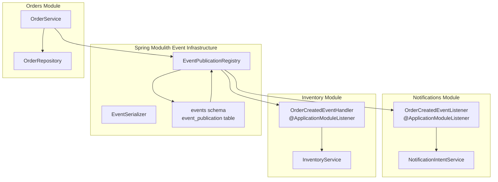
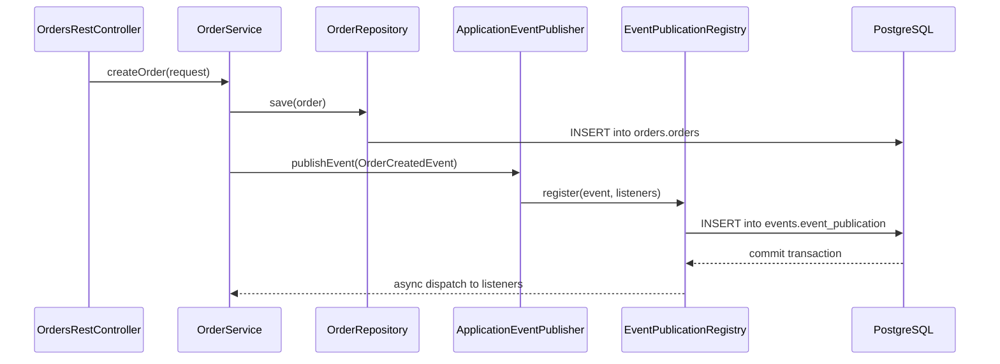
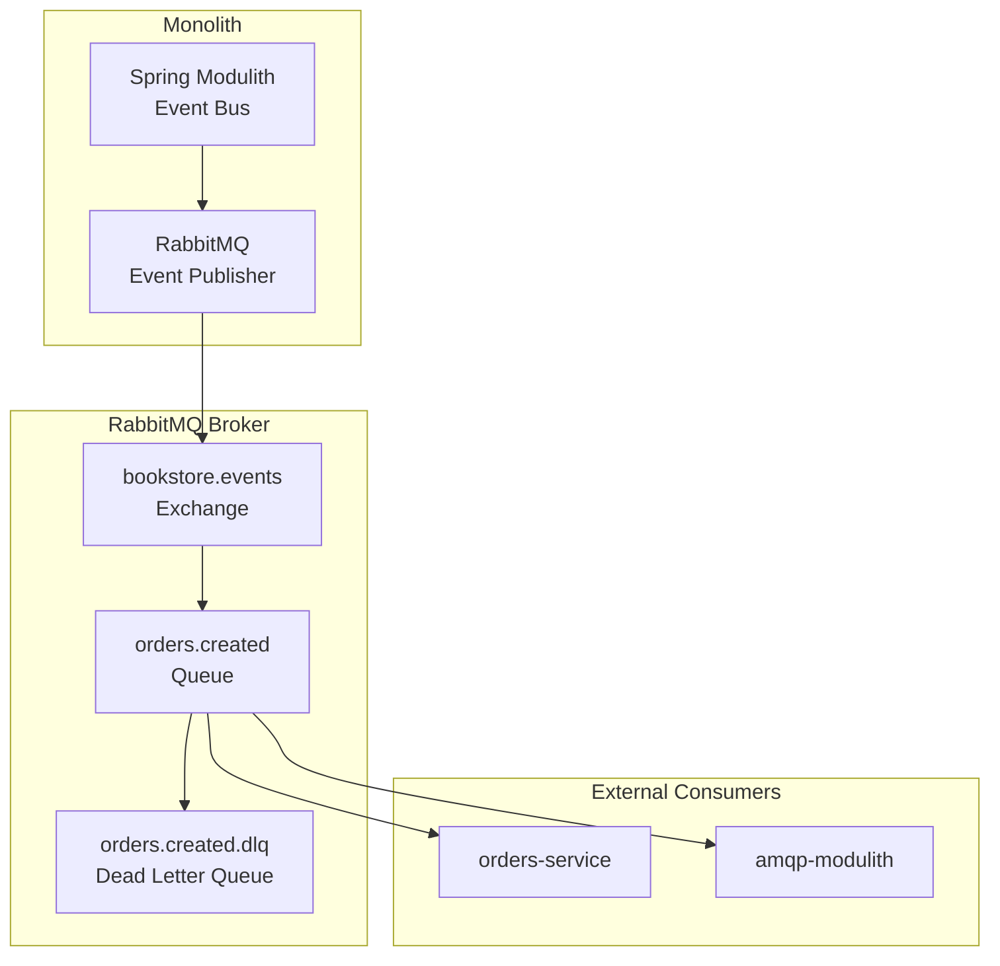
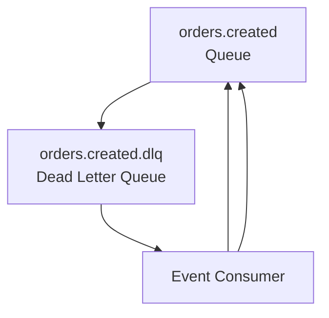
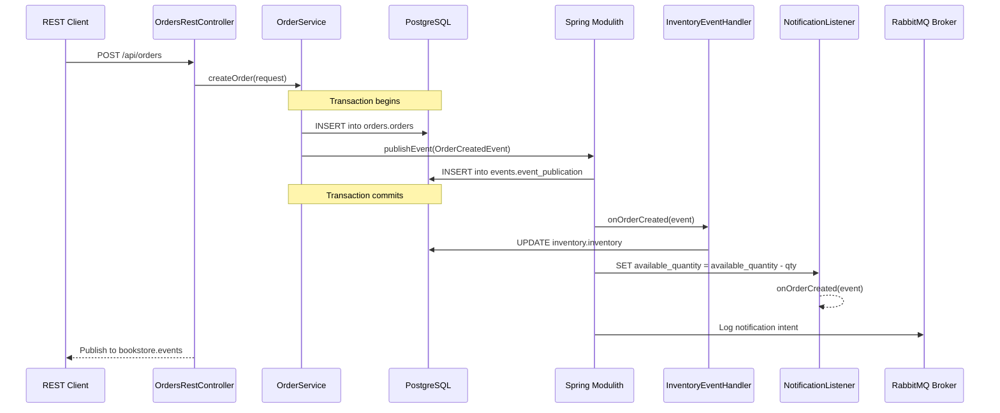
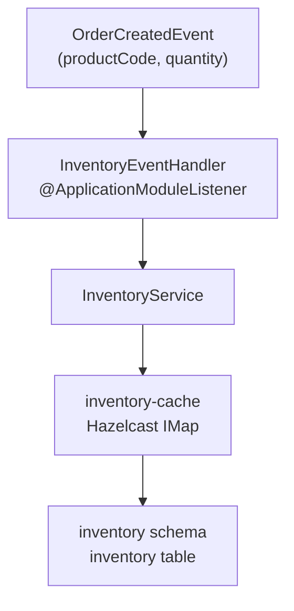
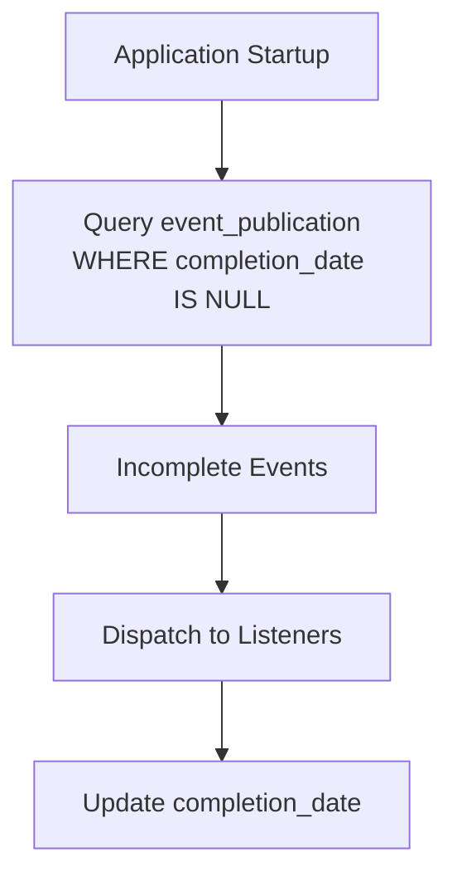
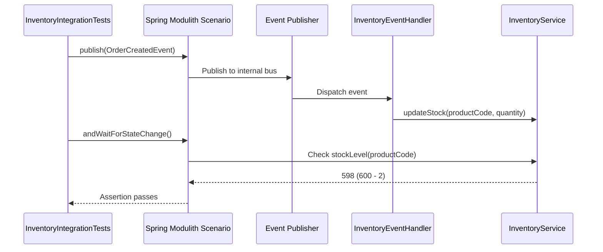

# Event-Driven Architecture

> **Relevant source files**
> * [README-API.md](https://github.com/philipz/spring-modular-monolith/blob/30c9bf30/README-API.md)
> * [README.md](https://github.com/philipz/spring-modular-monolith/blob/30c9bf30/README.md)
> * [docs/API_ANALYSIS_SUMMARY.txt](https://github.com/philipz/spring-modular-monolith/blob/30c9bf30/docs/API_ANALYSIS_SUMMARY.txt)
> * [docs/REST_API_ANALYSIS.md](https://github.com/philipz/spring-modular-monolith/blob/30c9bf30/docs/REST_API_ANALYSIS.md)
> * [docs/bookstore-microservices.png](https://github.com/philipz/spring-modular-monolith/blob/30c9bf30/docs/bookstore-microservices.png)
> * [docs/improvement.md](https://github.com/philipz/spring-modular-monolith/blob/30c9bf30/docs/improvement.md)
> * [docs/orders-data-ownership-analysis.md](https://github.com/philipz/spring-modular-monolith/blob/30c9bf30/docs/orders-data-ownership-analysis.md)
> * [docs/orders-module-boundary-analysis.md](https://github.com/philipz/spring-modular-monolith/blob/30c9bf30/docs/orders-module-boundary-analysis.md)
> * [docs/orders-traffic-migration.md](https://github.com/philipz/spring-modular-monolith/blob/30c9bf30/docs/orders-traffic-migration.md)
> * [k6.js](https://github.com/philipz/spring-modular-monolith/blob/30c9bf30/k6.js)
> * [k8s/manifests/rabbitmq.yaml](https://github.com/philipz/spring-modular-monolith/blob/30c9bf30/k8s/manifests/rabbitmq.yaml)
> * [src/test/java/com/sivalabs/bookstore/inventory/InventoryIntegrationTests.java](https://github.com/philipz/spring-modular-monolith/blob/30c9bf30/src/test/java/com/sivalabs/bookstore/inventory/InventoryIntegrationTests.java)

## Purpose and Scope

This page documents the event-driven architecture implementation in the Spring Modular Monolith, focusing on the **dual event bus pattern** that combines Spring Modulith's internal JDBC-backed event publication with RabbitMQ's external message broker. It covers event publication guarantees, event consumption patterns, and how domain events like `OrderCreatedEvent` flow through the system to maintain loose coupling between modules.

For information about overall module communication patterns including API calls and gRPC, see [Inter-Module Communication](/philipz/spring-modular-monolith/3.2-inter-module-communication). For module boundary enforcement, see [Module Structure and Boundaries](/philipz/spring-modular-monolith/3.1-module-structure-and-boundaries).

---

## Dual Event Bus Pattern

The system implements a **dual event bus architecture** where events are published to both an internal Spring Modulith event bus and an external RabbitMQ broker. This design provides different guarantees and consumption patterns for different use cases.

### Event Bus Comparison

| Aspect | Spring Modulith Internal | RabbitMQ External |
| --- | --- | --- |
| **Persistence** | JDBC-backed (events schema) | Message broker persistence |
| **Guarantee** | Transactional with domain changes | At-least-once delivery |
| **Scope** | Within monolith boundaries | Cross-service, external consumers |
| **Consumption** | `@ApplicationModuleListener` | `@RabbitListener` |
| **Replay** | Supported via event publication log | Requires dead letter queues |
| **Use Case** | Module decoupling within monolith | Microservice extraction, async processing |

**Sources:**

* [README.md L28-L29](https://github.com/philipz/spring-modular-monolith/blob/30c9bf30/README.md#L28-L29)
* [README.md L33-L35](https://github.com/philipz/spring-modular-monolith/blob/30c9bf30/README.md#L33-L35)

---

## Spring Modulith Internal Event Bus

### Architecture Overview



**Sources:**

* [README.md L28-L29](https://github.com/philipz/spring-modular-monolith/blob/30c9bf30/README.md#L28-L29)
* [README.md L33-L34](https://github.com/philipz/spring-modular-monolith/blob/30c9bf30/README.md#L33-L34)
* [src/test/java/com/sivalabs/bookstore/inventory/InventoryIntegrationTests.java L26-L31](https://github.com/philipz/spring-modular-monolith/blob/30c9bf30/src/test/java/com/sivalabs/bookstore/inventory/InventoryIntegrationTests.java#L26-L31)

### JDBC-Backed Event Publication

Spring Modulith persists events to the `events` schema in PostgreSQL **within the same transaction** as the domain operation. This provides guaranteed delivery: if the order creation fails, the event is never published; if the order succeeds, the event publication is durably recorded.

**Event Publication Table Structure:**

```css
#mermaid-0ch3xc4fwtwl{font-family:ui-sans-serif,-apple-system,system-ui,Segoe UI,Helvetica;font-size:16px;fill:#333;}@keyframes edge-animation-frame{from{stroke-dashoffset:0;}}@keyframes dash{to{stroke-dashoffset:0;}}#mermaid-0ch3xc4fwtwl .edge-animation-slow{stroke-dasharray:9,5!important;stroke-dashoffset:900;animation:dash 50s linear infinite;stroke-linecap:round;}#mermaid-0ch3xc4fwtwl .edge-animation-fast{stroke-dasharray:9,5!important;stroke-dashoffset:900;animation:dash 20s linear infinite;stroke-linecap:round;}#mermaid-0ch3xc4fwtwl .error-icon{fill:#dddddd;}#mermaid-0ch3xc4fwtwl .error-text{fill:#222222;stroke:#222222;}#mermaid-0ch3xc4fwtwl .edge-thickness-normal{stroke-width:1px;}#mermaid-0ch3xc4fwtwl .edge-thickness-thick{stroke-width:3.5px;}#mermaid-0ch3xc4fwtwl .edge-pattern-solid{stroke-dasharray:0;}#mermaid-0ch3xc4fwtwl .edge-thickness-invisible{stroke-width:0;fill:none;}#mermaid-0ch3xc4fwtwl .edge-pattern-dashed{stroke-dasharray:3;}#mermaid-0ch3xc4fwtwl .edge-pattern-dotted{stroke-dasharray:2;}#mermaid-0ch3xc4fwtwl .marker{fill:#999;stroke:#999;}#mermaid-0ch3xc4fwtwl .marker.cross{stroke:#999;}#mermaid-0ch3xc4fwtwl svg{font-family:ui-sans-serif,-apple-system,system-ui,Segoe UI,Helvetica;font-size:16px;}#mermaid-0ch3xc4fwtwl p{margin:0;}#mermaid-0ch3xc4fwtwl .entityBox{fill:#ffffff;stroke:#dddddd;}#mermaid-0ch3xc4fwtwl .relationshipLabelBox{fill:#dddddd;opacity:0.7;background-color:#dddddd;}#mermaid-0ch3xc4fwtwl .relationshipLabelBox rect{opacity:0.5;}#mermaid-0ch3xc4fwtwl .labelBkg{background-color:rgba(221, 221, 221, 0.5);}#mermaid-0ch3xc4fwtwl .edgeLabel .label{fill:#dddddd;font-size:14px;}#mermaid-0ch3xc4fwtwl .label{font-family:ui-sans-serif,-apple-system,system-ui,Segoe UI,Helvetica;color:#333;}#mermaid-0ch3xc4fwtwl .edge-pattern-dashed{stroke-dasharray:8,8;}#mermaid-0ch3xc4fwtwl .node rect,#mermaid-0ch3xc4fwtwl .node circle,#mermaid-0ch3xc4fwtwl .node ellipse,#mermaid-0ch3xc4fwtwl .node polygon{fill:#ffffff;stroke:#dddddd;stroke-width:1px;}#mermaid-0ch3xc4fwtwl .relationshipLine{stroke:#999;stroke-width:1;fill:none;}#mermaid-0ch3xc4fwtwl .marker{fill:none!important;stroke:#999!important;stroke-width:1;}#mermaid-0ch3xc4fwtwl :root{--mermaid-font-family:"trebuchet ms",verdana,arial,sans-serif;}EVENT_PUBLICATIONuuididPKtimestampcompletion_dateuuidlistener_idtimestamppublication_datevarcharserialized_event
```

The `event_publication` table tracks:

* **id**: Unique identifier for the publication
* **listener_id**: Target listener identifier
* **publication_date**: When the event was initially published
* **completion_date**: When the listener successfully processed it
* **serialized_event**: JSON representation of the event payload

Incomplete publications (where `completion_date` is NULL) are automatically retried on application startup.

**Sources:**

* [README.md L138](https://github.com/philipz/spring-modular-monolith/blob/30c9bf30/README.md#L138-L138)

### Event Publication API

Events are published using Spring's `ApplicationEventPublisher` within the domain service:



The `OrderService` publishes the `OrderCreatedEvent` after successfully persisting the order. Spring Modulith intercepts the publication, persists it to the event log, then dispatches it to registered listeners **after the transaction commits**.

**Sources:**

* [README.md L33](https://github.com/philipz/spring-modular-monolith/blob/30c9bf30/README.md#L33-L33)

### Guaranteed Delivery Mechanism

Spring Modulith provides guaranteed delivery through:

1. **Transactional Outbox Pattern**: Events are written to the `events` schema in the same transaction as domain data
2. **Completion Tracking**: Each listener's processing is tracked separately in `event_publication`
3. **Automatic Retry**: Incomplete publications are replayed on startup
4. **Idempotent Listeners**: Listeners must handle duplicate deliveries (at-least-once semantics)

**Sources:**

* [README.md L28-L29](https://github.com/philipz/spring-modular-monolith/blob/30c9bf30/README.md#L28-L29)

---

## RabbitMQ External Event Bus

### Integration Pattern

Events published through Spring Modulith are **republished to RabbitMQ** for external consumption. This enables:

* The extracted `orders-service` to consume order events
* The `amqp-modulith` service to process events asynchronously
* Future microservices to subscribe to domain events



**Sources:**

* [README.md L28](https://github.com/philipz/spring-modular-monolith/blob/30c9bf30/README.md#L28-L28)
* [docs/orders-traffic-migration.md L44](https://github.com/philipz/spring-modular-monolith/blob/30c9bf30/docs/orders-traffic-migration.md#L44-L44)
* [k8s/manifests/rabbitmq.yaml L1-L48](https://github.com/philipz/spring-modular-monolith/blob/30c9bf30/k8s/manifests/rabbitmq.yaml#L1-L48)

### RabbitMQ Configuration

RabbitMQ runs on port **5672** (AMQP) with management console on **15672**. Default credentials are `guest/guest` (development only).

**Connection Configuration:**

* Host: `spring-modular-monolith-rabbitmq-svc` (Kubernetes) or `localhost` (local development)
* Port: 5672
* Virtual Host: `/`
* Exchange: `bookstore.events` (topic exchange)
* Routing Key Pattern: `order.created`, `inventory.updated`, etc.

**Sources:**

* [README.md L88](https://github.com/philipz/spring-modular-monolith/blob/30c9bf30/README.md#L88-L88)
* [k8s/manifests/rabbitmq.yaml L36-L47](https://github.com/philipz/spring-modular-monolith/blob/30c9bf30/k8s/manifests/rabbitmq.yaml#L36-L47)

### Dead Letter Queue Pattern

Failed message processing is handled through dead letter queues (DLQ):



When a consumer fails to process a message after the configured retry count, RabbitMQ automatically routes it to the dead letter queue for manual investigation and potential replay.

**Sources:**

* [README.md L28](https://github.com/philipz/spring-modular-monolith/blob/30c9bf30/README.md#L28-L28)

---

## Event Flow: OrderCreatedEvent Example

### Event Publication Flow

The `OrderCreatedEvent` demonstrates the complete event flow from publication to consumption:



**Sources:**

* [README.md L33](https://github.com/philipz/spring-modular-monolith/blob/30c9bf30/README.md#L33-L33)
* [src/test/java/com/sivalabs/bookstore/inventory/InventoryIntegrationTests.java L26-L31](https://github.com/philipz/spring-modular-monolith/blob/30c9bf30/src/test/java/com/sivalabs/bookstore/inventory/InventoryIntegrationTests.java#L26-L31)

### OrderCreatedEvent Structure

The event payload is defined in the `orders.api.events` package, making it accessible to other modules without exposing internal order implementation:

**Event Class Location:** `src/main/java/com/sivalabs/bookstore/orders/api/events/OrderCreatedEvent.java`

**Key Fields:**

* `orderNumber`: String - unique order identifier
* `productCode`: String - product code for inventory lookup
* `quantity`: int - quantity ordered
* `customer`: Customer - customer details for notifications

**Sources:**

* [src/test/java/com/sivalabs/bookstore/inventory/InventoryIntegrationTests.java L8-L9](https://github.com/philipz/spring-modular-monolith/blob/30c9bf30/src/test/java/com/sivalabs/bookstore/inventory/InventoryIntegrationTests.java#L8-L9)
* [src/test/java/com/sivalabs/bookstore/inventory/InventoryIntegrationTests.java L29](https://github.com/philipz/spring-modular-monolith/blob/30c9bf30/src/test/java/com/sivalabs/bookstore/inventory/InventoryIntegrationTests.java#L29-L29)

---

## Event Consumption Patterns

### Internal Module Listeners

Modules consume events using the `@ApplicationModuleListener` annotation. Spring Modulith ensures listeners are called **after the publishing transaction commits** and tracks completion in the event publication log.

**Inventory Module Example:**



The `InventoryService` decrements available stock when processing the event. Cache write-through ensures the database is updated synchronously.

**Sources:**

* [README.md L33](https://github.com/philipz/spring-modular-monolith/blob/30c9bf30/README.md#L33-L33)
* [src/test/java/com/sivalabs/bookstore/inventory/InventoryIntegrationTests.java L20-L32](https://github.com/philipz/spring-modular-monolith/blob/30c9bf30/src/test/java/com/sivalabs/bookstore/inventory/InventoryIntegrationTests.java#L20-L32)

### Notifications Module

The notifications module listens to domain events and logs notification intents (ready for future email integration):

**Location:** `src/main/java/com/sivalabs/bookstore/notifications/`

The module currently logs notification intents but provides a foundation for:

* Email notifications on order creation
* SMS alerts for order status changes
* Push notifications to mobile apps

**Sources:**

* [README.md L13](https://github.com/philipz/spring-modular-monolith/blob/30c9bf30/README.md#L13-L13)

### RabbitMQ Consumers

External services consume events via `@RabbitListener`:

**AMQP Modulith Service:**

* Consumes events from RabbitMQ
* Processes specialized event handling
* Uses dedicated PostgreSQL instance (`orders-postgres`)

**Orders Service:**

* Extracted microservice consuming order events
* Maintains its own event processing logic
* Can evolve independently from monolith

**Sources:**

* [README.md L28](https://github.com/philipz/spring-modular-monolith/blob/30c9bf30/README.md#L28-L28)
* [docs/orders-traffic-migration.md L44](https://github.com/philipz/spring-modular-monolith/blob/30c9bf30/docs/orders-traffic-migration.md#L44-L44)

---

## Event Replay and Recovery

### Automatic Replay on Startup

Spring Modulith automatically replays incomplete event publications on application startup. Events are considered incomplete if:

* The `completion_date` in `event_publication` is NULL
* The listener threw an exception during processing
* The application crashed before listener completion

**Replay Process:**



**Sources:**

* [README.md L28-L29](https://github.com/philipz/spring-modular-monolith/blob/30c9bf30/README.md#L28-L29)

### Manual Event Replay

For debugging or data recovery, events can be replayed by:

1. Querying the `events.event_publication` table
2. Identifying events with specific criteria (date range, event type)
3. Manually dispatching via `ApplicationEventPublisher`
4. Or resetting `completion_date` to NULL for automatic replay on restart

**Sources:**

* [README.md L138](https://github.com/philipz/spring-modular-monolith/blob/30c9bf30/README.md#L138-L138)

---

## Testing Event-Driven Flows

### Spring Modulith Scenario API

Spring Modulith provides a `Scenario` API for testing event publication and consumption in integration tests:



**Example Test:**

The `InventoryIntegrationTests` demonstrates event-driven testing:

```javascript
@Test
void handleOrderCreatedEvent(Scenario scenario) {
    var customer = new Customer("Siva", "siva@gmail.com", "9987654");
    String productCode = "P114";
    var event = new OrderCreatedEvent(UUID.randomUUID().toString(), productCode, 2, customer);
    
    scenario.publish(event)
            .andWaitForStateChange(() -> inventoryService.getStockLevel(productCode) == 598);
}
```

**Key Testing Features:**

* **Event Publication**: `scenario.publish(event)` simulates event publication
* **State Verification**: `andWaitForStateChange()` waits for async processing
* **Isolation**: Each test runs in its own transaction with rollback
* **Module Boundary Testing**: Verifies cross-module event flow

**Sources:**

* [src/test/java/com/sivalabs/bookstore/inventory/InventoryIntegrationTests.java L17-L32](https://github.com/philipz/spring-modular-monolith/blob/30c9bf30/src/test/java/com/sivalabs/bookstore/inventory/InventoryIntegrationTests.java#L17-L32)

---

## Configuration Properties

### Spring Modulith Event Settings

**Application Properties Location:** `src/main/resources/application.properties`

Key configuration properties:

* `spring.modulith.events.jdbc-schema-initialization.enabled=true` - Enable JDBC event store
* `spring.modulith.events.jdbc.enabled=true` - Use JDBC for event persistence
* Database connection points to `events` schema for event publication log

### RabbitMQ Connection Properties

* `spring.rabbitmq.host` - RabbitMQ broker hostname
* `spring.rabbitmq.port=5672` - AMQP port
* `spring.rabbitmq.username=guest` - Credentials (development)
* `spring.rabbitmq.password=guest`

**Sources:**

* [README.md L88](https://github.com/philipz/spring-modular-monolith/blob/30c9bf30/README.md#L88-L88)
* [README.md L97](https://github.com/philipz/spring-modular-monolith/blob/30c9bf30/README.md#L97-L97)

---

## Observability and Monitoring

### Event Tracing

OpenTelemetry automatically instruments event publication and consumption:

* Each event publication creates a new trace span
* Event listeners are child spans of the publishing operation
* Trace context propagates through RabbitMQ message headers

Access traces in HyperDX UI at `http://localhost:8081` to debug event flow and identify processing delays.

### Actuator Endpoints

Spring Modulith exposes event publication information via Actuator:

**Endpoint:** `http://localhost:8080/actuator/modulith`

Provides:

* Module dependency graph including event relationships
* Event publication statistics
* Incomplete event publications

**Sources:**

* [README.md L86](https://github.com/philipz/spring-modular-monolith/blob/30c9bf30/README.md#L86-L86)
* [docs/REST_API_ANALYSIS.md L80](https://github.com/philipz/spring-modular-monolith/blob/30c9bf30/docs/REST_API_ANALYSIS.md#L80-L80)

---

## Best Practices and Considerations

### Event Design Guidelines

1. **Immutable Events**: Event classes should be immutable records or data classes
2. **Minimal Payload**: Include only data necessary for consumers; avoid embedding full entities
3. **Versioning**: Consider event versioning strategy for future schema evolution
4. **Naming**: Use past tense (OrderCreated, InventoryUpdated) to indicate completed actions

### Idempotency

Event listeners **must be idempotent** because:

* Spring Modulith provides at-least-once delivery
* Events may be replayed after failures
* RabbitMQ may deliver duplicates during network issues

**Idempotency Strategies:**

* Check if side effect already applied before processing
* Use unique event identifiers to track processed events
* Leverage database constraints to prevent duplicate writes

### Performance Considerations

1. **Synchronous vs Asynchronous**: Internal listeners run synchronously by default; use `@Async` for long-running operations
2. **Transaction Boundaries**: Event publication adds database writes; monitor transaction duration
3. **RabbitMQ Batching**: Consider batching multiple events for high-volume scenarios
4. **Cache Invalidation**: Coordinate cache updates with event processing to avoid stale reads

**Sources:**

* [README.md L33-L35](https://github.com/philipz/spring-modular-monolith/blob/30c9bf30/README.md#L33-L35)

---

## Migration Path to Microservices

The dual event bus pattern facilitates gradual microservice extraction:

**Phase 1: Internal Events Only**

* All modules communicate via Spring Modulith internal events
* Events persisted to JDBC for replay capability

**Phase 2: RabbitMQ Bridge** (Current State)

* Events republished to RabbitMQ
* External `orders-service` consumes events
* Both internal and external consumers coexist

**Phase 3: External Events Only**

* Modules become independent services
* All communication via RabbitMQ
* Spring Modulith event bus retired for extracted modules

**Sources:**

* [README.md L28](https://github.com/philipz/spring-modular-monolith/blob/30c9bf30/README.md#L28-L28)
* [docs/orders-traffic-migration.md L1-L68](https://github.com/philipz/spring-modular-monolith/blob/30c9bf30/docs/orders-traffic-migration.md#L1-L68)