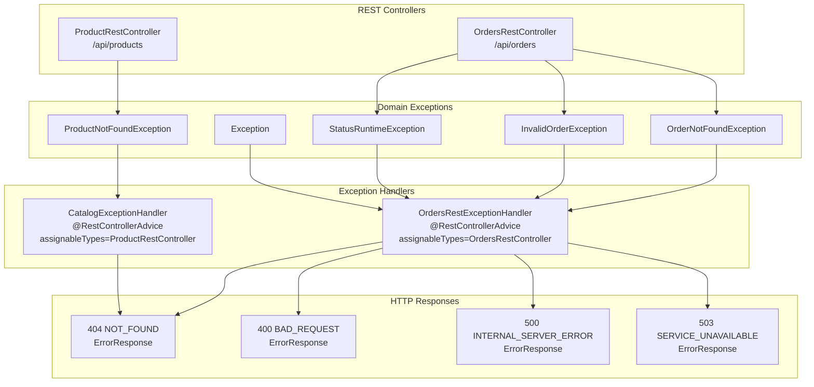
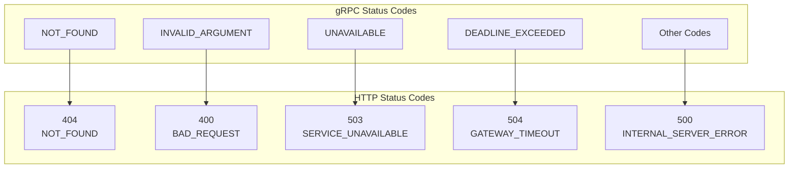
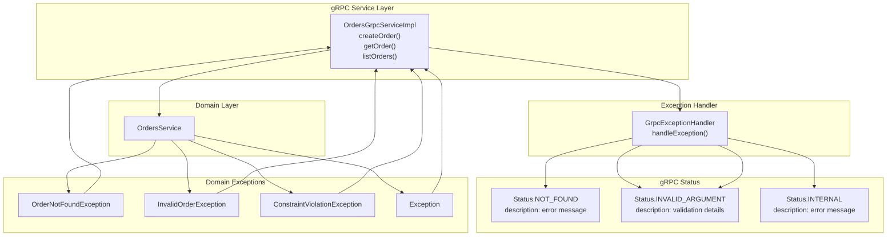
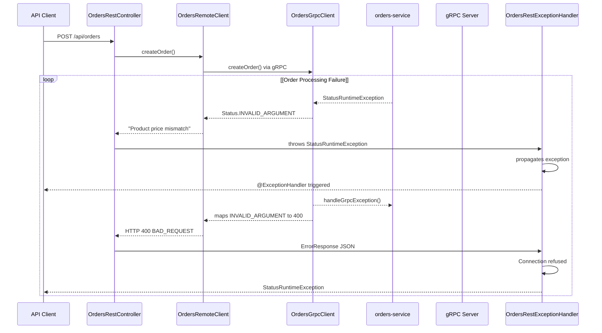

# Exception Handling and Error Responses

> **Relevant source files**
> * [.spec-workflow/approvals/next-frontend-integration/approval_1760807319093_l7v5gve2o.json](https://github.com/philipz/spring-modular-monolith/blob/30c9bf30/.spec-workflow/approvals/next-frontend-integration/approval_1760807319093_l7v5gve2o.json)
> * [.spec-workflow/approvals/next-frontend-integration/approval_1760833920449_qtnnlhttk.json](https://github.com/philipz/spring-modular-monolith/blob/30c9bf30/.spec-workflow/approvals/next-frontend-integration/approval_1760833920449_qtnnlhttk.json)
> * [.spec-workflow/approvals/next-frontend-integration/approval_1760837739843_h9y1nukfu.json](https://github.com/philipz/spring-modular-monolith/blob/30c9bf30/.spec-workflow/approvals/next-frontend-integration/approval_1760837739843_h9y1nukfu.json)
> * [.spec-workflow/approvals/next-frontend-integration/approval_1760850183470_6dmde9if0.json](https://github.com/philipz/spring-modular-monolith/blob/30c9bf30/.spec-workflow/approvals/next-frontend-integration/approval_1760850183470_6dmde9if0.json)
> * [src/main/java/com/sivalabs/bookstore/catalog/web/CatalogExceptionHandler.java](https://github.com/philipz/spring-modular-monolith/blob/30c9bf30/src/main/java/com/sivalabs/bookstore/catalog/web/CatalogExceptionHandler.java)
> * [src/main/java/com/sivalabs/bookstore/config/GrpcRetryInterceptor.java](https://github.com/philipz/spring-modular-monolith/blob/30c9bf30/src/main/java/com/sivalabs/bookstore/config/GrpcRetryInterceptor.java)
> * [src/main/java/com/sivalabs/bookstore/config/GrpcServerConfig.java](https://github.com/philipz/spring-modular-monolith/blob/30c9bf30/src/main/java/com/sivalabs/bookstore/config/GrpcServerConfig.java)
> * [src/main/java/com/sivalabs/bookstore/orders/grpc/GrpcExceptionHandler.java](https://github.com/philipz/spring-modular-monolith/blob/30c9bf30/src/main/java/com/sivalabs/bookstore/orders/grpc/GrpcExceptionHandler.java)
> * [src/main/java/com/sivalabs/bookstore/orders/web/OrdersRestController.java](https://github.com/philipz/spring-modular-monolith/blob/30c9bf30/src/main/java/com/sivalabs/bookstore/orders/web/OrdersRestController.java)
> * [src/main/java/com/sivalabs/bookstore/orders/web/OrdersRestExceptionHandler.java](https://github.com/philipz/spring-modular-monolith/blob/30c9bf30/src/main/java/com/sivalabs/bookstore/orders/web/OrdersRestExceptionHandler.java)

## Purpose and Scope

This document describes the exception handling mechanisms and standardized error response formats used across all API endpoints in the Spring Modular Monolith. It covers both REST and gRPC protocols, detailing how domain exceptions are translated into appropriate HTTP status codes and gRPC status codes, and how validation errors are formatted for client consumption.

For information about the REST API endpoint definitions, see [REST API Endpoints](/philipz/spring-modular-monolith/7.1-rest-api-endpoints). For gRPC service definitions, see [gRPC Services and Protocol Buffers](/philipz/spring-modular-monolith/7.2-grpc-services-and-protocol-buffers).

---

## Error Response Format

All REST API errors return a standardized `ErrorResponse` structure defined in the `common` module. This ensures consistent error handling across all business modules.

**Structure:**

| Field | Type | Description |
| --- | --- | --- |
| `statusCode` | `int` | HTTP status code (e.g., 404, 400, 500) |
| `message` | `String` | Human-readable error message |
| `timestamp` | `LocalDateTime` | Time when the error occurred |

**Example JSON Response:**

```json
{
  "statusCode": 404,
  "message": "Order not found with number: ORD-12345",
  "timestamp": "2024-01-15T10:30:45.123"
}
```

**Sources:** [src/main/java/com/sivalabs/bookstore/common/models/ErrorResponse.java](https://github.com/philipz/spring-modular-monolith/blob/30c9bf30/src/main/java/com/sivalabs/bookstore/common/models/ErrorResponse.java)

 [src/main/java/com/sivalabs/bookstore/orders/web/OrdersRestExceptionHandler.java L24-L26](https://github.com/philipz/spring-modular-monolith/blob/30c9bf30/src/main/java/com/sivalabs/bookstore/orders/web/OrdersRestExceptionHandler.java#L24-L26)

---

## REST Exception Handling Architecture

The REST API uses Spring's `@RestControllerAdvice` mechanism to provide centralized exception handling per module. Each module defines its own exception handler that extends `ResponseEntityExceptionHandler`, ensuring consistent error processing while maintaining module boundaries.

### Module-Specific Exception Handlers



**Sources:** [src/main/java/com/sivalabs/bookstore/orders/web/OrdersRestExceptionHandler.java L25-L27](https://github.com/philipz/spring-modular-monolith/blob/30c9bf30/src/main/java/com/sivalabs/bookstore/orders/web/OrdersRestExceptionHandler.java#L25-L27)

 [src/main/java/com/sivalabs/bookstore/catalog/web/CatalogExceptionHandler.java L15-L16](https://github.com/philipz/spring-modular-monolith/blob/30c9bf30/src/main/java/com/sivalabs/bookstore/catalog/web/CatalogExceptionHandler.java#L15-L16)

### Orders Module Exception Handling

The `OrdersRestExceptionHandler` is the most comprehensive exception handler, demonstrating all exception handling patterns including gRPC exception translation.

**Handler Class:** [src/main/java/com/sivalabs/bookstore/orders/web/OrdersRestExceptionHandler.java L25-L153](https://github.com/philipz/spring-modular-monolith/blob/30c9bf30/src/main/java/com/sivalabs/bookstore/orders/web/OrdersRestExceptionHandler.java#L25-L153)

#### Exception Type Mappings

| Exception Type | HTTP Status | Handler Method | Description |
| --- | --- | --- | --- |
| `OrderNotFoundException` | 404 | `handleOrderNotFound()` | Order with given identifier not found |
| `InvalidOrderException` | 400 | `handleInvalidOrder()` | Business validation failed (e.g., invalid product) |
| `StatusRuntimeException` | varies | `handleGrpcException()` | gRPC client call failure (see gRPC mapping below) |
| `ResponseStatusException` | varies | `handleResponseStatusException()` | Generic Spring error with status |
| `MethodArgumentNotValidException` | 400 | `handleMethodArgumentNotValid()` | Bean validation failure |
| `Exception` | 500 | `handleGenericException()` | Unexpected server error |

**Sources:** [src/main/java/com/sivalabs/bookstore/orders/web/OrdersRestExceptionHandler.java L30-L124](https://github.com/philipz/spring-modular-monolith/blob/30c9bf30/src/main/java/com/sivalabs/bookstore/orders/web/OrdersRestExceptionHandler.java#L30-L124)

#### gRPC to HTTP Status Translation

When the monolith communicates with the extracted `orders-service` via gRPC, `StatusRuntimeException` errors are translated to appropriate HTTP status codes:



**Implementation:** [src/main/java/com/sivalabs/bookstore/orders/web/OrdersRestExceptionHandler.java L57-L98](https://github.com/philipz/spring-modular-monolith/blob/30c9bf30/src/main/java/com/sivalabs/bookstore/orders/web/OrdersRestExceptionHandler.java#L57-L98)

**Translation Logic:**

* **NOT_FOUND**: Preserves gRPC description as HTTP error message
* **INVALID_ARGUMENT**: Prepends "Validation failed: " to description
* **UNAVAILABLE**: Returns user-friendly "Orders service unavailable" message
* **DEADLINE_EXCEEDED**: Returns "Request timeout" message
* **All others**: Returns generic "Unable to process request" message

**Sources:** [src/main/java/com/sivalabs/bookstore/orders/web/OrdersRestExceptionHandler.java L67-L94](https://github.com/philipz/spring-modular-monolith/blob/30c9bf30/src/main/java/com/sivalabs/bookstore/orders/web/OrdersRestExceptionHandler.java#L67-L94)

### Catalog Module Exception Handling

The `CatalogExceptionHandler` provides simpler exception handling focused on product-not-found scenarios.

**Handler Class:** [src/main/java/com/sivalabs/bookstore/catalog/web/CatalogExceptionHandler.java L15-L28](https://github.com/philipz/spring-modular-monolith/blob/30c9bf30/src/main/java/com/sivalabs/bookstore/catalog/web/CatalogExceptionHandler.java#L15-L28)

**Handles:**

* `ProductNotFoundException` → 404 with product identifier in message

**Sources:** [src/main/java/com/sivalabs/bookstore/catalog/web/CatalogExceptionHandler.java L19-L27](https://github.com/philipz/spring-modular-monolith/blob/30c9bf30/src/main/java/com/sivalabs/bookstore/catalog/web/CatalogExceptionHandler.java#L19-L27)

### Validation Error Handling

Bean validation errors (`@Valid` annotation failures) are handled by overriding `handleMethodArgumentNotValid()` from `ResponseEntityExceptionHandler`.

**Format Example:**

```json
{
  "statusCode": 400,
  "message": "Validation failed: customerName - must not be blank; customerEmail - must be a valid email; ",
  "timestamp": "2024-01-15T10:30:45.123"
}
```

**Implementation:** [src/main/java/com/sivalabs/bookstore/orders/web/OrdersRestExceptionHandler.java L126-L152](https://github.com/philipz/spring-modular-monolith/blob/30c9bf30/src/main/java/com/sivalabs/bookstore/orders/web/OrdersRestExceptionHandler.java#L126-L152)

The handler iterates through all `FieldError` objects and constructs a message in the format: `field - errorMessage;`

**Sources:** [src/main/java/com/sivalabs/bookstore/orders/web/OrdersRestExceptionHandler.java L133-L146](https://github.com/philipz/spring-modular-monolith/blob/30c9bf30/src/main/java/com/sivalabs/bookstore/orders/web/OrdersRestExceptionHandler.java#L133-L146)

---

## gRPC Exception Handling

The gRPC server uses the `GrpcExceptionHandler` utility class to translate domain and validation exceptions into appropriate gRPC `Status` codes.

### Exception Translation Flow



**Sources:** [src/main/java/com/sivalabs/bookstore/orders/grpc/GrpcExceptionHandler.java L26-L72](https://github.com/philipz/spring-modular-monolith/blob/30c9bf30/src/main/java/com/sivalabs/bookstore/orders/grpc/GrpcExceptionHandler.java#L26-L72)

### gRPC Status Code Mappings

The `GrpcExceptionHandler` provides a static utility method `handleException()` that maps exceptions to gRPC status codes:

| Exception Type | gRPC Status | Description Format | Logging Level |
| --- | --- | --- | --- |
| `OrderNotFoundException` | `NOT_FOUND` | Preserves exception message | DEBUG |
| `InvalidOrderException` | `INVALID_ARGUMENT` | Preserves exception message | DEBUG |
| `ConstraintViolationException` | `INVALID_ARGUMENT` | Comma-separated field violations | DEBUG |
| `StatusRuntimeException` | Preserves | Propagates existing status | DEBUG |
| Any other `Exception` | `INTERNAL` | Exception message or "Internal server error" | ERROR |

**Implementation:** [src/main/java/com/sivalabs/bookstore/orders/grpc/GrpcExceptionHandler.java L26-L72](https://github.com/philipz/spring-modular-monolith/blob/30c9bf30/src/main/java/com/sivalabs/bookstore/orders/grpc/GrpcExceptionHandler.java#L26-L72)

### Constraint Violation Formatting

For bean validation errors (`ConstraintViolationException`), the handler formats violations as:

```yaml
propertyPath: message, propertyPath: message
```

Example:

```yaml
customerName: must not be blank, customerEmail: must be a valid email
```

**Implementation:** [src/main/java/com/sivalabs/bookstore/orders/grpc/GrpcExceptionHandler.java L47-L65](https://github.com/philipz/spring-modular-monolith/blob/30c9bf30/src/main/java/com/sivalabs/bookstore/orders/grpc/GrpcExceptionHandler.java#L47-L65)

 [src/main/java/com/sivalabs/bookstore/orders/grpc/GrpcExceptionHandler.java L74-L76](https://github.com/philipz/spring-modular-monolith/blob/30c9bf30/src/main/java/com/sivalabs/bookstore/orders/grpc/GrpcExceptionHandler.java#L74-L76)

**Sources:** [src/main/java/com/sivalabs/bookstore/orders/grpc/GrpcExceptionHandler.java L1-L78](https://github.com/philipz/spring-modular-monolith/blob/30c9bf30/src/main/java/com/sivalabs/bookstore/orders/grpc/GrpcExceptionHandler.java#L1-L78)

---

## Exception Flow: REST to gRPC

When the monolith's REST API delegates to the gRPC-based `orders-service`, exceptions flow through multiple layers of translation:



**Sources:** [src/main/java/com/sivalabs/bookstore/orders/web/OrdersRestController.java L46-L50](https://github.com/philipz/spring-modular-monolith/blob/30c9bf30/src/main/java/com/sivalabs/bookstore/orders/web/OrdersRestController.java#L46-L50)

 [src/main/java/com/sivalabs/bookstore/orders/web/OrdersRestExceptionHandler.java L57-L98](https://github.com/philipz/spring-modular-monolith/blob/30c9bf30/src/main/java/com/sivalabs/bookstore/orders/web/OrdersRestExceptionHandler.java#L57-L98)

---

## OpenAPI Error Documentation

REST API endpoints document expected error responses using OpenAPI annotations (`@ApiResponse`). These annotations generate machine-readable API specifications and appear in Swagger UI.

### Example: Create Order Endpoint

[src/main/java/com/sivalabs/bookstore/orders/web/OrdersRestController.java L36-L51](https://github.com/philipz/spring-modular-monolith/blob/30c9bf30/src/main/java/com/sivalabs/bookstore/orders/web/OrdersRestController.java#L36-L51)

```
@ApiResponses({
    @ApiResponse(
        responseCode = "201",
        description = "Order created successfully",
        content = @Content(schema = @Schema(implementation = CreateOrderResponse.class))),
    @ApiResponse(responseCode = "400", description = "Invalid order data"),
    @ApiResponse(responseCode = "503", description = "Orders service unavailable")
})
```

### Common HTTP Status Codes

| Status Code | Meaning | Usage |
| --- | --- | --- |
| 200 | OK | Successful GET request |
| 201 | Created | Successful POST (order creation) |
| 400 | Bad Request | Validation failure, invalid data |
| 404 | Not Found | Resource not found (order, product) |
| 500 | Internal Server Error | Unexpected server error |
| 503 | Service Unavailable | gRPC service unavailable |
| 504 | Gateway Timeout | gRPC deadline exceeded |

**Sources:** [src/main/java/com/sivalabs/bookstore/orders/web/OrdersRestController.java L38-L45](https://github.com/philipz/spring-modular-monolith/blob/30c9bf30/src/main/java/com/sivalabs/bookstore/orders/web/OrdersRestController.java#L38-L45)

 [src/main/java/com/sivalabs/bookstore/orders/web/OrdersRestController.java L76-L83](https://github.com/philipz/spring-modular-monolith/blob/30c9bf30/src/main/java/com/sivalabs/bookstore/orders/web/OrdersRestController.java#L76-L83)

---

## Logging Strategy

Exception handlers follow a consistent logging strategy based on severity:

| Severity | Log Level | Exception Types | Rationale |
| --- | --- | --- | --- |
| **WARN** | `log.warn()` | `OrderNotFoundException`, `ProductNotFoundException`, `InvalidOrderException`, Validation errors | Expected business errors, useful for debugging but not critical |
| **ERROR** | `log.error()` | `Exception`, gRPC `UNAVAILABLE`, gRPC `DEADLINE_EXCEEDED` | Unexpected errors requiring investigation |
| **DEBUG** | `log.debug()` | gRPC status propagation | Technical details for development/troubleshooting |

**Examples:**

* [src/main/java/com/sivalabs/bookstore/orders/web/OrdersRestExceptionHandler.java L35](https://github.com/philipz/spring-modular-monolith/blob/30c9bf30/src/main/java/com/sivalabs/bookstore/orders/web/OrdersRestExceptionHandler.java#L35-L35)  - WARN for OrderNotFoundException
* [src/main/java/com/sivalabs/bookstore/orders/web/OrdersRestExceptionHandler.java L82](https://github.com/philipz/spring-modular-monolith/blob/30c9bf30/src/main/java/com/sivalabs/bookstore/orders/web/OrdersRestExceptionHandler.java#L82-L82)  - ERROR for gRPC UNAVAILABLE
* [src/main/java/com/sivalabs/bookstore/orders/grpc/GrpcExceptionHandler.java L32](https://github.com/philipz/spring-modular-monolith/blob/30c9bf30/src/main/java/com/sivalabs/bookstore/orders/grpc/GrpcExceptionHandler.java#L32-L32)  - DEBUG for domain exceptions in gRPC

**Sources:** [src/main/java/com/sivalabs/bookstore/orders/web/OrdersRestExceptionHandler.java L28-L124](https://github.com/philipz/spring-modular-monolith/blob/30c9bf30/src/main/java/com/sivalabs/bookstore/orders/web/OrdersRestExceptionHandler.java#L28-L124)

 [src/main/java/com/sivalabs/bookstore/orders/grpc/GrpcExceptionHandler.java L20-L72](https://github.com/philipz/spring-modular-monolith/blob/30c9bf30/src/main/java/com/sivalabs/bookstore/orders/grpc/GrpcExceptionHandler.java#L20-L72)

---

## Retry and Resilience

Exception handling integrates with retry mechanisms for transient gRPC failures. The `GrpcRetryInterceptor` automatically retries gRPC calls that fail with `Status.UNAVAILABLE`.

### Retryable Status Codes

Only `UNAVAILABLE` status is considered retryable, as it typically indicates temporary network issues or service startup delays.

[src/main/java/com/sivalabs/bookstore/config/GrpcRetryInterceptor.java L26](https://github.com/philipz/spring-modular-monolith/blob/30c9bf30/src/main/java/com/sivalabs/bookstore/config/GrpcRetryInterceptor.java#L26-L26)

```java
private static final Set<Status.Code> RETRYABLE_CODES = EnumSet.of(Status.Code.UNAVAILABLE);
```

### Retry Behavior

| Configuration | Default Value | Description |
| --- | --- | --- |
| `maxRetryAttempts` | From `GrpcProperties` | Maximum number of retry attempts |
| `baseDelayMillis` | 100ms | Initial backoff delay |
| Backoff Strategy | Exponential | `100ms * 2^(attempt-1)` |

If retries are exhausted, the final `StatusRuntimeException` is propagated to the REST exception handler, which returns HTTP 503 to the client.

**Sources:** [src/main/java/com/sivalabs/bookstore/config/GrpcRetryInterceptor.java L26-L181](https://github.com/philipz/spring-modular-monolith/blob/30c9bf30/src/main/java/com/sivalabs/bookstore/config/GrpcRetryInterceptor.java#L26-L181)

 [src/main/java/com/sivalabs/bookstore/orders/web/OrdersRestExceptionHandler.java L79-L83](https://github.com/philipz/spring-modular-monolith/blob/30c9bf30/src/main/java/com/sivalabs/bookstore/orders/web/OrdersRestExceptionHandler.java#L79-L83)

---

## Summary

The exception handling architecture provides:

1. **Consistency**: All REST errors use the standardized `ErrorResponse` format
2. **Module Isolation**: Each module has its own `@RestControllerAdvice` handler
3. **Protocol Translation**: Seamless gRPC-to-HTTP status code mapping
4. **Rich Documentation**: OpenAPI annotations document all error scenarios
5. **Comprehensive Logging**: Appropriate log levels for debugging and monitoring
6. **Resilience**: Automatic retry for transient gRPC failures

This design enables the system to gracefully handle errors across module boundaries and protocol transitions, providing consistent error experiences to API clients while maintaining observability for operators.