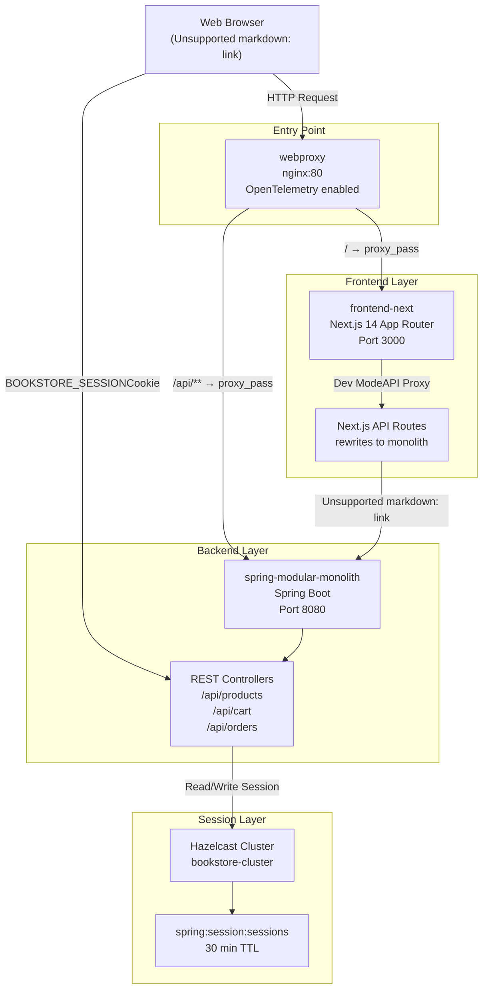
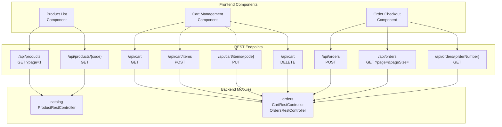
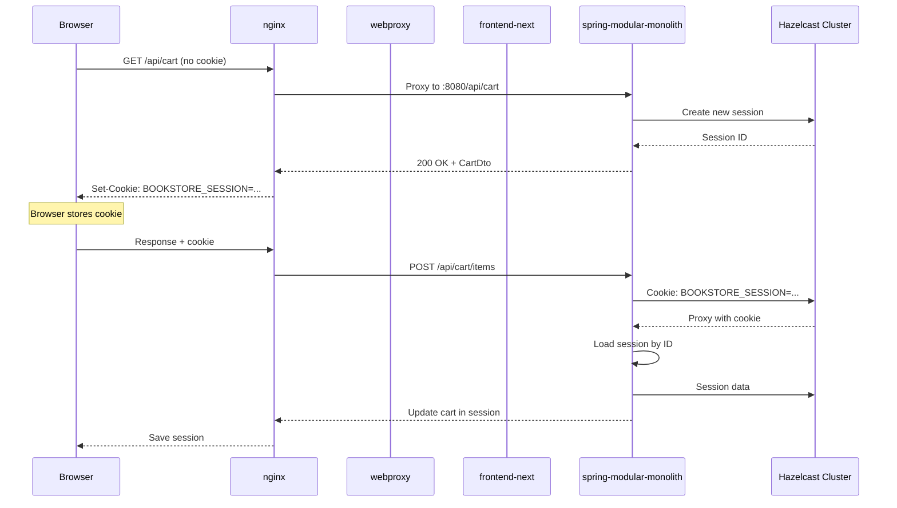
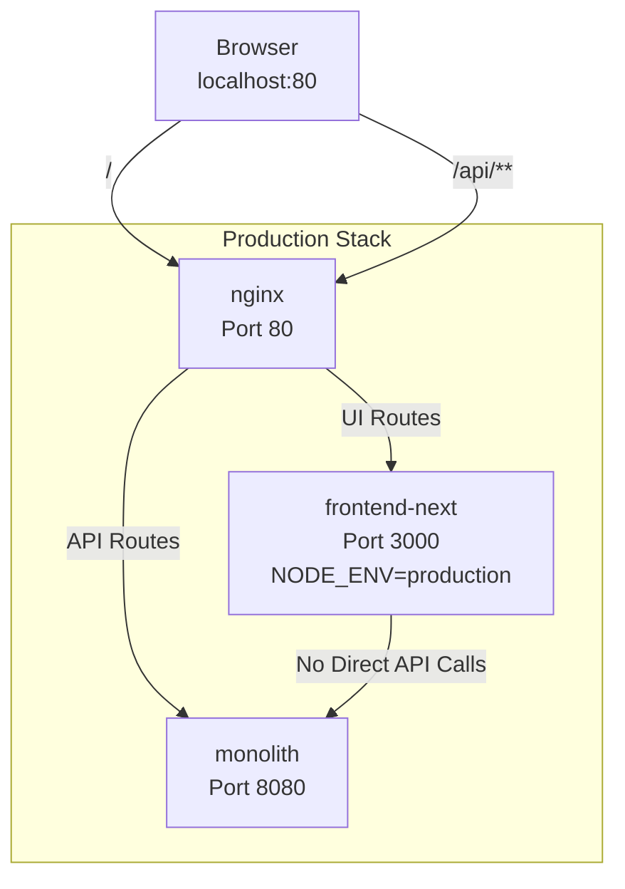
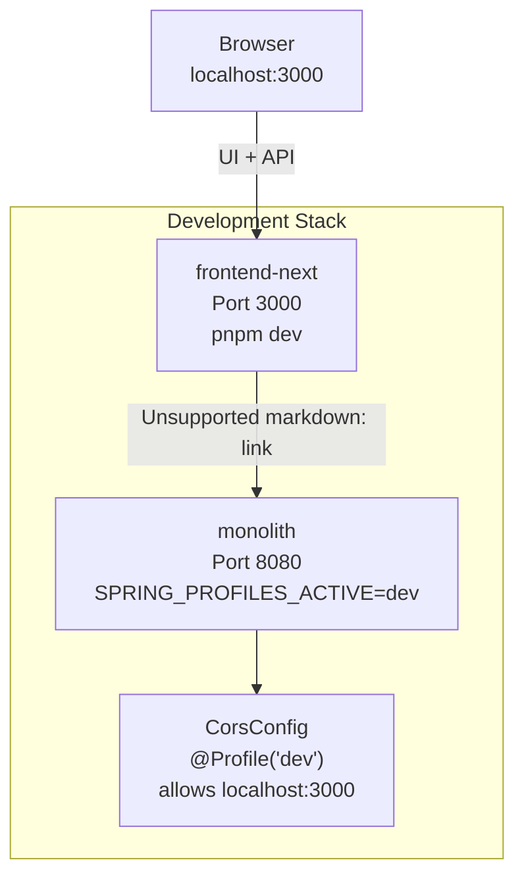

# Frontend Integration

> **Relevant source files**
> * [README-API.md](https://github.com/philipz/spring-modular-monolith/blob/30c9bf30/README-API.md)
> * [README.md](https://github.com/philipz/spring-modular-monolith/blob/30c9bf30/README.md)
> * [compose.yml](https://github.com/philipz/spring-modular-monolith/blob/30c9bf30/compose.yml)
> * [docs/API_ANALYSIS_SUMMARY.txt](https://github.com/philipz/spring-modular-monolith/blob/30c9bf30/docs/API_ANALYSIS_SUMMARY.txt)
> * [docs/REST_API_ANALYSIS.md](https://github.com/philipz/spring-modular-monolith/blob/30c9bf30/docs/REST_API_ANALYSIS.md)
> * [docs/bookstore-microservices.png](https://github.com/philipz/spring-modular-monolith/blob/30c9bf30/docs/bookstore-microservices.png)
> * [docs/improvement.md](https://github.com/philipz/spring-modular-monolith/blob/30c9bf30/docs/improvement.md)
> * [docs/orders-data-ownership-analysis.md](https://github.com/philipz/spring-modular-monolith/blob/30c9bf30/docs/orders-data-ownership-analysis.md)
> * [docs/orders-module-boundary-analysis.md](https://github.com/philipz/spring-modular-monolith/blob/30c9bf30/docs/orders-module-boundary-analysis.md)
> * [docs/orders-traffic-migration.md](https://github.com/philipz/spring-modular-monolith/blob/30c9bf30/docs/orders-traffic-migration.md)
> * [k6.js](https://github.com/philipz/spring-modular-monolith/blob/30c9bf30/k6.js)
> * [pom.xml](https://github.com/philipz/spring-modular-monolith/blob/30c9bf30/pom.xml)
> * [src/main/resources/application.properties](https://github.com/philipz/spring-modular-monolith/blob/30c9bf30/src/main/resources/application.properties)
> * [src/test/java/com/sivalabs/bookstore/BookStoreApplicationTests.java](https://github.com/philipz/spring-modular-monolith/blob/30c9bf30/src/test/java/com/sivalabs/bookstore/BookStoreApplicationTests.java)
> * [src/test/java/com/sivalabs/bookstore/TestcontainersConfiguration.java](https://github.com/philipz/spring-modular-monolith/blob/30c9bf30/src/test/java/com/sivalabs/bookstore/TestcontainersConfiguration.java)

## Purpose and Scope

This page documents how the Next.js 14 frontend application (`frontend-next`) integrates with the Spring Modular Monolith backend, including API communication patterns, session management, and nginx reverse proxy routing. For detailed information about the Next.js application structure and App Router configuration, see [Next.js Frontend Architecture](/philipz/spring-modular-monolith/14.1-next.js-frontend-architecture). For TypeScript SDK generation from OpenAPI specifications, see [TypeScript SDK Generation](/philipz/spring-modular-monolith/14.2-typescript-sdk-generation).

**Sources:** README.md:1-23, docs/REST_API_ANALYSIS.md:1-102

---

## System Integration Architecture

The frontend integration follows a unified entry point pattern where nginx serves as the single ingress on port 80, routing UI traffic to Next.js and API traffic to the Spring Boot monolith. This eliminates CORS issues in production by keeping all traffic on the same origin.

**Frontend Integration Flow**



**Sources:** compose.yml:140-189, README.md:18-23, docs/REST_API_ANALYSIS.md:45-58

---

## Frontend Service Configuration

The `frontend-next` service is defined in Docker Compose with specific environment variables for API integration:

| Configuration | Value | Purpose |
| --- | --- | --- |
| `NODE_ENV` | `production` | Optimized build with server-side rendering |
| `PORT` | `3000` | Internal Next.js server port |
| `HOSTNAME` | `0.0.0.0` | Listen on all interfaces for Docker networking |
| `NEXT_PUBLIC_API_URL` | `/api` | Public-facing API base path (proxied through nginx) |
| `NEXT_API_PROXY_TARGET` | `http://monolith:8080` | Internal proxy target for API routes in development mode |

The service includes a health check that validates the Next.js server is responding:

```javascript
healthcheck:
  test: ["CMD", "node", "-e", "require('http').get('http://localhost:3000/', (r) => process.exit(r.statusCode === 200 ? 0 : 1))"]
  interval: 10s
  timeout: 5s
  retries: 5
```

**Sources:** [compose.yml L140-L159](https://github.com/philipz/spring-modular-monolith/blob/30c9bf30/compose.yml#L140-L159)

---

## API Communication Patterns

The frontend consumes the Spring Boot REST API through three primary endpoint groups:

**API Endpoint Mapping**



### Request Requirements

All API requests from the frontend must include:

1. **Credentials:** `credentials: 'include'` to forward the `BOOKSTORE_SESSION` cookie
2. **Content-Type:** `application/json` for POST/PUT requests
3. **Accept:** `application/json` to ensure JSON responses

Example fetch pattern:

```yaml
fetch('/api/products?page=1', {
  credentials: 'include',
  headers: {
    'Accept': 'application/json'
  }
})
```

**Sources:** README.md:18-23, docs/REST_API_ANALYSIS.md:19-46, docs/API_ANALYSIS_SUMMARY.txt:86-98

---

## Session Management

The frontend relies on Hazelcast-backed HTTP sessions for stateful cart operations. Session state is automatically maintained through the `BOOKSTORE_SESSION` cookie.

**Session Flow**



### Session Cookie Properties

The `BOOKSTORE_SESSION` cookie is configured with security properties defined in [application.properties L89-L99](https://github.com/philipz/spring-modular-monolith/blob/30c9bf30/application.properties#L89-L99)

:

| Property | Value | Purpose |
| --- | --- | --- |
| Cookie Name | `BOOKSTORE_SESSION` | Custom name for identification |
| HttpOnly | `true` | Prevents JavaScript access (XSS protection) |
| Secure | `${USE_SECURE_COOKIES:false}` | HTTPS-only in production |
| SameSite | `strict` | CSRF protection |
| Timeout | 30 minutes | Session expiration |
| Store Type | `hazelcast` | Distributed storage for horizontal scaling |
| Map Name | `spring:session:sessions` | Hazelcast map for session data |

**Sources:** [application.properties L89-L99](https://github.com/philipz/spring-modular-monolith/blob/30c9bf30/application.properties#L89-L99)

 [compose.yml L140-L159](https://github.com/philipz/spring-modular-monolith/blob/30c9bf30/compose.yml#L140-L159)

 docs/REST_API_ANALYSIS.md:48-58

---

## Nginx Reverse Proxy Routing

The `webproxy` service uses nginx to provide path-based routing with OpenTelemetry instrumentation. The routing rules separate static UI assets from API calls:

**Routing Configuration**

| Path Pattern | Target Service | Description |
| --- | --- | --- |
| `/` | `frontend-next:3000` | Next.js UI (all paths except `/api/**`) |
| `/api/**` | `monolith:8080` | Spring Boot REST API endpoints |

### OpenTelemetry Integration

The nginx proxy includes OpenTelemetry module (`ngx_otel_module.so`) for distributed tracing:

* **Endpoint:** `http://hyperdx:4317` (OTLP gRPC)
* **Authentication:** `HYPERDX_API_KEY` environment variable
* **Trace Context:** Propagated to both frontend and backend services

**Sources:** [compose.yml L160-L174](https://github.com/philipz/spring-modular-monolith/blob/30c9bf30/compose.yml#L160-L174)

 README.md:18-23, docs/orders-traffic-migration.md:1-68

---

## Development vs Production Modes

The frontend integration behaves differently depending on the environment:

### Production Mode (Docker Compose)



**Configuration:**

* `NEXT_PUBLIC_API_URL=/api` - Relative path, proxied by nginx
* All requests share origin (localhost:80), no CORS issues
* Session cookie automatically included in all requests

### Development Mode (Local)



**Configuration:**

* `NEXT_PUBLIC_API_URL=http://localhost:8080` - Direct backend access
* Backend enables CORS via `CorsConfig` for `http://localhost:3000`
* Frontend must use `credentials: 'include'` for session cookie forwarding

**Environment Setup:**

```javascript
# Backend
export SPRING_PROFILES_ACTIVE=dev
./mvnw spring-boot:run

# Frontend
cd frontend-next
pnpm install
pnpm dev  # http://localhost:3000
```

**Sources:** README.md:91-109, docs/REST_API_ANALYSIS.md:48-58, docs/API_ANALYSIS_SUMMARY.txt:86-98

---

## Integration Checklist

When integrating the frontend with the backend APIs, ensure:

### 1. HTTP Client Configuration

* Set `credentials: 'include'` or `withCredentials: true` in all fetch/axios requests
* Include `Accept: application/json` header
* Handle `201 Created` responses for order creation
* Parse `Location` header for created resource URLs

### 2. Environment Configuration

* **Docker Compose:** `NEXT_PUBLIC_API_URL=/api`
* **Local Dev:** `NEXT_PUBLIC_API_URL=http://localhost:8080`
* **Backend Dev Profile:** `SPRING_PROFILES_ACTIVE=dev` for CORS

### 3. Session Handling

* No manual session management required - cookie is automatic
* Test cart persistence across page refreshes
* Verify 30-minute timeout behavior
* Handle session expiration gracefully (redirect to cart page)

### 4. Error Handling

* Parse standard `ErrorResponse` format: `{status, message, timestamp}`
* Handle HTTP 400 (validation errors) with field-specific messages
* Handle HTTP 404 (resource not found)
* Handle HTTP 503 (service unavailable, e.g., gRPC errors)

### 5. Testing

* Use k6 load tests to verify session flow: [k6.js L1-L93](https://github.com/philipz/spring-modular-monolith/blob/30c9bf30/k6.js#L1-L93)
* Test OpenAPI spec compatibility: `http://localhost:8080/api-docs`
* Verify Swagger UI interactive testing: `http://localhost:8080/swagger-ui.html`
* Check HyperDX traces for request correlation: `http://localhost:8081`

**Sources:** README.md:141-149, docs/REST_API_ANALYSIS.md:83-101, docs/API_ANALYSIS_SUMMARY.txt:238-266, [k6.js L1-L93](https://github.com/philipz/spring-modular-monolith/blob/30c9bf30/k6.js#L1-L93)

---

## Access URLs

When the full stack is running via `task start`:

| Component | URL | Purpose |
| --- | --- | --- |
| Storefront (nginx → Next.js) | [http://localhost](http://localhost) | Production-like frontend access |
| Next.js (direct) | [http://localhost:3000](http://localhost:3000) | Direct frontend access (dev mode) |
| Spring Boot API | [http://localhost:8080](http://localhost:8080) | Direct backend access |
| Swagger UI | [http://localhost:8080/swagger-ui.html](http://localhost:8080/swagger-ui.html) | Interactive API documentation |
| OpenAPI JSON | [http://localhost:8080/api-docs](http://localhost:8080/api-docs) | OpenAPI 3.0 specification |
| Actuator | [http://localhost:8080/actuator](http://localhost:8080/actuator) | Spring Boot management endpoints |
| HyperDX UI | [http://localhost:8081](http://localhost:8081) | Observability and distributed tracing |

**Sources:** README.md:76-90