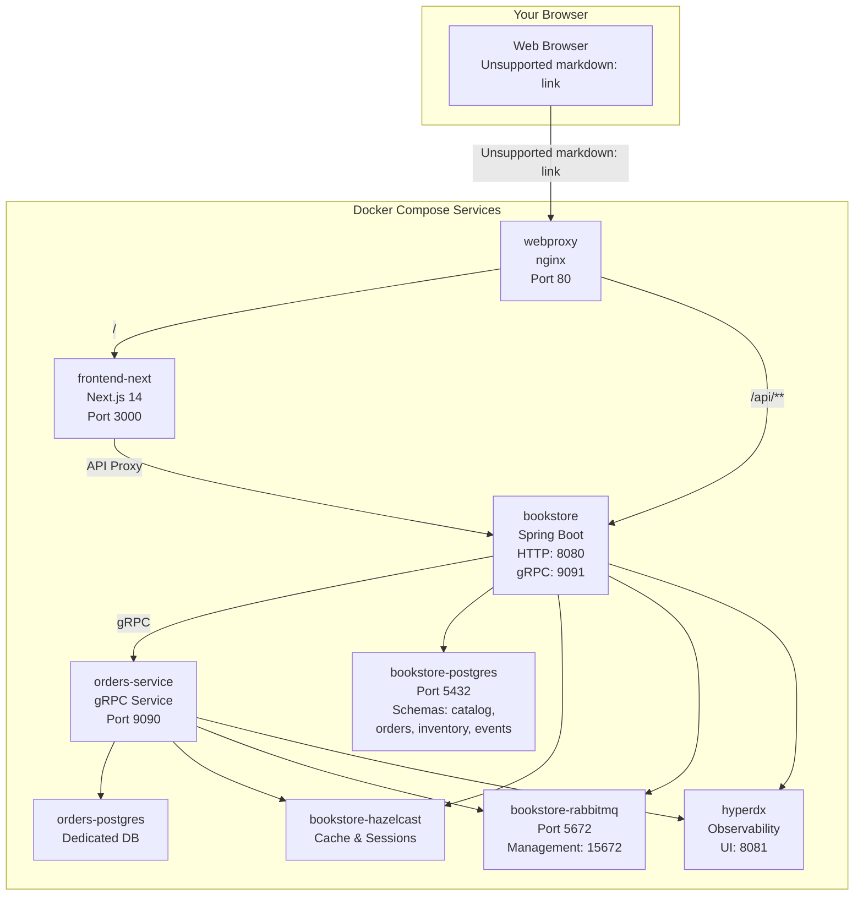
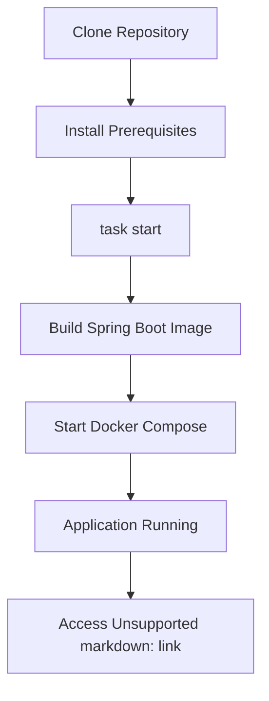
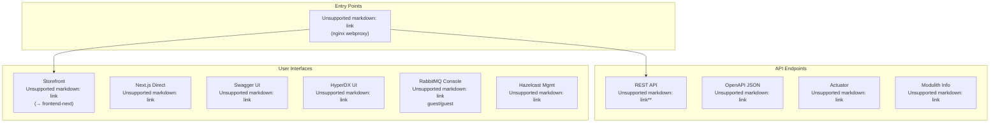
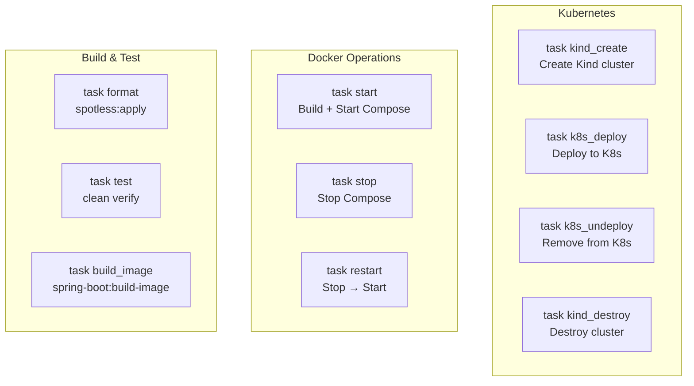

# Getting Started

> **Relevant source files**
> * [.github/workflows/maven.yml](https://github.com/philipz/spring-modular-monolith/blob/30c9bf30/.github/workflows/maven.yml)
> * [.sdkmanrc](https://github.com/philipz/spring-modular-monolith/blob/30c9bf30/.sdkmanrc)
> * [README-API.md](https://github.com/philipz/spring-modular-monolith/blob/30c9bf30/README-API.md)
> * [README.md](https://github.com/philipz/spring-modular-monolith/blob/30c9bf30/README.md)
> * [Taskfile.yml](https://github.com/philipz/spring-modular-monolith/blob/30c9bf30/Taskfile.yml)
> * [docs/API_ANALYSIS_SUMMARY.txt](https://github.com/philipz/spring-modular-monolith/blob/30c9bf30/docs/API_ANALYSIS_SUMMARY.txt)
> * [docs/REST_API_ANALYSIS.md](https://github.com/philipz/spring-modular-monolith/blob/30c9bf30/docs/REST_API_ANALYSIS.md)
> * [docs/bookstore-microservices.png](https://github.com/philipz/spring-modular-monolith/blob/30c9bf30/docs/bookstore-microservices.png)
> * [docs/improvement.md](https://github.com/philipz/spring-modular-monolith/blob/30c9bf30/docs/improvement.md)
> * [docs/orders-data-ownership-analysis.md](https://github.com/philipz/spring-modular-monolith/blob/30c9bf30/docs/orders-data-ownership-analysis.md)
> * [docs/orders-module-boundary-analysis.md](https://github.com/philipz/spring-modular-monolith/blob/30c9bf30/docs/orders-module-boundary-analysis.md)
> * [docs/orders-traffic-migration.md](https://github.com/philipz/spring-modular-monolith/blob/30c9bf30/docs/orders-traffic-migration.md)
> * [k6.js](https://github.com/philipz/spring-modular-monolith/blob/30c9bf30/k6.js)
> * [renovate.json](https://github.com/philipz/spring-modular-monolith/blob/30c9bf30/renovate.json)
> * [src/main/java/com/sivalabs/bookstore/catalog/domain/ProductService.java](https://github.com/philipz/spring-modular-monolith/blob/30c9bf30/src/main/java/com/sivalabs/bookstore/catalog/domain/ProductService.java)

This page provides step-by-step instructions for setting up your development environment, running the Spring Modular Monolith application locally, and understanding the basic development workflow. By the end of this guide, you will have the complete application stack running on your local machine and be able to access the storefront, APIs, and observability tools.

For detailed information about individual components of the system, see [System Architecture Diagrams](/philipz/spring-modular-monolith/1.2-system-architecture-diagrams). For comprehensive API documentation, see [API Documentation](/philipz/spring-modular-monolith/7-api-documentation).

---

## What You Will Run

The Spring Modular Monolith is deployed as a collection of Docker Compose services that work together to provide a complete e-commerce platform. When you start the application, you will launch:

**Application Services**

* `bookstore` - Spring Boot 3.5.5 monolith exposing REST (`:8080`) and gRPC (`:9091`) APIs
* `orders-service` - Extracted microservice handling order operations via gRPC (`:9090`)
* `frontend-next` - Next.js 14 storefront (`:3000`)
* `webproxy` - nginx reverse proxy routing HTTP traffic (`:80`)

**Infrastructure Services**

* `bookstore-postgres` - PostgreSQL database with multi-schema setup (`catalog`, `orders`, `inventory`, `events`)
* `orders-postgres` - Dedicated PostgreSQL instance for the extracted orders service
* `bookstore-rabbitmq` - RabbitMQ message broker for event-driven communication
* `bookstore-hazelcast` - Hazelcast cluster for distributed caching and session storage
* `hyperdx` - All-in-one observability platform for traces, metrics, and logs



**Sources:** [README.md L1-L150](https://github.com/philipz/spring-modular-monolith/blob/30c9bf30/README.md#L1-L150)

 [compose.yml](https://github.com/philipz/spring-modular-monolith/blob/30c9bf30/compose.yml)

 (from high-level diagrams), Diagram 1 from system overview

---

## Prerequisites

Before you begin, ensure you have the following tools installed on your local machine:

| Tool | Minimum Version | Purpose | Verification Command |
| --- | --- | --- | --- |
| Java | 21+ | Build and run Spring Boot application | `java -version` |
| Maven | 3.9+ | Build automation (wrapper provided) | `./mvnw --version` |
| Docker | Recent | Container runtime | `docker info` |
| Docker Compose | v2+ | Multi-container orchestration | `docker compose version` |
| Node.js | 18.17+ | Frontend development | `node --version` |
| pnpm | Latest | Frontend package management | `pnpm --version` |
| Go Task | Latest | Task automation | `task --version` |

The repository includes `.sdkmanrc` for managing Java and Maven versions via SDKMAN:

```markdown
# If using SDKMAN
sdk env install
```

For complete installation instructions and troubleshooting, see [Prerequisites and Installation](/philipz/spring-modular-monolith/2.1-prerequisites-and-installation).

**Sources:** [README.md L43-L59](https://github.com/philipz/spring-modular-monolith/blob/30c9bf30/README.md#L43-L59)

 [.sdkmanrc L1-L3](https://github.com/philipz/spring-modular-monolith/blob/30c9bf30/.sdkmanrc#L1-L3)

---

## Quick Start

The fastest way to get the application running is using the Task runner with Docker Compose:



### Step 1: Clone and Enter the Repository

```
git clone https://github.com/philipz/spring-modular-monolith.git
cd spring-modular-monolith
```

### Step 2: Start the Full Stack

```
task start
```

This command executes the following sequence:

1. Runs `./mvnw clean protobuf:compile package spring-boot:build-image -DskipTests` to build the Spring Boot Docker image
2. Starts all Docker Compose services with `docker compose --profile app -f compose.yml up --force-recreate -d`

The initial build takes 5-10 minutes depending on your network speed and CPU. Subsequent starts are faster since Docker images are cached.

### Step 3: Verify Services Are Running

Wait approximately 30-60 seconds for all services to initialize, then verify they are healthy:

```
docker compose ps
```

All services should show status `Up` or `Up (healthy)`.

**Sources:** [README.md L61-L74](https://github.com/philipz/spring-modular-monolith/blob/30c9bf30/README.md#L61-L74)

 [Taskfile.yml L22-L29](https://github.com/philipz/spring-modular-monolith/blob/30c9bf30/Taskfile.yml#L22-L29)

---

## Accessing the Application

Once the stack is running, you can access various components through the following URLs:



### Access URLs Reference

| Component | URL | Description |
| --- | --- | --- |
| **Storefront** | [http://localhost](http://localhost) | Next.js frontend via nginx proxy |
| **Next.js Direct** | [http://localhost:3000](http://localhost:3000) | Direct access to frontend (bypasses nginx) |
| **Spring Boot API** | [http://localhost:8080](http://localhost:8080) | REST API base URL |
| **Swagger UI** | [http://localhost:8080/swagger-ui.html](http://localhost:8080/swagger-ui.html) | Interactive API documentation |
| **OpenAPI Spec** | [http://localhost:8080/api-docs](http://localhost:8080/api-docs) | OpenAPI 3.0 JSON specification |
| **Actuator** | [http://localhost:8080/actuator](http://localhost:8080/actuator) | Spring Boot management endpoints |
| **Modulith Info** | [http://localhost:8080/actuator/modulith](http://localhost:8080/actuator/modulith) | Spring Modulith module information |
| **HyperDX UI** | [http://localhost:8081](http://localhost:8081) | Observability dashboard (traces/metrics/logs) |
| **RabbitMQ Console** | [http://localhost:15672](http://localhost:15672) | Message broker management (guest/guest) |
| **Hazelcast Mgmt** | [http://localhost:38080](http://localhost:38080) | Hazelcast Management Center |

### Quick Verification Test

Test the API and session functionality:

```python
# Browse products
curl http://localhost:8080/api/products?page=1

# Add item to cart (note the BOOKSTORE_SESSION cookie)
curl -i -X POST http://localhost:8080/api/cart/items \
  -H "Content-Type: application/json" \
  -d '{"code":"P100","quantity":1}'

# View cart (use the cookie from previous response)
curl -b "BOOKSTORE_SESSION=..." http://localhost:8080/api/cart
```

**Sources:** [README.md L76-L90](https://github.com/philipz/spring-modular-monolith/blob/30c9bf30/README.md#L76-L90)

 [README-API.md L1-L14](https://github.com/philipz/spring-modular-monolith/blob/30c9bf30/README-API.md#L1-L14)

---

## Stopping and Restarting

### Stop All Services

```
task stop
```

This command stops and removes all containers but preserves volumes (database data persists).

### Restart After Code Changes

```
task restart
```

This command executes:

1. `task stop` - stops and removes containers
2. Waits 5 seconds
3. `task start` - rebuilds images and starts services

**Sources:** [Taskfile.yml L31-L41](https://github.com/philipz/spring-modular-monolith/blob/30c9bf30/Taskfile.yml#L31-L41)

---

## Development Without Docker

For backend-only development, you can run the Spring Boot application directly with an external PostgreSQL and RabbitMQ:

```javascript
# Start PostgreSQL and RabbitMQ (or use Docker Compose for infra only)
docker compose up bookstore-postgres bookstore-rabbitmq -d

# Set connection properties
export SPRING_DATASOURCE_URL=jdbc:postgresql://localhost:5432/postgres
export SPRING_RABBITMQ_HOST=localhost

# Run Spring Boot application
./mvnw spring-boot:run
```

For frontend-only development:

```markdown
cd frontend-next
pnpm install
pnpm dev   # Starts development server on http://localhost:3000
```

When developing the frontend against the local backend, enable the `dev` profile to allow CORS from `http://localhost:3000`:

```javascript
export SPRING_PROFILES_ACTIVE=dev
./mvnw spring-boot:run
```

**Sources:** [README.md L91-L110](https://github.com/philipz/spring-modular-monolith/blob/30c9bf30/README.md#L91-L110)

---

## Common Development Tasks

The `Taskfile.yml` provides convenient automation for common tasks:



| Task | Command | Description |
| --- | --- | --- |
| **test** | `task test` | Format code then run `./mvnw clean verify` |
| **format** | `task format` | Run `./mvnw spotless:apply` (Palantir Java Format) |
| **build_image** | `task build_image` | Build Spring Boot Docker image with protobuf compilation |
| **start** | `task start` | Build image and start Docker Compose stack |
| **stop** | `task stop` | Stop and remove all containers |
| **restart** | `task restart` | Stop, wait, then start (rebuilds images) |

For detailed workflow information including testing, load testing, and frontend development, see [Development Workflow and Build Tasks](/philipz/spring-modular-monolith/2.3-development-workflow-and-build-tasks).

**Sources:** [Taskfile.yml L1-L64](https://github.com/philipz/spring-modular-monolith/blob/30c9bf30/Taskfile.yml#L1-L64)

 [README.md L112-L118](https://github.com/philipz/spring-modular-monolith/blob/30c9bf30/README.md#L112-L118)

---

## Verifying the Complete Stack

After starting the application, verify the complete integration:

### 1. Check Service Health

```markdown
# View all running containers
docker compose ps

# Check Spring Boot health
curl http://localhost:8080/actuator/health

# Check module boundaries
curl http://localhost:8080/actuator/modulith
```

### 2. Test E-Commerce Flow

```sql
# Browse products
curl http://localhost:8080/api/products | jq .

# Add to cart and capture session cookie
curl -c cookies.txt -X POST http://localhost:8080/api/cart/items \
  -H "Content-Type: application/json" \
  -d '{"code":"P100","quantity":1}' | jq .

# Create order using session
curl -b cookies.txt -X POST http://localhost:8080/api/orders \
  -H "Content-Type: application/json" \
  -d '{
    "customer": {
      "name": "Test User",
      "email": "test@example.com",
      "phone": "+1-555-0100"
    },
    "deliveryAddress": "123 Test St",
    "item": {
      "code": "P100",
      "name": "Test Product",
      "price": 34.0,
      "quantity": 1
    }
  }' | jq .
```

### 3. View Observability Data

* Open HyperDX at [http://localhost:8081](http://localhost:8081) to view distributed traces
* Check RabbitMQ at [http://localhost:15672](http://localhost:15672) (guest/guest) to see event queues
* View Hazelcast Management Center at [http://localhost:38080](http://localhost:38080) to see cache statistics

**Sources:** [README.md L142-L148](https://github.com/philipz/spring-modular-monolith/blob/30c9bf30/README.md#L142-L148)

 [k6.js L1-L93](https://github.com/philipz/spring-modular-monolith/blob/30c9bf30/k6.js#L1-L93)

 [docs/API_ANALYSIS_SUMMARY.txt L175-L212](https://github.com/philipz/spring-modular-monolith/blob/30c9bf30/docs/API_ANALYSIS_SUMMARY.txt#L175-L212)

---

## Next Steps

Now that you have the application running:

1. **Explore the APIs** - Visit [REST API Endpoints](/philipz/spring-modular-monolith/7.1-rest-api-endpoints) or [http://localhost:8080/swagger-ui.html](http://localhost:8080/swagger-ui.html) for interactive documentation
2. **Understand the Architecture** - Review [Spring Modulith Architecture](/philipz/spring-modular-monolith/3-spring-modulith-architecture) to learn how modules communicate
3. **View Traces** - Open HyperDX to see how requests flow through the system (see [Distributed Tracing with HyperDX](/philipz/spring-modular-monolith/9.2-distributed-tracing-with-hyperdx))
4. **Run Tests** - Execute `task test` to run the test suite (see [Building and Testing](/philipz/spring-modular-monolith/11.1-building-and-testing))
5. **Load Test** - Try `k6 run k6.js` to simulate traffic (see [Development Workflow](/philipz/spring-modular-monolith/2.3-development-workflow-and-build-tasks))

For deployment to Kubernetes, see [Kubernetes Deployment with Kind](/philipz/spring-modular-monolith/10.2-kubernetes-deployment-with-kind).

**Sources:** [README.md L1-L150](https://github.com/philipz/spring-modular-monolith/blob/30c9bf30/README.md#L1-L150)

 table of contents structure

---

## Troubleshooting Quick Reference

| Issue | Solution |
| --- | --- |
| **Port conflicts** | Adjust port mappings in `compose.yml` (common: 80, 3000, 8080, 15672) |
| **Session not working** | Verify `BOOKSTORE_SESSION` cookie is set; check requests include credentials |
| **CORS errors in dev** | Set `SPRING_PROFILES_ACTIVE=dev` or configure `cors.allowed-origins` |
| **Missing traces** | Ensure `hyperdx` container is healthy; check `OTLP_ENDPOINT` env vars |
| **Orders service offline** | Set `bookstore.grpc.client.target=localhost:9091` to use in-process server |

For detailed troubleshooting, see [README.md L142-L149](https://github.com/philipz/spring-modular-monolith/blob/30c9bf30/README.md#L142-L149)

 or consult [Configuration Reference](/philipz/spring-modular-monolith/15-configuration-reference).

**Sources:** [README.md L142-L149](https://github.com/philipz/spring-modular-monolith/blob/30c9bf30/README.md#L142-L149)

 [docs/orders-traffic-migration.md L1-L69](https://github.com/philipz/spring-modular-monolith/blob/30c9bf30/docs/orders-traffic-migration.md#L1-L69)