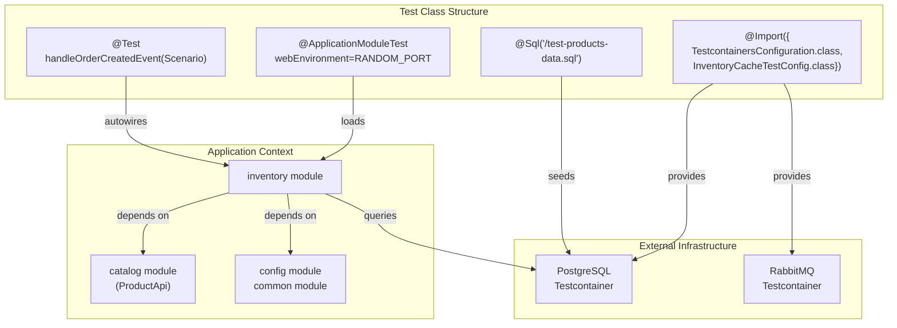
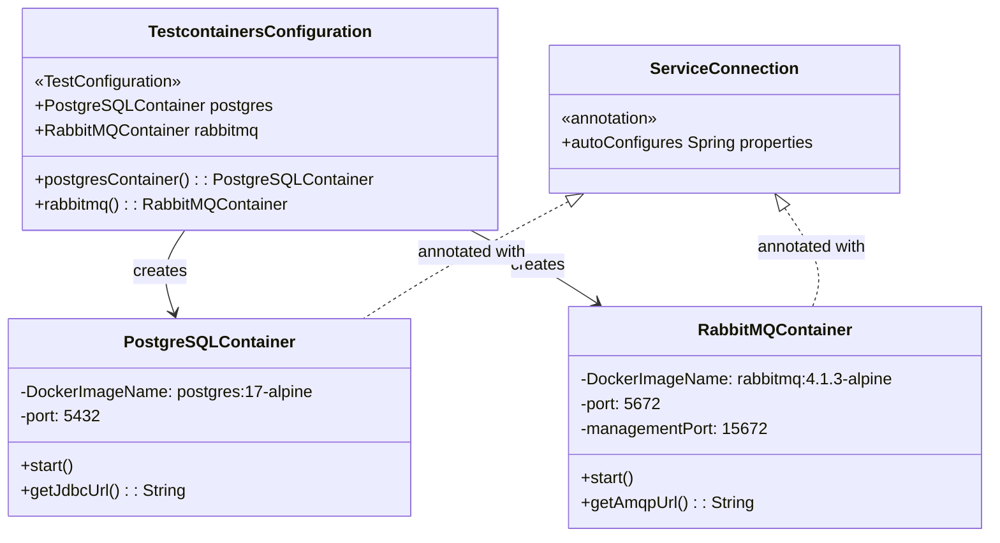
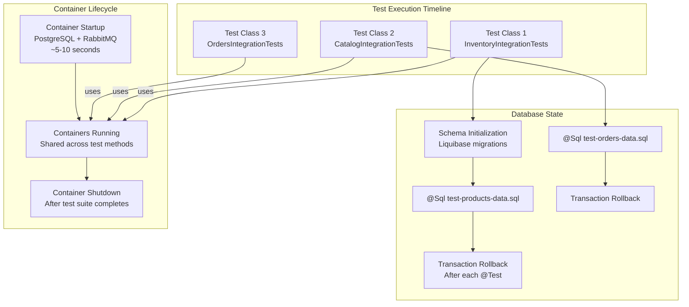
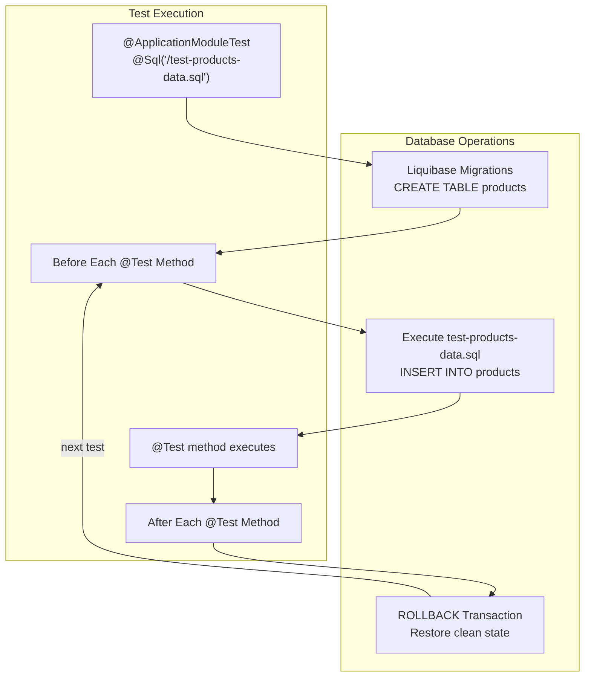

# Integration Testing Strategies

> **Relevant source files**
> * [compose.yml](https://github.com/philipz/spring-modular-monolith/blob/30c9bf30/compose.yml)
> * [pom.xml](https://github.com/philipz/spring-modular-monolith/blob/30c9bf30/pom.xml)
> * [src/main/resources/application.properties](https://github.com/philipz/spring-modular-monolith/blob/30c9bf30/src/main/resources/application.properties)
> * [src/test/java/com/sivalabs/bookstore/BookStoreApplicationTests.java](https://github.com/philipz/spring-modular-monolith/blob/30c9bf30/src/test/java/com/sivalabs/bookstore/BookStoreApplicationTests.java)
> * [src/test/java/com/sivalabs/bookstore/TestcontainersConfiguration.java](https://github.com/philipz/spring-modular-monolith/blob/30c9bf30/src/test/java/com/sivalabs/bookstore/TestcontainersConfiguration.java)
> * [src/test/java/com/sivalabs/bookstore/inventory/InventoryIntegrationTests.java](https://github.com/philipz/spring-modular-monolith/blob/30c9bf30/src/test/java/com/sivalabs/bookstore/inventory/InventoryIntegrationTests.java)

## Purpose and Scope

This document explains the integration testing approaches used in the Spring Modular Monolith codebase. Integration tests verify that modules work correctly together, that event publication and consumption flows function as expected, and that database and messaging infrastructure integrates properly with business logic.

The focus is on **module-level integration testing** using Spring Modulith's testing support, **event-driven testing** with the Scenario API, and **infrastructure testing** with Testcontainers. For unit testing within individual modules, see [Building and Testing](/philipz/spring-modular-monolith/11.1-building-and-testing). For deployment testing strategies, see [Docker Compose Deployment](/philipz/spring-modular-monolith/10.1-docker-compose-deployment).

**Sources:** [README.md](https://github.com/philipz/spring-modular-monolith/blob/30c9bf30/README.md)

 [pom.xml L204-L252](https://github.com/philipz/spring-modular-monolith/blob/30c9bf30/pom.xml#L204-L252)

---

## Testing Stack Architecture

The integration testing stack combines Spring Boot Test, Spring Modulith Test, and Testcontainers to provide comprehensive module and infrastructure testing capabilities.

```

```

**Key Components:**

| Component | Maven Artifact | Purpose |
| --- | --- | --- |
| `@ApplicationModuleTest` | `spring-modulith-starter-test` | Module boundary testing with minimal context |
| `Scenario` | `spring-modulith-starter-test` | Event-driven testing DSL with state verification |
| `@ServiceConnection` | `spring-boot-testcontainers` | Auto-configuration of containers as Spring beans |
| `PostgreSQLContainer` | `testcontainers:postgresql` | Ephemeral PostgreSQL for database integration tests |
| `RabbitMQContainer` | `testcontainers:rabbitmq` | Ephemeral RabbitMQ for messaging integration tests |

**Sources:** [pom.xml L204-L239](https://github.com/philipz/spring-modular-monolith/blob/30c9bf30/pom.xml#L204-L239)

 [src/test/java/com/sivalabs/bookstore/TestcontainersConfiguration.java L1-L33](https://github.com/philipz/spring-modular-monolith/blob/30c9bf30/src/test/java/com/sivalabs/bookstore/TestcontainersConfiguration.java#L1-L33)

---

## Module-Level Testing with @ApplicationModuleTest

The `@ApplicationModuleTest` annotation is the primary mechanism for integration testing individual modules. It loads only the module under test and its dependencies, providing faster test execution compared to full context tests.

### Test Structure Pattern



**Example Test Class:**

[src/test/java/com/sivalabs/bookstore/inventory/InventoryIntegrationTests.java L17-L32](https://github.com/philipz/spring-modular-monolith/blob/30c9bf30/src/test/java/com/sivalabs/bookstore/inventory/InventoryIntegrationTests.java#L17-L32)

```javascript
@ApplicationModuleTest(webEnvironment = RANDOM_PORT)
@Import({TestcontainersConfiguration.class, InventoryCacheTestConfig.class})
@Sql("/test-products-data.sql")
class InventoryIntegrationTests {
    
    @Autowired
    private InventoryService inventoryService;
    
    @Test
    void handleOrderCreatedEvent(Scenario scenario) {
        var customer = new Customer("Siva", "siva@gmail.com", "9987654");
        String productCode = "P114";
        var event = new OrderCreatedEvent(UUID.randomUUID().toString(), 
                                          productCode, 2, customer);
        scenario.publish(event)
                .andWaitForStateChange(() -> inventoryService.getStockLevel(productCode) == 598);
    }
}
```

### Annotation Behavior

| Annotation Parameter | Value | Effect |
| --- | --- | --- |
| `webEnvironment` | `RANDOM_PORT` | Starts embedded server on random port for REST API testing |
| `webEnvironment` | `NONE` | Skips web server startup for non-web module tests |
| `@Import` | `TestcontainersConfiguration.class` | Registers PostgreSQL and RabbitMQ containers |
| `@Sql` | `/test-products-data.sql` | Executes SQL script before test methods |

**Module Context Loading:**

The `@ApplicationModuleTest` annotation:

1. Scans the package structure to identify the module under test (e.g., `inventory`)
2. Loads only components within that module's package
3. Includes direct module dependencies declared via Spring Modulith's `@ApplicationModule`
4. Excludes unrelated modules to reduce context startup time

**Sources:** [src/test/java/com/sivalabs/bookstore/inventory/InventoryIntegrationTests.java L1-L32](https://github.com/philipz/spring-modular-monolith/blob/30c9bf30/src/test/java/com/sivalabs/bookstore/inventory/InventoryIntegrationTests.java#L1-L32)

---

## Event-Driven Testing with Scenario API

The `Scenario` API provides a fluent DSL for testing asynchronous event publication and consumption flows in Spring Modulith applications.

### Scenario Testing Flow

```mermaid
sequenceDiagram
  participant Test Method
  participant InventoryIntegrationTests
  participant Scenario API
  participant ApplicationEventPublisher
  participant EVENT_PUBLICATION
  participant Database Table
  participant OrderCreatedEventListener
  participant @ApplicationModuleListener
  participant InventoryService
  participant INVENTORY

  Test Method->>Scenario API: scenario.publish(OrderCreatedEvent)
  Scenario API->>ApplicationEventPublisher: publishEvent(OrderCreatedEvent)
  ApplicationEventPublisher->>EVENT_PUBLICATION: INSERT INTO event_publication
  ApplicationEventPublisher->>OrderCreatedEventListener: handleOrderCreatedEvent(OrderCreatedEvent)
  OrderCreatedEventListener->>InventoryService: updateInventory(productCode, quantity)
  InventoryService->>INVENTORY: UPDATE inventory SET stock = stock - quantity
  Test Method->>Scenario API: andWaitForStateChange(() -> stockLevel == 598)
  loop [Stock level matches expected]
    Scenario API->>InventoryService: getStockLevel(productCode)
    InventoryService-->>Scenario API: current stock level
    Scenario API-->>Test Method: Assertion passes
    Scenario API-->>Test Method: AssertionError
  end
```

### Scenario API Methods

| Method | Purpose | Example |
| --- | --- | --- |
| `publish(event)` | Publishes event to internal event bus | `scenario.publish(orderCreatedEvent)` |
| `andWaitForStateChange(supplier)` | Polls until condition returns true | `.andWaitForStateChange(() -> stock == 598)` |
| `andWaitForEventOfType(eventClass)` | Waits for event of specified type | `.andWaitForEventOfType(StockUpdatedEvent.class)` |
| `matching(predicate)` | Filters events with predicate | `.matching(e -> e.getProductCode().equals("P114"))` |
| `toArriveAndVerify(consumer)` | Executes assertions on received event | `.toArriveAndVerify(e -> assertThat(e.getQuantity()).isEqualTo(2))` |

### Event Testing Pattern

The test in [src/test/java/com/sivalabs/bookstore/inventory/InventoryIntegrationTests.java L26-L31](https://github.com/philipz/spring-modular-monolith/blob/30c9bf30/src/test/java/com/sivalabs/bookstore/inventory/InventoryIntegrationTests.java#L26-L31)

 demonstrates the canonical pattern:

1. **Arrange:** Set up test data with `@Sql` annotation
2. **Act:** Publish event via `scenario.publish(event)`
3. **Assert:** Verify state change with `andWaitForStateChange(() -> condition)`

This pattern verifies:

* Event is successfully published to Spring Modulith's event bus
* Event is persisted to the `EVENT_PUBLICATION` table ([src/main/resources/application.properties L37-L38](https://github.com/philipz/spring-modular-monolith/blob/30c9bf30/src/main/resources/application.properties#L37-L38) )
* Event listener consumes the event asynchronously
* Business logic executes correctly (inventory stock decremented)
* Database state reflects expected changes

**Sources:** [src/test/java/com/sivalabs/bookstore/inventory/InventoryIntegrationTests.java L26-L31](https://github.com/philipz/spring-modular-monolith/blob/30c9bf30/src/test/java/com/sivalabs/bookstore/inventory/InventoryIntegrationTests.java#L26-L31)

 [src/main/resources/application.properties L36-L40](https://github.com/philipz/spring-modular-monolith/blob/30c9bf30/src/main/resources/application.properties#L36-L40)

---

## Testcontainers Infrastructure Configuration

The `TestcontainersConfiguration` class provides reusable container definitions for PostgreSQL and RabbitMQ, ensuring consistent test infrastructure across all integration tests.

### Container Configuration Class



### Container Bean Configuration

[src/test/java/com/sivalabs/bookstore/TestcontainersConfiguration.java L12-L33](https://github.com/philipz/spring-modular-monolith/blob/30c9bf30/src/test/java/com/sivalabs/bookstore/TestcontainersConfiguration.java#L12-L33)

The configuration uses several key patterns:

| Pattern | Implementation | Benefit |
| --- | --- | --- |
| **Static Containers** | `static PostgreSQLContainer<?> postgres` | Containers start once per test class, shared across test methods |
| **@ServiceConnection** | Annotates bean methods | Auto-configures `spring.datasource.*` and `spring.rabbitmq.*` properties |
| **@Container** | Annotates static fields | Integrates with `@Testcontainers` lifecycle management |
| **DockerImageName.parse()** | Explicit image specification | Ensures consistent image versions (`postgres:17-alpine`) |

### Auto-Configuration Mapping

When tests import `TestcontainersConfiguration.class`, Spring Boot's `@ServiceConnection` mechanism automatically configures:

**PostgreSQL Container:**

```
spring.datasource.url → container.getJdbcUrl()
spring.datasource.username → container.getUsername()
spring.datasource.password → container.getPassword()
spring.datasource.driver-class-name → org.postgresql.Driver
```

**RabbitMQ Container:**

```
spring.rabbitmq.host → container.getHost()
spring.rabbitmq.port → container.getAmqpPort()
spring.rabbitmq.username → container.getAdminUsername()
spring.rabbitmq.password → container.getAdminPassword()
```

This eliminates the need for test-specific property files or manual configuration.

**Sources:** [src/test/java/com/sivalabs/bookstore/TestcontainersConfiguration.java L1-L33](https://github.com/philipz/spring-modular-monolith/blob/30c9bf30/src/test/java/com/sivalabs/bookstore/TestcontainersConfiguration.java#L1-L33)

 [pom.xml L230-L239](https://github.com/philipz/spring-modular-monolith/blob/30c9bf30/pom.xml#L230-L239)

---

## Container Lifecycle and Performance



### Performance Characteristics

| Aspect | Strategy | Impact |
| --- | --- | --- |
| **Container Reuse** | Static fields with `@Container` | ~5-10 second startup cost amortized across all tests |
| **Transactional Rollback** | Default Spring Test behavior | Database state reset between test methods |
| **Parallel Execution** | Maven Surefire forking | Each forked JVM gets independent containers |
| **Schema Migrations** | Liquibase runs on first test | Subsequent tests use initialized schema |

### Database Schema Initialization

When the first test executes:

1. **Container starts:** PostgreSQL container launches with empty database
2. **Liquibase triggers:** Spring Boot auto-configuration runs Liquibase migrations ([src/main/resources/application.properties L21-L25](https://github.com/philipz/spring-modular-monolith/blob/30c9bf30/src/main/resources/application.properties#L21-L25) )
3. **Schemas created:** `catalog`, `orders`, `inventory`, `events` schemas populated
4. **Test data loaded:** `@Sql` scripts execute (e.g., `test-products-data.sql`)

Subsequent tests reuse the initialized schema but start with rolled-back transaction state.

**Sources:** [src/test/java/com/sivalabs/bookstore/TestcontainersConfiguration.java L16-L20](https://github.com/philipz/spring-modular-monolith/blob/30c9bf30/src/test/java/com/sivalabs/bookstore/TestcontainersConfiguration.java#L16-L20)

 [src/main/resources/application.properties L21-L25](https://github.com/philipz/spring-modular-monolith/blob/30c9bf30/src/main/resources/application.properties#L21-L25)

---

## Full Context Smoke Testing

In addition to module-level tests, the codebase includes full context smoke tests that verify the entire application starts correctly with all modules loaded.

### Smoke Test Pattern

[src/test/java/com/sivalabs/bookstore/BookStoreApplicationTests.java L9-L17](https://github.com/philipz/spring-modular-monolith/blob/30c9bf30/src/test/java/com/sivalabs/bookstore/BookStoreApplicationTests.java#L9-L17)

```python
@SpringBootTest(
    webEnvironment = RANDOM_PORT,
    properties = {"bookstore.grpc.server.port=0"})
@Import(TestcontainersConfiguration.class)
class BookStoreApplicationTests {
    
    @Test
    void contextLoads() {}
}
```

### Smoke Test vs Module Test Comparison

| Aspect | `@SpringBootTest` | `@ApplicationModuleTest` |
| --- | --- | --- |
| **Context Scope** | Full application context | Single module + dependencies |
| **Startup Time** | ~15-30 seconds | ~5-10 seconds |
| **gRPC Server** | Starts on random port | Only if module needs it |
| **Cache Initialization** | All Hazelcast caches | Only module-specific caches |
| **Use Case** | Smoke tests, end-to-end tests | Module integration tests |

The smoke test properties override [src/main/resources/application.properties L114](https://github.com/philipz/spring-modular-monolith/blob/30c9bf30/src/main/resources/application.properties#L114-L114)

 with `bookstore.grpc.server.port=0` to bind the gRPC server to a random available port, preventing port conflicts during parallel test execution.

**Sources:** [src/test/java/com/sivalabs/bookstore/BookStoreApplicationTests.java L1-L17](https://github.com/philipz/spring-modular-monolith/blob/30c9bf30/src/test/java/com/sivalabs/bookstore/BookStoreApplicationTests.java#L1-L17)

---

## Test Data Management

Integration tests use SQL scripts loaded via `@Sql` annotation to seed test data before test execution.

### Test Data Loading Pattern



### SQL Script Location and Naming

Test SQL scripts are located in `src/test/resources/` and follow the naming convention:

* `test-products-data.sql` - Seed data for catalog module tests
* `test-orders-data.sql` - Seed data for orders module tests
* `test-inventory-data.sql` - Seed data for inventory module tests

### Transaction Isolation

Spring Test Framework automatically wraps each `@Test` method in a transaction that rolls back after test completion. This ensures:

* **Test Isolation:** Changes in one test don't affect subsequent tests
* **Fast Execution:** No need to truncate tables or restart containers
* **Consistent State:** Each test starts with identical database state

For tests that verify asynchronous event processing (using `Scenario.andWaitForStateChange()`), the transaction boundary remains open while polling, allowing the test to observe state changes made by event listeners executing in separate threads.

**Sources:** [src/test/java/com/sivalabs/bookstore/inventory/InventoryIntegrationTests.java L19](https://github.com/philipz/spring-modular-monolith/blob/30c9bf30/src/test/java/com/sivalabs/bookstore/inventory/InventoryIntegrationTests.java#L19-L19)

---

## Testing Best Practices

### Module Boundary Testing

The integration tests verify that Spring Modulith's module boundaries are respected:

1. **Package Scanning:** `@ApplicationModuleTest` loads only the module under test
2. **Dependency Verification:** Tests fail if module accesses another module's internal classes
3. **API Contracts:** Tests verify modules interact only via exported APIs (e.g., `ProductApi`, `OrdersApi`)

### Cache Configuration in Tests

Tests import custom cache configurations (e.g., `InventoryCacheTestConfig.class`) to:

* Override production cache settings with shorter TTLs for faster test execution
* Disable cache write-through mode to avoid performance overhead
* Use in-memory-only caches without MapStore backing

### gRPC Server Testing

For tests involving gRPC communication:

* Use `bookstore.grpc.server.port=0` to bind to random port
* Use `grpc-testing` library for in-process gRPC server ([pom.xml L241-L245](https://github.com/philipz/spring-modular-monolith/blob/30c9bf30/pom.xml#L241-L245) )
* Mock external gRPC clients with `InProcessChannelBuilder`

### RabbitMQ Testing

For tests verifying AMQP message publishing:

* Use `spring-rabbit-test` library for message verification ([pom.xml L216-L219](https://github.com/philipz/spring-modular-monolith/blob/30c9bf30/pom.xml#L216-L219) )
* Leverage RabbitMQ Testcontainer for realistic broker behavior
* Verify message routing with `RabbitTemplate.convertSendAndReceive()`

**Sources:** [src/test/java/com/sivalabs/bookstore/inventory/InventoryIntegrationTests.java L18](https://github.com/philipz/spring-modular-monolith/blob/30c9bf30/src/test/java/com/sivalabs/bookstore/inventory/InventoryIntegrationTests.java#L18-L18)

 [pom.xml L241-L245](https://github.com/philipz/spring-modular-monolith/blob/30c9bf30/pom.xml#L241-L245)

 [pom.xml L216-L219](https://github.com/philipz/spring-modular-monolith/blob/30c9bf30/pom.xml#L216-L219)

---

## Maven Test Execution Configuration

The Maven Surefire plugin is configured with JUnit 5 tree reporter for readable test output and necessary JVM arguments for Hazelcast.

### Surefire Configuration

[pom.xml L320-L348](https://github.com/philipz/spring-modular-monolith/blob/30c9bf30/pom.xml#L320-L348)

Key configurations:

* **Tree Reporter:** `maven-surefire-junit5-tree-reporter` provides hierarchical test output with Unicode characters
* **JVM Arguments:** `-Djdk.attach.allowAttachSelf=true -XX:+EnableDynamicAgentLoading` required for Hazelcast and observability instrumentation
* **Timeout:** `forkedProcessExitTimeoutInSeconds=10` prevents hanging tests from blocking CI/CD pipelines
* **Stack Traces:** Print stack traces on errors and failures for debugging

### Running Tests

```go
# Run all tests with tree output
mvn test

# Run specific test class
mvn test -Dtest=InventoryIntegrationTests

# Run with debug logging
mvn test -Dlogging.level.org.springframework.modulith=DEBUG

# Skip tests during build
mvn package -DskipTests
```

**Sources:** [pom.xml L320-L348](https://github.com/philipz/spring-modular-monolith/blob/30c9bf30/pom.xml#L320-L348)