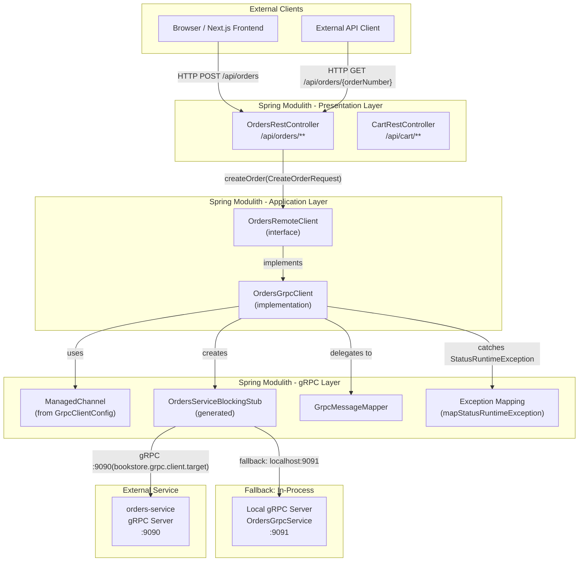
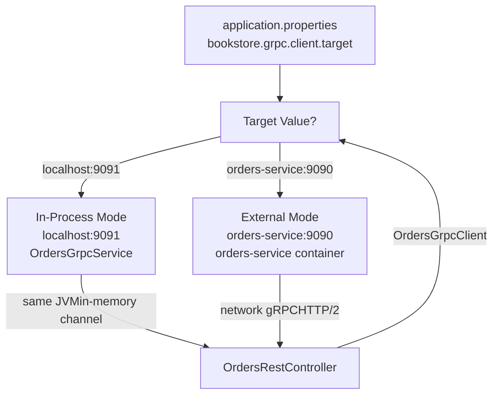
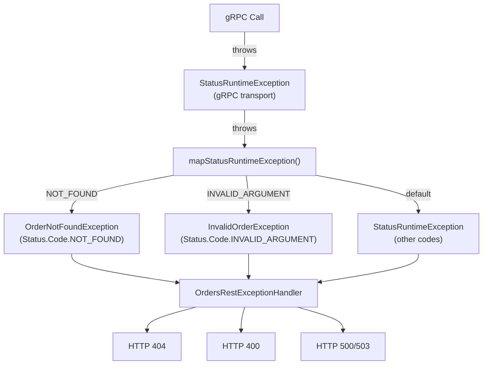

# Integration with Monolith

> **Relevant source files**
> * [README-API.md](https://github.com/philipz/spring-modular-monolith/blob/30c9bf30/README-API.md)
> * [README.md](https://github.com/philipz/spring-modular-monolith/blob/30c9bf30/README.md)
> * [docs/API_ANALYSIS_SUMMARY.txt](https://github.com/philipz/spring-modular-monolith/blob/30c9bf30/docs/API_ANALYSIS_SUMMARY.txt)
> * [docs/REST_API_ANALYSIS.md](https://github.com/philipz/spring-modular-monolith/blob/30c9bf30/docs/REST_API_ANALYSIS.md)
> * [docs/bookstore-microservices.png](https://github.com/philipz/spring-modular-monolith/blob/30c9bf30/docs/bookstore-microservices.png)
> * [docs/improvement.md](https://github.com/philipz/spring-modular-monolith/blob/30c9bf30/docs/improvement.md)
> * [docs/orders-data-ownership-analysis.md](https://github.com/philipz/spring-modular-monolith/blob/30c9bf30/docs/orders-data-ownership-analysis.md)
> * [docs/orders-module-boundary-analysis.md](https://github.com/philipz/spring-modular-monolith/blob/30c9bf30/docs/orders-module-boundary-analysis.md)
> * [docs/orders-traffic-migration.md](https://github.com/philipz/spring-modular-monolith/blob/30c9bf30/docs/orders-traffic-migration.md)
> * [k6.js](https://github.com/philipz/spring-modular-monolith/blob/30c9bf30/k6.js)
> * [src/main/java/com/sivalabs/bookstore/config/GrpcHealthIndicator.java](https://github.com/philipz/spring-modular-monolith/blob/30c9bf30/src/main/java/com/sivalabs/bookstore/config/GrpcHealthIndicator.java)
> * [src/main/java/com/sivalabs/bookstore/config/GrpcProperties.java](https://github.com/philipz/spring-modular-monolith/blob/30c9bf30/src/main/java/com/sivalabs/bookstore/config/GrpcProperties.java)
> * [src/main/java/com/sivalabs/bookstore/orders/api/OrdersRemoteClient.java](https://github.com/philipz/spring-modular-monolith/blob/30c9bf30/src/main/java/com/sivalabs/bookstore/orders/api/OrdersRemoteClient.java)
> * [src/main/java/com/sivalabs/bookstore/orders/grpc/OrdersGrpcClient.java](https://github.com/philipz/spring-modular-monolith/blob/30c9bf30/src/main/java/com/sivalabs/bookstore/orders/grpc/OrdersGrpcClient.java)
> * [src/main/java/com/sivalabs/bookstore/orders/grpc/OrdersGrpcService.java](https://github.com/philipz/spring-modular-monolith/blob/30c9bf30/src/main/java/com/sivalabs/bookstore/orders/grpc/OrdersGrpcService.java)
> * [src/test/java/com/sivalabs/bookstore/orders/grpc/OrdersGrpcClientIntegrationTest.java](https://github.com/philipz/spring-modular-monolith/blob/30c9bf30/src/test/java/com/sivalabs/bookstore/orders/grpc/OrdersGrpcClientIntegrationTest.java)
> * [src/test/java/com/sivalabs/bookstore/orders/grpc/OrdersGrpcServiceIntegrationTest.java](https://github.com/philipz/spring-modular-monolith/blob/30c9bf30/src/test/java/com/sivalabs/bookstore/orders/grpc/OrdersGrpcServiceIntegrationTest.java)

## Purpose and Scope

This page documents how the Spring Modulith monolith integrates with the extracted `orders-service` microservice. It covers the gRPC client implementation, dual-mode operation, REST-to-gRPC delegation, and configuration that enables the monolith to route orders operations to an external service.

For details on the internal architecture of the extracted service, see [Orders Service Architecture](/philipz/spring-modular-monolith/13.1-orders-service-architecture). For gRPC infrastructure setup (server configuration, protobuf compilation, retry logic), see [gRPC Infrastructure](/philipz/spring-modular-monolith/12-grpc-infrastructure). For traffic migration strategies using nginx, see [Traffic Migration Strategy](/philipz/spring-modular-monolith/10.4-traffic-migration-strategy).

---

## Architecture Overview

The monolith maintains its REST API surface (`/api/orders/**`, `/api/cart/**`) while delegating execution to either an in-process gRPC server or the external `orders-service` via a gRPC client. This delegation is transparent to frontend consumers.

### Request Flow Diagram



**Sources:**

* [src/main/java/com/sivalabs/bookstore/orders/grpc/OrdersGrpcClient.java L1-L112](https://github.com/philipz/spring-modular-monolith/blob/30c9bf30/src/main/java/com/sivalabs/bookstore/orders/grpc/OrdersGrpcClient.java#L1-L112)
* [src/main/java/com/sivalabs/bookstore/orders/api/OrdersRemoteClient.java L1-L16](https://github.com/philipz/spring-modular-monolith/blob/30c9bf30/src/main/java/com/sivalabs/bookstore/orders/api/OrdersRemoteClient.java#L1-L16)
* [README.md L36-L41](https://github.com/philipz/spring-modular-monolith/blob/30c9bf30/README.md#L36-L41)

---

## Dual-Mode Operation

The monolith can operate in two modes depending on the `bookstore.grpc.client.target` configuration:

| Mode | Target | Use Case |
| --- | --- | --- |
| **In-Process** | `localhost:9091` | Local development, testing, or when `orders-service` is not deployed |
| **External** | `orders-service:9090` | Production deployment where `orders-service` runs as a separate container |

### Configuration-Based Routing



**Docker Compose Configuration:**

The compose file configures the monolith to target the external service:

```yaml
# compose.yml
environment:
  GRPC_CLIENT_TARGET: "orders-service:9090"
```

**Fallback for local development:**

```markdown
# application.properties (default)
bookstore.grpc.client.target=localhost:9091
```

When the external service is unavailable, set `GRPC_CLIENT_TARGET=localhost:9091` to route to the in-process server.

**Sources:**

* [README.md L36-L41](https://github.com/philipz/spring-modular-monolith/blob/30c9bf30/README.md#L36-L41)
* [docs/orders-traffic-migration.md L63-L67](https://github.com/philipz/spring-modular-monolith/blob/30c9bf30/docs/orders-traffic-migration.md#L63-L67)
* [compose.yml](https://github.com/philipz/spring-modular-monolith/blob/30c9bf30/compose.yml)  (referenced in context diagrams)

---

## OrdersGrpcClient Implementation

The `OrdersGrpcClient` class implements the `OrdersRemoteClient` interface and acts as the bridge between the monolith's domain layer and the gRPC transport.

### Class Structure

```

```

### Key Responsibilities

**1. Deadline Management**

Every gRPC call applies a deadline from `bookstore.grpc.client.deadline-ms` (default: 5000ms):

[src/main/java/com/sivalabs/bookstore/orders/grpc/OrdersGrpcClient.java L96-L98](https://github.com/philipz/spring-modular-monolith/blob/30c9bf30/src/main/java/com/sivalabs/bookstore/orders/grpc/OrdersGrpcClient.java#L96-L98)

```java
private OrdersServiceGrpc.OrdersServiceBlockingStub stubWithDeadline() {
    return blockingStub.withDeadlineAfter(deadlineMs, TimeUnit.MILLISECONDS);
}
```

**2. Protocol Translation**

The client delegates to `GrpcMessageMapper` to convert between domain DTOs and protobuf messages:

[src/main/java/com/sivalabs/bookstore/orders/grpc/OrdersGrpcClient.java L47-L56](https://github.com/philipz/spring-modular-monolith/blob/30c9bf30/src/main/java/com/sivalabs/bookstore/orders/grpc/OrdersGrpcClient.java#L47-L56)

```javascript
@Override
public CreateOrderResponse createOrder(CreateOrderRequest request) {
    var grpcRequest = messageMapper.toCreateOrderRequestProto(request);
    try {
        var grpcResponse = stubWithDeadline().createOrder(grpcRequest);
        return messageMapper.toCreateOrderResponseDto(grpcResponse);
    } catch (StatusRuntimeException ex) {
        throw mapStatusRuntimeException(ex);
    }
}
```

**3. Paginated List Translation**

For list operations, the client reconstructs `PagedResult<OrderView>` from the protobuf `ListOrdersResponse`:

[src/main/java/com/sivalabs/bookstore/orders/grpc/OrdersGrpcClient.java L71-L94](https://github.com/philipz/spring-modular-monolith/blob/30c9bf30/src/main/java/com/sivalabs/bookstore/orders/grpc/OrdersGrpcClient.java#L71-L94)

```javascript
@Override
public PagedResult<OrderView> listOrders(int page, int size) {
    var grpcRequest = com.sivalabs.bookstore.orders.grpc.proto.ListOrdersRequest.newBuilder()
            .setPage(Math.max(1, page))
            .setPageSize(Math.max(1, size))
            .build();
    try {
        var grpcResponse = stubWithDeadline().listOrders(grpcRequest);
        List<OrderView> orders = grpcResponse.getOrdersList().stream()
                .map(messageMapper::toOrderViewDto)
                .collect(Collectors.toList());
        return new PagedResult<>(
                orders,
                grpcResponse.getTotalElements(),
                grpcResponse.getPageNumber(),
                grpcResponse.getTotalPages(),
                grpcResponse.getIsFirst(),
                grpcResponse.getIsLast(),
                grpcResponse.getHasNext(),
                grpcResponse.getHasPrevious());
    } catch (StatusRuntimeException ex) {
        throw mapStatusRuntimeException(ex);
    }
}
```

**Sources:**

* [src/main/java/com/sivalabs/bookstore/orders/grpc/OrdersGrpcClient.java L1-L112](https://github.com/philipz/spring-modular-monolith/blob/30c9bf30/src/main/java/com/sivalabs/bookstore/orders/grpc/OrdersGrpcClient.java#L1-L112)
* [src/main/java/com/sivalabs/bookstore/orders/api/OrdersRemoteClient.java L1-L16](https://github.com/philipz/spring-modular-monolith/blob/30c9bf30/src/main/java/com/sivalabs/bookstore/orders/api/OrdersRemoteClient.java#L1-L16)

---

## Exception Mapping

The `OrdersGrpcClient` translates gRPC `StatusRuntimeException` codes into domain-specific exceptions that the REST layer can handle.

### Exception Translation Flow



### Mapping Implementation

[src/main/java/com/sivalabs/bookstore/orders/grpc/OrdersGrpcClient.java L100-L111](https://github.com/philipz/spring-modular-monolith/blob/30c9bf30/src/main/java/com/sivalabs/bookstore/orders/grpc/OrdersGrpcClient.java#L100-L111)

```javascript
private RuntimeException mapStatusRuntimeException(StatusRuntimeException ex) {
    var status = ex.getStatus();
    String description = status.getDescription() != null
            ? status.getDescription()
            : status.getCode().name();
    return switch (status.getCode()) {
        case NOT_FOUND -> new OrderNotFoundException(description);
        case INVALID_ARGUMENT -> new InvalidOrderException(description);
        default -> ex;
    };
}
```

**Mapping Table:**

| gRPC Status Code | Domain Exception | HTTP Status | Description Source |
| --- | --- | --- | --- |
| `NOT_FOUND` | `OrderNotFoundException` | 404 | `status.getDescription()` or order number |
| `INVALID_ARGUMENT` | `InvalidOrderException` | 400 | Validation error details from server |
| Other codes | `StatusRuntimeException` (propagated) | 503 | Raw gRPC error |

**Sources:**

* [src/main/java/com/sivalabs/bookstore/orders/grpc/OrdersGrpcClient.java L100-L111](https://github.com/philipz/spring-modular-monolith/blob/30c9bf30/src/main/java/com/sivalabs/bookstore/orders/grpc/OrdersGrpcClient.java#L100-L111)
* [docs/REST_API_ANALYSIS.md L152-L156](https://github.com/philipz/spring-modular-monolith/blob/30c9bf30/docs/REST_API_ANALYSIS.md#L152-L156)

---

## REST Controller Delegation

The monolith's `OrdersRestController` exposes the `/api/orders/**` endpoints and delegates all operations to `OrdersRemoteClient`, which is implemented by `OrdersGrpcClient` in production.

### REST-to-gRPC Flow

```mermaid
sequenceDiagram
  participant HTTP Client
  participant OrdersRestController
  participant OrdersRemoteClient
  participant OrdersGrpcClient
  participant OrdersServiceBlockingStub
  participant orders-service:9090

  HTTP Client->>OrdersRestController: POST /api/orders
  OrdersRestController->>OrdersRestController: {customer, deliveryAddress, item}
  OrdersRestController->>OrdersRemoteClient: Validate CreateOrderRequest
  OrdersRemoteClient->>OrdersGrpcClient: createOrder(request)
  OrdersGrpcClient->>OrdersGrpcClient: createOrder(request)
  OrdersGrpcClient->>OrdersServiceBlockingStub: toCreateOrderRequestProto(request)
  OrdersServiceBlockingStub->>orders-service:9090: createOrder(protoRequest)
  orders-service:9090-->>OrdersServiceBlockingStub: .withDeadline(5000ms)
  OrdersServiceBlockingStub-->>OrdersGrpcClient: gRPC CreateOrder RPC
  OrdersGrpcClient->>OrdersGrpcClient: CreateOrderResponse{orderNumber}
  OrdersGrpcClient-->>OrdersRemoteClient: proto.CreateOrderResponse
  OrdersRemoteClient-->>OrdersRestController: toCreateOrderResponseDto(proto)
  OrdersRestController->>OrdersRestController: CreateOrderResponse
  OrdersRestController-->>HTTP Client: CreateOrderResponse
```

### Controller Implementation Pattern

The REST controller depends on the `OrdersRemoteClient` interface, not the concrete gRPC implementation:

```javascript
@RestController
@RequestMapping("/api/orders")
public class OrdersRestController {
    private final OrdersRemoteClient ordersRemoteClient;  // Interface injection
    
    @PostMapping
    public ResponseEntity<CreateOrderResponse> createOrder(
            @Valid @RequestBody CreateOrderRequest request) {
        var response = ordersRemoteClient.createOrder(request);
        // ... build response with Location header
    }
    
    @GetMapping("/{orderNumber}")
    public ResponseEntity<OrderDto> getOrder(@PathVariable String orderNumber) {
        var order = ordersRemoteClient.getOrder(orderNumber);
        return ResponseEntity.ok(order);
    }
}
```

**Dependency Injection:**

Spring auto-wires `OrdersGrpcClient` as the implementation of `OrdersRemoteClient` because it is annotated with `@Component` and implements the interface.

**Sources:**

* [README-API.md L157-L160](https://github.com/philipz/spring-modular-monolith/blob/30c9bf30/README-API.md#L157-L160)
* [docs/REST_API_ANALYSIS.md L39-L45](https://github.com/philipz/spring-modular-monolith/blob/30c9bf30/docs/REST_API_ANALYSIS.md#L39-L45)
* [src/main/java/com/sivalabs/bookstore/orders/grpc/OrdersGrpcClient.java L26](https://github.com/philipz/spring-modular-monolith/blob/30c9bf30/src/main/java/com/sivalabs/bookstore/orders/grpc/OrdersGrpcClient.java#L26-L26)

---

## Configuration Reference

### Application Properties

| Property | Default | Description |
| --- | --- | --- |
| `bookstore.grpc.client.target` | `localhost:9091` | Target host:port for the gRPC client |
| `bookstore.grpc.client.deadline-ms` | `5000` | Per-RPC deadline in milliseconds |
| `bookstore.grpc.client.retry-enabled` | `true` | Enable retry interceptor (see [gRPC Client and Retry Logic](/philipz/spring-modular-monolith/12.2-grpc-client-and-retry-logic)) |
| `bookstore.grpc.client.max-retry-attempts` | `3` | Maximum retry attempts for transient failures |

**Docker Compose Override:**

```yaml
environment:
  GRPC_CLIENT_TARGET: "orders-service:9090"
  GRPC_CLIENT_DEADLINE_MS: "5000"
```

### ManagedChannel Bean

The `ManagedChannel` is configured by `GrpcClientConfig` in the `config` module and shared by all gRPC clients:

```
@Bean(destroyMethod = "shutdownNow")
public ManagedChannel managedChannel(GrpcProperties properties) {
    String target = properties.getClient().getTarget();
    ManagedChannelBuilder<?> builder = ManagedChannelBuilder.forTarget(target)
            .usePlaintext();
    // ... retry, interceptors
    return builder.build();
}
```

**Sources:**

* [src/main/java/com/sivalabs/bookstore/config/GrpcProperties.java L91-L143](https://github.com/philipz/spring-modular-monolith/blob/30c9bf30/src/main/java/com/sivalabs/bookstore/config/GrpcProperties.java#L91-L143)
* [README.md L38-L41](https://github.com/philipz/spring-modular-monolith/blob/30c9bf30/README.md#L38-L41)
* [docs/orders-traffic-migration.md L63-L67](https://github.com/philipz/spring-modular-monolith/blob/30c9bf30/docs/orders-traffic-migration.md#L63-L67)

---

## Testing Integration

### Integration Test Setup

The test suite uses in-process gRPC channels to verify client-server communication without network overhead:

[src/test/java/com/sivalabs/bookstore/orders/grpc/OrdersGrpcClientIntegrationTest.java L100-L109](https://github.com/philipz/spring-modular-monolith/blob/30c9bf30/src/test/java/com/sivalabs/bookstore/orders/grpc/OrdersGrpcClientIntegrationTest.java#L100-L109)

```
@BeforeEach
void setUp() throws IOException {
    orderRepository.deleteAll();
    grpcServer = InProcessServerBuilder.forName(IN_PROCESS_SERVER_NAME)
            .directExecutor()
            .addService(ordersGrpcService)
            .build()
            .start();
}
```

**In-Process Channel Configuration:**

[src/test/java/com/sivalabs/bookstore/orders/grpc/OrdersGrpcClientIntegrationTest.java L210-L218](https://github.com/philipz/spring-modular-monolith/blob/30c9bf30/src/test/java/com/sivalabs/bookstore/orders/grpc/OrdersGrpcClientIntegrationTest.java#L210-L218)

```python
@TestConfiguration
static class InProcessChannelConfiguration {
    @Bean(destroyMethod = "shutdownNow")
    @Primary
    ManagedChannel inProcessManagedChannel() {
        return InProcessChannelBuilder.forName(IN_PROCESS_SERVER_NAME)
                .directExecutor()
                .build();
    }
}
```

### Test Coverage

The integration tests verify:

* **Order creation** persists and returns order number
* **Order retrieval** by order number
* **Order listing** with pagination
* **Exception mapping** from gRPC status codes to domain exceptions

[src/test/java/com/sivalabs/bookstore/orders/grpc/OrdersGrpcClientIntegrationTest.java L188-L207](https://github.com/philipz/spring-modular-monolith/blob/30c9bf30/src/test/java/com/sivalabs/bookstore/orders/grpc/OrdersGrpcClientIntegrationTest.java#L188-L207)

**Sources:**

* [src/test/java/com/sivalabs/bookstore/orders/grpc/OrdersGrpcClientIntegrationTest.java L1-L220](https://github.com/philipz/spring-modular-monolith/blob/30c9bf30/src/test/java/com/sivalabs/bookstore/orders/grpc/OrdersGrpcClientIntegrationTest.java#L1-L220)
* [src/test/java/com/sivalabs/bookstore/orders/grpc/OrdersGrpcServiceIntegrationTest.java L1-L367](https://github.com/philipz/spring-modular-monolith/blob/30c9bf30/src/test/java/com/sivalabs/bookstore/orders/grpc/OrdersGrpcServiceIntegrationTest.java#L1-L367)

---

## Observability

### Health Check

The `GrpcHealthIndicator` exposes the gRPC server state via Spring Actuator:

[src/main/java/com/sivalabs/bookstore/config/GrpcHealthIndicator.java L25-L38](https://github.com/philipz/spring-modular-monolith/blob/30c9bf30/src/main/java/com/sivalabs/bookstore/config/GrpcHealthIndicator.java#L25-L38)

```
@Override
public Health health() {
    boolean running = !server.isShutdown() && !server.isTerminated();
    if (running) {
        return Health.up()
                .withDetail("port", server.getPort())
                .withDetail("services", server.getServices().size())
                .build();
    }
    return Health.down()
            .withDetail("reason", "gRPC server not running")
            .withDetail("port", server.getPort())
            .build();
}
```

**Endpoint:**

```
curl http://localhost:8080/actuator/health
```

**Response (when in-process server is running):**

```json
{
  "status": "UP",
  "components": {
    "grpcHealthIndicator": {
      "status": "UP",
      "details": {
        "port": 9091,
        "services": 1
      }
    }
  }
}
```

### Distributed Tracing

OpenTelemetry automatically instruments gRPC client and server calls. Traces include:

* HTTP request to REST controller
* gRPC RPC method name
* Latency breakdown (network vs. processing)

**Sources:**

* [src/main/java/com/sivalabs/bookstore/config/GrpcHealthIndicator.java L1-L40](https://github.com/philipz/spring-modular-monolith/blob/30c9bf30/src/main/java/com/sivalabs/bookstore/config/GrpcHealthIndicator.java#L1-L40)
* [README.md L24-L29](https://github.com/philipz/spring-modular-monolith/blob/30c9bf30/README.md#L24-L29)

---

## Troubleshooting

### Common Issues

| Symptom | Cause | Solution |
| --- | --- | --- |
| `UNAVAILABLE: io exception` | `orders-service` not running or wrong target | Set `GRPC_CLIENT_TARGET=localhost:9091` to use in-process server |
| `DEADLINE_EXCEEDED` | RPC took longer than `deadline-ms` | Increase `bookstore.grpc.client.deadline-ms` or investigate latency |
| `INVALID_ARGUMENT` errors not mapped to 400 | Exception mapping not working | Verify `OrdersRestExceptionHandler` is registered |
| Session not preserved across backends | Cookie not sent or wrong routing | Ensure `credentials: 'include'` in frontend and verify nginx routing |

**Verification Commands:**

```markdown
# Check if orders-service is reachable
grpcurl -plaintext orders-service:9090 list

# Verify monolith configuration
curl http://localhost:8080/actuator/env | grep grpc.client.target

# Check gRPC health
curl http://localhost:8080/actuator/health | jq '.components.grpcHealthIndicator'
```

**Sources:**

* [README.md L141-L148](https://github.com/philipz/spring-modular-monolith/blob/30c9bf30/README.md#L141-L148)
* [docs/orders-traffic-migration.md L1-L69](https://github.com/philipz/spring-modular-monolith/blob/30c9bf30/docs/orders-traffic-migration.md#L1-L69)