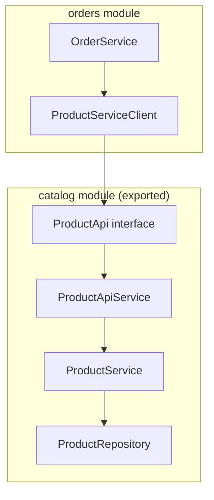
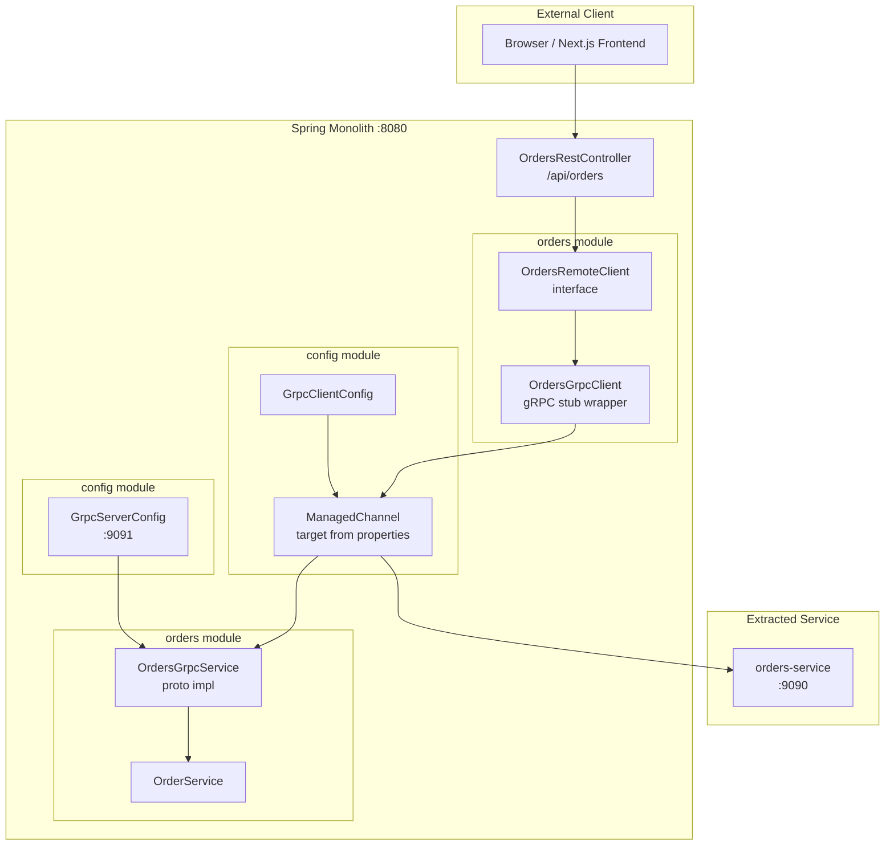
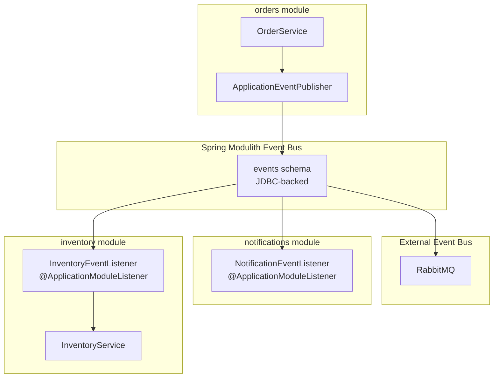

# Inter-Module Communication

> **Relevant source files**
> * [README-API.md](https://github.com/philipz/spring-modular-monolith/blob/30c9bf30/README-API.md)
> * [README.md](https://github.com/philipz/spring-modular-monolith/blob/30c9bf30/README.md)
> * [docs/API_ANALYSIS_SUMMARY.txt](https://github.com/philipz/spring-modular-monolith/blob/30c9bf30/docs/API_ANALYSIS_SUMMARY.txt)
> * [docs/REST_API_ANALYSIS.md](https://github.com/philipz/spring-modular-monolith/blob/30c9bf30/docs/REST_API_ANALYSIS.md)
> * [docs/bookstore-microservices.png](https://github.com/philipz/spring-modular-monolith/blob/30c9bf30/docs/bookstore-microservices.png)
> * [docs/improvement.md](https://github.com/philipz/spring-modular-monolith/blob/30c9bf30/docs/improvement.md)
> * [docs/orders-data-ownership-analysis.md](https://github.com/philipz/spring-modular-monolith/blob/30c9bf30/docs/orders-data-ownership-analysis.md)
> * [docs/orders-module-boundary-analysis.md](https://github.com/philipz/spring-modular-monolith/blob/30c9bf30/docs/orders-module-boundary-analysis.md)
> * [docs/orders-traffic-migration.md](https://github.com/philipz/spring-modular-monolith/blob/30c9bf30/docs/orders-traffic-migration.md)
> * [k6.js](https://github.com/philipz/spring-modular-monolith/blob/30c9bf30/k6.js)
> * [src/main/java/com/sivalabs/bookstore/config/GrpcRetryInterceptor.java](https://github.com/philipz/spring-modular-monolith/blob/30c9bf30/src/main/java/com/sivalabs/bookstore/config/GrpcRetryInterceptor.java)
> * [src/main/java/com/sivalabs/bookstore/config/GrpcServerConfig.java](https://github.com/philipz/spring-modular-monolith/blob/30c9bf30/src/main/java/com/sivalabs/bookstore/config/GrpcServerConfig.java)
> * [src/main/java/com/sivalabs/bookstore/orders/grpc/GrpcExceptionHandler.java](https://github.com/philipz/spring-modular-monolith/blob/30c9bf30/src/main/java/com/sivalabs/bookstore/orders/grpc/GrpcExceptionHandler.java)
> * [src/test/java/com/sivalabs/bookstore/inventory/InventoryIntegrationTests.java](https://github.com/philipz/spring-modular-monolith/blob/30c9bf30/src/test/java/com/sivalabs/bookstore/inventory/InventoryIntegrationTests.java)

## Purpose and Scope

This page documents the mechanisms by which modules within the Spring modular monolith communicate with each other. It covers three primary patterns: **direct API calls** through exported interfaces, **gRPC-based communication** for orders operations, and **event-driven integration** using Spring Modulith's event bus.

For details on the event infrastructure itself (JDBC persistence, RabbitMQ republishing, guaranteed delivery), see [Event-Driven Architecture](/philipz/spring-modular-monolith/3.3-event-driven-architecture). For module structure and boundaries, see [Module Structure and Boundaries](/philipz/spring-modular-monolith/3.1-module-structure-and-boundaries).

**Sources:** [README.md L30-L35](https://github.com/philipz/spring-modular-monolith/blob/30c9bf30/README.md#L30-L35)

---

## Communication Patterns Overview

The system enforces strict module boundaries with three authorized communication mechanisms:

| Pattern | Use Case | Example | Coupling Level |
| --- | --- | --- | --- |
| **Exported API** | Synchronous queries requiring immediate response | Orders validates product prices via `ProductApi` | Compile-time |
| **gRPC** | Orders operations (create, query) from REST controllers or external services | `OrdersRestController` → `OrdersGrpcClient` → `OrdersGrpcService` | Runtime, protocol-mediated |
| **Domain Events** | Asynchronous reactions to state changes | `OrderCreatedEvent` triggers inventory updates | Decoupled via event bus |

Cross-module repository access is explicitly prohibited. The `ModularityTests` class verifies these boundaries at build time.

**Sources:** [README.md L30-L36](https://github.com/philipz/spring-modular-monolith/blob/30c9bf30/README.md#L30-L36)

 [docs/orders-module-boundary-analysis.md L8-L23](https://github.com/philipz/spring-modular-monolith/blob/30c9bf30/docs/orders-module-boundary-analysis.md#L8-L23)

---

## Direct API Calls via Exported Interfaces

### ProductApi Contract

The `catalog` module exports the `ProductApi` interface, which provides synchronous product lookup operations for other modules. The orders module consumes this API to validate product codes and retrieve pricing during order creation.



**Diagram: ProductApi direct API call flow**

### Implementation Details

The `ProductServiceClient` in the orders module wraps the `ProductApi` dependency:

* Located at: [src/main/java/com/sivalabs/bookstore/orders/domain/ProductServiceClient.java](https://github.com/philipz/spring-modular-monolith/blob/30c9bf30/src/main/java/com/sivalabs/bookstore/orders/domain/ProductServiceClient.java)
* Injects: `ProductApi` Spring bean from catalog module
* Usage: Called by `OrderService` before persisting an order to ensure the product exists and retrieve current pricing

The catalog module exposes the API in its public package:

* Interface: [src/main/java/com/sivalabs/bookstore/catalog/api/ProductApi.java](https://github.com/philipz/spring-modular-monolith/blob/30c9bf30/src/main/java/com/sivalabs/bookstore/catalog/api/ProductApi.java)
* Implementation: [src/main/java/com/sivalabs/bookstore/catalog/api/ProductApiService.java](https://github.com/philipz/spring-modular-monolith/blob/30c9bf30/src/main/java/com/sivalabs/bookstore/catalog/api/ProductApiService.java)
* Returns: `Optional<ProductDto>` to handle missing products gracefully

This pattern avoids direct entity or repository sharing while maintaining type safety and compile-time checking.

**Sources:** [docs/orders-module-boundary-analysis.md L9-L13](https://github.com/philipz/spring-modular-monolith/blob/30c9bf30/docs/orders-module-boundary-analysis.md#L9-L13)

 [README.md L32](https://github.com/philipz/spring-modular-monolith/blob/30c9bf30/README.md#L32-L32)

---

## gRPC Communication

### Internal gRPC Architecture

The monolith runs an embedded gRPC server exposing orders operations on port **9091** (configurable via `bookstore.grpc.server.port`). REST controllers delegate to an internal gRPC client, which can target either the in-process server or the extracted `orders-service` on port **9090**.



**Diagram: gRPC communication flow in monolith and external service**

### Key Components

| Component | Location | Role |
| --- | --- | --- |
| `OrdersRemoteClient` | [src/main/java/com/sivalabs/bookstore/orders/api/OrdersRemoteClient.java](https://github.com/philipz/spring-modular-monolith/blob/30c9bf30/src/main/java/com/sivalabs/bookstore/orders/api/OrdersRemoteClient.java) | Interface abstracting remote orders operations |
| `OrdersGrpcClient` | [src/main/java/com/sivalabs/bookstore/orders/grpc/OrdersGrpcClient.java](https://github.com/philipz/spring-modular-monolith/blob/30c9bf30/src/main/java/com/sivalabs/bookstore/orders/grpc/OrdersGrpcClient.java) | Implementation using gRPC stubs generated from [src/main/proto/orders.proto](https://github.com/philipz/spring-modular-monolith/blob/30c9bf30/src/main/proto/orders.proto) |
| `OrdersGrpcService` | [src/main/java/com/sivalabs/bookstore/orders/grpc/OrdersGrpcService.java](https://github.com/philipz/spring-modular-monolith/blob/30c9bf30/src/main/java/com/sivalabs/bookstore/orders/grpc/OrdersGrpcService.java) | Server-side gRPC service delegating to `OrderService` |
| `GrpcServerConfig` | [src/main/java/com/sivalabs/bookstore/config/GrpcServerConfig.java L30-L61](https://github.com/philipz/spring-modular-monolith/blob/30c9bf30/src/main/java/com/sivalabs/bookstore/config/GrpcServerConfig.java#L30-L61) | Configures in-process gRPC server on port 9091 |
| `GrpcClientConfig` | [src/main/java/com/sivalabs/bookstore/config/GrpcClientConfig.java](https://github.com/philipz/spring-modular-monolith/blob/30c9bf30/src/main/java/com/sivalabs/bookstore/config/GrpcClientConfig.java) | Provides `ManagedChannel` targeting `bookstore.grpc.client.target` |
| `GrpcRetryInterceptor` | [src/main/java/com/sivalabs/bookstore/config/GrpcRetryInterceptor.java L23-L189](https://github.com/philipz/spring-modular-monolith/blob/30c9bf30/src/main/java/com/sivalabs/bookstore/config/GrpcRetryInterceptor.java#L23-L189) | Client interceptor with exponential backoff for `UNAVAILABLE` status |

### Exception Mapping

The `GrpcExceptionHandler` translates domain exceptions into appropriate gRPC status codes:

* `OrderNotFoundException` → `Status.NOT_FOUND`
* `InvalidOrderException` → `Status.INVALID_ARGUMENT`
* `ConstraintViolationException` → `Status.INVALID_ARGUMENT` with formatted violations
* Unhandled exceptions → `Status.INTERNAL`

**Sources:** [src/main/java/com/sivalabs/bookstore/orders/grpc/GrpcExceptionHandler.java L26-L72](https://github.com/philipz/spring-modular-monolith/blob/30c9bf30/src/main/java/com/sivalabs/bookstore/orders/grpc/GrpcExceptionHandler.java#L26-L72)

 [README.md L37-L41](https://github.com/philipz/spring-modular-monolith/blob/30c9bf30/README.md#L37-L41)

### Configuration Properties

The client target is environment-dependent:

```markdown
# Local development (in-process)
bookstore.grpc.client.target=localhost:9091

# Docker Compose (external service)
bookstore.grpc.client.target=orders-service:9090
```

Retry behavior is controlled via `GrpcProperties`:

* `maxRetryAttempts`: Default 3
* `retryEnabled`: Default true
* `deadlineMs`: Per-call timeout

**Sources:** [src/main/java/com/sivalabs/bookstore/config/GrpcRetryInterceptor.java L26-L47](https://github.com/philipz/spring-modular-monolith/blob/30c9bf30/src/main/java/com/sivalabs/bookstore/config/GrpcRetryInterceptor.java#L26-L47)

 [README.md L40](https://github.com/philipz/spring-modular-monolith/blob/30c9bf30/README.md#L40-L40)

---

## Event-Based Communication

### OrderCreatedEvent Flow

When an order is created, the `OrderService` publishes an `OrderCreatedEvent` that triggers asynchronous processing in the inventory and notifications modules. This event-driven pattern decouples order creation from downstream operations.



**Diagram: OrderCreatedEvent publication and consumption**

### Event Definition

The `OrderCreatedEvent` class resides in the orders module's public API package, making it accessible to consumers without exposing internal implementation:

* Location: [src/main/java/com/sivalabs/bookstore/orders/api/events/OrderCreatedEvent.java](https://github.com/philipz/spring-modular-monolith/blob/30c9bf30/src/main/java/com/sivalabs/bookstore/orders/api/events/OrderCreatedEvent.java)
* Payload: `orderNumber`, `productCode`, `quantity`, `Customer` details
* Publisher: `OrderService.createOrder()` after successful persistence
* Consumers: `InventoryEventListener`, `NotificationEventListener`

### Testing Event Flows

Spring Modulith's testing support validates event-driven interactions. The `Scenario` API publishes events and waits for state changes:

```javascript
// Example: InventoryIntegrationTests
@Test
void handleOrderCreatedEvent(Scenario scenario) {
    var customer = new Customer("Siva", "siva@gmail.com", "9987654");
    String productCode = "P114";
    var event = new OrderCreatedEvent(
        UUID.randomUUID().toString(), 
        productCode, 
        2, 
        customer
    );
    scenario.publish(event)
            .andWaitForStateChange(() -> 
                inventoryService.getStockLevel(productCode) == 598
            );
}
```

**Sources:** [src/test/java/com/sivalabs/bookstore/inventory/InventoryIntegrationTests.java L26-L31](https://github.com/philipz/spring-modular-monolith/blob/30c9bf30/src/test/java/com/sivalabs/bookstore/inventory/InventoryIntegrationTests.java#L26-L31)

### Event Persistence and Guarantees

Spring Modulith persists events to the `events` schema before dispatching them, ensuring exactly-once semantics even if a listener fails. Events are also republished to RabbitMQ for external consumption by the extracted `orders-service` or the `amqp-modulith` processor.

For details on the dual event bus architecture (internal JDBC + external RabbitMQ), see [Event-Driven Architecture](/philipz/spring-modular-monolith/3.3-event-driven-architecture).

**Sources:** [README.md L33-L34](https://github.com/philipz/spring-modular-monolith/blob/30c9bf30/README.md#L33-L34)

 [docs/orders-module-boundary-analysis.md L22-L23](https://github.com/philipz/spring-modular-monolith/blob/30c9bf30/docs/orders-module-boundary-analysis.md#L22-L23)

---

## Module Dependency Rules

### Allowed Dependencies

| Module | Can Depend On | Mechanism |
| --- | --- | --- |
| Any business module | `common` | Open module exporting utilities, cache helpers, session integration |
| Any business module | `config` | Infrastructure beans (Hazelcast, gRPC channels, observability) |
| `orders` | `catalog` | Via `ProductApi` interface only |
| `inventory` | `orders` | Via `OrderCreatedEvent` only (event subscription) |
| `notifications` | `orders` | Via `OrderCreatedEvent` only (event subscription) |

### Prohibited Dependencies

* Direct repository access across modules (e.g., `InventoryService` cannot inject `OrderRepository`)
* Direct entity sharing (JPA entities are module-private)
* Circular dependencies (enforced by `ModularityTests`)

### The Common Module Exception

The `common` module is explicitly marked as **open** in Spring Modulith, meaning all modules can access its contents:

* Location: [src/main/java/com/sivalabs/bookstore/common](https://github.com/philipz/spring-modular-monolith/blob/30c9bf30/src/main/java/com/sivalabs/bookstore/common)
* Exports: Cache utilities (`SpringAwareMapStoreConfig`), exception handling, Hazelcast session support
* Rationale: Shared infrastructure that doesn't belong to any business domain

**Sources:** [README.md L9](https://github.com/philipz/spring-modular-monolith/blob/30c9bf30/README.md#L9-L9)

 [README.md L34](https://github.com/philipz/spring-modular-monolith/blob/30c9bf30/README.md#L34-L34)

 [docs/orders-module-boundary-analysis.md L12](https://github.com/philipz/spring-modular-monolith/blob/30c9bf30/docs/orders-module-boundary-analysis.md#L12-L12)

---

## Verification and Enforcement

### ModularityTests

The build enforces module boundaries through automated tests:

```python
@SpringBootTest
class ModularityTests {
    ApplicationModules modules = ApplicationModules.of(BookstoreApplication.class);
    
    @Test
    void verifiesModularStructure() {
        modules.verify();
    }
}
```

This test fails if:

* A module directly references another module's internal classes
* Circular dependencies exist
* Non-exported types are accessed across module boundaries

### Module Documentation

Spring Modulith generates module diagrams during the test phase:

* Output location: `target/spring-modulith-docs/`
* Artifacts: `module-orders.puml`, `module-catalog.puml`, etc.
* Visualizes: Dependencies, exported APIs, event listeners

Run `./mvnw test` to regenerate documentation after structural changes.

**Sources:** [README.md L116](https://github.com/philipz/spring-modular-monolith/blob/30c9bf30/README.md#L116-L116)

 [docs/orders-module-boundary-analysis.md L4-L6](https://github.com/philipz/spring-modular-monolith/blob/30c9bf30/docs/orders-module-boundary-analysis.md#L4-L6)

---

## Summary

The Spring modular monolith uses three communication patterns to maintain loose coupling:

1. **Direct API calls** via exported interfaces (`ProductApi`) for synchronous queries requiring immediate consistency
2. **gRPC** for orders operations, enabling gradual extraction to microservices while keeping REST endpoints unchanged
3. **Domain events** (`OrderCreatedEvent`) for asynchronous reactions, decoupling order creation from inventory and notification concerns

These patterns are enforced by Spring Modulith's module verification, ensuring that internal implementations remain encapsulated while public APIs remain stable.

**Sources:** [README.md L30-L36](https://github.com/philipz/spring-modular-monolith/blob/30c9bf30/README.md#L30-L36)

 [docs/orders-module-boundary-analysis.md L1-L36](https://github.com/philipz/spring-modular-monolith/blob/30c9bf30/docs/orders-module-boundary-analysis.md#L1-L36)