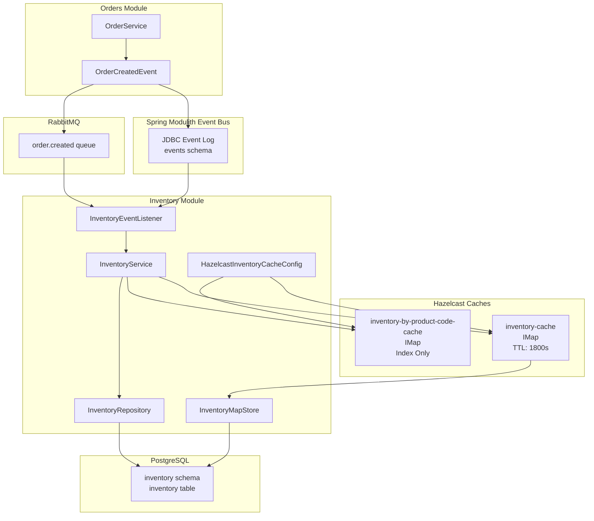
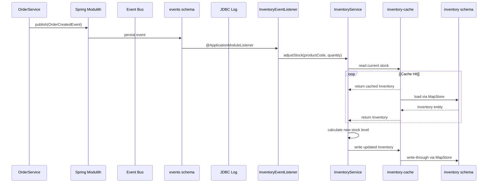
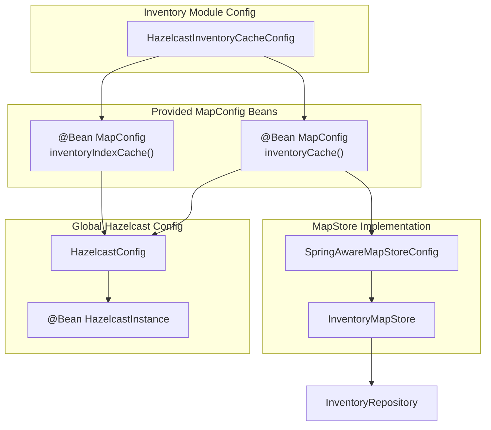
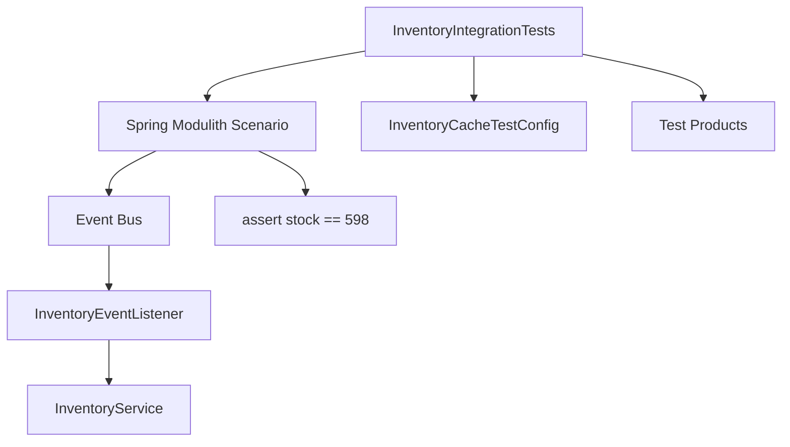

# Inventory Module

> **Relevant source files**
> * [README-API.md](https://github.com/philipz/spring-modular-monolith/blob/30c9bf30/README-API.md)
> * [README.md](https://github.com/philipz/spring-modular-monolith/blob/30c9bf30/README.md)
> * [docs/API_ANALYSIS_SUMMARY.txt](https://github.com/philipz/spring-modular-monolith/blob/30c9bf30/docs/API_ANALYSIS_SUMMARY.txt)
> * [docs/REST_API_ANALYSIS.md](https://github.com/philipz/spring-modular-monolith/blob/30c9bf30/docs/REST_API_ANALYSIS.md)
> * [docs/bookstore-microservices.png](https://github.com/philipz/spring-modular-monolith/blob/30c9bf30/docs/bookstore-microservices.png)
> * [docs/improvement.md](https://github.com/philipz/spring-modular-monolith/blob/30c9bf30/docs/improvement.md)
> * [docs/orders-data-ownership-analysis.md](https://github.com/philipz/spring-modular-monolith/blob/30c9bf30/docs/orders-data-ownership-analysis.md)
> * [docs/orders-module-boundary-analysis.md](https://github.com/philipz/spring-modular-monolith/blob/30c9bf30/docs/orders-module-boundary-analysis.md)
> * [docs/orders-traffic-migration.md](https://github.com/philipz/spring-modular-monolith/blob/30c9bf30/docs/orders-traffic-migration.md)
> * [k6.js](https://github.com/philipz/spring-modular-monolith/blob/30c9bf30/k6.js)
> * [src/test/java/com/sivalabs/bookstore/inventory/InventoryIntegrationTests.java](https://github.com/philipz/spring-modular-monolith/blob/30c9bf30/src/test/java/com/sivalabs/bookstore/inventory/InventoryIntegrationTests.java)

The Inventory Module manages stock levels and inventory projections by consuming order-related domain events. It maintains a separate `inventory` database schema, provides distributed caching through Hazelcast, and ensures inventory data remains consistent when orders are created. This module operates as an independent bounded context that reacts to changes in the orders domain without directly accessing order data.

For information about the event publication mechanism, see [Event-Driven Architecture](/philipz/spring-modular-monolith/3.3-event-driven-architecture). For details on cache configuration patterns, see [Cache Configuration and MapConfigs](/philipz/spring-modular-monolith/5.1-cache-configuration-and-mapconfigs).

---

## Module Responsibilities

The Inventory Module is responsible for:

* **Event-driven inventory updates**: Consuming `OrderCreatedEvent` from the Spring Modulith event bus and adjusting stock levels accordingly
* **Stock level queries**: Providing read access to current inventory levels via `InventoryService`
* **Inventory projections**: Maintaining a materialized view of inventory data derived from product catalog and order events
* **Distributed caching**: Implementing write-through cache via `InventoryMapStore` with dual-cache strategy (data cache + index cache)
* **Schema management**: Owning the `inventory` database schema with Liquibase migrations

Sources: [README.md L12](https://github.com/philipz/spring-modular-monolith/blob/30c9bf30/README.md#L12-L12)

 [src/test/java/com/sivalabs/bookstore/inventory/InventoryIntegrationTests.java L1-L32](https://github.com/philipz/spring-modular-monolith/blob/30c9bf30/src/test/java/com/sivalabs/bookstore/inventory/InventoryIntegrationTests.java#L1-L32)

---

## Architecture Overview

### Inventory Module in System Context



**Diagram: Inventory Module Event-Driven Architecture**

The diagram illustrates how inventory updates are triggered by `OrderCreatedEvent`, processed through the Spring Modulith event bus, and persisted via the write-through cache pattern. Note the dual-cache strategy where `inventory-cache` stores full entities while `inventory-by-product-code-cache` provides fast index lookups.

Sources: [README.md L30-L36](https://github.com/philipz/spring-modular-monolith/blob/30c9bf30/README.md#L30-L36)

 High-level Diagram 2, High-level Diagram 3

---

## Domain Model and Data Persistence

### Entity Structure

The Inventory Module maintains a single JPA entity representing inventory records:

| Entity | Table | Primary Key | Key Fields |
| --- | --- | --- | --- |
| `Inventory` | `inventory.inventory` | `id` (Long) | `productCode`, `quantityInStock` |

The entity tracks stock levels per product code and is managed exclusively within the inventory module's bounded context. External modules query stock levels via `InventoryService` rather than accessing the entity directly.

**File Locations:**

* Domain entity: `src/main/java/com/sivalabs/bookstore/inventory/domain/Inventory.java`
* Repository interface: `src/main/java/com/sivalabs/bookstore/inventory/domain/InventoryRepository.java`
* Service layer: `src/main/java/com/sivalabs/bookstore/inventory/domain/InventoryService.java`

Sources: High-level Diagram 3, [docs/orders-data-ownership-analysis.md L23-L24](https://github.com/philipz/spring-modular-monolith/blob/30c9bf30/docs/orders-data-ownership-analysis.md#L23-L24)

---

## Event-Driven Inventory Updates

### OrderCreatedEvent Consumption

The Inventory Module reacts to order creation through an event listener that consumes `OrderCreatedEvent`:



**Diagram: Event Processing Flow for Inventory Adjustment**

The event listener is annotated with Spring Modulith's `@ApplicationModuleListener` annotation, ensuring guaranteed delivery through the JDBC-backed event log. The service adjusts stock levels by decrementing `quantityInStock` based on the order quantity.

**Key Implementation Details:**

* Event listener class: `src/main/java/com/sivalabs/bookstore/inventory/domain/InventoryEventListener.java`
* Event payload type: [src/main/java/com/sivalabs/bookstore/orders/api/events/OrderCreatedEvent.java](https://github.com/philipz/spring-modular-monolith/blob/30c9bf30/src/main/java/com/sivalabs/bookstore/orders/api/events/OrderCreatedEvent.java)
* Stock adjustment logic: [src/main/java/com/sivalabs/bookstore/inventory/domain/InventoryService.java](https://github.com/philipz/spring-modular-monolith/blob/30c9bf30/src/main/java/com/sivalabs/bookstore/inventory/domain/InventoryService.java)

**Event Processing Guarantees:**

* Events persisted to `events` schema before listener invocation
* Transactional event handling ensures atomicity
* Failed events remain in the log for retry
* RabbitMQ republication occurs asynchronously for external consumers

Sources: [src/test/java/com/sivalabs/bookstore/inventory/InventoryIntegrationTests.java L26-L31](https://github.com/philipz/spring-modular-monolith/blob/30c9bf30/src/test/java/com/sivalabs/bookstore/inventory/InventoryIntegrationTests.java#L26-L31)

 [README.md L33](https://github.com/philipz/spring-modular-monolith/blob/30c9bf30/README.md#L33-L33)

 High-level Diagram 2

---

## Caching Architecture

### Dual-Cache Strategy

The Inventory Module employs two Hazelcast `IMap` instances with distinct responsibilities:

| Cache Name | Key Type | Value Type | TTL | MapStore | Purpose |
| --- | --- | --- | --- | --- | --- |
| `inventory-cache` | `Long` (entity ID) | `Object` (Inventory entity) | 1800s (30 min) | `InventoryMapStore` | Primary data cache with write-through persistence |
| `inventory-by-product-code-cache` | `String` (product code) | `Object` (entity ID) | 1800s (30 min) | None | In-memory index for fast product code lookups |

### Cache Configuration



**Diagram: Inventory Cache Configuration and Bean Wiring**

The configuration follows the decentralized pattern where each module contributes its own `MapConfig` beans. The `config` module aggregates these via `ObjectProvider<MapConfig>` without creating reverse dependencies.

**Configuration Properties:**

* **Data Cache:** * TTL: 1800 seconds (30 minutes) * Eviction: LRU when max size reached * Write-through: enabled via `InventoryMapStore` * Backup count: 1 (async replication across Hazelcast cluster)
* **Index Cache:** * TTL: 1800 seconds (30 minutes) * No MapStore (in-memory only) * Purpose: Fast lookup of entity ID by product code

**Implementation Files:**

* Cache configuration: `src/main/java/com/sivalabs/bookstore/inventory/config/HazelcastInventoryCacheConfig.java`
* MapStore implementation: `src/main/java/com/sivalabs/bookstore/inventory/cache/InventoryMapStore.java`
* Spring-aware helper: [src/main/java/com/sivalabs/bookstore/common/cache/SpringAwareMapStoreConfig.java](https://github.com/philipz/spring-modular-monolith/blob/30c9bf30/src/main/java/com/sivalabs/bookstore/common/cache/SpringAwareMapStoreConfig.java)

Sources: High-level Diagram 3, [docs/improvement.md L4](https://github.com/philipz/spring-modular-monolith/blob/30c9bf30/docs/improvement.md#L4-L4)

 [docs/orders-data-ownership-analysis.md L18-L20](https://github.com/philipz/spring-modular-monolith/blob/30c9bf30/docs/orders-data-ownership-analysis.md#L18-L20)

---

## Database Schema Management

### Liquibase Migrations

The Inventory Module owns the `inventory` schema and manages migrations independently:

| Schema | Tables | Sequences | Migration Path |
| --- | --- | --- | --- |
| `inventory` | `inventory` | `inventory_id_seq` | `src/main/resources/db/migration/V*__inventory_*.sql` |

**Schema Ownership:**

* Each module maintains its own Liquibase changelog files
* Migrations execute against module-specific schemas
* No cross-schema foreign keys (modules communicate via events/APIs)

**Liquibase Configuration:**

* Global config: [src/main/java/com/sivalabs/bookstore/config/LiquibaseConfig.java](https://github.com/philipz/spring-modular-monolith/blob/30c9bf30/src/main/java/com/sivalabs/bookstore/config/LiquibaseConfig.java)
* Schema property: `spring.liquibase.default-schema=inventory` (when module-specific)
* Changelog files: [src/main/resources/db/migration/](https://github.com/philipz/spring-modular-monolith/blob/30c9bf30/src/main/resources/db/migration/)

**Table Structure:**

```python
-- Example inventory table structure (inferred from domain model)
CREATE TABLE inventory.inventory (
    id BIGSERIAL PRIMARY KEY,
    product_code VARCHAR(50) NOT NULL UNIQUE,
    quantity_in_stock INTEGER NOT NULL DEFAULT 0,
    created_at TIMESTAMP,
    updated_at TIMESTAMP
);
```

Sources: [README.md L12](https://github.com/philipz/spring-modular-monolith/blob/30c9bf30/README.md#L12-L12)

 [README.md L138](https://github.com/philipz/spring-modular-monolith/blob/30c9bf30/README.md#L138-L138)

 High-level Diagram 3, [docs/orders-data-ownership-analysis.md L4](https://github.com/philipz/spring-modular-monolith/blob/30c9bf30/docs/orders-data-ownership-analysis.md#L4-L4)

---

## Service API

### InventoryService Interface

The module exposes inventory operations through `InventoryService`:

**Primary Methods:**

| Method | Parameters | Returns | Description |
| --- | --- | --- | --- |
| `getStockLevel` | `String productCode` | `Integer` | Retrieves current stock quantity for a product |
| `adjustStock` | `String productCode, int quantity` | `void` | Decrements stock level (called by event listener) |

**Usage Example from Tests:**

```
// From InventoryIntegrationTests.java:26-31
scenario.publish(event)
    .andWaitForStateChange(() -> 
        inventoryService.getStockLevel(productCode) == 598
    );
```

The test verifies that after publishing an `OrderCreatedEvent` with quantity=2, the stock level changes from 600 to 598.

**Cache Integration:**

* Read operations check cache first, falling back to database via `InventoryMapStore`
* Write operations update cache, triggering write-through to database
* Index cache accelerates product code lookups

Sources: [src/test/java/com/sivalabs/bookstore/inventory/InventoryIntegrationTests.java L1-L32](https://github.com/philipz/spring-modular-monolith/blob/30c9bf30/src/test/java/com/sivalabs/bookstore/inventory/InventoryIntegrationTests.java#L1-L32)

---

## Testing Strategy

### Integration Testing with Spring Modulith

The module uses `@ApplicationModuleTest` for isolated testing:



**Diagram: Integration Test Flow**

**Test Configuration:**

* Test class: [src/test/java/com/sivalabs/bookstore/inventory/InventoryIntegrationTests.java L17-L32](https://github.com/philipz/spring-modular-monolith/blob/30c9bf30/src/test/java/com/sivalabs/bookstore/inventory/InventoryIntegrationTests.java#L17-L32)
* Module isolation: `@ApplicationModuleTest(webEnvironment = RANDOM_PORT)`
* Test containers: `@Import(TestcontainersConfiguration.class)` for PostgreSQL/RabbitMQ
* Cache test config: `@Import(InventoryCacheTestConfig.class)` for Hazelcast setup
* Test data: `@Sql("/test-products-data.sql")` loads initial inventory

**Scenario-Based Testing:**
The `Scenario` API from Spring Modulith enables event-driven testing:

1. Publish `OrderCreatedEvent` with known product code and quantity
2. Wait for asynchronous state change using `andWaitForStateChange()`
3. Assert stock level decremented correctly

This approach validates end-to-end event processing without requiring external services.

Sources: [src/test/java/com/sivalabs/bookstore/inventory/InventoryIntegrationTests.java L1-L32](https://github.com/philipz/spring-modular-monolith/blob/30c9bf30/src/test/java/com/sivalabs/bookstore/inventory/InventoryIntegrationTests.java#L1-L32)

---

## Module Boundaries and Exports

### Dependency Relationships

**Outbound Dependencies:**

* `common` module: For `SpringAwareMapStoreConfig` and cache utilities
* `orders.api.events`: For `OrderCreatedEvent` consumption
* `config` module: For global `HazelcastInstance` bean

**Inbound Dependencies:**

* None (inventory module does not export APIs to other modules)
* External access only through database queries or future REST endpoints

**Module Isolation:**
The inventory module maintains strict boundaries:

* No direct references to `orders` domain entities
* Event consumption via published API types only
* Cache configuration self-contained within module
* Repository and service layer not exposed to other modules

**Verification:**
Module boundaries are enforced by `ModularityTests` using Spring Modulith's `ApplicationModules.verify()`. Any unauthorized cross-module dependencies cause build failures.

Sources: [docs/orders-module-boundary-analysis.md L4-L7](https://github.com/philipz/spring-modular-monolith/blob/30c9bf30/docs/orders-module-boundary-analysis.md#L4-L7)

 [docs/orders-data-ownership-analysis.md L23-L24](https://github.com/philipz/spring-modular-monolith/blob/30c9bf30/docs/orders-data-ownership-analysis.md#L23-L24)

 [README.md L30-L36](https://github.com/philipz/spring-modular-monolith/blob/30c9bf30/README.md#L30-L36)

---

## Operational Considerations

### Startup Behavior

**MapStore Initialization:**
The `InventoryMapStore` includes startup grace period logic to suppress warnings during application bootstrap:

* Startup grace period: Configurable via environment/properties
* Logging behavior: Warnings logged at DEBUG level during grace period
* Post-startup: Full error logging for cache misses or persistence failures

**Cache Warmup:**

* Inventory data loads lazily on first access via `MapStore.load()`
* Index cache populates on-demand during product code lookups
* No explicit warmup required; cache fills organically with usage

### Monitoring and Metrics

**Key Metrics to Monitor:**

* Event processing latency: Time from `OrderCreatedEvent` publication to stock adjustment
* Cache hit ratio: `inventory-cache` effectiveness
* MapStore warnings: Frequency of database connectivity issues
* Stock level accuracy: Periodic reconciliation with order volumes

**Health Check Integration:**
The inventory module participates in Spring Actuator health checks through the standard DataSource health indicator. Hazelcast circuit breaker protects against cache infrastructure failures.

Sources: [docs/improvement.md L3-L6](https://github.com/philipz/spring-modular-monolith/blob/30c9bf30/docs/improvement.md#L3-L6)

 High-level Diagram 5

---

## Future Enhancements

### Planned Improvements

From the improvement backlog:

1. **Cache Metrics Exposure:** * Expose hits/evictions through `/actuator/metrics` namespace * Enable Grafana dashboarding for cache performance
2. **Multi-item Cart Support:** * Adjust `adjustStock` logic to handle multiple items per order * Requires coordination with orders module cart redesign
3. **Stock Reservation:** * Implement optimistic locking for concurrent inventory updates * Add stock reservation during cart checkout (pre-order confirmation)
4. **Inventory REST API:** * Expose read-only inventory queries via REST endpoints * Support product availability checks for frontend

Sources: [docs/improvement.md L1-L25](https://github.com/philipz/spring-modular-monolith/blob/30c9bf30/docs/improvement.md#L1-L25)

---

## Summary

The Inventory Module demonstrates a well-encapsulated bounded context that:

* Reacts to domain events without coupling to order internals
* Maintains its own schema and data ownership
* Implements sophisticated dual-cache strategy for performance
* Provides reliable event-driven stock adjustments
* Follows Spring Modulith best practices for module isolation

The module's architecture supports both current monolithic deployment and future microservice extraction scenarios through its event-based integration and clean boundaries.