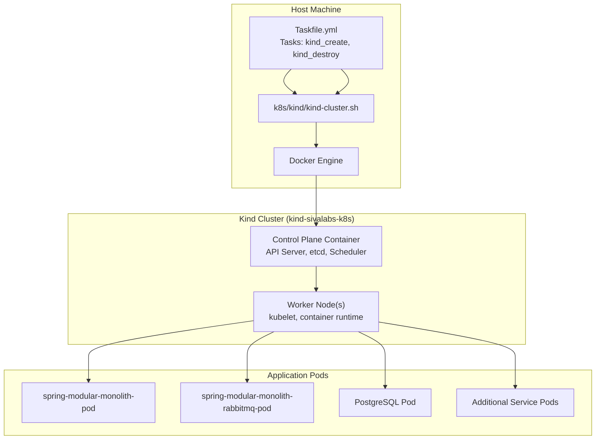
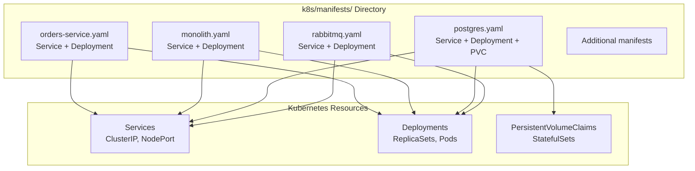
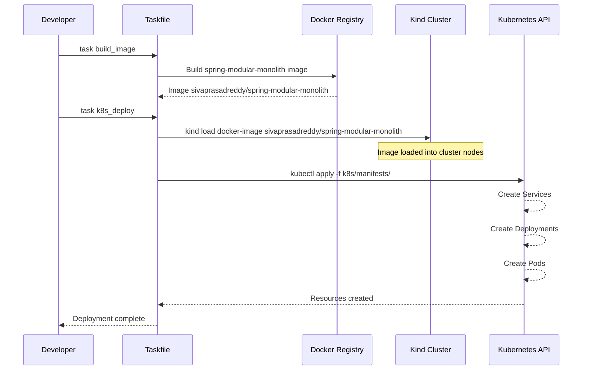
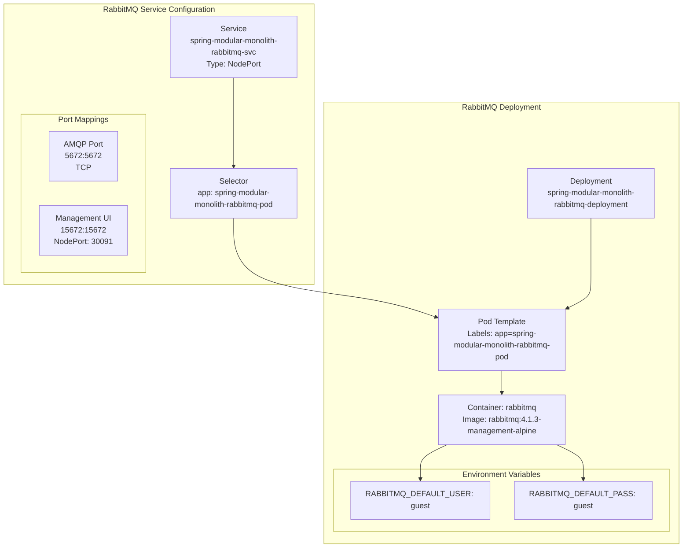
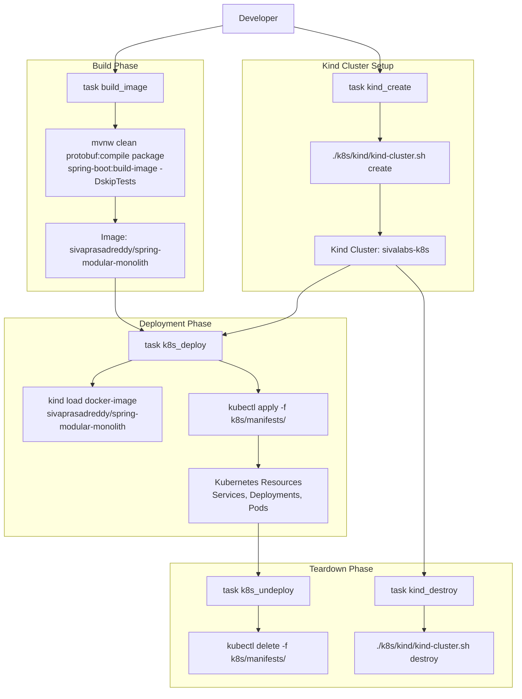

# Kubernetes Deployment with Kind

> **Relevant source files**
> * [Taskfile.yml](https://github.com/philipz/spring-modular-monolith/blob/30c9bf30/Taskfile.yml)
> * [k8s/manifests/rabbitmq.yaml](https://github.com/philipz/spring-modular-monolith/blob/30c9bf30/k8s/manifests/rabbitmq.yaml)

This document explains how to deploy the Spring Modular Monolith application to a local Kubernetes cluster using Kind (Kubernetes in Docker). It covers cluster creation, manifest application, service configuration, and deployment verification.

For Docker Compose-based local deployment, see [Docker Compose Deployment](/philipz/spring-modular-monolith/10.1-docker-compose-deployment). For production Kubernetes considerations and the nginx reverse proxy configuration, see [Nginx Reverse Proxy](/philipz/spring-modular-monolith/10.3-nginx-reverse-proxy).

## Purpose and Scope

This page documents the Kubernetes deployment workflow for local development and testing using Kind. It includes:

* Creating and managing Kind clusters using the provided shell script
* Understanding the Kubernetes manifest structure in `k8s/manifests/`
* Loading Docker images into the Kind cluster
* Deploying all application services and infrastructure components
* Accessing services through NodePort configurations
* Troubleshooting common deployment issues

## Kind Cluster Management

### Kind Cluster Architecture

Kind (Kubernetes in Docker) runs a complete Kubernetes cluster inside Docker containers, providing a lightweight environment for local testing and CI/CD pipelines. The cluster configuration is managed through a dedicated shell script.



**Sources:** [Taskfile.yml L42-L48](https://github.com/philipz/spring-modular-monolith/blob/30c9bf30/Taskfile.yml#L42-L48)

 cluster naming conventions from task commands

### Creating the Kind Cluster

The Kind cluster is created using a shell script that encapsulates the cluster configuration:

```
task kind_create
```

This task executes [k8s/kind/kind-cluster.sh L1](https://github.com/philipz/spring-modular-monolith/blob/30c9bf30/k8s/kind/kind-cluster.sh#L1-L1)

 with the `create` argument. The script creates a Kind cluster named `sivalabs-k8s` with the appropriate configuration for running the Spring Modular Monolith application.

**Task Implementation:**

| Task Name | Command | Purpose |
| --- | --- | --- |
| `kind_create` | `./k8s/kind/kind-cluster.sh create` | Creates the Kind cluster with preconfigured settings |
| `kind_destroy` | `./k8s/kind/kind-cluster.sh destroy` | Tears down the entire Kind cluster and removes containers |

**Sources:** [Taskfile.yml L42-L48](https://github.com/philipz/spring-modular-monolith/blob/30c9bf30/Taskfile.yml#L42-L48)

### Destroying the Kind Cluster

To remove the Kind cluster and free up system resources:

```
task kind_destroy
```

This command removes all Kubernetes resources, the cluster itself, and the associated Docker containers. This is useful for resetting the environment or cleaning up after testing.

**Sources:** [Taskfile.yml L46-L48](https://github.com/philipz/spring-modular-monolith/blob/30c9bf30/Taskfile.yml#L46-L48)

## Kubernetes Manifest Structure

The Kubernetes manifests are organized in the `k8s/manifests/` directory. Each manifest file defines the Kubernetes resources for a specific component of the application stack.



**Sources:** [Taskfile.yml L53](https://github.com/philipz/spring-modular-monolith/blob/30c9bf30/Taskfile.yml#L53-L53)

 manifest directory structure

## Deploying the Application

The deployment process involves two steps: loading Docker images into the Kind cluster and applying Kubernetes manifests.

### Deployment Workflow



**Sources:** [Taskfile.yml L50-L57](https://github.com/philipz/spring-modular-monolith/blob/30c9bf30/Taskfile.yml#L50-L57)

### Loading Docker Images

Before deploying, the application's Docker image must be loaded into the Kind cluster:

```
task k8s_deploy
```

This task performs two operations:

1. **Load Image into Kind:** [Taskfile.yml L52](https://github.com/philipz/spring-modular-monolith/blob/30c9bf30/Taskfile.yml#L52-L52)  executes: ``` kind load docker-image sivaprasadreddy/spring-modular-monolith --name sivalabs-k8s ``` This command copies the `sivaprasadreddy/spring-modular-monolith` image from the local Docker daemon into the Kind cluster named `sivalabs-k8s`, making it available to all nodes without requiring an external registry.
2. **Apply Manifests:** [Taskfile.yml L53](https://github.com/philipz/spring-modular-monolith/blob/30c9bf30/Taskfile.yml#L53-L53)  executes: ``` kubectl apply -f k8s/manifests/ ``` This command applies all YAML manifests in the `k8s/manifests/` directory, creating or updating the Kubernetes resources.

**Sources:** [Taskfile.yml L50-L57](https://github.com/philipz/spring-modular-monolith/blob/30c9bf30/Taskfile.yml#L50-L57)

### Verifying Deployment

After deployment, verify that all pods are running:

```
kubectl get pods
kubectl get services
kubectl get deployments
```

Check specific pod logs for troubleshooting:

```
kubectl logs -f deployment/spring-modular-monolith-deployment
kubectl logs -f deployment/spring-modular-monolith-rabbitmq-deployment
```

**Sources:** Standard kubectl commands referenced in deployment task

## RabbitMQ Service Configuration

The RabbitMQ deployment demonstrates the typical Kubernetes resource structure used across all services.

### RabbitMQ Service Resource



**Sources:** [k8s/manifests/rabbitmq.yaml L1-L48](https://github.com/philipz/spring-modular-monolith/blob/30c9bf30/k8s/manifests/rabbitmq.yaml#L1-L48)

### Service Definition

The RabbitMQ Service [k8s/manifests/rabbitmq.yaml L1-L18](https://github.com/philipz/spring-modular-monolith/blob/30c9bf30/k8s/manifests/rabbitmq.yaml#L1-L18)

 defines two ports:

| Port Name | Port | TargetPort | NodePort | Protocol | Purpose |
| --- | --- | --- | --- | --- | --- |
| `rabbitmq-port-mapping` | 5672 | 5672 | - | TCP | AMQP protocol for message publishing/consuming |
| `rabbitmq--gui-port-mapping` | 15672 | 15672 | 30091 | TCP | Management UI accessible from host |

**Service Type:** `NodePort` - Exposes the service on each node's IP at a static port, allowing external access to the management UI at `http://localhost:30091`.

**Selector:** `app: spring-modular-monolith-rabbitmq-pod` - Routes traffic to pods with this label.

**Sources:** [k8s/manifests/rabbitmq.yaml L1-L18](https://github.com/philipz/spring-modular-monolith/blob/30c9bf30/k8s/manifests/rabbitmq.yaml#L1-L18)

### Deployment Definition

The RabbitMQ Deployment [k8s/manifests/rabbitmq.yaml L20-L48](https://github.com/philipz/spring-modular-monolith/blob/30c9bf30/k8s/manifests/rabbitmq.yaml#L20-L48)

 configures:

**Strategy:** `Recreate` - Terminates existing pods before creating new ones, appropriate for stateful services like RabbitMQ that shouldn't run multiple instances simultaneously.

**Container Configuration:**

* **Image:** `rabbitmq:4.1.3-management-alpine` - Official RabbitMQ image with management plugin
* **Ports:** 5672 (AMQP) and 15672 (Management UI)
* **Environment Variables:** * `RABBITMQ_DEFAULT_USER: guest` * `RABBITMQ_DEFAULT_PASS: guest`

**Sources:** [k8s/manifests/rabbitmq.yaml L20-L48](https://github.com/philipz/spring-modular-monolith/blob/30c9bf30/k8s/manifests/rabbitmq.yaml#L20-L48)

## Accessing Services

Services exposed through NodePort can be accessed from the host machine using the Kind cluster's node IP (typically `localhost` or `127.0.0.1`).

### Service Access Table

| Service | Internal Port | NodePort | Access URL | Purpose |
| --- | --- | --- | --- | --- |
| RabbitMQ Management | 15672 | 30091 | [http://localhost:30091](http://localhost:30091) | RabbitMQ management UI |
| Spring Monolith HTTP | 8080 | TBD | [http://localhost:3xxxx](http://localhost:3xxxx) | REST API endpoints |
| Spring Monolith gRPC | 9091 | TBD | localhost:3xxxx | gRPC service |

To find all NodePort services:

```
kubectl get services --field-selector spec.type=NodePort
```

**Sources:** [k8s/manifests/rabbitmq.yaml L16-L18](https://github.com/philipz/spring-modular-monolith/blob/30c9bf30/k8s/manifests/rabbitmq.yaml#L16-L18)

 NodePort pattern

## Undeploying the Application

To remove all Kubernetes resources while preserving the Kind cluster:

```
task k8s_undeploy
```

This executes [Taskfile.yml L57](https://github.com/philipz/spring-modular-monolith/blob/30c9bf30/Taskfile.yml#L57-L57)

:

```sql
kubectl delete -f k8s/manifests/
```

This command deletes all resources defined in the manifests, including:

* Services
* Deployments
* Pods (terminated automatically when Deployments are deleted)
* PersistentVolumeClaims (if defined)

The Kind cluster itself remains running. To completely remove the cluster, use `task kind_destroy`.

**Sources:** [Taskfile.yml L55-L57](https://github.com/philipz/spring-modular-monolith/blob/30c9bf30/Taskfile.yml#L55-L57)

## Deployment Task Dependencies



**Sources:** [Taskfile.yml L22-L57](https://github.com/philipz/spring-modular-monolith/blob/30c9bf30/Taskfile.yml#L22-L57)

## Common Deployment Patterns

### Resource Naming Convention

All Kubernetes resources follow a consistent naming pattern:

* **Services:** `spring-modular-monolith-{component}-svc`
* **Deployments:** `spring-modular-monolith-{component}-deployment`
* **Pods (via labels):** `spring-modular-monolith-{component}-pod`

Example from RabbitMQ:

* Service: `spring-modular-monolith-rabbitmq-svc`
* Deployment: `spring-modular-monolith-rabbitmq-deployment`
* Pod label: `app: spring-modular-monolith-rabbitmq-pod`

**Sources:** [k8s/manifests/rabbitmq.yaml L4-L33](https://github.com/philipz/spring-modular-monolith/blob/30c9bf30/k8s/manifests/rabbitmq.yaml#L4-L33)

### Label Selectors

Services use label selectors to route traffic to the correct pods:

```yaml
selector:
  app: spring-modular-monolith-rabbitmq-pod
```

The Deployment's pod template must include matching labels:

```yaml
template:
  metadata:
    labels:
      app: spring-modular-monolith-rabbitmq-pod
```

**Sources:** [k8s/manifests/rabbitmq.yaml L7-L33](https://github.com/philipz/spring-modular-monolith/blob/30c9bf30/k8s/manifests/rabbitmq.yaml#L7-L33)

### Deployment Strategy

The RabbitMQ deployment uses `strategy.type: Recreate` [k8s/manifests/rabbitmq.yaml L28-L29](https://github.com/philipz/spring-modular-monolith/blob/30c9bf30/k8s/manifests/rabbitmq.yaml#L28-L29)

 which is appropriate for stateful services. Other services may use `RollingUpdate` for zero-downtime deployments.

## Troubleshooting

### Common Issues

**Issue: Pod stuck in `ImagePullBackOff`**

* **Cause:** Docker image not loaded into Kind cluster
* **Solution:** Run `kind load docker-image sivaprasadreddy/spring-modular-monolith --name sivalabs-k8s`

**Issue: Service not accessible via NodePort**

* **Cause:** Kind cluster not properly configured for port mapping
* **Solution:** Verify the Kind cluster configuration in `k8s/kind/kind-cluster.sh`

**Issue: Pods in `CrashLoopBackOff`**

* **Cause:** Application configuration errors or missing dependencies
* **Solution:** Check pod logs with `kubectl logs <pod-name>` and verify environment variables

### Useful Commands

```html
# Check pod status
kubectl get pods -w

# Describe pod for events
kubectl describe pod <pod-name>

# View pod logs
kubectl logs -f <pod-name>

# Execute into pod shell
kubectl exec -it <pod-name> -- /bin/sh

# Port forward for testing
kubectl port-forward service/spring-modular-monolith-rabbitmq-svc 15672:15672
```

**Sources:** Standard kubectl troubleshooting practices

## Integration with CI/CD

The Kind-based deployment workflow integrates with continuous integration pipelines. The task-based approach allows easy automation:

```markdown
# Complete workflow
task build_image
task kind_create
task k8s_deploy

# Run tests
# ...

# Cleanup
task k8s_undeploy
task kind_destroy
```

This workflow can be scripted in GitHub Actions, GitLab CI, or other CI/CD platforms for automated testing against a real Kubernetes environment.

**Sources:** [Taskfile.yml L22-L57](https://github.com/philipz/spring-modular-monolith/blob/30c9bf30/Taskfile.yml#L22-L57)

 deployment automation pattern