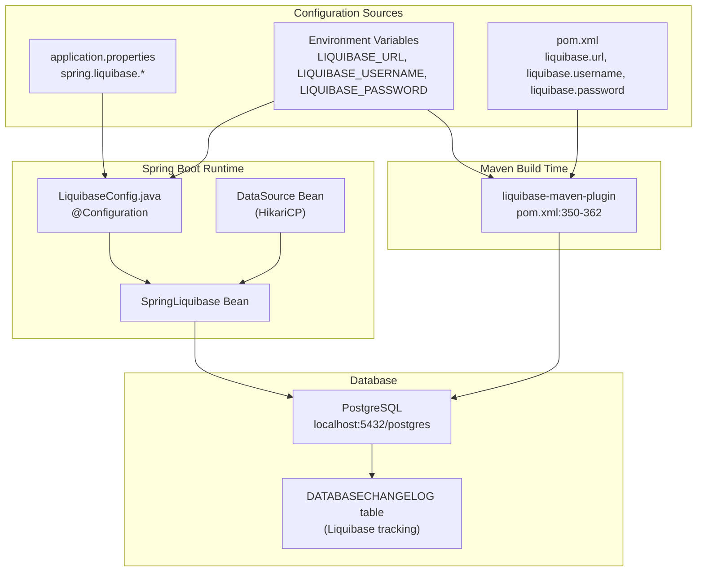
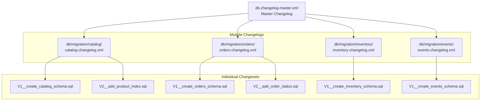
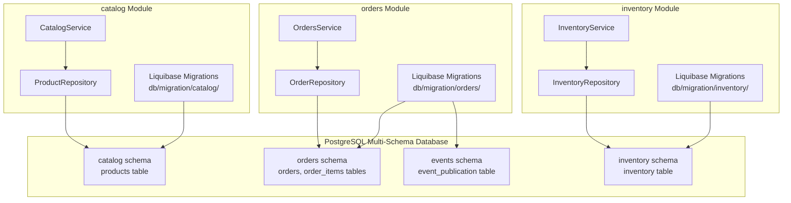
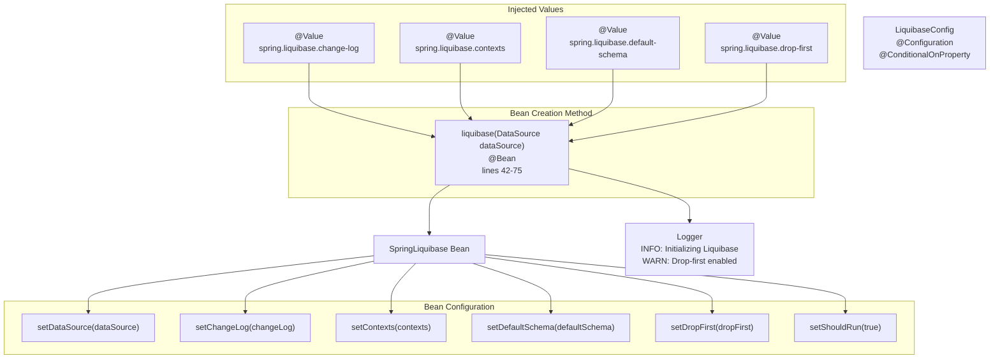
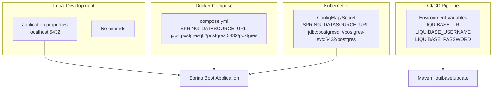
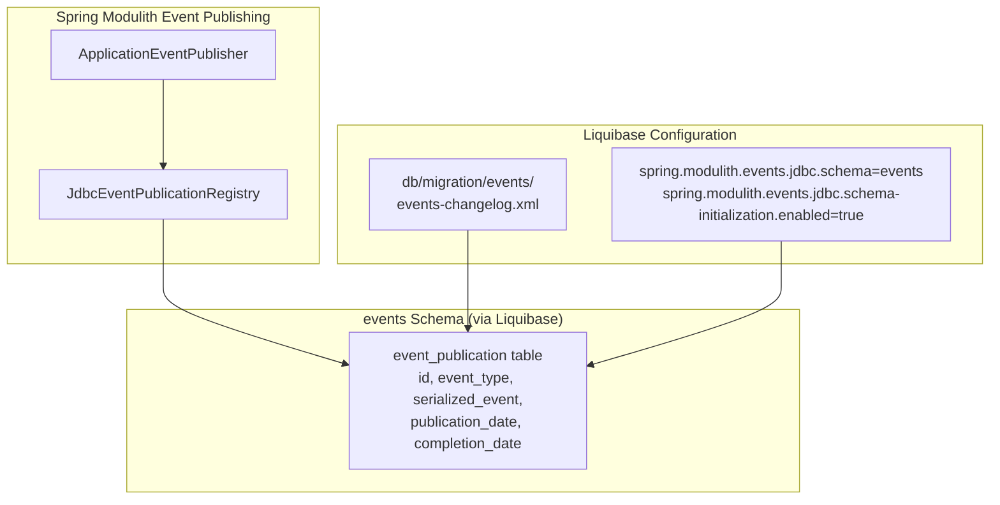
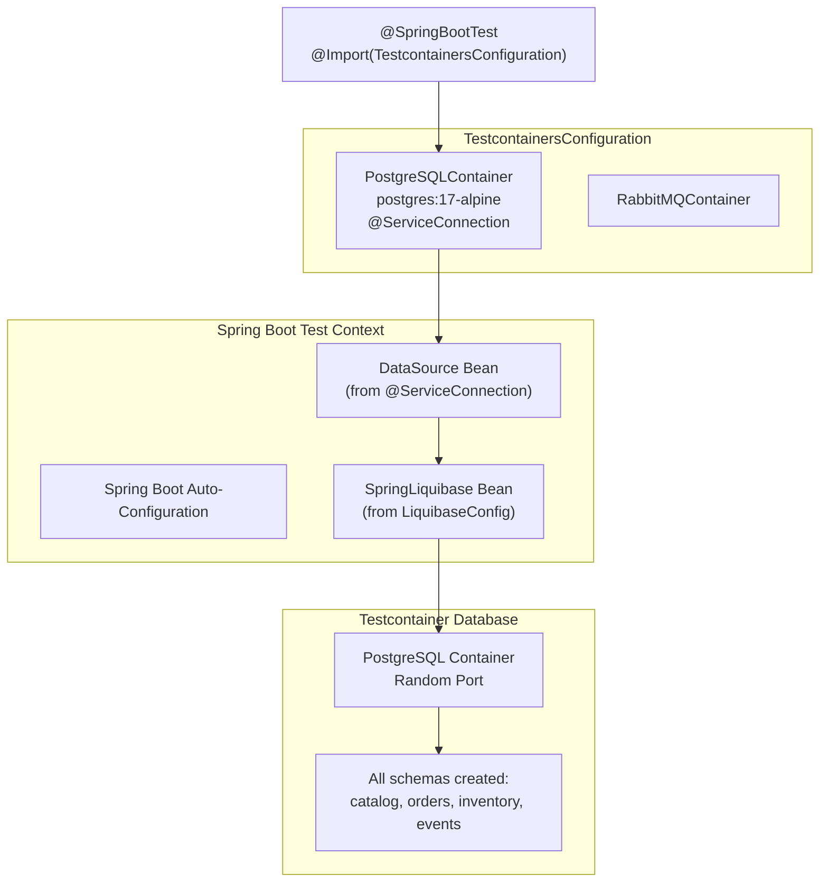
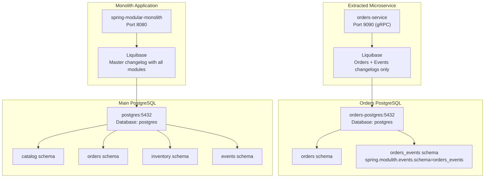

# Liquibase Schema Management

> **Relevant source files**
> * [CLAUDE.md](https://github.com/philipz/spring-modular-monolith/blob/30c9bf30/CLAUDE.md)
> * [compose.yml](https://github.com/philipz/spring-modular-monolith/blob/30c9bf30/compose.yml)
> * [pom.xml](https://github.com/philipz/spring-modular-monolith/blob/30c9bf30/pom.xml)
> * [src/main/java/com/sivalabs/bookstore/config/LiquibaseConfig.java](https://github.com/philipz/spring-modular-monolith/blob/30c9bf30/src/main/java/com/sivalabs/bookstore/config/LiquibaseConfig.java)
> * [src/main/java/com/sivalabs/bookstore/config/OtlpGrpcTracingConfig.java](https://github.com/philipz/spring-modular-monolith/blob/30c9bf30/src/main/java/com/sivalabs/bookstore/config/OtlpGrpcTracingConfig.java)
> * [src/main/java/com/sivalabs/bookstore/config/OtlpProperties.java](https://github.com/philipz/spring-modular-monolith/blob/30c9bf30/src/main/java/com/sivalabs/bookstore/config/OtlpProperties.java)
> * [src/main/resources/application.properties](https://github.com/philipz/spring-modular-monolith/blob/30c9bf30/src/main/resources/application.properties)
> * [src/test/java/com/sivalabs/bookstore/BookStoreApplicationTests.java](https://github.com/philipz/spring-modular-monolith/blob/30c9bf30/src/test/java/com/sivalabs/bookstore/BookStoreApplicationTests.java)
> * [src/test/java/com/sivalabs/bookstore/TestcontainersConfiguration.java](https://github.com/philipz/spring-modular-monolith/blob/30c9bf30/src/test/java/com/sivalabs/bookstore/TestcontainersConfiguration.java)

This page documents the Liquibase database migration strategy used throughout the Spring Modular Monolith. It covers the configuration of the SpringLiquibase bean, per-module migration organization, the master changelog structure, and how schema isolation supports the modular architecture. For information about the multi-schema database design itself, see [Database Schema Organization](/philipz/spring-modular-monolith/4.1-database-schema-organization). For details on how cache data is persisted, see [MapStore Write-Through Pattern](/philipz/spring-modular-monolith/5.2-mapstore-write-through-pattern).

## Overview

The application uses Liquibase to manage database schema migrations in a way that respects module boundaries. Each Spring Modulith business module (`catalog`, `orders`, `inventory`) maintains its own set of migration scripts organized in separate directories, while a master changelog coordinates their execution. The `events` schema, used by Spring Modulith's JDBC event store, is also managed through Liquibase.

**Sources:** [src/main/resources/application.properties L20-L25](https://github.com/philipz/spring-modular-monolith/blob/30c9bf30/src/main/resources/application.properties#L20-L25)

 [src/main/java/com/sivalabs/bookstore/config/LiquibaseConfig.java L1-L77](https://github.com/philipz/spring-modular-monolith/blob/30c9bf30/src/main/java/com/sivalabs/bookstore/config/LiquibaseConfig.java#L1-L77)

## Liquibase Configuration Architecture

The system configures Liquibase at three levels: Spring Boot properties, custom configuration bean, and Maven plugin.



**Sources:** [pom.xml L29-L39](https://github.com/philipz/spring-modular-monolith/blob/30c9bf30/pom.xml#L29-L39)

 [pom.xml L350-L362](https://github.com/philipz/spring-modular-monolith/blob/30c9bf30/pom.xml#L350-L362)

 [src/main/resources/application.properties L20-L25](https://github.com/philipz/spring-modular-monolith/blob/30c9bf30/src/main/resources/application.properties#L20-L25)

 [src/main/java/com/sivalabs/bookstore/config/LiquibaseConfig.java L36-L75](https://github.com/philipz/spring-modular-monolith/blob/30c9bf30/src/main/java/com/sivalabs/bookstore/config/LiquibaseConfig.java#L36-L75)

## Spring Boot Liquibase Properties

The application.properties file defines core Liquibase behavior:

| Property | Value | Description |
| --- | --- | --- |
| `spring.liquibase.enabled` | `true` | Enables automatic migration on application startup |
| `spring.liquibase.change-log` | `classpath:db/db.changelog-master.xml` | Path to master changelog file |
| `spring.liquibase.contexts` | (empty) | Liquibase contexts for conditional execution |
| `spring.liquibase.default-schema` | (empty) | Default schema (not set to allow per-module control) |
| `spring.liquibase.drop-first` | `false` | Whether to drop database before migration (danger!) |

The `LiquibaseConfig` class reads these properties and creates the `SpringLiquibase` bean:

```python
@Configuration
@ConditionalOnProperty(prefix = "spring.liquibase", name = "enabled", havingValue = "true", matchIfMissing = true)
public class LiquibaseConfig {
    // Bean creation at lines 42-75
}
```

**Sources:** [src/main/resources/application.properties L20-L25](https://github.com/philipz/spring-modular-monolith/blob/30c9bf30/src/main/resources/application.properties#L20-L25)

 [src/main/java/com/sivalabs/bookstore/config/LiquibaseConfig.java L18-L19](https://github.com/philipz/spring-modular-monolith/blob/30c9bf30/src/main/java/com/sivalabs/bookstore/config/LiquibaseConfig.java#L18-L19)

 [src/main/java/com/sivalabs/bookstore/config/LiquibaseConfig.java L42-L75](https://github.com/philipz/spring-modular-monolith/blob/30c9bf30/src/main/java/com/sivalabs/bookstore/config/LiquibaseConfig.java#L42-L75)

## Master Changelog Structure

The master changelog at `src/main/resources/db/db.changelog-master.xml` coordinates all module-specific migrations through includes:



This structure allows each module to manage its own migrations independently while maintaining a single execution sequence. The master changelog uses `<include>` directives to reference module-specific changelogs.

**Sources:** [pom.xml L353](https://github.com/philipz/spring-modular-monolith/blob/30c9bf30/pom.xml#L353-L353)

 [src/main/resources/application.properties L22](https://github.com/philipz/spring-modular-monolith/blob/30c9bf30/src/main/resources/application.properties#L22-L22)

## Per-Module Migration Organization

Each business module maintains its database migrations in a dedicated subdirectory structure:

```
src/main/resources/db/migration/
├── catalog/
│   └── catalog-changelog.xml
│   └── V1__create_catalog_schema.sql
│   └── V2__seed_catalog_data.sql
├── orders/
│   └── orders-changelog.xml
│   └── V1__create_orders_schema.sql
│   └── V2__add_order_items.sql
├── inventory/
│   └── inventory-changelog.xml
│   └── V1__create_inventory_schema.sql
├── events/
│   └── events-changelog.xml
│   └── V1__create_events_schema.sql
```

Each module's changelog file typically specifies a `schemaName` attribute to ensure tables are created in the correct schema:

```xml
<changeSet id="1" author="module-owner" schemaName="catalog">
    <sqlFile path="db/migration/catalog/V1__create_catalog_schema.sql"/>
</changeSet>
```

**Sources:** [src/main/resources/application.properties L22](https://github.com/philipz/spring-modular-monolith/blob/30c9bf30/src/main/resources/application.properties#L22-L22)

## Schema Isolation and Module Boundaries

The Liquibase migration strategy directly supports Spring Modulith's module isolation principle:



Key isolation rules:

* Each module owns its schema and migration scripts
* No cross-schema foreign keys
* No direct SQL joins across schemas
* Module communication occurs through APIs or events, not database queries

**Sources:** [src/main/resources/application.properties L20-L25](https://github.com/philipz/spring-modular-monolith/blob/30c9bf30/src/main/resources/application.properties#L20-L25)

## LiquibaseConfig Bean Configuration

The `LiquibaseConfig` class provides a custom `SpringLiquibase` bean with enhanced logging and validation:



The configuration includes safety features:

* Conditional loading via `@ConditionalOnProperty` (can be disabled with `spring.liquibase.enabled=false`)
* Extensive logging of configuration values
* Warning log when `drop-first=true` to prevent accidental data loss
* Validation and rollback support enabled

**Sources:** [src/main/java/com/sivalabs/bookstore/config/LiquibaseConfig.java L18-L19](https://github.com/philipz/spring-modular-monolith/blob/30c9bf30/src/main/java/com/sivalabs/bookstore/config/LiquibaseConfig.java#L18-L19)

 [src/main/java/com/sivalabs/bookstore/config/LiquibaseConfig.java L22-L34](https://github.com/philipz/spring-modular-monolith/blob/30c9bf30/src/main/java/com/sivalabs/bookstore/config/LiquibaseConfig.java#L22-L34)

 [src/main/java/com/sivalabs/bookstore/config/LiquibaseConfig.java L42-L75](https://github.com/philipz/spring-modular-monolith/blob/30c9bf30/src/main/java/com/sivalabs/bookstore/config/LiquibaseConfig.java#L42-L75)

## Maven Plugin Configuration

The `liquibase-maven-plugin` enables running migrations during the build process or as standalone Maven goals:

| Configuration Element | Value | Purpose |
| --- | --- | --- |
| `changeLogFile` | `src/main/resources/db/db.changelog-master.xml` | Entry point changelog |
| `url` | `${liquibase.url}` | JDBC connection URL (externalized) |
| `username` | `${liquibase.username}` | Database username (externalized) |
| `password` | `${liquibase.password}` | Database password (externalized) |
| `driver` | `org.postgresql.Driver` | JDBC driver class |

These properties are externalized to prevent hardcoding credentials in `pom.xml`:

```xml
<liquibase.url>${env.LIQUIBASE_URL}</liquibase.url>
<liquibase.username>${env.LIQUIBASE_USERNAME}</liquibase.username>
<liquibase.password>${env.LIQUIBASE_PASSWORD}</liquibase.password>
```

Common Maven goals:

* `./mvnw liquibase:update` - Apply all pending changesets
* `./mvnw liquibase:status` - Show pending changesets
* `./mvnw liquibase:rollback -Dliquibase.rollbackCount=1` - Rollback last changeset
* `./mvnw liquibase:diff` - Generate diff against target database

**Sources:** [pom.xml L29-L38](https://github.com/philipz/spring-modular-monolith/blob/30c9bf30/pom.xml#L29-L38)

 [pom.xml L350-L362](https://github.com/philipz/spring-modular-monolith/blob/30c9bf30/pom.xml#L350-L362)

## Environment-Specific Configuration

The system supports different database configurations across environments:



**Docker Compose Example:**

```yaml
monolith:
  environment:
    SPRING_DATASOURCE_URL: jdbc:postgresql://postgres:5432/postgres
    SPRING_DATASOURCE_USERNAME: postgres
    SPRING_DATASOURCE_PASSWORD: postgres
```

**Maven CLI Example:**

```javascript
export LIQUIBASE_URL=jdbc:postgresql://localhost:5432/postgres
export LIQUIBASE_USERNAME=postgres
export LIQUIBASE_PASSWORD=postgres
./mvnw liquibase:update
```

**Sources:** [pom.xml L29-L38](https://github.com/philipz/spring-modular-monolith/blob/30c9bf30/pom.xml#L29-L38)

 [compose.yml L58-L66](https://github.com/philipz/spring-modular-monolith/blob/30c9bf30/compose.yml#L58-L66)

 [src/main/resources/application.properties L8-L10](https://github.com/philipz/spring-modular-monolith/blob/30c9bf30/src/main/resources/application.properties#L8-L10)

## Integration with Spring Modulith Events

The `events` schema, created and managed by Liquibase, stores the Spring Modulith event publication log:



Spring Modulith's `schema-initialization.enabled=true` setting works in conjunction with Liquibase:

1. Liquibase creates the `events` schema if it doesn't exist
2. Spring Modulith's schema initialization creates the `event_publication` table structure
3. The table tracks published events for guaranteed delivery and replay

**Sources:** [src/main/resources/application.properties L37-L40](https://github.com/philipz/spring-modular-monolith/blob/30c9bf30/src/main/resources/application.properties#L37-L40)

## Testing with Testcontainers

Integration tests use Testcontainers to provide an isolated PostgreSQL instance with Liquibase migrations automatically applied:



The `@ServiceConnection` annotation automatically configures the Spring Boot DataSource to use the Testcontainers PostgreSQL instance, and Liquibase runs all migrations before tests execute:

```python
@TestConfiguration(proxyBeanMethods = false)
@Testcontainers
public class TestcontainersConfiguration {
    
    @Container
    static PostgreSQLContainer<?> postgres = 
        new PostgreSQLContainer<>(DockerImageName.parse("postgres:17-alpine"));
    
    @Bean
    @ServiceConnection
    PostgreSQLContainer<?> postgresContainer() {
        return postgres;
    }
}
```

**Sources:** [src/test/java/com/sivalabs/bookstore/TestcontainersConfiguration.java L12-L33](https://github.com/philipz/spring-modular-monolith/blob/30c9bf30/src/test/java/com/sivalabs/bookstore/TestcontainersConfiguration.java#L12-L33)

 [src/test/java/com/sivalabs/bookstore/BookStoreApplicationTests.java L9-L12](https://github.com/philipz/spring-modular-monolith/blob/30c9bf30/src/test/java/com/sivalabs/bookstore/BookStoreApplicationTests.java#L9-L12)

## Multi-Database Deployment Strategy

The system uses different database configurations for the monolith versus extracted microservices:



When a module is extracted as a microservice:

1. It gets its own dedicated PostgreSQL instance
2. Its Liquibase changelogs are copied to the microservice project
3. The master changelog in the monolith can optionally be updated to skip that module's migrations
4. The microservice's event schema uses a custom name (`orders_events`) to avoid conflicts

**Sources:** [compose.yml L2-L32](https://github.com/philipz/spring-modular-monolith/blob/30c9bf30/compose.yml#L2-L32)

 [compose.yml L58-L66](https://github.com/philipz/spring-modular-monolith/blob/30c9bf30/compose.yml#L58-L66)

 [compose.yml L88-L113](https://github.com/philipz/spring-modular-monolith/blob/30c9bf30/compose.yml#L88-L113)

 [src/main/resources/application.properties L37](https://github.com/philipz/spring-modular-monolith/blob/30c9bf30/src/main/resources/application.properties#L37-L37)

## Best Practices

| Practice | Implementation |
| --- | --- |
| **Never modify executed changesets** | Once applied, changesets are immutable. Create new changesets for changes. |
| **Use meaningful changeset IDs** | Use sequential numbers or descriptive names: `V1__create_catalog_schema` |
| **Include rollback instructions** | Provide `<rollback>` tags or rollback SQL for reversible changes |
| **Test migrations on copy** | Run `liquibase:updateSQL` to preview SQL before applying |
| **Module-specific authors** | Use author names like `catalog-module` to track ownership |
| **Schema prefixing** | Always specify `schemaName` attribute in changesets |
| **Externalize credentials** | Never hardcode database credentials in `pom.xml` or property files |
| **Version control DATABASECHANGELOG** | Commit the Liquibase tracking table state for consistency |

**Sources:** [pom.xml L350-L362](https://github.com/philipz/spring-modular-monolith/blob/30c9bf30/pom.xml#L350-L362)

 [src/main/java/com/sivalabs/bookstore/config/LiquibaseConfig.java L42-L75](https://github.com/philipz/spring-modular-monolith/blob/30c9bf30/src/main/java/com/sivalabs/bookstore/config/LiquibaseConfig.java#L42-L75)