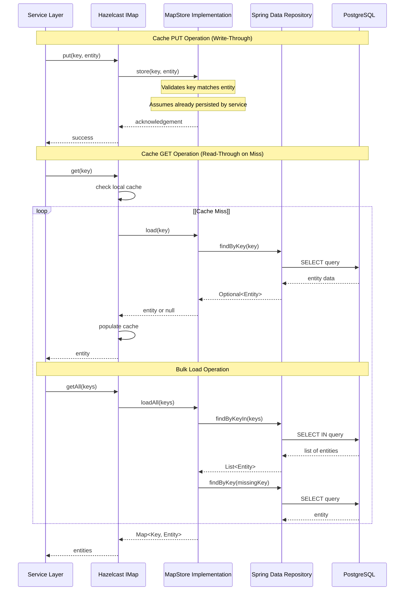
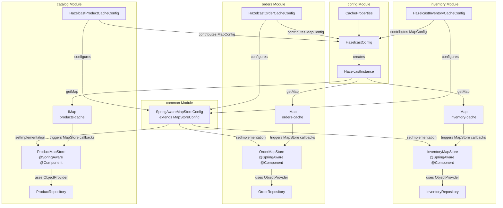
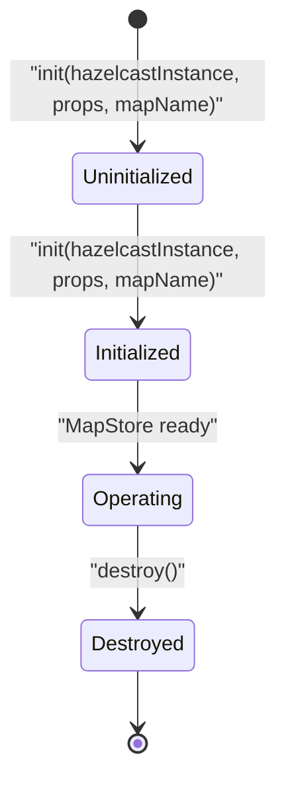
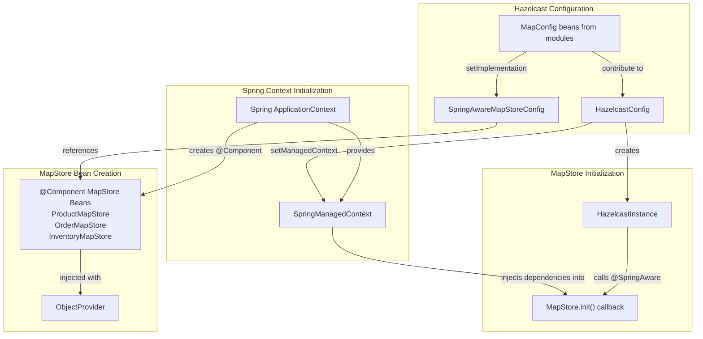
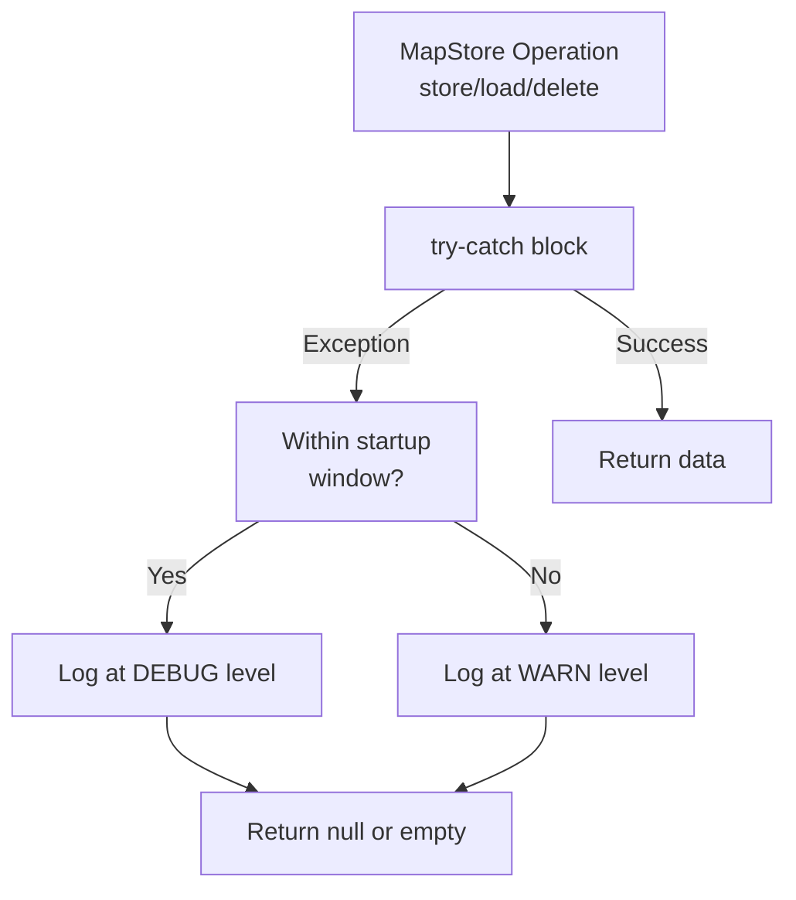

# MapStore Write-Through Pattern

> **Relevant source files**
> * [src/main/java/com/sivalabs/bookstore/catalog/cache/ProductMapStore.java](https://github.com/philipz/spring-modular-monolith/blob/30c9bf30/src/main/java/com/sivalabs/bookstore/catalog/cache/ProductMapStore.java)
> * [src/main/java/com/sivalabs/bookstore/catalog/config/HazelcastProductCacheConfig.java](https://github.com/philipz/spring-modular-monolith/blob/30c9bf30/src/main/java/com/sivalabs/bookstore/catalog/config/HazelcastProductCacheConfig.java)
> * [src/main/java/com/sivalabs/bookstore/common/cache/SpringAwareMapStoreConfig.java](https://github.com/philipz/spring-modular-monolith/blob/30c9bf30/src/main/java/com/sivalabs/bookstore/common/cache/SpringAwareMapStoreConfig.java)
> * [src/main/java/com/sivalabs/bookstore/config/CacheProperties.java](https://github.com/philipz/spring-modular-monolith/blob/30c9bf30/src/main/java/com/sivalabs/bookstore/config/CacheProperties.java)
> * [src/main/java/com/sivalabs/bookstore/config/HazelcastConfig.java](https://github.com/philipz/spring-modular-monolith/blob/30c9bf30/src/main/java/com/sivalabs/bookstore/config/HazelcastConfig.java)
> * [src/main/java/com/sivalabs/bookstore/inventory/cache/InventoryMapStore.java](https://github.com/philipz/spring-modular-monolith/blob/30c9bf30/src/main/java/com/sivalabs/bookstore/inventory/cache/InventoryMapStore.java)
> * [src/main/java/com/sivalabs/bookstore/inventory/config/HazelcastInventoryCacheConfig.java](https://github.com/philipz/spring-modular-monolith/blob/30c9bf30/src/main/java/com/sivalabs/bookstore/inventory/config/HazelcastInventoryCacheConfig.java)
> * [src/main/java/com/sivalabs/bookstore/orders/cache/OrderMapStore.java](https://github.com/philipz/spring-modular-monolith/blob/30c9bf30/src/main/java/com/sivalabs/bookstore/orders/cache/OrderMapStore.java)
> * [src/main/java/com/sivalabs/bookstore/orders/config/HazelcastOrderCacheConfig.java](https://github.com/philipz/spring-modular-monolith/blob/30c9bf30/src/main/java/com/sivalabs/bookstore/orders/config/HazelcastOrderCacheConfig.java)
> * [src/test/java/com/sivalabs/bookstore/catalog/cache/ProductMapStoreTests.java](https://github.com/philipz/spring-modular-monolith/blob/30c9bf30/src/test/java/com/sivalabs/bookstore/catalog/cache/ProductMapStoreTests.java)
> * [src/test/java/com/sivalabs/bookstore/config/HazelcastConfigTests.java](https://github.com/philipz/spring-modular-monolith/blob/30c9bf30/src/test/java/com/sivalabs/bookstore/config/HazelcastConfigTests.java)
> * [src/test/java/com/sivalabs/bookstore/inventory/cache/InventoryMapStoreTests.java](https://github.com/philipz/spring-modular-monolith/blob/30c9bf30/src/test/java/com/sivalabs/bookstore/inventory/cache/InventoryMapStoreTests.java)
> * [src/test/java/com/sivalabs/bookstore/orders/OrdersCacheIntegrationTests.java](https://github.com/philipz/spring-modular-monolith/blob/30c9bf30/src/test/java/com/sivalabs/bookstore/orders/OrdersCacheIntegrationTests.java)
> * [src/test/java/com/sivalabs/bookstore/orders/cache/OrderMapStoreTests.java](https://github.com/philipz/spring-modular-monolith/blob/30c9bf30/src/test/java/com/sivalabs/bookstore/orders/cache/OrderMapStoreTests.java)
> * [src/test/java/com/sivalabs/bookstore/orders/config/HazelcastOrderCacheConfigTests.java](https://github.com/philipz/spring-modular-monolith/blob/30c9bf30/src/test/java/com/sivalabs/bookstore/orders/config/HazelcastOrderCacheConfigTests.java)

## Purpose and Scope

This document explains the MapStore write-through caching pattern implementation in the Spring Modular Monolith. MapStore is a Hazelcast interface that provides persistence backing for distributed caches, automatically synchronizing cache operations with the PostgreSQL database through Spring Data repositories.

For general cache configuration and MapConfig setup, see [Cache Configuration and MapConfigs](/philipz/spring-modular-monolith/5.1-cache-configuration-and-mapconfigs). For session management specifics, see [Session Management with Hazelcast](/philipz/spring-modular-monolith/5.3-session-management-with-hazelcast).

**Sources:** [src/main/java/com/sivalabs/bookstore/catalog/cache/ProductMapStore.java L1-L287](https://github.com/philipz/spring-modular-monolith/blob/30c9bf30/src/main/java/com/sivalabs/bookstore/catalog/cache/ProductMapStore.java#L1-L287)

 [src/main/java/com/sivalabs/bookstore/orders/cache/OrderMapStore.java L1-L279](https://github.com/philipz/spring-modular-monolith/blob/30c9bf30/src/main/java/com/sivalabs/bookstore/orders/cache/OrderMapStore.java#L1-L279)

 [src/main/java/com/sivalabs/bookstore/inventory/cache/InventoryMapStore.java L1-L283](https://github.com/philipz/spring-modular-monolith/blob/30c9bf30/src/main/java/com/sivalabs/bookstore/inventory/cache/InventoryMapStore.java#L1-L283)

## MapStore Pattern Overview

MapStore is a Hazelcast persistence interface that bridges distributed caches with underlying databases. It provides automatic read-through (load on cache miss) and write-through (persist on cache update) capabilities, ensuring cache-database consistency without explicit application code.

The system implements three MapStore instances, one per business domain:

| MapStore | Cache Name | Key Type | Entity Type | Repository |
| --- | --- | --- | --- | --- |
| `ProductMapStore` | `products-cache` | `String` (product code) | `ProductEntity` | `ProductRepository` |
| `OrderMapStore` | `orders-cache` | `String` (order number) | `OrderEntity` | `OrderRepository` |
| `InventoryMapStore` | `inventory-cache` | `Long` (inventory ID) | `InventoryEntity` | `InventoryRepository` |

**Sources:** [src/main/java/com/sivalabs/bookstore/catalog/cache/ProductMapStore.java L35](https://github.com/philipz/spring-modular-monolith/blob/30c9bf30/src/main/java/com/sivalabs/bookstore/catalog/cache/ProductMapStore.java#L35-L35)

 [src/main/java/com/sivalabs/bookstore/orders/cache/OrderMapStore.java L33](https://github.com/philipz/spring-modular-monolith/blob/30c9bf30/src/main/java/com/sivalabs/bookstore/orders/cache/OrderMapStore.java#L33-L33)

 [src/main/java/com/sivalabs/bookstore/inventory/cache/InventoryMapStore.java L36](https://github.com/philipz/spring-modular-monolith/blob/30c9bf30/src/main/java/com/sivalabs/bookstore/inventory/cache/InventoryMapStore.java#L36-L36)

## Write-Through Operation Flow



**Sources:** [src/main/java/com/sivalabs/bookstore/orders/cache/OrderMapStore.java L65-L97](https://github.com/philipz/spring-modular-monolith/blob/30c9bf30/src/main/java/com/sivalabs/bookstore/orders/cache/OrderMapStore.java#L65-L97)

 [src/main/java/com/sivalabs/bookstore/orders/cache/OrderMapStore.java L123-L151](https://github.com/philipz/spring-modular-monolith/blob/30c9bf30/src/main/java/com/sivalabs/bookstore/orders/cache/OrderMapStore.java#L123-L151)

 [src/main/java/com/sivalabs/bookstore/orders/cache/OrderMapStore.java L159-L196](https://github.com/philipz/spring-modular-monolith/blob/30c9bf30/src/main/java/com/sivalabs/bookstore/orders/cache/OrderMapStore.java#L159-L196)

## MapStore Architecture and Components



**Sources:** [src/main/java/com/sivalabs/bookstore/config/HazelcastConfig.java L45-L94](https://github.com/philipz/spring-modular-monolith/blob/30c9bf30/src/main/java/com/sivalabs/bookstore/config/HazelcastConfig.java#L45-L94)

 [src/main/java/com/sivalabs/bookstore/catalog/config/HazelcastProductCacheConfig.java L28-L66](https://github.com/philipz/spring-modular-monolith/blob/30c9bf30/src/main/java/com/sivalabs/bookstore/catalog/config/HazelcastProductCacheConfig.java#L28-L66)

 [src/main/java/com/sivalabs/bookstore/orders/config/HazelcastOrderCacheConfig.java L28-L63](https://github.com/philipz/spring-modular-monolith/blob/30c9bf30/src/main/java/com/sivalabs/bookstore/orders/config/HazelcastOrderCacheConfig.java#L28-L63)

 [src/main/java/com/sivalabs/bookstore/inventory/config/HazelcastInventoryCacheConfig.java L28-L65](https://github.com/philipz/spring-modular-monolith/blob/30c9bf30/src/main/java/com/sivalabs/bookstore/inventory/config/HazelcastInventoryCacheConfig.java#L28-L65)

## Write-Through vs Write-Behind Configuration

The system supports both write-through (synchronous) and write-behind (asynchronous) persistence modes, controlled by the `bookstore.cache.write-through` property.

### Write-Through Mode (Default)

Write-through mode ensures immediate database consistency by setting `writeDelaySeconds=0`:

```
bookstore.cache.write-through=true
bookstore.cache.write-delay-seconds=0
bookstore.cache.write-batch-size=1
```

**Behavior:**

* `store()` called synchronously on cache PUT
* Database writes happen before cache operation completes
* Strong consistency guarantee
* Higher latency per operation

**Sources:** [src/main/java/com/sivalabs/bookstore/catalog/config/HazelcastProductCacheConfig.java L49-L54](https://github.com/philipz/spring-modular-monolith/blob/30c9bf30/src/main/java/com/sivalabs/bookstore/catalog/config/HazelcastProductCacheConfig.java#L49-L54)

 [src/main/java/com/sivalabs/bookstore/orders/config/HazelcastOrderCacheConfig.java L48-L51](https://github.com/philipz/spring-modular-monolith/blob/30c9bf30/src/main/java/com/sivalabs/bookstore/orders/config/HazelcastOrderCacheConfig.java#L48-L51)

### Write-Behind Mode

Write-behind mode batches database writes asynchronously:

```
bookstore.cache.write-through=false
bookstore.cache.write-delay-seconds=5
bookstore.cache.write-batch-size=100
```

**Behavior:**

* `store()` completes immediately
* Database writes batched and delayed
* Higher throughput, lower latency
* Eventual consistency

**Note:** In this implementation, `store()` methods assume entities are already persisted by service layers, so write-through primarily serves validation and logging purposes rather than actual database writes.

**Sources:** [src/main/java/com/sivalabs/bookstore/catalog/config/HazelcastProductCacheConfig.java L54-L62](https://github.com/philipz/spring-modular-monolith/blob/30c9bf30/src/main/java/com/sivalabs/bookstore/catalog/config/HazelcastProductCacheConfig.java#L54-L62)

 [src/main/java/com/sivalabs/bookstore/orders/config/HazelcastOrderCacheConfig.java L52-L59](https://github.com/philipz/spring-modular-monolith/blob/30c9bf30/src/main/java/com/sivalabs/bookstore/orders/config/HazelcastOrderCacheConfig.java#L52-L59)

## MapStore Interface Methods

Each MapStore implementation provides these key methods:

### Lifecycle Methods



**Sources:** [src/main/java/com/sivalabs/bookstore/catalog/cache/ProductMapStore.java L58-L65](https://github.com/philipz/spring-modular-monolith/blob/30c9bf30/src/main/java/com/sivalabs/bookstore/catalog/cache/ProductMapStore.java#L58-L65)

 [src/main/java/com/sivalabs/bookstore/orders/cache/OrderMapStore.java L55-L63](https://github.com/philipz/spring-modular-monolith/blob/30c9bf30/src/main/java/com/sivalabs/bookstore/orders/cache/OrderMapStore.java#L55-L63)

### Core Persistence Operations

| Method | Purpose | Trigger | Database Operation |
| --- | --- | --- | --- |
| `store(K key, V value)` | Write-through store | `cache.put()` | Validates key/entity match |
| `load(K key)` | Read-through load | `cache.get()` (miss) | `repository.findByKey(key)` |
| `delete(K key)` | Write-through delete | `cache.remove()` | Logs but delegates to service |
| `storeAll(Map<K,V> map)` | Bulk write | `cache.putAll()` | Validates entries |
| `loadAll(Collection<K> keys)` | Bulk read | `cache.getAll()` (misses) | `repository.findByKeyIn(keys)` with per-key fallback |
| `loadAllKeys()` | Cache warming | Initialization | `repository.findAll()` to get keys |

**Sources:** [src/main/java/com/sivalabs/bookstore/catalog/cache/ProductMapStore.java L67-L286](https://github.com/philipz/spring-modular-monolith/blob/30c9bf30/src/main/java/com/sivalabs/bookstore/catalog/cache/ProductMapStore.java#L67-L286)

 [src/main/java/com/sivalabs/bookstore/orders/cache/OrderMapStore.java L65-L277](https://github.com/philipz/spring-modular-monolith/blob/30c9bf30/src/main/java/com/sivalabs/bookstore/orders/cache/OrderMapStore.java#L65-L277)

 [src/main/java/com/sivalabs/bookstore/inventory/cache/InventoryMapStore.java L68-L281](https://github.com/philipz/spring-modular-monolith/blob/30c9bf30/src/main/java/com/sivalabs/bookstore/inventory/cache/InventoryMapStore.java#L68-L281)

## ProductMapStore Implementation

The `ProductMapStore` uses product codes as cache keys and delegates to `ProductRepository` for database operations.

**Key characteristics:**

* Key type: `String` (product code)
* Batch query method: `findByCodeIn(Collection<String>)`
* Fallback for missing entries uses `findByCode(String)` per-key
* Returns all product codes via `findAll()` for `loadAllKeys()`

**Load operation implementation:**

[src/main/java/com/sivalabs/bookstore/catalog/cache/ProductMapStore.java L128-L157](https://github.com/philipz/spring-modular-monolith/blob/30c9bf30/src/main/java/com/sivalabs/bookstore/catalog/cache/ProductMapStore.java#L128-L157)

**LoadAll with batch query and fallback:**

[src/main/java/com/sivalabs/bookstore/catalog/cache/ProductMapStore.java L160-L202](https://github.com/philipz/spring-modular-monolith/blob/30c9bf30/src/main/java/com/sivalabs/bookstore/catalog/cache/ProductMapStore.java#L160-L202)

**Sources:** [src/main/java/com/sivalabs/bookstore/catalog/cache/ProductMapStore.java L1-L287](https://github.com/philipz/spring-modular-monolith/blob/30c9bf30/src/main/java/com/sivalabs/bookstore/catalog/cache/ProductMapStore.java#L1-L287)

## OrderMapStore Implementation

The `OrderMapStore` uses order numbers as cache keys and implements similar patterns with order-specific operations.

**Key characteristics:**

* Key type: `String` (order number)
* Batch query method: `findByOrderNumberIn(Collection<String>)`
* Per-key fallback uses `findByOrderNumber(String)`
* Returns empty set for `loadAllKeys()` (no findAll method exposed by OrderService)

**Load operation with error handling:**

[src/main/java/com/sivalabs/bookstore/orders/cache/OrderMapStore.java L123-L151](https://github.com/philipz/spring-modular-monolith/blob/30c9bf30/src/main/java/com/sivalabs/bookstore/orders/cache/OrderMapStore.java#L123-L151)

**Store operation with validation:**

[src/main/java/com/sivalabs/bookstore/orders/cache/OrderMapStore.java L65-L97](https://github.com/philipz/spring-modular-monolith/blob/30c9bf30/src/main/java/com/sivalabs/bookstore/orders/cache/OrderMapStore.java#L65-L97)

**Sources:** [src/main/java/com/sivalabs/bookstore/orders/cache/OrderMapStore.java L1-L279](https://github.com/philipz/spring-modular-monolith/blob/30c9bf30/src/main/java/com/sivalabs/bookstore/orders/cache/OrderMapStore.java#L1-L279)

## InventoryMapStore Implementation

The `InventoryMapStore` differs by using `Long` keys (inventory IDs) instead of `String` keys.

**Key characteristics:**

* Key type: `Long` (inventory ID)
* Entity lookup: `findById(Long)`
* Bulk load: `findAllById(Collection<Long>)` using standard Spring Data method
* Returns all inventory IDs via `findAll()` stream for `loadAllKeys()`

**LoadAll implementation:**

[src/main/java/com/sivalabs/bookstore/inventory/cache/InventoryMapStore.java L162-L196](https://github.com/philipz/spring-modular-monolith/blob/30c9bf30/src/main/java/com/sivalabs/bookstore/inventory/cache/InventoryMapStore.java#L162-L196)

**LoadAllKeys for cache warming:**

[src/main/java/com/sivalabs/bookstore/inventory/cache/InventoryMapStore.java L198-L224](https://github.com/philipz/spring-modular-monolith/blob/30c9bf30/src/main/java/com/sivalabs/bookstore/inventory/cache/InventoryMapStore.java#L198-L224)

**Sources:** [src/main/java/com/sivalabs/bookstore/inventory/cache/InventoryMapStore.java L1-L283](https://github.com/philipz/spring-modular-monolith/blob/30c9bf30/src/main/java/com/sivalabs/bookstore/inventory/cache/InventoryMapStore.java#L1-L283)

## Spring Integration and Dependency Injection



### @SpringAware Annotation

The `@SpringAware` annotation marks MapStore classes for Spring dependency injection by Hazelcast:

[src/main/java/com/sivalabs/bookstore/catalog/cache/ProductMapStore.java L33-L34](https://github.com/philipz/spring-modular-monolith/blob/30c9bf30/src/main/java/com/sivalabs/bookstore/catalog/cache/ProductMapStore.java#L33-L34)

[src/main/java/com/sivalabs/bookstore/orders/cache/OrderMapStore.java L31-L32](https://github.com/philipz/spring-modular-monolith/blob/30c9bf30/src/main/java/com/sivalabs/bookstore/orders/cache/OrderMapStore.java#L31-L32)

[src/main/java/com/sivalabs/bookstore/inventory/cache/InventoryMapStore.java L34-L35](https://github.com/philipz/spring-modular-monolith/blob/30c9bf30/src/main/java/com/sivalabs/bookstore/inventory/cache/InventoryMapStore.java#L34-L35)

### ObjectProvider Pattern

MapStore implementations use `ObjectProvider<Repository>` for lazy repository access, avoiding circular dependency issues during Spring context initialization:

[src/main/java/com/sivalabs/bookstore/catalog/cache/ProductMapStore.java L41-L51](https://github.com/philipz/spring-modular-monolith/blob/30c9bf30/src/main/java/com/sivalabs/bookstore/catalog/cache/ProductMapStore.java#L41-L51)

This pattern ensures repositories are only resolved when actually needed, after the Spring context is fully initialized.

**Sources:** [src/main/java/com/sivalabs/bookstore/config/HazelcastConfig.java L96-L102](https://github.com/philipz/spring-modular-monolith/blob/30c9bf30/src/main/java/com/sivalabs/bookstore/config/HazelcastConfig.java#L96-L102)

 [src/main/java/com/sivalabs/bookstore/catalog/cache/ProductMapStore.java L33-L51](https://github.com/philipz/spring-modular-monolith/blob/30c9bf30/src/main/java/com/sivalabs/bookstore/catalog/cache/ProductMapStore.java#L33-L51)

 [src/main/java/com/sivalabs/bookstore/orders/cache/OrderMapStore.java L31-L49](https://github.com/philipz/spring-modular-monolith/blob/30c9bf30/src/main/java/com/sivalabs/bookstore/orders/cache/OrderMapStore.java#L31-L49)

## Error Handling and Startup Grace Period

All MapStore implementations include graceful error handling with a startup grace period to avoid noisy logs during application initialization.

### Startup Window Pattern

[src/main/java/com/sivalabs/bookstore/catalog/cache/ProductMapStore.java L38-L55](https://github.com/philipz/spring-modular-monolith/blob/30c9bf30/src/main/java/com/sivalabs/bookstore/catalog/cache/ProductMapStore.java#L38-L55)

During the first 30 seconds (`STARTUP_GRACE_PERIOD_MS`), errors are logged at DEBUG level instead of WARN/ERROR, acknowledging that database connections or schema initialization may still be in progress.

### Exception Handling Strategy



**Load operation error handling example:**

[src/main/java/com/sivalabs/bookstore/orders/cache/OrderMapStore.java L130-L151](https://github.com/philipz/spring-modular-monolith/blob/30c9bf30/src/main/java/com/sivalabs/bookstore/orders/cache/OrderMapStore.java#L130-L151)

**Store operation error handling example:**

[src/main/java/com/sivalabs/bookstore/catalog/cache/ProductMapStore.java L74-L99](https://github.com/philipz/spring-modular-monolith/blob/30c9bf30/src/main/java/com/sivalabs/bookstore/catalog/cache/ProductMapStore.java#L74-L99)

**Sources:** [src/main/java/com/sivalabs/bookstore/catalog/cache/ProductMapStore.java L38-L99](https://github.com/philipz/spring-modular-monolith/blob/30c9bf30/src/main/java/com/sivalabs/bookstore/catalog/cache/ProductMapStore.java#L38-L99)

 [src/main/java/com/sivalabs/bookstore/orders/cache/OrderMapStore.java L36-L97](https://github.com/philipz/spring-modular-monolith/blob/30c9bf30/src/main/java/com/sivalabs/bookstore/orders/cache/OrderMapStore.java#L36-L97)

 [src/main/java/com/sivalabs/bookstore/inventory/cache/InventoryMapStore.java L39-L98](https://github.com/philipz/spring-modular-monolith/blob/30c9bf30/src/main/java/com/sivalabs/bookstore/inventory/cache/InventoryMapStore.java#L39-L98)

## MapStore Configuration Properties

MapStore behavior is controlled through `CacheProperties` bound from `application.properties`:

| Property | Default | Description |
| --- | --- | --- |
| `bookstore.cache.enabled` | `true` | Enable/disable cache entirely |
| `bookstore.cache.write-through` | `true` | Enable write-through mode (vs write-behind) |
| `bookstore.cache.write-delay-seconds` | `0` | Delay for write-behind mode (0 = write-through) |
| `bookstore.cache.write-batch-size` | `1` | Batch size for write operations |
| `bookstore.cache.max-size` | `1000` | Max entries per cache node |
| `bookstore.cache.time-to-live-seconds` | `3600` | TTL for products/orders cache entries |
| `bookstore.cache.inventory-time-to-live-seconds` | `1800` | TTL for inventory cache (shorter due to volatility) |
| `bookstore.cache.backup-count` | `1` | Number of backup replicas |
| `bookstore.cache.read-backup-data` | `true` | Read from backup nodes |
| `bookstore.cache.metrics-enabled` | `true` | Enable cache metrics collection |

### MapStoreConfig Assembly

Module-specific configuration classes read these properties and construct `MapStoreConfig` instances:

[src/main/java/com/sivalabs/bookstore/orders/config/HazelcastOrderCacheConfig.java L28-L63](https://github.com/philipz/spring-modular-monolith/blob/30c9bf30/src/main/java/com/sivalabs/bookstore/orders/config/HazelcastOrderCacheConfig.java#L28-L63)

The `SpringAwareMapStoreConfig` extension exposes the MapStore class name even when using Spring-managed implementation instances, supporting integration test verification:

[src/main/java/com/sivalabs/bookstore/common/cache/SpringAwareMapStoreConfig.java L1-L29](https://github.com/philipz/spring-modular-monolith/blob/30c9bf30/src/main/java/com/sivalabs/bookstore/common/cache/SpringAwareMapStoreConfig.java#L1-L29)

**Sources:** [src/main/java/com/sivalabs/bookstore/config/CacheProperties.java L1-L235](https://github.com/philipz/spring-modular-monolith/blob/30c9bf30/src/main/java/com/sivalabs/bookstore/config/CacheProperties.java#L1-L235)

 [src/main/java/com/sivalabs/bookstore/catalog/config/HazelcastProductCacheConfig.java L28-L66](https://github.com/philipz/spring-modular-monolith/blob/30c9bf30/src/main/java/com/sivalabs/bookstore/catalog/config/HazelcastProductCacheConfig.java#L28-L66)

 [src/main/java/com/sivalabs/bookstore/orders/config/HazelcastOrderCacheConfig.java L28-L63](https://github.com/philipz/spring-modular-monolith/blob/30c9bf30/src/main/java/com/sivalabs/bookstore/orders/config/HazelcastOrderCacheConfig.java#L28-L63)

 [src/main/java/com/sivalabs/bookstore/inventory/config/HazelcastInventoryCacheConfig.java L28-L65](https://github.com/philipz/spring-modular-monolith/blob/30c9bf30/src/main/java/com/sivalabs/bookstore/inventory/config/HazelcastInventoryCacheConfig.java#L28-L65)

## MapStore Lifecycle Diagram

```mermaid
sequenceDiagram
  participant Spring Context
  participant HazelcastConfig
  participant Module MapConfig
  participant HazelcastInstance
  participant MapStore @Component
  participant Repository
  participant SpringAwareConfig
  participant ObjectProvider

  note over Spring Context,Repository: Application Startup
  Spring Context->>MapStore @Component: Create @Component bean
  Spring Context->>MapStore @Component: Inject ObjectProvider<Repository>
  MapStore @Component->>MapStore @Component: Store initTimestamp
  Spring Context->>Module MapConfig: Create MapConfig bean
  Module MapConfig->>Module MapConfig: Read CacheProperties
  Module MapConfig->>Module MapConfig: Create SpringAwareMapStoreConfig
  Module MapConfig->>SpringAwareConfig: setImplementation(mapStore)
  Module MapConfig->>SpringAwareConfig: setWriteDelaySeconds(0)
  Module MapConfig->>SpringAwareConfig: setInitialLoadMode(LAZY)
  Spring Context->>HazelcastConfig: Create HazelcastConfig bean
  HazelcastConfig->>HazelcastConfig: Aggregate MapConfig beans
  HazelcastConfig->>HazelcastConfig: Set SpringManagedContext
  HazelcastConfig->>HazelcastInstance: Create HazelcastInstance
  HazelcastInstance->>MapStore @Component: init(hazelcastInstance, props, mapName)
  note over MapStore @Component: MapStore lifecycle initialized
  note over Spring Context,Repository: Runtime Operations
  loop [Cache Miss]
    HazelcastInstance->>MapStore @Component: load(key)
    MapStore @Component->>ObjectProvider: getObject()
    ObjectProvider->>Repository: resolve repository
    MapStore @Component->>Repository: findByKey(key)
    Repository-->>MapStore @Component: Optional<Entity>
    MapStore @Component-->>HazelcastInstance: entity or null
  end
  note over Spring Context,Repository: Application Shutdown
  HazelcastInstance->>MapStore @Component: destroy()
  MapStore @Component->>MapStore @Component: Cleanup resources
```

**Sources:** [src/main/java/com/sivalabs/bookstore/config/HazelcastConfig.java L45-L116](https://github.com/philipz/spring-modular-monolith/blob/30c9bf30/src/main/java/com/sivalabs/bookstore/config/HazelcastConfig.java#L45-L116)

 [src/main/java/com/sivalabs/bookstore/catalog/cache/ProductMapStore.java L43-L65](https://github.com/philipz/spring-modular-monolith/blob/30c9bf30/src/main/java/com/sivalabs/bookstore/catalog/cache/ProductMapStore.java#L43-L65)

## Testing MapStore Implementations

MapStore implementations are tested at multiple levels:

### Unit Tests

Unit tests mock the repository and verify MapStore behavior in isolation:

[src/test/java/com/sivalabs/bookstore/catalog/cache/ProductMapStoreTests.java L1-L353](https://github.com/philipz/spring-modular-monolith/blob/30c9bf30/src/test/java/com/sivalabs/bookstore/catalog/cache/ProductMapStoreTests.java#L1-L353)

[src/test/java/com/sivalabs/bookstore/orders/cache/OrderMapStoreTests.java L1-L325](https://github.com/philipz/spring-modular-monolith/blob/30c9bf30/src/test/java/com/sivalabs/bookstore/orders/cache/OrderMapStoreTests.java#L1-L325)

[src/test/java/com/sivalabs/bookstore/inventory/cache/InventoryMapStoreTests.java L1-L459](https://github.com/philipz/spring-modular-monolith/blob/30c9bf30/src/test/java/com/sivalabs/bookstore/inventory/cache/InventoryMapStoreTests.java#L1-L459)

**Key test scenarios:**

* Successful load operations
* Cache miss handling (return null)
* Batch load with partial results
* Exception handling during startup window
* Key validation warnings
* Lifecycle initialization and destruction

### Integration Tests

Integration tests verify MapStore behavior with real Hazelcast instances and Testcontainers databases:

[src/test/java/com/sivalabs/bookstore/config/HazelcastConfigTests.java L1-L581](https://github.com/philipz/spring-modular-monolith/blob/30c9bf30/src/test/java/com/sivalabs/bookstore/config/HazelcastConfigTests.java#L1-L581)

[src/test/java/com/sivalabs/bookstore/orders/OrdersCacheIntegrationTests.java L1-L491](https://github.com/philipz/spring-modular-monolith/blob/30c9bf30/src/test/java/com/sivalabs/bookstore/orders/OrdersCacheIntegrationTests.java#L1-L491)

**Verified behaviors:**

* Write-through cache-database consistency
* Read-through on cache miss with database fallback
* MapStoreConfig validation (class name, write delay, batch size)
* Cache-database synchronization across transactions
* Circuit breaker protection

**Sources:** [src/test/java/com/sivalabs/bookstore/catalog/cache/ProductMapStoreTests.java L27-L353](https://github.com/philipz/spring-modular-monolith/blob/30c9bf30/src/test/java/com/sivalabs/bookstore/catalog/cache/ProductMapStoreTests.java#L27-L353)

 [src/test/java/com/sivalabs/bookstore/orders/cache/OrderMapStoreTests.java L33-L325](https://github.com/philipz/spring-modular-monolith/blob/30c9bf30/src/test/java/com/sivalabs/bookstore/orders/cache/OrderMapStoreTests.java#L33-L325)

 [src/test/java/com/sivalabs/bookstore/inventory/cache/InventoryMapStoreTests.java L27-L459](https://github.com/philipz/spring-modular-monolith/blob/30c9bf30/src/test/java/com/sivalabs/bookstore/inventory/cache/InventoryMapStoreTests.java#L27-L459)

 [src/test/java/com/sivalabs/bookstore/config/HazelcastConfigTests.java L40-L581](https://github.com/philipz/spring-modular-monolith/blob/30c9bf30/src/test/java/com/sivalabs/bookstore/config/HazelcastConfigTests.java#L40-L581)

## Batch Loading Strategy

All MapStore implementations use a two-phase loading strategy for bulk operations:

1. **Batch query attempt**: Try to load all requested keys using repository's batch method (`findByCodeIn`, `findByOrderNumberIn`, `findAllById`)
2. **Per-key fallback**: For any missing keys, attempt individual lookups

This ensures partial success even when batch queries fail or return incomplete results.

**ProductMapStore batch loading:**

[src/main/java/com/sivalabs/bookstore/catalog/cache/ProductMapStore.java L166-L202](https://github.com/philipz/spring-modular-monolith/blob/30c9bf30/src/main/java/com/sivalabs/bookstore/catalog/cache/ProductMapStore.java#L166-L202)

**OrderMapStore batch loading:**

[src/main/java/com/sivalabs/bookstore/orders/cache/OrderMapStore.java L159-L196](https://github.com/philipz/spring-modular-monolith/blob/30c9bf30/src/main/java/com/sivalabs/bookstore/orders/cache/OrderMapStore.java#L159-L196)

**InventoryMapStore batch loading:**

[src/main/java/com/sivalabs/bookstore/inventory/cache/InventoryMapStore.java L162-L196](https://github.com/philipz/spring-modular-monolith/blob/30c9bf30/src/main/java/com/sivalabs/bookstore/inventory/cache/InventoryMapStore.java#L162-L196)

This pattern provides resilience against partial database failures and ensures maximum data availability.

**Sources:** [src/main/java/com/sivalabs/bookstore/catalog/cache/ProductMapStore.java L166-L202](https://github.com/philipz/spring-modular-monolith/blob/30c9bf30/src/main/java/com/sivalabs/bookstore/catalog/cache/ProductMapStore.java#L166-L202)

 [src/main/java/com/sivalabs/bookstore/orders/cache/OrderMapStore.java L159-L196](https://github.com/philipz/spring-modular-monolith/blob/30c9bf30/src/main/java/com/sivalabs/bookstore/orders/cache/OrderMapStore.java#L159-L196)

 [src/main/java/com/sivalabs/bookstore/inventory/cache/InventoryMapStore.java L162-L196](https://github.com/philipz/spring-modular-monolith/blob/30c9bf30/src/main/java/com/sivalabs/bookstore/inventory/cache/InventoryMapStore.java#L162-L196)

## Deletion Pattern

MapStore delete operations log the action but delegate actual deletion to service layers:

[src/main/java/com/sivalabs/bookstore/catalog/cache/ProductMapStore.java L232-L256](https://github.com/philipz/spring-modular-monolith/blob/30c9bf30/src/main/java/com/sivalabs/bookstore/catalog/cache/ProductMapStore.java#L232-L256)

**Rationale:**

* Entity deletion should go through service layer business logic
* Cache eviction (via `cache.remove()`) triggers `delete()` callback
* MapStore validates the operation but doesn't execute database deletion
* Service layer handles cascading deletes, constraints, and domain events

This pattern maintains proper separation of concerns and ensures business rules are enforced.

**Sources:** [src/main/java/com/sivalabs/bookstore/catalog/cache/ProductMapStore.java L232-L256](https://github.com/philipz/spring-modular-monolith/blob/30c9bf30/src/main/java/com/sivalabs/bookstore/catalog/cache/ProductMapStore.java#L232-L256)

 [src/main/java/com/sivalabs/bookstore/orders/cache/OrderMapStore.java L225-L250](https://github.com/philipz/spring-modular-monolith/blob/30c9bf30/src/main/java/com/sivalabs/bookstore/orders/cache/OrderMapStore.java#L225-L250)

 [src/main/java/com/sivalabs/bookstore/inventory/cache/InventoryMapStore.java L226-L250](https://github.com/philipz/spring-modular-monolith/blob/30c9bf30/src/main/java/com/sivalabs/bookstore/inventory/cache/InventoryMapStore.java#L226-L250)