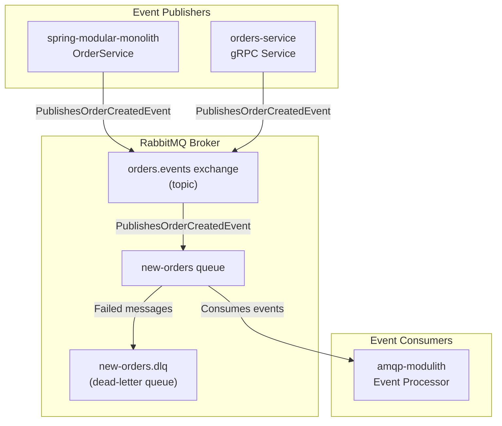
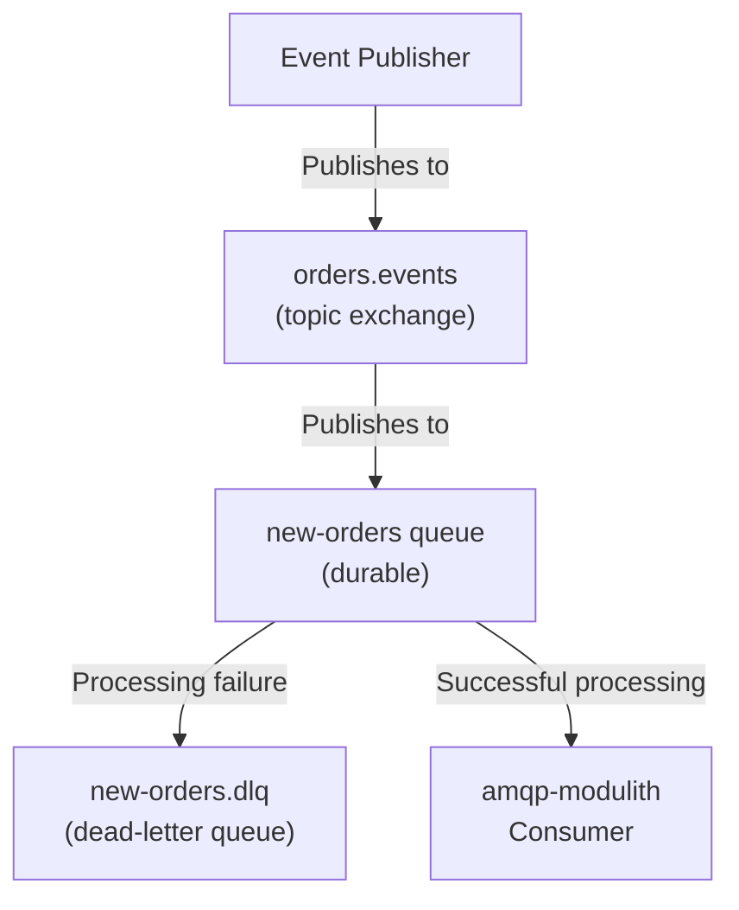
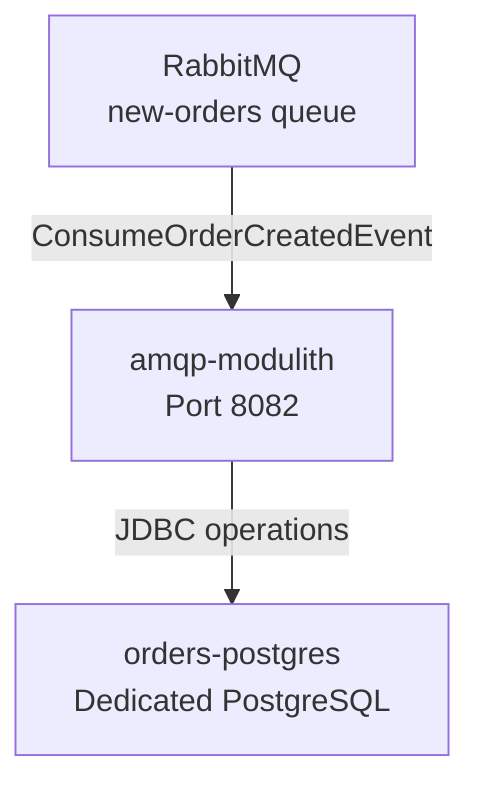

# Messaging with RabbitMQ

> **Relevant source files**
> * [README-API.md](https://github.com/philipz/spring-modular-monolith/blob/30c9bf30/README-API.md)
> * [README.md](https://github.com/philipz/spring-modular-monolith/blob/30c9bf30/README.md)
> * [compose.yml](https://github.com/philipz/spring-modular-monolith/blob/30c9bf30/compose.yml)
> * [docs/API_ANALYSIS_SUMMARY.txt](https://github.com/philipz/spring-modular-monolith/blob/30c9bf30/docs/API_ANALYSIS_SUMMARY.txt)
> * [docs/REST_API_ANALYSIS.md](https://github.com/philipz/spring-modular-monolith/blob/30c9bf30/docs/REST_API_ANALYSIS.md)
> * [docs/bookstore-microservices.png](https://github.com/philipz/spring-modular-monolith/blob/30c9bf30/docs/bookstore-microservices.png)
> * [docs/improvement.md](https://github.com/philipz/spring-modular-monolith/blob/30c9bf30/docs/improvement.md)
> * [docs/orders-data-ownership-analysis.md](https://github.com/philipz/spring-modular-monolith/blob/30c9bf30/docs/orders-data-ownership-analysis.md)
> * [docs/orders-module-boundary-analysis.md](https://github.com/philipz/spring-modular-monolith/blob/30c9bf30/docs/orders-module-boundary-analysis.md)
> * [docs/orders-traffic-migration.md](https://github.com/philipz/spring-modular-monolith/blob/30c9bf30/docs/orders-traffic-migration.md)
> * [k6.js](https://github.com/philipz/spring-modular-monolith/blob/30c9bf30/k6.js)
> * [k8s/manifests/rabbitmq.yaml](https://github.com/philipz/spring-modular-monolith/blob/30c9bf30/k8s/manifests/rabbitmq.yaml)
> * [pom.xml](https://github.com/philipz/spring-modular-monolith/blob/30c9bf30/pom.xml)
> * [src/main/resources/application.properties](https://github.com/philipz/spring-modular-monolith/blob/30c9bf30/src/main/resources/application.properties)
> * [src/test/java/com/sivalabs/bookstore/BookStoreApplicationTests.java](https://github.com/philipz/spring-modular-monolith/blob/30c9bf30/src/test/java/com/sivalabs/bookstore/BookStoreApplicationTests.java)
> * [src/test/java/com/sivalabs/bookstore/TestcontainersConfiguration.java](https://github.com/philipz/spring-modular-monolith/blob/30c9bf30/src/test/java/com/sivalabs/bookstore/TestcontainersConfiguration.java)

## Purpose and Scope

This page documents RabbitMQ's role as the external event bus in the Spring Modular Monolith architecture. RabbitMQ enables asynchronous communication between services and provides guaranteed message delivery through persistent queues and dead-letter handling.

For information about Spring Modulith's internal event bus and how it integrates with RabbitMQ, see [Event-Driven Architecture](/philipz/spring-modular-monolith/3.3-event-driven-architecture). For details on how the extracted orders-service publishes events to RabbitMQ, see [Orders Service Architecture](/philipz/spring-modular-monolith/13.1-orders-service-architecture).

---

## RabbitMQ Role in the Architecture

RabbitMQ serves as the **external event bus** that complements Spring Modulith's internal JDBC-backed event store. While Spring Modulith events provide transactional guarantees within the monolith, RabbitMQ enables:

1. **Asynchronous processing** by external consumers (e.g., `amqp-modulith`)
2. **Service decoupling** for future microservice extraction
3. **Event replay and monitoring** through the management UI
4. **Message durability** with persistent queues and dead-letter exchanges

### Message Flow Architecture



**Sources:** [compose.yml L34-L48](https://github.com/philipz/spring-modular-monolith/blob/30c9bf30/compose.yml#L34-L48)

 [README.md L28](https://github.com/philipz/spring-modular-monolith/blob/30c9bf30/README.md#L28-L28)

 Diagram 1 from high-level system architecture

---

## Connection Configuration

RabbitMQ connection settings are configured through Spring Boot properties and environment variables.

### Application Properties

The monolith's RabbitMQ connection is configured in `application.properties`:

```markdown
spring.rabbitmq.host=localhost
spring.rabbitmq.port=5672
spring.rabbitmq.username=guest
spring.rabbitmq.password=guest

# Enable new-orders topology binding (queue, DLQ, and exchange bindings)
app.amqp.new-orders.bind=true
```

**Sources:** [src/main/resources/application.properties L27-L34](https://github.com/philipz/spring-modular-monolith/blob/30c9bf30/src/main/resources/application.properties#L27-L34)

### Docker Compose Configuration

The Docker Compose stack defines the RabbitMQ service with management UI enabled:

| Configuration | Value |
| --- | --- |
| **Image** | `rabbitmq:4.1.3-management-alpine` |
| **AMQP Port** | `5672` (mapped to host) |
| **Management UI Port** | `15672` (mapped to host) |
| **Default User** | `guest` |
| **Default Password** | `guest` |
| **Health Check** | `rabbitmq-diagnostics check_running` |

Services connect to RabbitMQ using environment variables:

```yaml
# Monolith configuration
SPRING_RABBITMQ_HOST: rabbitmq
SPRING_RABBITMQ_PORT: 5672
SPRING_RABBITMQ_USERNAME: guest
SPRING_RABBITMQ_PASSWORD: guest

# orders-service configuration (includes channel cache)
SPRING_RABBITMQ_HOST: rabbitmq
SPRING_RABBITMQ_PORT: 5672
SPRING_RABBITMQ_USERNAME: guest
SPRING_RABBITMQ_PASSWORD: guest
SPRING_RABBITMQ_CACHE_CHANNEL_SIZE: 300
```

The `orders-service` and `amqp-modulith` configure larger channel caches (`SPRING_RABBITMQ_CACHE_CHANNEL_SIZE: 300`) to handle higher message throughput.

**Sources:** [compose.yml L34-L48](https://github.com/philipz/spring-modular-monolith/blob/30c9bf30/compose.yml#L34-L48)

 [compose.yml L58-L86](https://github.com/philipz/spring-modular-monolith/blob/30c9bf30/compose.yml#L58-L86)

 [compose.yml L88-L117](https://github.com/philipz/spring-modular-monolith/blob/30c9bf30/compose.yml#L88-L117)

 [compose.yml L119-L138](https://github.com/philipz/spring-modular-monolith/blob/30c9bf30/compose.yml#L119-L138)

---

## Queue Topology and Bindings

### Queue Structure

The `app.amqp.new-orders.bind=true` property enables automatic creation of the following topology:



### Topology Details

| Component | Type | Properties |
| --- | --- | --- |
| **Exchange** | Topic | Name: `orders.events` |
| **Main Queue** | Durable | Name: `new-orders`, Dead-letter exchange configured |
| **Dead-Letter Queue** | Durable | Name: `new-orders.dlq`, Captures failed messages |
| **Routing Key** | String | Pattern: `order.created` (bound to main queue) |

The binding is enabled conditionally based on the `app.amqp.new-orders.bind` property, allowing topology creation to be controlled per environment.

**Sources:** [src/main/resources/application.properties L33-L34](https://github.com/philipz/spring-modular-monolith/blob/30c9bf30/src/main/resources/application.properties#L33-L34)

---

## Event Publishing Pattern

### Dual Event Bus Architecture

The system employs a **dual event bus pattern** where events flow through two mechanisms:

1. **Internal (Spring Modulith JDBC):** Events are persisted to the `events` schema table for transactional guarantees
2. **External (RabbitMQ):** Events are republished to RabbitMQ for external consumers

```mermaid
sequenceDiagram
  participant OrderService
  participant Spring Modulith
  participant Event Bus
  participant events schema
  participant (PostgreSQL)
  participant RabbitMQ Broker
  participant amqp-modulith

  OrderService->>Spring Modulith: Publish OrderCreatedEvent
  Spring Modulith->>events schema: Persist event (transactional)
  note over Spring Modulith,(PostgreSQL): JDBC event publication log
  Spring Modulith->>RabbitMQ Broker: Republish to external bus
  note over RabbitMQ Broker: Durable queue:
  amqp-modulith->>RabbitMQ Broker: Consume event
  amqp-modulith->>amqp-modulith: Process event
  loop [Processing
    amqp-modulith->>RabbitMQ Broker: Acknowledge message
    amqp-modulith->>RabbitMQ Broker: Reject message
    RabbitMQ Broker->>RabbitMQ Broker: Move to DLQ
  end
```

### Publishing from Spring Monolith

When `OrderService` publishes `OrderCreatedEvent`, Spring Modulith handles both persistence and republication:

1. Event is persisted to `events.event_publication` table (transactional with order creation)
2. After transaction commit, event is published to internal listeners (`InventoryService`, `NotificationService`)
3. Event is republished to RabbitMQ's `orders.events` exchange with routing key `order.created`

The republication mechanism is configured via:

```
spring.modulith.events.jdbc.schema=events
spring.modulith.events.jdbc.schema-initialization.enabled=true
spring.modulith.events.republish-outstanding-events-on-restart=true
```

This ensures outstanding events are republished on application restart, providing at-least-once delivery semantics.

**Sources:** [src/main/resources/application.properties L36-L40](https://github.com/philipz/spring-modular-monolith/blob/30c9bf30/src/main/resources/application.properties#L36-L40)

 [README.md L28](https://github.com/philipz/spring-modular-monolith/blob/30c9bf30/README.md#L28-L28)

 Diagram 2 from high-level system architecture

### Publishing from orders-service

The extracted `orders-service` microservice publishes events directly to RabbitMQ after order creation. Since it operates independently, it does not use Spring Modulith's event store but relies on RabbitMQ's durability and acknowledgment mechanisms.

**Sources:** [compose.yml L88-L117](https://github.com/philipz/spring-modular-monolith/blob/30c9bf30/compose.yml#L88-L117)

 [README.md L28](https://github.com/philipz/spring-modular-monolith/blob/30c9bf30/README.md#L28-L28)

---

## Event Consumption

### amqp-modulith Service

The `amqp-modulith` service is a dedicated Spring Boot application that consumes events from RabbitMQ and performs specialized processing:



**Configuration:**

```yaml
# amqp-modulith environment variables
SPRING_DATASOURCE_URL: jdbc:postgresql://orders-postgres:5432/postgres
SPRING_RABBITMQ_HOST: rabbitmq
SPRING_RABBITMQ_PORT: 5672
SPRING_RABBITMQ_USERNAME: guest
SPRING_RABBITMQ_PASSWORD: guest
SPRING_RABBITMQ_CACHE_CHANNEL_SIZE: 300
```

The service:

* Consumes events from the `new-orders` queue
* Connects to the same `orders-postgres` database used by `orders-service`
* Uses a channel cache size of 300 for high-throughput processing
* Processes events asynchronously, decoupled from order creation

**Sources:** [compose.yml L119-L138](https://github.com/philipz/spring-modular-monolith/blob/30c9bf30/compose.yml#L119-L138)

---

## Testing with Testcontainers

### Integration Test Configuration

RabbitMQ is provided as a Testcontainer for integration tests, ensuring a real AMQP broker is available during testing:

```python
@TestConfiguration(proxyBeanMethods = false)
@Testcontainers
public class TestcontainersConfiguration {
    
    @Container
    static RabbitMQContainer rabbitmq = new RabbitMQContainer(
        DockerImageName.parse("rabbitmq:4.1.3-alpine")
    );
    
    @Bean
    @ServiceConnection
    RabbitMQContainer rabbitmq() {
        return rabbitmq;
    }
}
```

Spring Boot's `@ServiceConnection` automatically configures the RabbitMQ connection properties from the container, eliminating manual configuration in tests.

### Test Dependencies

The test classpath includes:

```xml
<dependency>
    <groupId>org.springframework.amqp</groupId>
    <artifactId>spring-rabbit-test</artifactId>
    <scope>test</scope>
</dependency>
<dependency>
    <groupId>org.testcontainers</groupId>
    <artifactId>rabbitmq</artifactId>
    <scope>test</scope>
</dependency>
```

**Sources:** [src/test/java/com/sivalabs/bookstore/TestcontainersConfiguration.java L1-L33](https://github.com/philipz/spring-modular-monolith/blob/30c9bf30/src/test/java/com/sivalabs/bookstore/TestcontainersConfiguration.java#L1-L33)

 [pom.xml L216-L239](https://github.com/philipz/spring-modular-monolith/blob/30c9bf30/pom.xml#L216-L239)

---

## Deployment

### Docker Compose Deployment

The Docker Compose stack provides a complete RabbitMQ deployment with management UI:

```yaml
rabbitmq:
  image: 'rabbitmq:4.1.3-management-alpine'
  environment:
    - 'RABBITMQ_DEFAULT_USER=guest'
    - 'RABBITMQ_DEFAULT_PASS=guest'
  ports:
    - '5672:5672'    # AMQP protocol
    - '15672:15672'  # Management UI
  healthcheck:
    test: ["CMD", "rabbitmq-diagnostics", "check_running"]
    interval: 10s
    timeout: 5s
    retries: 5
  networks:
    - proxy
```

**Accessing the Management UI:**

| Component | URL |
| --- | --- |
| **RabbitMQ Console** | [http://localhost:15672](http://localhost:15672) |
| **Credentials** | guest / guest |

The management UI provides:

* Queue monitoring (depth, message rates)
* Exchange visualization
* Connection and channel inspection
* Dead-letter queue analysis

**Sources:** [compose.yml L34-L48](https://github.com/philipz/spring-modular-monolith/blob/30c9bf30/compose.yml#L34-L48)

 [README.md L78-L89](https://github.com/philipz/spring-modular-monolith/blob/30c9bf30/README.md#L78-L89)

### Kubernetes Deployment

The Kubernetes manifest defines RabbitMQ as a Deployment with NodePort access:

```yaml
apiVersion: v1
kind: Service
metadata:
  name: spring-modular-monolith-rabbitmq-svc
spec:
  type: NodePort
  selector:
    app: spring-modular-monolith-rabbitmq-pod
  ports:
    - name: rabbitmq-port-mapping
      port: 5672
      targetPort: 5672
      protocol: TCP
    - name: rabbitmq-gui-port-mapping
      port: 15672
      targetPort: 15672
      protocol: TCP
      nodePort: 30091  # External access on Kind cluster
```

**Deployment Configuration:**

| Property | Value |
| --- | --- |
| **Image** | `rabbitmq:4.1.3-management-alpine` |
| **Strategy** | `Recreate` (ensures single instance) |
| **AMQP Port** | `5672` (ClusterIP) |
| **Management Port** | `15672` (NodePort 30091) |
| **Default User** | `guest` |
| **Default Password** | `guest` |

**Sources:** [k8s/manifests/rabbitmq.yaml L1-L48](https://github.com/philipz/spring-modular-monolith/blob/30c9bf30/k8s/manifests/rabbitmq.yaml#L1-L48)

---

## Message Durability and Reliability

### Persistence Configuration

RabbitMQ in this system is configured for durability:

* **Durable queues:** The `new-orders` queue persists messages to disk
* **Persistent messages:** Events are published with delivery mode 2 (persistent)
* **Dead-letter queue:** Failed messages are routed to `new-orders.dlq` for analysis and retry

### Delivery Guarantees

| Component | Guarantee |
| --- | --- |
| **Spring Modulith Events** | Exactly-once delivery to internal listeners (JDBC transactional) |
| **RabbitMQ Republication** | At-least-once delivery (republish on restart enabled) |
| **amqp-modulith Consumption** | At-least-once processing (manual acknowledgment) |

The combination of JDBC event storage and RabbitMQ provides resilience:

1. If RabbitMQ is unavailable, events remain in the database
2. Outstanding events are republished on application restart
3. Failed event processing moves messages to DLQ for manual inspection

**Sources:** [src/main/resources/application.properties L36-L40](https://github.com/philipz/spring-modular-monolith/blob/30c9bf30/src/main/resources/application.properties#L36-L40)

 [compose.yml L42-L46](https://github.com/philipz/spring-modular-monolith/blob/30c9bf30/compose.yml#L42-L46)

---

## Monitoring and Observability

### Health Checks

RabbitMQ health is monitored via:

1. **Docker Compose health check:** `rabbitmq-diagnostics check_running` runs every 10 seconds
2. **Spring Boot Actuator:** Connection health exposed at `/actuator/health` (includes RabbitMQ)
3. **Management UI:** Real-time metrics at [http://localhost:15672](http://localhost:15672)

### Key Metrics to Monitor

| Metric | Location | Significance |
| --- | --- | --- |
| **Queue depth** | Management UI → Queues | Growing depth indicates consumer lag |
| **Message rate** | Management UI → Queues | Events/second throughput |
| **Dead-letter count** | Management UI → new-orders.dlq | Failed event processing |
| **Connection count** | Management UI → Connections | Active publishers/consumers |
| **Channel cache size** | Application logs | Channel pool utilization |

**Sources:** [compose.yml L42-L46](https://github.com/philipz/spring-modular-monolith/blob/30c9bf30/compose.yml#L42-L46)

 [README.md L88](https://github.com/philipz/spring-modular-monolith/blob/30c9bf30/README.md#L88-L88)

---

## Troubleshooting

### Common Issues

| Issue | Symptoms | Resolution |
| --- | --- | --- |
| **RabbitMQ connection refused** | Application fails to start | Verify RabbitMQ container is healthy: `docker compose ps rabbitmq` |
| **Events not consumed** | Queue depth grows | Check `amqp-modulith` logs for consumer errors |
| **Messages in DLQ** | Dead-letter queue has messages | Inspect message headers in management UI, fix consumer logic, then move messages back |
| **Missing traces** | Events published but no consumer activity | Verify routing key `order.created` matches queue binding |

### Diagnostic Commands

```sql
# View RabbitMQ logs
docker compose logs -f rabbitmq

# Inspect queue status
curl -u guest:guest http://localhost:15672/api/queues/%2F/new-orders

# Check consumer connections
curl -u guest:guest http://localhost:15672/api/consumers

# View event publication log (monolith database)
psql -U postgres -d postgres -c "SELECT * FROM events.event_publication ORDER BY completion_date DESC LIMIT 10;"
```

**Sources:** [README.md L141-L148](https://github.com/philipz/spring-modular-monolith/blob/30c9bf30/README.md#L141-L148)

 [compose.yml L34-L48](https://github.com/philipz/spring-modular-monolith/blob/30c9bf30/compose.yml#L34-L48)