# Module Structure and Boundaries

> **Relevant source files**
> * [CLAUDE.md](https://github.com/philipz/spring-modular-monolith/blob/30c9bf30/CLAUDE.md)
> * [README-API.md](https://github.com/philipz/spring-modular-monolith/blob/30c9bf30/README-API.md)
> * [README.md](https://github.com/philipz/spring-modular-monolith/blob/30c9bf30/README.md)
> * [docs/API_ANALYSIS_SUMMARY.txt](https://github.com/philipz/spring-modular-monolith/blob/30c9bf30/docs/API_ANALYSIS_SUMMARY.txt)
> * [docs/REST_API_ANALYSIS.md](https://github.com/philipz/spring-modular-monolith/blob/30c9bf30/docs/REST_API_ANALYSIS.md)
> * [docs/bookstore-microservices.png](https://github.com/philipz/spring-modular-monolith/blob/30c9bf30/docs/bookstore-microservices.png)
> * [docs/improvement.md](https://github.com/philipz/spring-modular-monolith/blob/30c9bf30/docs/improvement.md)
> * [docs/orders-data-ownership-analysis.md](https://github.com/philipz/spring-modular-monolith/blob/30c9bf30/docs/orders-data-ownership-analysis.md)
> * [docs/orders-module-boundary-analysis.md](https://github.com/philipz/spring-modular-monolith/blob/30c9bf30/docs/orders-module-boundary-analysis.md)
> * [docs/orders-traffic-migration.md](https://github.com/philipz/spring-modular-monolith/blob/30c9bf30/docs/orders-traffic-migration.md)
> * [k6.js](https://github.com/philipz/spring-modular-monolith/blob/30c9bf30/k6.js)
> * [src/main/java/com/sivalabs/bookstore/config/LiquibaseConfig.java](https://github.com/philipz/spring-modular-monolith/blob/30c9bf30/src/main/java/com/sivalabs/bookstore/config/LiquibaseConfig.java)
> * [src/main/java/com/sivalabs/bookstore/config/OtlpGrpcTracingConfig.java](https://github.com/philipz/spring-modular-monolith/blob/30c9bf30/src/main/java/com/sivalabs/bookstore/config/OtlpGrpcTracingConfig.java)
> * [src/main/java/com/sivalabs/bookstore/config/OtlpProperties.java](https://github.com/philipz/spring-modular-monolith/blob/30c9bf30/src/main/java/com/sivalabs/bookstore/config/OtlpProperties.java)

This page documents the modular structure of the Spring Modular Monolith, detailing how business domains are organized into self-contained modules with explicit boundaries. It explains the responsibilities of each module, their allowed dependencies, and how Spring Modulith enforces architectural rules.

For information about how modules communicate with each other through APIs and events, see [Inter-Module Communication](/philipz/spring-modular-monolith/3.2-inter-module-communication). For details on the event-driven architecture patterns, see [Event-Driven Architecture](/philipz/spring-modular-monolith/3.3-event-driven-architecture).

## Module Organization

The application follows Spring Modulith principles to organize code into feature-based modules under the base package `com.sivalabs.bookstore`. Each module resides in its own subpackage and maintains clear boundaries enforced by Spring Modulith's verification mechanisms.

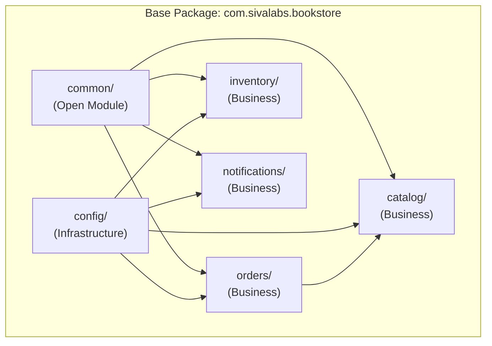

**Module Directory Structure:**

```markdown
src/main/java/com/sivalabs/bookstore/
├── common/                    # Shared utilities (open module)
│   ├── cache/                # Cache helpers, error handlers
│   ├── events/               # Event republishing configuration
│   └── session/              # Hazelcast session support
├── config/                   # Infrastructure configuration
│   ├── HazelcastConfig.java
│   ├── LiquibaseConfig.java
│   ├── GrpcServerConfig.java
│   └── OpenApiConfig.java
├── catalog/                  # Product catalogue domain
│   ├── api/                  # Exported ProductApi
│   ├── domain/               # ProductService, ProductRepository
│   ├── web/                  # ProductRestController
│   ├── cache/                # ProductMapStore
│   └── config/               # HazelcastProductCacheConfig
├── orders/                   # Order lifecycle domain
│   ├── api/                  # Exported OrdersApi, events
│   ├── domain/               # OrderService, OrderRepository
│   ├── web/                  # OrdersRestController, CartRestController
│   ├── grpc/                 # OrdersGrpcService, OrdersGrpcClient
│   ├── cache/                # OrderMapStore
│   └── config/               # HazelcastOrderCacheConfig
├── inventory/                # Inventory projections
│   ├── domain/               # InventoryService, InventoryRepository
│   ├── events/               # OrderCreatedEvent handler
│   ├── cache/                # InventoryMapStore
│   └── config/               # HazelcastInventoryCacheConfig
└── notifications/            # Notification intents
    └── events/               # Domain event listeners
```

**Sources:**

* [README.md L7-L16](https://github.com/philipz/spring-modular-monolith/blob/30c9bf30/README.md#L7-L16)
* [CLAUDE.md L116-L148](https://github.com/philipz/spring-modular-monolith/blob/30c9bf30/CLAUDE.md#L116-L148)

## Module Boundary Enforcement

Spring Modulith enforces module boundaries through the `ApplicationModules` verification API. Modules declare their allowed dependencies using `@ApplicationModule` annotations in `package-info.java` files.

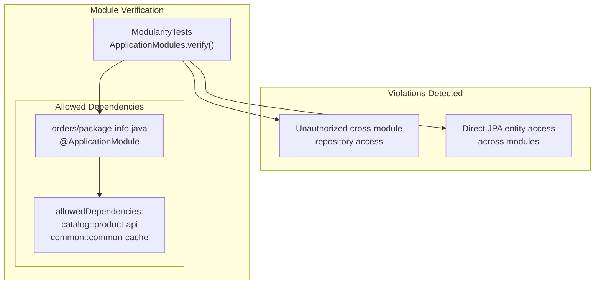

The `ModularityTests` class runs during the build to verify architectural constraints:

```
@Test
void verifiesModularStructure() {
    ApplicationModules.of(BookStoreApplication.class).verify();
}
```

**Key Rules Enforced:**

* Modules can only access explicitly exported APIs from other modules
* Repository classes are package-private and cannot be accessed across modules
* JPA entities remain internal to their owning module
* The `common` module is declared as `OPEN`, making it accessible to all modules
* Cross-module communication must occur through exported API interfaces or events

**Sources:**

* [CLAUDE.md L155-L162](https://github.com/philipz/spring-modular-monolith/blob/30c9bf30/CLAUDE.md#L155-L162)
* [CLAUDE.md L236-L256](https://github.com/philipz/spring-modular-monolith/blob/30c9bf30/CLAUDE.md#L236-L256)

## Common Module (Open Module)

The `common` module is explicitly marked as an open module, making its utilities available to all other modules without requiring explicit dependency declarations. It provides shared infrastructure that doesn't belong to any specific business domain.

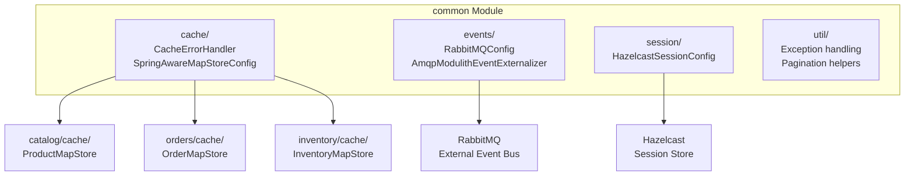

**Key Components:**

* **Cache Helpers**: `SpringAwareMapStoreConfig` provides a template for MapStore implementations with Spring bean access
* **Exception Handling**: Standardized error responses and handlers
* **Event Republishing**: `AmqpModulithEventExternalizer` republishes Spring Modulith internal events to RabbitMQ
* **Session Support**: `HazelcastSessionConfig` configures distributed session storage

**Intentional Design:**
The common module is kept deliberately small, containing only truly cross-cutting concerns. Business logic and domain concepts are not permitted here to prevent the module from becoming a dumping ground.

**Sources:**

* [README.md L9](https://github.com/philipz/spring-modular-monolith/blob/30c9bf30/README.md#L9-L9)
* [CLAUDE.md L119](https://github.com/philipz/spring-modular-monolith/blob/30c9bf30/CLAUDE.md#L119-L119)

## Config Module (Infrastructure)

The `config` module provides infrastructure bean definitions without creating reverse dependencies on business modules. It bootstraps shared infrastructure components that business modules consume through dependency injection.

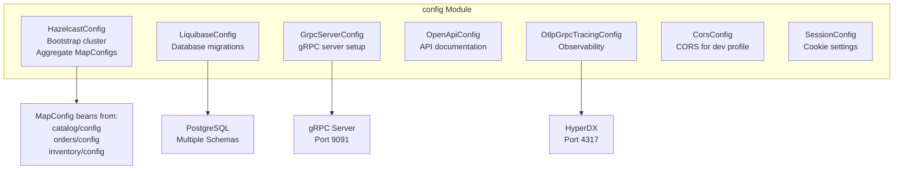

**Key Configuration Classes:**

| Class | Purpose | Key Properties |
| --- | --- | --- |
| `HazelcastConfig` | Creates `HazelcastInstance`, aggregates `MapConfig` beans from modules | `bookstore.cache.*` |
| `LiquibaseConfig` | Configures SpringLiquibase for schema migrations | `spring.liquibase.*` |
| `GrpcServerConfig` | Registers gRPC services, configures health checks | `bookstore.grpc.server.port` |
| `OpenApiConfig` | Generates OpenAPI 3.0 specification | `springdoc.*` |
| `OtlpGrpcTracingConfig` | Configures OTLP span exporter for tracing | `otlp.grpc.*` |
| `CorsConfig` | Enables CORS for local development | `cors.allowed-origins` |

**Dependency Injection Pattern:**
The config module uses `ObjectProvider<T>` to avoid hard-coded dependencies on business modules. For example, `HazelcastConfig` collects all `MapConfig` beans provided by business modules:

```python
// config/HazelcastConfig.java
@Bean
public Config hazelcastConfig(ObjectProvider<MapConfig> mapConfigs) {
    Config config = new Config();
    // Aggregate MapConfigs from all modules
    mapConfigs.orderedStream().forEach(config::addMapConfig);
    return config;
}
```

This allows business modules to contribute their cache configurations without `config` knowing about them explicitly.

**Sources:**

* [README.md L14](https://github.com/philipz/spring-modular-monolith/blob/30c9bf30/README.md#L14-L14)
* [CLAUDE.md L120](https://github.com/philipz/spring-modular-monolith/blob/30c9bf30/CLAUDE.md#L120-L120)
* [src/main/java/com/sivalabs/bookstore/config/LiquibaseConfig.java L1-L76](https://github.com/philipz/spring-modular-monolith/blob/30c9bf30/src/main/java/com/sivalabs/bookstore/config/LiquibaseConfig.java#L1-L76)
* [src/main/java/com/sivalabs/bookstore/config/OtlpGrpcTracingConfig.java L1-L64](https://github.com/philipz/spring-modular-monolith/blob/30c9bf30/src/main/java/com/sivalabs/bookstore/config/OtlpGrpcTracingConfig.java#L1-L64)

## Catalog Module

The `catalog` module manages the product catalogue domain. It exposes a public API (`ProductApi`) for other modules to query product information without accessing internal repositories or entities.

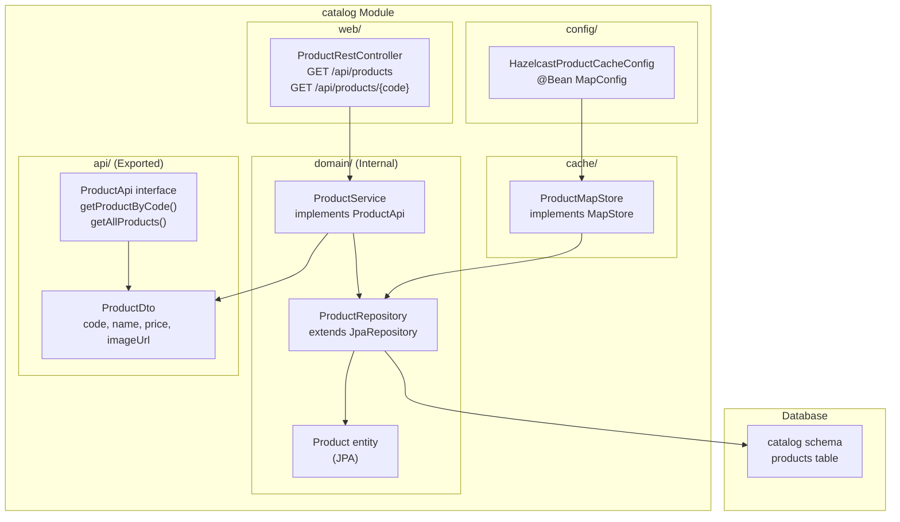

**Exported API:**

```python
// catalog/api/ProductApi.java
public interface ProductApi {
    ProductDto getProductByCode(String code);
    PagedResult<ProductDto> getAllProducts(int pageNo);
}

// catalog/domain/ProductService.java
@Service
public class ProductService implements ProductApi {
    // Implementation details hidden from other modules
}
```

**Database Schema:**

* Schema: `catalog`
* Table: `products`
* Migrations: `src/main/resources/db/migration/catalog/`
* Managed by: Liquibase

**Cache Configuration:**
The catalog module provides its own cache configuration through `HazelcastProductCacheConfig`:

* Cache name: `products-cache`
* Key type: `String` (product code)
* TTL: 3600 seconds (1 hour)
* MapStore: `ProductMapStore` for write-through caching

**Consumed By:**

* `orders` module uses `ProductApi` to validate product codes and fetch prices during order creation
* REST clients access products through `/api/products/**` endpoints
* Frontend queries products for the catalogue display

**Sources:**

* [README.md L10](https://github.com/philipz/spring-modular-monolith/blob/30c9bf30/README.md#L10-L10)
* [CLAUDE.md L120](https://github.com/philipz/spring-modular-monolith/blob/30c9bf30/CLAUDE.md#L120-L120)
* [CLAUDE.md L128](https://github.com/philipz/spring-modular-monolith/blob/30c9bf30/CLAUDE.md#L128-L128)

## Orders Module

The `orders` module manages the complete order lifecycle, from cart management to order creation. It is the most complex business module, featuring REST endpoints, gRPC services, and event publication.

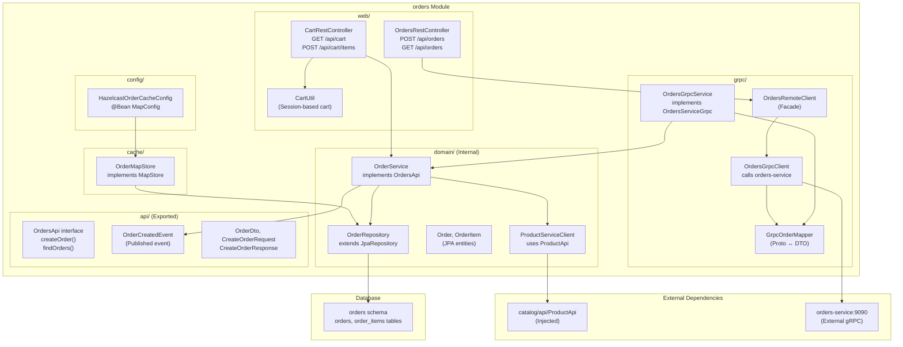

**Exported API:**

```
// orders/api/OrdersApi.java
public interface OrdersApi {
    CreateOrderResponse createOrder(CreateOrderRequest request);
    PagedResult<OrderView> findOrders(int page, int size);
    OrderDto getOrder(String orderNumber);
}

// orders/api/events/OrderCreatedEvent.java
@Externalized("orders.order-created")
public record OrderCreatedEvent(
    String orderNumber,
    OrderItemDto item,
    CustomerDto customer
) {}
```

**Allowed Dependencies:**
The orders module explicitly declares its dependencies in `package-info.java`:

```go
@ApplicationModule(allowedDependencies = {
    "catalog::product-api",
    "common::common-cache"
})
package com.sivalabs.bookstore.orders;
```

**Cart Management:**

* Session-based shopping cart using `BOOKSTORE_SESSION` cookie
* Currently supports single item per cart
* Cart state stored in Hazelcast distributed session
* `CartUtil` provides helper methods for cart manipulation

**gRPC Integration:**
The orders module supports dual-mode operation:

1. **In-process mode**: gRPC server on port 9091 exposes orders operations
2. **External mode**: gRPC client calls extracted `orders-service` on port 9090

The REST controller delegates to `OrdersRemoteClient`, which abstracts whether the call is handled locally or remotely.

**Database Schema:**

* Schema: `orders`
* Tables: `orders`, `order_items`
* Migrations: `src/main/resources/db/migration/orders/`

**Cache Configuration:**

* Cache name: `orders-cache`
* Key type: `String` (order number)
* TTL: 3600 seconds (1 hour)
* MapStore: `OrderMapStore` for write-through caching

**Event Publication:**
When an order is created, `OrderService` publishes `OrderCreatedEvent` which:

1. Is persisted to the `events` schema by Spring Modulith
2. Is consumed by `inventory` module to update stock levels
3. Is consumed by `notifications` module to log notification intents
4. Is republished to RabbitMQ by `AmqpModulithEventExternalizer`

**Sources:**

* [README.md L11](https://github.com/philipz/spring-modular-monolith/blob/30c9bf30/README.md#L11-L11)
* [CLAUDE.md L121](https://github.com/philipz/spring-modular-monolith/blob/30c9bf30/CLAUDE.md#L121-L121)
* [CLAUDE.md L129-L130](https://github.com/philipz/spring-modular-monolith/blob/30c9bf30/CLAUDE.md#L129-L130)
* [docs/orders-module-boundary-analysis.md L1-L37](https://github.com/philipz/spring-modular-monolith/blob/30c9bf30/docs/orders-module-boundary-analysis.md#L1-L37)

## Inventory Module

The `inventory` module maintains inventory projections by reacting to order events. It does not expose a public API, as it operates in a purely event-driven manner.

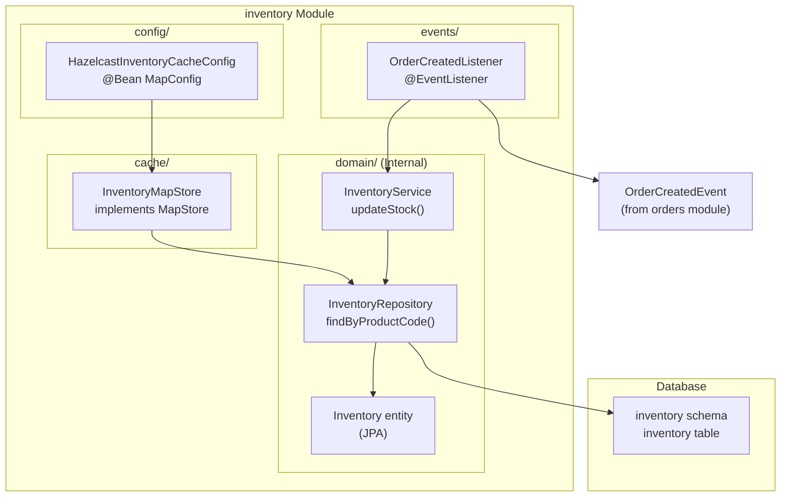

**Event Handling:**

```python
// inventory/events/OrderCreatedListener.java
@Component
public class OrderCreatedListener {
    @EventListener
    void onOrderCreated(OrderCreatedEvent event) {
        inventoryService.updateStock(
            event.item().code(),
            event.item().quantity()
        );
    }
}
```

**Database Schema:**

* Schema: `inventory`
* Table: `inventory`
* Columns: `id`, `product_code`, `quantity`
* Migrations: `src/main/resources/db/migration/inventory/`

**Cache Configuration:**

* Cache name: `inventory-cache`
* Key type: `Long` (inventory ID)
* Secondary index cache: `inventory-by-product-code-cache` (product code lookup)
* TTL: 1800 seconds (30 minutes) - shorter than products due to higher volatility
* MapStore: `InventoryMapStore` for write-through caching

**Design Rationale:**
The inventory module has no public API because:

* It reacts to events rather than serving requests
* Inventory data is not currently exposed through REST endpoints
* If needed, inventory queries could be added through a future `InventoryApi`

**Sources:**

* [README.md L12](https://github.com/philipz/spring-modular-monolith/blob/30c9bf30/README.md#L12-L12)
* [CLAUDE.md L122](https://github.com/philipz/spring-modular-monolith/blob/30c9bf30/CLAUDE.md#L122-L122)

## Notifications Module

The `notifications` module listens to domain events and records notification intents. It currently logs notification actions but is designed to support future email/SMS integration.

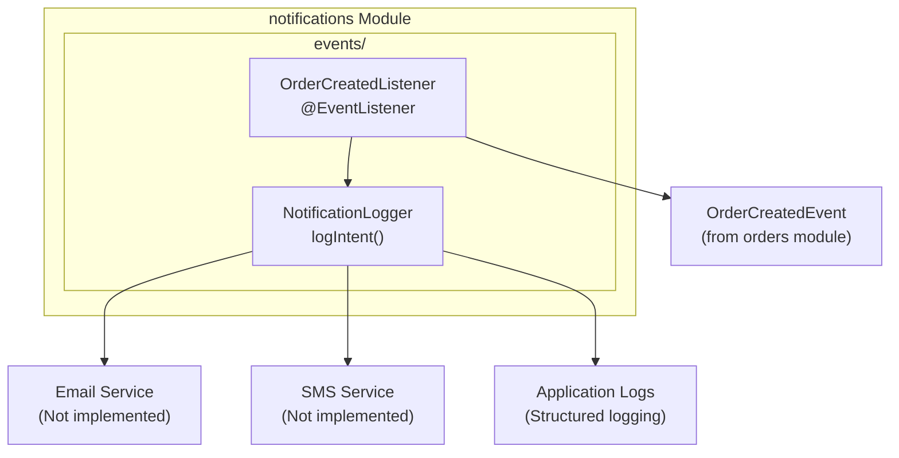

**Event Handling:**

```python
// notifications/events/OrderCreatedListener.java
@Component
public class NotificationListener {
    @EventListener
    void onOrderCreated(OrderCreatedEvent event) {
        log.info("Notification intent: Order confirmation for {}",
                 event.customer().email());
    }
}
```

**Design:**

* No database schema or cache configuration
* Purely event-driven, no public API
* Minimal dependencies (only on `common` for shared utilities)
* Ready for extension with actual notification delivery mechanisms

**Future Enhancements:**

* Integration with email service (SendGrid, AWS SES)
* SMS notifications through Twilio
* Push notifications for mobile apps
* Notification preferences per customer

**Sources:**

* [README.md L13](https://github.com/philipz/spring-modular-monolith/blob/30c9bf30/README.md#L13-L13)
* [CLAUDE.md L123](https://github.com/philipz/spring-modular-monolith/blob/30c9bf30/CLAUDE.md#L123-L123)

## Module Dependency Graph

The following diagram shows the complete dependency structure between all modules, including both direct API calls and event subscriptions:

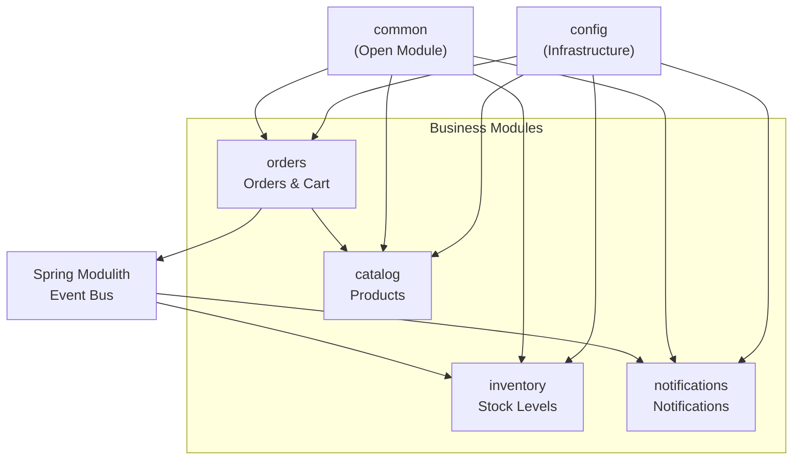

**Dependency Rules:**

1. **config** → No dependencies on business modules (uses `ObjectProvider<T>`)
2. **common** → No dependencies (provides shared utilities)
3. **catalog** → Only depends on `common`
4. **orders** → Depends on `catalog` (ProductApi) and `common`
5. **inventory** → Depends on `orders` (events only) and `common`
6. **notifications** → Depends on `orders` (events only) and `common`

**Sources:**

* [README.md L30-L35](https://github.com/philipz/spring-modular-monolith/blob/30c9bf30/README.md#L30-L35)
* [CLAUDE.md L126-L148](https://github.com/philipz/spring-modular-monolith/blob/30c9bf30/CLAUDE.md#L126-L148)

## Data and Cache Isolation Per Module

Each business module owns its database schema and cache configuration, ensuring complete data isolation. This design supports future microservice extraction without requiring data migration.

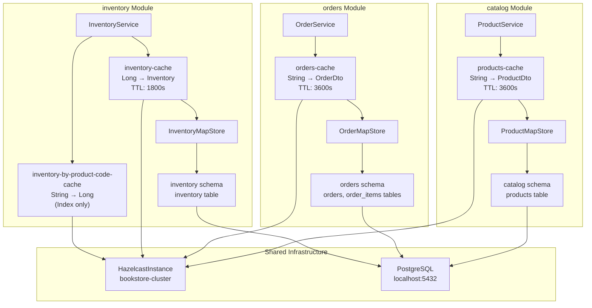

**Schema Isolation Table:**

| Module | Schema Name | Tables | Migration Path | Cache Name |
| --- | --- | --- | --- | --- |
| catalog | `catalog` | `products` | `db/migration/catalog/` | `products-cache` |
| orders | `orders` | `orders`, `order_items` | `db/migration/orders/` | `orders-cache` |
| inventory | `inventory` | `inventory` | `db/migration/inventory/` | `inventory-cache` |
| (events) | `events` | `event_publication` | Managed by Spring Modulith | N/A |

**Cache Configuration Ownership:**
Each module provides its own `MapConfig` bean:

* `catalog/config/HazelcastProductCacheConfig.java`
* `orders/config/HazelcastOrderCacheConfig.java`
* `inventory/config/HazelcastInventoryCacheConfig.java`

The `config/HazelcastConfig` aggregates these configurations without knowing their details:

```
@Bean
public Config hazelcastConfig(ObjectProvider<MapConfig> mapConfigs) {
    Config config = new Config();
    config.setClusterName("bookstore-cluster");
    mapConfigs.orderedStream().forEach(config::addMapConfig);
    return config;
}
```

**Benefits of This Isolation:**

1. **Independent scaling**: Each module's cache can be tuned separately (different TTLs, sizes)
2. **Microservice extraction**: Modules can be split into separate services with minimal data migration
3. **Clear ownership**: No ambiguity about which module is responsible for which data
4. **Testing simplicity**: Modules can be tested in isolation using `@ApplicationModuleTest`

**Sources:**

* [CLAUDE.md L146-L154](https://github.com/philipz/spring-modular-monolith/blob/30c9bf30/CLAUDE.md#L146-L154)
* [docs/orders-data-ownership-analysis.md L1-L35](https://github.com/philipz/spring-modular-monolith/blob/30c9bf30/docs/orders-data-ownership-analysis.md#L1-L35)

## Module Contribution Pattern

Business modules contribute their configurations to the shared infrastructure through Spring bean registration. The config module aggregates these contributions without direct dependencies.

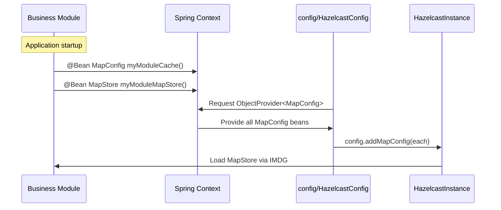

**Example: Orders Module Cache Configuration**

```python
// orders/config/HazelcastOrderCacheConfig.java
@Configuration
public class HazelcastOrderCacheConfig {
    
    @Bean
    public MapConfig ordersMapConfig(CacheProperties props) {
        return new MapConfig("orders-cache")
            .setTimeToLiveSeconds(props.getTimeToLiveSeconds())
            .setMapStoreConfig(springAwareMapStore(
                OrderMapStore.class,
                props
            ));
    }
}
```

**Key Design Points:**

1. Business modules are **autonomous** - they declare what they need
2. Config module is **passive** - it aggregates without understanding specifics
3. MapStores access Spring beans through `SpringAwareMapStoreConfig` helper (from common module)
4. No compile-time dependencies from config → business modules

**Sources:**

* [docs/orders-module-boundary-analysis.md L13-L16](https://github.com/philipz/spring-modular-monolith/blob/30c9bf30/docs/orders-module-boundary-analysis.md#L13-L16)

## Boundary Verification in CI/CD

The modular structure is continuously verified during builds to prevent architectural violations:

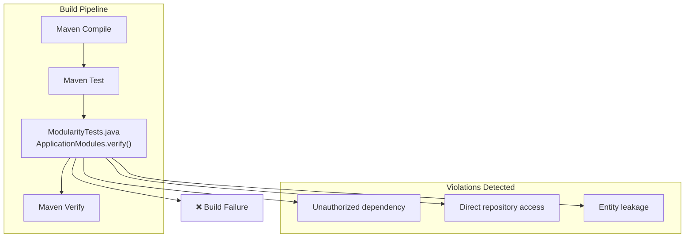

**Verification Happens:**

* During local `./mvnw clean verify`
* In CI pipeline (GitHub Actions)
* Before Docker image builds (`task build`)

**Common Violations Caught:**

1. Module accessing another module's repository directly
2. Module accessing another module's internal package
3. Module depending on a module not in `allowedDependencies`
4. Module exposing JPA entities instead of DTOs

**Generated Documentation:**
Spring Modulith also generates documentation during tests:

* Module structure diagrams
* Component diagrams per module
* Module dependency canvas

Output location: `target/spring-modulith-docs/`

**Sources:**

* [CLAUDE.md L155-L162](https://github.com/philipz/spring-modular-monolith/blob/30c9bf30/CLAUDE.md#L155-L162)
* [README.md L116](https://github.com/philipz/spring-modular-monolith/blob/30c9bf30/README.md#L116-L116)