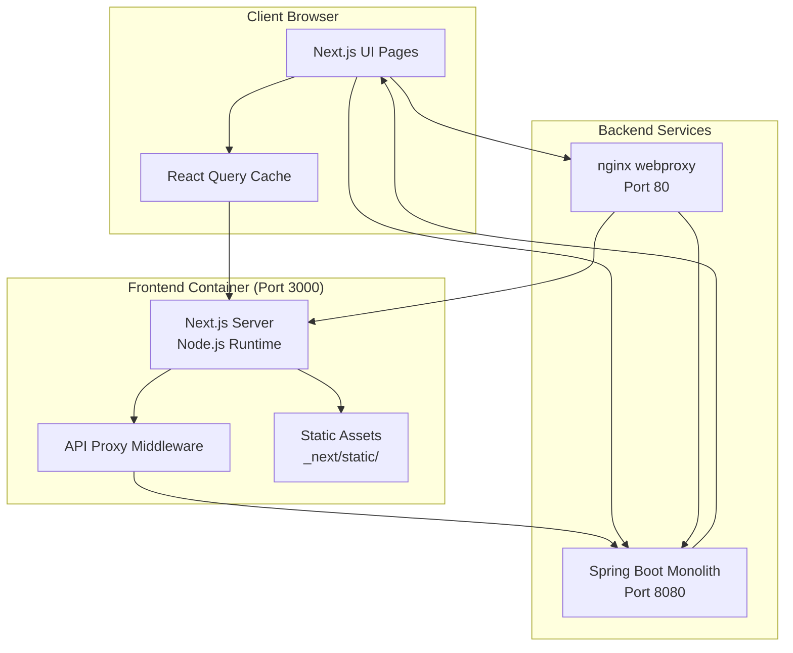
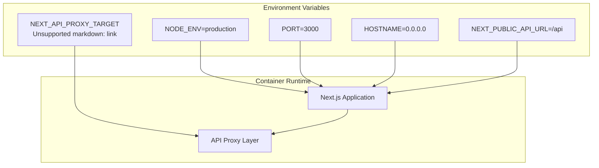
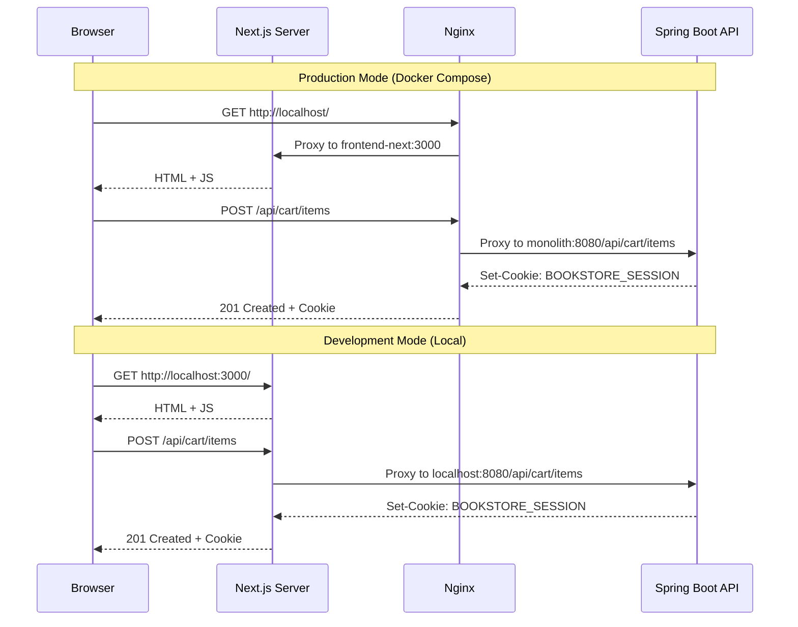
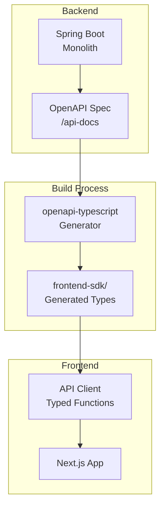
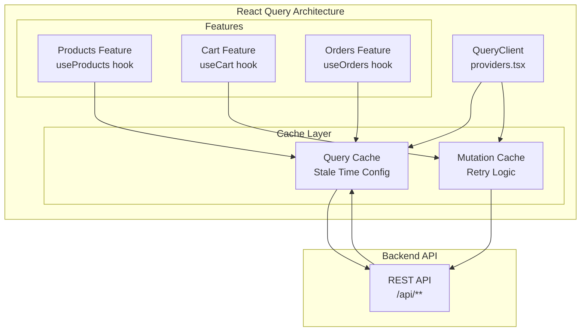
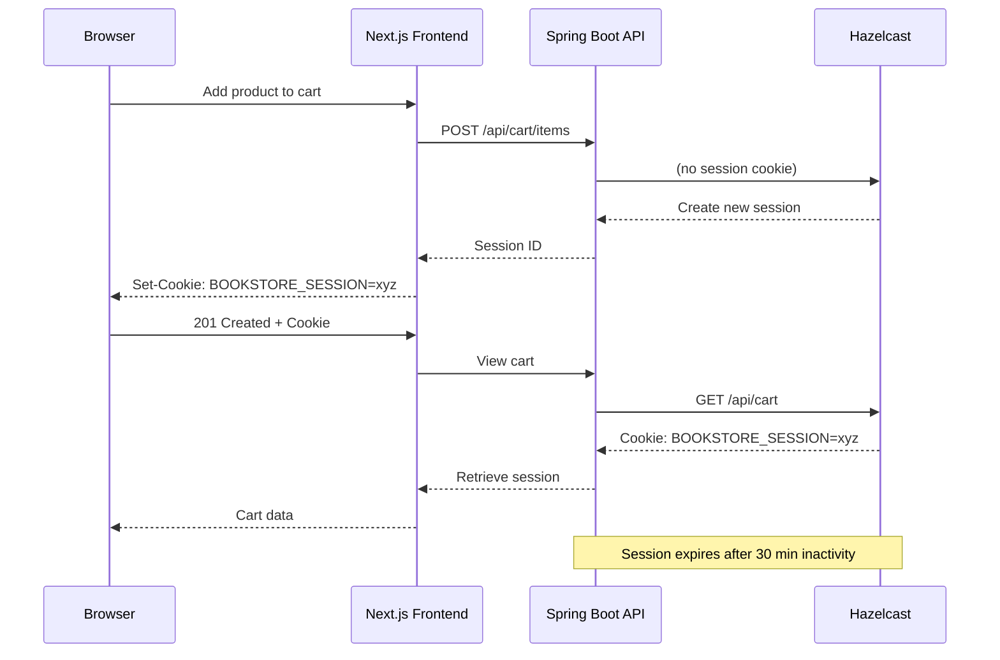

# Next.js Frontend Architecture

> **Relevant source files**
> * [README-API.md](https://github.com/philipz/spring-modular-monolith/blob/30c9bf30/README-API.md)
> * [README.md](https://github.com/philipz/spring-modular-monolith/blob/30c9bf30/README.md)
> * [compose.yml](https://github.com/philipz/spring-modular-monolith/blob/30c9bf30/compose.yml)
> * [docs/API_ANALYSIS_SUMMARY.txt](https://github.com/philipz/spring-modular-monolith/blob/30c9bf30/docs/API_ANALYSIS_SUMMARY.txt)
> * [docs/REST_API_ANALYSIS.md](https://github.com/philipz/spring-modular-monolith/blob/30c9bf30/docs/REST_API_ANALYSIS.md)
> * [docs/bookstore-microservices.png](https://github.com/philipz/spring-modular-monolith/blob/30c9bf30/docs/bookstore-microservices.png)
> * [docs/improvement.md](https://github.com/philipz/spring-modular-monolith/blob/30c9bf30/docs/improvement.md)
> * [docs/orders-data-ownership-analysis.md](https://github.com/philipz/spring-modular-monolith/blob/30c9bf30/docs/orders-data-ownership-analysis.md)
> * [docs/orders-module-boundary-analysis.md](https://github.com/philipz/spring-modular-monolith/blob/30c9bf30/docs/orders-module-boundary-analysis.md)
> * [docs/orders-traffic-migration.md](https://github.com/philipz/spring-modular-monolith/blob/30c9bf30/docs/orders-traffic-migration.md)
> * [k6.js](https://github.com/philipz/spring-modular-monolith/blob/30c9bf30/k6.js)
> * [pom.xml](https://github.com/philipz/spring-modular-monolith/blob/30c9bf30/pom.xml)
> * [src/main/resources/application.properties](https://github.com/philipz/spring-modular-monolith/blob/30c9bf30/src/main/resources/application.properties)
> * [src/test/java/com/sivalabs/bookstore/BookStoreApplicationTests.java](https://github.com/philipz/spring-modular-monolith/blob/30c9bf30/src/test/java/com/sivalabs/bookstore/BookStoreApplicationTests.java)
> * [src/test/java/com/sivalabs/bookstore/TestcontainersConfiguration.java](https://github.com/philipz/spring-modular-monolith/blob/30c9bf30/src/test/java/com/sivalabs/bookstore/TestcontainersConfiguration.java)

## Purpose and Scope

This document describes the Next.js 14 frontend application that serves as the user-facing storefront for the Spring Modular Monolith bookstore system. It covers the frontend architecture, API integration patterns, TypeScript SDK generation, session management, and deployment configuration.

For backend REST API specifications, see [REST API Endpoints](/philipz/spring-modular-monolith/7.1-rest-api-endpoints). For TypeScript SDK generation details, see [TypeScript SDK Generation](/philipz/spring-modular-monolith/14.2-typescript-sdk-generation). For nginx proxy configuration that routes traffic to the frontend, see [Nginx Reverse Proxy](/philipz/spring-modular-monolith/10.3-nginx-reverse-proxy).

---

## Architecture Overview

The `frontend-next` application is a Next.js 14 App Router-based single-page application that consumes the Spring Boot backend's REST APIs under `/api/**`. In production (Docker Compose), nginx serves as a unified entry point, routing UI requests to Next.js and API requests to the monolith, eliminating CORS complexity.

### High-Level Frontend Integration



**Sources:**

* [compose.yml L140-L158](https://github.com/philipz/spring-modular-monolith/blob/30c9bf30/compose.yml#L140-L158)
* [README.md L18-L23](https://github.com/philipz/spring-modular-monolith/blob/30c9bf30/README.md#L18-L23)

---

## Deployment Configuration

The `frontend-next` service is defined in Docker Compose with specific environment variables that control its API integration behavior.

### Docker Compose Service Definition



**Configuration Details:**

| Variable | Value | Purpose |
| --- | --- | --- |
| `NODE_ENV` | `production` | Enables production optimizations |
| `PORT` | `3000` | Next.js server port |
| `HOSTNAME` | `0.0.0.0` | Bind to all network interfaces |
| `NEXT_PUBLIC_API_URL` | `/api` | Client-side API base URL (relative path) |
| `NEXT_API_PROXY_TARGET` | `http://monolith:8080` | Server-side proxy target for API requests |

**Sources:**

* [compose.yml L140-L158](https://github.com/philipz/spring-modular-monolith/blob/30c9bf30/compose.yml#L140-L158)

---

## API Integration Architecture

The frontend communicates with the backend through a dual-mode API integration pattern that adapts to development and production environments.

### Request Flow Patterns



**Sources:**

* [compose.yml L140-L158](https://github.com/philipz/spring-modular-monolith/blob/30c9bf30/compose.yml#L140-L158)
* [README.md L102-L109](https://github.com/philipz/spring-modular-monolith/blob/30c9bf30/README.md#L102-L109)
* [docs/API_ANALYSIS_SUMMARY.txt L86-L98](https://github.com/philipz/spring-modular-monolith/blob/30c9bf30/docs/API_ANALYSIS_SUMMARY.txt#L86-L98)

### API Client Configuration

The frontend uses `fetch` with `credentials: 'include'` to ensure the `BOOKSTORE_SESSION` cookie is sent with every request. This pattern is essential for cart and order operations that rely on server-side session state.

**Key Integration Points:**

1. **Base URL Configuration**: `NEXT_PUBLIC_API_URL` is set to `/api` in production, making all API calls relative to the nginx proxy origin
2. **Proxy Middleware**: In development mode, Next.js proxies `/api/**` requests to `NEXT_API_PROXY_TARGET` (default: `http://localhost:8080`)
3. **Cookie Handling**: The `BOOKSTORE_SESSION` cookie is HttpOnly, SameSite=Strict, with 30-minute TTL
4. **CORS**: Production deployment shares origin through nginx; development requires backend `dev` profile to allow `http://localhost:3000`

**Sources:**

* [compose.yml L148-L149](https://github.com/philipz/spring-modular-monolith/blob/30c9bf30/compose.yml#L148-L149)
* [README.md L22-L23](https://github.com/philipz/spring-modular-monolith/blob/30c9bf30/README.md#L22-L23)
* [src/main/resources/application.properties L89-L99](https://github.com/philipz/spring-modular-monolith/blob/30c9bf30/src/main/resources/application.properties#L89-L99)

---

## TypeScript SDK Integration

The frontend consumes a generated TypeScript SDK located in `frontend-sdk/` that provides type-safe API client functions derived from the backend's OpenAPI specification.

### SDK Generation Workflow



**Generation Command:**

The TypeScript SDK is regenerated from the OpenAPI spec using:

```markdown
cd frontend-next
pnpm gen:types  # Uses openapi.json to generate types
```

**Sources:**

* [README.md L20](https://github.com/philipz/spring-modular-monolith/blob/30c9bf30/README.md#L20-L20)
* [docs/API_ANALYSIS_SUMMARY.txt L163-L169](https://github.com/philipz/spring-modular-monolith/blob/30c9bf30/docs/API_ANALYSIS_SUMMARY.txt#L163-L169)

### Generated SDK Structure

The generated SDK provides type-safe interfaces for all backend endpoints:

| API Group | Generated Types | Purpose |
| --- | --- | --- |
| Products | `ProductDto`, `PagedResult<ProductDto>` | Product catalog queries |
| Cart | `CartDto`, `CartItemDto`, `AddToCartRequest` | Cart operations |
| Orders | `CreateOrderRequest`, `OrderDto`, `OrderSummary` | Order creation and retrieval |

**Sources:**

* [docs/API_ANALYSIS_SUMMARY.txt L70-L78](https://github.com/philipz/spring-modular-monolith/blob/30c9bf30/docs/API_ANALYSIS_SUMMARY.txt#L70-L78)
* [README-API.md L26-L80](https://github.com/philipz/spring-modular-monolith/blob/30c9bf30/README-API.md#L26-L80)

---

## State Management with React Query

The frontend uses React Query (TanStack Query) for managing server state, providing caching, automatic refetching, and optimistic updates.

### React Query Integration Points



**Configuration Defaults:**

React Query is configured in the application providers with retry logic and stale time settings suitable for e-commerce operations. The configuration ensures:

* Automatic retries for failed requests
* Configurable stale times for product catalog data (longer) vs cart/order data (shorter)
* Optimistic updates for cart operations
* Session cookie (`BOOKSTORE_SESSION`) included in all requests via `credentials: 'include'`

**Sources:**

* [docs/API_ANALYSIS_SUMMARY.txt L92-L93](https://github.com/philipz/spring-modular-monolith/blob/30c9bf30/docs/API_ANALYSIS_SUMMARY.txt#L92-L93)
* [README.md L20](https://github.com/philipz/spring-modular-monolith/blob/30c9bf30/README.md#L20-L20)

---

## Session Management

The frontend relies on the `BOOKSTORE_SESSION` cookie for maintaining shopping cart state and user context across requests. This cookie is managed entirely by the backend and stored in Hazelcast.

### Session Cookie Properties

| Property | Value | Purpose |
| --- | --- | --- |
| Name | `BOOKSTORE_SESSION` | Session identifier |
| HttpOnly | `true` | Prevents JavaScript access (security) |
| SameSite | `Strict` | Prevents CSRF attacks |
| Secure | `false` (dev), `true` (prod) | Requires HTTPS in production |
| Max-Age | `1800s` (30 minutes) | Session timeout |

### Session Flow



**Sources:**

* [src/main/resources/application.properties L89-L99](https://github.com/philipz/spring-modular-monolith/blob/30c9bf30/src/main/resources/application.properties#L89-L99)
* [README.md L22](https://github.com/philipz/spring-modular-monolith/blob/30c9bf30/README.md#L22-L22)
* [docs/API_ANALYSIS_SUMMARY.txt L35-L40](https://github.com/philipz/spring-modular-monolith/blob/30c9bf30/docs/API_ANALYSIS_SUMMARY.txt#L35-L40)

---

## Development vs Production Modes

The frontend operates differently depending on the deployment environment, primarily affecting how API requests are routed.

### Environment-Specific Behavior

| Aspect | Development (`pnpm dev`) | Production (Docker Compose) |
| --- | --- | --- |
| Frontend URL | `http://localhost:3000` | `http://localhost` (via nginx) |
| API Base URL | `/api` (proxied to `localhost:8080`) | `/api` (routed by nginx) |
| CORS | Requires backend `dev` profile | Not needed (same origin) |
| Backend Target | `NEXT_API_PROXY_TARGET` or direct | nginx routes to `monolith:8080` |
| Hot Reload | Enabled | Disabled |
| Build | Development build | Optimized production build |

### Development Setup

For local frontend development:

```markdown
cd frontend-next
pnpm install
pnpm dev   # Serves on http://localhost:3000
```

**Backend Configuration for Development:**

Enable CORS in the Spring Boot application:

```javascript
export SPRING_PROFILES_ACTIVE=dev
./mvnw spring-boot:run
```

The `dev` profile activates `CorsConfig`, allowing `http://localhost:3000` to access the API.

**Sources:**

* [README.md L101-L109](https://github.com/philipz/spring-modular-monolith/blob/30c9bf30/README.md#L101-L109)
* [docs/API_ANALYSIS_SUMMARY.txt L84-L98](https://github.com/philipz/spring-modular-monolith/blob/30c9bf30/docs/API_ANALYSIS_SUMMARY.txt#L84-L98)

---

## Healthcheck Configuration

The Docker Compose configuration includes a healthcheck for the frontend service to ensure it's ready to serve traffic.

**Healthcheck Command:**

```javascript
node -e "require('http').get('http://localhost:3000/', (r) => process.exit(r.statusCode === 200 ? 0 : 1))"
```

**Healthcheck Settings:**

* Interval: 10 seconds
* Timeout: 5 seconds
* Retries: 5

This healthcheck validates that the Next.js server is responding to HTTP requests before marking the service as healthy.

**Sources:**

* [compose.yml L154-L158](https://github.com/philipz/spring-modular-monolith/blob/30c9bf30/compose.yml#L154-L158)

---

## Directory Structure (Inferred)

Based on the README and documentation references, the frontend directory structure follows Next.js 14 App Router conventions:

```markdown
frontend-next/
├── apps/
│   └── web/
│       ├── app/                 # Next.js App Router pages
│       ├── features/            # Feature modules (products, cart, orders)
│       ├── lib/
│       │   ├── api/
│       │   │   └── client.ts   # API client configuration
│       │   └── http.ts         # HTTP utilities
│       ├── providers.tsx        # React Query provider
│       └── next.config.js       # Next.js configuration
├── frontend-sdk/                # Generated TypeScript SDK
├── package.json
└── Dockerfile
```

**Key Directories:**

* `app/`: Next.js 14 App Router pages and layouts
* `features/`: Business feature modules (products, cart, orders)
* `lib/api/`: API client configuration and utilities
* `frontend-sdk/`: Auto-generated TypeScript types from OpenAPI spec

**Sources:**

* [README.md L20-L132](https://github.com/philipz/spring-modular-monolith/blob/30c9bf30/README.md#L20-L132)
* [docs/API_ANALYSIS_SUMMARY.txt L143-L148](https://github.com/philipz/spring-modular-monolith/blob/30c9bf30/docs/API_ANALYSIS_SUMMARY.txt#L143-L148)

---

## Build and Deployment

### Docker Build Process

The `frontend-next` service is built using a multi-stage Dockerfile that:

1. Installs dependencies with `pnpm`
2. Generates TypeScript SDK from OpenAPI spec
3. Builds the Next.js production bundle
4. Creates a minimal runtime image

**Docker Compose Build:**

```yaml
frontend-next:
  build:
    context: ./frontend-next
    dockerfile: Dockerfile
  environment:
    NODE_ENV: production
    PORT: 3000
    HOSTNAME: 0.0.0.0
    NEXT_PUBLIC_API_URL: /api
    NEXT_API_PROXY_TARGET: http://monolith:8080
```

**Sources:**

* [compose.yml L140-L158](https://github.com/philipz/spring-modular-monolith/blob/30c9bf30/compose.yml#L140-L158)

### Taskfile Automation

The project provides task automation for frontend operations:

```markdown
# Start entire stack including frontend
task start

# Restart frontend after code changes
task restart

# Stop all services
task stop
```

**Sources:**

* [README.md L65-L74](https://github.com/philipz/spring-modular-monolith/blob/30c9bf30/README.md#L65-L74)

---

## Integration Checklist

When integrating with or extending the frontend:

1. **API Requests**: Always include `credentials: 'include'` in fetch options
2. **Session Cookie**: Ensure `BOOKSTORE_SESSION` cookie is preserved across requests
3. **CORS**: Enable backend `dev` profile when running frontend on `localhost:3000`
4. **TypeScript SDK**: Regenerate SDK after OpenAPI spec changes: `pnpm gen:types`
5. **Environment Variables**: Set `NEXT_PUBLIC_API_URL` for client-side and `NEXT_API_PROXY_TARGET` for server-side proxy
6. **Error Handling**: Handle `401`, `404`, and `503` status codes with appropriate UI feedback
7. **React Query**: Use appropriate stale times for different data types (products vs cart/orders)

**Sources:**

* [docs/API_ANALYSIS_SUMMARY.txt L86-L246](https://github.com/philipz/spring-modular-monolith/blob/30c9bf30/docs/API_ANALYSIS_SUMMARY.txt#L86-L246)
* [README.md L109](https://github.com/philipz/spring-modular-monolith/blob/30c9bf30/README.md#L109-L109)

---

## Related Documentation

* For backend REST API specifications: [REST API Endpoints](/philipz/spring-modular-monolith/7.1-rest-api-endpoints)
* For OpenAPI spec details: [OpenAPI Configuration](/philipz/spring-modular-monolith/15.1-application-properties)
* For nginx routing configuration: [Nginx Reverse Proxy](/philipz/spring-modular-monolith/10.3-nginx-reverse-proxy)
* For TypeScript SDK generation process: [TypeScript SDK Generation](/philipz/spring-modular-monolith/14.2-typescript-sdk-generation)
* For session management details: [Session Management with Hazelcast](/philipz/spring-modular-monolith/5.3-session-management-with-hazelcast)
* For CORS configuration: [Config Module](/philipz/spring-modular-monolith/8.5-config-module)