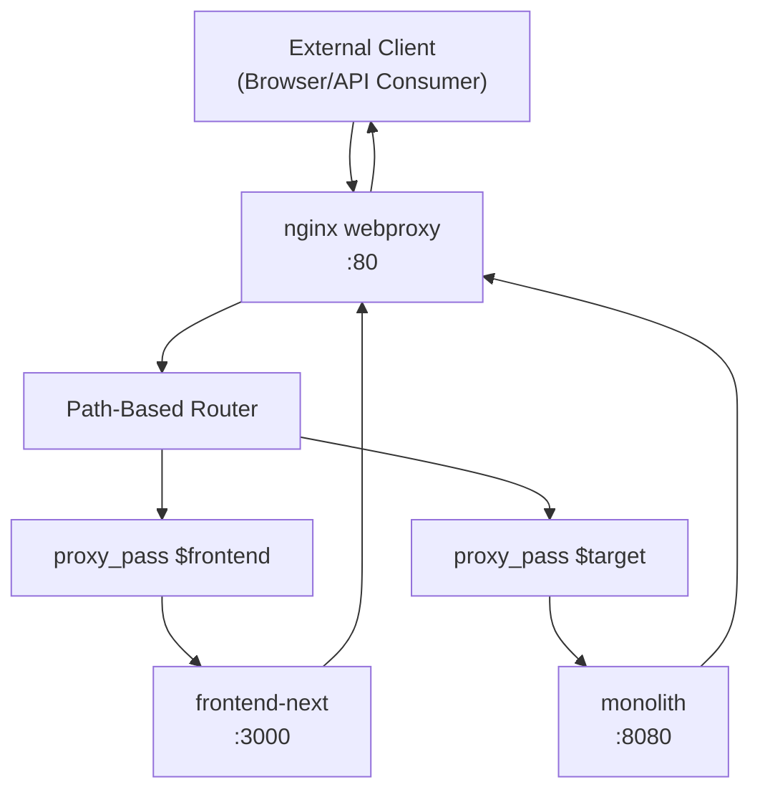
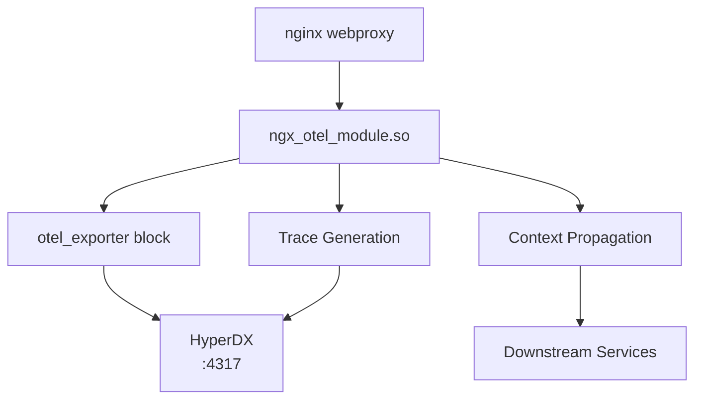
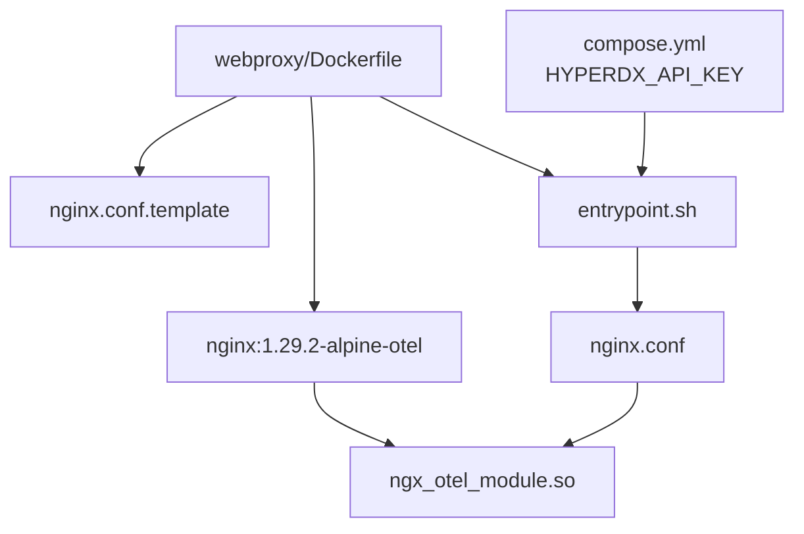
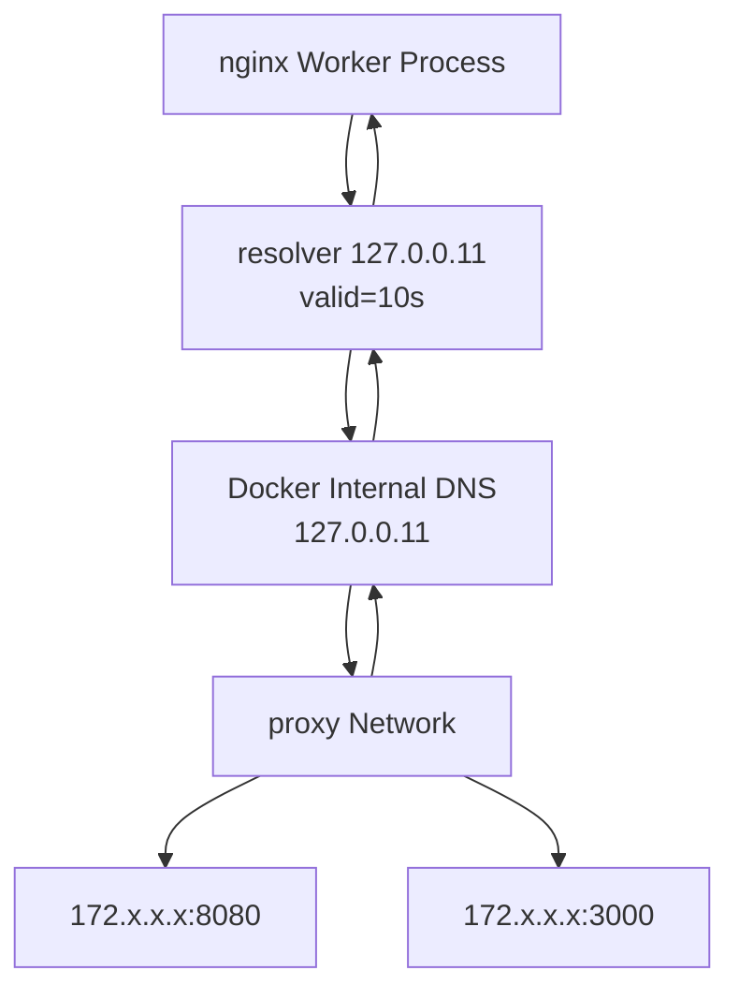
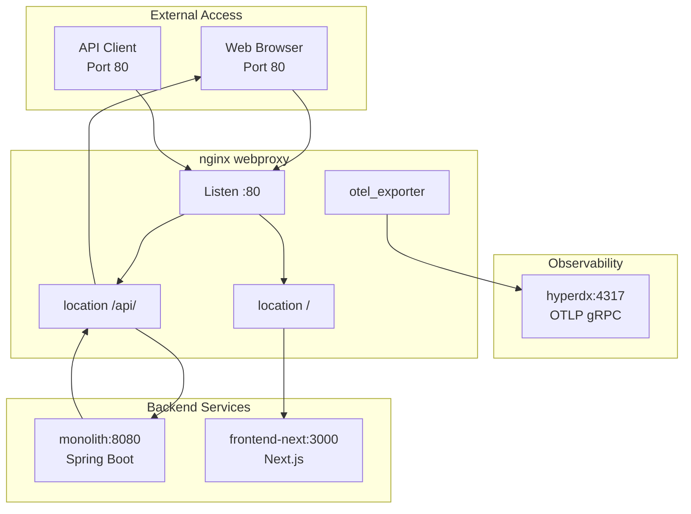

# Nginx Reverse Proxy

> **Relevant source files**
> * [.env.example](https://github.com/philipz/spring-modular-monolith/blob/30c9bf30/.env.example)
> * [compose.yml](https://github.com/philipz/spring-modular-monolith/blob/30c9bf30/compose.yml)
> * [pom.xml](https://github.com/philipz/spring-modular-monolith/blob/30c9bf30/pom.xml)
> * [src/main/resources/application.properties](https://github.com/philipz/spring-modular-monolith/blob/30c9bf30/src/main/resources/application.properties)
> * [src/test/java/com/sivalabs/bookstore/BookStoreApplicationTests.java](https://github.com/philipz/spring-modular-monolith/blob/30c9bf30/src/test/java/com/sivalabs/bookstore/BookStoreApplicationTests.java)
> * [src/test/java/com/sivalabs/bookstore/TestcontainersConfiguration.java](https://github.com/philipz/spring-modular-monolith/blob/30c9bf30/src/test/java/com/sivalabs/bookstore/TestcontainersConfiguration.java)
> * [webproxy/Dockerfile](https://github.com/philipz/spring-modular-monolith/blob/30c9bf30/webproxy/Dockerfile)
> * [webproxy/entrypoint.sh](https://github.com/philipz/spring-modular-monolith/blob/30c9bf30/webproxy/entrypoint.sh)
> * [webproxy/nginx.conf](https://github.com/philipz/spring-modular-monolith/blob/30c9bf30/webproxy/nginx.conf)

## Purpose and Scope

This document details the nginx webproxy configuration that serves as the unified entry point for the Spring Modular Monolith system. The nginx reverse proxy provides path-based routing, OpenTelemetry integration for distributed tracing, and proper request forwarding between external clients and internal services.

For broader deployment configuration including all services, see [Docker Compose Deployment](/philipz/spring-modular-monolith/10.1-docker-compose-deployment). For progressive traffic migration strategies specific to the orders service, see [Traffic Migration Strategy](/philipz/spring-modular-monolith/10.4-traffic-migration-strategy).

---

## Overview

The `webproxy` service runs nginx as a reverse proxy on port 80, routing all external HTTP traffic to the appropriate backend services. It eliminates CORS issues by presenting a single origin to clients and provides a unified observability layer through OpenTelemetry instrumentation.

**Key Responsibilities:**

* Route `/` requests to the Next.js frontend (`frontend-next:3000`)
* Route `/api/` requests to the Spring Boot monolith (`monolith:8080`)
* Export distributed traces to HyperDX via OpenTelemetry
* Forward proxy headers for client IP, protocol, and host information
* Support WebSocket connections for both frontend HMR and API streaming

**Sources:** [webproxy/nginx.conf L1-L96](https://github.com/philipz/spring-modular-monolith/blob/30c9bf30/webproxy/nginx.conf#L1-L96)

 [compose.yml L160-L173](https://github.com/philipz/spring-modular-monolith/blob/30c9bf30/compose.yml#L160-L173)

---

## Request Routing Architecture



The nginx configuration uses two primary location blocks:

* **Location `/`**: Proxies to `http://frontend-next:3000` for UI rendering
* **Location `/api/`**: Proxies to `http://monolith:8080` for REST API requests

Dynamic DNS resolution via `resolver 127.0.0.11` (Docker's internal DNS) ensures service discovery without hardcoded IP addresses.

**Sources:** [webproxy/nginx.conf L33-L94](https://github.com/philipz/spring-modular-monolith/blob/30c9bf30/webproxy/nginx.conf#L33-L94)

 [compose.yml L160-L173](https://github.com/philipz/spring-modular-monolith/blob/30c9bf30/compose.yml#L160-L173)

---

## Configuration Structure

The nginx configuration is organized into several key sections:

| Section | Lines | Purpose |
| --- | --- | --- |
| Module Loading | [webproxy/nginx.conf L1](https://github.com/philipz/spring-modular-monolith/blob/30c9bf30/webproxy/nginx.conf#L1-L1) | Loads `ngx_otel_module.so` for OpenTelemetry |
| Worker Configuration | [webproxy/nginx.conf L3-L11](https://github.com/philipz/spring-modular-monolith/blob/30c9bf30/webproxy/nginx.conf#L3-L11) | Sets worker processes and event handling |
| HTTP Block | [webproxy/nginx.conf L13-L95](https://github.com/philipz/spring-modular-monolith/blob/30c9bf30/webproxy/nginx.conf#L13-L95) | Main HTTP server configuration |
| OpenTelemetry Config | [webproxy/nginx.conf L23-L29](https://github.com/philipz/spring-modular-monolith/blob/30c9bf30/webproxy/nginx.conf#L23-L29) | Configures OTLP exporter and trace propagation |
| Server Block | [webproxy/nginx.conf L33-L94](https://github.com/philipz/spring-modular-monolith/blob/30c9bf30/webproxy/nginx.conf#L33-L94) | Defines port 80 listener and location blocks |
| API Location | [webproxy/nginx.conf L40-L67](https://github.com/philipz/spring-modular-monolith/blob/30c9bf30/webproxy/nginx.conf#L40-L67) | Reverse proxy for `/api/` to monolith |
| Frontend Location | [webproxy/nginx.conf L70-L93](https://github.com/philipz/spring-modular-monolith/blob/30c9bf30/webproxy/nginx.conf#L70-L93) | Reverse proxy for `/` to frontend-next |

**Sources:** [webproxy/nginx.conf L1-L96](https://github.com/philipz/spring-modular-monolith/blob/30c9bf30/webproxy/nginx.conf#L1-L96)

---

## OpenTelemetry Integration



The nginx proxy includes OpenTelemetry instrumentation using the native `ngx_otel_module.so`:

**Configuration:**

```
otel_exporter {
    endpoint hyperdx:4317;
    header authorization ${HYPERDX_API_KEY};
}
otel_service_name nginx-webproxy;
otel_trace on;
otel_trace_context propagate;
```

* **Module**: `ngx_otel_module.so` loaded at [webproxy/nginx.conf L1](https://github.com/philipz/spring-modular-monolith/blob/30c9bf30/webproxy/nginx.conf#L1-L1)
* **Exporter**: Configured at [webproxy/nginx.conf L23-L26](https://github.com/philipz/spring-modular-monolith/blob/30c9bf30/webproxy/nginx.conf#L23-L26)  to send traces to HyperDX on port 4317 (OTLP gRPC)
* **Service Name**: `nginx-webproxy` identifies the service in traces [webproxy/nginx.conf L27](https://github.com/philipz/spring-modular-monolith/blob/30c9bf30/webproxy/nginx.conf#L27-L27)
* **Trace Propagation**: `otel_trace_context propagate` forwards trace context headers (traceparent, tracestate) to downstream services [webproxy/nginx.conf L29](https://github.com/philipz/spring-modular-monolith/blob/30c9bf30/webproxy/nginx.conf#L29-L29)

This ensures end-to-end distributed tracing from the client through nginx to backend services.

**Sources:** [webproxy/nginx.conf L1](https://github.com/philipz/spring-modular-monolith/blob/30c9bf30/webproxy/nginx.conf#L1-L1)

 [webproxy/nginx.conf L23-L29](https://github.com/philipz/spring-modular-monolith/blob/30c9bf30/webproxy/nginx.conf#L23-L29)

 [compose.yml L162](https://github.com/philipz/spring-modular-monolith/blob/30c9bf30/compose.yml#L162-L162)

---

## Container Build and Configuration



### Dockerfile Structure

The webproxy uses a multi-stage approach to handle environment variable substitution:

1. **Base Image**: `nginx:1.29.2-alpine-otel` includes the OpenTelemetry module pre-compiled [webproxy/Dockerfile L2](https://github.com/philipz/spring-modular-monolith/blob/30c9bf30/webproxy/Dockerfile#L2-L2)
2. **Template Copying**: `nginx.conf` is copied as `/tmp/nginx.conf.template` [webproxy/Dockerfile L8](https://github.com/philipz/spring-modular-monolith/blob/30c9bf30/webproxy/Dockerfile#L8-L8)
3. **Entrypoint Script**: `entrypoint.sh` performs environment variable substitution [webproxy/Dockerfile L11-L12](https://github.com/philipz/spring-modular-monolith/blob/30c9bf30/webproxy/Dockerfile#L11-L12)
4. **Port Exposure**: Port 80 for HTTP traffic [webproxy/Dockerfile L15](https://github.com/philipz/spring-modular-monolith/blob/30c9bf30/webproxy/Dockerfile#L15-L15)

### Environment Variable Substitution

The entrypoint script [webproxy/entrypoint.sh L1-L20](https://github.com/philipz/spring-modular-monolith/blob/30c9bf30/webproxy/entrypoint.sh#L1-L20)

 performs controlled substitution:

```php
# Validate required environment variable
if [ -z "${HYPERDX_API_KEY}" ]; then
  echo "ERROR: HYPERDX_API_KEY environment variable is not set"
  exit 1
fi

# Use sed to replace only HYPERDX_API_KEY, preserving all nginx variables
sed "s|\${HYPERDX_API_KEY}|${HYPERDX_API_KEY}|g" /tmp/nginx.conf.template > /etc/nginx/nginx.conf
```

**Key Design Decision**: The script uses `sed` with explicit variable substitution rather than `envsubst` to avoid accidentally replacing nginx variables like `$http_host`, `$remote_addr`, etc. Only `${HYPERDX_API_KEY}` is substituted.

**Sources:** [webproxy/Dockerfile L1-L22](https://github.com/philipz/spring-modular-monolith/blob/30c9bf30/webproxy/Dockerfile#L1-L22)

 [webproxy/entrypoint.sh L1-L20](https://github.com/philipz/spring-modular-monolith/blob/30c9bf30/webproxy/entrypoint.sh#L1-L20)

 [compose.yml L160-L173](https://github.com/philipz/spring-modular-monolith/blob/30c9bf30/compose.yml#L160-L173)

---

## API Proxy Configuration

The `/api/` location block forwards requests to the Spring Boot monolith:

```css
location /api/ {
    resolver 127.0.0.11 valid=10s;
    set $target http://monolith:8080;
    proxy_pass $target;
    
    # Timeout settings
    proxy_read_timeout 60;
    proxy_connect_timeout 60;
    proxy_send_timeout 60;
    
    # Proxy headers
    proxy_set_header Host $http_host;
    proxy_set_header X-Real-IP $remote_addr;
    proxy_set_header X-Forwarded-For $proxy_add_x_forwarded_for;
    proxy_set_header X-Forwarded-Proto $scheme;
    proxy_set_header X-Forwarded-Host $http_host;
    
    # Session cookie forwarding
    proxy_pass_header Set-Cookie;
    proxy_cookie_path / /;
}
```

### Key Configuration Details

| Setting | Value | Purpose |
| --- | --- | --- |
| `resolver 127.0.0.11 valid=10s` | [webproxy/nginx.conf L41](https://github.com/philipz/spring-modular-monolith/blob/30c9bf30/webproxy/nginx.conf#L41-L41) | Docker internal DNS with 10s cache |
| `set $target http://monolith:8080` | [webproxy/nginx.conf L42](https://github.com/philipz/spring-modular-monolith/blob/30c9bf30/webproxy/nginx.conf#L42-L42) | Dynamic upstream resolution |
| `client_max_body_size 64M` | [webproxy/nginx.conf L37](https://github.com/philipz/spring-modular-monolith/blob/30c9bf30/webproxy/nginx.conf#L37-L37) | Allow large request payloads |
| `proxy_read_timeout 60` | [webproxy/nginx.conf L46](https://github.com/philipz/spring-modular-monolith/blob/30c9bf30/webproxy/nginx.conf#L46-L46) | 60s timeout for backend response |
| `proxy_pass_header Set-Cookie` | [webproxy/nginx.conf L59](https://github.com/philipz/spring-modular-monolith/blob/30c9bf30/webproxy/nginx.conf#L59-L59) | Forward session cookies |
| `proxy_http_version 1.1` | [webproxy/nginx.conf L63](https://github.com/philipz/spring-modular-monolith/blob/30c9bf30/webproxy/nginx.conf#L63-L63) | HTTP/1.1 for WebSocket support |

### Proxy Headers

The following headers are forwarded to preserve client information:

* **`Host: $http_host`**: Original Host header [webproxy/nginx.conf L51](https://github.com/philipz/spring-modular-monolith/blob/30c9bf30/webproxy/nginx.conf#L51-L51)
* **`X-Real-IP: $remote_addr`**: Client IP address [webproxy/nginx.conf L52](https://github.com/philipz/spring-modular-monolith/blob/30c9bf30/webproxy/nginx.conf#L52-L52)
* **`X-Forwarded-For: $proxy_add_x_forwarded_for`**: Appends to existing forwarding chain [webproxy/nginx.conf L53](https://github.com/philipz/spring-modular-monolith/blob/30c9bf30/webproxy/nginx.conf#L53-L53)
* **`X-Forwarded-Proto: $scheme`**: Original protocol (http/https) [webproxy/nginx.conf L54](https://github.com/philipz/spring-modular-monolith/blob/30c9bf30/webproxy/nginx.conf#L54-L54)
* **`X-Forwarded-Host: $http_host`**: Original host header [webproxy/nginx.conf L55](https://github.com/philipz/spring-modular-monolith/blob/30c9bf30/webproxy/nginx.conf#L55-L55)

These headers enable the Spring Boot application to:

* Detect the client's real IP address for logging and security
* Generate correct absolute URLs in responses
* Handle session cookies properly

**Sources:** [webproxy/nginx.conf L40-L67](https://github.com/philipz/spring-modular-monolith/blob/30c9bf30/webproxy/nginx.conf#L40-L67)

---

## Frontend Proxy Configuration

The `/` location block routes UI requests to the Next.js frontend:

```css
location / {
    resolver 127.0.0.11 valid=10s;
    set $frontend http://frontend-next:3000;
    proxy_pass $frontend;
    
    # Proxy headers for Next.js
    proxy_set_header Host $host;
    proxy_set_header X-Real-IP $remote_addr;
    proxy_set_header X-Forwarded-For $proxy_add_x_forwarded_for;
    proxy_set_header X-Forwarded-Proto $scheme;
    proxy_set_header X-Forwarded-Host $http_host;
    
    # WebSocket support for Next.js HMR
    proxy_http_version 1.1;
    proxy_set_header Upgrade $http_upgrade;
    proxy_set_header Connection 'upgrade';
    proxy_cache_bypass $http_upgrade;
}
```

### WebSocket Support

WebSocket support is critical for Next.js Hot Module Replacement (HMR) during development:

* **`proxy_http_version 1.1`**: Required for WebSocket protocol [webproxy/nginx.conf L89](https://github.com/philipz/spring-modular-monolith/blob/30c9bf30/webproxy/nginx.conf#L89-L89)
* **`Upgrade: $http_upgrade`**: Forwards WebSocket upgrade header [webproxy/nginx.conf L90](https://github.com/philipz/spring-modular-monolith/blob/30c9bf30/webproxy/nginx.conf#L90-L90)
* **`Connection: upgrade`**: Signals connection upgrade [webproxy/nginx.conf L91](https://github.com/philipz/spring-modular-monolith/blob/30c9bf30/webproxy/nginx.conf#L91-L91)
* **`proxy_cache_bypass $http_upgrade`**: Disables caching for WebSocket connections [webproxy/nginx.conf L92](https://github.com/philipz/spring-modular-monolith/blob/30c9bf30/webproxy/nginx.conf#L92-L92)

This configuration enables bidirectional communication between the browser and Next.js development server, allowing real-time code updates without page refreshes.

**Sources:** [webproxy/nginx.conf L70-L93](https://github.com/philipz/spring-modular-monolith/blob/30c9bf30/webproxy/nginx.conf#L70-L93)

---

## Service Definition in Docker Compose

The webproxy service is defined in `compose.yml`:

```yaml
webproxy:
  environment:
    HYPERDX_API_KEY: ${HYPERDX_API_KEY}
  depends_on:
    - monolith
    - orders-service
    - frontend-next
  build:
    context: .
    dockerfile: webproxy/Dockerfile
  networks:
    - proxy
  ports:
    - "80:80"
```

**Configuration Details:**

* **Environment**: `HYPERDX_API_KEY` is injected from the host environment [compose.yml L162](https://github.com/philipz/spring-modular-monolith/blob/30c9bf30/compose.yml#L162-L162)
* **Dependencies**: Ensures backend services are started before nginx [compose.yml L163-L166](https://github.com/philipz/spring-modular-monolith/blob/30c9bf30/compose.yml#L163-L166)
* **Build Context**: Root directory (`.`) allows copying files from `webproxy/` [compose.yml L168-L169](https://github.com/philipz/spring-modular-monolith/blob/30c9bf30/compose.yml#L168-L169)
* **Network**: Connected to the `proxy` network with all other services [compose.yml L170-L171](https://github.com/philipz/spring-modular-monolith/blob/30c9bf30/compose.yml#L170-L171)
* **Port Mapping**: Exposes port 80 on the host [compose.yml L172-L173](https://github.com/philipz/spring-modular-monolith/blob/30c9bf30/compose.yml#L172-L173)

The `HYPERDX_API_KEY` must be set in the environment before running `docker compose up`. A template is provided at [.env.example L1](https://github.com/philipz/spring-modular-monolith/blob/30c9bf30/.env.example#L1-L1)

**Sources:** [compose.yml L160-L173](https://github.com/philipz/spring-modular-monolith/blob/30c9bf30/compose.yml#L160-L173)

 [.env.example L1](https://github.com/philipz/spring-modular-monolith/blob/30c9bf30/.env.example#L1-L1)

---

## Logging and Access Logs

The nginx configuration includes custom logging for debugging routing decisions:

```
log_format orders_routing '$remote_addr - $remote_user [$time_local] "$request" '
                         '$status $body_bytes_sent "$http_referer"';
access_log /var/log/nginx/access.log orders_routing;
```

**Log Format**: The `orders_routing` format [webproxy/nginx.conf L20-L21](https://github.com/philipz/spring-modular-monolith/blob/30c9bf30/webproxy/nginx.conf#L20-L21)

 captures:

* Client IP (`$remote_addr`)
* Authenticated user (`$remote_user`)
* Timestamp (`$time_local`)
* HTTP request line (`$request`)
* Response status (`$status`)
* Response size (`$body_bytes_sent`)
* Referrer (`$http_referer`)

Logs are written to `/var/log/nginx/access.log` [webproxy/nginx.conf L31](https://github.com/philipz/spring-modular-monolith/blob/30c9bf30/webproxy/nginx.conf#L31-L31)

 and can be viewed with:

```
docker compose logs webproxy
```

**Sources:** [webproxy/nginx.conf L20-L21](https://github.com/philipz/spring-modular-monolith/blob/30c9bf30/webproxy/nginx.conf#L20-L21)

 [webproxy/nginx.conf L31](https://github.com/philipz/spring-modular-monolith/blob/30c9bf30/webproxy/nginx.conf#L31-L31)

---

## DNS Resolution and Service Discovery



The nginx configuration uses Docker's internal DNS server for dynamic service discovery:

**Resolver Configuration**: `resolver 127.0.0.11 valid=10s;` [webproxy/nginx.conf L41](https://github.com/philipz/spring-modular-monolith/blob/30c9bf30/webproxy/nginx.conf#L41-L41)

 [webproxy/nginx.conf L71](https://github.com/philipz/spring-modular-monolith/blob/30c9bf30/webproxy/nginx.conf#L71-L71)

* **`127.0.0.11`**: Docker's embedded DNS server address
* **`valid=10s`**: DNS resolution cache timeout of 10 seconds

**Dynamic Upstream Variables**:

* **`set $target http://monolith:8080;`** [webproxy/nginx.conf L42](https://github.com/philipz/spring-modular-monolith/blob/30c9bf30/webproxy/nginx.conf#L42-L42)
* **`set $frontend http://frontend-next:3000;`** [webproxy/nginx.conf L72](https://github.com/philipz/spring-modular-monolith/blob/30c9bf30/webproxy/nginx.conf#L72-L72)

Using variables with `proxy_pass $variable` instead of hardcoded URIs forces nginx to perform DNS resolution at request time, enabling:

* Service containers to restart with new IP addresses
* Horizontal scaling with multiple container instances
* Health check failures and container recreation

Without the resolver directive, nginx would resolve DNS at startup only, causing failures when containers are recreated with different IPs.

**Sources:** [webproxy/nginx.conf L41-L42](https://github.com/philipz/spring-modular-monolith/blob/30c9bf30/webproxy/nginx.conf#L41-L42)

 [webproxy/nginx.conf L71-L72](https://github.com/philipz/spring-modular-monolith/blob/30c9bf30/webproxy/nginx.conf#L71-L72)

 [compose.yml L187-L188](https://github.com/philipz/spring-modular-monolith/blob/30c9bf30/compose.yml#L187-L188)

---

## Security and Timeout Configuration

### Request Limits

* **`client_max_body_size 64M`** [webproxy/nginx.conf L37](https://github.com/philipz/spring-modular-monolith/blob/30c9bf30/webproxy/nginx.conf#L37-L37) : Maximum request body size of 64 megabytes, allowing file uploads while preventing DoS attacks

### Connection Timeouts

All proxy locations use consistent timeout values:

| Setting | Value | Applied To |
| --- | --- | --- |
| `proxy_read_timeout` | 60s | Backend response time [webproxy/nginx.conf L46](https://github.com/philipz/spring-modular-monolith/blob/30c9bf30/webproxy/nginx.conf#L46-L46) <br>  [webproxy/nginx.conf L76](https://github.com/philipz/spring-modular-monolith/blob/30c9bf30/webproxy/nginx.conf#L76-L76) |
| `proxy_connect_timeout` | 60s | Backend connection establishment [webproxy/nginx.conf L47](https://github.com/philipz/spring-modular-monolith/blob/30c9bf30/webproxy/nginx.conf#L47-L47) <br>  [webproxy/nginx.conf L77](https://github.com/philipz/spring-modular-monolith/blob/30c9bf30/webproxy/nginx.conf#L77-L77) |
| `proxy_send_timeout` | 60s | Sending request to backend [webproxy/nginx.conf L48](https://github.com/philipz/spring-modular-monolith/blob/30c9bf30/webproxy/nginx.conf#L48-L48) <br>  [webproxy/nginx.conf L78](https://github.com/philipz/spring-modular-monolith/blob/30c9bf30/webproxy/nginx.conf#L78-L78) |
| `keepalive_timeout` | 65s | Client connection keep-alive [webproxy/nginx.conf L18](https://github.com/philipz/spring-modular-monolith/blob/30c9bf30/webproxy/nginx.conf#L18-L18) |

These values balance:

* Allowing long-running API requests (e.g., report generation, large file processing)
* Preventing resource exhaustion from stuck connections
* Ensuring responsive error handling for genuine failures

**Sources:** [webproxy/nginx.conf L18](https://github.com/philipz/spring-modular-monolith/blob/30c9bf30/webproxy/nginx.conf#L18-L18)

 [webproxy/nginx.conf L37](https://github.com/philipz/spring-modular-monolith/blob/30c9bf30/webproxy/nginx.conf#L37-L37)

 [webproxy/nginx.conf L46-L48](https://github.com/philipz/spring-modular-monolith/blob/30c9bf30/webproxy/nginx.conf#L46-L48)

 [webproxy/nginx.conf L76-L78](https://github.com/philipz/spring-modular-monolith/blob/30c9bf30/webproxy/nginx.conf#L76-L78)

---

## Integration with Other Services



The nginx webproxy integrates with the following services:

### Upstream Services

1. **`monolith:8080`**: Spring Boot application handling all `/api/` requests * Configuration: [compose.yml L58-L86](https://github.com/philipz/spring-modular-monolith/blob/30c9bf30/compose.yml#L58-L86) * Session cookies forwarded via `proxy_pass_header Set-Cookie` [webproxy/nginx.conf L59](https://github.com/philipz/spring-modular-monolith/blob/30c9bf30/webproxy/nginx.conf#L59-L59)
2. **`frontend-next:3000`**: Next.js application serving UI on `/` * Configuration: [compose.yml L140-L158](https://github.com/philipz/spring-modular-monolith/blob/30c9bf30/compose.yml#L140-L158) * WebSocket support for HMR [webproxy/nginx.conf L89-L92](https://github.com/philipz/spring-modular-monolith/blob/30c9bf30/webproxy/nginx.conf#L89-L92)

### Observability Integration

1. **`hyperdx:4317`**: OpenTelemetry collector receiving traces * Configuration: [compose.yml L49-L56](https://github.com/philipz/spring-modular-monolith/blob/30c9bf30/compose.yml#L49-L56) * Authentication via `HYPERDX_API_KEY` [webproxy/nginx.conf L25](https://github.com/philipz/spring-modular-monolith/blob/30c9bf30/webproxy/nginx.conf#L25-L25)

### Network Topology

All services are connected via the `proxy` network [compose.yml L187-L188](https://github.com/philipz/spring-modular-monolith/blob/30c9bf30/compose.yml#L187-L188)

 enabling DNS-based service discovery and inter-service communication.

**Sources:** [webproxy/nginx.conf L23-L29](https://github.com/philipz/spring-modular-monolith/blob/30c9bf30/webproxy/nginx.conf#L23-L29)

 [webproxy/nginx.conf L40-L93](https://github.com/philipz/spring-modular-monolith/blob/30c9bf30/webproxy/nginx.conf#L40-L93)

 [compose.yml L49-L173](https://github.com/philipz/spring-modular-monolith/blob/30c9bf30/compose.yml#L49-L173)

 [compose.yml L187-L188](https://github.com/philipz/spring-modular-monolith/blob/30c9bf30/compose.yml#L187-L188)