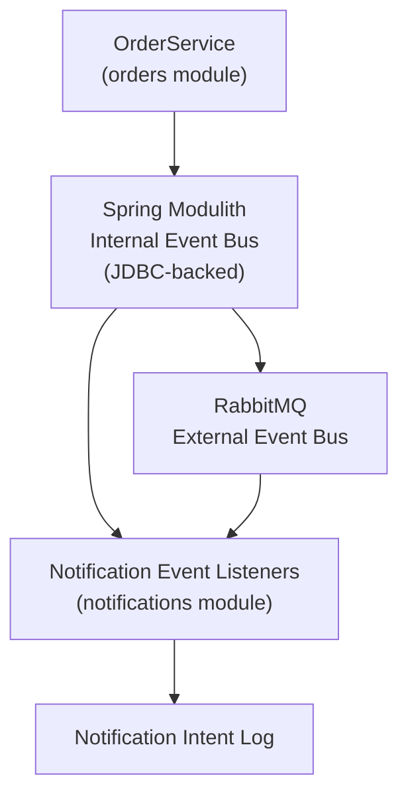
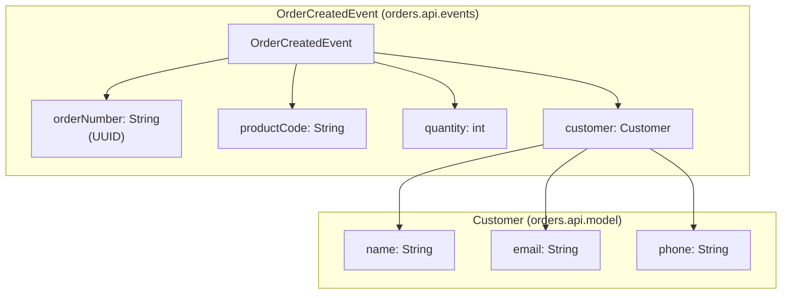
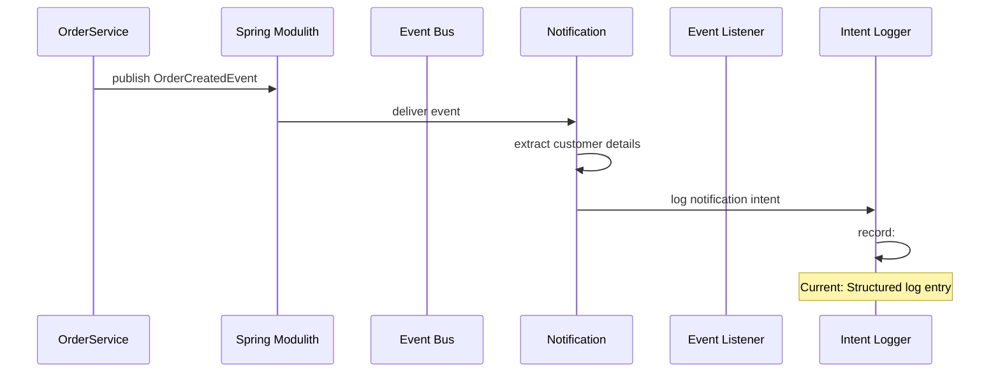
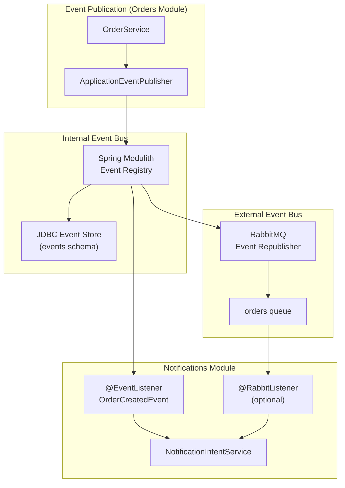
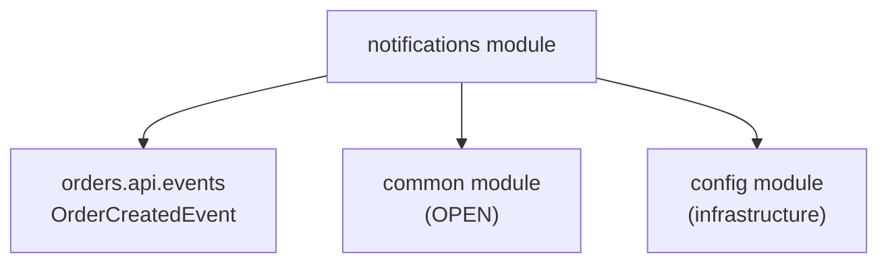
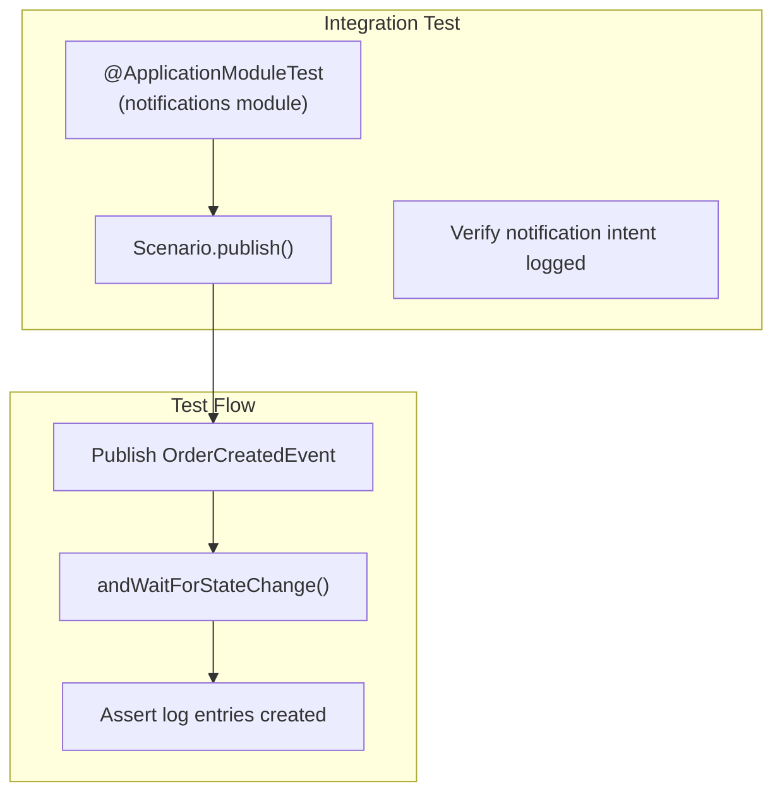

# Notifications Module

> **Relevant source files**
> * [README-API.md](https://github.com/philipz/spring-modular-monolith/blob/30c9bf30/README-API.md)
> * [README.md](https://github.com/philipz/spring-modular-monolith/blob/30c9bf30/README.md)
> * [docs/API_ANALYSIS_SUMMARY.txt](https://github.com/philipz/spring-modular-monolith/blob/30c9bf30/docs/API_ANALYSIS_SUMMARY.txt)
> * [docs/REST_API_ANALYSIS.md](https://github.com/philipz/spring-modular-monolith/blob/30c9bf30/docs/REST_API_ANALYSIS.md)
> * [docs/bookstore-microservices.png](https://github.com/philipz/spring-modular-monolith/blob/30c9bf30/docs/bookstore-microservices.png)
> * [docs/improvement.md](https://github.com/philipz/spring-modular-monolith/blob/30c9bf30/docs/improvement.md)
> * [docs/orders-data-ownership-analysis.md](https://github.com/philipz/spring-modular-monolith/blob/30c9bf30/docs/orders-data-ownership-analysis.md)
> * [docs/orders-module-boundary-analysis.md](https://github.com/philipz/spring-modular-monolith/blob/30c9bf30/docs/orders-module-boundary-analysis.md)
> * [docs/orders-traffic-migration.md](https://github.com/philipz/spring-modular-monolith/blob/30c9bf30/docs/orders-traffic-migration.md)
> * [k6.js](https://github.com/philipz/spring-modular-monolith/blob/30c9bf30/k6.js)
> * [src/test/java/com/sivalabs/bookstore/inventory/InventoryIntegrationTests.java](https://github.com/philipz/spring-modular-monolith/blob/30c9bf30/src/test/java/com/sivalabs/bookstore/inventory/InventoryIntegrationTests.java)

## Purpose and Scope

The Notifications module is responsible for consuming domain events published by other modules and recording notification intents for future delivery. This module implements an event-driven listener pattern that reacts to business events (such as order creation) and prepares notification actions. Currently, the module logs notification intents; it is designed to be extended with email, SMS, or push notification integrations in the future.

For information about event publication and the orders domain, see [Orders Module](/philipz/spring-modular-monolith/8.2-orders-module). For details on the event bus infrastructure, see [Event-Driven Architecture](/philipz/spring-modular-monolith/3.3-event-driven-architecture).

**Sources:** [README.md L13](https://github.com/philipz/spring-modular-monolith/blob/30c9bf30/README.md#L13-L13)

 [README.md L122-L128](https://github.com/philipz/spring-modular-monolith/blob/30c9bf30/README.md#L122-L128)

---

## Module Responsibilities

The Notifications module fulfills the following responsibilities:

| Responsibility | Description |
| --- | --- |
| **Event Consumption** | Listens to domain events published by other modules via Spring Modulith's internal event bus and RabbitMQ |
| **Notification Intent Recording** | Captures notification requirements based on business events and records them for processing |
| **Logging** | Currently logs notification intents as the primary output mechanism |
| **Future Integration Readiness** | Structured to support email, SMS, or other notification delivery channels without architectural changes |

The module does not own any domain entities or database tables. It operates purely as an event consumer and intent recorder.

**Sources:** [README.md L13](https://github.com/philipz/spring-modular-monolith/blob/30c9bf30/README.md#L13-L13)

 [README.md L30-L35](https://github.com/philipz/spring-modular-monolith/blob/30c9bf30/README.md#L30-L35)

---

## Event-Driven Architecture

The Notifications module participates in the system's dual event bus pattern, consuming events from both the internal Spring Modulith event bus (JDBC-backed) and external RabbitMQ message broker.

### Event Flow Architecture



**Event Consumption Pattern:**

1. **Primary Path:** The Orders module publishes `OrderCreatedEvent` to the Spring Modulith internal event bus
2. **Guaranteed Delivery:** The JDBC-backed event store ensures event persistence and at-least-once delivery
3. **Synchronous Processing:** Notifications module listeners consume events directly from the internal bus
4. **Asynchronous Reprocessing:** Events are republished to RabbitMQ for external processing and potential replay
5. **Intent Recording:** Each event triggers notification intent logging with customer and order details

**Sources:** [README.md L30-L35](https://github.com/philipz/spring-modular-monolith/blob/30c9bf30/README.md#L30-L35)

 Diagram 2 from high-level architecture

---

## Event Listeners

The Notifications module implements event listeners that respond to domain events. The primary event consumed is `OrderCreatedEvent`, which is published when a new order is successfully created.

### OrderCreatedEvent Structure



The `OrderCreatedEvent` class is located in the `orders.api.events` package, making it accessible to other modules without exposing Orders module internals. The event payload contains:

* **orderNumber:** Unique identifier for the order (UUID format)
* **productCode:** Product identifier (e.g., "P100", "P114")
* **quantity:** Number of items ordered
* **customer:** Customer details including name, email, and phone

**Sources:** [src/test/java/com/sivalabs/bookstore/inventory/InventoryIntegrationTests.java L27-L29](https://github.com/philipz/spring-modular-monolith/blob/30c9bf30/src/test/java/com/sivalabs/bookstore/inventory/InventoryIntegrationTests.java#L27-L29)

 [README.md L30-L35](https://github.com/philipz/spring-modular-monolith/blob/30c9bf30/README.md#L30-L35)

---

## Notification Intent Recording

The Notifications module records notification intents based on consumed events. Currently, this recording is implemented through structured logging, providing an audit trail of notification requirements.

### Notification Intent Workflow



**Current Implementation:**

* **Intent Format:** Structured log entries containing order number, customer email, and event metadata
* **Logging Level:** INFO level for successful intent recording, ERROR for processing failures
* **Audit Trail:** All notification intents are logged for compliance and debugging purposes

**Future Integration Points:**

The module structure supports extension to actual notification delivery:

* **Email Integration:** Replace logging with SMTP client or email service API (e.g., SendGrid, AWS SES)
* **SMS Integration:** Add SMS gateway integration (e.g., Twilio, AWS SNS)
* **Push Notifications:** Integrate with mobile push notification services
* **Template Engine:** Add Thymeleaf or FreeMarker for notification content generation
* **Delivery Queue:** Implement retry logic and delivery status tracking

**Sources:** [README.md L13](https://github.com/philipz/spring-modular-monolith/blob/30c9bf30/README.md#L13-L13)

 [README.md L30-L35](https://github.com/philipz/spring-modular-monolith/blob/30c9bf30/README.md#L30-L35)

---

## Integration with Event Buses

The Notifications module integrates with both the internal Spring Modulith event bus and the external RabbitMQ broker, ensuring reliable event consumption and processing flexibility.

### Dual Event Bus Integration



### Event Consumption Strategies

| Strategy | Implementation | Use Case |
| --- | --- | --- |
| **Synchronous Processing** | Spring `@EventListener` on internal event bus | Immediate notification intent recording within same transaction context |
| **Asynchronous Processing** | Spring `@RabbitListener` on RabbitMQ queue | Background processing, retry logic, external system integration |
| **Guaranteed Delivery** | JDBC event store persists events before listener invocation | Ensures no notification intents are lost even if listeners fail |
| **Idempotency** | Event listeners should handle duplicate events | RabbitMQ may deliver messages multiple times due to redelivery |

**Configuration:**

* **Spring Modulith:** Event externalization configured via `spring.modulith.republish-outstanding-events-on-restart=true` in [src/main/resources/application.properties](https://github.com/philipz/spring-modular-monolith/blob/30c9bf30/src/main/resources/application.properties)
* **RabbitMQ:** Event republishing to `orders` exchange with routing key patterns
* **Event Store:** Located in `events` schema managed by Liquibase in the Orders module

**Sources:** [README.md L28](https://github.com/philipz/spring-modular-monolith/blob/30c9bf30/README.md#L28-L28)

 [README.md L30-L35](https://github.com/philipz/spring-modular-monolith/blob/30c9bf30/README.md#L30-L35)

 Diagram 2 from high-level architecture

---

## Module Boundaries and Dependencies

The Notifications module adheres to Spring Modulith's architectural constraints:

### Dependencies



**Inbound Dependencies (What Notifications Consumes):**

* `orders.api.events.OrderCreatedEvent` – Domain event published by Orders module
* `orders.api.model.Customer` – Customer data transfer object included in events
* `common` module utilities – Exception handling, logging helpers (if needed)
* Infrastructure beans from `config` – Application context, event publishers

**Outbound Dependencies (What Notifications Provides):**

* Currently none – The module is a pure consumer with no exported APIs
* Future: May export `NotificationStatus` queries or `NotificationApi` for other modules

**Module Isolation:**

The Notifications module does not:

* Access any repositories from other modules
* Expose REST or gRPC endpoints (operates purely on events)
* Own any database tables (stateless intent recording via logs)
* Create reverse dependencies in other modules

**Sources:** [README.md L9](https://github.com/philipz/spring-modular-monolith/blob/30c9bf30/README.md#L9-L9)

 [README.md L30-L35](https://github.com/philipz/spring-modular-monolith/blob/30c9bf30/README.md#L30-L35)

---

## Testing Approach

While specific test files for the Notifications module were not provided in the repository scan, the module can be tested using Spring Modulith's testing support:

### Recommended Testing Strategy



**Example Test Pattern (based on Inventory tests):**

```javascript
@ApplicationModuleTest(webEnvironment = RANDOM_PORT)
class NotificationsIntegrationTests {
    
    @Test
    void shouldRecordNotificationIntentOnOrderCreated(Scenario scenario) {
        var customer = new Customer("Jane Doe", "jane@example.com", "+1-555-0100");
        var event = new OrderCreatedEvent(
            UUID.randomUUID().toString(), 
            "P100", 
            1, 
            customer
        );
        
        scenario.publish(event)
            .andWaitForStateChange(() -> notificationIntentWasLogged(event));
    }
}
```

**Testing Considerations:**

* Use `Scenario` API to publish events and verify state changes
* Verify log output using test appenders or log capture utilities
* Test idempotency by publishing duplicate events
* Test error handling when customer email is malformed

**Sources:** [src/test/java/com/sivalabs/bookstore/inventory/InventoryIntegrationTests.java L26-L31](https://github.com/philipz/spring-modular-monolith/blob/30c9bf30/src/test/java/com/sivalabs/bookstore/inventory/InventoryIntegrationTests.java#L26-L31)

---

## Future Extensibility

The Notifications module is architected for future extension to actual notification delivery systems. The current logging-based implementation serves as a placeholder that can be replaced or augmented with production notification channels.

### Extension Architecture

| Extension Point | Current Implementation | Future Implementation |
| --- | --- | --- |
| **Notification Storage** | Structured logs | Database table `notifications.notification_intents` |
| **Delivery Mechanism** | Logging | Email (SMTP/API), SMS (Twilio), Push (FCM/APNs) |
| **Template Management** | Hardcoded log messages | Thymeleaf/FreeMarker templates |
| **Delivery Status Tracking** | None | Status enum (PENDING, SENT, FAILED, RETRYING) |
| **Retry Logic** | None | Exponential backoff with max retry count |
| **Notification Preferences** | None | User preferences table with channel selection |

### Recommended Implementation Steps

1. **Database Schema:** Add `notifications` schema with `notification_intents` and `notification_deliveries` tables using Liquibase
2. **Service Layer:** Create `NotificationService` with template rendering and delivery logic
3. **Repository Layer:** Add `NotificationIntentRepository` for persistence
4. **Integration Layer:** Implement `EmailNotificationService`, `SmsNotificationService` as strategy pattern
5. **Configuration:** Add notification provider credentials via `application.properties` or secrets management
6. **Monitoring:** Expose notification metrics via Spring Actuator (`/actuator/metrics/notifications.*`)

**Architectural Benefits:**

* **Separation of Concerns:** Event consumption logic remains unchanged when adding delivery channels
* **Pluggable Providers:** Different notification providers can be swapped via configuration
* **Testability:** Mock notification services in tests while preserving event listener logic
* **Observability:** Centralized notification metrics and tracing integration

**Sources:** [README.md L13](https://github.com/philipz/spring-modular-monolith/blob/30c9bf30/README.md#L13-L13)

 [README.md L30-L35](https://github.com/philipz/spring-modular-monolith/blob/30c9bf30/README.md#L30-L35)

---

## Configuration

The Notifications module requires minimal configuration as it currently operates as a passive event consumer. Future email/SMS integrations will require additional properties.

### Current Configuration

No specific configuration properties are required. The module relies on:

* **Spring Modulith Event Bus:** Automatically configured by Spring Modulith starter
* **RabbitMQ Connection:** Inherited from `spring.rabbitmq.*` properties in [src/main/resources/application.properties](https://github.com/philipz/spring-modular-monolith/blob/30c9bf30/src/main/resources/application.properties)
* **Event Externalization:** `spring.modulith.republish-outstanding-events-on-restart=true`

### Future Configuration Properties

```markdown
# Email Notification (future)
notification.email.enabled=true
notification.email.provider=smtp
notification.email.smtp.host=smtp.example.com
notification.email.smtp.port=587
notification.email.smtp.username=${SMTP_USERNAME}
notification.email.smtp.password=${SMTP_PASSWORD}
notification.email.from=noreply@bookstore.example.com

# SMS Notification (future)
notification.sms.enabled=false
notification.sms.provider=twilio
notification.sms.twilio.account-sid=${TWILIO_ACCOUNT_SID}
notification.sms.twilio.auth-token=${TWILIO_AUTH_TOKEN}
notification.sms.twilio.from-number=+1-555-0199

# Retry Configuration (future)
notification.retry.max-attempts=3
notification.retry.backoff-multiplier=2
notification.retry.initial-delay-ms=1000
```

**Sources:** [README.md L13](https://github.com/philipz/spring-modular-monolith/blob/30c9bf30/README.md#L13-L13)

---

## Summary

The Notifications module provides event-driven notification intent recording in the Spring modular monolith:

* **Event Consumer:** Listens to `OrderCreatedEvent` and other domain events via Spring Modulith and RabbitMQ
* **Intent Recording:** Currently logs notification requirements; structured for future email/SMS delivery
* **Architectural Isolation:** No database tables, no REST endpoints, pure event listener pattern
* **Dual Event Bus:** Consumes from both internal JDBC-backed event bus and external RabbitMQ for flexibility
* **Future Ready:** Designed for extension to production notification channels without architectural changes

The module demonstrates clean separation of concerns, consuming published events without creating dependencies on Orders module internals. All integration flows through the `orders.api.events` package, maintaining strict module boundaries verified by `ModularityTests`.

**Sources:** [README.md L9-L14](https://github.com/philipz/spring-modular-monolith/blob/30c9bf30/README.md#L9-L14)

 [README.md L30-L35](https://github.com/philipz/spring-modular-monolith/blob/30c9bf30/README.md#L30-L35)

 [README.md L122-L128](https://github.com/philipz/spring-modular-monolith/blob/30c9bf30/README.md#L122-L128)