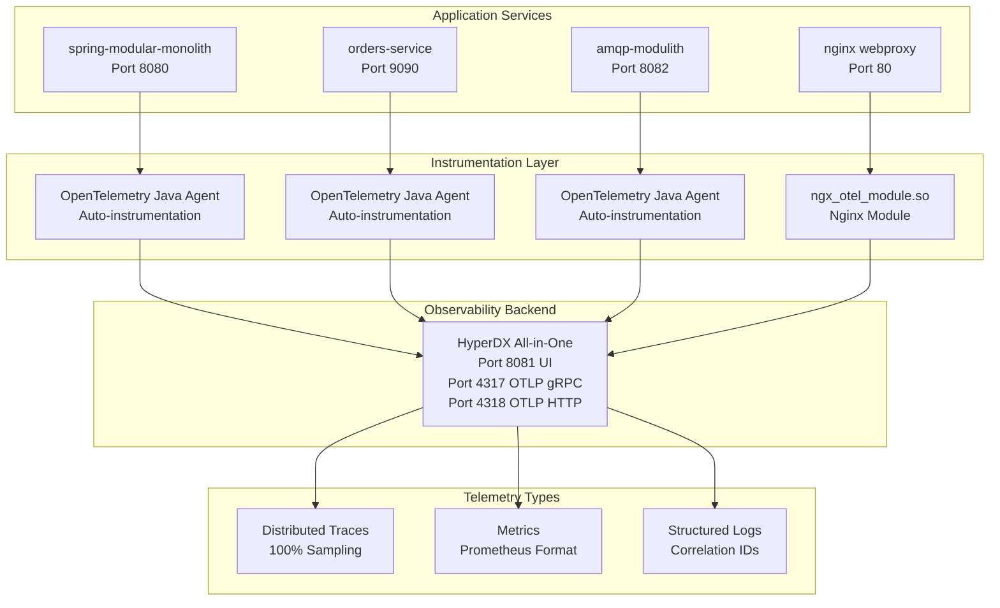
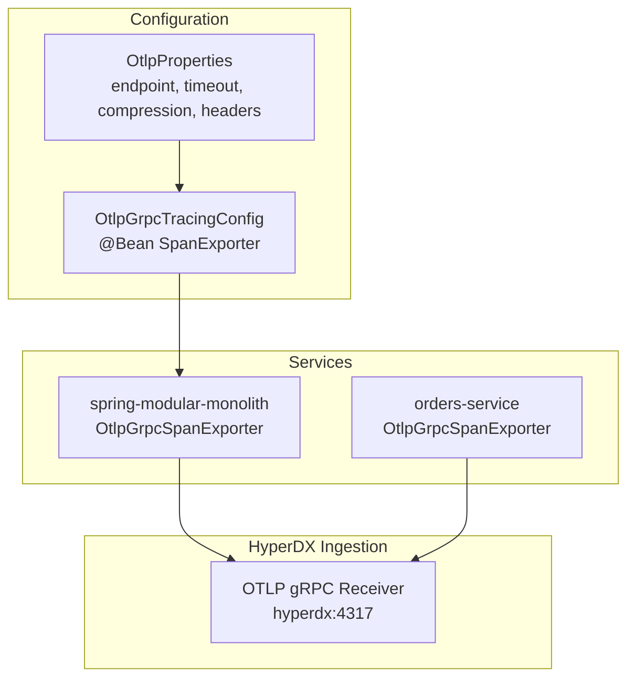
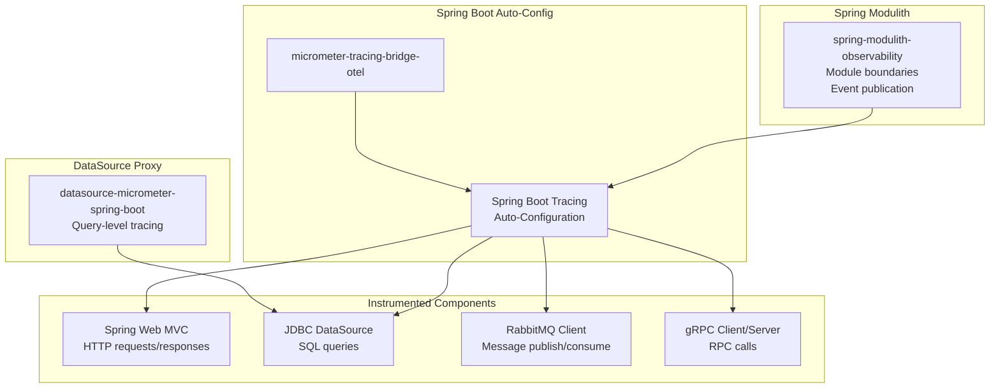
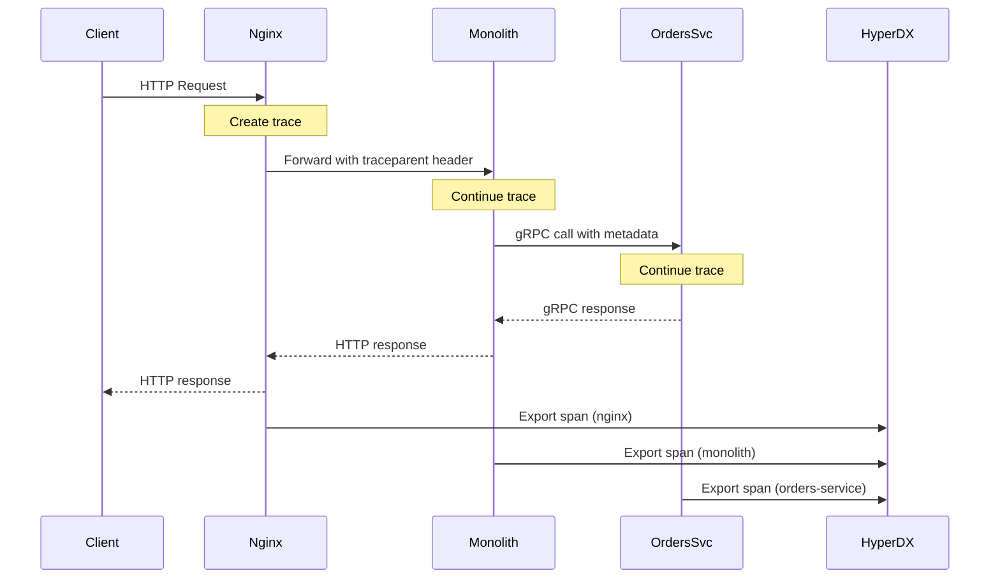

# Observability and Monitoring

> **Relevant source files**
> * [CLAUDE.md](https://github.com/philipz/spring-modular-monolith/blob/30c9bf30/CLAUDE.md)
> * [compose.yml](https://github.com/philipz/spring-modular-monolith/blob/30c9bf30/compose.yml)
> * [pom.xml](https://github.com/philipz/spring-modular-monolith/blob/30c9bf30/pom.xml)
> * [src/main/java/com/sivalabs/bookstore/config/LiquibaseConfig.java](https://github.com/philipz/spring-modular-monolith/blob/30c9bf30/src/main/java/com/sivalabs/bookstore/config/LiquibaseConfig.java)
> * [src/main/java/com/sivalabs/bookstore/config/OtlpGrpcTracingConfig.java](https://github.com/philipz/spring-modular-monolith/blob/30c9bf30/src/main/java/com/sivalabs/bookstore/config/OtlpGrpcTracingConfig.java)
> * [src/main/java/com/sivalabs/bookstore/config/OtlpProperties.java](https://github.com/philipz/spring-modular-monolith/blob/30c9bf30/src/main/java/com/sivalabs/bookstore/config/OtlpProperties.java)
> * [src/main/resources/application.properties](https://github.com/philipz/spring-modular-monolith/blob/30c9bf30/src/main/resources/application.properties)
> * [src/test/java/com/sivalabs/bookstore/BookStoreApplicationTests.java](https://github.com/philipz/spring-modular-monolith/blob/30c9bf30/src/test/java/com/sivalabs/bookstore/BookStoreApplicationTests.java)
> * [src/test/java/com/sivalabs/bookstore/TestcontainersConfiguration.java](https://github.com/philipz/spring-modular-monolith/blob/30c9bf30/src/test/java/com/sivalabs/bookstore/TestcontainersConfiguration.java)

This page documents the comprehensive observability and monitoring infrastructure of the Spring Modular Monolith. The system uses OpenTelemetry for distributed tracing, HyperDX as the all-in-one observability backend, and Spring Boot Actuator for metrics and health checks. All services export telemetry via OTLP gRPC protocol with full trace sampling enabled.

For specific configuration details, see [OpenTelemetry Configuration](/philipz/spring-modular-monolith/9.1-opentelemetry-configuration). For HyperDX platform usage, see [Distributed Tracing with HyperDX](/philipz/spring-modular-monolith/9.2-distributed-tracing-with-hyperdx). For health monitoring, see [Spring Actuator and Health Checks](/philipz/spring-modular-monolith/9.3-spring-actuator-and-health-checks).

## Observability Strategy

The system implements a unified observability approach where all services (monolith, orders-service, frontend, nginx) export telemetry to a single HyperDX instance. This provides:

* **Distributed Tracing**: End-to-end request tracing across service boundaries
* **Metrics Collection**: Performance and business metrics via Micrometer and Prometheus
* **Log Correlation**: Trace and span IDs embedded in all log statements
* **Health Monitoring**: Unified health checks across all components
* **Module Boundary Observability**: Spring Modulith automatically instruments module interactions



**Sources:**

* [compose.yml L49-L56](https://github.com/philipz/spring-modular-monolith/blob/30c9bf30/compose.yml#L49-L56)
* [compose.yml L58-L86](https://github.com/philipz/spring-modular-monolith/blob/30c9bf30/compose.yml#L58-L86)
* [compose.yml L88-L117](https://github.com/philipz/spring-modular-monolith/blob/30c9bf30/compose.yml#L88-L117)

## Telemetry Export Architecture

All services export telemetry using the OpenTelemetry Protocol (OTLP) over gRPC. The system uses gRPC instead of HTTP for better performance through binary serialization and HTTP/2 multiplexing.



**Sources:**

* [src/main/java/com/sivalabs/bookstore/config/OtlpProperties.java L1-L63](https://github.com/philipz/spring-modular-monolith/blob/30c9bf30/src/main/java/com/sivalabs/bookstore/config/OtlpProperties.java#L1-L63)
* [src/main/java/com/sivalabs/bookstore/config/OtlpGrpcTracingConfig.java L1-L63](https://github.com/philipz/spring-modular-monolith/blob/30c9bf30/src/main/java/com/sivalabs/bookstore/config/OtlpGrpcTracingConfig.java#L1-L63)

### OTLP Configuration Properties

The OTLP exporter is configured through properties bound by the `OtlpProperties` class:

| Property | Default | Description |
| --- | --- | --- |
| `otlp.grpc.enabled` | `true` | Enable/disable OTLP gRPC exporter |
| `otlp.grpc.endpoint` | `http://localhost:4317` | HyperDX OTLP gRPC endpoint |
| `otlp.grpc.timeout` | `10s` | Request timeout for span export |
| `otlp.grpc.compression` | `gzip` | Compression algorithm (none, gzip) |
| `otlp.grpc.headers.authorization` | (empty) | Authentication header for HyperDX |

**Sources:**

* [src/main/resources/application.properties L76-L82](https://github.com/philipz/spring-modular-monolith/blob/30c9bf30/src/main/resources/application.properties#L76-L82)
* [src/main/java/com/sivalabs/bookstore/config/OtlpProperties.java L9-L63](https://github.com/philipz/spring-modular-monolith/blob/30c9bf30/src/main/java/com/sivalabs/bookstore/config/OtlpProperties.java#L9-L63)

### Environment Variable Configuration

In Docker Compose, OTLP configuration is set via environment variables:

```yaml
OTLP_ENDPOINT: http://hyperdx:4317
OTLP_GRPC_HEADERS_AUTHORIZATION: ${HYPERDX_API_KEY}
```

The `HYPERDX_API_KEY` is required for authentication and should be set in the shell environment before starting services.

**Sources:**

* [compose.yml L72-L73](https://github.com/philipz/spring-modular-monolith/blob/30c9bf30/compose.yml#L72-L73)
* [compose.yml L107-L108](https://github.com/philipz/spring-modular-monolith/blob/30c9bf30/compose.yml#L107-L108)

## Auto-Instrumentation Components

OpenTelemetry auto-instrumentation is enabled through Spring Boot's tracing auto-configuration and the Micrometer tracing bridge. The following components are automatically instrumented:



**Sources:**

* [pom.xml L81-L93](https://github.com/philipz/spring-modular-monolith/blob/30c9bf30/pom.xml#L81-L93)
* [pom.xml L112-L128](https://github.com/philipz/spring-modular-monolith/blob/30c9bf30/pom.xml#L112-L128)

### Spring Modulith Observability

The `spring-modulith-observability` dependency adds instrumentation for module boundaries and event publication. This creates spans for:

* Module-to-module API calls (e.g., orders → catalog.ProductApi)
* Event publication to the internal event bus
* Event consumption by listeners

**Sources:**

* [pom.xml L124-L128](https://github.com/philipz/spring-modular-monolith/blob/30c9bf30/pom.xml#L124-L128)
* [src/main/resources/application.properties L101-L110](https://github.com/philipz/spring-modular-monolith/blob/30c9bf30/src/main/resources/application.properties#L101-L110)

### JDBC Query Tracing

The `datasource-micrometer-spring-boot` library adds detailed query-level tracing to JDBC operations. This is configured separately from basic JDBC instrumentation:

```
jdbc.datasource-proxy.query.enable-logging=false
jdbc.datasource-proxy.query.logger-name=bookstore.query-logger
jdbc.datasource-proxy.query.log-level=DEBUG
```

**Sources:**

* [src/main/resources/application.properties L14-L18](https://github.com/philipz/spring-modular-monolith/blob/30c9bf30/src/main/resources/application.properties#L14-L18)
* [pom.xml L89-L93](https://github.com/philipz/spring-modular-monolith/blob/30c9bf30/pom.xml#L89-L93)

## Spring Actuator Endpoints

Spring Boot Actuator exposes management endpoints for monitoring, metrics, and health checks. All endpoints are exposed by default in this application:

| Endpoint | Purpose |
| --- | --- |
| `/actuator/health` | Health check with component details |
| `/actuator/metrics` | Micrometer metrics in Prometheus format |
| `/actuator/modulith` | Spring Modulith module structure |
| `/actuator/env` | Environment properties |
| `/actuator/info` | Application build information |
| `/actuator/loggers` | Dynamic log level management |
| `/actuator/threaddump` | Thread dump for debugging |

**Sources:**

* [src/main/resources/application.properties L70-L74](https://github.com/philipz/spring-modular-monolith/blob/30c9bf30/src/main/resources/application.properties#L70-L74)
* [pom.xml L62-L70](https://github.com/philipz/spring-modular-monolith/blob/30c9bf30/pom.xml#L62-L70)

### Health Check Configuration

Health checks are enabled with probes support, which is essential for Kubernetes liveness and readiness probes:

```
management.endpoint.health.probes.enabled=true
```

The health endpoint includes checks for:

* Database connectivity (PostgreSQL)
* RabbitMQ connection
* Hazelcast cluster membership
* gRPC server status (when gRPC is enabled)

**Sources:**

* [src/main/resources/application.properties L72](https://github.com/philipz/spring-modular-monolith/blob/30c9bf30/src/main/resources/application.properties#L72-L72)

### Metrics Collection

Micrometer collects metrics with Prometheus registry. Key metrics include:

* **HTTP metrics**: Request count, duration, status codes
* **JVM metrics**: Memory, threads, garbage collection
* **Database metrics**: Connection pool usage, query performance
* **Cache metrics**: Hit/miss rates, evictions, entry count
* **gRPC metrics**: RPC call duration, status codes

The application disables certain JDBC metrics to avoid Prometheus tag conflicts with Spring Modulith:

```
spring.modulith.observability.instrumentation.datasource.enabled=false
management.metrics.enable.jdbc=false
management.metrics.enable.hikaricp=false
```

**Sources:**

* [src/main/resources/application.properties L101-L110](https://github.com/philipz/spring-modular-monolith/blob/30c9bf30/src/main/resources/application.properties#L101-L110)
* [pom.xml L66-L70](https://github.com/philipz/spring-modular-monolith/blob/30c9bf30/pom.xml#L66-L70)

## Distributed Tracing Configuration

The system is configured for full distributed tracing with 100% sampling rate. This is appropriate for development and staging environments.

```
management.tracing.enabled=true
management.tracing.sampling.probability=1.0
```

### Trace Context Propagation

OpenTelemetry automatically propagates trace context across:

1. **HTTP calls**: Via W3C Trace Context headers (`traceparent`, `tracestate`)
2. **gRPC calls**: Via gRPC metadata
3. **RabbitMQ messages**: Via message headers
4. **Internal events**: Via Spring Modulith event metadata



**Sources:**

* [src/main/resources/application.properties L73-L74](https://github.com/philipz/spring-modular-monolith/blob/30c9bf30/src/main/resources/application.properties#L73-L74)

## Log Correlation

All log statements include trace and span IDs through the configured logging pattern:

```
logging.pattern.correlation=[${spring.application.name:},%X{traceId:-},%X{spanId:-}]
```

This produces log output like:

```
[spring-modular-monolith,abc123def456,span789] OrderService - Creating order for customer john@example.com
```

The correlation pattern allows:

* **Request tracing**: Search logs by trace ID to see all logs for a single request
* **Service identification**: Application name prefix identifies the source service
* **Span correlation**: Link log statements to specific spans in distributed traces

**Sources:**

* [src/main/resources/application.properties L3-L4](https://github.com/philipz/spring-modular-monolith/blob/30c9bf30/src/main/resources/application.properties#L3-L4)

## HyperDX Deployment Configuration

HyperDX runs as a Docker container exposing three ports:

| Port | Protocol | Purpose |
| --- | --- | --- |
| 8081 | HTTP | Web UI for viewing traces/metrics/logs |
| 4317 | gRPC | OTLP gRPC receiver for telemetry ingestion |
| 4318 | HTTP | OTLP HTTP receiver (alternative to gRPC) |

```yaml
hyperdx:
  image: 'docker.hyperdx.io/hyperdx/hyperdx-all-in-one'
  ports:
    - '8081:8080'   # UI remapped to avoid conflict
    - '4317:4317'   # OTLP gRPC
    - '4318:4318'   # OTLP HTTP
```

The HyperDX UI is accessible at `http://localhost:8081` after starting the Docker Compose stack.

**Sources:**

* [compose.yml L49-L56](https://github.com/philipz/spring-modular-monolith/blob/30c9bf30/compose.yml#L49-L56)

## Testing with Observability

Integration tests use Testcontainers to provide PostgreSQL and RabbitMQ, but do not require HyperDX. Telemetry export can be disabled in tests or pointed to a no-op exporter.

The `TestcontainersConfiguration` class provides test infrastructure:

```python
@TestConfiguration(proxyBeanMethods = false)
@Testcontainers
public class TestcontainersConfiguration {
    @Container
    static PostgreSQLContainer<?> postgres = ...;
    
    @Container
    static RabbitMQContainer rabbitmq = ...;
}
```

Test classes import this configuration to automatically start required containers:

```python
@SpringBootTest(webEnvironment = RANDOM_PORT)
@Import(TestcontainersConfiguration.class)
class BookStoreApplicationTests {
    @Test
    void contextLoads() {}
}
```

**Sources:**

* [src/test/java/com/sivalabs/bookstore/TestcontainersConfiguration.java L1-L33](https://github.com/philipz/spring-modular-monolith/blob/30c9bf30/src/test/java/com/sivalabs/bookstore/TestcontainersConfiguration.java#L1-L33)
* [src/test/java/com/sivalabs/bookstore/BookStoreApplicationTests.java L1-L17](https://github.com/philipz/spring-modular-monolith/blob/30c9bf30/src/test/java/com/sivalabs/bookstore/BookStoreApplicationTests.java#L1-L17)

## Dependency Overview

The observability stack is built on these key dependencies:

```xml
<!-- Tracing Bridge -->
<dependency>
    <groupId>io.micrometer</groupId>
    <artifactId>micrometer-tracing-bridge-otel</artifactId>
</dependency>

<!-- OTLP Exporter -->
<dependency>
    <groupId>io.opentelemetry</groupId>
    <artifactId>opentelemetry-exporter-otlp</artifactId>
</dependency>

<!-- Metrics -->
<dependency>
    <groupId>io.micrometer</groupId>
    <artifactId>micrometer-registry-prometheus</artifactId>
</dependency>

<!-- JDBC Tracing -->
<dependency>
    <groupId>net.ttddyy.observation</groupId>
    <artifactId>datasource-micrometer-spring-boot</artifactId>
</dependency>

<!-- Module Observability -->
<dependency>
    <groupId>org.springframework.modulith</groupId>
    <artifactId>spring-modulith-observability</artifactId>
</dependency>

<!-- Module Actuator -->
<dependency>
    <groupId>org.springframework.modulith</groupId>
    <artifactId>spring-modulith-actuator</artifactId>
</dependency>
```

**Sources:**

* [pom.xml L81-L128](https://github.com/philipz/spring-modular-monolith/blob/30c9bf30/pom.xml#L81-L128)

## Configuration Class Responsibilities

The observability infrastructure is configured by these key classes:

| Class | Responsibility | Location |
| --- | --- | --- |
| `OtlpProperties` | OTLP configuration properties | [src/main/java/com/sivalabs/bookstore/config/OtlpProperties.java L9-L63](https://github.com/philipz/spring-modular-monolith/blob/30c9bf30/src/main/java/com/sivalabs/bookstore/config/OtlpProperties.java#L9-L63) |
| `OtlpGrpcTracingConfig` | SpanExporter bean creation | [src/main/java/com/sivalabs/bookstore/config/OtlpGrpcTracingConfig.java L34-L63](https://github.com/philipz/spring-modular-monolith/blob/30c9bf30/src/main/java/com/sivalabs/bookstore/config/OtlpGrpcTracingConfig.java#L34-L63) |
| Spring Boot Auto-Config | Automatic instrumentation wiring | Built-in |

The `OtlpGrpcTracingConfig` creates the `SpanExporter` bean that sends traces to HyperDX:

```
@Bean
public SpanExporter otlpGrpcSpanExporter(OtlpProperties properties) {
    OtlpGrpcSpanExporterBuilder builder = OtlpGrpcSpanExporter.builder()
        .setEndpoint(properties.getEndpoint())
        .setTimeout(properties.getTimeout())
        .setCompression(properties.getCompression());
    
    for (Map.Entry<String, String> header : properties.getHeaders().entrySet()) {
        builder.addHeader(header.getKey(), header.getValue());
    }
    
    return builder.build();
}
```

**Sources:**

* [src/main/java/com/sivalabs/bookstore/config/OtlpGrpcTracingConfig.java L49-L62](https://github.com/philipz/spring-modular-monolith/blob/30c9bf30/src/main/java/com/sivalabs/bookstore/config/OtlpGrpcTracingConfig.java#L49-L62)

## Module Boundary Tracing

Spring Modulith's observability module automatically creates spans for module interactions. This provides visibility into:

1. **Cross-module API calls**: When `orders` calls `catalog.ProductApi`, a span is created
2. **Event publication**: When an event is published to the internal bus
3. **Event consumption**: When a listener processes an event

These spans are automatically correlated with the parent request trace, providing a complete picture of how a request flows through the modular monolith.

**Sources:**

* [pom.xml L124-L128](https://github.com/philipz/spring-modular-monolith/blob/30c9bf30/pom.xml#L124-L128)