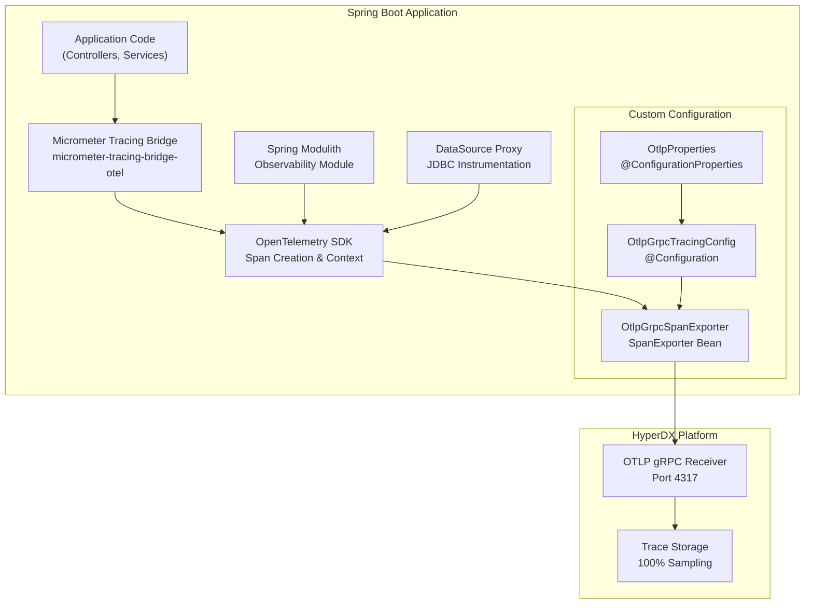
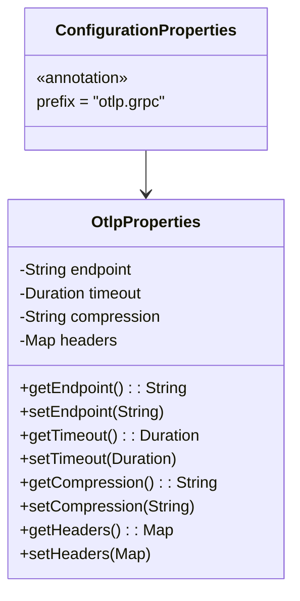
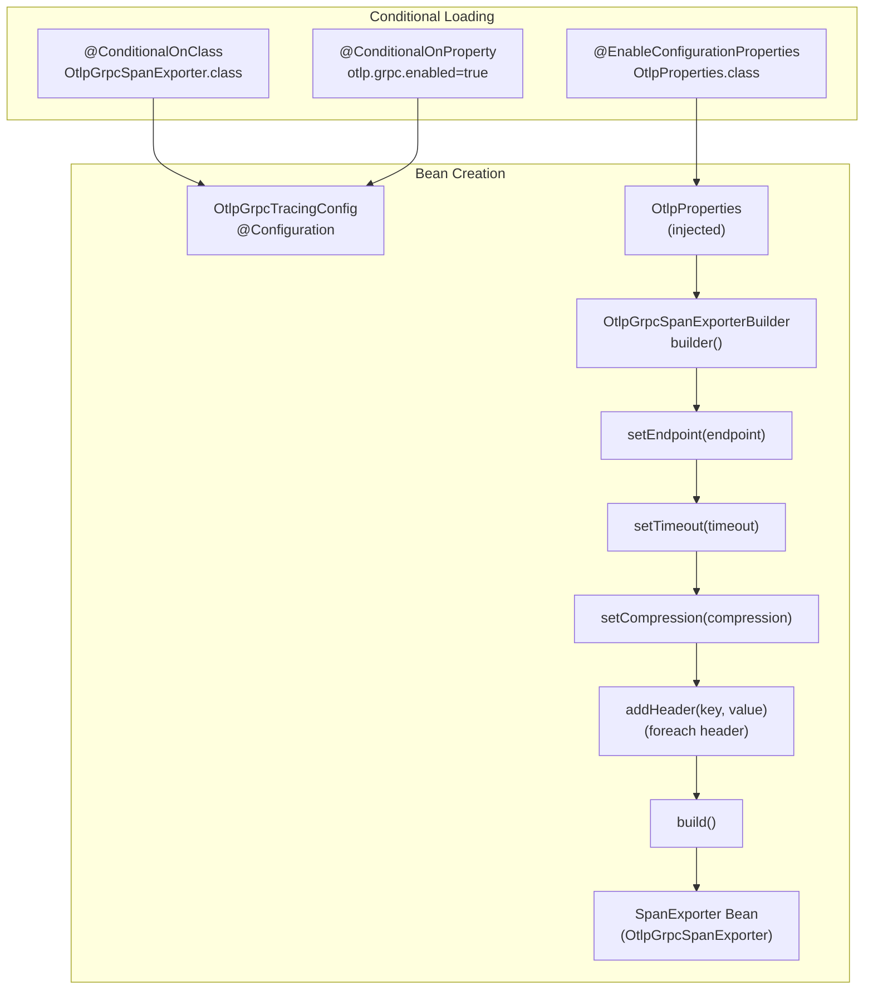
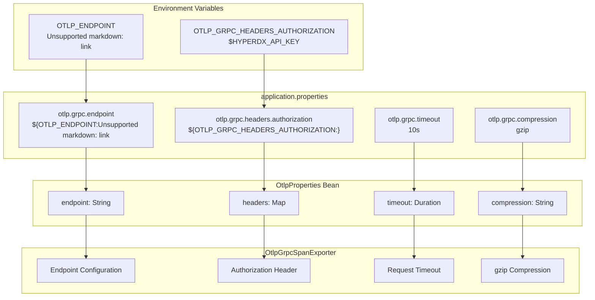

# OpenTelemetry Configuration

> **Relevant source files**
> * [CLAUDE.md](https://github.com/philipz/spring-modular-monolith/blob/30c9bf30/CLAUDE.md)
> * [compose.yml](https://github.com/philipz/spring-modular-monolith/blob/30c9bf30/compose.yml)
> * [pom.xml](https://github.com/philipz/spring-modular-monolith/blob/30c9bf30/pom.xml)
> * [src/main/java/com/sivalabs/bookstore/config/LiquibaseConfig.java](https://github.com/philipz/spring-modular-monolith/blob/30c9bf30/src/main/java/com/sivalabs/bookstore/config/LiquibaseConfig.java)
> * [src/main/java/com/sivalabs/bookstore/config/OtlpGrpcTracingConfig.java](https://github.com/philipz/spring-modular-monolith/blob/30c9bf30/src/main/java/com/sivalabs/bookstore/config/OtlpGrpcTracingConfig.java)
> * [src/main/java/com/sivalabs/bookstore/config/OtlpProperties.java](https://github.com/philipz/spring-modular-monolith/blob/30c9bf30/src/main/java/com/sivalabs/bookstore/config/OtlpProperties.java)
> * [src/main/resources/application.properties](https://github.com/philipz/spring-modular-monolith/blob/30c9bf30/src/main/resources/application.properties)
> * [src/test/java/com/sivalabs/bookstore/BookStoreApplicationTests.java](https://github.com/philipz/spring-modular-monolith/blob/30c9bf30/src/test/java/com/sivalabs/bookstore/BookStoreApplicationTests.java)
> * [src/test/java/com/sivalabs/bookstore/TestcontainersConfiguration.java](https://github.com/philipz/spring-modular-monolith/blob/30c9bf30/src/test/java/com/sivalabs/bookstore/TestcontainersConfiguration.java)

This page documents the OpenTelemetry (OTLP) configuration for exporting distributed traces from the Spring modular monolith to the HyperDX observability platform. The configuration uses the OTLP gRPC protocol for efficient binary trace transmission with compression and authentication support.

For information about the overall observability architecture including HyperDX deployment and Spring Actuator configuration, see [Observability and Monitoring](/philipz/spring-modular-monolith/9-observability-and-monitoring). For distributed tracing patterns across services, see [Distributed Tracing with HyperDX](/philipz/spring-modular-monolith/9.2-distributed-tracing-with-hyperdx).

---

## Overview

The application uses OpenTelemetry's OTLP gRPC exporter to send trace spans to HyperDX. The configuration is split into two main components:

| Component | Purpose | File |
| --- | --- | --- |
| `OtlpProperties` | Configuration properties binding for `otlp.grpc.*` settings | [src/main/java/com/sivalabs/bookstore/config/OtlpProperties.java L1-L63](https://github.com/philipz/spring-modular-monolith/blob/30c9bf30/src/main/java/com/sivalabs/bookstore/config/OtlpProperties.java#L1-L63) |
| `OtlpGrpcTracingConfig` | Spring bean configuration creating the `OtlpGrpcSpanExporter` | [src/main/java/com/sivalabs/bookstore/config/OtlpGrpcTracingConfig.java L1-L63](https://github.com/philipz/spring-modular-monolith/blob/30c9bf30/src/main/java/com/sivalabs/bookstore/config/OtlpGrpcTracingConfig.java#L1-L63) |

The configuration uses gRPC protocol (port 4317) instead of HTTP (port 4318) for better performance through binary protocol and HTTP/2 multiplexing.

**Sources:** [src/main/resources/application.properties L76-L82](https://github.com/philipz/spring-modular-monolith/blob/30c9bf30/src/main/resources/application.properties#L76-L82)

 [src/main/java/com/sivalabs/bookstore/config/OtlpGrpcTracingConfig.java L1-L63](https://github.com/philipz/spring-modular-monolith/blob/30c9bf30/src/main/java/com/sivalabs/bookstore/config/OtlpGrpcTracingConfig.java#L1-L63)

---

## OpenTelemetry Trace Export Architecture



**Sources:** [pom.xml L81-L93](https://github.com/philipz/spring-modular-monolith/blob/30c9bf30/pom.xml#L81-L93)

 [src/main/java/com/sivalabs/bookstore/config/OtlpGrpcTracingConfig.java L13-L32](https://github.com/philipz/spring-modular-monolith/blob/30c9bf30/src/main/java/com/sivalabs/bookstore/config/OtlpGrpcTracingConfig.java#L13-L32)

 [src/main/resources/application.properties L73-L82](https://github.com/philipz/spring-modular-monolith/blob/30c9bf30/src/main/resources/application.properties#L73-L82)

---

## Configuration Properties Class

The `OtlpProperties` class binds configuration properties with the prefix `otlp.grpc`:



### Property Definitions

| Property | Type | Default | Description |
| --- | --- | --- | --- |
| `otlp.grpc.endpoint` | String | `http://localhost:4317` | OTLP gRPC endpoint URL |
| `otlp.grpc.timeout` | Duration | `10s` | Request timeout for gRPC calls |
| `otlp.grpc.compression` | String | `gzip` | Compression type (none, gzip) |
| `otlp.grpc.headers.*` | Map | `{}` | Custom headers (e.g., authorization) |

The class provides immutable access to headers through `getHeaders()` which returns an unmodifiable map [src/main/java/com/sivalabs/bookstore/config/OtlpProperties.java L56-L58](https://github.com/philipz/spring-modular-monolith/blob/30c9bf30/src/main/java/com/sivalabs/bookstore/config/OtlpProperties.java#L56-L58)

**Sources:** [src/main/java/com/sivalabs/bookstore/config/OtlpProperties.java L9-L63](https://github.com/philipz/spring-modular-monolith/blob/30c9bf30/src/main/java/com/sivalabs/bookstore/config/OtlpProperties.java#L9-L63)

 [src/main/resources/application.properties L76-L82](https://github.com/philipz/spring-modular-monolith/blob/30c9bf30/src/main/resources/application.properties#L76-L82)

---

## OtlpGrpcTracingConfig Bean Configuration

The `OtlpGrpcTracingConfig` class creates the `SpanExporter` bean used by Spring Boot's tracing auto-configuration:



### Conditional Bean Loading

The configuration uses two conditional annotations to ensure proper loading [src/main/java/com/sivalabs/bookstore/config/OtlpGrpcTracingConfig.java L34-L37](https://github.com/philipz/spring-modular-monolith/blob/30c9bf30/src/main/java/com/sivalabs/bookstore/config/OtlpGrpcTracingConfig.java#L34-L37)

:

1. **`@ConditionalOnClass(OtlpGrpcSpanExporter.class)`**: Prevents bean definition errors when OpenTelemetry dependencies are absent
2. **`@ConditionalOnProperty(prefix = "otlp.grpc", name = "enabled", havingValue = "true", matchIfMissing = true)`**: Allows runtime enable/disable via configuration

This dual-conditional pattern prevents class loading issues while maintaining configuration flexibility.

### Bean Creation Logic

The `otlpGrpcSpanExporter` method [src/main/java/com/sivalabs/bookstore/config/OtlpGrpcTracingConfig.java L49-L62](https://github.com/philipz/spring-modular-monolith/blob/30c9bf30/src/main/java/com/sivalabs/bookstore/config/OtlpGrpcTracingConfig.java#L49-L62)

 creates the exporter by:

1. Creating an `OtlpGrpcSpanExporterBuilder` instance
2. Setting endpoint, timeout, and compression from `OtlpProperties`
3. Iterating through custom headers and adding each via `addHeader(key, value)`
4. Building the final `OtlpGrpcSpanExporter` instance

**Sources:** [src/main/java/com/sivalabs/bookstore/config/OtlpGrpcTracingConfig.java L34-L62](https://github.com/philipz/spring-modular-monolith/blob/30c9bf30/src/main/java/com/sivalabs/bookstore/config/OtlpGrpcTracingConfig.java#L34-L62)

---

## Application Properties Configuration

The `application.properties` file defines default OTLP settings [src/main/resources/application.properties L76-L82](https://github.com/philipz/spring-modular-monolith/blob/30c9bf30/src/main/resources/application.properties#L76-L82)

:

```css
# OpenTelemetry OTLP gRPC exporter configuration
# Note: Using gRPC protocol (port 4317) instead of HTTP (port 4318) for better performance
otlp.grpc.enabled=true
otlp.grpc.endpoint=${OTLP_ENDPOINT:http://localhost:4317}
otlp.grpc.timeout=10s
otlp.grpc.compression=gzip
otlp.grpc.headers.authorization=${OTLP_GRPC_HEADERS_AUTHORIZATION:}
```

### Spring Boot Tracing Configuration

Additional tracing settings [src/main/resources/application.properties L73-L74](https://github.com/philipz/spring-modular-monolith/blob/30c9bf30/src/main/resources/application.properties#L73-L74)

:

```
management.tracing.enabled=true
management.tracing.sampling.probability=1.0
```

The sampling probability of `1.0` ensures 100% of traces are captured, appropriate for development and staging environments.

**Sources:** [src/main/resources/application.properties L73-L82](https://github.com/philipz/spring-modular-monolith/blob/30c9bf30/src/main/resources/application.properties#L73-L82)

---

## Docker Compose Environment Configuration

### Monolith Service Configuration

The monolith service configures OpenTelemetry via environment variables [compose.yml L71-L73](https://github.com/philipz/spring-modular-monolith/blob/30c9bf30/compose.yml#L71-L73)

:

```yaml
environment:
  OTLP_ENDPOINT: http://hyperdx:4317
  OTLP_GRPC_HEADERS_AUTHORIZATION: ${HYPERDX_API_KEY}
```

### Orders Service Configuration

The orders-service uses identical OTLP configuration [compose.yml L106-L108](https://github.com/philipz/spring-modular-monolith/blob/30c9bf30/compose.yml#L106-L108)

:

```yaml
environment:
  OTLP_ENDPOINT: http://hyperdx:4317
  OTLP_GRPC_HEADERS_AUTHORIZATION: ${HYPERDX_API_KEY}
```

### HyperDX Service Configuration

HyperDX exposes both gRPC and HTTP OTLP receivers [compose.yml L49-L56](https://github.com/philipz/spring-modular-monolith/blob/30c9bf30/compose.yml#L49-L56)

:

```yaml
hyperdx:
  image: 'docker.hyperdx.io/hyperdx/hyperdx-all-in-one'
  ports:
    - '8081:8080'   # HyperDX UI
    - '4317:4317'   # OpenTelemetry gRPC
    - '4318:4318'   # OpenTelemetry HTTP
```

The services connect to port 4317 for gRPC-based trace export.

**Sources:** [compose.yml L49-L73](https://github.com/philipz/spring-modular-monolith/blob/30c9bf30/compose.yml#L49-L73)

 [compose.yml L88-L117](https://github.com/philipz/spring-modular-monolith/blob/30c9bf30/compose.yml#L88-L117)

---

## Configuration Property Flow



**Sources:** [compose.yml L71-L73](https://github.com/philipz/spring-modular-monolith/blob/30c9bf30/compose.yml#L71-L73)

 [src/main/resources/application.properties L76-L82](https://github.com/philipz/spring-modular-monolith/blob/30c9bf30/src/main/resources/application.properties#L76-L82)

 [src/main/java/com/sivalabs/bookstore/config/OtlpProperties.java L9-L63](https://github.com/philipz/spring-modular-monolith/blob/30c9bf30/src/main/java/com/sivalabs/bookstore/config/OtlpProperties.java#L9-L63)

 [src/main/java/com/sivalabs/bookstore/config/OtlpGrpcTracingConfig.java L49-L62](https://github.com/philipz/spring-modular-monolith/blob/30c9bf30/src/main/java/com/sivalabs/bookstore/config/OtlpGrpcTracingConfig.java#L49-L62)

---

## Maven Dependencies

The OpenTelemetry configuration requires the following dependencies [pom.xml L81-L93](https://github.com/philipz/spring-modular-monolith/blob/30c9bf30/pom.xml#L81-L93)

:

| Dependency | Purpose |
| --- | --- |
| `micrometer-tracing-bridge-otel` | Bridges Micrometer tracing API to OpenTelemetry |
| `opentelemetry-exporter-otlp` | Provides OTLP HTTP and gRPC exporters |
| `datasource-micrometer-spring-boot` | Instruments JDBC DataSource for tracing |
| `spring-modulith-observability` | Adds instrumentation for module boundaries and events |

The `spring-modulith-observability` dependency [pom.xml L125-L128](https://github.com/philipz/spring-modular-monolith/blob/30c9bf30/pom.xml#L125-L128)

 automatically instruments:

* Module boundary crossings
* Event publication and consumption
* Application module interactions

**Sources:** [pom.xml L81-L93](https://github.com/philipz/spring-modular-monolith/blob/30c9bf30/pom.xml#L81-L93)

 [pom.xml L125-L128](https://github.com/philipz/spring-modular-monolith/blob/30c9bf30/pom.xml#L125-L128)

---

## Testing Configuration

Integration tests override the gRPC server port to avoid conflicts [src/test/java/com/sivalabs/bookstore/BookStoreApplicationTests.java L9-L12](https://github.com/philipz/spring-modular-monolith/blob/30c9bf30/src/test/java/com/sivalabs/bookstore/BookStoreApplicationTests.java#L9-L12)

:

```
@SpringBootTest(
        webEnvironment = RANDOM_PORT,
        properties = {"bookstore.grpc.server.port=0"})
```

The test configuration uses Testcontainers for PostgreSQL and RabbitMQ but does not require HyperDX for local testing. The OTLP exporter gracefully handles connection failures when HyperDX is unavailable.

**Sources:** [src/test/java/com/sivalabs/bookstore/BookStoreApplicationTests.java L9-L17](https://github.com/philipz/spring-modular-monolith/blob/30c9bf30/src/test/java/com/sivalabs/bookstore/BookStoreApplicationTests.java#L9-L17)

 [src/test/java/com/sivalabs/bookstore/TestcontainersConfiguration.java L1-L33](https://github.com/philipz/spring-modular-monolith/blob/30c9bf30/src/test/java/com/sivalabs/bookstore/TestcontainersConfiguration.java#L1-L33)

---

## Authentication and Security

The `HYPERDX_API_KEY` environment variable provides authentication for the HyperDX platform [compose.yml L73](https://github.com/philipz/spring-modular-monolith/blob/30c9bf30/compose.yml#L73-L73)

 [compose.yml L108](https://github.com/philipz/spring-modular-monolith/blob/30c9bf30/compose.yml#L108-L108)

:

```
OTLP_GRPC_HEADERS_AUTHORIZATION: ${HYPERDX_API_KEY}
```

This value is mapped to the `otlp.grpc.headers.authorization` property [src/main/resources/application.properties L82](https://github.com/philipz/spring-modular-monolith/blob/30c9bf30/src/main/resources/application.properties#L82-L82)

 which is then added as a gRPC header during span export [src/main/java/com/sivalabs/bookstore/config/OtlpGrpcTracingConfig.java L56-L59](https://github.com/philipz/spring-modular-monolith/blob/30c9bf30/src/main/java/com/sivalabs/bookstore/config/OtlpGrpcTracingConfig.java#L56-L59)

:

```
// Add custom headers (e.g., authorization header for HyperDX)
for (Map.Entry<String, String> header : properties.getHeaders().entrySet()) {
    builder.addHeader(header.getKey(), header.getValue());
}
```

The API key must be provided via environment variable or `.env` file before starting the Docker Compose stack.

**Sources:** [compose.yml L73](https://github.com/philipz/spring-modular-monolith/blob/30c9bf30/compose.yml#L73-L73)

 [compose.yml L108](https://github.com/philipz/spring-modular-monolith/blob/30c9bf30/compose.yml#L108-L108)

 [src/main/resources/application.properties L82](https://github.com/philipz/spring-modular-monolith/blob/30c9bf30/src/main/resources/application.properties#L82-L82)

 [src/main/java/com/sivalabs/bookstore/config/OtlpGrpcTracingConfig.java L56-L59](https://github.com/philipz/spring-modular-monolith/blob/30c9bf30/src/main/java/com/sivalabs/bookstore/config/OtlpGrpcTracingConfig.java#L56-L59)

---

## Performance Characteristics

### gRPC Protocol Benefits

The configuration uses gRPC (port 4317) instead of HTTP (port 4318) for [src/main/java/com/sivalabs/bookstore/config/OtlpGrpcTracingConfig.java L19-L24](https://github.com/philipz/spring-modular-monolith/blob/30c9bf30/src/main/java/com/sivalabs/bookstore/config/OtlpGrpcTracingConfig.java#L19-L24)

:

1. **Binary Protocol**: More efficient serialization than JSON
2. **HTTP/2 Multiplexing**: Lower latency through connection reuse
3. **Compression**: gzip compression reduces network bandwidth
4. **Streaming**: Bidirectional streaming support for future enhancements

### Compression Configuration

The default compression setting is `gzip` [src/main/resources/application.properties L81](https://github.com/philipz/spring-modular-monolith/blob/30c9bf30/src/main/resources/application.properties#L81-L81)

 which balances CPU overhead with network bandwidth reduction. The compression is applied at the gRPC layer before transmission.

### Timeout Configuration

The 10-second timeout [src/main/resources/application.properties L80](https://github.com/philipz/spring-modular-monolith/blob/30c9bf30/src/main/resources/application.properties#L80-L80)

 provides adequate time for trace export while preventing indefinite blocking if HyperDX is unavailable.

**Sources:** [src/main/resources/application.properties L76-L82](https://github.com/philipz/spring-modular-monolith/blob/30c9bf30/src/main/resources/application.properties#L76-L82)

 [src/main/java/com/sivalabs/bookstore/config/OtlpGrpcTracingConfig.java L19-L24](https://github.com/philipz/spring-modular-monolith/blob/30c9bf30/src/main/java/com/sivalabs/bookstore/config/OtlpGrpcTracingConfig.java#L19-L24)

---

## Disabling OTLP Export

To disable OTLP gRPC export, set the property:

```
otlp.grpc.enabled=false
```

This prevents the `OtlpGrpcSpanExporter` bean from being created due to the `@ConditionalOnProperty` annotation [src/main/java/com/sivalabs/bookstore/config/OtlpGrpcTracingConfig.java L36](https://github.com/philipz/spring-modular-monolith/blob/30c9bf30/src/main/java/com/sivalabs/bookstore/config/OtlpGrpcTracingConfig.java#L36-L36)

Traces will still be collected by the OpenTelemetry SDK but will not be exported to HyperDX. This is useful for local development without observability infrastructure.

**Sources:** [src/main/java/com/sivalabs/bookstore/config/OtlpGrpcTracingConfig.java L34-L37](https://github.com/philipz/spring-modular-monolith/blob/30c9bf30/src/main/java/com/sivalabs/bookstore/config/OtlpGrpcTracingConfig.java#L34-L37)